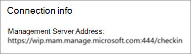

# Verificare le impostazioni di protezione delle app nei PC Windows 10

## Verificare che gli utenti non possano copiare i dati aziendali in file personali sui dispositivi aziendali

Dopo aver [configurato i criteri di protezione delle app](protection-settings-for-windows-10-devices.md), possono essere necessarie alcune ore prima che i criteri siano applicati ai dispositivi degli utenti. Se è  stata attivata l'impostazione Impedisci agli utenti di copiare i dati aziendali nei file personali e di forzarli a salvare i file di lavoro in **OneDrive for Business** per i dispositivi di proprietà dell'azienda, è possibile controllare questa opzione nel dispositivo dell'utente dopo essersi connessi ad Azure AD e aver eseguito l'accesso. 
  
 **Verificare le impostazioni di connessione**
  
1. Dopo l'accesso con le credenziali di Microsoft 365 Business Premium e la connessione ad Azure AD come descritto in Configurare i dispositivi Windows per gli utenti di [Microsoft 365 Business Premium,](set-up-windows-devices.md)passare a Impostazioni di **Windows** Account Accesso all'azienda o all'istituto di \>  \> **istruzione.** Scegliere **Connesso ad Azure \<tenant name\> AD** e quindi **Info.**
    
    
  
2. Nella pagina **Gestito da** puoi visualizzare le informazioni di connessione che includono un indirizzo del server di gestione come quello mostrato \<tenant name\> nella figura seguente.   
    
    
  
 **Verificare che non sia possibile incollare i dati aziendali in un'app non gestita**
  
1. Aprire Outlook 2016 installato da Microsoft 365 Business Premium.
    
2. Aprire un messaggio di posta elettronica e copiare parte del contenuto del messaggio.
    
    Aprire Blocco note e provare a incollare il contenuto.
    
    Riceverai un errore che indica che l'app non può accedere al contenuto.
    
    
  
    Lo stesso contenuto può però essere incollato in Word 2016.
    
## Verificare che gli utenti non possano copiare i dati aziendali in file personali sui dispositivi personali

 **Verificare le impostazioni di connessione**
  
1. Nel dispositivo personale di Windows 10 in cui hai effettuato l'accesso come utente locale, vai a Impostazioni di **Windows** e tocca o fai clic **su** Account Accedi all'ambiente di lavoro o \> **all'istituto di istruzione.**
    
2. Scegliere **Connetti** in **Accedi all'azienda o all'istituto di istruzione**.
    
3. Immetti le credenziali di Microsoft 365 Business Premium nella finestra di dialogo Configura un account aziendale o **dell'istituto di istruzione** \> **Accedi.**
    
4. Nella pagina **Accedi all'azienda o all'istituto di istruzione** scegliere **Account aziendale o dell'istituto di istruzione**, quindi scegliere **Informazioni**.
    
    
  
5. Nella pagina **Accedi** all'istituto di  istruzione o all'istituto di istruzione puoi visualizzare le informazioni di connessione che includono un indirizzo del **server** di gestione come quello mostrato nella figura seguente e che include le parole *wip* e *mam* all'interno. 
    
    
  
 **Verificare che non sia possibile incollare i dati aziendali in un'app non gestita**
  
1. Aprire Outlook 2016 e aggiungere l'account Microsoft 365 Business Premium, se necessario, e accedere con le credenziali di Microsoft 365 Business Premium.
    
2. Aprire un messaggio di posta elettronica e copiare parte del contenuto del messaggio.
    
    Aprire Blocco note e provare a incollare il contenuto.
    
    Riceverai un errore che indica che l'app non può accedere al contenuto.
    
    
  
    Lo stesso contenuto può però essere incollato in Word 2016.
    

