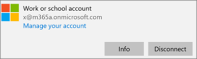

# Verificare le impostazioni di protezione delle app nei PC Windows 10Validate app protection settings on Windows 10 PCs

## Verificare che gli utenti non possano copiare i dati aziendali in file personali sui dispositivi aziendaliVerify that users cannot copy company data to personal files on corporate devices

Dopo aver [configurato i criteri di protezione delle app](protection-settings-for-windows-10-devices.md), possono essere necessarie alcune ore prima che i criteri siano applicati ai dispositivi degli utenti. Se è stata **attivata** l'impostazione **Impedisci agli utenti di copiare dati aziendali in file personali e forzali a salvare i file di lavoro in OneDrive for Business** per i dispositivi di proprietà dell'azienda, è possibile eseguire questo controllo nel dispositivo dell'utente dopo che si è connesso ad Azure Active Directory e ha eseguito l'accesso.After you [set up app protection policies](protection-settings-for-windows-10-devices.md), it may take up to a few hours for the policy to take effect on users' devices. If you turned **On** the **Prevent users from copying company data to personal files and force them to save work files to OneDrive for Business** setting for company owned devices, you can check this on the user's device after they have connected to Azure AD and signed in. 
  
 **Verificare le impostazioni di connessione****Verify connection settings**
  
1. After you sign in with Microsoft 365 Business credentials and connect to Azure AD as described in [Set up Windows devices for Microsoft 365 Business users](set-up-windows-devices.md), go to **Windows Settings** \> **Accounts** \> **Access work or school**. Choose **Connected to \<tenant name\> Azure AD**, and then choose **Info**.After you sign in with Microsoft 365 Business credentials and connect to Azure AD as described in [Set up Windows devices for Microsoft 365 Business users](set-up-windows-devices.md), go to **Windows Settings** \> **Accounts** \> **Access work or school**. Choose **Connected to \<tenant name\> Azure AD**, and then choose **Info**.
    
    
  
2. Nella pagina **Gestito da** \<nome tenant\> è possibile visualizzare le **Informazioni di connessione** che includono un **Indirizzo server di gestione** come quello visualizzato nella figura seguente.On the **Managed by** \<tenant name\> page you can see the **Connection info** that includes a **Management Server Address** like the one shown in the following figure. 
    
    
  
 **Verificare che non sia possibile incollare dati aziendali in un'app non gestita****Verify that you cannot paste company data to a non-managed app**
  
1. Aprire Outlook 2016 installato da Microsoft 365 Business.Open Outlook 2016 that was installed by Microsoft 365 Business.
    
2. Aprire un messaggio di posta elettronica e copiare parte del contenuto del messaggio.Open an email and copy some content from it.
    
    Aprire Blocco note e provare a incollare il contenuto.Open Notepad and attempt to paste the content in.
    
    Si riceverà un messaggio di errore che indica che l'app non può accedere al contenuto.You will receive an error that states App can't access content.
    
    
  
    Lo stesso contenuto può però essere incollato in Word 2016.You can, however, paste the same content into Word 2016.
    
## Verificare che gli utenti non possano copiare i dati aziendali in file personali sui dispositivi personaliVerify that users cannot copy company data to personal files on personal devices

 **Verificare le impostazioni di connessione****Verify connection settings**
  
1. Nel dispositivo personale Windows 10 in cui si è connessi come utente locale, passare a **Impostazioni di Windows** e fare clic o toccare **Account** \> **Accedi all'azienda o all'istituto di istruzione**.On your Windows 10 personal device where you are logged in as a local user, go to **Windows Settings** and click or tap **Accounts** \> **Access work or school**.
    
2. Scegliere **Connetti** in **Accedi all'azienda o all'istituto di istruzione**.Under the **Access work or school**, choose **Connect**.
    
3. Immettere le credenziali di Microsoft 365 Business nella finestra di dialogo **Imposta un account aziendale o dell'istituto di istruzione** \> **Accedi**.Enter your Microsoft 365 Business credential into the **Set up a work or school account dialog** \> **Sign in**.
    
4. Nella pagina **Accedi all'azienda o all'istituto di istruzione** scegliere **Account aziendale o dell'istituto di istruzione**, quindi scegliere **Informazioni**.On the **Access work or school** page, choose the **Work or school account**, and then choose **Info**.
    
    
  
5. Nella pagina **Accedi all'azienda o all'istituto di istruzione** è possibile visualizzare le **Informazioni di connessione** che includono un **Indirizzo server di gestione** come quello visualizzato nella figura seguente e le parole  *wip*  e  *mam*  .On the **Access work or school** page you can see the **Connection info** that includes a **Management Server Address** like the one shown in the following figure, and includes the words  *wip*  and  *mam*  within. 
    
    
  
 **Verificare che non sia possibile incollare dati aziendali in un'app non gestita****Verify that you cannot paste company data to a non-managed app**
  
1. Aprire Outlook 2016 e aggiungere l'account di Microsoft 365 Business, se necessario, quindi accedere con le credenziali di Microsoft 365 Business.Open Outlook 2016 and add your Microsoft 365 Business account if necessary and sign in with your Microsoft 365 Business credentials.
    
2. Aprire un messaggio di posta elettronica e copiare parte del contenuto del messaggio.Open an email and copy some content from it.
    
    Aprire Blocco note e provare a incollare il contenuto.Open Notepad and attempt to paste the content in.
    
    Si riceverà un messaggio di errore che indica che l'app non può accedere al contenuto.You will receive an error that states App can't access content.
    
    
  
    Lo stesso contenuto può però essere incollato in Word 2016.You can, however, paste the same content into Word 2016.
    

