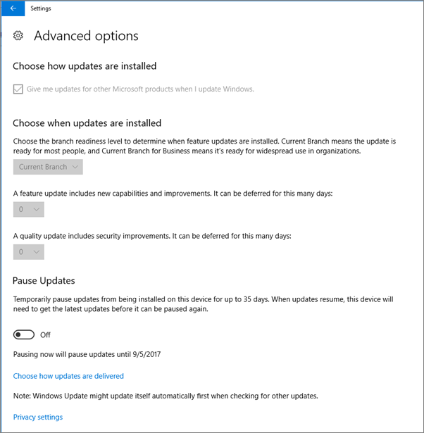

# Verificare le impostazioni di protezione nei PC Windows 10Validate device protection settings on Windows 10 PCs

## Verificare che siano impostati i criteri per i dispositivi Windows 10Verify that Windows 10 device policies are set

Dopo aver [configurato i criteri per i dispositivi](protection-settings-for-windows-10-pcs.md), possono essere necessarie alcune ore prima che i criteri siano applicati ai dispositivi degli utenti.After you [set up devices policies](protection-settings-for-windows-10-pcs.md), it may take up to a few hours for the policy to take effect on users' devices. Per verificare che i criteri siano stati applicati, esaminare le diverse schermate delle impostazioni di Windows sui dispositivi degli utenti.You can confirm that the policies took effect by looking at various Windows Settings screens on the users' devices. Poiché gli utenti non saranno in grado di modificare le impostazioni di Windows Update e Windows Defender antivirus nei dispositivi Windows 10, molte opzioni saranno disabilitate.Because the users won't be able to modify the Windows Update and Windows Defender Antivirus settings on their Windows 10 devices, many options will be grayed out.
  
1. Passare a **Impostazioni** \> \*\*aggiornare &amp; \*\* le opzioni di sicurezza \> di **Windows Update** \> **Restart** e verificare che tutte le impostazioni siano disabilitate.Go to **Settings** \> **Update &amp; security** \> **Windows Update** \> **Restart options** and confirm that all settings are grayed out. 
    
    
  
2. Andare a **Impostazioni** \> \*\*aggiornare &amp; \*\* le opzioni di sicurezza \> di **Windows Update** \> **Advanced** e verificare che tutte le impostazioni siano disabilitate.Go to **Settings** \> **Update &amp; security** \> **Windows Update** \> **Advanced options** and confirm that all settings are grayed out. 
    
    
  
3. Go to **Settings** \> **Update &amp; security** \> **Windows Update** \> **Advanced options** \> **Choose how updates are delivered**.Go to **Settings** \> **Update &amp; security** \> **Windows Update** \> **Advanced options** \> **Choose how updates are delivered**.
    
    Confermare che è possibile visualizzare il messaggio (in rosso) che alcune impostazioni sono nascoste o gestite dall'organizzazione e tutte le opzioni sono disattivate.Confirm that you can see the message (in red) that some settings are hidden or managed by your organization, and all the options are grayed out.
    
    
  
4. To open the Windows Defender Security Center, go to **Settings** \> **Update &amp; security** \> **Windows Defender** \> click **Open Windows Defender Security Center** \> **Virus &amp; thread protection** \> **Virus &amp; threat protection settings**.To open the Windows Defender Security Center, go to **Settings** \> **Update &amp; security** \> **Windows Defender** \> click **Open Windows Defender Security Center** \> **Virus &amp; thread protection** \> **Virus &amp; threat protection settings**. 
    
5. Verificare che tutte le opzioni siano disattivate.Verify that all options are grayed out. 
    
    
  
## Argomenti correlatiRelated Topics

[Documentazione e risorse su Microsoft 365 per le aziendeMicrosoft 365 for business documentation and resources](https://go.microsoft.com/fwlink/p/?linkid=853701)
  
[Introduzione a Microsoft 365 for businessGet started with Microsoft 365 for business](microsoft-365-business-overview.md)
  
[Gestire Microsoft 365 for businessManage Microsoft 365 for business](manage.md)
  
[Impostare le configurazioni dei dispositivi per PC Windows 10Set device configurations for Windows 10 PCs](protection-settings-for-windows-10-pcs.md)
  

