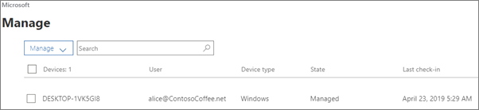

# Visualizzare e gestire criteri e dispositivi

Questo articolo si applica a Microsoft 365 Business Premium.

## Visualizzare e modificare i criteri dei dispositivi

1.  Passare all'interfaccia di amministrazione all'indirizzo <a href="https://go.microsoft.com/fwlink/p/?linkid=837890" target="_blank">https://admin.microsoft.com</a>.
2. Nel riquadro di spostamento sinistro scegliere **Criteri** \> **dispositivi.**

    In questa pagina è possibile creare, modificare, modificare il gruppo di destinazione o eliminare un criterio.

    
  
## Visualizzare e gestire i dispositivi

1. Nel riquadro di spostamento sinistro scegliere **Gestione** \> **dispositivi**. 
    
    In questa pagina puoi selezionare uno o più dispositivi e rimuovere i dati aziendali. Per i dispositivi Windows 10 per cui sono state configurate le impostazioni di protezione dispositivo, è anche possibile scegliere di ripristinare le impostazioni del produttore.
  
   

