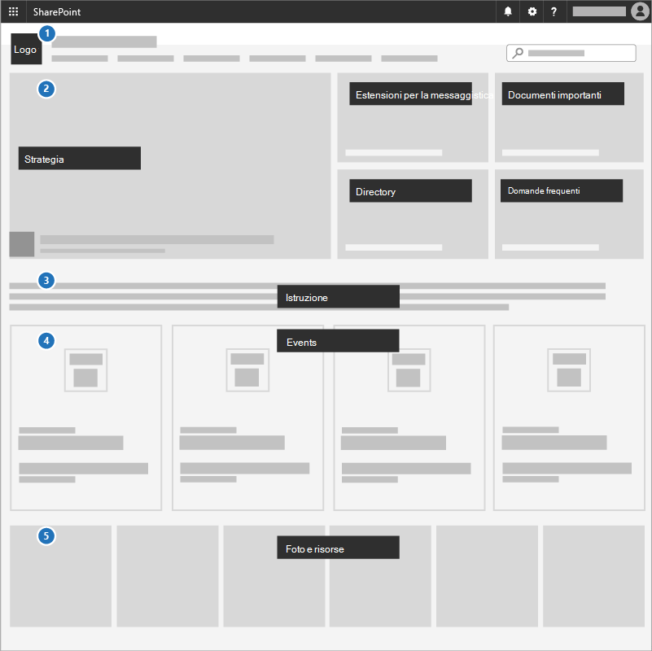

# Creare un sito per le comunicazioni per la propria campagnaCreate a communications site for your campaign

Un ottimo modo per comunicare le priorità, condividere documenti strategici ed evidenziare gli eventi imminenti consiste nell'utilizzare un sito per le comunicazioni in SharePoint.A great way to communicate priorities, share strategy documents, and highlight upcoming events is to use a communications site in SharePoint. I siti di comunicazione sono per la condivisione di elementi in generale nell'intera campagna; è il sito della campagna interna.Communications sites are for sharing things broadly across your whole campaign; it's your internal campaign site.

## Procedure consigliateBest practices

Includere gli elementi seguenti nel sito di comunicazione:Include the following elements in your Communications site:

1. Aggiungere il logo e i colori della campagna come immagine di intestazione e temaAdd your campaign logo and colors as a header image and theme
2. Guida con la strategia, il messaggio, i documenti importanti, una directory e le domande frequenti in una **Web part Hero**.Lead with your strategy, message, important documents, a directory, and FAQ in a **Hero web part**.
3. Includere un'istruzione candidata per il team in una **Web part di testo**.Include a candidate statement to the team in a **Text web part**.
4. Aggiungere eventi della campagna a una **Web part eventi** in modo che tutti possano vedere cosa succede.Add campaign events to an **Events web part** so everyone can see what's coming up.
5. Aggiungere foto che gli utenti possono utilizzare o condividere con una **Web part raccolta immagini**.Add photos that people can use or share to an **Image gallery web part**.

## Infografica: creare un sito di comunicazione infograficaInfographic: Create a Communications Site infographic 
I collegamenti seguenti per PowerPoint e PDF possono essere scaricati e stampati in formato tabloid (noto anche come Ledger, 11 x 17 o a3).The following links for PowerPoint and PDF can be downloaded and printed in tabloid format (also known as ledger, 11 x 17, or A3).

 | [PowerPoint](https://github.com/MicrosoftDocs/microsoft-365-docs-pr/raw/live/m365-democracy/microsoft-365/campaigns/downloads/M365CampaignsCreateCommunicationSite.pptx) (PDF)[PDF](downloads/M365CampaignsCreateCommunicationSite.pdf) | [PowerPoint](https://github.com/MicrosoftDocs/microsoft-365-docs-pr/raw/live/m365-democracy/microsoft-365/campaigns/downloads/M365CampaignsCreateCommunicationSite.pptx)

## ConfigurazioneSet it up

1. Accedere a https://Office.com.Sign in to https://Office.com.
2. Nell'angolo superiore sinistro della pagina, selezionare l'icona di avvio delle app e quindi selezionare il riquadro di **SharePoint** .In the top-left corner of the page, select the app launcher icon and then select the **SharePoint** tile. Se non si Visualizza il riquadro di **SharePoint** , fare clic sul riquadro **siti** o su **tutti** se SharePoint non è visibile.If you don't see the **SharePoint** tile, click the **Sites** tile or **All** if SharePoint isn't visible.
3. Nella parte superiore della Home page di SharePoint fare clic su **+ Crea sito** e scegliere l'opzione **sito di comunicazione** .At the top of the SharePoint home page, click **+ Create site** and choose the **Communication site** option.

Informazioni su tutti i siti di comunicazione e [su](https://support.office.com/article/What-is-a-SharePoint-communication-site-94A33429-E580-45C3-A090-5512A8070732) come [creare un sito di comunicazione in SharePoint Online](https://support.office.com/article/Create-a-communication-site-in-SharePoint-Online-7FB44B20-A72F-4D2C-9173-FC8F59BA50EB).Learn all [about Communications sites](https://support.office.com/article/What-is-a-SharePoint-communication-site-94A33429-E580-45C3-A090-5512A8070732) and how to [create a communication site in SharePoint Online](https://support.office.com/article/Create-a-communication-site-in-SharePoint-Online-7FB44B20-A72F-4D2C-9173-FC8F59BA50EB).

## Impostazioni di amministratoreAdmin settings

Se non si Visualizza il collegamento **+ Crea** sito, la creazione di siti in modalità self-service potrebbe non essere disponibile in Microsoft 365.If you don't see the **+ Create** site link, self-service site creation might not be available in Microsoft 365. Per creare un sito del team, contattare la persona che amministra Microsoft 365 nell'organizzazione.To create a team site, contact the person administering Microsoft 365 in your organization. Se si è un amministratore Microsoft 365, vedere [gestire la creazione di siti in SharePoint Online](https://docs.microsoft.com/sharepoint/manage-site-creation) per abilitare la creazione di siti in modalità self-service per l'organizzazione o [gestire i siti nel nuovo](https://docs.microsoft.com/sharepoint/manage-sites-in-new-admin-center) interfaccia di amministrazione di SharePoint per creare un sito dall'interfaccia di amministrazione di SharePoint Online.If you're a Microsoft 365 admin, see [Manage site creation in SharePoint Online](https://docs.microsoft.com/sharepoint/manage-site-creation) to enable self-service site creation for your organization or [Manage sites in the new SharePoint admin center](https://docs.microsoft.com/sharepoint/manage-sites-in-new-admin-center) to create a site from the SharePoint Online admin center.
  
