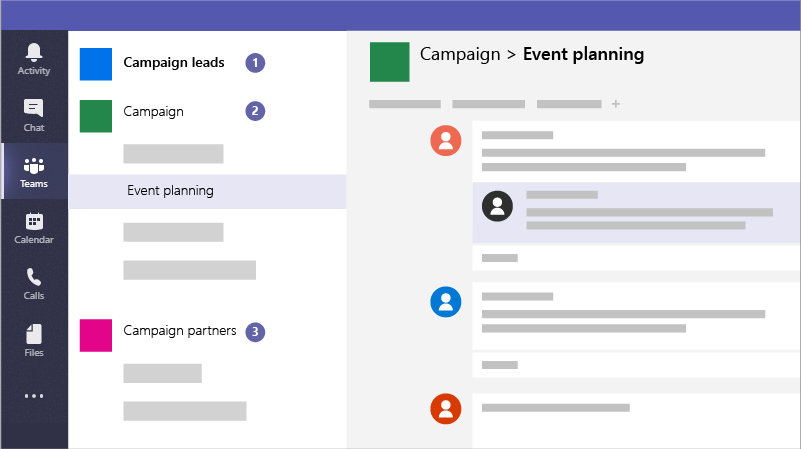

# Creare team per la collaborazione in Microsoft Teams

Microsoft teams è un'app di collaborazione che aiuta il personale a rimanere organizzato e a dialogare da qualsiasi dispositivo. È possibile utilizzare Microsoft teams per avere conversazioni istantanee con i membri del personale o gli ospiti esterni all'organizzazione. È inoltre possibile effettuare chiamate telefoniche, riunioni host e condivisione di file.

## Procedure consigliate

Ad esempio, le campagne possono creare i seguenti team per comunicare e collaborare in modo sicuro:

1. **Una campagna conduce il team:** Configurarlo come team privato in modo che solo i membri della campagna chiave possano accedervi e discutere di problemi potenzialmente sensibili.
2. **Un team della campagna generale:** Questo è il modo in cui tutti devono essere utilizzati per le comunicazioni quotidiane e per il lavoro. Gli utenti, i gruppi o i comitati possono configurare i canali in questo team per svolgere il proprio lavoro. Ad esempio, le persone che pianificano eventi possono configurare un canale per la chat e coordinare la logistica per gli eventi della campagna.
3. **Un team di partner:** Si tratta di un team in cui è possibile coordinarsi con i fornitori, i partner o i volontari senza che questi possano essere sensibili.

È inoltre possibile creare team per progetti specifici e applicare la giusta quantità di protezione in base a chi deve essere incluso. 

Quando si crea un team, ecco cos'altro viene creato:

- Un nuovo [gruppo di Office 365](https://docs.microsoft.com/en-us/MicrosoftTeams/office-365-groups)
- Un sito e una raccolta documenti di [SharePoint Online](https://docs.microsoft.com/en-us/MicrosoftTeams/sharepoint-onedrive-interact) per archiviare i file del team
- Una cassetta postale condivisa e un calendario di [Exchange Online](https://docs.microsoft.com/en-us/MicrosoftTeams/exchange-teams-interact)
- Un blocco appunti di OneNote
- Collegamenti ad altre app di Office 365 come Planner e Power BI

All'interno di Microsoft teams, è possibile trovare:
1. **Teams:** Individuare i canali a cui appartengono o crearne di propri. Canali all'interno è possibile tenere riunioni sul posto, avere conversazioni e condividere file.

2. **Riunioni:** Vedere tutto quello che è stato allineato per il giorno o la settimana. In alternativa, pianificare una riunione. Questo calendario è sincronizzato con il calendario di Outlook.
 
3. **Chiamate:** In alcuni casi, se l'organizzazione è stata configurata, è possibile chiamare chiunque da Microsoft teams, anche se non si utilizza Microsoft teams.

4. **Attività:** Recuperare il ritardo su tutti i messaggi non letti, @mentions, risposte e altro ancora. 

Nella parte superiore della finestra di comando, utilizzare la casella di controllo per cercare elementi o utenti specifici, eseguire azioni rapide e avviare app.

## Configurazione

Creare un team privato solo per il responsabile della campagna e il candidato come questo. 

> [!VIDEO https://www.microsoft.com/videoplayer/embed/RWeqWA]

Creare un team a livello di organizzazione che tutti gli utenti della campagna possano utilizzare per la comunicazione e la condivisione dei file.

> [!VIDEO https://www.microsoft.com/videoplayer/embed/RE2GCG9]

Creare un team condiviso con gli utenti esterni alla campagna, ad esempio la pubblicità del finanziamento.

> [!VIDEO https://www.microsoft.com/videoplayer/embed/RE1FQMp]

Per ulteriori informazioni su Microsoft teams, vedere [documentazione tecnica su Microsoft teams](https://docs.microsoft.com/en-us/microsoftteams/microsoft-teams)

## Impostazioni di amministratore

È necessario essere un amministratore per creare un team a livello di organizzazione. Per ulteriori informazioni, vedere [che cos'è un amministratore in Office 365?](https://support.office.com/en-us/article/what-is-an-admin-e123627e-4892-4461-b9aa-1b6d57a5cfa4?ui=en-US&rs=en-US&ad=US).
  