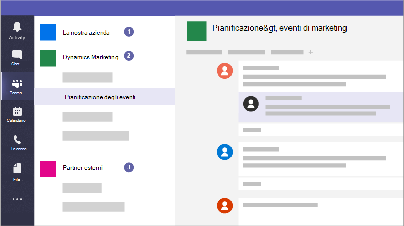

# Creare team per la collaborazione in Microsoft TeamsCreate teams for collaboration in Microsoft Teams

Microsoft Teams è un'app di collaborazione che consente al personale di organizzare e organizzare conversazioni da qualsiasi dispositivo.Microsoft Teams is a collaboration app that helps your staff stay organized and have conversations, from any device. È possibile usare Microsoft Teams per conversazioni istantanee con membri del personale o utenti guest esterni all'organizzazione.You can use Microsoft Teams to have instant conversations with members of your staff or guests outside your organization. È inoltre possibile effettuare chiamate telefoniche, ospitare riunioni e condividere file.You can also make phone calls, host meetings, and share files.

## Procedure consigliateBest practices

1. Creare team privati per informazioni riservate.Create private teams for sensitive information.
1. Creare un team a livello di organizzazione per le comunicazioni con tutti gli utenti dell'organizzazione.Create an org-wide team for communication with everyone across your organization.
1. Creare team per progetti specifici e applicare la giusta protezione in base a chi deve essere incluso.Create teams for specific projects and apply the right amount of protection based on who should be included.
1. Creare team specifici per la comunicazione con i partner esterni per mantenerli separati da qualsiasi elemento sensibile per l'azienda.Create specific teams for communication with external partners to keep them separate from anything sensitive for your business.

Ad esempio, un'azienda, una società legale o una pratica sanitaria potrebbe creare i team seguenti:For example, a business, legal firm, or healthcare practice could create the following teams:

1. **Un team aziendale, aziendale** o pratico: Questo è per tutti gli utenti da usare per le comunicazioni quotidiane e il lavoro in tutta l'azienda.**A business-, firm-, or practice-wide team:** This is for everyone to use for day to day communications and work across your business. È possibile utilizzare questo team per pubblicare annunci o condividere informazioni di interesse per l'intera azienda o pratica.You can use this team to post announcements or share information of interest for your whole firm or practice.
1. **Team individuali:** Configurare i team per i gruppi più piccoli per collaborare sul loro lavoro quotidiano.**Individual teams:** Set up teams for smaller groups to collaborate about their day to day work.
1. **Uno o più team di comunicazione esterni:** Coordinarsi con i fornitori, i partner o i clienti senza consentire loro di entrare in qualcosa di sensibile.**An external communications team or teams:** Coordinate with your vendors, partners, or clients without allowing them into anything sensitive. Configurare canali diversi per gruppi specifici.Set up different channels for specific groups.

E le campagne potrebbero creare i team seguenti per comunicare e collaborare in modo sicuro:And campaigns could create the following teams to communicate and collaborate securely:

1. **Un team di lead della campagna:** Configura questa impostazione come team privato in modo che solo i membri chiave della campagna possano accedervi e discutere di problemi potenzialmente sensibili.**A campaign Leads team:** Set this up as a private team so that only your key campaign members can access it and discuss potentially sensitive concerns.
2. **Un team della campagna generale:** Questo è per tutti gli utenti da usare per le comunicazioni quotidiane e il lavoro.**A general campaign team:** This is for everyone to use for day to day communications and work. Gli utenti, i gruppi o i gruppi possono configurare canali in questo team per eseguire il proprio lavoro.Individuals, groups, or committees can set up channels in this team to do their work. Ad esempio, gli utenti che pianificano l'evento possono configurare un canale per chattare e coordinare la logistica per gli eventi della campagna.For example, the event planning people can set up a channel to chat and coordinate logistics for campaign events.
3. **Un team partner:** Coordinarsi con i fornitori, i partner o i volontari senza consentire loro di entrare in qualcosa di sensibile.**A partners team:** Coordinate with your vendors, partners, or volunteers without allowing them into anything sensitive.

Quando si crea un team, vengono creati altri elementi:When you create a team, here's what else gets created:

- Un nuovo [gruppo di Microsoft 365](https://docs.microsoft.com/MicrosoftTeams/office-365-groups)A new [Microsoft 365 group](https://docs.microsoft.com/MicrosoftTeams/office-365-groups)
- Un sito e una raccolta documenti di [SharePoint Online](https://docs.microsoft.com/MicrosoftTeams/sharepoint-onedrive-interact) per archiviare i file del teamA [SharePoint Online](https://docs.microsoft.com/MicrosoftTeams/sharepoint-onedrive-interact) site and document library to store team files
- Una [cassetta postale e un](https://docs.microsoft.com/MicrosoftTeams/exchange-teams-interact) calendario condivisi di Exchange OnlineAn [Exchange Online](https://docs.microsoft.com/MicrosoftTeams/exchange-teams-interact) shared mailbox and calendar
- Un blocco appunti di OneNoteA OneNote notebook
- Ties into other Office 365 apps such as Planner and Power BITies into other Office 365 apps such as Planner and Power BI

All'interno di Microsoft Teams, è possibile trovare:Inside Microsoft Teams, you can find:

1. **Teams:** Trovare i canali a cui appartenere o crearne di propri.**Teams:** Find channels to belong to or create your own. All'interno dei canali è possibile tenere riunioni sul posto, avere conversazioni e condividere file.Inside channels you can hold on-the-spot meetings, have conversations, and share files.
2. **Riunioni:** Vedere tutto ciò che hai allineato per il giorno o la settimana.**Meetings:** See everything you've got lined up for the day or week. In caso contrario, pianificare una riunione.Or, schedule a meeting. Questo calendario viene sincronizzato con il calendario di Outlook.This calendar syncs with your Outlook calendar.
3. **Chiamate:** In alcuni casi, se l'organizzazione lo ha configurato, è possibile chiamare chiunque da Microsoft Teams, anche se non usa Microsoft Teams.**Calls:** In some cases, if your organization has it set up, you can call anyone from Microsoft Teams, even if they're not using Microsoft Teams.
4. **Attività:** Recuperare tutti i messaggi non letti, le @mentions, le risposte e altro ancora.**Activity:** Catch up on all your unread messages, @mentions, replies, and more.

Usa la casella di comando nella parte superiore per cercare elementi o persone specifici, eseguire azioni rapide e avviare app.Use the command box at the top to search for specific items or people, take quick actions, and launch apps.

## ConfigurazioneSet it up

Crea un team privato solo per il titolare dell'azienda e i manager, oppure per il manager della campagna e per il candidato in questo modo.Create a private team for just the business owner and managers, or campaign manager and candidate like this.

> [!VIDEO https://www.microsoft.com/videoplayer/embed/RWeqWA]

Creare un team a livello di organizzazione che tutti gli utenti dell'azienda o della campagna possono usare per comunicare e condividere file.Create an organization-wide team that everyone in the business or campaign can use to communicate and share files.

> [!VIDEO https://www.microsoft.com/videoplayer/embed/RE2GCG9]

Creare un team da condividere con utenti guest esterni all'organizzazione, ad esempio per la pubblicità o le finanze.Create a team that you share with guests outside your organization, such as for advertising or finances.

> [!VIDEO https://www.microsoft.com/videoplayer/embed/RE1FQMp]

Ulteriori informazioni su Microsoft Teams nella [documentazione tecnica di Microsoft Teams](https://docs.microsoft.com/microsoftteams/microsoft-teams)Learn more about Microsoft Teams at [Microsoft Teams technical documentation](https://docs.microsoft.com/microsoftteams/microsoft-teams)

## Impostazioni amministratoreAdmin settings

È necessario essere un amministratore per creare un team a livello di organizzazione.You must be an admin to create an organization-wide team. Per altre informazioni, vedere [Che cos'è un amministratore in Microsoft 365?](https://support.office.com/article/what-is-an-admin-e123627e-4892-4461-b9aa-1b6d57a5cfa4?ui=en-US&rs=en-US&ad=US).For more information, see [What is an Admin in Microsoft 365?](https://support.office.com/article/what-is-an-admin-e123627e-4892-4461-b9aa-1b6d57a5cfa4?ui=en-US&rs=en-US&ad=US).
