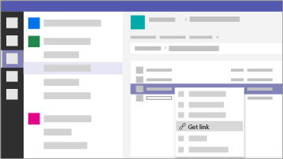

Microsoft 365 per le campagne
===========================

Oggigiorno proteggere i dati e le comunicazioni è una priorità, soprattutto per le campagne politiche, gli studi medici e legali e molte altre aziende. Microsoft 365 per le campagne include una serie di suggerimenti il cui scopo è aiutare a proteggere se stessi e i propri dati. Questa raccolta include informazioni per configurare e usare questo ambiente consigliato, anche se non è in corso una campagna.

> [!VIDEO https://www.microsoft.com/videoplayer/embed/RE3clbH] 

**Cos'è Microsoft 365 per le campagne?** È una configurazione sicura consigliata che include Microsoft 365 Business Premium e che consente di:
- Usare strumenti di produttività e collaborazione aziendali attendibili, tra cui Outlook, Word, Excel e altri prodotti di Office. 
- Proteggere i file di lavoro in tutti i dispositivi iOS, Android e Windows 10 con sicurezza di livello aziendale semplice da gestire 
- Applicare una protezione aggiuntiva per account utente e identità 

Benché le campagne elettorali federali negli Stati Uniti siano idonee a ricevere prezzi speciali per Microsoft 365 Business Premium, qualsiasi organizzazione che acquisti il piano può trarre vantaggio da queste indicazioni per aumentare la sicurezza e imparare a collaborare in modo sicuro.

La raccolta include i seguenti elementi:
- Linee guida per la configurazione per una maggiore sicurezza.
- Guida per gli utenti per configurare dispositivi per l'accesso sicuro.
- Consigli per collaborare e condividere i dati in modo sicuro.

Per altre informazioni sul contenuto incluso, vedere [Microsoft 365 Business Premium](https://www.microsoft.com/microsoft-365/business). 

Per iniziare
--------------------------

<ul class="panelContent cardsJ">
    <li>
        

            

                

                    

                        

                            
                        

                    

                    

                        
<b>Seguire questi passaggi per iniziare:</b>

                        
<a href="get-microsoft-365-campaigns.md">Ottenere Microsoft 365 per le campagne</a>

                        
<a href="m365-campaigns-users.md">Scoprire in che modo gli utenti useranno Microsoft 365</a>

                        
<a href="microsoft-365-campaigns-setup-overview.md">Configurare Microsoft 365 per le campagne</a>

                    

                

            

        

    </li>
</ul>

Soluzioni per la campagna o per le piccole imprese
--------------------------

Dopo aver configurato l'ambiente Microsoft 365, è possibile usare le soluzioni seguenti per iniziare a lavorare:

<ul class="panelContent cardsW cols cols2">
    <li>
        

            

                

                    

                        

                            
                        

                    

                    

                        <h3>Creare team per collaborare</h3>
                        
Creare uno spazio per le comunicazioni e la collaborazione con team specifici per alcuni dipendenti, tutto il personale, partner o fornitori con Microsoft Teams.

                        
<a href="create-teams-for-collaboration.md">Creare il team</a>

                    

                

            

        

    </li>
    <li>
        

            

                

                    

                        

                            
                        

                    

                    

                        <h3>Configurare le riunioni online</h3>
                        
Pianificare una riunione con audio, video e condivisione con Microsoft Teams.

                        
<a href="set-up-meetings.md">Configurare una riunione</a>

                    

                

            

        

    </li>
    <li>
        

            

                

                    

                        

                            
                        

                    

                    

                        <h3>Crittografare o etichettare le comunicazioni di posta elettronica sensibili</h3>
                        
Usare le etichette di crittografia e riservatezza per proteggere i messaggi che contengono informazioni riservate o sensibili.

                        
<a href="send-encrypted-email.md">Inviare messaggi di posta elettronica crittografati</a>

                    

                

            

        

    </li>
    <li>
        

            

                

                    

                        

                            
                        

                    

                    

                        <h3>Creare un sito di comunicazione</h3>
                        
Condividere eventi, messaggi, immagini e altro con il team in un sito di comunicazioni interno creato con SharePoint.

                        
<a href="create-communications-site.md">Creare il sito</a>

                    

                

            

        

    </li>
    <li>
        

            

                

                    

                        

                            
                        

                    

                    

                        <h3>Condividere file e video</h3>
                        
È possibile salvare i file e i video nel cloud, in modo che siano disponibili a tutte le persone autorizzate.

                        
<a href="share-files-and-videos.md">Iniziare a condividere</a>

                    

                

            

        

    </li>
</ul>
