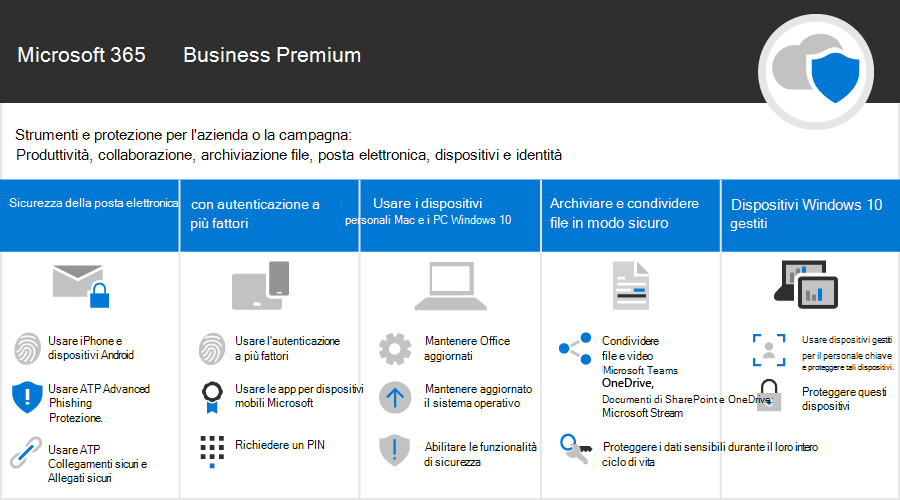

Microsoft 365 per le campagne
===========================

Nel nostro mondo attuale, mantenere i dati e le comunicazioni sicure è una priorità, in particolare per le campagne politiche, le procedure mediche e legali e molte altre aziende. Microsoft 365 per le campagne include una serie di suggerimenti che consentono di proteggere l'utente e i dati. Questa raccolta include la guida per la configurazione e l'utilizzo di questo ambiente consigliato, anche se non si è una campagna.

> [!VIDEO https://www.microsoft.com/videoplayer/embed/RE3clbH] 

**Che cos'è Microsoft 365 per le campagne?** Si tratta di una configurazione sicura consigliata che include Microsoft 365 Business Premium in modo che sia possibile:
- Fare affidamento su strumenti di collaborazione e produttività aziendali attendibili, ad esempio Outlook, Word, Excel e altri prodotti Office 
- Proteggere i file di lavoro su tutti i dispositivi iOS, Android e Windows 10 con sicurezza di livello aziendale semplice da gestire 
- Applicare una protezione supplementare per gli account utente e l'identità 

Mentre le campagne elettorali federali negli Stati Uniti si qualificano per i prezzi speciali per Microsoft 365 Business Premium, qualsiasi organizzazione con questo piano può trarre vantaggio da queste linee guida per configurare una maggiore sicurezza e scoprire come collaborare in modo sicuro.

Questa raccolta include gli elementi seguenti:
- Indicazioni relative all'installazione prescrittiva per l'aggiunta di maggiore sicurezza.
- Guida per gli utenti all'installazione di dispositivi per l'accesso sicuro.
- Linee guida su come collaborare e condividere in modo sicuro.

Per ulteriori informazioni su ciò che è incluso, vedere [Microsoft 365 Business Premium](https://www.microsoft.com/microsoft-365/business). 

Per iniziare
--------------------------

<ul class="panelContent cardsJ">
    <li>
        

            

                

                    

                        

                            
                        

                    

                    

                        
<b>Per iniziare, attenersi alla procedura seguente:</b>

                        
<a href="get-microsoft-365-campaigns.md">Ottenere le campagne Microsoft 365</a>

                        
<a href="m365-campaigns-users.md">Informazioni su come gli utenti funzioneranno con Microsoft 365</a>

                        
<a href="microsoft-365-campaigns-setup-overview.md">Configurare le campagne di Microsoft 365</a>

                    

                

            

        

    </li>
</ul>

Soluzioni per la tua campagna o per le piccole imprese
--------------------------

Dopo aver configurato l'ambiente Microsoft 365 sicuro, è possibile utilizzare le seguenti soluzioni per ottenere il funzionamento:

<ul class="panelContent cardsW cols cols2">
    <li>
        

            

                

                    

                        

                            
                        

                    

                    

                        <h3>Creare team per la collaborazione</h3>
                        
Creare uno spazio per la comunicazione e la collaborazione con team specifici per il personale chiave, tutto il personale e i partner o i fornitori con Microsoft teams.

                        
<a href="create-teams-for-collaboration.md">Creare il team</a>

                    

                

            

        

    </li>
    <li>
        

            

                

                    

                        

                            
                        

                    

                    

                        <h3>Configurare le riunioni online</h3>
                        
Pianificare una riunione con audio, video e condivisione con Microsoft teams.

                        
<a href="set-up-meetings.md">Configurare una riunione</a>

                    

                

            

        

    </li>
    <li>
        

            

                

                    

                        

                            
                        

                    

                    

                        <h3>Crittografare o contrassegnare il messaggio di posta elettronica sensibile</h3>
                        
Utilizzare le etichette di crittografia e sensibilità per proteggere la posta elettronica che contiene informazioni riservate o sensibili.

                        
<a href="send-encrypted-email.md">Inviare messaggi di posta elettronica crittografati</a>

                    

                

            

        

    </li>
    <li>
        

            

                

                    

                        

                            
                        

                    

                    

                        <h3>Creare un sito per le comunicazioni</h3>
                        
Condividere eventi, messaggi, immagini e altro ancora con il team in un sito di comunicazione interno creato con SharePoint.

                        
<a href="create-communications-site.md">Creare il sito</a>

                    

                

            

        

    </li>
    <li>
        

            

                

                    

                        

                            
                        

                    

                    

                        <h3>Condividere file e video</h3>
                        
Salvare i file e i video nel cloud in modo che siano disponibili per tutte le persone appropriate.

                        
<a href="share-files-and-videos.md">Avviare la condivisione</a>

                    

                

            

        

    </li>
</ul>
