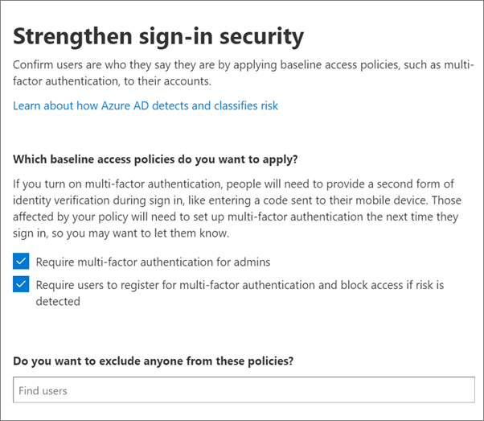

# Richiedere l'autenticazione a più fattori e configurare i criteri di accesso condizionale

È possibile proteggere l'accesso ai dati con l'autenticazione a più fattori e i criteri di accesso condizionale. Questi aggiungono ulteriore sicurezza sostanziale. Microsoft fornisce una serie di criteri di accesso condizionale previsti che sono consigliati per tutti i clienti. I criteri di base sono un insieme di criteri predefiniti che consentono di proteggere le organizzazioni da numerosi attacchi comuni. Questi attacchi comuni possono includere lo spray per la password, la riproduzione e il phishing.

Questi criteri richiedono agli amministratori e agli utenti di immettere una seconda forma di autenticazione (chiamata autenticazione a più fattori o AMF) quando vengono soddisfatte determinate condizioni. Ad esempio, se un utente dell'organizzazione tenta di accedere a Microsoft 365 da un paese diverso o da un dispositivo sconosciuto, l'accesso potrebbe essere considerato rischioso. L'utente deve fornire una forma supplementare di autenticazione, ad esempio un'impronta digitale o un codice, per dimostrare la propria identità. 

Attualmente, i criteri di base includono quanto segue:
- Configurata nell'interfaccia di amministrazione di Microsoft 365:
    - **Richiede** l'autenticazione a più fattori per i ruoli di amministratore più privilegiati, incluso l'amministratore globale.
    - **Protezione dell'utente finale** : richiede l'autenticazione a più fattori per gli utenti solo quando un accesso è rischioso. 
- Configurare il portale di Azure Active Directory:
    - **Blocca l'autenticazione legacy** : le app client meno recenti e alcune nuove app non utilizzano più nuovi protocolli di autenticazione più sicuri. Queste app precedenti possono ignorare i criteri di accesso condizionale e ottenere un accesso non autorizzato all'ambiente. Questo criterio blocca l'accesso da client che non supportano l'accesso condizionale. 
    - **Richiede** l'autenticazione a più fattori per l'accesso agli strumenti di gestione, incluso il portale di Azure (in cui vengono configurati i criteri di base). 

Microsoft consiglia di abilitare tutti questi criteri di base. Dopo aver abilitato questi criteri, agli amministratori e agli utenti verrà richiesto di registrarsi per l'autenticazione a più fattori di Azure.

Per ulteriori informazioni su questi criteri, vedere [What are Baseline Policies](https://docs.microsoft.com/azure/active-directory/conditional-access/concept-baseline-protection)?

## Richiedere la MFA

Per richiedere che tutti gli utenti eseguano l'accesso con una seconda forma di ID:

1. Accedere all'interfaccia di amministrazione <a href="https://go.microsoft.com/fwlink/p/?linkid=837890" target="_blank">https://admin.microsoft.com</a> e scegliere **Setup**.

2. Nella pagina configurazione scegliere **Visualizza** nella scheda **Rendi più sicura** .

    
3. Nella pagina make Sign-in More Secure scegliere **Get Started**.
 
4. Nel riquadro di sicurezza di accesso rinforzato selezionare le caselle di controllo accanto a **Richiedi autenticazione a più fattori per gli amministratori** e **richiedere agli utenti di registrarsi per l'autenticazione a più fattori e bloccare l'accesso se viene rilevato un rischio**.
    Assicurarsi di escludere l'account di amministratore [Emergency](m365-campaigns-protect-admin-accounts.md#create-an-emergency-admin-account) o "Break-Glass" dal requisito AMF nella casella **Trova utenti** .
    
    

5. Scegliere **create Policy** nella parte inferiore della pagina.

## Impostare i criteri di base

1. Andare al [portale di Azure](https://portal.azure.com), quindi passare a accesso condizionale di **Azure Active Directory** \> **Conditional Access** per creare un **nuovo criterio**.

Per ogni criterio, vedere le istruzioni specifiche seguenti:  
    - [Richiedi l'autenticazione a più fattori per gli amministratori](https://docs.microsoft.com/azure/active-directory/conditional-access/howto-baseline-protect-administrators)  
    - [Richiedi l'autenticazione per gli utenti](https://docs.microsoft.com/azure/active-directory/conditional-access/howto-baseline-protect-end-users)  
    - [Bloccare l'autenticazione legacy](https://docs.microsoft.com/azure/active-directory/conditional-access/howto-baseline-protect-legacy-auth)  
    - [Richiedere l'autenticazione dell'AMF per la gestione dei servizi](https://docs.microsoft.com/azure/active-directory/conditional-access/howto-baseline-protect-azure)
    
> [!NOTE]
> I criteri di anteprima non esistono più e gli utenti dovranno creare i propri criteri.

È possibile configurare criteri aggiuntivi, ad esempio per le app client approvate. Per ulteriori informazioni, vedere la [documentazione relativa all'accesso condizionale](https://docs.microsoft.com/azure/active-directory/conditional-access/).
