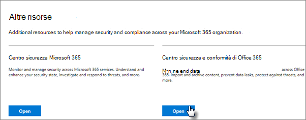
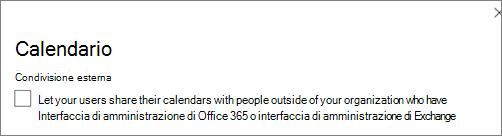

# Protezione avanzata dalle minacce

In questo articolo vengono fornite informazioni utili per aumentare la protezione dell'abbonamento a Microsoft 365 per proteggersi da tentativi di phishing, malware e altre minacce. Tali raccomandazioni sono appropriate per le organizzazioni con un maggiore bisogno di sicurezza, come campagne politiche, studi legali e cliniche sanitarie. 

Prima di iniziare, controllare il Punteggio Microsoft Secure. Microsoft Secure Score analizza la sicurezza dell'organizzazione in base alle normali attività e alle impostazioni di sicurezza e assegna un punteggio. Iniziare prendendo nota del punteggio corrente. L'esecuzione delle azioni consigliate in questo articolo aumenta il punteggio. L'obiettivo non è quello di raggiungere il punteggio massimo, ma di essere a conoscenza delle opportunità di protezione dell'ambiente che non influiscono negativamente sulla produttività per gli utenti. 

Per ulteriori informazioni, vedere [Microsoft Secure Score](https://docs.microsoft.com/microsoft-365/security/mtp/microsoft-secure-score).

## Aumentare il livello di protezione da malware nella posta elettronica

L'ambiente Office 365 o Microsoft 365 include la protezione da malware, ma è possibile aumentare questa protezione bloccando gli allegati con tipi di file comunemente utilizzati per il malware. Per urtare la protezione antimalware nella posta elettronica:
  
1. Accedere a [https://protection.office.com](https://protection.office.com) e accedere con le credenziali dell'account di amministratore. 
    
2. Nel riquadro di &amp; spostamento a sinistra del centro conformità sicurezza fare clic su **criteri** antimalware in **gestione minacce** \> **Anti-Malware**.
    
3. Fare doppio clic sul criterio predefinito per modificare il criterio a livello di società.
    
4. Fare clic su **Impostazioni**.
    
5. In **filtro tipi di allegati comuni**selezionare **On**attivato. I tipi di file bloccati sono elencati nella finestra direttamente sotto questo controllo.  Assicurarsi di aggiungere i tipi di FileType seguenti:
   - Ade, ADP, Ani, Bas, bat, chm, cmd, com, cpl, CRT, HLP, HT, HTA, inf, ins, ISP, job, js, JSE, lnk, MDA, mdb, MDE, MDZ, MSC, MSI, msp, MST (PCD), reg, SCR, SCT, SHS, URL, VB, VBE, vbs, WSC, wsf, WSH, exe, PIF    È possibile aggiungere o eliminare i tipi di file in un secondo momento, se necessario.
    
6. Fare clic su **Salva**.
    
Per ulteriori informazioni, vedere [anti-malware Protection](https://go.microsoft.com/fwlink/?linkid=2015692&amp;clcid=0x409).
  

## Proteggere l'ambiente da ransomware

Ransomware limita l'accesso ai dati crittografando i file o bloccando gli schermi del computer. Tenta quindi di estorcere denaro dalle vittime chiedendo "riscatto", di solito in forma di cryptocurrencies come Bitcoin, in Exchange per l'accesso ai dati. 
  
È possibile proteggere contro ransomware creando una o più regole del flusso di posta per bloccare le estensioni di file comunemente utilizzate per ransomware (queste sono state aggiunte nell' [aumento del livello di protezione da malware in mail](#raise-the-level-of-protection-against-malware-in-mail) Step) oppure per avvisare gli utenti che ricevono questi allegati nella posta elettronica.

Oltre ai file bloccati nel passaggio precedente, è buona norma creare una regola per avvisare gli utenti prima di aprire gli allegati di file di Office che includono macro. Ransomware può essere nascosto all'interno delle macro, quindi avvisa gli utenti di non aprire questi file da persone che non conoscono.

Per creare una regola di trasporto della posta:
  
1. Accedere all'interfaccia di amministrazione <a href="https://go.microsoft.com/fwlink/p/?linkid=837890" target="_blank">https://admin.microsoft.com</a> e scegliere interfaccia di **Amministrazione** di \> **Exchange**.
    
2. Nella categoria **flusso di posta** , fare clic su **regole**.
    
3. Fare clic su **+** , quindi fare clic su **Crea una nuova regola**.
    
4. Fare clic su **altre opzioni** nella parte inferiore della finestra di dialogo per visualizzare il set completo di opzioni. 
    
5. Applicare le impostazioni nella tabella seguente per la regola. Lasciare l'impostazione predefinita per le altre impostazioni, a meno che non si desideri modificarle.
    
6. Fare clic su **Salva**.
    
|**Impostazione**|**Avvisare gli utenti prima di aprire gli allegati dei file di Office**||
|:-----|:-----|:-----|
|Nome    |Regola anti-ransomware: avvisa gli utenti     |
|Applica questa regola se. . .    |Qualsiasi allegato. . . l'estensione del file corrisponde. . .    |
|Specificare parole o frasi    |Aggiungere questi tipi di file:    dotm, docm, xlsm, sltm, xla, xlam, XLL, pptm, potm, ppam, ppsm, sldm   |
|Eseguire le operazioni seguenti. . .    |Invia una notifica al destinatario tramite messaggio    |
|Fornire il testo del messaggio    |Non aprire questi tipi di file da utenti che non si conoscono perché potrebbero contenere macro con codice dannoso.    |
   
Per altre informazioni, vedere:
  
- [Come gestire ransomware](https://go.microsoft.com/fwlink/?linkid=2016501&amp;clcid=0x409)
    
- [Ripristinare il OneDrive](https://support.office.com/article/fa231298-759d-41cf-bcd0-25ac53eb8a15.aspx)
    

## Interrompere l'inoltro automatico per la posta elettronica

Gli hacker che accedono alla cassetta postale di un utente possono rubare la posta impostando la cassetta postale in modo da inoltrare automaticamente la posta elettronica. Ciò può verificarsi anche senza la consapevolezza dell'utente. È possibile evitare che ciò accada configurando una regola del flusso di posta. 
  
Per creare una regola di trasporto della posta, guardare [questo breve video](https://support.office.com/article/f9d693ba-5c78-47c0-b156-8e461e062aa7) o eseguire la procedura seguente:
  
1. Nell'interfaccia di amministrazione di Microsoft 365 fare clic su interfaccia di **Amministrazione** di \> **Exchange**.
    
2. Nella categoria **flusso di posta** , fare clic su **regole**.
    
3. Fare clic su **+** , quindi fare clic su **Crea una nuova regola**.
    
4. Fare clic su **altre opzioni** nella parte inferiore della finestra di dialogo per visualizzare il set completo di opzioni. 
    
5. Applicare le impostazioni nella tabella seguente. Lasciare l'impostazione predefinita per le altre impostazioni, a meno che non si desideri modificarle.
    
6. Fare clic su **Salva**.
    
|**Impostazione**|**Avvisare gli utenti prima di aprire gli allegati dei file di Office**|
|:-----|:-----|
|Nome    |Impedire l'inoltro automatico dei messaggi di posta elettronica ai domini esterni    |
|Applica questa regola se...    |Il mittente. . . è esterno/interno. . . All'interno dell'organizzazione    |
|Aggiungi condizione    |Le proprietà del messaggio. . . includere il tipo di messaggio. . . Inoltro automatico    |
|Eseguire le operazioni seguenti:    |Blocca il messaggio. . . rifiuta il messaggio e Includi una spiegazione.    |
|Fornire il testo del messaggio    |L'inoltro automatico della posta elettronica all'esterno dell'organizzazione è impedito per motivi di sicurezza.    |

## Proteggere la posta elettronica da attacchi di phishing

Se sono stati configurati uno o più domini personalizzati per l'ambiente Office 365 o Microsoft 365, è possibile configurare la protezione anti-phishing mirata. La protezione anti-phishing ATP, parte di Office 365 Advanced Threat Protection, può aiutare a proteggere l'organizzazione da attacchi di phishing basati sulla rappresentazione malevola e altri attacchi di phishing. Se non è stato configurato un dominio personalizzato, non è necessario eseguire questa operazione.
  
Si consiglia di iniziare a utilizzare questa protezione creando un criterio per proteggere gli utenti più importanti e il dominio personalizzato. 

Per creare un criterio di anti-phishing ATP, guardare [questo breve video di formazione](https://support.office.com/article/86c425e1-1686-430a-9151-f7176cce4f2c)o completare i passaggi seguenti:
  
1. Passare a [https://protection.office.com](https://protection.office.com). 
    
2. Nel riquadro di &amp; spostamento a sinistra del centro conformità sicurezza fare clic su **criteri**in **gestione minacce**.
    
3. Nella pagina **criterio** scegliere **ATP anti-phishing**.
    
4. Nella pagina **anti-phishing** selezionare **+ Crea**. Viene avviata una procedura guidata che consente di definire i criteri di anti-phishing.
    
5. Specificare il nome, la descrizione e le impostazioni del criterio come consigliato nel grafico riportato di seguito. Per ulteriori informazioni, vedere informazioni [sulle opzioni dei criteri di anti-phishing ATP](https://docs.microsoft.com/microsoft-365/security/office-365-security/set-up-anti-phishing-policies). 
    
6. Dopo aver esaminato le impostazioni, fare clic su **crea questo criterio** o su **Salva**, a seconda dei casi.
    

|**Impostazione o opzione** |**Impostazione consigliata**  |
|:-----|:-----|
|Nome    |Domain e la maggior parte del personale prezioso della campagna    |
|Descrizione    |Garantire che la maggior parte del personale importante e del nostro dominio non siano rappresentati.    |
|Aggiungere gli utenti da proteggere    |Seleziona **+ Aggiungi una condizione, il destinatario è**. Digitare i nomi utente oppure immettere l'indirizzo di posta elettronica del candidato, del responsabile della campagna e di altri membri del personale importanti. È possibile aggiungere fino a 20 indirizzi interni ed esterni che si desidera proteggere dalla rappresentazione.    |
|Aggiungere i domini da proteggere    |Selezionare **+ Aggiungi una condizione, il dominio del destinatario è**. Se ne è stata definita una, immettere il dominio personalizzato associato all'abbonamento a Microsoft 365. È possibile immettere più di un dominio.    |
|Scegli azioni    |Se la posta elettronica viene inviata da un utente rappresentato: scegliere **reindirizza messaggio a un altro indirizzo di posta elettronica**e quindi digitare l'indirizzo di posta elettronica dell'amministratore della sicurezza. ad esempio, *Alice   @contoso. com*.          Se i messaggi di posta elettronica vengono inviati da un dominio imitato: scegliere di mettere il **messaggio in quarantena**.    |
|Intelligence della cassetta postale    |Per impostazione predefinita, la funzione di intelligence della cassetta postale è selezionata quando si creano nuovi criteri anti-phishing. Per ottenere risultati ottimali, lasciare l’opzione **attiva**.    |
|Aggiungere mittenti e domini attendibili    |Qui è possibile aggiungere il proprio dominio o altri domini attendibili.    |
|Applicato a    |Selezionare **Il dominio del destinatario è**. In **Uno dei seguenti**, selezionare **Scegli**. Selezionare **+ Aggiungi**. Selezionare la casella di controllo accanto al nome del dominio, ad esempio *contoso.   com*, nell'elenco, quindi selezionare **Aggiungi**. Scegliere **Fine**.    |
   
Per ulteriori informazioni, vedere [configurare i criteri di anti-phishing ATP di Office 365](https://docs.microsoft.com/microsoft-365/security/office-365-security/set-up-anti-phishing-policies).
  
## Protezione da allegati, file e collegamenti dannosi con Advanced Threat Protection (ATP)

Prima di tutto, assicurarsi che nell'interfaccia di amministrazione <a href="https://go.microsoft.com/fwlink/p/?linkid=837890" target="_blank">https://admin.microsoft.com</a> si sia attivata la nuova anteprima dell'interfaccia di amministrazione. Attiva l'interruttore accanto al testo **del nuovo**interfaccia di amministrazione.

   

Se la pagina di **installazione** non è ancora visualizzata con le schede del tenant, vedere come eseguire questa procedura nel centro sicurezza e &amp; conformità. Vedere [configurare gli allegati sicuri di ATP nel centro sicurezza & Compliance](#set-up-atp-safe-attachments-in-the-security--compliance-center) e [configurare i collegamenti sicuri di ATP nel centro sicurezza & conformità](#set-up-atp-safe-links-in-the-security--compliance-center).

1.  Nella barra di spostamento a sinistra, scegliere **Setup**.
2. Nella pagina **configurazione** scegliere **Visualizza** nella scheda **aumenta protezione da minacce avanzate** .  
     

3. Nella pagina **aumenta protezione dalle minacce avanzate** scegliere **inizia**.
4. Nel riquadro che si apre, selezionare le caselle di controllo accanto a **collegamenti e allegati di posta elettronica**, **analizzare i file in SharePoint, OneDrive e teams**e **analizzare i collegamenti in Office Desktop e Office Online Apps** in **analisi elementi per contenuti dannosi**.

      - In **collegamenti e allegati di posta elettronica**, digitare tutti gli utenti o gli utenti specifici di cui si desidera analizzare la posta elettronica.

    
5. Scegliere **create Policy** per abilitare gli allegati sicuri di ATP e i collegamenti sicuri ATP.

### Configurare gli allegati sicuri di ATP nel centro sicurezza & Compliance

Gli utenti inviano, ricevono e condividono regolarmente gli allegati, ad esempio documenti, presentazioni, fogli di calcolo e altro ancora. Non è sempre facile stabilire se un allegato è sicuro o dannoso solo guardando un messaggio di posta elettronica. La protezione avanzata dalle minacce di Office 365 include la protezione degli allegati sicuri di ATP, ma questa protezione non è attivata per impostazione predefinita. Si consiglia di creare una nuova regola per iniziare a usare questa protezione. Questa protezione si estende ai file in SharePoint, OneDrive e Microsoft teams.
  
Per creare un criterio degli allegati sicuri di ATP, guardare [questo breve video](https://support.office.com/article/e7e68934-23dc-4b9c-b714-e82e27a8f8a5)o completare i passaggi seguenti:
  
1. Passare a [https://protection.office.com](https://protection.office.com) e accedere con l'account di amministratore. 
    
2. Nel riquadro di &amp; spostamento a sinistra del centro conformità sicurezza fare clic su **criteri**in **gestione minacce**.
    
3. Nella pagina criterio, scegliere **allegati sicuri ATP**.
    
4. Nella pagina allegati sicuri, applicare questa protezione in generale selezionando la casella di controllo **attiva ATP per SharePoint, OneDrive e Microsoft teams** . 
    
5. Selezionare questa **+** impostazione per creare un nuovo criterio. 
    
6. Applicare le impostazioni nella tabella seguente. 
    
7. Dopo aver esaminato le impostazioni, fare clic su **crea questo criterio** o su **Salva**, a seconda dei casi.
    

|**Impostazione o opzione**|**Impostazione consigliata**  |
|:-----|:-----|
|Nome    |Blocca i messaggi di posta elettronica correnti e futuri con malware rilevato.    |
|Descrizione    |Blocca i messaggi di posta elettronica e gli allegati correnti e futuri con malware rilevato.    |
|Save Attachments Unknown Malware Response    |Selezionare **blocca-blocca i messaggi di posta elettronica e gli allegati correnti e futuri con malware rilevato**.    |
|Reindirizza l'allegato sul rilevamento    |Attiva reindirizzamento (selezionare questa casella) immettere l'account di amministratore o la configurazione di una cassetta postale per la quarantena.          Applicare la selezione precedente se la ricerca di malware per gli allegati non è stata eseguita o si verifica un errore (selezionare questa casella).    |
|Applicato a    |Il dominio del destinatario è. . . Selezionare il dominio.    |
   
Per ulteriori informazioni, vedere [configurare i criteri di anti-phishing ATP di Office 365](https://docs.microsoft.com/microsoft-365/security/office-365-security/set-up-anti-phishing-policies).
  
### Configurare i collegamenti sicuri ATP nel centro sicurezza & Compliance

A volte gli hacker nascondono siti Web dannosi nei collegamenti nei messaggi di posta elettronica o in altri file. Office 365 ATP Safe Links (ATP Safe Links), parte di Office 365 Advanced Threat Protection, può aiutare a proteggere l'organizzazione fornendo la verifica del tempo di clic degli indirizzi Web (URL) nei messaggi di posta elettronica e nei documenti di Office. La protezione è definita tramite i criteri collegamenti sicuri di ATP.
  
È consigliabile eseguire le operazioni seguenti:
  
- Modificare il criterio predefinito per aumentare la protezione.
    
- Aggiungere un nuovo criterio indirizzato a tutti i destinatari del dominio.
    
Per configurare i collegamenti sicuri di ATP, guardare [questo breve video di formazione](https://support.office.com/article/61492713-53c2-47da-a6e7-fa97479e97fa)o completare i passaggi seguenti:
  
1. Passare a [https://protection.office.com](https://protection.office.com) e accedere con l'account di amministratore. 
    
2. Nel riquadro di &amp; spostamento a sinistra del centro conformità sicurezza fare clic su **criteri**in **gestione minacce**.
    
3. Nella pagina criterio, scegliere **collegamenti sicuri ATP**.
    
Per modificare il criterio predefinito:
  
1. Nella pagina collegamenti sicuri, in **criteri che si applicano all'intera organizzazione**, selezionare il criterio **predefinito** . 
    
2. In **impostazioni che si applicano al contenuto tranne che alla posta elettronica**, selezionare **Microsoft 365 Apps for Enterprise, Office per iOS e Android**.
    
3. Fare clic su **Salva**. 
    
Per creare un nuovo criterio mirato a tutti i destinatari nel dominio:
  
1. Nella pagina collegamenti sicuri, in **criteri che si applicano all'intera organizzazione**, fare clic **+** per creare un nuovo criterio. 
    
2. Applicare le impostazioni elencate nella tabella seguente.
    
3. Fare clic su **Salva**. 

|**Impostazione o opzione**|**Impostazione consigliata**  |
|:-----|:-----|
|Nome    |Criteri dei collegamenti sicuri per tutti i destinatari del dominio    |
|Selezionare l'azione per gli URL potenzialmente dannosi sconosciuti nei messaggi    |Selezionare **su URL verrà riscritto e controllato in base a un elenco di collegamenti dannosi noti quando l'utente fa clic sul collegamento**.    |
|Utilizzare gli allegati sicuri per analizzare il contenuto scaricabile    |Selezionare questa casella.    |
|Applicato a    |Il dominio del destinatario è. . . Selezionare il dominio.    |
   
Per ulteriori informazioni, vedere [collegamenti sicuri ATP di Office 365](https://go.microsoft.com/fwlink/?linkid=2016138&amp;clcid=0x409).
  
## Abilitare il log di controllo unificato

Dopo aver attivato la ricerca nel registro di controllo nel centro sicurezza e &amp; conformità, è possibile mantenere l'amministratore e altre attività utente nel registro e cercarlo. 

È necessario essere assegnati al ruolo registri di controllo in Exchange Online per abilitare o disabilitare la ricerca del registro di controllo nell'abbonamento a Microsoft 365. Per impostazione predefinita, questo ruolo viene assegnato ai gruppi di ruoli Gestione conformità e gestione organizzazione nella pagina autorizzazioni nell'interfaccia di amministrazione di Exchange. Gli amministratori globali di Microsoft 365 sono membri di questo gruppo per impostazione predefinita.

1. Per abilitare la ricerca nel registro di controllo, accedere all'interfaccia di amministrazione <a href="https://go.microsoft.com/fwlink/p/?linkid=837890" target="_blank">https://admin.microsoft.com</a> e scegliere **Compliance** in **admin Centers** nella barra di navigazione sinistra. 
2. Nella pagina **Microsoft 365 Compliance** scegliere **altre risorse**e quindi **Apri** nella scheda ** &amp; Centro sicurezza di Office 365** .

    
3. Nella pagina sicurezza e conformità scegliere **Search** e quindi **controllo Log Search**.
1. Nella parte superiore della pagina di **ricerca del registro di controllo** scegliere **Attiva controllo**.

Dopo che la funzionalità è stata attivata, è possibile cercare file, cartelle e molte attività. Per ulteriori informazioni, vedere [Search the audit log](https://docs.microsoft.com/microsoft-365/compliance/search-the-audit-log-in-security-and-compliance).

## Ottimizzazione delle impostazioni di condivisione anonima per i file e le cartelle di SharePoint e OneDrive

(impostare la scadenza del collegamento anonimo predefinito su 14 giorni, modificare il tipo di condivisione predefinito in "persone specifiche") Per modificare le impostazioni di condivisione per OneDrive e SharePoint:
1. Accedere all'interfaccia di amministrazione <a href="https://go.microsoft.com/fwlink/p/?linkid=837890" target="_blank">https://admin.microsoft.com</a> e quindi scegliere **SharePoint** in interfaccia di **Amministrazione** nel NAV sinistro. 
2. Nell'interfaccia di amministrazione di SharePoint, andare alla condivisione dei **criteri** \> **Sharing**.
3. Nella pagina **condivisione** , in **collegamenti a file e cartelle**, selezionare **persone specifiche**e in **Impostazioni avanzate per i collegamenti "chiunque"**, selezionare **questi collegamenti devono scadere entro questo**numero di giorni e digitare 14 (o un altro numero di giorni in cui si desidera limitare la durata del collegamento).

    

## Avvisi attività

È possibile utilizzare gli avvisi attività per monitorare le attività degli utenti e degli amministratori e rilevare eventuali incidenti antimalware e di prevenzione della perdita di dati nell'organizzazione. La sottoscrizione include un insieme di criteri predefiniti, ma è anche possibile creare quelli personalizzati. Per ulteriori informazioni, vedere [criteri di avviso](https://docs.microsoft.com/microsoft-365/compliance/alert-policies). Ad esempio, se si archivia un file importante in SharePoint che non si desidera che nessuno condivida esternamente, è possibile creare una notifica che avvisi se qualcuno lo condivide.

Nella figura seguente vengono illustrati i criteri predefiniti inclusi in Microsoft 365.   
    

## Disabilitare o gestire la condivisione del calendario

È possibile impedire agli utenti dell'organizzazione di condividere i propri calendari oppure è possibile gestire anche ciò che può essere condiviso. Ad esempio, è possibile limitare la condivisione solo ai tempi di disponibilità.

1. Accedere all'interfaccia di amministrazione <a href="https://go.microsoft.com/fwlink/p/?linkid=837890" target="_blank">https://admin.microsoft.com</a> e scegliere servizi di **Impostazioni** \> **& i componenti**aggiuntivi.
2. Nella pagina **servizi & componenti** aggiuntivi scegliere **Calendario**e scegliere se gli utenti dell'organizzazione possono condividere i propri calendari con utenti esterni che dispongono di Office 365 o Exchange o con chiunque. 
    Se si sceglie l'opzione Condividi con tutti gli utenti, è possibile decidere di condividere solo le informazioni sulla disponibilità.

3. Scegliere **Salva modifiche** nella parte inferiore della pagina.

    Nella figura seguente viene illustrata la condivisione del calendario non consentita.   
    

    Nella figura seguente vengono illustrate le impostazioni quando la condivisione del calendario è consentita con un collegamento di posta elettronica con solo le informazioni sulla disponibilità.

   

Se gli utenti sono autorizzati a condividere i propri calendari, vedere le [istruzioni](https://support.office.com/article/7ecef8ae-139c-40d9-bae2-a23977ee58d5) per la condivisione da Outlook sul Web.
