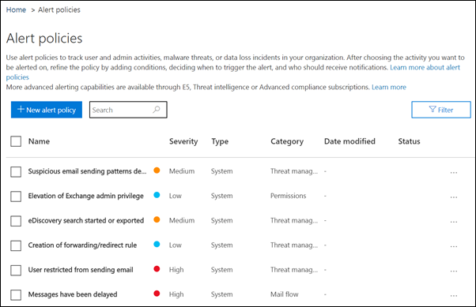

# Protezione avanzata dalle minacceIncrease threat protection

In questo articolo vengono fornite informazioni utili per aumentare la protezione dell'abbonamento a Microsoft 365 per proteggersi da tentativi di phishing, malware e altre minacce.This article helps you increase the protection in your Microsoft 365 subscription to protect against phishing, malware, and other threats. Tali raccomandazioni sono appropriate per le organizzazioni con un maggiore bisogno di sicurezza, come campagne politiche, studi legali e cliniche sanitarie.These recommendations are appropriate for organizations with an increased need for security, like political campaigns, law offices, and health care clinics.

Prima di iniziare, controllare il Punteggio Microsoft Secure.Before you begin, check your Microsoft Secure Score. Microsoft Secure Score analizza la sicurezza dell'organizzazione in base alle normali attività e alle impostazioni di sicurezza e assegna un punteggio.Microsoft Secure Score analyzes your organization's security based on your regular activities and security settings and assigns a score. Iniziare prendendo nota del punteggio corrente.Begin by taking note of your current score. L'esecuzione delle azioni consigliate in questo articolo aumenta il punteggio.Taking the actions recommended in this article increases your score. L'obiettivo non è quello di raggiungere il punteggio massimo, ma di essere a conoscenza delle opportunità di protezione dell'ambiente che non influiscono negativamente sulla produttività per gli utenti.The goal isn't to achieve the max score, but to be aware of opportunities to protect your environment that don't negatively affect productivity for your users.

Per ulteriori informazioni, vedere [Microsoft Secure Score](https://docs.microsoft.com/microsoft-365/security/mtp/microsoft-secure-score).For more information, see [Microsoft Secure Score](https://docs.microsoft.com/microsoft-365/security/mtp/microsoft-secure-score).

## Aumentare il livello di protezione da malware nella posta elettronicaRaise the level of protection against malware in mail

L'ambiente Office 365 o Microsoft 365 include la protezione da malware, ma è possibile aumentare questa protezione bloccando gli allegati con tipi di file comunemente utilizzati per il malware.Your Office 365 or Microsoft 365 environment includes protection against malware, but you can increase this protection by blocking attachments with file types that are commonly used for malware. Per urtare la protezione antimalware nella posta elettronica:To bump up malware protection in email:

1. Accedere a <https://protection.office.com> e accedere con le credenziali dell'account di amministratore.Go to <https://protection.office.com> and sign in with your admin account credentials.

2. Nel riquadro di spostamento a sinistra del Centro sicurezza & conformità fare clic su **criteri** antimalware in **gestione minacce** \> **Anti-Malware**.In the Security & Compliance Center, in the left navigation pane, under **Threat management**, choose **Policy** \> **Anti-Malware**.

3. Fare doppio clic sul criterio predefinito per modificare il criterio a livello di società.Double-click the default policy to edit this company-wide policy.

4. Fare clic su **Impostazioni**.Click **Settings**.

5. In **filtro tipi di allegati comuni**selezionare **On**attivato.Under **Common Attachment Types Filter**, select **On**. I tipi di file bloccati sono elencati nella finestra direttamente sotto questo controllo.The file types that are blocked are listed in the window directly below this control. Assicurarsi di aggiungere i tipi di FileType seguenti:Make sure you add these filetypes:

   `ade, adp, ani, bas, bat, chm, cmd, com, cpl, crt, hlp, ht, hta, inf, ins, isp, job, js, jse, lnk, mda, mdb, mde, mdz, msc, msi, msp, mst, pcd, reg, scr, sct, shs, url, vb, vbe, vbs, wsc, wsf, wsh, exe, pif`

   È possibile aggiungere o eliminare i tipi di file in un secondo momento, se necessario.You can add or delete file types later, if needed.

6. Fare clic su **Salva**.Click **Save.**

Per ulteriori informazioni, vedere [protezione anti-malware in EOP](https://docs.microsoft.com/microsoft-365/security/office-365-security/anti-malware-protection).For more information, see [Anti-malware protection in EOP](https://docs.microsoft.com/microsoft-365/security/office-365-security/anti-malware-protection).

## Proteggere l'ambiente da ransomwareProtect against ransomware

Ransomware limita l'accesso ai dati crittografando i file o bloccando gli schermi del computer.Ransomware restricts access to data by encrypting files or locking computer screens. Tenta quindi di estorcere denaro dalle vittime chiedendo "riscatto", di solito in forma di cryptocurrencies come Bitcoin, in Exchange per l'accesso ai dati.It then attempts to extort money from victims by asking for "ransom," usually in the form of cryptocurrencies like Bitcoin, in exchange for access to data.

È possibile proteggere contro ransomware creando una o più regole del flusso di posta per bloccare le estensioni di file comunemente utilizzate per ransomware (queste sono state aggiunte nell' [aumento del livello di protezione da malware in mail](#raise-the-level-of-protection-against-malware-in-mail) Step) oppure per avvisare gli utenti che ricevono questi allegati nella posta elettronica.You can protect against ransomware by creating one or more mail flow rules to block file extensions that are commonly used for ransomware (these were added in the [raise the level of protection against malware in mail](#raise-the-level-of-protection-against-malware-in-mail) step), or to warn users who receive these attachments in email.

Oltre ai file bloccati nel passaggio precedente, è buona norma creare una regola per avvisare gli utenti prima di aprire gli allegati di file di Office che includono macro.In addition to the files that you blocked in the previous step, it's also good practice to create a rule to warn users before opening Office file attachments that include macros. Ransomware può essere nascosto all'interno delle macro, quindi avvisa gli utenti di non aprire questi file da persone che non conoscono.Ransomware can be hidden inside macros, so warn users to not open these files from people they don't know.

Per creare una regola di trasporto della posta:To create a mail transport rule:

1. Accedere all'interfaccia di amministrazione <https://admin.microsoft.com> e scegliere interfaccia di **Amministrazione** di \> **Exchange**.Go to the admin center at <https://admin.microsoft.com> and choose **Admin centers** \> **Exchange**.

2. Nella categoria **flusso di posta** , fare clic su **regole**.In the **mail flow** category, click **rules**.

3. Fare clic su **+** , quindi fare clic su **Crea una nuova regola**.Click **+**, and then click **Create a new rule**.

4. Fare clic su **altre opzioni** nella parte inferiore della finestra di dialogo per visualizzare il set completo di opzioni.Click **More options** at the bottom of the dialog box to see the full set of options.

5. Applicare le impostazioni nella tabella seguente per la regola.Apply the settings in the following table for the rule. Lasciare l'impostazione predefinita per le altre impostazioni, a meno che non si desideri modificarle.Leave the rest of the settings at the default, unless you want to change them.

6. Fare clic su **Salva**.Click **Save**.

|ImpostazioneSetting|Avvisare gli utenti prima di aprire gli allegati dei file di OfficeWarn users before opening attachments of Office files|
|---|---|
|NomeName|Regola anti-ransomware: avvisa gli utentiAnti-ransomware rule: warn users|
|Applica questa regola se.Apply this rule if . .. ..|Qualsiasi allegato.Any attachment . .. .. l'estensione del file corrisponde.file extension matches . .. ..|
|Specificare parole o frasiSpecify words or phrases|Aggiungere questi tipi di file:Add these file types:   `dotm, docm, xlsm, sltm, xla, xlam, xll, pptm, potm, ppam, ppsm, sldm`|
|Eseguire le operazioni seguenti.Do the following . .. ..|Invia una notifica al destinatario tramite messaggioNotify the recipient with a message|
|Fornire il testo del messaggioProvide message text|Non aprire questi tipi di file da utenti che non si conoscono perché potrebbero contenere macro con codice dannoso.Do not open these types of files from people you do not know because they might contain macros with malicious code.|

Per altre informazioni, vedere:For more information, see:

- [Ransomware: come ridurre i rischiRansomware: how to reduce risk](https://www.microsoft.com/security/blog/2020/04/28/ransomware-groups-continue-to-target-healthcare-critical-services-heres-how-to-reduce-risk/)

- [Ripristinare il OneDriveRestore your OneDrive](https://support.microsoft.com//office/fa231298-759d-41cf-bcd0-25ac53eb8a15)

## Interrompere l'inoltro automatico per la posta elettronicaStop auto-forwarding for email

Gli hacker che accedono alla cassetta postale di un utente possono rubare la posta impostando la cassetta postale in modo da inoltrare automaticamente la posta elettronica.Hackers who gain access to a user's mailbox can steal your mail by setting the mailbox to automatically forward email. Ciò può verificarsi anche senza la consapevolezza dell'utente.This can happen even without the user's awareness. È possibile evitare che ciò accada configurando una regola del flusso di posta.You can prevent this from happening by configuring a mail flow rule.

Per creare una regola di trasporto della posta, guardare [questo breve video](https://support.office.com/article/f9d693ba-5c78-47c0-b156-8e461e062aa7) o eseguire la procedura seguente:To create a mail transport rule, either watch [this short video](https://support.office.com/article/f9d693ba-5c78-47c0-b156-8e461e062aa7) or follow these steps:

1. Nell'interfaccia di amministrazione di Microsoft 365 fare clic su interfaccia di **Amministrazione** di \> **Exchange**.In the Microsoft 365 admin center, click **Admin centers** \> **Exchange**.

2. Nella categoria **flusso di posta** , fare clic su **regole**.In the **mail flow** category, click **rules**.

3. Fare clic su **+** , quindi fare clic su **Crea una nuova regola**.Click **+**, and then click **Create a new rule**.

4. Fare clic su **altre opzioni** nella parte inferiore della finestra di dialogo per visualizzare il set completo di opzioni.Click **More options** at the bottom of the dialog box to see the full set of options.

5. Applicare le impostazioni nella tabella seguente.Apply the settings in the following table. Lasciare l'impostazione predefinita per le altre impostazioni, a meno che non si desideri modificarle.Leave the rest of the settings at the default, unless you want to change them.

6. Fare clic su **Salva**.Click **Save**.

|ImpostazioneSetting|Avvisare gli utenti prima di aprire gli allegati dei file di OfficeWarn users before opening attachments of Office files|
|---|---|
|NomeName|Impedire l'inoltro automatico dei messaggi di posta elettronica ai domini esterniPrevent auto forwarding of email to external domains|
|Applica questa regola se...Apply this rule if ...|Il mittente.The sender . .. .. è esterno/interno.is external/internal . .. .. All'interno dell'organizzazioneInside the organization|
|Aggiungi condizioneAdd condition|Le proprietà del messaggio.The message properties . .. .. includere il tipo di messaggio.include the message type . .. .. Inoltro automaticoAuto-forward|
|Eseguire le operazioni seguenti:Do the following ...|Blocca il messaggio.Block the message . .. .. rifiuta il messaggio e Includi una spiegazione.reject the message and include an explanation.|
|Fornire il testo del messaggioProvide message text|L'inoltro automatico della posta elettronica all'esterno dell'organizzazione è impedito per motivi di sicurezza.Auto-forwarding email outside this organization is prevented for security reasons.|

## Proteggere la posta elettronica da attacchi di phishingProtect your email from phishing attacks

Se sono stati configurati uno o più domini personalizzati per l'ambiente Office 365 o Microsoft 365, è possibile configurare la protezione anti-phishing mirata.If you've configured one or more custom domains for your Office 365 or Microsoft 365 environment, you can configure targeted anti-phishing protection. La protezione anti-phishing ATP, parte di Office 365 Advanced Threat Protection, può aiutare a proteggere l'organizzazione da attacchi di phishing basati sulla rappresentazione malevola e altri attacchi di phishing.ATP anti-phishing protection, part of Office 365 Advanced Threat Protection, can help protect your organization from malicious impersonation-based phishing attacks and other phishing attacks. Se non è stato configurato un dominio personalizzato, non è necessario eseguire questa operazione.If you haven't configured a custom domain, you don't need to do this.

Si consiglia di iniziare a utilizzare questa protezione creando un criterio per proteggere gli utenti più importanti e il dominio personalizzato.We recommend that you get started with this protection by creating a policy to protect your most important users and your custom domain.

Per creare un criterio di anti-phishing ATP, guardare [questo breve video di formazione](https://support.office.com/article/86c425e1-1686-430a-9151-f7176cce4f2c)o completare i passaggi seguenti:To create an ATP anti-phishing policy, watch [this short training video](https://support.office.com/article/86c425e1-1686-430a-9151-f7176cce4f2c), or complete the following steps:

1. Passare a <https://protection.office.com>.Go to <https://protection.office.com>.

2. Nel riquadro di spostamento a sinistra del Centro sicurezza & conformità fare clic su **criteri**in **gestione minacce**.In the Security & Compliance Center, in the left navigation pane, under **Threat management**, choose **Policy**.

3. Nella pagina **criterio** scegliere **ATP anti-phishing**.On the **Policy** page, choose **ATP anti-phishing**.

4. Nella pagina **anti-phishing** selezionare **+ Crea**.On the **Anti-phishing** page, select **+ Create**. Viene avviata una procedura guidata che consente di definire i criteri di anti-phishing.A wizard launches that steps you through defining your anti-phishing policy.

5. Specificare il nome, la descrizione e le impostazioni del criterio come consigliato nel grafico riportato di seguito.Specify the name, description, and settings for your policy as recommended in the chart below. Per ulteriori informazioni, vedere informazioni [sulle opzioni dei criteri di anti-phishing ATP](https://docs.microsoft.com/microsoft-365/security/office-365-security/set-up-anti-phishing-policies).For more information, see [Learn about ATP anti-phishing policy options](https://docs.microsoft.com/microsoft-365/security/office-365-security/set-up-anti-phishing-policies).

6. Dopo aver esaminato le impostazioni, fare clic su **crea questo criterio** o su **Salva**, a seconda dei casi.After you've reviewed your settings, choose **Create this policy** or **Save**, as appropriate.

|Impostazione o opzioneSetting or option|Impostazione consigliataRecommended setting|
|---|---|
|NomeName|Domain e la maggior parte del personale prezioso della campagnaDomain and most valuable campaign staff|
|DescrizioneDescription|Garantire che la maggior parte del personale importante e del nostro dominio non siano rappresentati.Ensure most important staff and our domain are not being impersonated.|
|Aggiungere gli utenti da proteggereAdd users to protect|Seleziona **+ Aggiungi una condizione, il destinatario è**.Select **+ Add a condition, The recipient is**. Digitare i nomi utente oppure immettere l'indirizzo di posta elettronica del candidato, del responsabile della campagna e di altri membri del personale importanti.Type user names or enter the email address of the candidate, campaign manager, and other important staff members. È possibile aggiungere fino a 20 indirizzi interni ed esterni che si desidera proteggere dalla rappresentazione.You can add up to 20 internal and external addresses that you want to protect from impersonation.|
|Aggiungere i domini da proteggereAdd domains to protect|Selezionare **+ Aggiungi una condizione, il dominio del destinatario è**.Select **+ Add a condition, The recipient domain is**. Se ne è stata definita una, immettere il dominio personalizzato associato all'abbonamento a Microsoft 365.Enter the custom domain associated with your Microsoft 365 subscription, if you defined one. È possibile immettere più di un dominio.You can enter more than one domain.|
|Scegli azioniChoose actions|Se la posta elettronica viene inviata da un utente rappresentato: scegliere **reindirizza messaggio a un altro indirizzo di posta elettronica**e quindi digitare l'indirizzo di posta elettronica dell'amministratore della sicurezza. ad esempio, *Alice   @contoso. com*.If email is sent by an impersonated user: Choose **Redirect message to another email address**, and then type the email address of the security administrator; for example, *Alice@contoso.com*.   Se i messaggi di posta elettronica vengono inviati da un dominio imitato: scegliere di mettere il **messaggio in quarantena**.If email is sent by an impersonated domain: Choose **Quarantine message**.|
|Intelligence della cassetta postaleMailbox intelligence|Per impostazione predefinita, la funzione di intelligence della cassetta postale è selezionata quando si creano nuovi criteri anti-phishing.By default, mailbox intelligence is selected when you create a new anti-phishing policy. Per ottenere risultati ottimali, lasciare l’opzione **attiva**.Leave this setting **On** for best results.|
|Aggiungere mittenti e domini attendibiliAdd trusted senders and domains|Qui è possibile aggiungere il proprio dominio o altri domini attendibili.Here you can add your own domain, or any other trusted domains.|
|Applicato aApplied to|Selezionare **Il dominio del destinatario è**.Select **The recipient domain is**. In **Uno dei seguenti**, selezionare **Scegli**.Under **Any of these**, select **Choose**. Selezionare **+ Aggiungi**.Select **+ Add**. Selezionare la casella di controllo accanto al nome del dominio, ad esempio *contoso.   com*, nell'elenco, quindi selezionare **Aggiungi**.Select the check box next to the name of the domain, for example, *contoso.com*, in the list, and then select **Add**. Scegliere **Fine**.Select **Done**.|

Per ulteriori informazioni, vedere [configurare i criteri di anti-phishing ATP di Office 365](https://docs.microsoft.com/microsoft-365/security/office-365-security/set-up-anti-phishing-policies).For more information, see [Set up Office 365 ATP anti-phishing policies](https://docs.microsoft.com/microsoft-365/security/office-365-security/set-up-anti-phishing-policies).

## Protezione da allegati, file e collegamenti dannosi con Advanced Threat Protection (ATP)Protect against malicious attachments, files, and links with Advanced Threat Protection (ATP)

Prima di tutto, assicurarsi che nell'interfaccia di amministrazione <https://admin.microsoft.com> si sia attivata la nuova anteprima dell'interfaccia di amministrazione.First, make sure, in the admin center at <https://admin.microsoft.com> that you have the new admin center preview turned on. Attiva l'interruttore accanto al testo **del nuovo**interfaccia di amministrazione.Turn on the toggle next to the text **The new admin center**.

   

Se la pagina di **installazione** non è ancora visualizzata con le schede del tenant, vedere come eseguire questa procedura nel centro sicurezza & Compliance.If you don't see the **Setup** page with cards in your tenant yet, see how to complete these steps in Security & Compliance Center. Vedere [configurare gli allegati sicuri di ATP nel centro sicurezza & Compliance](#set-up-atp-safe-attachments-in-the-security--compliance-center) e [configurare i collegamenti sicuri di ATP nel centro sicurezza & conformità](#set-up-atp-safe-links-in-the-security--compliance-center).See [Set up ATP safe attachments in the Security & Compliance Center](#set-up-atp-safe-attachments-in-the-security--compliance-center) and [Set up ATP Safe Links in the Security & Compliance Center](#set-up-atp-safe-links-in-the-security--compliance-center).

1. Nella barra di spostamento a sinistra, scegliere **Setup**.In the left nav, choose **Setup**.
2. Nella pagina **configurazione** scegliere **Visualizza** nella scheda **aumenta protezione da minacce avanzate** .On the **Setup** page, choose **View** on the **Increase protection from advanced threats** card.

   

3. Nella pagina **aumenta protezione dalle minacce avanzate** scegliere **inizia**.On the **Increase protection from advanced threats** page, choose **Get started**.
4. Nel riquadro che si apre, selezionare le caselle di controllo accanto a **collegamenti e allegati di posta elettronica**, **analizzare i file in SharePoint, OneDrive e teams**e **analizzare i collegamenti in Office Desktop e Office Online Apps** in **analisi elementi per contenuti dannosi**.On the pane that opens, select the check boxes next to **Links and attachments in email**, **Scan files in SharePoint, OneDrive, and Teams**, and **Scan links in Office desktop and Office Online apps** under **Scan items for malicious content**.

   In **collegamenti e allegati di posta elettronica**, digitare tutti gli utenti o gli utenti specifici di cui si desidera analizzare la posta elettronica.Under **Links and attachments in email**, Type in All Users, or the specific users whose email you want scanned.

   

5. Scegliere **create Policy** per abilitare gli allegati sicuri di ATP e i collegamenti sicuri ATP.Choose **Create policies** to turn on ATP safe attachments and ATP safe links.

### Configurare gli allegati sicuri di ATP nel centro sicurezza & ComplianceSet up ATP safe attachments in the Security & Compliance Center

Gli utenti inviano, ricevono e condividono regolarmente gli allegati, ad esempio documenti, presentazioni, fogli di calcolo e altro ancora.People regularly send, receive, and share attachments, such as documents, presentations, spreadsheets, and more. Non è sempre facile stabilire se un allegato è sicuro o dannoso solo guardando un messaggio di posta elettronica.It's not always easy to tell whether an attachment is safe or malicious just by looking at an email message. La protezione avanzata dalle minacce di Office 365 include la protezione degli allegati sicuri di ATP, ma questa protezione non è attivata per impostazione predefinita.Office 365 Advanced Threat Protection includes ATP Safe Attachment protection, but this protection is not turned on by default. Si consiglia di creare una nuova regola per iniziare a usare questa protezione.We recommend that you create a new rule to begin using this protection. Questa protezione si estende ai file in SharePoint, OneDrive e Microsoft teams.This protection extends to files in SharePoint, OneDrive, and Microsoft Teams.

Per creare un criterio degli allegati sicuri di ATP, guardare [questo breve video](https://support.office.com/article/e7e68934-23dc-4b9c-b714-e82e27a8f8a5)o completare i passaggi seguenti:To create an ATP safe attachment policy, either watch [this short video](https://support.office.com/article/e7e68934-23dc-4b9c-b714-e82e27a8f8a5), or complete the following steps:

1. Passare a <https://protection.office.com> e accedere con l'account di amministratore.Go to <https://protection.office.com> and sign in with your admin account.

2. Nel riquadro di spostamento a sinistra del Centro sicurezza & conformità fare clic su **criteri**in **gestione minacce**.In the Security & Compliance Center, in the left navigation pane, under **Threat management**, choose **Policy**.

3. Nella pagina criterio, scegliere **allegati sicuri ATP**.On the Policy page, choose **ATP safe attachments**.

4. Nella pagina allegati sicuri, applicare questa protezione in generale selezionando la casella di controllo **attiva ATP per SharePoint, OneDrive e Microsoft teams** .On the Safe attachments page, apply this protection broadly by selecting the **Turn on ATP for SharePoint, OneDrive, and Microsoft Teams** check box.

5. Selezionare questa **+** impostazione per creare un nuovo criterio.Select **+** to create a new policy.

6. Applicare le impostazioni nella tabella seguente.Apply the settings in the following table.

7. Dopo aver esaminato le impostazioni, fare clic su **crea questo criterio** o su **Salva**, a seconda dei casi.After you review your settings, choose **Create this policy** or **Save**, as appropriate.

|Impostazione o opzioneSetting or option|Impostazione consigliataRecommended setting|
|---|---|
|NomeName|Blocca i messaggi di posta elettronica correnti e futuri con malware rilevato.Block current and future emails with detected malware.|
|DescrizioneDescription|Blocca i messaggi di posta elettronica e gli allegati correnti e futuri con malware rilevato.Block current and future emails and attachments with detected malware.|
|Save Attachments Unknown Malware ResponseSave attachments unknown malware response|Selezionare **blocca-blocca i messaggi di posta elettronica e gli allegati correnti e futuri con malware rilevato**.Select **Block - Block the current and future emails and attachments with detected malware**.|
|Reindirizza l'allegato sul rilevamentoRedirect attachment on detection|Attiva reindirizzamento (seleziona questa casella)Enable redirection (select this box)   Immettere l'account di amministratore o l'impostazione di una cassetta postale per la quarantena.Enter the admin account or a mailbox setup for quarantine.   Applicare la selezione precedente se la ricerca di malware per gli allegati non è stata eseguita o si verifica un errore (selezionare questa casella).Apply the above selection if malware scanning for attachments times out or error occurs (select this box).|
|Applicato aApplied to|Il dominio del destinatario è.The recipient domain is . .. .. Selezionare il dominio.select your domain.|

Per ulteriori informazioni, vedere [configurare i criteri di anti-phishing ATP di Office 365](https://docs.microsoft.com/microsoft-365/security/office-365-security/set-up-anti-phishing-policies).For more information, see [Set up Office 365 ATP anti-phishing policies](https://docs.microsoft.com/microsoft-365/security/office-365-security/set-up-anti-phishing-policies).

### Configurare i collegamenti sicuri ATP nel centro sicurezza & ComplianceSet up ATP Safe Links in the Security & Compliance Center

A volte gli hacker nascondono siti Web dannosi nei collegamenti nei messaggi di posta elettronica o in altri file.Hackers sometimes hide malicious websites in links in email or other files. Office 365 ATP Safe Links (ATP Safe Links), parte di Office 365 Advanced Threat Protection, può aiutare a proteggere l'organizzazione fornendo la verifica del tempo di clic degli indirizzi Web (URL) nei messaggi di posta elettronica e nei documenti di Office.Office 365 ATP Safe Links (ATP Safe Links), part of Office 365 Advanced Threat Protection, can help protect your organization by providing time-of-click verification of web addresses (URLs) in email messages and Office documents. La protezione è definita tramite i criteri collegamenti sicuri di ATP.Protection is defined through ATP Safe Links policies.

È consigliabile eseguire le operazioni seguenti:We recommend that you do the following:

- Modificare il criterio predefinito per aumentare la protezione.Modify the default policy to increase protection.

- Aggiungere un nuovo criterio indirizzato a tutti i destinatari del dominio.Add a new policy targeted to all recipients in your domain.

Per configurare i collegamenti sicuri di ATP, guardare [questo breve video di formazione](https://support.office.com/article/61492713-53c2-47da-a6e7-fa97479e97fa)o completare i passaggi seguenti:To set up ATP Safe Links, watch [this short training video](https://support.office.com/article/61492713-53c2-47da-a6e7-fa97479e97fa), or complete the following steps:

1. Passare a <https://protection.office.com> e accedere con l'account di amministratore.Go to <https://protection.office.com> and sign in with your admin account.

2. Nel riquadro di spostamento a sinistra del Centro sicurezza & conformità fare clic su **criteri**in **gestione minacce**.In the Security & Compliance Center, in the left navigation pane, under **Threat management**, choose **Policy**.

3. Nella pagina criterio, scegliere **collegamenti sicuri ATP**.On the Policy page, choose **ATP Safe Links**.

Per modificare il criterio predefinito:To modify the default policy:

1. Nella pagina collegamenti sicuri, in **criteri che si applicano all'intera organizzazione**, selezionare il criterio **predefinito** .On the Safe links page, under **Policies that apply to the entire organization**, select the **Default** policy.

2. In **impostazioni che si applicano al contenuto tranne che alla posta elettronica**, selezionare **Microsoft 365 Apps for Enterprise, Office per iOS e Android**.Under **Settings that apply to content except email**, select **Microsoft 365 Apps for enterprise, Office for iOS and Android**.

3. Fare clic su **Salva**.Click **Save**.

Per creare un nuovo criterio mirato a tutti i destinatari nel dominio:To create a new policy targeted to all recipients in your domain:

1. Nella pagina collegamenti sicuri, in **criteri che si applicano all'intera organizzazione**, fare clic **+** per creare un nuovo criterio.On the Safe links page, under **Policies that apply to the entire organization**, click **+** to create a new policy.

2. Applicare le impostazioni elencate nella tabella seguente.Apply the settings listed in the following table.

3. Fare clic su **Salva**.Click **Save**.

|Impostazione o opzioneSetting or option|Impostazione consigliataRecommended setting|
|---|---|
|NomeName|Criteri dei collegamenti sicuri per tutti i destinatari del dominioSafe links policy for all recipients in the domain|
|Selezionare l'azione per gli URL potenzialmente dannosi sconosciuti nei messaggiSelect the action for unknown potentially malicious URLs in messages|Selezionare **su URL verrà riscritto e controllato in base a un elenco di collegamenti dannosi noti quando l'utente fa clic sul collegamento**.Select **On - URLs will be rewritten and checked against a list of known malicious links when user clicks on the link**.|
|Utilizzare gli allegati sicuri per analizzare il contenuto scaricabileUse Safe Attachments to scan downloadable content|Selezionare questa casella.Select this box.|
|Applicato aApplied to|Il dominio del destinatario è.The recipient domain is . .. .. Selezionare il dominio.select your domain.|

Per ulteriori informazioni, vedere [collegamenti sicuri in Office 365 ATP](https://docs.microsoft.com/microsoft-365/security/office-365-security/atp-safe-links).For more information, see [Safe Links in Office 365 ATP](https://docs.microsoft.com/microsoft-365/security/office-365-security/atp-safe-links).

## Abilitare il log di controllo unificatoTurn on the Unified Audit Log

Dopo aver attivato la ricerca nel registro di controllo nel centro sicurezza & Compliance, è possibile mantenere l'amministratore e altre attività utente nel registro e cercarlo.After you turn on the audit log search in the Security & Compliance Center, you can retain the admin and other user activity in the log and search it.

È necessario essere assegnati al ruolo registri di controllo in Exchange Online per abilitare o disabilitare la ricerca del registro di controllo nell'abbonamento a Microsoft 365.You must be assigned the Audit Logs role in Exchange Online to turn audit log search on or off in your Microsoft 365 subscription. Per impostazione predefinita, questo ruolo viene assegnato ai gruppi di ruoli Gestione conformità e gestione organizzazione nella pagina autorizzazioni nell'interfaccia di amministrazione di Exchange.By default, this role is assigned to the Compliance Management and Organization Management role groups on the Permissions page in the Exchange admin center. Gli amministratori globali di Microsoft 365 sono membri di questo gruppo per impostazione predefinita.Global admins in Microsoft 365 are members of this group by default.

1. Per abilitare la ricerca nel registro di controllo, accedere all'interfaccia di amministrazione <https://admin.microsoft.com> e scegliere **Compliance** in **admin Centers** nella barra di navigazione sinistra.To turn on the audit log search on, go to the admin center at <https://admin.microsoft.com> and then choose **Compliance** under **Admin centers** in the left nav.
2. Nella pagina **Microsoft 365 Compliance** scegliere **altre risorse**e quindi **Apri** nella scheda **centro & di sicurezza di Office 365** .On the **Microsoft 365 compliance** page, choose **More resources**, and then **Open** on the **Office 365 security & center** card.

    
3. Nella pagina sicurezza e conformità scegliere **Search** e quindi **controllo Log Search**.On the security and compliance page, choose **Search** and then **Audit log search**.
4. Nella parte superiore della pagina di **ricerca del registro di controllo** scegliere **Attiva controllo**.On the top of the **Audit log search** page, choose **Turn on auditing**.

Dopo che la funzionalità è stata attivata, è possibile cercare file, cartelle e molte attività.After the feature is turned on, you can search for files, folders, and many activities. Per ulteriori informazioni, vedere [Search the audit log](https://docs.microsoft.com/microsoft-365/compliance/search-the-audit-log-in-security-and-compliance).For more information, see [search the audit log](https://docs.microsoft.com/microsoft-365/compliance/search-the-audit-log-in-security-and-compliance).

## Ottimizzazione delle impostazioni di condivisione anonima per i file e le cartelle di SharePoint e OneDriveTune-up anonymous sharing settings for SharePoint and OneDrive files and folders

(impostare la scadenza del collegamento anonimo predefinito su 14 giorni, modificare il tipo di condivisione predefinito in "persone specifiche") Per modificare le impostazioni di condivisione per OneDrive e SharePoint:(change default anonymous link expiration to 14 days, change default sharing type to "Specific People") To change the sharing settings for OneDrive and SharePoint:

1. Accedere all'interfaccia di amministrazione <https://admin.microsoft.com> e quindi scegliere **SharePoint** in interfaccia di **Amministrazione** nel NAV sinistro.Go to the admin center at <https://admin.microsoft.com> and then choose **SharePoint** under **Admin centers** in the left nav.
2. Nell'interfaccia di amministrazione di SharePoint, andare alla condivisione dei **criteri** \> **Sharing**.In the SharePoint admin center, go to **Policies** \> **Sharing**.
3. Nella pagina **condivisione** , in **collegamenti a file e cartelle**, selezionare **persone specifiche**e in **Impostazioni avanzate per i collegamenti "chiunque"**, selezionare **questi collegamenti devono scadere entro questo**numero di giorni e digitare 14 (o un altro numero di giorni in cui si desidera limitare la durata del collegamento).On the **Sharing** page, under **File and folder links**, select **Specific people**, and under **Advanced settings for "Anyone" links**, select **These links must expire within this many days**, and type in 14 (or another number of days you want to restrict the link lifetime to).

   

## Avvisi attivitàActivity alerts

È possibile utilizzare gli avvisi attività per monitorare le attività degli utenti e degli amministratori e rilevare eventuali incidenti antimalware e di prevenzione della perdita di dati nell'organizzazione.You can use activity alerts to track admin and user activities and detect malware and data loss prevention incidents in your organization. La sottoscrizione include un insieme di criteri predefiniti, ma è anche possibile creare quelli personalizzati.Your subscription includes a set of default policies, but you can also create custom ones. Per ulteriori informazioni, vedere [criteri di avviso](https://docs.microsoft.com/microsoft-365/compliance/alert-policies).For more information, see [alert policies](https://docs.microsoft.com/microsoft-365/compliance/alert-policies). Ad esempio, se si archivia un file importante in SharePoint che non si desidera che nessuno condivida esternamente, è possibile creare una notifica che avvisi se qualcuno lo condivide.For example, if you store an important file in SharePoint that you don't want anyone to share externally, you can create a notification that alerts you if someone does share it.

Nella figura seguente vengono illustrati i criteri predefiniti inclusi in Microsoft 365.The following figure shows the default policies that are included with Microsoft 365.

## Disabilitare o gestire la condivisione del calendarioDisable or manage calendar sharing

È possibile impedire agli utenti dell'organizzazione di condividere i propri calendari oppure è possibile gestire anche ciò che può essere condiviso.You can prevent people in your organization from sharing their calendars, or you can also manage what they can share. Ad esempio, è possibile limitare la condivisione solo ai tempi di disponibilità.For example, you can restrict the sharing to free/busy times only.

1. Accedere all'interfaccia di amministrazione <https://admin.microsoft.com> e scegliere servizi di **Impostazioni** \> **& i componenti**aggiuntivi.Go to the admin center at <https://admin.microsoft.com> and choose **Settings** \> **Services & add-ins**.
2. Nella pagina **servizi & componenti** aggiuntivi scegliere **Calendario**e scegliere se gli utenti dell'organizzazione possono condividere i propri calendari con utenti esterni che dispongono di Office 365 o Exchange o con chiunque.On the **Services & add-ins** page, choose **Calendar**, and choose whether people in your organization can share their calendars with people outside who have Office 365 or Exchange, or with anyone.

   Se si sceglie l'opzione Condividi con tutti gli utenti, è possibile decidere di condividere solo le informazioni sulla disponibilità.If you choose the share with anyone option, you can decide to also only share free/busy information.

3. Scegliere **Salva modifiche** nella parte inferiore della pagina.Choose **Save changes** on the bottom of the page.

   Nella figura seguente viene illustrata la condivisione del calendario non consentita.The following figure shows calendar sharing not allowed.

   

   Nella figura seguente vengono illustrate le impostazioni quando la condivisione del calendario è consentita con un collegamento di posta elettronica con solo le informazioni sulla disponibilità.The following figure shows the settings when calendar sharing is allowed with an email link with only free/busy information.

   

Se gli utenti sono autorizzati a condividere i propri calendari, vedere le [istruzioni](https://support.office.com/article/7ecef8ae-139c-40d9-bae2-a23977ee58d5) per la condivisione da Outlook sul Web.If your users are allowed to share their calendars, see [these instructions](https://support.office.com/article/7ecef8ae-139c-40d9-bae2-a23977ee58d5) for how to share from Outlook on the web.
