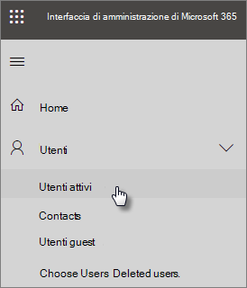

# Proteggere gli account amministratore

Poiché gli account amministratore dispongono di privilegi elevati, sono obiettivi importanti per hacker e cyber-criminali. In questo articolo viene descritto:

- Come configurare un account amministratore aggiuntivo per le emergenze.
- Come proteggere questi account.

Quando si effettua l'iscrizione a Microsoft 365 e si immettono le informazioni, si diventa automaticamente l'amministratore globale. Un amministratore globale ha il controllo finale degli account utente e di tutte le altre impostazioni nell'interfaccia di amministrazione di Microsoft, ma esistono molti tipi diversi di account amministratore con diversi gradi di accesso. Per [informazioni sui diversi](https://docs.microsoft.com/office365/admin/add-users/about-admin-roles) livelli di accesso per ogni tipo di ruolo di amministratore, vedere i ruoli di amministratore.

## Creare account amministratore aggiuntivi

Usa gli account amministratore solo per l'amministrazione. Gli amministratori devono disporre di un account utente separato per l'uso regolare delle app di Office e utilizzare il proprio account amministrativo solo se necessario per gestire account e dispositivi e durante l'utilizzo di altre funzioni di amministratore. È anche una buona idea rimuovere la licenza di Microsoft 365 dagli account di amministratore in modo da non doverli pagare.

È necessario configurare almeno un account amministratore globale aggiuntivo per concedere l'accesso di amministratore a un altro dipendente attendibile. È inoltre possibile creare account amministratore separati per la gestione degli utenti (questo ruolo è denominato **Amministratore gestione utenti).** Per ulteriori informazioni, vedere [sui ruoli di amministratore.](https://docs.microsoft.com/office365/admin/add-users/about-admin-roles)

Per creare altri account amministratore:

 1. Passare <a href="https://go.microsoft.com/fwlink/p/?linkid=837890" target="_blank">all'interfaccia di amministrazione</a> e quindi scegliere **Utenti** \> **attivi nel** riquadro di spostamento sinistro.

    

 2. Nella pagina **Utenti attivi** selezionare Aggiungi utente nella parte superiore  della pagina e nel riquadro Nuovo utente immettere il nome e altre informazioni. 
 3. Espandere la **sezione Ruoli** e scegliere Amministratore **globale per** concedere all'utente l'accesso come amministratore globale. È inoltre possibile scegliere **Amministratore personalizzato** e scegliere uno dei ruoli visualizzati.

    Immettere un messaggio di posta elettronica alternativo nella **casella di testo Indirizzo di posta** elettronica alternativo. È possibile utilizzare questo indirizzo per recuperare le informazioni sulla password in caso di blocco. Per gli amministratori globali, a questo indirizzo verrà inviato anche un estratto conto.

    

 4. Nella sezione **Licenze di prodotto** spostare il selettore per Microsoft **365 Business** su **Disattivato** e l'opzione Crea utente senza licenza **del** prodotto su **On.**

    

## Creare un account amministratore per gli interventi di emergenza

Devi anche creare un account di backup non configurato con l'autenticazione a più fattori (MFA) in modo da non bloccarti accidentalmente (ad esempio, se perdi il telefono che stai usando come seconda forma di verifica). Verificare che la password per questo account sia una frase o una lunghezza di almeno 16 caratteri. Questo account viene spesso definito "account break-glass".

## Creare un account utente per se stessi

Utilizzare l'account utente per partecipare alla collaborazione con l'organizzazione, inclusa la verifica della posta. Ciò significa che le credenziali di amministratore potrebbero essere simili ad *Alice.Chavez  @Contoso.org* e il normale account utente potrebbe essere simile ad *Alice  @Contoso.com.*

Per creare un nuovo account utente:

1. Passare <a href="https://go.microsoft.com/fwlink/p/?linkid=837890" target="_blank">all'interfaccia di amministrazione</a> e quindi scegliere **Utenti** \> **attivi nel** riquadro di spostamento sinistro.
2. Nella pagina **Utenti attivi** selezionare Aggiungi utente nella parte superiore  della pagina e nel riquadro Nuovo utente immettere il nome e altre informazioni. 
3. Espandere la **sezione Ruoli** e scegliere **Utente (nessun accesso amministrativo)**.
4. Nella sezione **Licenze di prodotto** spostare il selettore per Microsoft **365 Business** su **On.**

## Registrare ognuno di questi account per l'autenticazione a più fattori

Verificare che questi account utilizzino [l'autenticazione a più fattori.](m365-campaigns-multifactor-authenication.md)

## Consigli aggiuntivi

- Assicurarsi che gli account amministratore siano impostati anche per l'autenticazione a più fattori. Verrà illustrato come eseguire questa operazione in Configurare [i criteri di accesso condizionale.](m365-campaigns-conditional-access.md)
- Prima di usare gli account amministratore, chiudi tutte le sessioni e le app del browser non correlate, inclusi gli account di posta elettronica personali. Puoi anche usare le finestre del browser private o in incognito.
- Dopo aver completato le attività di amministrazione, assicurarsi di disconnettersi dalla sessione del browser.
