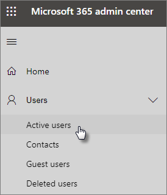
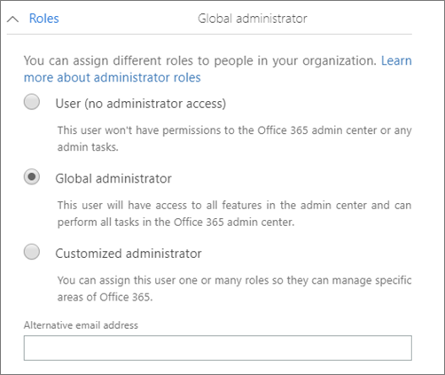

# Proteggere gli account di amministratoreProtect your administrator accounts

Poiché gli account di amministrazione sono dotati di privilegi elevati, sono obiettivi di valore per gli hacker e i criminali informatici.Because admin accounts come with elevated privileges, they're valuable targets for hackers and cyber criminals. In questo articolo viene descritto:This article describes:

- Informazioni su come configurare un account di amministratore aggiuntivo per le emergenze.How to set up an additional administrator account for emergencies.
- Come proteggere tali account.How to protect these accounts.
 
Quando ti iscrivi a Microsoft 365 business e immetti le tue informazioni, diventi automaticamente l'amministratore globale. Un amministratore globale ha il controllo definitivo degli account utente e di tutte le altre impostazioni nell'interfaccia di amministrazione di Microsoft, ma esistono diversi tipi di account di amministrazione con vari gradi di accesso.When you sign up for Microsoft 365 Business and enter your information, you automatically become the global admin. A global admin has the ultimate control of user accounts and all the other settings in the Microsoft admin center, but there are many different kinds of admin accounts with varying degrees of access. Vedere [About admin Roles](https://docs.microsoft.com/office365/admin/add-users/about-admin-roles) per informazioni sui diversi livelli di accesso per ogni tipo di ruolo di amministratore.See [about admin roles](https://docs.microsoft.com/office365/admin/add-users/about-admin-roles) for information about the different access levels for each kind of admin role.

## Creare account di amministratore aggiuntiviCreate additional admin accounts

Utilizzare gli account di amministrazione solo per l'amministrazione.Use admin accounts only for administration. Gli amministratori devono disporre di un account utente separato per l'utilizzo regolare delle app di Office e utilizzare il proprio account amministrativo solo quando necessario per gestire gli account e i dispositivi e durante la lavorazione di altre funzioni di amministratore.Admins should have a separate user account for regular use of Office apps and only use their administrative account when necessary to manage accounts and devices, and while working on other admin functions. È inoltre consigliabile rimuovere la licenza di Microsoft 365 business dagli account di amministrazione in modo che non sia necessario pagarli.It's also a good idea to remove the Microsoft 365 Business license from the admin accounts so you don't have to pay for them.

Sarà necessario configurare almeno un account di amministratore globale aggiuntivo per concedere l'accesso all'amministratore a un altro dipendente attendibile.You'll want to set up at least one additional global admin account to give admin access to another trusted employee. È inoltre possibile creare account amministratore distinti per la gestione degli utenti (questo ruolo è denominato **amministratore Gestione utenti**).You can also create separate admin accounts for user management (this role is called **User management administrator**). Per ulteriori informazioni, vedere [informazioni sui ruoli di amministratore](https://docs.microsoft.com/office365/admin/add-users/about-admin-roles).For more information, see [about admin roles](https://docs.microsoft.com/office365/admin/add-users/about-admin-roles).

Per creare account di amministratore aggiuntivi:To create additional admin accounts:

 1. Passare all'interfaccia di <a href="https://go.microsoft.com/fwlink/p/?linkid=837890" target="_blank">Amministrazione</a> e quindi scegliere **utenti** \> **attivi utenti** nel NAV sinistro.Go to the <a href="https://go.microsoft.com/fwlink/p/?linkid=837890" target="_blank">admin center</a> and then choose **Users** \> **Active users** in the left nav.

    

2. Nella pagina **utenti attivi** selezionare **Aggiungi un utente** nella parte superiore della pagina e nel **nuovo pannello utente** immettere il nome e altre informazioni.On the **Active users** page, select **Add a user** at the top of the page, and on the **New user** panel, enter the name and other information.
3. Espandere la sezione **ruoli** e scegliere **amministratore globale** per concedere all'utente l'accesso all'amministratore globale.Expand the **Roles** section, and choose **Global administrator** to give this user global admin access. È inoltre possibile scegliere **amministratore personalizzato** e scegliere uno qualsiasi dei ruoli visualizzati.You can also choose **Customized administrator** and choose any of the roles that are displayed.

    Immettere un messaggio di posta elettronica alternativo nella casella di testo **indirizzo di posta elettronica alternativo** .Enter an alternate email in the **Alternative email address** text box. È possibile utilizzare questo indirizzo per recuperare le informazioni sulla password se si viene bloccati. Per gli amministratori globali, verrà inviata anche un'istruzione di fatturazione a questo indirizzo.You can use this address to recover your password information if you get locked out. For global admins, a billing statement will also be sent to this address.

    
    
4. Nella sezione **licenze di prodotto** spostare il selettore di **Microsoft 365 business** su **disattivato** e la **licenza Crea utente senza prodotto** **su**attivato.In the **Product licenses** section, move the selector for **Microsoft 365 Business** to **Off** and the **Create user without product license** to **On**.

    

## Creare un account di amministratore di emergenzaCreate an emergency admin account

È inoltre necessario creare un account di backup non configurato con l'autenticazione a più fattori (AMF), in modo da non bloccarsi accidentalmente (ad esempio, se si perde il telefono che si sta utilizzando come seconda forma di verifica).You should also create a backup account that isn't set up with multi-factor authentication (MFA) so you don't accidentally lock yourself out (for example if you lose your phone that you're using as a second form of verification). Verificare che la password per l'account sia una frase o almeno 16 caratteri.Make sure that the password for this account is a phrase or at least 16 characters long. Questo è spesso definito come un "account break-Glass".This is often referred to as a "break-glass account."

## Creare un account utente autonomoCreate a user account for yourself

Utilizzare l'account utente per partecipare alla collaborazione con l'organizzazione, inclusa la verifica della posta.Use your user account to participate in collaboration with your organization, including checking mail. Questo significa che le credenziali di amministratore potrebbero essere simili a *Alice. Chavez @Contoso. org* e l'account utente normale potrebbe essere simile a *Alice@Contoso. com*.This means your admin credentials might be similar to  *Alice.Chavez@Contoso.org* and your regular user account might be similar to *Alice@Contoso.com*.

Per creare un nuovo account utente:To create a new user account:
1. Passare all'interfaccia di <a href="https://go.microsoft.com/fwlink/p/?linkid=837890" target="_blank">Amministrazione</a> e quindi scegliere **utenti** \> **attivi utenti** nel NAV sinistro.Go to the <a href="https://go.microsoft.com/fwlink/p/?linkid=837890" target="_blank">admin center</a> and then choose **Users** \> **Active users** in the left nav.
2. Nella pagina **utenti attivi** selezionare **Aggiungi un utente** nella parte superiore della pagina e nel **nuovo pannello utente** immettere il nome e altre informazioni.On the **Active users** page, select **Add a user** at the top of the page, and on the **New user** panel, enter the name and other information.
3. Espandere la sezione **ruoli** e scegliere **utente (senza accesso amministrativo)**.Expand the **Roles** section, and choose **User (no administrative access)**.
1. Nella sezione **licenze di prodotto** spostare il selettore di **Microsoft 365 business** **su**attivato.In the **Product licenses** section, move the selector for **Microsoft 365 Business** to **On**. 

## Registrare ognuno di questi account per l'autenticazione a più fattoriRegister each of these accounts for multi-factor authentication

## Suggerimenti aggiuntiviAdditional recommendations

- Assicurarsi che anche gli account di amministrazione siano configurati per l'autenticazione a più fattori.Be sure that admin accounts are also set up for multi-factor authentication. Verrà illustrato come eseguire questa operazione in configurare i [criteri di accesso condizionale](m365-campaigns-conditional-access.md).We'll show you how to do this in [Configure conditional access policies](m365-campaigns-conditional-access.md).
- Prima di utilizzare gli account di amministrazione, chiudere tutte le app e le sessioni del browser non correlate, compresi gli account di posta elettronica personali.Before using admin accounts, close out all unrelated browser sessions and apps, including personal email accounts. È inoltre possibile utilizzare le finestre del browser private o in incognito.You can also use in private, or incognito browser windows.
- Dopo aver completato le attività amministrative, accertarsi di disconnettersi dalla sessione del browser.After completing admin tasks, be sure to sign out of the browser session.