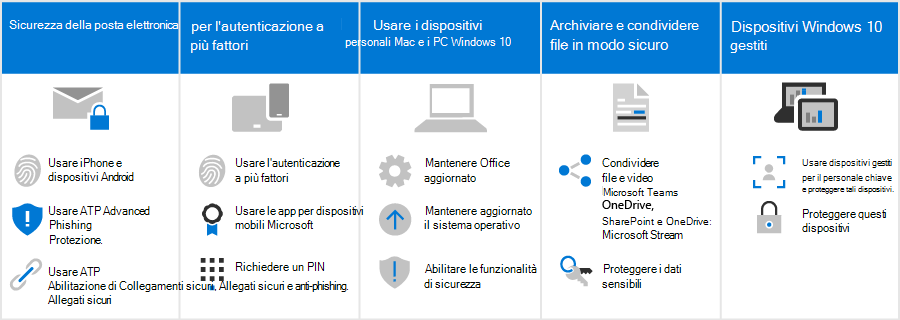

# Effetti di questi consigli sulla sicurezza sugli utentiHow these security recommendations affect your users

I consigli sulla sicurezza per Microsoft 365 in questa soluzione rendono molto più difficile per gli hacker accedere all'ambiente.The security recommendations for Microsoft 365 in this solution make it much harder for hackers to gain access to your environment. Il compromesso è che gli utenti dovranno essere consapevoli di come lavorare in questo ambiente più sicuro.The tradeoff is that your users will need to be aware of how to work within this more secure environment. Siamo consapevoli che è necessario un po' di pazienza, ma vale la pena proteggere l'organizzazione.We understand a little extra patience is required, but it's worth it to keep your organization protected.

## Usare procedure di posta elettronica sicureUse secure email practices

Tutti gli utenti devono essere a conoscenza e utilizzare queste procedure di posta elettronica per proteggere la posta elettronica:All users should be aware of and use these email practices to help keep their email secure:

- Configurare la posta elettronica per l'uso dell'autenticazione a più fattori con l'app di autenticazione.Set up email to use multi-factor authentication with the authenticator app.
- Verificare i messaggi di posta elettronica legittimi e cercare suggerimenti per la sicurezza da Advanced Phishing in Defender per La protezione di Office 365.Verify legitimate emails and look for safety tips from Advanced Phishing in Defender for Office 365 Protection.
- Aprire solo collegamenti e allegati sicuri, come verificato da Collegamenti sicuri e Allegati sicuri.Open only safe links and attachments, as verified by Safe Links and Safe Attachments.

Ulteriori informazioni [sull'autenticazione a più fattori](m365-campaigns-multifactor-authenication.md) e sul phishing e altri [attacchi.](m365-campaigns-phishing-and-attacks.md)Learn more about [multi-factor authentication](m365-campaigns-multifactor-authenication.md) and [phishing and other attacks](m365-campaigns-phishing-and-attacks.md).

Scaricare [un'infografica](m365-campaigns-protect-campaign-infographic.md) con suggerimenti per l'utente e i membri del team.Download an [infographic](m365-campaigns-protect-campaign-infographic.md) with tips for you and the members of your team.

## Configurare dispositivi iPhone e AndroidSet up iPhones and Android devices

Tutti gli utenti aggiunti all'ambiente dovranno richiedere alcuni minuti per configurare i [dispositivi iPhone](../business/set-up-mobile-devices.md?toc=%2Fmicrosoft-365%2Fcampaigns%2Ftoc.json) e Android in modo che funzionino in modo sicuro:All users you add to your environment will need to take a few minutes to [setup iPhones and Android devices](../business/set-up-mobile-devices.md?toc=%2Fmicrosoft-365%2Fcampaigns%2Ftoc.json) to work securely:

- Configura i dispositivi per l'uso dell'autenticazione a più fattori con l'app di autenticazione.Set up devices to use multi-factor authentication with the authenticator app.
- Usare le app per dispositivi mobili Microsoft, tra cui Outlook Mobile, Word, OneDrive e altre app Microsoft dall'App Store.Use Microsoft mobile apps, including Outlook Mobile, Word, OneDrive, and other Microsoft apps from the app store. Le app di posta nativa incluse in iPhone e dispositivi Android non sono supportate.The native mail apps that are included on iPhones and Android devices aren't supported. 
- Richiedi un PIN per consentire agli utenti di sbloccare il dispositivo.Require a PIN for users to unlock their device.

Dopo aver impostato queste impostazioni, agli utenti verrà richiesto di usare l'app di autenticazione quando accedono ai dati dell'organizzazione su questi dispositivi, inclusa la posta elettronica.After setting these up, your users will be prompted to use the authenticator app when accessing your organization data on these devices, including mail.

## Mantenere i Mac BYOD e i PC Windows 10 sempre nuoviKeep BYOD Macs and Windows 10 PCs fresh

È anche importante che gli utenti mantenino aggiornato il dispositivo di lavoro principale:It's also important that users keep their primary work device up to date:

- Installare le versioni più recenti delle app desktop di Office e mantenerlo aggiornato con gli aggiornamenti, quando richiesto.Install the latest versions of Office desktop apps and keep these fresh with updates, when prompted.
- Tieniti aggiornato sugli aggiornamenti del sistema operativo, ad esempio gli aggiornamenti di Windows.Stay on top of operating system updates, such as Windows updates.

Per [i dispositivi Windows 10](m365-campaigns-protect-pcs-macs.md)e Mac non gestiti, gli utenti hanno la responsabilità di garantire che le funzionalità di sicurezza di base siano abilitate.For [unmanaged Windows 10 and Mac devices](m365-campaigns-protect-pcs-macs.md), users have the responsibility to ensure that basic security features are enabled.

**Abilitare le funzionalità di sicurezza di base nei dispositivi BYOD Windows 10 e Mac****Enable basic security capabilities on BYOD Windows 10 and Mac devices**

| |**Windows 10****Windows 10**|**Mac****Mac**|
|:-----|:-----|:------|
|Funzionalità di sicurezzaSecurity capabilities|Attivare la protezione dei dispositivi BitLockerTurn on BitLocker device protection

 Verificare Windows Defender che rimanga attivoEnsure Windows Defender remains on 
Attivare Windows FirewallTurn on Windows Firewall| Usare FileVault per crittografare il disco MacUse FileVault to encrypt the Mac disk 

Utilizzare un software antivirus affidabileUse a reliable antivirus software 
Attivare la protezione firewallTurn on firewall protection|

Per ulteriori informazioni su questi suggerimenti, vedere [Proteggere l'account](https://support.office.com/article/Protect-your-account-and-devices-from-hackers-and-malware-066d6216-a56b-4f90-9af3-b3a1e9a327d6#ID0EAABAAA=Windows_10)e i dispositivi da hacker e malware.To learn more about these recommendations, see [Protect your account and devices from hackers and malware](https://support.office.com/article/Protect-your-account-and-devices-from-hackers-and-malware-066d6216-a56b-4f90-9af3-b3a1e9a327d6#ID0EAABAAA=Windows_10).

## Collaborare con Microsoft Teams, OneDrive, SharePoint Online e altri strumentiCollaborate using Microsoft Teams, OneDrive, SharePoint Online, and other tools

Gli utenti potrebbero essere tentati di condividere e archiviare i file dell'organizzazione in posizioni diverse da Microsoft 365.Your users might be tempted to share and store your organization files in places other than Microsoft 365. Microsoft 365 semplifica al massimo la collaborazione e la condivisione in modo sicuro.Microsoft 365 makes it as easy as possible to collaborate and share securely. È possibile [condividere file e video](share-files-and-videos.md) direttamente da Microsoft Teams, OneDrive, Stream e anche da un file.You can [share files and videos](share-files-and-videos.md) directly from Microsoft Teams, OneDrive, Stream, and even from within a file. La condivisione all'interno di questi strumenti consente di evitare perdite di dati.Sharing from within these tools helps keep your data from leaking. È possibile aggiungere ulteriore protezione ai dati sensibili per impedire la condivisione all'esterno dell'organizzazione.You can add additional protection to sensitive data to prevent sharing outside your organization.

## Configurare i dispositivi Windows 10 gestitiSet up managed Windows 10 devices

Consigliamo ai membri del personale più importanti di usare i dispositivi Windows 10 appena acquisiti che gestisci.We recommend that your most important staff members use freshly acquired Windows 10 devices that you manage. Ti mostreremo come gestire [e proteggere questi dispositivi.](../business/set-up-windows-devices.md?toc=/microsoft-365/campaigns/toc.json)We'll show you how to [manage and secure these devices](../business/set-up-windows-devices.md?toc=/microsoft-365/campaigns/toc.json). Ciò garantisce che i membri del personale che sono l'obiettivo di maggior valore per gli hacker ricevano la massima protezione.This ensures that staff members who are the highest value target to hackers receive the most protection.
