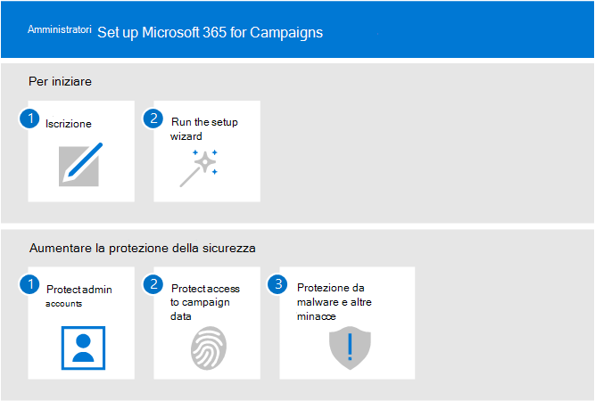
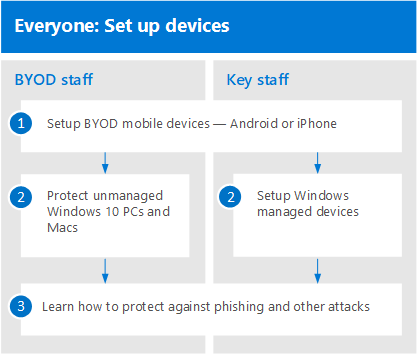

# Configurare Microsoft 365 per le campagne

In questo articolo viene descritto il processo di configurazione di Microsoft 365 per le campagne. Chiunque disponga di Microsoft 365 Business Premium può utilizzare queste linee guida per aumentare la sicurezza. 

## Amministratori: configurare Microsoft 365 per le campagne
Nel diagramma seguente viene illustrato il modo in cui gli amministratori hanno configurato Microsoft 365 per le campagne.

Per le campagne che si qualificano per i prezzi speciali, iniziare [richiedendo un invito da Microsoft](https://m365forcampaigns.microsoft.com/), quindi [iscriversi a Microsoft 365 per le campagne](m365-campaigns-sign-up.md). Per completare l'installazione, [eseguire l'installazione guidata](../business/set-up.md?toc=/microsoft-365/campaigns/toc.json) per configurare le impostazioni di base.

Per tutte le altre organizzazioni, dopo aver [effettuato l'iscrizione a Microsoft 365 Business Premium](../business/sign-up.md), completare l'installazione eseguendo [l'installazione guidata](../business/set-up.md?toc=/microsoft-365/campaigns/toc.json) per configurare le impostazioni di base.

Per tutte le organizzazioni, bump up Security Protection by: [proteggere gli account di amministratore](m365-campaigns-protect-admin-accounts.md), [proteggere l'accesso alla posta e ai dati](m365-campaigns-conditional-access.md)e [aumentare la protezione dalle minacce](m365-campaigns-increase-protection.md).

 ## Tutti: configurare i dispositivi 
 
Gli utenti dovranno richiedere alcuni minuti per configurare i dispositivi per l'utilizzo con questo ambiente. Per gli utenti chiave (quelli che sono gli obiettivi di valore più alto per gli hacker), è possibile configurare i nuovi dispositivi e preconfigurarli. In questo modo è possibile iniziare a eseguire l'accesso con le credenziali di Microsoft 365. 

  
Per configurare i dispositivi utente: 
1. Ogni utente [Configura i propri dispositivi mobili](../business/set-up-mobile-devices.md?toc=%2Fmicrosoft-365%2Fcampaigns%2Ftoc.json). 
2. Per i dispositivi non gestiti, gli utenti configurano i [PC e i Mac](m365-campaigns-protect-pcs-macs.md). Per il personale chiave, è consigliabile utilizzare i [dispositivi gestiti](../business/set-up-windows-devices.md?toc=/microsoft-365/campaigns/toc.json) per una protezione ancora più efficace. Per tutti i dispositivi, è necessario configurare [l'autenticazione](m365-campaigns-multifactor-authenication.md)a più fattori. 
3. Tutti gli utenti devono imparare a proteggere se stessi e la propria campagna imparando il [phishing e altri attacchi](m365-campaigns-phishing-and-attacks.md). Questo [infografica](m365-campaigns-protect-campaign-infographic.md) può anche aiutare gli utenti a capire come proteggere la propria campagna dalle minacce online.

## Contattare il supporto

 **Se è necessario contattare il supporto:**
  
In qualità di amministratore Microsoft 365, è possibile accedere al team di supporto clienti, ** [contattare il supporto tecnico per i prodotti aziendali-Guida per gli amministratori](https://support.office.com/article/32a17ca7-6fa0-4870-8a8d-e25ba4ccfd4b)**
    

