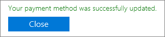
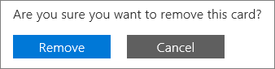
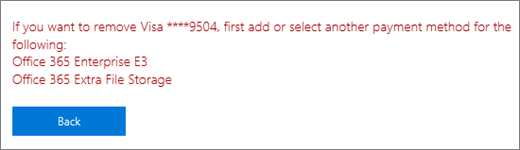

# Aggiungere, aggiornare o rimuovere i metodi di pagamento

::: moniker range="o365-21vianet"

> [!NOTE]
> L'interfaccia di amministrazione cambia. Se l'esperienza non corrisponde ai dettagli presentati, vedere [About The New Microsoft 365 Admin Center](https://docs.microsoft.com/microsoft-365/admin/microsoft-365-admin-center-preview?view=o365-21vianet).

::: moniker-end

::: moniker range="o365-worldwide"
È possibile acquistare prodotti e servizi da Microsoft con una carta di credito o di debito o un conto corrente bancario. È possibile immettere le informazioni di pagamento nella pagina **Modalità di pagamento** o quando si effettua un acquisto.

È possibile gestire solo i metodi di pagamento che sono stati aggiunti.

> [!NOTE]
> La possibilità di pagare con un conto corrente bancario non è disponibile in alcuni paesi o aree geografiche.
>
> È necessario utilizzare una carta di credito emessa dallo stesso paese del tenant.

**L'interfaccia visualizzata non corrisponde a quella descritta in questo articolo?** In caso affermativo, vedere [Manage Payment methods](manage-payment-methods.md).

## Aggiungere una modalità di pagamento

1. Nell'interfaccia di amministrazione, accedere alla pagina dei <a href="https://go.microsoft.com/fwlink/p/?linkid=2018806" target="_blank">metodi di pagamento</a> per la **fatturazione** > **& pagamenti** > .
2. Selezionare **Aggiungere una modalità di pagamento**.
3. Nella pagina **Modalità di pagamento** scegliere una modalità di pagamento dal menu a discesa.
4. Immettere le informazioni per la nuova scheda o il conto corrente bancario, quindi selezionare **Aggiungi**.

## Aggiornare una modalità di pagamento esistente

Non è possibile modificare il numero su una carta o un conto corrente bancario esistente. Se la scheda o il numero di conto corrente bancario è stato modificato, aggiungerlo come nuovo metodo di pagamento. Successivamente, selezionarlo come opzione di pagamento per l'abbonamento, quindi rimuovere la carta o il conto corrente bancario esistente. È necessario utilizzare una scheda emessa dallo stesso paese del tenant.

1. Nell'interfaccia di amministrazione, accedere alla pagina dei <a href="https://go.microsoft.com/fwlink/p/?linkid=2018806" target="_blank">metodi di pagamento</a> per la **fatturazione** > **& pagamenti** > .
2. Nella pagina **metodi di pagamento** , scegliere la scheda o il conto corrente bancario da aggiornare, quindi selezionare **modifica**.
3. Aggiornare le informazioni sul metodo di pagamento (nome sulla carta o sul conto corrente bancario, sull'indirizzo di fatturazione, sul numero di telefono o sulla data di scadenza), quindi selezionare **Salva**.

## Modificare una modalità di pagamento

È possibile modificare il metodo di pagamento utilizzato per pagare un singolo abbonamento. È inoltre possibile spostare tutte le sottoscrizioni da un metodo di pagamento a un altro.

### Modificare il metodo di pagamento utilizzato per un singolo abbonamento

1. Nell'interfaccia di amministrazione, andare alla pagina **fatturazione** > dei <a href="https://go.microsoft.com/fwlink/p/?linkid=842054" target="_blank">prodotti</a> .
2. Selezionare l'abbonamento che si desidera pagare con la nuova carta o il conto corrente bancario. In **fatturazione**, fare clic su **modifica**accanto al metodo di pagamento.
3. Accanto al metodo di pagamento esistente, selezionare **Cambia**.
4. Nel menu a discesa, selezionare un metodo di pagamento alternativo oppure scegliere di aggiungere un metodo di pagamento.
5. Se si aggiunge un metodo di pagamento, immettere la scheda o i dettagli dell'account, quindi fare clic su **Salva**.
6. Verificare che il metodo di pagamento selezionato sia corretto, quindi selezionare **Salva**.

### Modificare il metodo di pagamento utilizzato per più sottoscrizioni

1. Nell'interfaccia di amministrazione, accedere alla pagina dei <a href="https://go.microsoft.com/fwlink/p/?linkid=2018806" target="_blank">metodi di pagamento</a> per la **fatturazione** > **& pagamenti** > .
2. Accanto al metodo di pagamento che si desidera modificare, selezionare il menu **altro** (tre punti) e quindi selezionare **Cambia abbonamenti**.
3. Il riquadro **Cambia metodo di pagamento** elenca gli abbonamenti esistenti che utilizzano il metodo di pagamento.
4. Nell'elenco a discesa **Seleziona metodo di pagamento** selezionare un metodo di pagamento diverso, quindi fare clic su **Salva**.

> [!NOTE]
> È possibile modificare solo i metodi di pagamento esistenti nel riquadro **Cambia metodo di pagamento** . Se si desidera modificare il pagamento tramite fattura, vedere [passare da carta di credito o conto corrente bancario a fattura](change-payment-method.md#change-from-credit-card-or-bank-account-to-invoice).

## Rimuovere una modalità di pagamento

Se non è collegato a un abbonamento, è possibile rimuovere una carta di credito o di debito o un conto corrente bancario dall'elenco dei metodi di pagamento. Questo vale per tutte le sottoscrizioni, indipendentemente dallo stato. Aggiungere un metodo di pagamento per l'abbonamento, quindi rimuovere quello precedente da quell'abbonamento. Se il metodo di pagamento è associato a un profilo di fatturazione, modificare il metodo di pagamento utilizzato per il profilo di fatturazione, quindi rimuovere il metodo di pagamento.

### Eliminare un metodo di pagamento

Se la modalità di pagamento non è associata ad alcun abbonamento, è possibile eliminarla immediatamente.

1. Nell'interfaccia di amministrazione, accedere alla pagina dei <a href="https://go.microsoft.com/fwlink/p/?linkid=2018806" target="_blank">metodi di pagamento</a> per la **fatturazione** > **& pagamenti** > .
2. Posizionare il puntatore del mouse sulla carta di credito o sul conto corrente bancario e quindi selezionare l'icona di eliminazione.
3. Nella parte inferiore del riquadro del **metodo di pagamento eliminare** , selezionare **Elimina**.

### Aggiungere un metodo di pagamento alternativo utilizzato per pagare gli abbonamenti

Se il metodo di pagamento è associato a qualsiasi sottoscrizione e non si dispone di un metodo di pagamento alternativo su file, aggiungere innanzitutto un metodo di pagamento. Successivamente, modificare il metodo di pagamento utilizzato per pagare gli abbonamenti. È quindi possibile eliminare il metodo di pagamento.

1. Nell'interfaccia di amministrazione, accedere alla pagina dei <a href="https://go.microsoft.com/fwlink/p/?linkid=2018806" target="_blank">metodi di pagamento</a> per la **fatturazione** > **& pagamenti** > .
2. Posizionare il puntatore del mouse sulla carta di credito o sul conto corrente bancario e quindi selezionare l'icona di eliminazione.
3. Nel riquadro **Elimina metodo di pagamento** sono elencate le sottoscrizioni esistenti che utilizzano il metodo di pagamento.
4. Selezionare **Aggiungere una modalità di pagamento**.
5. Selezionare il tipo di metodo di pagamento che si desidera aggiungere, immettere le informazioni dell'account e quindi fare clic su **Aggiungi**.
6. Selezionare il nuovo metodo di pagamento nell'elenco a discesa, quindi selezionare **Cambia**.
    > [!WARNING]
    > In questo modo, tutte le sottoscrizioni verranno spostate nel nuovo metodo di pagamento.
7. Selezionare **Elimina**.

### Modificare il metodo di pagamento utilizzato per pagare gli abbonamenti

Se il metodo di pagamento è associato a qualsiasi sottoscrizione e si dispone di almeno un metodo di pagamento alternativo su file, modificare prima il metodo di pagamento utilizzato per pagare gli abbonamenti. È quindi possibile eliminare il metodo di pagamento.

1. Nell'interfaccia di amministrazione, accedere alla pagina dei <a href="https://go.microsoft.com/fwlink/p/?linkid=2018806" target="_blank">metodi di pagamento</a> per la **fatturazione** > **& pagamenti** > .
2. Posizionare il puntatore del mouse sulla carta di credito o sul conto corrente bancario e quindi selezionare l'icona di eliminazione.
3. Nel riquadro **Elimina metodo di pagamento** sono elencate le sottoscrizioni esistenti che utilizzano il metodo di pagamento.
4. Selezionare **Cambia metodo di pagamento**.
5. Selezionare un metodo di pagamento alternativo dall'elenco a discesa, quindi selezionare **Cambia**.
    > [!WARNING]
    > Questo sposterà tutti gli abbonamenti al metodo di pagamento alternativo.
6. Selezionare **Elimina**.

### Modificare il metodo di pagamento per un profilo di fatturazione

Se il metodo di pagamento è associato a un profilo di fatturazione e non è utilizzato anche per pagare direttamente altri abbonamenti, modificare prima il metodo di pagamento associato. È quindi possibile eliminare il metodo di pagamento.

1. Nell'interfaccia di amministrazione, **accedere alla** > pagina > <a href="https://go.microsoft.com/fwlink/p/?linkid=2103629" target="_blank">profili fatturazione</a> ** &amp; pagamenti fatture** .
2. Selezionare il profilo di fatturazione che si desidera aggiornare.
3. Nella pagina dei dettagli del profilo di fatturazione, sotto **metodo di pagamento**, selezionare **modifica**.
4. Se si aggiunge un metodo di pagamento alternativo, selezionare **Aggiungi un metodo di pagamento**. Immettere le informazioni sull'account, quindi fare clic su **Aggiungi**.
5. Nell'elenco a discesa **selezionare un metodo di pagamento** , selezionare un metodo di pagamento diverso, quindi fare clic su **Salva**.
6. Seguire la procedura descritta in [Delete an Payment Method](#delete-a-payment-method).

### Modificare il metodo di pagamento utilizzato sia per un profilo di fatturazione sia per le sottoscrizioni

Se il metodo di pagamento è associato a un profilo di fatturazione e viene utilizzato anche per pagare direttamente per eventuali abbonamenti, modificare prima il metodo di pagamento associato al profilo di fatturazione. Successivamente, modificare il metodo di pagamento utilizzato per pagare gli abbonamenti. È quindi possibile eliminare il metodo di pagamento.

1. Seguire i passaggi da 1 a 5 in [cambiare il metodo di pagamento per un profilo di fatturazione](#change-the-payment-method-for-a-billing-profile).
2. Se non si dispone di un metodo di pagamento alternativo, seguire la procedura descritta in [aggiungere un metodo di pagamento alternativo utilizzato per pagare gli abbonamenti](#add-an-alternate-payment-method-used-to-pay-for-subscriptions).
3. Se sono già disponibili altri metodi di pagamento, seguire la procedura in [modificare un metodo di pagamento](#change-a-payment-method).

## Risoluzione dei problemi relativi alle modalità di pagamento

|**Problema**|**Procedure per la risoluzione dei problemi**|
|:-----|:-----|
|**Viene visualizzato un messaggio di errore che indica che il browser è attualmente impostato per bloccare i cookie.**   |Impostare il browser in modo da accettare i cookie di terze parti e riprovare.    |
|**La carta di credito o di debito è stata rifiutata.**   |Se si paga con carta di credito o di debito e la scheda viene rifiutata, viene visualizzato un messaggio di posta elettronica che indica che Microsoft non è stato in grado di elaborare il pagamento. Verificare che il numero di carta dei &mdash; dettagli della scheda, la data di scadenza, il nome della scheda e l'indirizzo, tra cui la città, lo stato e il codice postale, vengano visualizzati esattamente come nella scheda e nell'istruzione. È possibile aggiornare le informazioni sulla scheda e inoltrare immediatamente il pagamento utilizzando il collegamento **Risolvi saldo** nella sezione **fatturazione** della pagina Dettagli sottoscrizione. Per ulteriori informazioni, vedere [che cosa accade se la carta di credito è stata rifiutata e il pagamento è scaduto?](pay-for-your-subscription.md#what-if-my-credit-card-was-declined-and-my-payment-is-past-due).      Se si continua a visualizzare il messaggio "rifiutato", contattare la propria banca. È possibile che la scheda non sia attiva. Se la scheda è stata ricevuta di recente nella posta con una data di scadenza aggiornata, assicurarsi che sia attivata. La banca può anche indicare se la scheda non è stata approvata per transazioni online, internazionali o ricorrenti.    |
|**Si desidera aggiornare una scheda o un numero di conto corrente bancario.**   |Non è possibile modificare il numero su una carta o un conto corrente bancario esistente. Se la scheda o il numero di conto corrente bancario è cambiato, aggiungere un altro numero di carta o un conto corrente bancario. Successivamente, spostare tutti gli abbonamenti attivi dalla scheda o dall'account precedente a quello nuovo. Eliminare quindi la scheda o l'account precedente. Per ulteriori informazioni, vedere [aggiungere un metodo di pagamento](#add-a-payment-method) o [modificare un metodo di pagamento](#change-a-payment-method). |
|**Ho solo una carta o un conto corrente bancario sul mio account e lo si desidera rimuovere.**   |Se si dispone di una sola scheda o di un account bancario, viene visualizzato un messaggio di errore quando si tenta di rimuoverlo. Per correggere l'errore, assicurarsi di utilizzare un metodo di pagamento diverso per pagare tutti gli abbonamenti, quindi provare a rimuovere di nuovo la scheda o il conto corrente bancario.    |
|**Non è possibile aggiungere la scheda o il conto corrente bancario.**   |In caso di problemi nell'immissione delle informazioni sulla carta o sul conto corrente bancario, è possibile [contattare il supporto tecnico](../../admin/contact-support-for-business-products.md).    |

::: moniker-end

::: moniker range="o365-21vianet"

È necessario essere un amministratore globale o un amministratore fatturazione per eseguire le attività descritte in questo articolo.
  
 **Se non si è un amministratore** Contattare l'amministratore IT per ottenere assistenza. [Chi ha le autorizzazioni di amministratore nella mia azienda?](../../admin/admin-overview/admin-overview.md#who-has-admin-permissions-in-my-business)

> [!NOTE]
> La possibilità di pagare con un conto corrente bancario non è disponibile in alcuni paesi o aree geografiche.
>
> È necessario utilizzare una carta di credito emessa dallo stesso paese del tenant.

## Aggiungere una carta di credito o un conto corrente bancario

1. Nell'interfaccia di amministrazione passare alla pagina **Fatturazione** \> <a href="https://go.microsoft.com/fwlink/p/?linkid=850626" target="_blank">Abbonamenti</a>.

2. Scegliere l'abbonamento che si vuole pagare con la nuova carta di credito o il conto corrente bancario, quindi selezionare **Aggiorna dettagli pagamento**.

    
  
3. Selezionare la freccia a discesa in **Aggiungi o selezionare un metodo di pagamento**, quindi selezionare **nuova carta di credito** o **nuovo conto corrente bancario**.

    
  
4. Immettere le informazioni per la nuova carta di credito o il conto corrente bancario, quindi selezionare **Invia**.

    > [!NOTE]
    > La nuova carta di credito o il conto corrente bancario verrà utilizzato solo per l'abbonamento scelto nel passaggio 2. Se si intende usare la nuova carta di credito o il nuovo conto corrente bancario anche per altri abbonamenti, seguire i passaggi di questo articolo per modificare la carta o il conto usato per pagare ogni abbonamento.

::: moniker-end

::: moniker range="o365-germany"
## Aggiungere una carta di credito o un conto corrente bancario

È necessario essere un amministratore globale o un amministratore fatturazione per eseguire le attività descritte in questo articolo.
  
 **Per utenti non amministratori:** Contattare l'amministratore per assistenza. [Chi ha le autorizzazioni di amministratore nella mia attività?](../../admin/admin-overview/admin-overview.md#who-has-admin-permissions-in-my-business).
  
> [!NOTE]
> La possibilità di pagare con un conto corrente bancario non è disponibile in alcuni paesi o aree geografiche.
>
> È necessario utilizzare una carta di credito emessa dallo stesso paese del tenant.

1. Nell'interfaccia di amministrazione passare alla pagina **Fatturazione** \> <a href="https://go.microsoft.com/fwlink/p/?linkid=847745" target="_blank">Abbonamenti</a>.

2. Scegliere l'abbonamento che si vuole pagare con la nuova carta di credito o il conto corrente bancario, quindi selezionare **Aggiorna dettagli pagamento**.

    
  
3. Selezionare la freccia a discesa in **Aggiungi o selezionare un metodo di pagamento**, quindi selezionare **nuova carta di credito** o **nuovo conto corrente bancario**.

    
  
4. Immettere le informazioni per la nuova carta di credito o il conto corrente bancario, quindi selezionare **Invia**.

    > [!NOTE]
    > La nuova carta di credito o il conto corrente bancario verrà utilizzato solo per l'abbonamento scelto nel passaggio 2. Se si intende usare la nuova carta di credito o il nuovo conto corrente bancario anche per altri abbonamenti, seguire i passaggi di questo articolo per modificare la carta o il conto usato per pagare ogni abbonamento.

::: moniker-end

::: moniker range="o365-21vianet"
## Aggiornare una carta di credito o un conto corrente bancario esistente

> [!NOTE]
> Non è possibile cambiare il numero riportato su una carta di credito o un conto corrente bancario esistente. Se la carta di credito o il numero di conto corrente bancario è stato modificato, aggiungerlo come nuova carta di credito o conto corrente bancario. Successivamente, selezionarlo come opzione di pagamento per l'abbonamento, quindi rimuovere la carta di credito o il conto corrente bancario esistente.
> È necessario utilizzare una carta di credito emessa dallo stesso paese del tenant.

1. Nell'interfaccia di amministrazione passare alla pagina **Fatturazione** \> <a href="https://go.microsoft.com/fwlink/p/?linkid=850626" target="_blank">Abbonamenti</a>.

2. Scegliere l'abbonamento acquistato con il conto corrente bancario della carta di credito che si desidera aggiornare, quindi selezionare **Aggiorna dettagli pagamento**.

    > [!NOTE]
    > Se l'abbonamento è stato acquistato da un altro amministratore, non sarà possibile aggiornare le informazioni sulla carta di credito o sul conto corrente bancario. Se la carta di credito sta per scadere e l'altro amministratore non è in grado di aggiornarlo, è possibile evitare interruzioni del servizio se si aggiunge una carta di credito o un nuovo account bancario diverso per l'abbonamento.
  
    
  
3. Selezionare la freccia a discesa in **Aggiungi o selezionare un metodo di pagamento**. Selezionare la carta di credito o il conto corrente bancario che si desidera aggiornare, quindi selezionare **Modifica dettagli**.

    
  
4. Aggiornare le informazioni sulla carta di credito o sul conto corrente bancario (nome sulla carta di credito o sul conto corrente bancario, indirizzo di fatturazione. il numero di telefono o la data di scadenza) in base alle esigenze, quindi selezionare **Invia**.

5. Verrà visualizzato un messaggio di conferma. In caso contrario, vedere la sezione "risoluzione dei problemi relativi a carte di credito e account bancari" più avanti in questo articolo.

    

::: moniker-end

::: moniker range="o365-germany"
## Aggiornare una carta di credito o un conto corrente bancario esistente

> [!NOTE]
> Non è possibile cambiare il numero riportato su una carta di credito o un conto corrente bancario esistente. Se la carta di credito o il numero di conto corrente bancario è stato modificato, aggiungerlo come nuova carta di credito o conto corrente bancario. Successivamente, selezionarlo come opzione di pagamento per l'abbonamento, quindi rimuovere la carta di credito o il conto corrente bancario esistente.
> È necessario utilizzare una carta di credito emessa dallo stesso paese del tenant.

1. Nell'interfaccia di amministrazione passare alla pagina **Fatturazione** \> <a href="https://go.microsoft.com/fwlink/p/?linkid=847745" target="_blank">Abbonamenti</a>.

2. Scegliere l'abbonamento acquistato con il conto corrente bancario della carta di credito che si desidera aggiornare, quindi selezionare **Aggiorna dettagli pagamento**.

    > [!NOTE]
    > Se l'abbonamento è stato acquistato da un altro amministratore, non sarà possibile aggiornare le informazioni sulla carta di credito o sul conto corrente bancario. Se la carta di credito sta per scadere e l'altro amministratore non è in grado di aggiornarlo, è possibile evitare interruzioni del servizio se si aggiunge una carta di credito o un nuovo account bancario diverso per l'abbonamento.
  
    
  
3. Selezionare la freccia a discesa in **Aggiungi o selezionare un metodo di pagamento**. Selezionare la carta di credito o il conto corrente bancario che si desidera aggiornare, quindi selezionare **Modifica dettagli**.

    
  
4. Aggiornare le informazioni sulla carta di credito o sul conto corrente bancario (nome sulla carta di credito o sul conto corrente bancario, indirizzo di fatturazione. il numero di telefono o la data di scadenza) in base alle esigenze, quindi selezionare **Invia**.

5. Verrà visualizzato un messaggio di conferma. In caso contrario, vedere la sezione "risoluzione dei problemi relativi a carte di credito e account bancari" più avanti in questo articolo.

    

::: moniker-end

::: moniker range="o365-21vianet"
## Rimuovere una carta di credito o un conto corrente bancario

1. Nell'interfaccia di amministrazione passare alla pagina **Fatturazione** \> <a href="https://go.microsoft.com/fwlink/p/?linkid=850626" target="_blank">Abbonamenti</a>.

2. Scegliere qualsiasi sottoscrizione, quindi selezionare **Aggiorna dettagli pagamento**.

    
  
3. Selezionare la freccia a discesa in **Aggiungi o selezionare un metodo di pagamento**.

4. Selezionare la carta di credito o il conto corrente bancario, quindi fare clic su **Rimuovi**.

    
  
5. Selezionare di nuovo **Rimuovi** per eliminare la carta di credito o il conto corrente bancario.

    
  
    > [!NOTE]
    > Non sarà possibile rimuovere una carta di credito o un conto corrente bancario se attualmente è utilizzato per pagare un abbonamento. Se si cerca, viene visualizzato un messaggio simile al seguente   
    > Per rimuovere la carta di credito o il conto corrente bancario, selezionare **indietro** e seguire i passaggi descritti in questo articolo per modificare la carta di credito o il conto corrente bancario che si utilizza per pagare la sottoscrizione. Quindi provare di nuovo a rimuovere la carta o il conto.

::: moniker-end

::: moniker range="o365-germany"
## Rimuovere una carta di credito o un conto corrente bancario

1. Nell'interfaccia di amministrazione passare alla pagina **Fatturazione** \> <a href="https://go.microsoft.com/fwlink/p/?linkid=847745" target="_blank">Abbonamenti</a>.

2. Scegliere qualsiasi sottoscrizione, quindi selezionare **Aggiorna dettagli pagamento**.

    
  
3. Selezionare la freccia a discesa in **Aggiungi o selezionare un metodo di pagamento**.

4. Selezionare la carta di credito o il conto corrente bancario, quindi fare clic su **Rimuovi**.

    

5. Selezionare di nuovo **Rimuovi** per eliminare la carta di credito o il conto corrente bancario.

    
  
    > [!NOTE]
    > Non sarà possibile rimuovere una carta di credito o un conto corrente bancario se attualmente è utilizzato per pagare un abbonamento. Se si cerca, viene visualizzato un messaggio simile al seguente   
    > Per rimuovere la carta di credito o il conto corrente bancario, selezionare **indietro** e seguire i passaggi descritti in questo articolo per modificare la carta di credito o il conto corrente bancario che si utilizza per pagare la sottoscrizione. Quindi provare di nuovo a rimuovere la carta o il conto.

::: moniker-end

::: moniker range="o365-21vianet"
## Modificare la carta di credito o il conto corrente bancario utilizzato per pagare un abbonamento

1. Nell'interfaccia di amministrazione passare alla pagina **Fatturazione** \> <a href="https://go.microsoft.com/fwlink/p/?linkid=850626" target="_blank">Abbonamenti</a>.

2. Scegliere l'abbonamento che si desidera pagare con la nuova carta di credito o il conto corrente bancario, quindi selezionare **Aggiorna dettagli pagamento**.

    
  
3. Selezionare la freccia a discesa in **Aggiungi o selezionare un metodo di pagamento** e selezionare la carta di credito o il conto corrente bancario che si desidera utilizzare.

    
  
4. Selezionare **Invia**. Se la carta di credito o il conto corrente bancario che si desidera utilizzare non è ancora elencato, scegliere **nuova carta di credito** o **nuovo conto corrente bancario** per aggiungerlo.

::: moniker-end

::: moniker range="o365-germany"
## Modificare la carta di credito o il conto corrente bancario utilizzato per pagare un abbonamento

1. Nell'interfaccia di amministrazione passare alla pagina **Fatturazione** \> <a href="https://go.microsoft.com/fwlink/p/?linkid=847745" target="_blank">Abbonamenti</a>.

2. Scegliere l'abbonamento che si desidera pagare con la nuova carta di credito o il conto corrente bancario, quindi selezionare **Aggiorna dettagli pagamento**.

    
  
3. Selezionare la freccia a discesa in **Aggiungi o selezionare un metodo di pagamento** e selezionare la carta di credito o il conto corrente bancario che si desidera utilizzare.

    
  
4. Selezionare **Invia**. Se la carta di credito o il conto corrente bancario che si desidera utilizzare non è ancora elencato, scegliere **nuova carta di credito** o **nuovo conto corrente bancario** per aggiungerlo.

::: moniker-end

::: moniker range="o365-21vianet"
## Risoluzione dei problemi relativi alle carte di credito e ai conti correnti bancari

|**Problema**|**Procedure per la risoluzione dei problemi**|
|:-----|:-----|
|**Viene visualizzato un messaggio di errore che avvisa che il browser è impostato per bloccare i cookie.**   |Impostare il browser in modo da accettare i cookie di terze parti e riprovare.    |
|**La carta di credito è stata rifiutata.**   |Se si paga con carta di credito e la carta di credito viene rifiutata, si riceve un messaggio di posta elettronica che non è stato possibile elaborare il pagamento. Verificare che i dati della carta di credito (numero di carta, data di scadenza, nome sulla carta di credito e indirizzo, tra cui City, state e CAP) vengano visualizzati esattamente come nella carta di credito e nell'estratto conto della carta di credito. È possibile aggiornare le informazioni sulla carta di credito e inviare immediatamente il pagamento utilizzando la funzionalità **paga ora** . Per ulteriori informazioni, vedere [che cosa accade se la carta di credito è stata rifiutata e il pagamento è scaduto?](pay-for-your-subscription.md#what-if-my-credit-card-was-declined-and-my-payment-is-past-due).      Se si continua a visualizzare il messaggio "rifiutato", contattare la propria banca. È possibile che la carta di credito non sia attiva. Se la carta di credito è stata ricevuta di recente nella posta con una data di scadenza aggiornata, assicurarsi che sia attivata. La banca può anche indicare se la carta di credito non è stata approvata per transazioni online, internazionali o ricorrenti.    |
|**Si desidera aggiornare una carta di credito o il numero di conto corrente bancario.**   |Non è possibile cambiare il numero riportato su una carta di credito o un conto corrente bancario esistente. Se la carta di credito o il numero di conto corrente bancario è cambiato, [aggiungere una nuova carta di credito o un conto corrente bancario](#add-a-credit-card-or-bank-account), [cambiare l'abbonamento a tale carta o conto corrente bancario](#change-the-credit-card-or-bank-account-used-to-pay-for-a-subscription), quindi [eliminare la vecchia carta di credito o il conto corrente bancario](#remove-a-credit-card-or-bank-account). |
|**All'account è associata una sola carta di credito o un solo conto corrente bancario e si vuole rimuoverlo.**   |Se si dispone di una sola carta di credito o un conto corrente bancario, viene visualizzato un messaggio di errore quando si tenta di rimuoverlo. Per correggere l'errore, assicurarsi di utilizzare un metodo di pagamento diverso per pagare tutti gli abbonamenti, quindi provare a rimuovere di nuovo la carta di credito o il conto corrente bancario.    |
|**Non si riesce ad aggiungere la carta di credito o il conto corrente bancario.**   |Se si riscontrano problemi durante l'immissione delle informazioni della carta di credito o del conto corrente bancario, è possibile [contattare il supporto](../../admin/contact-support-for-business-products.md).  |

::: moniker-end

::: moniker range="o365-germany"
## Risoluzione dei problemi relativi alle carte di credito e ai conti correnti bancari

|**Problema**|**Procedure per la risoluzione dei problemi**|
|:-----|:-----|
|**Viene visualizzato un messaggio di errore che avvisa che il browser è impostato per bloccare i cookie.**   |Impostare il browser in modo da accettare i cookie di terze parti e riprovare.    |
|**La carta di credito è stata rifiutata.**   |Se si paga con carta di credito e la carta di credito viene rifiutata, si riceve un messaggio di posta elettronica che non è stato possibile elaborare il pagamento. Verificare che i dati della carta di credito (numero di carta, data di scadenza, nome sulla carta di credito e indirizzo, tra cui City, state e CAP) vengano visualizzati esattamente come nella carta di credito e nell'estratto conto della carta di credito. È possibile aggiornare le informazioni sulla carta di credito e inviare immediatamente il pagamento utilizzando la funzionalità **paga ora** . Per ulteriori informazioni, vedere [che cosa accade se la carta di credito è stata rifiutata e il pagamento è scaduto?](pay-for-your-subscription.md#what-if-my-credit-card-was-declined-and-my-payment-is-past-due).      Se si continua a visualizzare il messaggio "rifiutato", contattare la propria banca. È possibile che la carta di credito non sia attiva. Se la carta di credito è stata ricevuta di recente nella posta con una data di scadenza aggiornata, assicurarsi che sia attivata. La banca può anche indicare se la carta di credito non è stata approvata per transazioni online, internazionali o ricorrenti.    |
|**Si desidera aggiornare una carta di credito o il numero di conto corrente bancario.**   |Non è possibile cambiare il numero riportato su una carta di credito o un conto corrente bancario esistente. Se la carta di credito o il numero di conto corrente bancario è cambiato, [aggiungere una nuova carta di credito o un conto corrente bancario](#add-a-credit-card-or-bank-account-1), [cambiare l'abbonamento a quello della carta di credito o del conto corrente bancario](#change-the-credit-card-or-bank-account-used-to-pay-for-a-subscription-1), quindi [eliminare la vecchia carta di credito o il conto corrente](#remove-a-credit-card-or-bank-account-1)bancario. |
|**All'account è associata una sola carta di credito o un solo conto corrente bancario e si vuole rimuoverlo.**   |Se si dispone di una sola carta di credito o un conto corrente bancario, viene visualizzato un messaggio di errore quando si tenta di rimuoverlo. Per correggere l'errore, assicurarsi di utilizzare un metodo di pagamento diverso per pagare tutti gli abbonamenti, quindi provare a rimuovere di nuovo la carta di credito o il conto corrente bancario.    |
|**Non si riesce ad aggiungere la carta di credito o il conto corrente bancario.**   |Se si riscontrano problemi durante l'immissione delle informazioni della carta di credito o del conto corrente bancario, è possibile [contattare il supporto](../../admin/contact-support-for-business-products.md).  |

::: moniker-end

## Articoli correlati

[Cambiare gli indirizzi di fatturazione](change-your-billing-addresses.md)
  
[Annullare l'abbonamento](../subscriptions/cancel-your-subscription.md)
