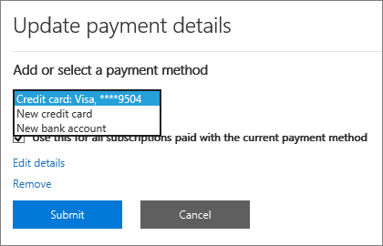

# Aggiungere, aggiornare o rimuovere i metodi di pagamentoAdd, update, or remove your payment methods

::: moniker range="o365-worldwide"
È possibile acquistare prodotti e servizi da Microsoft con una carta di credito o di debito o un conto corrente bancario.You can purchase products and services from Microsoft with a credit or debit card, or bank account. È possibile immettere le informazioni di pagamento nella pagina **metodi di pagamento** o quando si effettua un acquisto.You can enter your payment information on the **Payment methods** page, or when you make a purchase.

È possibile gestire solo i metodi di pagamento che sono stati aggiunti.You can only manage payment methods that you've added.

> [!NOTE]
> La possibilità di pagare con un conto corrente bancario non è disponibile in alcuni paesi o aree geografiche.The option to pay with a bank account is not available in some countries or regions.
>
> È necessario utilizzare una carta di credito emessa dallo stesso paese del tenant.You must use a credit card issued from the same country as your tenant.

**L'interfaccia visualizzata non corrisponde a quella descritta in questo articolo?****Does the interface you see not match the one described in this article?** In caso affermativo, vedere [Manage Payment methods](manage-payment-methods.md).If so, see [Manage payment methods](manage-payment-methods.md).

## Aggiungere un metodo di pagamentoAdd a payment method

1. Nell'interfaccia di amministrazione, accedere alla pagina dei <a href="https://go.microsoft.com/fwlink/p/?linkid=2018806" target="_blank">metodi di pagamento</a> per la **fatturazione** > **& pagamenti** > .In the admin center, go to the **Billing** > **Bills & payments** > <a href="https://go.microsoft.com/fwlink/p/?linkid=2018806" target="_blank">Payment methods</a> page.
2. Selezionare **Aggiungere una modalità di pagamento**.Select **Add a payment method**.
3. Nella pagina **Modalità di pagamento** scegliere una modalità di pagamento dal menu a discesa.On the **Payment methods** page, pick a payment method from the drop-down menu.
4. Immettere le informazioni per la nuova scheda o il conto corrente bancario, quindi selezionare **Aggiungi**.Enter the information for the new card or bank account, then select **Add**.

## Aggiornare un metodo di pagamento esistenteUpdate an existing payment method

Non è possibile modificare il numero su una carta o un conto corrente bancario esistente.You can't change the number on an existing card or bank account. Se la scheda o il numero di conto corrente bancario è stato modificato, aggiungerlo come nuovo metodo di pagamento.If the card or bank account number has changed, add it as a new payment method. Successivamente, selezionarlo come opzione di pagamento per l'abbonamento, quindi rimuovere la carta o il conto corrente bancario esistente.Next, pick it as the payment option for your subscription, then remove the existing card or bank account. È necessario utilizzare una scheda emessa dallo stesso paese del tenant.You must use a card issued from the same country as your tenant.

1. Nell'interfaccia di amministrazione, accedere alla pagina dei <a href="https://go.microsoft.com/fwlink/p/?linkid=2018806" target="_blank">metodi di pagamento</a> per la **fatturazione** > **& pagamenti** > .In the admin center, go to the **Billing** > **Bills & payments** > <a href="https://go.microsoft.com/fwlink/p/?linkid=2018806" target="_blank">Payment methods</a> page.
2. Nella pagina **metodi di pagamento** , scegliere la scheda o il conto corrente bancario da aggiornare, quindi selezionare **modifica**.On the **Payment methods** page, pick the card or bank account to update, then select **Edit**.
3. Aggiornare le informazioni sul metodo di pagamento (nome sulla carta o sul conto corrente bancario, sull'indirizzo di fatturazione, sul numero di telefono o sulla data di scadenza), quindi selezionare **Salva**.Update your payment method information (name on the card or bank account, billing address, phone number, or expiration date), then select **Save**.

## Modificare un metodo di pagamentoChange a payment method

È possibile modificare il metodo di pagamento utilizzato per pagare un singolo abbonamento.You can change the payment method that is used to pay for a single subscription. È inoltre possibile spostare tutte le sottoscrizioni da un metodo di pagamento a un altro.You can also move all subscriptions from one payment method to another.

### Modificare il metodo di pagamento utilizzato per un singolo abbonamentoChange the payment method used for a single subscription

1. Nell'interfaccia di amministrazione passare alla pagina **Fatturazione** > <a href="https://go.microsoft.com/fwlink/p/?linkid=842054" target="_blank">Prodotti e servizi</a>.In the admin center, go to the **Billing** > <a href="https://go.microsoft.com/fwlink/p/?linkid=842054" target="_blank">Products & services</a> page.
2. Selezionare l'abbonamento che si desidera pagare con la nuova carta o il conto corrente bancario.Select the subscription that you want to pay for with the new card or bank account. In **fatturazione**, fare clic su **modifica**accanto al metodo di pagamento.Under **Billing**, next to the payment method, select **Edit**.
3. Accanto al metodo di pagamento esistente, selezionare **Cambia**.Next to your existing payment method, select **Change**.
4. Nel menu a discesa, selezionare un metodo di pagamento alternativo oppure scegliere di aggiungere un metodo di pagamento.From the drop-down menu, select an alternate payment method, or choose to add a payment method.
5. Se si aggiunge un metodo di pagamento, immettere la scheda o i dettagli dell'account, quindi fare clic su **Salva**.If you add a payment method, enter the card or account details, then select **Save**.
6. Verificare che il metodo di pagamento selezionato sia corretto, quindi selezionare **Salva**.Verify that the selected payment method is correct, then select **Save**.

### Modificare il metodo di pagamento utilizzato per più sottoscrizioniChange the payment method used for multiple subscriptions

1. Nell'interfaccia di amministrazione, accedere alla pagina dei <a href="https://go.microsoft.com/fwlink/p/?linkid=2018806" target="_blank">metodi di pagamento</a> per la **fatturazione** > **& pagamenti** > .In the admin center, go to the **Billing** > **Bills & payments** > <a href="https://go.microsoft.com/fwlink/p/?linkid=2018806" target="_blank">Payment methods</a> page.
2. Accanto al metodo di pagamento che si desidera modificare, selezionare il menu **altro** (tre punti) e quindi selezionare **Cambia abbonamenti**.Next to the payment method you want to change, select the **More** menu (three dots), and then select **Change subscriptions**.
3. Il riquadro **Cambia metodo di pagamento** elenca gli abbonamenti esistenti che utilizzano il metodo di pagamento.The **Change payment method** pane lists existing subscriptions that use that payment method.
4. Nell'elenco a discesa **Seleziona metodo di pagamento** selezionare un metodo di pagamento diverso, quindi fare clic su **Salva**.From the **Select payment method** drop-down, select a different payment method, then select **Save**.

> [!NOTE]
> È possibile modificare solo i metodi di pagamento esistenti nel riquadro **Cambia metodo di pagamento** .You can only change between existing payment methods in the **Change payment method** pane. Se si desidera modificare il pagamento tramite fattura, vedere [passare da carta di credito o conto corrente bancario a fattura](change-payment-method.md#change-from-credit-card-or-bank-account-to-invoice).If you want to change to pay by invoice, see [Change from credit card or bank account to invoice](change-payment-method.md#change-from-credit-card-or-bank-account-to-invoice).

## Rimuovere un metodo di pagamentoRemove a payment method

Se non è collegato a un abbonamento, è possibile rimuovere una carta di credito o di debito o un conto corrente bancario dall'elenco dei metodi di pagamento.You can only remove a credit or debit card or bank account from your list of payment methods if it’s not attached to a subscription. Questo vale per tutte le sottoscrizioni, indipendentemente dallo stato.This applies to all subscriptions, whatever their status. Aggiungere un metodo di pagamento per l'abbonamento, quindi rimuovere quello precedente da quell'abbonamento.Add a payment method for the subscription, then remove the old one from that subscription. Se il metodo di pagamento è associato a un profilo di fatturazione, modificare il metodo di pagamento utilizzato per il profilo di fatturazione, quindi rimuovere il metodo di pagamento.If the payment method is associated with a billing profile, change the payment method used for the billing profile, and then remove the payment method.

### Eliminare un metodo di pagamentoDelete a payment method

Se il metodo di pagamento non è associato ad alcun abbonamento, è possibile eliminarlo immediatamente.If your payment method isn't associated with any subscriptions, you can immediately delete it.

1. Nell'interfaccia di amministrazione, accedere alla pagina dei <a href="https://go.microsoft.com/fwlink/p/?linkid=2018806" target="_blank">metodi di pagamento</a> per la **fatturazione** > **& pagamenti** > .In the admin center, go to the **Billing** > **Bills & payments** > <a href="https://go.microsoft.com/fwlink/p/?linkid=2018806" target="_blank">Payment methods</a> page.
2. Posizionare il puntatore del mouse sulla scheda o sul conto corrente bancario, quindi selezionare l'icona Elimina.Hover over the card or bank account, then select the delete icon.
3. Nella parte inferiore del riquadro del **metodo di pagamento eliminare** , selezionare **Elimina**.At the bottom of the **Delete payment method** pane, select **Delete**.

### Aggiungere un metodo di pagamento alternativo utilizzato per pagare gli abbonamentiAdd an alternate payment method used to pay for subscriptions

Se il metodo di pagamento è associato a qualsiasi sottoscrizione e non si dispone di un metodo di pagamento alternativo su file, aggiungere innanzitutto un metodo di pagamento.If your payment method is associated with any subscriptions and you don't have an alternate payment method on file, first add a payment method. Successivamente, modificare il metodo di pagamento utilizzato per pagare gli abbonamenti.Next, change the payment method used to pay for the subscriptions. È quindi possibile eliminare il metodo di pagamento.Then you can delete the payment method.

1. Nell'interfaccia di amministrazione, accedere alla pagina dei <a href="https://go.microsoft.com/fwlink/p/?linkid=2018806" target="_blank">metodi di pagamento</a> per la **fatturazione** > **& pagamenti** > .In the admin center, go to the **Billing** > **Bills & payments** > <a href="https://go.microsoft.com/fwlink/p/?linkid=2018806" target="_blank">Payment methods</a> page.
2. Posizionare il puntatore del mouse sulla scheda o sul conto corrente bancario, quindi selezionare l'icona Elimina.Hover over the card or bank account, then select the delete icon.
3. Nel riquadro **Elimina metodo di pagamento** sono elencate le sottoscrizioni esistenti che utilizzano il metodo di pagamento.The **Delete payment method** pane lists existing subscriptions that use that payment method.
4. Selezionare **Aggiungere una modalità di pagamento**.Select **Add a payment method**.
5. Selezionare il tipo di metodo di pagamento che si desidera aggiungere, immettere le informazioni dell'account e quindi fare clic su **Aggiungi**.Select the type of payment method you want to add, enter the account information, then select **Add**.
6. Selezionare il nuovo metodo di pagamento nell'elenco a discesa, quindi selezionare **Cambia**.Select the new payment method from the drop-down list, then select **Change**.
    > [!WARNING]
    > In questo modo, tutte le sottoscrizioni verranno spostate nel nuovo metodo di pagamento.This will move all subscriptions to the new payment method.
7. Selezionare **Elimina**.Select **Delete**.

### Modificare il metodo di pagamento utilizzato per pagare gli abbonamentiChange the payment method used to pay for subscriptions

Se il metodo di pagamento è associato a qualsiasi sottoscrizione e si dispone di almeno un metodo di pagamento alternativo su file, modificare prima il metodo di pagamento utilizzato per pagare gli abbonamenti.If your payment method is associated with any subscriptions, and you have at least one alternate payment method on file, first change the payment method used to pay for the subscriptions. È quindi possibile eliminare il metodo di pagamento.Then you can delete the payment method.

1. Nell'interfaccia di amministrazione, accedere alla pagina dei <a href="https://go.microsoft.com/fwlink/p/?linkid=2018806" target="_blank">metodi di pagamento</a> per la **fatturazione** > **& pagamenti** > .In the admin center, go to the **Billing** > **Bills & payments** > <a href="https://go.microsoft.com/fwlink/p/?linkid=2018806" target="_blank">Payment methods</a> page.
2. Posizionare il puntatore del mouse sulla scheda o sul conto corrente bancario, quindi selezionare l'icona Elimina.Hover over the card or bank account, then select the delete icon.
3. Nel riquadro **Elimina metodo di pagamento** sono elencate le sottoscrizioni esistenti che utilizzano il metodo di pagamento.The **Delete payment method** pane lists existing subscriptions that use that payment method.
4. Selezionare **Cambia metodo di pagamento**.Select **Change payment method**.
5. Selezionare un metodo di pagamento alternativo dall'elenco a discesa, quindi selezionare **Cambia**.Select an alternate payment method from the drop-down list, then select **Change**.
    > [!WARNING]
    > Questo sposterà tutti gli abbonamenti al metodo di pagamento alternativo.This will move all subscriptions to the alternate payment method.
6. Selezionare **Elimina**.Select **Delete**.

### Modificare il metodo di pagamento per un profilo di fatturazioneChange the payment method for a billing profile

Se il metodo di pagamento è associato a un profilo di fatturazione e non è utilizzato anche per pagare direttamente altri abbonamenti, modificare prima il metodo di pagamento associato.If your payment method is associated with a billing profile and isn't also used to directly pay for other subscriptions, first change the payment method associated with it. È quindi possibile eliminare il metodo di pagamento.Then you can delete the payment method.

1. Nell'interfaccia di amministrazione, **accedere alla** > pagina > <a href="https://go.microsoft.com/fwlink/p/?linkid=2103629" target="_blank">profili fatturazione</a> \*\* &amp; pagamenti fatture\*\* .In the admin center, go to the **Billing** > **Bills &amp; payments** > <a href="https://go.microsoft.com/fwlink/p/?linkid=2103629" target="_blank">Billing profiles</a> page.
2. Selezionare il profilo di fatturazione che si desidera aggiornare.Select the billing profile you want to update.
3. Nella pagina dei dettagli del profilo di fatturazione, sotto **metodo di pagamento**, selezionare **modifica**.On the billing profile details page, under **Payment method**, select **Edit**.
4. Se si aggiunge un metodo di pagamento alternativo, selezionare **Aggiungi un metodo di pagamento**.If you add an alternate payment method, select **Add a payment method**. Immettere le informazioni sull'account, quindi fare clic su **Aggiungi**.Enter your account information, then select **Add**.
5. Nell'elenco a discesa **selezionare un metodo di pagamento** , selezionare un metodo di pagamento diverso, quindi fare clic su **Salva**.From the **Select a payment method** drop-down, select a different payment method, then select **Save**.
6. Seguire la procedura descritta in [Delete an Payment Method](#delete-a-payment-method).Follow the steps in [Delete a payment method](#delete-a-payment-method).

### Modificare il metodo di pagamento utilizzato sia per un profilo di fatturazione sia per le sottoscrizioniChange the payment method used for both a billing profile and subscriptions

Se il metodo di pagamento è associato a un profilo di fatturazione e viene utilizzato anche per pagare direttamente per eventuali abbonamenti, modificare prima il metodo di pagamento associato al profilo di fatturazione.If your payment method is associated with a billing profile and is also used to directly pay for any subscriptions, first change the payment method associated with the billing profile. Successivamente, modificare il metodo di pagamento utilizzato per pagare gli abbonamenti.Next, change the payment method used to pay for the subscriptions. È quindi possibile eliminare il metodo di pagamento.Then you can delete the payment method.

1. Seguire i passaggi da 1 a 5 in [cambiare il metodo di pagamento per un profilo di fatturazione](#change-the-payment-method-for-a-billing-profile).Follow steps 1 through 5 in [Change the payment method for a billing profile](#change-the-payment-method-for-a-billing-profile).
2. Se non si dispone di un metodo di pagamento alternativo, seguire la procedura descritta in [aggiungere un metodo di pagamento alternativo utilizzato per pagare gli abbonamenti](#add-an-alternate-payment-method-used-to-pay-for-subscriptions).If you have no alternate payment method, follow the steps in [Add an alternate payment method used to pay for subscriptions](#add-an-alternate-payment-method-used-to-pay-for-subscriptions).
3. Se sono già disponibili altri metodi di pagamento, seguire la procedura in [modificare un metodo di pagamento](#change-a-payment-method).If you already have other payment methods available, follow the steps in [Change a payment method](#change-a-payment-method).

## Risoluzione dei problemi relativi ai metodi di pagamentoTroubleshoot payment methods

|**Problema****Issue**|**Procedure per la risoluzione dei problemi****Troubleshooting steps**|
|:-----|:-----|
|**Viene visualizzato un messaggio di errore che indica che il browser è attualmente impostato per bloccare i cookie.****I get an error message that says, "The browser is currently set to block cookies."**   |Impostare il browser in modo da accettare i cookie di terze parti e riprovare.Set your browser to allow third-party cookies and try again.    |
|**La carta di credito o di debito è stata rifiutata.****My credit or debit card was declined.**   |Se si paga con carta di credito o di debito e la scheda viene rifiutata, viene visualizzato un messaggio di posta elettronica che indica che Microsoft non è stato in grado di elaborare il pagamento.If you pay by credit or debit card, and your card is declined, you receive an email that says Microsoft was unable to process the payment. Verificare che il numero di carta dei &mdash; dettagli della scheda, la data di scadenza, il nome della scheda e l'indirizzo, tra cui la città, lo stato e il codice postale, vengano visualizzati esattamente come nella scheda e nell'istruzione.Double-check that the card details &mdash; card number, expiration date, name on the card, and address, including city, state, and ZIP code — appear exactly as they do on the card and your statement. È possibile aggiornare le informazioni sulla scheda e inoltrare immediatamente il pagamento utilizzando il collegamento **Risolvi saldo** nella sezione **fatturazione** della pagina Dettagli sottoscrizione.You can update your card information and immediately submit the payment by using the **Settle balance** link in the **Billing** section of the subscription details page. Per ulteriori informazioni, vedere [che cosa accade se la carta di credito è stata rifiutata e il pagamento è scaduto?](pay-for-your-subscription.md#what-if-my-credit-card-was-declined-and-my-payment-is-past-due).For more information, see [What if my credit card was declined and my payment is past due?](pay-for-your-subscription.md#what-if-my-credit-card-was-declined-and-my-payment-is-past-due).      Se si continua a visualizzare il messaggio "rifiutato", contattare la propria banca.If you continue to see the "declined" message, contact your bank. È possibile che la scheda non sia attiva.It's possible that your card isn't active. Se la scheda è stata ricevuta di recente nella posta con una data di scadenza aggiornata, assicurarsi che sia attivata.If you recently received the card in the mail with an updated expiration date, make sure it's activated. La banca può anche indicare se la scheda non è stata approvata per transazioni online, internazionali o ricorrenti.Your bank can also tell you whether your card isn't approved for online, international, or recurring transactions.    |
|**Si desidera aggiornare una scheda o un numero di conto corrente bancario.****I want to update a card or bank account number.**   |Non è possibile modificare il numero su una carta o un conto corrente bancario esistente.You can't change the number on an existing card or bank account. Se la scheda o il numero di conto corrente bancario è cambiato, aggiungere un altro numero di carta o un conto corrente bancario.If your card or bank account number has changed, add another card number or bank account. Successivamente, spostare tutti gli abbonamenti attivi dalla scheda o dall'account precedente a quello nuovo.Next, move any active subscriptions from the old card or account to the new one. Eliminare quindi la scheda o l'account precedente.Then delete the old card or account. Per ulteriori informazioni, vedere [aggiungere un metodo di pagamento](#add-a-payment-method) o [modificare un metodo di pagamento](#change-a-payment-method).For more information, see [Add a payment method](#add-a-payment-method) or [Change a payment method](#change-a-payment-method). |
|**Ho solo una carta o un conto corrente bancario sul mio account e lo si desidera rimuovere.****I only have one card or bank account on my account and I want to remove it.**   |Se si dispone di una sola scheda o di un account bancario, viene visualizzato un messaggio di errore quando si tenta di rimuoverlo.If you only have one card or bank account, you see an error message when you try to remove it. Per correggere l'errore, assicurarsi di utilizzare un metodo di pagamento diverso per pagare tutti gli abbonamenti, quindi provare a rimuovere di nuovo la scheda o il conto corrente bancario.To fix the error, make sure that you're using a different payment method to pay for all your subscriptions, then try removing the card or bank account again.    |
|**Non è possibile aggiungere la scheda o il conto corrente bancario.****I can't add my card or bank account.**   |In caso di problemi nell'immissione delle informazioni sulla carta o sul conto corrente bancario, è possibile [contattare il supporto tecnico](../../admin/contact-support-for-business-products.md).If you have trouble entering your card or bank account information, you can [contact support](../../admin/contact-support-for-business-products.md).    |

::: moniker-end

::: moniker range="o365-21vianet"

È necessario essere un amministratore globale o un amministratore fatturazione per eseguire le attività descritte in questo articolo.You must be a Global Admin or a Billing Admin to do the tasks described in this article.
  
 **Se non si è un amministratore****Not an admin?** Contattare l'amministratore IT per ottenere assistenza. [Chi ha le autorizzazioni di amministratore nella mia azienda?](../../admin/admin-overview/admin-overview.md#who-has-admin-permissions-in-my-business)Contact your IT administrator for help.[Who has admin permissions in my business?](../../admin/admin-overview/admin-overview.md#who-has-admin-permissions-in-my-business)
  
 **Per Office 365 Home o Personal**, vedere [modificare il metodo di pagamento o la carta di credito collegata al proprio account Microsoft](https://support.microsoft.com/help/4026594).**For Office 365 Home, or Personal**, see [Change the payment method or credit card linked to your Microsoft account](https://support.microsoft.com/help/4026594).
  
> [!NOTE]
> La possibilità di pagare con un conto corrente bancario non è disponibile in alcuni paesi o aree geografiche.The option to pay with a bank account is not available in some countries or regions.
>
> È necessario utilizzare una carta di credito emessa dallo stesso paese del tenant.You must use a credit card issued from the same country as your tenant.

## Aggiungere una carta di credito o un conto corrente bancarioAdd a credit card or bank account

1. Nell'interfaccia di amministrazione, andare alla pagina \*\*\*\* \> <a href="https://go.microsoft.com/fwlink/p/?linkid=850626" target="_blank">abbonamenti</a> di fatturazione.In the admin center, go to the **Billing** \> <a href="https://go.microsoft.com/fwlink/p/?linkid=850626" target="_blank">Subscriptions</a> page.

2. Scegliere l'abbonamento che si vuole pagare con la nuova carta di credito o il conto corrente bancario, quindi selezionare **Aggiorna dettagli pagamento**.Pick the subscription you want to pay for with the new credit card or bank account, then select **Update payment details**.

    
  
3. Selezionare la freccia a discesa in **Aggiungi o selezionare un metodo di pagamento**, quindi selezionare **nuova carta di credito** o **nuovo conto corrente bancario**.Select the drop-down arrow under **Add or select a payment method**, then select **New credit card** or **New bank account**.

    
  
4. Immettere le informazioni per la nuova carta di credito o il conto corrente bancario, quindi selezionare **Invia**.Enter the information for the new credit card or bank account, then select **Submit**.

    > [!NOTE]
    > La nuova carta di credito o il conto corrente bancario verrà utilizzato solo per l'abbonamento a Office 365 scelto nel passaggio 2.The new credit card or bank account will only be used for the Office 365 subscription you chose in step 2. Se si intende usare la nuova carta di credito o il nuovo conto corrente bancario anche per altri abbonamenti, seguire i passaggi di questo articolo per modificare la carta o il conto usato per pagare ogni abbonamento.If you have other subscriptions that you want to use the new credit card or bank account for, follow the steps in this article to change the credit card or bank account used to pay for each subscription.

::: moniker-end

::: moniker range="o365-germany"
## Aggiungere una carta di credito o un conto corrente bancarioAdd a credit card or bank account

È necessario essere un amministratore globale o un amministratore fatturazione per eseguire le attività descritte in questo articolo.You must be a Global Admin or a Billing Admin to do the tasks described in this article.
  
 **Per utenti non amministratori:** Contattare l'amministratore per assistenza. [Chi ha le autorizzazioni di amministratore nella mia attività?](../../admin/admin-overview/admin-overview.md#who-has-admin-permissions-in-my-business).**Not an admin?** Contact your IT administrator for help. [Who has admin permissions in my business?](../../admin/admin-overview/admin-overview.md#who-has-admin-permissions-in-my-business)
  
 **Per Office 365 Home o Personal**, vedere [modificare il metodo di pagamento o la carta di credito collegata al proprio account Microsoft](https://support.microsoft.com/help/4026594).**For Office 365 Home, or Personal**, see [Change the payment method or credit card linked to your Microsoft account](https://support.microsoft.com/help/4026594).
  
> [!NOTE]
> La possibilità di pagare con un conto corrente bancario non è disponibile in alcuni paesi o aree geografiche.The option to pay with a bank account is not available in some countries or regions.
>
> È necessario utilizzare una carta di credito emessa dallo stesso paese del tenant.You must use a credit card issued from the same country as your tenant.

1. Nell'interfaccia di amministrazione, andare alla pagina \*\*\*\* \> <a href="https://go.microsoft.com/fwlink/p/?linkid=847745" target="_blank">abbonamenti</a> di fatturazione.In the admin center, go to the **Billing** \> <a href="https://go.microsoft.com/fwlink/p/?linkid=847745" target="_blank">Subscriptions</a> page.

2. Scegliere l'abbonamento che si vuole pagare con la nuova carta di credito o il conto corrente bancario, quindi selezionare **Aggiorna dettagli pagamento**.Pick the subscription you want to pay for with the new credit card or bank account, then select **Update payment details**.

    
  
3. Selezionare la freccia a discesa in **Aggiungi o selezionare un metodo di pagamento**, quindi selezionare **nuova carta di credito** o **nuovo conto corrente bancario**.Select the drop-down arrow under **Add or select a payment method**, then select **New credit card** or **New bank account**.

    
  
4. Immettere le informazioni per la nuova carta di credito o il conto corrente bancario, quindi selezionare **Invia**.Enter the information for the new credit card or bank account, then select **Submit**.

    > [!NOTE]
    > La nuova carta di credito o il conto corrente bancario verrà utilizzato solo per l'abbonamento a Office 365 scelto nel passaggio 2.The new credit card or bank account will only be used for the Office 365 subscription you chose in step 2. Se si intende usare la nuova carta di credito o il nuovo conto corrente bancario anche per altri abbonamenti, seguire i passaggi di questo articolo per modificare la carta o il conto usato per pagare ogni abbonamento.If you have other subscriptions that you want to use the new credit card or bank account for, follow the steps in this article to change the credit card or bank account used to pay for each subscription.

::: moniker-end

::: moniker range="o365-21vianet"
## Aggiornare una carta di credito o un conto corrente bancario esistenteUpdate an existing credit card or bank account

> [!NOTE]
> Non è possibile cambiare il numero riportato su una carta di credito o un conto corrente bancario esistente.You can't change the number on an existing credit card or bank account. Se la carta di credito o il numero di conto corrente bancario è stato modificato, aggiungerlo come nuova carta di credito o conto corrente bancario.If the credit card or bank account number has changed, add it as a new credit card or bank account. Successivamente, selezionarlo come opzione di pagamento per l'abbonamento, quindi rimuovere la carta di credito o il conto corrente bancario esistente.Next, pick it as the payment option for your subscription, then remove the existing credit card or bank account.
> È necessario utilizzare una carta di credito emessa dallo stesso paese del tenant.You must use a credit card issued from the same country as your tenant.

1. Nell'interfaccia di amministrazione, andare alla pagina \*\*\*\* \> <a href="https://go.microsoft.com/fwlink/p/?linkid=850626" target="_blank">abbonamenti</a> di fatturazione.In the admin center, go to the **Billing** \> <a href="https://go.microsoft.com/fwlink/p/?linkid=850626" target="_blank">Subscriptions</a> page.

2. Scegliere l'abbonamento acquistato con il conto corrente bancario della carta di credito che si desidera aggiornare, quindi selezionare **Aggiorna dettagli pagamento**.Pick the subscription you bought with the credit card bank account that you want to update, then select **Update payment details**.

    > [!NOTE]
    > Se l'abbonamento è stato acquistato da un altro amministratore, non sarà possibile aggiornare le informazioni sulla carta di credito o sul conto corrente bancario.If another admin purchased the subscription, you won't be able to update the credit card or bank account information for it. Se la carta di credito sta per scadere e l'altro amministratore non è in grado di aggiornarlo, è possibile evitare interruzioni del servizio se si aggiunge una carta di credito o un nuovo account bancario diverso per l'abbonamento.If the credit card is about to expire and the other administrator isn't able to update it, you can prevent service interruption if you add a different credit card or new bank account for the subscription.
  
    
  
3. Selezionare la freccia a discesa in **Aggiungi o selezionare un metodo di pagamento**.Select the drop-down arrow under **Add or select a payment method**. Selezionare la carta di credito o il conto corrente bancario che si desidera aggiornare, quindi selezionare **Modifica dettagli**.Select the credit card or bank account that you want to update, then select **Edit details**.

    
  
4. Aggiornare le informazioni sulla carta di credito o sul conto corrente bancario (nome sulla carta di credito o sul conto corrente bancario, indirizzo di fatturazione.Update your credit card or bank account information (name on the credit card or bank account, billing address. il numero di telefono o la data di scadenza) in base alle esigenze, quindi selezionare **Invia**.phone number, or expiration date) as needed, then select **Submit**.

5. Verrà visualizzato un messaggio di conferma.A confirmation message appears. In caso contrario, vedere [Risoluzione dei problemi relativi alle carte di credito e ai conti correnti bancari](#troubleshooting-credit-cards-and-bank-accounts).If it doesn't, see [Troubleshooting credit cards and bank accounts](#troubleshooting-credit-cards-and-bank-accounts).

    

::: moniker-end

::: moniker range="o365-germany"
## Aggiornare una carta di credito o un conto corrente bancario esistenteUpdate an existing credit card or bank account

> [!NOTE]
> Non è possibile cambiare il numero riportato su una carta di credito o un conto corrente bancario esistente.You can't change the number on an existing credit card or bank account. Se la carta di credito o il numero di conto corrente bancario è stato modificato, aggiungerlo come nuova carta di credito o conto corrente bancario.If the credit card or bank account number has changed, add it as a new credit card or bank account. Successivamente, selezionarlo come opzione di pagamento per l'abbonamento, quindi rimuovere la carta di credito o il conto corrente bancario esistente.Next, pick it as the payment option for your subscription, then remove the existing credit card or bank account.
> È necessario utilizzare una carta di credito emessa dallo stesso paese del tenant.You must use a credit card issued from the same country as your tenant.

1. Nell'interfaccia di amministrazione, andare alla pagina \*\*\*\* \> <a href="https://go.microsoft.com/fwlink/p/?linkid=847745" target="_blank">abbonamenti</a> di fatturazione.In the admin center, go to the **Billing** \> <a href="https://go.microsoft.com/fwlink/p/?linkid=847745" target="_blank">Subscriptions</a> page.

2. Scegliere l'abbonamento acquistato con il conto corrente bancario della carta di credito che si desidera aggiornare, quindi selezionare **Aggiorna dettagli pagamento**.Pick the subscription you bought with the credit card bank account that you want to update, then select **Update payment details**.

    > [!NOTE]
    > Se l'abbonamento è stato acquistato da un altro amministratore, non sarà possibile aggiornare le informazioni sulla carta di credito o sul conto corrente bancario.If another admin purchased the subscription, you won't be able to update the credit card or bank account information for it. Se la carta di credito sta per scadere e l'altro amministratore non è in grado di aggiornarlo, è possibile evitare interruzioni del servizio se si aggiunge una carta di credito o un nuovo account bancario diverso per l'abbonamento.If the credit card is about to expire and the other administrator isn't able to update it, you can prevent service interruption if you add a different credit card or new bank account for the subscription.
  
    
  
3. Selezionare la freccia a discesa in **Aggiungi o selezionare un metodo di pagamento**.Select the drop-down arrow under **Add or select a payment method**. Selezionare la carta di credito o il conto corrente bancario che si desidera aggiornare, quindi selezionare **Modifica dettagli**.Select the credit card or bank account that you want to update, then select **Edit details**.

    
  
4. Aggiornare le informazioni sulla carta di credito o sul conto corrente bancario (nome sulla carta di credito o sul conto corrente bancario, indirizzo di fatturazione.Update your credit card or bank account information (name on the credit card or bank account, billing address. il numero di telefono o la data di scadenza) in base alle esigenze, quindi selezionare **Invia**.phone number, or expiration date) as needed, then select **Submit**.

5. Verrà visualizzato un messaggio di conferma.A confirmation message appears. In caso contrario, vedere [Risoluzione dei problemi relativi alle carte di credito e ai conti correnti bancari](#troubleshooting-credit-cards-and-bank-accounts).If it doesn't, see [Troubleshooting credit cards and bank accounts](#troubleshooting-credit-cards-and-bank-accounts).

    

::: moniker-end

::: moniker range="o365-21vianet"
## Rimuovere una carta di credito o un conto corrente bancarioRemove a credit card or bank account

1. Nell'interfaccia di amministrazione, andare alla pagina \*\*\*\* \> <a href="https://go.microsoft.com/fwlink/p/?linkid=850626" target="_blank">abbonamenti</a> di fatturazione.In the admin center, go to the **Billing** \> <a href="https://go.microsoft.com/fwlink/p/?linkid=850626" target="_blank">Subscriptions</a> page.

2. Scegliere qualsiasi sottoscrizione, quindi selezionare **Aggiorna dettagli pagamento**.Pick any subscription, then select **Update payment details**.

    
  
3. Selezionare la freccia a discesa in **Aggiungi o selezionare un metodo di pagamento**.Select the drop-down arrow under **Add or select a payment method**.

4. Selezionare la carta di credito o il conto corrente bancario, quindi fare clic su **Rimuovi**.Select the credit card or bank account, then select **Remove**.

    
  
5. Selezionare di nuovo **Rimuovi** per eliminare la carta di credito o il conto corrente bancario.Select **Remove** again to delete the credit card or bank account.

    
  
    > [!NOTE]
    > Non sarà possibile rimuovere una carta di credito o un conto corrente bancario se attualmente è utilizzato per pagare un abbonamento.You won't be able to remove a credit card or bank account if it's currently used to pay for a subscription. Se si cerca, viene visualizzato un messaggio simile al seguente If you try, you see a message like this:   
    > Per rimuovere la carta di credito o il conto corrente bancario, selezionare **indietro** e seguire i passaggi descritti in questo articolo per modificare la carta di credito o il conto corrente bancario che si utilizza per pagare la sottoscrizione.To remove the credit card or bank account, select **Back** and follow the steps in this article to change the credit card or bank account that you use to pay for the subscription. Quindi provare di nuovo a rimuovere la carta o il conto.Then try removing the credit card or bank account again.

::: moniker-end

::: moniker range="o365-germany"
## Rimuovere una carta di credito o un conto corrente bancarioRemove a credit card or bank account

1. Nell'interfaccia di amministrazione, andare alla pagina \*\*\*\* \> <a href="https://go.microsoft.com/fwlink/p/?linkid=847745" target="_blank">abbonamenti</a> di fatturazione.In the admin center, go to the **Billing** \> <a href="https://go.microsoft.com/fwlink/p/?linkid=847745" target="_blank">Subscriptions</a> page.

2. Scegliere qualsiasi sottoscrizione, quindi selezionare **Aggiorna dettagli pagamento**.Pick any subscription, then select **Update payment details**.

    
  
3. Selezionare la freccia a discesa in **Aggiungi o selezionare un metodo di pagamento**.Select the drop-down arrow under **Add or select a payment method**.

4. Selezionare la carta di credito o il conto corrente bancario, quindi fare clic su **Rimuovi**.Select the credit card or bank account, then select **Remove**.

    

5. Selezionare di nuovo **Rimuovi** per eliminare la carta di credito o il conto corrente bancario.Select **Remove** again to delete the credit card or bank account.

    
  
    > [!NOTE]
    > Non sarà possibile rimuovere una carta di credito o un conto corrente bancario se attualmente è utilizzato per pagare un abbonamento.You won't be able to remove a credit card or bank account if it's currently used to pay for a subscription. Se si cerca, viene visualizzato un messaggio simile al seguente If you try, you see a message like this:   
    > Per rimuovere la carta di credito o il conto corrente bancario, selezionare **indietro** e seguire i passaggi descritti in questo articolo per modificare la carta di credito o il conto corrente bancario che si utilizza per pagare la sottoscrizione.To remove the credit card or bank account, select **Back** and follow the steps in this article to change the credit card or bank account that you use to pay for the subscription. Quindi provare di nuovo a rimuovere la carta o il conto.Then try removing the credit card or bank account again.

::: moniker-end

::: moniker range="o365-21vianet"
## Modificare la carta di credito o il conto corrente bancario utilizzato per pagare un abbonamentoChange the credit card or bank account used to pay for a subscription

1. Nell'interfaccia di amministrazione, andare alla pagina \*\*\*\* \> <a href="https://go.microsoft.com/fwlink/p/?linkid=850626" target="_blank">abbonamenti</a> di fatturazione.In the admin center, go to the **Billing** \> <a href="https://go.microsoft.com/fwlink/p/?linkid=850626" target="_blank">Subscriptions</a> page.

2. Scegliere l'abbonamento che si desidera pagare con la nuova carta di credito o il conto corrente bancario, quindi selezionare **Aggiorna dettagli pagamento**.Pick the subscription that you want to pay for with the new credit card or bank account, then select **Update payment details**.

    
  
3. Selezionare la freccia a discesa in **Aggiungi o selezionare un metodo di pagamento** e selezionare la carta di credito o il conto corrente bancario che si desidera utilizzare.Select the drop-down arrow under **Add or select a payment method** and select the credit card or bank account that you want to use.

    
  
4. Selezionare **Invia**.Select **Submit**. Se la carta di credito o il conto corrente bancario che si desidera utilizzare non è ancora elencato, scegliere **nuova carta di credito** o **nuovo conto corrente bancario** per aggiungerlo.If the credit card or bank account that you want to use isn't listed yet, pick **New credit card** or **New bank account** to add it.

::: moniker-end

::: moniker range="o365-germany"
## Modificare la carta di credito o il conto corrente bancario utilizzato per pagare un abbonamentoChange the credit card or bank account used to pay for a subscription

1. Nell'interfaccia di amministrazione, andare alla pagina \*\*\*\* \> <a href="https://go.microsoft.com/fwlink/p/?linkid=847745" target="_blank">abbonamenti</a> di fatturazione.In the admin center, go to the **Billing** \> <a href="https://go.microsoft.com/fwlink/p/?linkid=847745" target="_blank">Subscriptions</a> page.

2. Scegliere l'abbonamento che si desidera pagare con la nuova carta di credito o il conto corrente bancario, quindi selezionare **Aggiorna dettagli pagamento**.Pick the subscription that you want to pay for with the new credit card or bank account, then select **Update payment details**.

    
  
3. Selezionare la freccia a discesa in **Aggiungi o selezionare un metodo di pagamento** e selezionare la carta di credito o il conto corrente bancario che si desidera utilizzare.Select the drop-down arrow under **Add or select a payment method** and select the credit card or bank account that you want to use.

    
  
4. Selezionare **Invia**.Select **Submit**. Se la carta di credito o il conto corrente bancario che si desidera utilizzare non è ancora elencato, scegliere **nuova carta di credito** o **nuovo conto corrente bancario** per aggiungerlo.If the credit card or bank account that you want to use isn't listed yet, pick **New credit card** or **New bank account** to add it.

::: moniker-end

::: moniker range="o365-21vianet"
## Risoluzione dei problemi relativi alle carte di credito e ai conti correnti bancariTroubleshooting credit cards and bank accounts

|**Problema****Issue**|**Procedure per la risoluzione dei problemi****Troubleshooting steps**|
|:-----|:-----|
|**Viene visualizzato un messaggio di errore che avvisa che il browser è impostato per bloccare i cookie.****I get an error message that says "The browser is currently set to block cookies."**   |Impostare il browser in modo da accettare i cookie di terze parti e riprovare.Set your browser to allow third-party cookies and try again.    |
|**La carta di credito è stata rifiutata.****My credit card was declined.**   |Se si paga con carta di credito e la carta di credito viene rifiutata, si riceve un messaggio di posta elettronica che non è stato possibile elaborare il pagamento.If you pay by credit card, and your credit card is declined, you receive an email that we were unable to process the payment. Verificare che i dati della carta di credito (numero di carta, data di scadenza, nome sulla carta di credito e indirizzo, tra cui City, state e CAP) vengano visualizzati esattamente come nella carta di credito e nell'estratto conto della carta di credito.Verify that the credit card details (card number, expiration date, name on the credit card, and address, including city, state, and ZIP code) appear exactly as they do on the credit card and your credit card statement. È possibile aggiornare le informazioni sulla carta di credito e inviare immediatamente il pagamento utilizzando la funzionalità **paga ora** .You can update your credit card information and immediately submit the payment by using the **Pay now** feature. Per ulteriori informazioni, vedere [che cosa accade se la carta di credito è stata rifiutata e il pagamento è scaduto?](pay-for-your-subscription.md#what-if-my-credit-card-was-declined-and-my-payment-is-past-due).For more information, see [What if my credit card was declined and my payment is past due?](pay-for-your-subscription.md#what-if-my-credit-card-was-declined-and-my-payment-is-past-due).      Se si continua a visualizzare il messaggio "rifiutato", contattare la propria banca.If you continue to see the "declined" message, contact your bank. È possibile che la carta di credito non sia attiva.It's possible that your credit card isn't active. Se la carta di credito è stata ricevuta di recente nella posta con una data di scadenza aggiornata, assicurarsi che sia attivata.If you recently received the credit card in the mail with an updated expiration date, make sure it's activated. La banca può anche indicare se la carta di credito non è stata approvata per transazioni online, internazionali o ricorrenti.Your bank can also tell you whether your credit card isn't approved for online, international, or recurring transactions.    |
|**Si desidera aggiornare una carta di credito o il numero di conto corrente bancario.****I want to update a credit card or bank account number.**   |Non è possibile cambiare il numero riportato su una carta di credito o un conto corrente bancario esistente.You can't change the number on an existing credit card or bank account. Se la carta di credito o il numero di conto corrente bancario è cambiato, [aggiungere una nuova carta di credito o un conto corrente bancario](#add-a-credit-card-or-bank-account), [cambiare l'abbonamento a tale carta o conto corrente bancario](#change-the-credit-card-or-bank-account-used-to-pay-for-a-subscription), quindi [eliminare la vecchia carta di credito o il conto corrente bancario](#remove-a-credit-card-or-bank-account).If your credit card or bank account number has changed, [add a new credit card or bank account](#add-a-credit-card-or-bank-account), [change your subscription to that card or bank account](#change-the-credit-card-or-bank-account-used-to-pay-for-a-subscription), and then [delete the old credit card or bank account](#remove-a-credit-card-or-bank-account). |
|**All'account è associata una sola carta di credito o un solo conto corrente bancario e si vuole rimuoverlo.****I only have one credit card or bank account on my account and I want to remove it.**   |Se si dispone di una sola carta di credito o un conto corrente bancario, viene visualizzato un messaggio di errore quando si tenta di rimuoverlo.If you only have one credit card or bank account, you see an error message when you try to remove it. Per correggere l'errore, assicurarsi di utilizzare un metodo di pagamento diverso per pagare tutti gli abbonamenti, quindi provare a rimuovere di nuovo la carta di credito o il conto corrente bancario.To fix error, make sure that you're using a different payment method to pay for all of your subscriptions, then try removing the credit card or bank account again.    |
|**Non si riesce ad aggiungere la carta di credito o il conto corrente bancario.****I can't add my credit card or bank account.**   |Se si riscontrano problemi durante l'immissione delle informazioni della carta di credito o del conto corrente bancario, è possibile [contattare il supporto](../../admin/contact-support-for-business-products.md).If you have trouble entering your credit card or bank account information, you can [contact support](../../admin/contact-support-for-business-products.md).    |

::: moniker-end

::: moniker range="o365-germany"
## Risoluzione dei problemi relativi alle carte di credito e ai conti correnti bancariTroubleshooting credit cards and bank accounts

|**Problema****Issue**|**Procedure per la risoluzione dei problemi****Troubleshooting steps**|
|:-----|:-----|
|**Viene visualizzato un messaggio di errore che avvisa che il browser è impostato per bloccare i cookie.****I get an error message that says "The browser is currently set to block cookies."**   |Impostare il browser in modo da accettare i cookie di terze parti e riprovare.Set your browser to allow third-party cookies and try again.    |
|**La carta di credito è stata rifiutata.****My credit card was declined.**   |Se si paga con carta di credito e la carta di credito viene rifiutata, si riceve un messaggio di posta elettronica che non è stato possibile elaborare il pagamento.If you pay by credit card, and your credit card is declined, you receive an email that we were unable to process the payment. Verificare che i dati della carta di credito (numero di carta, data di scadenza, nome sulla carta di credito e indirizzo, tra cui City, state e CAP) vengano visualizzati esattamente come nella carta di credito e nell'estratto conto della carta di credito.Verify that the credit card details (card number, expiration date, name on the credit card, and address, including city, state, and ZIP code) appear exactly as they do on the credit card and your credit card statement. È possibile aggiornare le informazioni sulla carta di credito e inviare immediatamente il pagamento utilizzando la funzionalità **paga ora** .You can update your credit card information and immediately submit the payment by using the **Pay now** feature. Per ulteriori informazioni, vedere [che cosa accade se la carta di credito è stata rifiutata e il pagamento è scaduto?](pay-for-your-subscription.md#what-if-my-credit-card-was-declined-and-my-payment-is-past-due).For more information, see [What if my credit card was declined and my payment is past due?](pay-for-your-subscription.md#what-if-my-credit-card-was-declined-and-my-payment-is-past-due).      Se si continua a visualizzare il messaggio "rifiutato", contattare la propria banca.If you continue to see the "declined" message, contact your bank. È possibile che la carta di credito non sia attiva.It's possible that your credit card isn't active. Se la carta di credito è stata ricevuta di recente nella posta con una data di scadenza aggiornata, assicurarsi che sia attivata.If you recently received the credit card in the mail with an updated expiration date, make sure it's activated. La banca può anche indicare se la carta di credito non è stata approvata per transazioni online, internazionali o ricorrenti.Your bank can also tell you whether your credit card isn't approved for online, international, or recurring transactions.    |
|**Si desidera aggiornare una carta di credito o il numero di conto corrente bancario.****I want to update a credit card or bank account number.**   |Non è possibile cambiare il numero riportato su una carta di credito o un conto corrente bancario esistente.You can't change the number on an existing credit card or bank account. Se la carta di credito o il numero di conto corrente bancario è cambiato, [aggiungere una nuova carta di credito o un conto corrente bancario](#add-a-credit-card-or-bank-account-1), [cambiare l'abbonamento a quello della carta di credito o del conto corrente bancario](#change-the-credit-card-or-bank-account-used-to-pay-for-a-subscription-1), quindi [eliminare la vecchia carta di credito o il conto corrente](#remove-a-credit-card-or-bank-account-1)bancario.If your credit card or bank account number has changed, [add a new credit card or bank account](#add-a-credit-card-or-bank-account-1), [change your subscription to that the credit card or bank account](#change-the-credit-card-or-bank-account-used-to-pay-for-a-subscription-1), and then [delete the old credit card or bank account](#remove-a-credit-card-or-bank-account-1). |
|**All'account è associata una sola carta di credito o un solo conto corrente bancario e si vuole rimuoverlo.****I only have one credit card or bank account on my account and I want to remove it.**   |Se si dispone di una sola carta di credito o un conto corrente bancario, viene visualizzato un messaggio di errore quando si tenta di rimuoverlo.If you only have one credit card or bank account, you see an error message when you try to remove it. Per correggere l'errore, assicurarsi di utilizzare un metodo di pagamento diverso per pagare tutti gli abbonamenti, quindi provare a rimuovere di nuovo la carta di credito o il conto corrente bancario.To fix error, make sure that you're using a different payment method to pay for all of your subscriptions, then try removing the credit card or bank account again.    |
|**Non si riesce ad aggiungere la carta di credito o il conto corrente bancario.****I can't add my credit card or bank account.**   |Se si riscontrano problemi durante l'immissione delle informazioni della carta di credito o del conto corrente bancario, è possibile [contattare il supporto](../../admin/contact-support-for-business-products.md).If you have trouble entering your credit card or bank account information, you can [contact support](../../admin/contact-support-for-business-products.md).    |

::: moniker-end

## Articoli correlatiRelated articles

[Cambiare gli indirizzi di fatturazioneChange your billing addresses](change-your-billing-addresses.md)
  
[Annullare l'abbonamentoCancel your subscription](../subscriptions/cancel-your-subscription.md)
