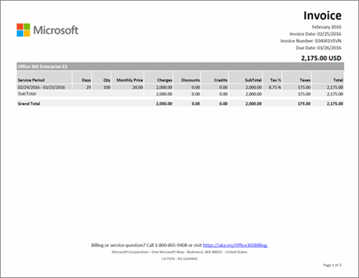

# Comprendi l’estratto conto o la fattura per Microsoft 365 per le aziendeUnderstand your bill or invoice for Microsoft 365 for business

> [!IMPORTANT]
> A partire dal 26 gennaio 2021 i nuovi conti correnti bancari non sono più supportati per i clienti in Belgio, Francia, Italia, Lussemburgo, Portogallo, Spagna e Stati Uniti.As of January 26, 2021, new bank accounts are no longer supported for customers in Belgium, France, Italy, Luxembourg, Portugal, Spain, and the United States. I clienti esistenti in uno di questi paesi/aree geografiche possono continuare a pagare l'abbonamento con un conto corrente bancario esistente e aggiungervi nuovi abbonamenti, ma solo fino a quando il conto corrente bancario è in regola.If you’re an existing customer in one of those countries, you can continue paying for your subscription with an existing bank account, and you can add new subscriptions to it, but only as long as the bank account is in good standing.

Ogni mese o ogni anno (a seconda dell'opzione che scegli quando acquisti l'abbonamento), riceverai un'email che ti informa che il tuo nuovo estratto conto è disponibile nell’interfaccia di amministrazione.Either monthly or annually (depending on the option you chose when you purchased your subscription), you'll receive an email that tells you that your new billing statement is available in the admin center. [Informazioni su come trovare e visualizzare la fattura](view-your-bill-or-invoice.md).[Learn how to find and view your bill or invoice](view-your-bill-or-invoice.md).
  
La fattura è composta da due pagine. La pagina 1 contiene il riepilogo e informazioni generali su fattura, ordine, importo dovuto e modalità di pagamento, oltre a indicazioni su come contattare il supporto.Your invoice contains two pages. Page 1 is the invoice summary, and contains general information about the invoice, order, amount due, how to make a payment, and how to contact support.
  

  
La pagina 2 contiene dettagli sull'attività di fatturazione per ogni abbonamento.Page 2 contains details about the billing activity for each subscription.
  

  
Per una descrizione dei campi e dei termini inclusi nella fattura, vedere il [Glossario dei campi della fattura](#invoice-field-glossary) più avanti in questo articolo.For descriptions of the fields and terms included in your invoice, see the [Invoice Field Glossary](#invoice-field-glossary) later in this article.
  
## Informazioni sui concetti della fatturazioneUnderstand billing concepts

Prima di visualizzare la fattura, è utile comprendere alcuni concetti chiave.Before you view your invoice, it's helpful to understand a few key billing concepts.
  
### Saldo della fattura e saldo dell'ordineInvoice balance vs. order balance

 Il **saldo della fattura** è l'importo indicato nella fattura e fa riferimento solo a quanto dovuto per uno specifico periodo di fatturazione.**Invoice balance** is the amount shown on your invoice, and is only the amount due for that particular billing period. Il **saldo dell'ordine** totale è la somma di tutte le fatture non saldate.Your total **order balance** is the sum of all unpaid invoices. È possibile visualizzare il saldo dell'ordine nella sezione **Fatturazione** dell'Interfaccia di amministrazione.You can view your order balance in the **Billing** section of the admin center.
  
### Frequenza di emissione e di ricezione delle fattureBilling frequency vs. invoice frequency

 **Frequenza di emissione** indica la cadenza con cui vengono emesse le fatture.**Billing frequency** means how often you are billed. Le fatture per gli abbonamenti vengono emesse mensilmente o annualmente, a seconda dell'opzione selezionata al momento dell'acquisto.Subscriptions are billed either monthly or annually, depending on what option you chose during the subscription purchase. **Frequenza di ricezione** indica la cadenza con cui si ricevono le fatture.**Invoice frequency** means how often you receive an invoice. Se si sceglie la fatturazione annuale, si riceve una sola fattura all'anno, a meno che l'attività relativa all'abbonamento non richieda un addebito o un accredito.If you chose annual billing, you'll only receive one invoice per year, unless activity for your subscription requires a charge or a credit.
  
Se si hanno più ordini, si riceverà una fattura per ognuno.If you have more than one order, you'll receive an invoice for each order.
  
## Glossario dei campi della fatturaInvoice Field Glossary

La tabella seguente descrive i campi che potrebbero essere riportati nella fattura. Alcuni campi potrebbero non comparire, a seconda della modalità di pagamento scelta, ossia con fattura, carta di credito o conto corrente bancario.The following table describes the fields you might see on your invoice. Some fields listed here might not appear in your invoice, depending on whether you pay by invoice or by credit card or bank account.
  
> [!NOTE]
> Il pagamento tramite conto corrente bancario non è disponibile in alcuni paesi o aree geografiche.Paying by bank account is not available in some countries or regions.
  
|**Nome****Name**|**Descrizione****Description**|
|:-----|:-----|
|Prezzo annualeAnnual Price|Le fatture per gli abbonamenti vengono emesse mensilmente o annualmente.Subscriptions are billed monthly or annually. Se si seleziona la fatturazione annuale al momento dell'acquisto dell'abbonamento, nella fattura è indicato il prezzo annuale della licenza.If you chose annual billing during the subscription purchase, the annual license price is reflected on the invoice. Se si vuole cambiare la frequenza di emissione della fattura, è necessario annullare l'abbonamento e acquistarne un altro con una nuova frequenza.If you want to change the billing frequency, you'll have to cancel your subscription and repurchase it with the new billing frequency.|
|Periodo di fatturazioneBilling Period|Il periodo di fatturazione è il periodo di tempo che inizia dalla data dell'ultima fattura. Il periodo di servizio è il periodo di tempo durante il quale viene addebitato l'uso del servizio.Billing Period is the time period since the last invoice date. Service Period is the time period during which you are charged to use the service.|
|Indirizzo di fatturazioneBill-To|L'indirizzo del reparto fatturazione, che in genere corrisponde all'indirizzo indicato in Venduto a.This is the address of your billing department, and is usually the same as the Sold-To address. Per aggiornare l'indirizzo di fatturazione, vedere [Cambiare gli indirizzi di fatturazione](change-your-billing-addresses.md).To update your billing address, see [Change your billing addresses](change-your-billing-addresses.md).|
|AddebitiCharges|Nella pagina 1 della fattura sono riepilogati tutti gli addebiti riferiti al periodo di fatturazione. La pagina 2 contiene gli addebiti dettagliati per ogni abbonamento.Page 1 of your invoice summarizes all charges for the invoice Billing Period. Page 2 shows the detailed charges for each subscription.|
|AssegnoCheck|Se si sceglie il pagamento tramite fattura ed è possibile saldarlo con assegno nel proprio paese, alla fine della pagina 1 sono incluse informazioni su dove inviare il pagamento. Includere nell'assegno il numero di fattura.If you pay by invoice and check payment is offered in your country, the bottom of page 1 includes information about where to send your payment. Please reference the invoice number on your check.|
|CreditiCredits|Nella pagina 1 della fattura sono riepilogati tutti i crediti riferiti al periodo di fatturazione. La pagina 2 contiene i crediti dettagliati per ogni abbonamento.Page 1 of your invoice summarizes all credits for the invoice Billing Period. Page 2 shows the detailed credits for each subscription.|
|Numero ordine d'acquisto clienteCustomer PO Number|Il numero dell'ordine d'acquisto. Se il numero dell'ordine d'acquisto viene aggiornato, verrà incluso nelle future fatture. [Cambiare il numero dell'ordine d'acquisto](#change-your-purchase-order-number).  Your Purchase Order (PO) number. If you update the PO number, future invoices will include it. [Change your purchase order number](#change-your-purchase-order-number).   **NOTA** Non è invece possibile aggiungere un numero di PO a una fattura esistente.**NOTE** You can't add a PO number to an existing invoice.           |
|GiorniDays|Ogni transazione di fatturazione è associata a un periodo di servizio. La colonna Giorni indica il numero di giorni di tale periodo.Each billing transaction is associated with a Service Period. The Days column indicates the number of days in that service period.|
|ScontiDiscounts|Nella pagina 1 della fattura sono riepilogati tutti gli sconti riferiti al periodo di fatturazione. La pagina 2 contiene gli sconti dettagliati per ogni abbonamento.Page 1 of your invoice summarizes all discounts for the invoice Billing Period. Page 2 shows the detailed discounts for each subscription.|
|ScadenzaDue Date|La data in cui è dovuto il pagamento della fattura. Se l'abbonamento viene pagato con carta di credito o conto corrente bancario, l'importo verrà addebitato il giorno dopo la data della fattura.The date when payment is due for the invoice. If your subscription is paid with a credit card or bank account, we will charge your credit card or banking account the day after the Invoice Date.   **NOTA** Il pagamento tramite conto corrente bancario non è disponibile in alcuni paesi o aree geografiche.**NOTE** Paying by bank account is not available in some countries or regions.           |
|Bonifico bancarioElectronic Funds Transfer|Se è stata scelta la fattura come modalità di pagamento, la pagina 1 contiene le informazioni sul conto corrente bancario Microsoft per i pagamenti elettronici (bonifico, ACH, SEPA e così via).If you chose "invoice" as the subscription payment method, page 1 contains the Microsoft bank account information for electronic (wire, ACH, SEPA, etc.) payments. In genere la banca avrà un campo di riferimento da completare quando si invia il pagamento.Usually, your bank will have a reference field you complete when you send a payment. Inserire come riferimento il numero di fattura indicato in questo campo.Please reference the invoice number shown in this field.|
|Totale complessivoGrand Total|Questa riga include i totali di tutte le colonne relative ad addebiti, sconti, subtotale, imposte e totale per tutti gli abbonamenti inclusi nella fattura.This row includes the totals for all Charges, Discounts, Credits, SubTotal, Tax, and Total columns for all subscriptions listed on the invoice.|
|Data fatturaInvoice Date|La data in cui è stata creata la fattura, ossia il giorno dopo il termine del periodo di fatturazione. Se ad esempio il periodo di fatturazione è compreso tra il 15 gennaio e il 14 febbraio, la data della fattura sarà 15 febbraio.The date the invoice was created. The invoice date is the day after the end of your Billing Period. For example, if your Billing Period is Jan 15 - Feb 14, your Invoice Date is Feb 15.|
|N. fatturaInvoice Number|Il numero univoco assegnato alla fattura. Fare riferimento a questo numero con il pagamento.The unique number assigned to your invoice. Please reference the Invoice Number with your payment.|
|Prezzo mensileMonthly Price|Le fatture per gli abbonamenti vengono emesse mensilmente o annualmente.Subscriptions are billed monthly or annually. Se si seleziona la fatturazione mensile al momento dell'acquisto dell'abbonamento, nella fattura è indicato il prezzo mensile della licenza.If you chose monthly billing during the subscription purchase, the monthly license price is reflected on the invoice. Se si vuole cambiare la frequenza di emissione della fattura, è necessario annullare l'abbonamento e acquistarne un altro con una nuova frequenza.If you want to change the billing frequency, you'll have to cancel your subscription and repurchase it with the new billing frequency.|
|Numero d'ordineOrder Number|Ogni volta che si acquista un nuovo abbonamento viene creato un ordine. Ogni mese si riceverà una fattura per ogni ordine.Every time you buy a new subscription, an order is created. Every month, you'll receive an invoice for each order.|
|Istruzioni per il pagamentoPayment Instructions|Se si sceglie il pagamento con carta di credito, verrà riportato il messaggio "NON PAGARE - addebito su carta di credito registrato". Se si sceglie il pagamento tramite fattura, verranno indicate le istruzioni per eseguire il bonifico e quelle per l'assegno (se applicabile).If you pay by credit card, you'll see "Do not pay - charged to credit card on file." If you pay by invoice, you'll see instructions for paying by Electronic Funds Transfer (EFT) and check (if applicable).|
|Condizioni di pagamentoPayment Terms|Il numero di giorni a partire dalla data della fattura in cui è dovuto il pagamento. Lo standard è 30 giorni.The number of days from the Invoice Date when payment is due. The standard is 30 days.|
|ProdottoProduct|Nella pagina 1 della fattura, "Servizi online" è il termine generico usato per descrivere gli abbonamenti. Nella pagina 2 si trovano i nomi dei singoli abbonamenti.On page 1 of your invoice, "Online Services" is the generic term used to describe your subscriptions. On page 2 , you'll see the individual subscription names.|
|QtàQTY|Il numero di licenze acquistate durante il periodo di servizio.The number of licenses purchased during the Service Period.|
|Periodo servizioService Period|Il periodo di servizio è il periodo di tempo durante il quale viene addebitato l'uso del servizio. Il periodo di fatturazione è il periodo di tempo che inizia dalla data dell'ultima fattura.Service Period is the time period during which you are charged to use the service. A Billing Period is the time period since the last invoice date.|
|Indirizzo di utilizzo del servizioService Usage Address|L'indirizzo in cui viene usato il servizio, che in genere corrisponde all'indirizzo specificato in Venduto a.The address where the service is being used, usually the same as your Sold-To address. Per aggiornare l'indirizzo di utilizzo dei servizi, vedere [Cambiare gli indirizzi di fatturazione](change-your-billing-addresses.md).To update your Service Usage Address, see [Change your billing addresses](change-your-billing-addresses.md).|
|Venduto aSold-To|Il nome e l'indirizzo della propria società. Per aggiornare questa informazione, vedere [Cambiare l'indirizzo dell'organizzazione, l'indirizzo di posta elettronica del contatto tecnico e altre informazioni](../../admin/manage/change-address-contact-and-more.md).  Your company name and address. To update this information, see [Change your organization's address, technical contact email, and other information](../../admin/manage/change-address-contact-and-more.md).|
|SubtotaleSubTotal|Ogni abbonamento riportato nella fattura prevede una riga Subtotale separata per tutte le colonne di addebiti, sconti, crediti, subtotale, imposta e totale.Each subscription listed on your invoice has a separate SubTotal row for all Charges, Discounts, Credits, SubTotal, Tax, and Total columns for that subscription.|
|ImpostaTax|Nella pagina 1 della fattura è indicata l'imposta totale. La pagina 2 mostra l'aliquota di imposta applicata e l'importo totale dell'imposta per ogni riga. Se la fattura contiene imposte ma la società è esente, [contattare il supporto](../../business-video/get-help-support.md).  Page 1 of your invoice shows the total tax. Page 2 shows the tax rate applied, and the total tax amount for each line item. If your invoice contains taxes and your company is tax exempt, please [contact support](../../business-video/get-help-support.md).|
|TotaleTotal|L'importo dovuto per il periodo di fatturazione.The amount due for the invoice Billing Period.|

## Cambiare il numero dell'ordine d'acquistoChange your purchase order number

Se si è scelto il pagamento tramite fattura, è possibile aggiungere o cambiare il numero dell'ordine d'acquisto per l'abbonamento.If you pay by invoice, you can add or change the purchase order (PO) number for your subscription.
  
> [!NOTE]
> Non è invece possibile aggiungere un numero di PO a una fattura esistente. Il numero di PO comparirà in tutte le fatture future.You can't add a PO number to an existing invoice. The PO number will appear on all future invoices.

::: moniker range="o365-worldwide"

1. Nell'interfaccia di amministrazione passare alla pagina **Fatturazione** \> <a href="https://go.microsoft.com/fwlink/p/?linkid=842054" target="_blank">I tuoi prodotti</a>.In the admin center, go to the **Billing** \> <a href="https://go.microsoft.com/fwlink/p/?linkid=842054" target="_blank">Your products</a> page.

::: moniker-end

::: moniker range="o365-germany"

1. Nell'interfaccia di amministrazione passare alla pagina **Fatturazione** \> <a href="https://go.microsoft.com/fwlink/p/?linkid=847745" target="_blank">I tuoi prodotti</a>.In the admin center, go to the **Billing** \> <a href="https://go.microsoft.com/fwlink/p/?linkid=847745" target="_blank">Your products</a> page.

::: moniker-end

::: moniker range="o365-21vianet"

1. Nell'interfaccia di amministrazione passare alla pagina **Fatturazione** \> <a href="https://go.microsoft.com/fwlink/p/?linkid=850626" target="_blank">I tuoi prodotti</a>.In the admin center, go to the **Billing** \> <a href="https://go.microsoft.com/fwlink/p/?linkid=850626" target="_blank">Your products</a> page.

::: moniker-end

1. Nella scheda **Prodotti**, selezionare l'abbonamento che si vuole cambiare.On the **Products** tab, select the subscription that you want to change.

1. Nella sezione Impostazioni sottoscrizione e pagamento della pagina dei dettagli **dell'abbonamento** selezionare **Modifica fattura.**On the subscription details page, in the **Subscription and payment settings** section, select **Edit invoice**.

1. Nella parte inferiore del riquadro **Modifica dettagli per** il pagamento tramite voce immettere il numero dell'ordine fornitore e quindi selezionare **Salva**.At the bottom of the **Edit details for paying by voice** pane, enter your PO number, and then select **Save**.

## Contenuto correlatoRelated content

[Informazioni su come trovare e visualizzare la fattura](view-your-bill-or-invoice.md) o la fattura (articolo)[Learn how to find and view your bill or invoice](view-your-bill-or-invoice.md) (article)\
[Modificare gli indirizzi di fatturazione](change-your-billing-addresses.md) (articolo)[Change your billing addresses](change-your-billing-addresses.md) (article)\
[Modificare l'indirizzo dell'organizzazione, l'indirizzo di](../../admin/manage/change-address-contact-and-more.md) posta elettronica del contatto tecnico e altre informazioni (articolo)[Change your organization's address, technical contact email, and other information](../../admin/manage/change-address-contact-and-more.md) (article)\
[Pagare l'abbonamento Microsoft 365 per le aziende](pay-for-your-subscription.md) (articolo)[Pay for your Microsoft 365 for business subscription](pay-for-your-subscription.md) (article)\
[Minecraft: opzioni di pagamento di Education Edition](/education/windows/school-get-minecraft) (articolo)[Minecraft: Education Edition payment options](/education/windows/school-get-minecraft) (article)
