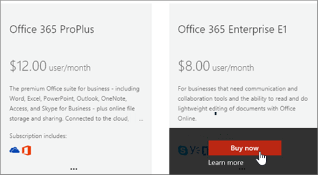

# Acquistare un altro abbonamento a Microsoft 365 for businessBuy another Microsoft 365 for business subscription

::: moniker range="o365-21vianet"

> [!NOTE]
> L'interfaccia di amministrazione cambia.The admin center is changing. Se l'esperienza non corrisponde ai dettagli presentati, vedere [About The New Microsoft 365 Admin Center](https://docs.microsoft.com/microsoft-365/admin/microsoft-365-admin-center-preview?view=o365-21vianet).If your experience doesn't match the details presented here, see [About the new Microsoft 365 admin center](https://docs.microsoft.com/microsoft-365/admin/microsoft-365-admin-center-preview?view=o365-21vianet).

::: moniker-end

Se si dispone già di un abbonamento a Microsoft 365 per le aziende e si vuole acquistare un altro abbonamento per la propria organizzazione, il modo migliore è farlo è attraverso l'interfaccia di amministrazione.If you already have a Microsoft 365 for business subscription and you want to buy another subscription for your organization, the best way is to do it is through the admin center. Se non è stato ancora acquistato il primo abbonamento Microsoft 365 for business per l'organizzazione, andare [qui](https://products.office.com/business/compare-office-365-for-business-plans) per scegliere un piano.If you haven't yet purchased the first Microsoft 365 for business subscription for your organization, go [here](https://products.office.com/business/compare-office-365-for-business-plans) to choose a plan.
  
Quando si acquista un altro abbonamento tramite l'interfaccia di amministrazione, si è certi che il nuovo abbonamento verrà associato alla stessa organizzazione (Domain Name Space) dell'abbonamento esistente.When you buy another subscription through the admin center, you're guaranteed that the new subscription will be associated with the same organization (domain name space) as your existing subscription. In questo modo è più facile spostare gli utenti all'interno dell'organizzazione tra gli abbonamenti o assegnare loro una licenza utente per l'ulteriore sottoscrizione di cui hanno bisogno.This makes it easier to move users within your organization between subscriptions or assign them a user license for the additional subscription they need.
  
Dopo l'acquisto di un nuovo abbonamento, è necessario assegnare agli utenti che desiderano utilizzare tale sottoscrizione una licenza per l'utente.After purchasing a new subscription, you'll need to assign the users who you want to use that subscription a user license for it. Per informazioni, vedere [assegnare licenze agli utenti in Microsoft 365 for business](../admin/manage/assign-licenses-to-users.md).To learn how, see [Assign licenses to users in Microsoft 365 for business](../admin/manage/assign-licenses-to-users.md).
  
## Acquistare un altro abbonamentoBuy another subscription

::: moniker range="o365-worldwide"

1. Nell'interfaccia di amministrazione, andare alla pagina **Billing** \> <a href="https://go.microsoft.com/fwlink/p/?linkid=868433" target="_blank">servizi di acquisto</a> per la fatturazione.In the admin center, go to the **Billing** \> <a href="https://go.microsoft.com/fwlink/p/?linkid=868433" target="_blank">Purchase services</a> page.

2. Nella pagina **acquisto servizi** selezionare l'abbonamento che si desidera acquistare, quindi selezionare **Acquista**.On the **Purchase services** page, select the subscription that you want to buy, then select **Buy**.

3. Immettere il numero di licenze necessarie e scegliere se pagare ogni mese o per l'intero anno.Enter the number of licenses that you need, and choose whether to pay each month or for the whole year. Scegliere se si desidera assegnare automaticamente le licenze a tutti gli utenti che attualmente non dispongono di una licenza.Choose whether you want to automatically assign licenses to everyone who does not currently have a license. Quindi, selezionare **Estrai ora**.Then select **Check out now**.

4. Si aprirà la finestra del carrello.Your cart opens. Se il tuo carrello scompare dallo schermo, seleziona **carrello** per riaprirlo, verifica l'ordine e quindi seleziona **Estrai**.If your cart disappears from the screen, select **Cart** to reopen it, review the order and then select **Check Out**.

5. Rivedere le informazioni sui prezzi e selezionare **Avanti**.Review the pricing information and select **Next**.

6. Fornire le informazioni di pagamento, quindi selezionare **Ordina** \> per **andare a casa di amministrazione**.Provide your payment information, and then select **Place order** \> **Go to Admin Home**.

::: moniker-end

::: moniker range="o365-germany"

1. Nell'interfaccia di amministrazione passare alla pagina **Fatturazione** \> <a href="https://go.microsoft.com/fwlink/p/?linkid=847745" target="_blank">Abbonamenti</a>.In the admin center, go to the **Billing** \> <a href="https://go.microsoft.com/fwlink/p/?linkid=847745" target="_blank">Subscriptions</a> page.

2. Nella pagina **sottoscrizione** , selezionare **Aggiungi abbonamenti**.On the **Subscription** page, select **Add subscriptions**.

    Verranno visualizzati gli abbonamenti disponibili per l'organizzazione.You'll see the subscriptions that are available to your organization. Gli abbonamenti già acquistati sono identificati in questo modo.Any subscriptions that you've already purchased are identified like this.

    
  
3. Passare il mouse o toccare l'abbonamento che si vuole acquistare e quindi scegliere **Acquista ora**.Mouse over or tap the subscription that you want to buy, and then select **Buy Now**.

    
  
4. Immettere il numero di licenze utente necessarie, scegliere se pagare ogni mese o per tutto l'anno e quindi fare clic **su Aggiungi al carrello**.Enter the number of user licenses you need, chose whether to pay each month or for the whole year, and then select **Add to Cart**.

5. Si aprirà la finestra del carrello.Your cart opens. Se il tuo carrello scompare dallo schermo, seleziona **carrello** per riaprirlo, verifica l'ordine e quindi seleziona **Estrai**.If your cart disappears from the screen, select **Cart** to reopen it, review the order and then select **Check Out**.

6. Rivedere le informazioni sui prezzi e selezionare **Avanti**.Review the pricing information and select **Next**.

7. Fornire le informazioni di pagamento, quindi selezionare **Ordina**.Provide your payment information, and then select **Place order**.

8. Nella pagina conferma, selezionare **Vai a amministratore Home**.On the confirmation page, select **Go to Admin Home**.

::: moniker-end

::: moniker range="o365-21vianet"

1. Nell'interfaccia di amministrazione passare alla pagina **Fatturazione** \> <a href="https://go.microsoft.com/fwlink/p/?linkid=850626" target="_blank">Abbonamenti</a>.In the admin center, go to the **Billing** \> <a href="https://go.microsoft.com/fwlink/p/?linkid=850626" target="_blank">Subscriptions</a> page.

2. Nella pagina **sottoscrizione** , selezionare **Aggiungi abbonamenti**.On the **Subscription** page, select **Add subscriptions**.

    Verranno visualizzati gli abbonamenti disponibili per l'organizzazione.You'll see the subscriptions that are available to your organization. Gli abbonamenti già acquistati sono identificati in questo modo.Any subscriptions that you've already purchased are identified like this.

    
  
3. Passare il mouse o toccare l'abbonamento che si vuole acquistare e quindi scegliere **Acquista ora**.Mouse over or tap the subscription that you want to buy, and then select **Buy Now**.

    
  
4. Immettere il numero di licenze utente necessarie, scegliere se pagare ogni mese o per tutto l'anno e quindi fare clic **su Aggiungi al carrello**.Enter the number of user licenses you need, chose whether to pay each month or for the whole year, and then select **Add to Cart**.

5. Si aprirà la finestra del carrello.Your cart opens. Se il tuo carrello scompare dallo schermo, seleziona **carrello** per riaprirlo, verifica l'ordine e quindi seleziona **Estrai**.If your cart disappears from the screen, select **Cart** to reopen it, review the order and then select **Check Out**.

6. Rivedere le informazioni sui prezzi e selezionare **Avanti**.Review the pricing information and select **Next**.

7. Fornire le informazioni di pagamento, quindi selezionare **Ordina**.Provide your payment information, and then select **Place order**.

8. Nella pagina conferma, selezionare **Vai a amministratore Home**.On the confirmation page, select **Go to Admin Home**.

::: moniker-end

## Articoli correlatiRelated articles

[Assegnazione licenze agli utenti](../admin/manage/assign-licenses-to-users.md).[Assign licenses to users](../admin/manage/assign-licenses-to-users.md)
  
[Rimuovere licenze dagli utentiRemove licenses from users](../admin/manage/remove-licenses-from-users.md)
