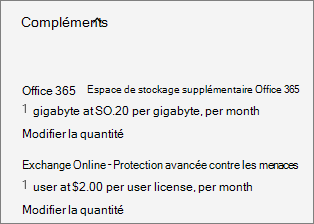

# Acquistare o gestire i componenti aggiuntiviBuy or manage add-ons

::: moniker range="o365-21vianet"

> [!NOTE]
> L'interfaccia di amministrazione sta cambiando.The admin center is changing. Se alcuni dettagli non corrispondono a quelli presentati qui, vedere [Informazioni sulla nuova interfaccia di amministrazione di Microsoft 365](https://docs.microsoft.com/microsoft-365/admin/microsoft-365-admin-center-preview?view=o365-21vianet&preserve-view=true).If your experience doesn't match the details presented here, see [About the new Microsoft 365 admin center](https://docs.microsoft.com/microsoft-365/admin/microsoft-365-admin-center-preview?view=o365-21vianet&preserve-view=true).

::: moniker-end

Molti piani di Microsoft 365 for business dispongono di componenti aggiuntivi che è possibile acquistare per gli abbonamenti.Many Microsoft 365 for business plans have add-ons that you can buy for your subscriptions. I componenti aggiuntivi forniscono funzionalità aggiuntive per migliorare l'esperienza di sottoscrizione.Add-ons provide additional features to enhance your subscription experience.

Sono disponibili due tipi di componenti aggiuntivi:There are two types of add-ons:

1. I **componenti aggiuntivi tradizionali** sono collegati a una sottoscrizione specifica.**Traditional add-ons** are linked to a specific subscription. Se si annulla la sottoscrizione, anche il componente aggiuntivo associato viene annullato.If you cancel the subscription, the associated add-on is also canceled.
2. Le **sottoscrizioni del componente aggiuntivo autonomo** vengono visualizzate come sottoscrizione distinta nella pagina dei **prodotti** e hanno la data di scadenza.**Standalone add-on subscriptions** appear as a separate subscription on the **Your products** page and have their own expiration date. A differenza dei componenti aggiuntivi tradizionali, le sottoscrizioni di componenti aggiuntivi autonome non sono collegate a una sottoscrizione specifica.Unlike traditional add-ons, standalone add-on subscriptions aren’t linked to a specific subscription. È possibile gestire una sottoscrizione di componente aggiuntivo autonoma nello stesso modo in cui si gestisce qualsiasi altra sottoscrizione.You manage a standalone add-on subscription the same way that you manage any other subscription.

## Prima di iniziareBefore you begin

È necessario essere un amministratore globale o un amministratore di fatturazione per eseguire le procedure descritte in questo articolo.You must be a Global or Billing admin to do the steps described in this article. Per altre informazioni, vedere [Informazioni sui ruoli di amministratore](../admin/add-users/about-admin-roles.md).For more information, see [About admin roles](../admin/add-users/about-admin-roles.md).

## Acquistare un componente aggiuntivoBuy an add-on

Utilizzare la procedura seguente per trovare e acquistare i componenti aggiuntivi.Use the following steps to find and buy add-ons. L'elenco include solo componenti aggiuntivi che sono disponibili per l'utente.The list only includes add-ons that are available to you. Questo elenco si basa sugli abbonamenti attualmente attivi e su tutti gli altri componenti aggiuntivi esistenti già presenti.This list is based on your currently active subscriptions, and any other existing add-ons you already have. Se un componente aggiuntivo non è presente nell'elenco, non è disponibile per l'acquisto.If an add-on isn’t on the list, it’s not available to buy.

Per informazioni sui componenti aggiuntivi di Skype for Business, vedere [Licenze per i componenti aggiuntivi Skype for Business e Microsoft Teams](https://docs.microsoft.com/SkypeForBusiness/skype-for-business-and-microsoft-teams-add-on-licensing/skype-for-business-and-microsoft-teams-add-on-licensing).For information about Skype for Business add-ons, see [Skype for Business and Microsoft Teams add-on licensing](https://docs.microsoft.com/SkypeForBusiness/skype-for-business-and-microsoft-teams-add-on-licensing/skype-for-business-and-microsoft-teams-add-on-licensing).

::: moniker range="o365-worldwide"

1. Nell'interfaccia di amministrazione, andare alla  \> pagina <a href="https://go.microsoft.com/fwlink/p/?linkid=868433" target="_blank">servizi di acquisto</a> per la fatturazione.In the admin center, go to the **Billing** \> <a href="https://go.microsoft.com/fwlink/p/?linkid=868433" target="_blank">Purchase services</a> page.
2. Nella parte inferiore della pagina **acquisto servizi** selezionare **componenti** aggiuntivi.At the bottom of the **Purchase services** page, select **Add-ons**.
3. Nella pagina **acquisto servizi** selezionare il componente aggiuntivo che si desidera acquistare.On the **Purchase services** page, select the add-on that you want to buy.
4. Nella pagina dei dettagli del prodotto, selezionare **Acquista**.On the product details page, select **Buy**.
5. Se necessario, completare eventuali ulteriori informazioni sugli ordini.If needed, complete any additional order information. Queste informazioni potrebbero includere la selezione della sottoscrizione per cui è installato il componente aggiuntivo.This information might include selecting the subscription the add-on is for. Al termine, selezionare **Estrai ora**.When you’re finished, select **Check out now**.
6. Se necessario, esaminare l'ordine e le informazioni sui prezzi, quindi selezionare **Avanti**.If needed, review the order and pricing information, then select **Next**.
7. Scegliere un metodo di pagamento o aggiungerne uno nuovo, quindi selezionare **Ordina ordine** > **Vai a amministratore Home**.Choose a payment method, or add a new one, then select **Place order** > **Go to Admin Home**.

::: moniker-end

::: moniker range="o365-germany"

1. Nell'interfaccia di amministrazione passare alla pagina **Fatturazione** \> <a href="https://go.microsoft.com/fwlink/p/?linkid=847745" target="_blank">Abbonamenti</a>.In the admin center, go to the **Billing** \> <a href="https://go.microsoft.com/fwlink/p/?linkid=847745" target="_blank">Subscriptions</a> page.
2. Nella pagina **abbonamenti** selezionare l'abbonamento per cui si desidera acquistare un componente aggiuntivo.On the **Subscriptions** page, select the subscription for which you want to buy an add-on.
3. Nell'angolo in basso a sinistra dei dettagli della sottoscrizione, selezionare **componenti** aggiuntivi per \> **acquistare i componenti** aggiuntivi.On the bottom-left corner of the subscription details, select **Add-ons** \> **Buy add-ons**.
    
4. Nella pagina **acquisto servizi** passare il mouse o toccare l'abbonamento del componente aggiuntivo che si desidera acquistare, quindi selezionare **Acquista subito**.On the **Purchase services** page, mouse over or tap the add-on subscription that you want to buy, and then select **Buy now**.
5. Immettere il numero di licenze necessarie e scegliere se pagare ogni mese o per l'intero anno.Enter the number of licenses that you need, and choose whether to pay each month or for the whole year. Scegliere se assegnare automaticamente le licenze a tutti coloro che attualmente non ne dispongono.Choose whether to automatically assign licenses to everyone who doesn't currently have one. Se illustrato, selezionare una sottoscrizione di base.If shown, select a base subscription.
6. Selezionare **Estrai ora**.Select **Check out now**.
7. Rivedere le informazioni sui prezzi, quindi selezionare **Avanti**.Review the pricing information, and then select **Next**.
8. Fornire le informazioni di pagamento, quindi selezionare **Ordina** per \> **andare a casa di amministrazione**.Provide your payment information, and then select **Place order** \> **Go to Admin Home**.

::: moniker-end

::: moniker range="o365-21vianet"

1. Nell'interfaccia di amministrazione passare alla pagina **Fatturazione** \> <a href="https://go.microsoft.com/fwlink/p/?linkid=850626" target="_blank">Abbonamenti</a>.In the admin center, go to the **Billing** \> <a href="https://go.microsoft.com/fwlink/p/?linkid=850626" target="_blank">Subscriptions</a> page.
2. Nella pagina **abbonamenti** selezionare l'abbonamento per cui si desidera acquistare un componente aggiuntivo.On the **Subscriptions** page, select the subscription for which you want to buy an add-on.
3. Nell'angolo in basso a sinistra dei dettagli della sottoscrizione, selezionare **componenti** aggiuntivi per \> **acquistare i componenti** aggiuntivi.On the bottom-left corner of the subscription details, select **Add-ons** \> **Buy add-ons**.
    
4. Nella pagina **acquisto servizi** passare il mouse o toccare l'abbonamento del componente aggiuntivo che si desidera acquistare, quindi selezionare **Acquista subito**.On the **Purchase services** page, mouse over or tap the add-on subscription that you want to buy, and then select **Buy now**.
5. Immettere il numero di licenze necessarie e scegliere se pagare ogni mese o per l'intero anno.Enter the number of licenses that you need, and choose whether to pay each month or for the whole year. Scegliere se assegnare automaticamente le licenze a tutti coloro che attualmente non ne dispongono.Choose whether to automatically assign licenses to everyone who doesn't currently have one. Se illustrato, selezionare una sottoscrizione di base.If shown, select a base subscription.
6. Selezionare **Estrai ora**.Select **Check out now**.
7. Rivedere le informazioni sui prezzi, quindi selezionare **Avanti**.Review the pricing information, and then select **Next**.
8. Fornire le informazioni di pagamento, quindi selezionare **Ordina** per \> **andare a casa di amministrazione**.Provide your payment information, and then select **Place order** \> **Go to Admin Home**.

::: moniker-end

## Gestire un componente aggiuntivoManage an add-on

È possibile gestire una sottoscrizione di componente aggiuntivo autonoma nello stesso modo in cui si gestisce qualsiasi altro abbonamento, nella pagina dei **prodotti** .You manage a standalone add-on subscription the same way that you manage any other subscription – on the **Your products** page. Ad esempio, è possibile [acquistare o rimuovere licenze](licenses/buy-licenses.md), [gestire la fatturazione ricorrente](subscriptions/renew-your-subscription.md)e [modificare o sostituire i metodi di pagamento](billing-and-payments/manage-payment-methods.md) per gli abbonamenti a componenti aggiuntivi autonomi.For example, you can [buy or remove licenses](licenses/buy-licenses.md), [manage recurring billing](subscriptions/renew-your-subscription.md), and [edit or replace payment methods](billing-and-payments/manage-payment-methods.md) for standalone add-on subscriptions.

È possibile gestire un componente aggiuntivo tradizionale accedendo alla sottoscrizione che lo contiene e apportando modifiche.You manage a traditional add-on by going to the subscription that contains it and making changes there. Utilizzare la procedura seguente per gestire un componente aggiuntivo tradizionale.Use the following steps to manage a traditional add-on.
  
::: moniker range="o365-worldwide"

1. Nell'interfaccia di amministrazione passare alla pagina **Fatturazione** \> <a href="https://go.microsoft.com/fwlink/p/?linkid=842054" target="_blank">I tuoi prodotti</a>.In the admin center, go to the **Billing** \> <a href="https://go.microsoft.com/fwlink/p/?linkid=842054" target="_blank">Your products</a> page.
2. Nella scheda **prodotti** selezionare la sottoscrizione contenente il componente aggiuntivo che si desidera aggiornare.On the **Products** tab, select the subscription that contains the add-on that you want to update.
3. Nella sezione **componenti** aggiuntivi della pagina Dettagli sottoscrizione sono elencati i componenti aggiuntivi acquistati.On the subscription details page, the **Add-ons** section lists the add-ons that you bought. Selezionare **Gestisci componenti aggiuntivi**.Select **Manage add-ons**.
4. Nell'elenco a discesa del **componente** aggiuntivo del riquadro **Gestisci componenti aggiuntivi** selezionare il componente aggiuntivo che si desidera modificare.In the **Manage add-ons** pane, from the **Add-on** drop-down list, select the add-on that you want to change.
5. Immettere una modifica di quantità per il componente aggiuntivo e quindi fare clic su **Salva**.Enter a quantity change for the add-on, then select **Save**.

::: moniker-end

::: moniker range="o365-germany"

1. Nell'interfaccia di amministrazione passare alla pagina **Fatturazione** \> <a href="https://go.microsoft.com/fwlink/p/?linkid=847745" target="_blank">Abbonamenti</a>.In the admin center, go to the **Billing** \> <a href="https://go.microsoft.com/fwlink/p/?linkid=847745" target="_blank">Subscriptions</a> page.
2. Nella pagina **abbonamenti** selezionare l'abbonamento per cui si desidera aggiornare un componente aggiuntivo.On the **Subscriptions** page, select the subscription for which you want to update an add-on.
3. Selezionare **componenti** aggiuntivi.Select **Add-ons**.
    Vengono visualizzati i componenti aggiuntivi acquistati e sotto ognuno compare il collegamento **Cambio di quantità**.The add-ons that you have purchased are shown and each of the add-ons will have a **Change quantity** link below it.
4. Selezionare il collegamento **Cambia quantità** per il componente aggiuntivo che si desidera aggiornare. Select the **Change quantity** link for the add-on that you want to update.\
    
5. Immettere il numero di licenze utente necessarie nella casella e quindi fare clic su **Invia**.Enter the number of user licenses that you need in the box, and then select **Submit**.
    > [!TIP]
    > È anche possibile usare le frecce in su e in giù per cambiare la quantità delle licenze utente oppure immettere semplicemente il numero nella casella.You can also use the up-arrow and down-arrow to change the quantity of user licenses or just enter the number you want in the box.

    

::: moniker-end

::: moniker range="o365-21vianet"

1. Nell'interfaccia di amministrazione passare alla pagina **Fatturazione** \> <a href="https://go.microsoft.com/fwlink/p/?linkid=850626" target="_blank">Abbonamenti</a>.In the admin center, go to the **Billing** \> <a href="https://go.microsoft.com/fwlink/p/?linkid=850626" target="_blank">Subscriptions</a> page.
2. Nella pagina **abbonamenti** selezionare l'abbonamento per cui si desidera aggiornare un componente aggiuntivo.On the **Subscriptions** page, select the subscription for which you want to update an add-on.
3. Selezionare **componenti** aggiuntivi.Select **Add-ons**.
    Vengono visualizzati i componenti aggiuntivi acquistati e sotto ognuno compare il collegamento **Cambio di quantità**.The add-ons that you have purchased are shown and each of the add-ons will have a **Change quantity** link below it.
4. Selezionare il collegamento **Cambia quantità** per il componente aggiuntivo che si desidera aggiornare. Select the **Change quantity** link for the add-on that you want to update.\
    
5. Immettere il numero di licenze utente necessarie nella casella e quindi fare clic su **Invia**.Enter the number of user licenses that you need in the box, and then select **Submit**.
    > [!TIP]
    > È anche possibile usare le frecce in su e in giù per cambiare la quantità delle licenze utente oppure immettere semplicemente il numero nella casella.You can also use the up-arrow and down-arrow to change the quantity of user licenses or just enter the number you want in the box.
  
    

::: moniker-end

## Rimuovere un componente aggiuntivoRemove an add-on

Per rimuovere un abbonamento a un componente aggiuntivo autonomo, è necessario [annullare l'abbonamento](subscriptions/cancel-your-subscription.md), come qualsiasi altro abbonamento.To remove a standalone add-on subscription, you [cancel the subscription](subscriptions/cancel-your-subscription.md), just like any other subscription. In alternativa, è possibile [disattivare la fatturazione ricorrente](subscriptions/renew-your-subscription.md).Or you can [turn off Recurring billing](subscriptions/renew-your-subscription.md).

Non è possibile rimuovere un componente aggiuntivo tradizionale.You can’t remove a traditional add-on. Se si desidera rimuovere un componente aggiuntivo tradizionale, contattare il [supporto tecnico](../admin/contact-support-for-business-products.md).If you want to remove a traditional add-on, [contact support for help](../admin/contact-support-for-business-products.md).
  
## Contenuti correlatiRelated content

[Aggiungere spazio di archiviazione per l'abbonamento](add-storage-space.md) (articolo) [Add storage space for your subscription](add-storage-space.md) (article)\
[Acquistare o rimuovere licenze di sottoscrizione](licenses/buy-licenses.md) (articolo) [Buy or remove subscription licenses](licenses/buy-licenses.md) (article)\
Attiva la [fatturazione ricorrente disattivata o attivata](subscriptions/renew-your-subscription.md#turn-recurring-billing-off-or-on) (articolo) [Turn Recurring billing off or on](subscriptions/renew-your-subscription.md#turn-recurring-billing-off-or-on) (article)\
[Gestire i metodi di pagamento](billing-and-payments/manage-payment-methods.md) (articolo)[Manage payment methods](billing-and-payments/manage-payment-methods.md) (article)