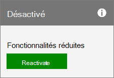

# Riattivare l'abbonamento

Se l'abbonamento scade oppure è stato disabilitato da Microsoft o se è stato annullato nel corso di un periodo di sottoscrizione, è possibile riattivarlo nell'interfaccia di amministrazione.
  
 **Se non si è un amministratore** Contattare l'amministrazione per riattivare l'abbonamento.

::: moniker range="o365-worldwide"

> [!NOTE]
> Se non si usa la nuova interfaccia di amministrazione di Microsoft 365, è possibile attivarla selezionando l'opzione **Prova la nuova interfaccia di amministrazione** che si trova nella parte superiore della home page.

1. Nell'interfaccia di amministrazione passare alla pagina **Fatturazione** \> <a href="https://go.microsoft.com/fwlink/p/?linkid=842054" target="_blank">Prodotti e servizi</a>.

2. Nella pagina **prodotti & Servizi** individuare la sottoscrizione che si desidera riattivare. Nella sezione **fatturazione** selezionare **riattiva**.
  
    Se non si visualizza **riattivazione** come azione disponibile, [contattare il supporto](../../admin/contact-support-for-business-products.md) per riattivare l'abbonamento.

3. Confermare i dettagli sul pagamento. È possibile aggiornare le attuali informazioni sul pagamento. Quando hai finito di immettere il metodo di pagamento, seleziona **riattiva**.

  - Se l'abbonamento è scaduto, dopo aver inviato i dettagli del pagamento, l'abbonamento torna allo stato attivo e la data di **fatturazione successiva** si estende di un mese o di un anno, a seconda dell'impegno corrente di sottoscrizione. Se si paga tramite carta di credito o conto corrente bancario, il costo dell'estensione verrà addebitato sulla carta o sul conto. Se si paga tramite fattura, l'estensione verrà riportata nella fattura successiva. Per assicurarsi che l'abbonamento non scada di nuovo, seguire la procedura per [abilitare o disabilitare la fatturazione ricorrente](renew-your-subscription.md).

    > [!NOTE]
    > La possibilità di pagare con il conto corrente bancario non è disponibile in alcuni paesi o aree geografiche.
  
  - Se l'abbonamento è stato annullato oppure è stato disabilitato perché non è stato ricevuto un pagamento, viene restituito allo stato attivo e la data di **fatturazione successiva** rimane invariata.

::: moniker-end

::: moniker range="o365-germany"
  
1. Nell'interfaccia di amministrazione, andare alla pagina **** \> <a href="https://go.microsoft.com/fwlink/p/?linkid=847745" target="_blank">abbonamenti</a> di fatturazione.

2. Individuare la sottoscrizione che si desidera riattivare, quindi selezionare **riattiva**.

    
  
    Se non si visualizza **riattivazione** come azione disponibile, [contattare il supporto](../../admin/contact-support-for-business-products.md) per riattivare l'abbonamento.

3. Immettere i dettagli sul pagamento. È possibile aggiornare le attuali informazioni sul pagamento.

  - Se l'abbonamento è scaduto, dopo aver inviato i dettagli del pagamento, l'abbonamento torna allo stato attivo e la data di **fatturazione successiva** si estende di un mese o di un anno, a seconda dell'impegno corrente di sottoscrizione. Se si paga tramite carta di credito o conto corrente bancario, il costo dell'estensione verrà addebitato sulla carta o sul conto. Se si paga tramite fattura, l'estensione verrà riportata nella fattura successiva. Per assicurarsi che l'abbonamento non scada di nuovo, seguire la procedura per [abilitare o disabilitare la fatturazione ricorrente](renew-your-subscription.md).

    > [!NOTE]
    > La possibilità di pagare con il conto corrente bancario non è disponibile in alcuni paesi o aree geografiche.
  
  - Se l'abbonamento è stato annullato oppure è stato disabilitato perché non è stato ricevuto un pagamento, viene restituito allo stato attivo e la data di **fatturazione successiva** rimane invariata.

  ::: moniker-end

::: moniker range="o365-21vianet"
  
1. Nell'interfaccia di amministrazione, andare alla pagina **** \> <a href="https://go.microsoft.com/fwlink/p/?linkid=850626" target="_blank">abbonamenti</a> di fatturazione.

2. Individuare la sottoscrizione che si desidera riattivare, quindi selezionare **riattiva**.

    
  
    Se non si visualizza **riattivazione** come azione disponibile, [contattare il supporto](../../admin/contact-support-for-business-products.md) per riattivare l'abbonamento.

3. Immettere i dettagli sul pagamento. È possibile aggiornare le attuali informazioni sul pagamento.

  - Se l'abbonamento è scaduto, dopo aver inviato i dettagli del pagamento, l'abbonamento torna allo stato attivo e la data di **fatturazione successiva** si estende di un mese o di un anno, a seconda dell'impegno corrente di sottoscrizione. Se si paga tramite carta di credito o conto corrente bancario, il costo dell'estensione verrà addebitato sulla carta o sul conto. Se si paga tramite fattura, l'estensione verrà riportata nella fattura successiva. Per assicurarsi che l'abbonamento non scada di nuovo, seguire la procedura per [abilitare o disabilitare la fatturazione ricorrente](renew-your-subscription.md).

    > [!NOTE]
    > La possibilità di pagare con il conto corrente bancario non è disponibile in alcuni paesi o aree geografiche.
  
  - Se l'abbonamento è stato annullato oppure è stato disabilitato perché non è stato ricevuto un pagamento, viene restituito allo stato attivo e la data di **fatturazione successiva** rimane invariata.

  ::: moniker-end