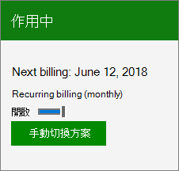

# Rinnovare Microsoft 365 for businessRenew Microsoft 365 for business

Questo articolo si applica alla maggior parte degli abbonamenti a pagamento Microsoft 365 for business.This article applies to most paid Microsoft 365 for business subscriptions.
  
Per rinnovare l'utilizzo di un codice Product Key acquistato da un rivenditore o da un partner Microsoft, vedere [trovare e immettere il codice "Product Key](../enter-your-product-key.md)".To renew by using a product key that you bought from a retail store or Microsoft partner, see [Find and enter your product key](../enter-your-product-key.md).

> [!NOTE]
> Il pagamento tramite conto corrente bancario non è disponibile in alcuni paesi o aree geografiche.Paying by bank account isn't available in some countries or regions.
  
## Attivazione o disattivazione della fatturazione ricorrenteTurn Recurring billing off or on

Se si paga con carta di credito o conto corrente bancario, la **fatturazione ricorrente** è attivata per impostazione predefinita.If you pay by credit card or bank account, **Recurring billing** is turned on by default. Quando la **fatturazione ricorrente** è attiva, l'abbonamento continuerà a essere addebitato ogni anno nel giorno in cui è stato sottoscritto.When **Recurring billing** is on, your subscription will continue to be billed each year on the day you subscribed. Se l'abbonamento è attivo, è possibile disattivarlo o riattivarlo nell'interfaccia di amministrazione.You can turn it off or back on again in the admin center if your subscription is active.
  
Se l'abbonamento è stato pagato in anticipo con un codice Product Key, scadrà alla fine del periodo di validità.If you prepaid for your subscription with a product key, your subscription will expire at the end of subscription term. È possibile abilitare la **fatturazione ricorrente** e fornire le informazioni sulla carta di credito o sul conto corrente bancario in modo che la sottoscrizione continuerà a essere addebitata ogni anno nel giorno in cui è stato sottoscritto.You can turn on **Recurring billing** and provide credit card or bank account information so that your subscription will continue to be billed every year on the day you subscribed. Si ha anche la possibilità di pagare ogni mese o di pagare per tutto l'anno in anticipo.You also have the option to pay every month, or to pay for the entire year up front. L'addebito sulla carta di credito o sul conto corrente bancario non verrà effettuato prima della scadenza del periodo di abbonamento iniziale.Your credit card or bank account will not be charged until your initial subscription term has expired.

::: moniker range="o365-worldwide"

1. Nell'interfaccia di amministrazione, andare alla pagina **fatturazione** \> dei <a href="https://go.microsoft.com/fwlink/p/?linkid=842054" target="_blank">prodotti</a> .In the admin center, go to the **Billing** \> <a href="https://go.microsoft.com/fwlink/p/?linkid=842054" target="_blank">Your products</a> page.

2. Scegliere l'abbonamento per cui si vuole gestire la fatturazione ricorrente.Choose the subscription for which you want to manage recurring billing.

3. In **fatturazione**, accanto a **rinotizie** o **scadenza**, selezionare **modifica**.Under **Billing**, next to **Renews on** or **Expiring on**, select **edit**.

4. Nel riquadro **impostazioni di fatturazione ricorrenti** **selezionare Disattiva** per disattivarlo.In the **Recurring billing settings** pane, select **Turn OFF** to turn it off. Se la fatturazione ricorrente è già disattivata, selezionare **mensile** o **una volta** per attivarla.If recurring billing is already turned off, select **Monthly** or **Once** to turn it on.

5. Selezionare **Invia modifica**.Select **Submit change**.

    > [!NOTE]
    > - È possibile modificare l'impostazione di **fatturazione ricorrente** solo per le sottoscrizioni attive.You can only change the **Recurring billing** setting for active subscriptions. Se l'abbonamento è già scaduto o è disabilitato, sarà necessario [riattivarlo](reactivate-your-subscription.md) prima di poter attivare o disattivare la **fatturazione ricorrente** .If your subscription has already expired or is disabled, you will need to [reactivate it](reactivate-your-subscription.md) before you can turn **Recurring billing** on or off.
    > - Quando la **fatturazione ricorrente** è disattivata, l'abbonamento non viene annullato immediatamente.When **Recurring billing** is turned off, the subscription isn't cancelled right away. Rimane attivo fino alla scadenza.It remains active until it expires. È possibile visualizzare la data di scadenza nella sezione **fatturazione** dei dettagli della sottoscrizione nella pagina i **prodotti** .You can view the expiration date in the **Billing** section of the subscription details on the **Your products** page.
    > - Per informazioni su come annullare l'abbonamento subito, vedere [annullare l'abbonamento](cancel-your-subscription.md).To learn how to cancel the subscription right away, see [Cancel my subscription](cancel-your-subscription.md).

::: moniker-end

::: moniker range="o365-germany"
  
1. Nell'interfaccia di amministrazione passare alla pagina **Fatturazione** \> <a href="https://go.microsoft.com/fwlink/p/?linkid=847745" target="_blank">Abbonamenti</a>.In the admin center, go to the **Billing** \> <a href="https://go.microsoft.com/fwlink/p/?linkid=847745" target="_blank">Subscriptions</a> page.

2. Scegliere l'abbonamento per cui si vuole gestire la fatturazione ricorrente.Choose the subscription for which you want to manage recurring billing.

3. Per attivare la **fatturazione ricorrente**, impostare l'interruttore **su**attivato.To turn on **Recurring billing**, switch the toggle to **On**.

    
  
    È possibile disattivare la **fatturazione ricorrente** cambiando l' **interruttore su disattivata**.You can turn off **Recurring billing** by switching the toggle to **Off**.

    > [!NOTE]
    > - È possibile modificare l'impostazione di **fatturazione ricorrente** solo per le sottoscrizioni attive.You can only change the **Recurring billing** setting for active subscriptions. Se l'abbonamento è già scaduto o è disabilitato, sarà necessario [riattivarlo](reactivate-your-subscription.md) prima di poter attivare o disattivare la **fatturazione ricorrente** .If your subscription has already expired or is disabled, you will need to [reactivate it](reactivate-your-subscription.md) before you can turn **Recurring billing** on or off.
    > - Quando la **fatturazione ricorrente** è disattivata, l'abbonamento non viene annullato immediatamente.When **Recurring billing** is turned off, the subscription isn't cancelled right away. Rimane attivo fino alla scadenza.It remains active until it expires. È possibile visualizzare la data di scadenza sulla scheda sottoscrizioneYou can view the expiration date on the subscription card
    > - Per informazioni su come annullare l'abbonamento subito, vedere [annullare l'abbonamento](cancel-your-subscription.md).To learn how to cancel the subscription right away, see [Cancel my subscription](cancel-your-subscription.md).

::: moniker-end

::: moniker range="o365-21vianet"
  
1. Nell'interfaccia di amministrazione passare alla pagina **Fatturazione** \> <a href="https://go.microsoft.com/fwlink/p/?linkid=850626" target="_blank">Abbonamenti</a>.In the admin center, go to the **Billing** \> <a href="https://go.microsoft.com/fwlink/p/?linkid=850626" target="_blank">Subscriptions</a> page.

2. Scegliere l'abbonamento per cui si vuole gestire la fatturazione ricorrente.Choose the subscription for which you want to manage recurring billing.

3. Per attivare la **fatturazione ricorrente**, impostare l'interruttore **su**attivato.To turn on **Recurring billing**, switch the toggle to **On**.

    
  
    È possibile disattivare la **fatturazione ricorrente** cambiando l' **interruttore su disattivata**.You can turn off **Recurring billing** by switching the toggle to **Off**.

    > [!NOTE]
    > - È possibile modificare l'impostazione di **fatturazione ricorrente** solo per le sottoscrizioni attive.You can only change the **Recurring billing** setting for active subscriptions. Se l'abbonamento è già scaduto o è disabilitato, sarà necessario [riattivarlo](reactivate-your-subscription.md) prima di poter attivare o disattivare la **fatturazione ricorrente** .If your subscription has already expired or is disabled, you will need to [reactivate it](reactivate-your-subscription.md) before you can turn **Recurring billing** on or off.
    > - Quando la **fatturazione ricorrente** è disattivata, l'abbonamento non viene annullato immediatamente.When **Recurring billing** is turned off, the subscription isn't cancelled right away. Rimane attivo fino alla scadenza.It remains active until it expires. È possibile visualizzare la data di scadenza sulla scheda di sottoscrizione.You can view the expiration date on the subscription card.
    > - Per informazioni su come annullare l'abbonamento subito, vedere [annullare l'abbonamento](cancel-your-subscription.md).To learn how to cancel the subscription right away, see [Cancel my subscription](cancel-your-subscription.md).

::: moniker-end

## Articoli correlatiRelated articles

[Riattivare l'abbonamentoReactivate your subscription](reactivate-your-subscription.md)
  
[Che cosa succede ai dati personali al termine dell'abbonamento?What happens to my data and access when my subscription ends?](what-if-my-subscription-expires.md)

[Immettere il codice "Product Key"Enter your product key](../enter-your-product-key.md)
  
[Acquistare la versione di valutazione di Microsoft 365 for businessBuy your trial version of Microsoft 365 for business](../buy-a-subscription-from-your-free-trial.md)