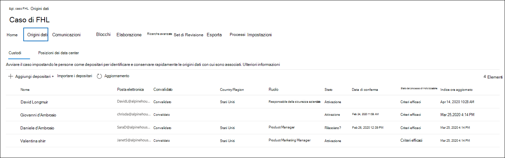

# Aggiungere i depositari a un caso avanzato di eDiscoveryAdd custodians to an Advanced eDiscovery case

Utilizzare lo strumento di gestione del custode incorporato in Advanced eDiscovery per coordinare i flussi di lavoro in merito alla gestione dei depositari e identificare le origini dati rilevanti e detentive associate a un caso.Use the built-in custodian management tool in Advanced eDiscovery to coordinate your workflows around managing custodians and identifying relevant, custodial data sources associated with a case. Quando si aggiunge un custode, il sistema può identificare automaticamente e inserire un blocco sulla cassetta postale di Exchange e OneDrive for business.When you add a custodian, the system can automatically identify and place a hold on their Exchange mailbox and OneDrive for Business account. Durante il processo di individuazione, è possibile identificare anche altre origini dati (ad esempio, cassette postali, siti o Team) a cui un custode ha eseguito l'accesso o ha contribuito.During the discovery process of your investigation, you might also identify additional data sources (such as mailboxes, sites, or Teams) that a custodian accessed or contributed to. In questa situazione, è possibile utilizzare lo strumento di gestione dei depositari per associare tali origini dati a un determinato custode.In this situation, you can use the custodian management tool to associate those data sources will a specific custodian. Dopo aver aggiunto i depositari a un caso e aver associato altre origini dati, è possibile conservare i dati in modo rapido e cercarli.After you add custodians to a case and associate other data source with them, you can quickly preserve data and search the custodial data.

Utilizzare il flusso di lavoro seguente per aggiungere e gestire i depositari nei casi avanzati di eDiscovery.Use the following workflow to add and manage custodians in Advanced eDiscovery cases.

## Verificare di disporre delle autorizzazioni necessarieMake sure you have the necessary permissions

Per aggiungere depositari a un caso, è necessario essere membri del gruppo di ruoli eDiscovery Manager.To add custodians to a case, you must be a member of the eDiscovery Manager role group. In questo modo, vengono fornite le autorizzazioni necessarie per aggiungere i depositari a un caso e inserire un'esenzione nelle origini dati della custodia.This will provide you with the necessary permissions to add custodians to a case and place a hold on the custodial data sources.

## Passaggio 1: aggiungere potenziali depositariStep 1: Add potential custodians

Il primo passaggio consiste nell'identificare e aggiungere i depositari al caso.The first step is to identify and add custodians to the case.

1. Nella Home page di **Advanced eDiscovery** fare clic sul caso in cui si desidera aggiungere i depositari.On the **Advanced eDiscovery** home page, click the case that you want to add custodians to. 

2. Fare clic sulla scheda **origini** , quindi fare clic su **Aggiungi depositari**.Click the **Sources** tab and then click **Add custodians**.

3. Individuare i depositari da aggiungere al caso.Find the custodians to add to the case. Digitare la prima parte del nome di una persona per visualizzare gli utenti di Azure Active Directory dell'organizzazione.Type the first part of a person's name to display users from your organization's Azure Active Directory. Quando si trova la persona corretta, fare clic sul relativo nome per aggiungerli all'elenco.When you find the correct person, click their name to add them to the list.

   

4. Dopo aver aggiunto tutti i depositari rilevanti, fare clic su **Avanti** per selezionare le origini dati primarie dei depositari.After added all the relevant custodians, click **Next** to select the custodians' primary data sources.
  
## Passaggio 2: selezionare origini dati di un custodeStep 2: Select custodian data sources

Dopo aver aggiunto gli strumenti di gestione, lo strumento di gestione delle risorse di gestione consente di identificare le origini dati primarie possedute da ogni custode.After adding custodians, the custodian tool will help you identify the primary data sources owned by each custodian. Tali posizioni di dati sono le cassette postali di Exchange e l'account OneDrive del custode.These data locations are the custodian's Exchange mailbox and OneDrive account. 

Per identificare le origini dati del custode:To identify custodian data sources:

1. Per selezionare la cassetta postale di Exchange per tutti i depositari, selezionare la casella di controllo **Exchange** nella parte superiore della colonna.To select the Exchange mailbox for all custodians, select the **Exchange** check box at the top of the column. È quindi possibile deselezionare la casella di controllo per qualsiasi custode specifico per rimuovere una cassetta postale come posizione di custodia.You can then clear the check box for any specific custodian to remove a mailbox as a custodial location. In alternativa, è possibile lasciare la casella di controllo **Exchange** nella parte superiore della colonna deselezionata e quindi selezionare la casella di controllo per i singoli depositari.Alternatively, you can leave the **Exchange** check box at the top of the column unselected and then select the check box for individual custodians. 

   

2. Ripetere la stessa operazione per gli account OneDrive dei depositari.Repeat the same thing for the custodians' OneDrive accounts. 

    Dopo aver selezionato le origini dati del custode, il sistema tenta automaticamente di identificare e verificare queste origini dati e quindi le aggiunge al caso come origini dati associate ai depositari.After you select the custodian data sources, the system automatically attempts to identify and verify these data sources, and then adds them to the case as data sources associated with the custodians.

3. Fare clic su **Avanti** per iniziare a associare altre origini dati ai depositari nel caso.Click **Next** to begin associating additional data sources to the custodians in the case.

## Passaggio 3: associare altre origini dati a un custodeStep 3: Associate additional data sources to a custodian

A seconda del caso in cui si sta indagando, potrebbe essere necessario eseguire la ricerca e la conservazione dei contenuti delle cassette postali a cui è stato effettuato l'accesso a un determinato custode, Microsoft 365 gruppi a cui è attualmente associato un custode o i siti a cui è stato effettuato l'accesso a un custode.Depending on the case you're investigating, you may also need to search (and preserve content in) mailboxes that a specific custodian may have accessed, Microsoft 365 groups that a custodian is currently a member of, or sites that a custodian has also accessed. Pertanto, oltre alle origini dati del custode principale specificate nel passaggio precedente, è anche possibile associare altre origini dati Microsoft a un custode nel caso.So in addition to the primary custodian data sources that you specified in the previous step, you can also associate additional Microsoft data sources with a custodian in the case. 

Per eseguire il mapping di cassette postali, siti o team a un determinato custode:To map mailboxes, sites, or teams to a specific custodian:

1. Nella pagina **Seleziona origini dati aggiuntive** fare clic su **Aggiungi** nella riga per il custode specifico.On the **Select additional data sources** page, click **Add** in the row for the specific custodian. 
  
   

2. Nella pagina a comparsa è possibile specificare un'origine dati da uno dei servizi seguenti:On the flyout page, you can specify a data source from any of the following services:
  
   -  **Posta elettronica di Exchange** -fare clic su **Scegli utenti, gruppi o team** e quindi fare di nuovo clic su **Scegli utenti, gruppi o team** .**Exchange email** - Click **Choose users, groups, or Teams** and then click **Choose users, groups, or teams** again. Utilizzare la casella di ricerca per trovare le cassette postali da associare al custode.Use the search box to find mailboxes to associate with the custodian. Per specificare le cassette postali da assegnare al custode selezionato, utilizzare la casella di ricerca per trovare le cassette postali degli utenti e i gruppi di distribuzione.To specify mailboxes to assign to the selected custodian, use the search box to find user mailboxes and distribution groups. È inoltre possibile assegnare la cassetta postale associata a un gruppo di Microsoft 365 o a un team Microsoft.You can also assign the associated mailbox for a Microsoft 365 group or a Microsoft Team. Selezionare la casella di controllo utente, gruppo, team, fare clic su **Scegli**e quindi su **fine**.Select the user, group, team check box, click **Choose**, and then click **Done**.

        > [!NOTE]
        > Quando si fa clic su Scegli utenti, gruppi o team per specificare le cassette postali, lo strumento di selezione delle cassette postali visualizzato è vuoto.When you click Choose users, groups, or teams to specify mailboxes, the mailbox picker that's displayed is empty. Si tratta di un'impostazione predefinita per migliorare le prestazioni.This is by design to enhance performance. Per aggiungere una cassetta postale a questo elenco, digitare un nome o un alias (almeno 3 caratteri) nella casella di ricerca.To add mailbox to this list, type a name or alias (a minimum of 3 characters) in the search box.
     
     - **Siti di SharePoint** -fare clic su **Scegli siti** , quindi fare di nuovo clic su **Choose sites** per visualizzare un elenco di siti di SharePoint nell'organizzazione.**SharePoint sites** - Click **Choose sites** and then click **Choose sites** again to display a list of SharePoint sites in your organization. Per associare un sito al custode, è possibile selezionare un sito nell'elenco oppure digitare l'URL di un altro sito o di un sito associato a un gruppo di Microsoft 365, Microsoft Team o a un account di OneDrive.To associate a site with the custodian, you can select a site in the list or you can type the URL of a different site or a site associated with a Microsoft 365 group, Microsoft Team, or a OneDrive account.
     
     - **Teams** -fare clic su **Scegli team** e quindi fare di nuovo clic su **Scegli squadre** per visualizzare un elenco di Microsoft teams di cui è attualmente membro il custode.**Teams** – Click **Choose teams** and then click **Choose teams** again to display a list of Microsoft Teams that the custodian is currently a member of. Selezionare i team che si desidera aggiungere al custode.Select the Teams that you would like to add to your custodian. Una volta selezionata, il sistema identificherà automaticamente & selezionare il sito di SharePoint associato e la cassetta postale del gruppo associata a quel team Microsoft.Once selected, the system will automatically identify & select the associated SharePoint site and Group Mailbox associated to that Microsoft Team. Fare clic su **Scegli**e quindi su **fine**.Click **Choose**, and then click **Done**.

       
        
      > [!NOTE]
      > Per associare un altro team a un custode, è necessario aggiungere separatamente la cassetta postale e il sito associati al team utilizzando i percorsi di **posta elettronica di Exchange** e **siti di SharePoint** .To associate an additional team with a custodian, you have to separately add the mailbox and site associated with the team by using the **Exchange mail** and **SharePoint sites** locations.

Una volta terminata l'associazione di origini dati aggiuntive ai depositari, è possibile visualizzare il numero totale di cassette postali, siti e team associati a ciascun custode nella **pagina Seleziona origini dati aggiuntive**.After you've finished associating additional data sources with the custodians, you can view the total number of mailboxes, sites, and teams associated with each custodian on the **Select additional data sources page**. Dopo aver finalizzato le origini dati rilevanti per uno specifico custode, questa associazione verrà mantenuta e utilizzata durante le fasi di raccolta, elaborazione e revisione del flusso di lavoro di eDiscovery.When you've finalized the relevant data sources for a specific custodian, this association will be maintained and used during the collection, processing, and review stages in eDiscovery workflow.

## Passaggio 4: mettere in attesa i depositariStep 4: Place custodians on hold

Dopo aver completato i depositari e le origini dati da aggiungere al caso, è facoltativamente possibile mettere in attesa alcuni o tutti i depositari.After you've finalized the custodians and data sources to add to the case, you can optionally place some or all of the custodians on hold. Quando si posiziona un custode in attesa, tutto il contenuto in tutti i percorsi di contenuto associati al custode viene mantenuto finché non si rimuove il blocco o si rilascia il custode dall'esenzione.When you place a custodian on hold, all content in all content locations that are associated with the custodian is preserved until you remove the hold or release the custodian from the hold. In alcuni casi, potrebbe essere necessario aggiungere i depositari a un caso senza bloccarli.In some cases, you may want to add custodians to a case without placing them on hold.

Per inserire i depositari e le origini dati in attesa:To place the custodians and data sources on hold:

1. Selezionare la casella di controllo **blocca** nella parte superiore della colonna per inserire tutti i custodi in attesa nella pagina Archivia i **depositari selezionati** .On the **Place a hold on the selected custodians** page, select the **Hold** check box at the top of the column to place all custodians on hold. È quindi possibile deselezionare la casella di controllo per qualsiasi custode specifico da rimuovere dall'esenzione.You can then clear the check box for any specific custodian to remove from the hold. In alternativa, è possibile lasciare la casella di controllo **blocca** nella parte superiore della colonna deselezionata e quindi selezionare la casella di controllo per i singoli depositari.Alternatively, you can leave the **Hold** check box at the top of the column unselected and then select the check box for individual custodians.

   

2. Verificare le selezioni di blocco del custode e quindi fare clic su **completa**.Verify the custodian hold selections and then click **Complete**.

Se non si dispone di un'esenzione su un custode, il custode e le origini dati associate verranno aggiunte al caso, ma il contenuto di tali origini dati non verrà bloccato.If you don't place a hold on a custodian, the custodian and their associated data sources will be added to the case but the content in those data sources won't be placed on hold.

Dopo che un custode è stato messo in attesa, verrà creato automaticamente un criterio di conservazione dei depositari che contiene tutte le fonti detentive.After a custodian is placed on hold, a custodian hold policy that contains all custodial sources will be automatically created. Per visualizzare questo criterio:To view this policy:

1. Nella **Home** page del caso, fare clic sulla scheda **esenzioni** , quindi fare clic su **CustodianHold-GUID**,On the **Home** page of the case, click the **Holds** tab and then click **CustodianHold-Guid**,  

2. Nella pagina riquadro a comparsa, fare clic su **Modifica blocco** per visualizzare tutte le origini dati del custode che vengono conservate.On the flyout page, click **Edit hold** to view all the custodian data sources that are placed on hold.
