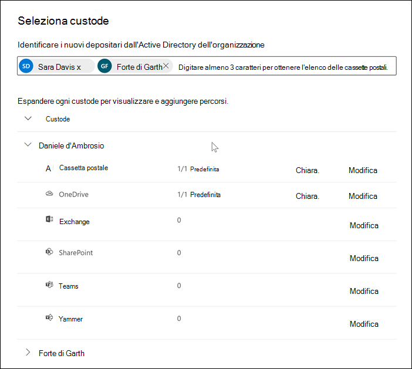

# Aggiungere i depositari a un caso avanzato di eDiscovery

Utilizzare lo strumento di gestione del custode incorporato in Advanced eDiscovery per coordinare i flussi di lavoro in merito alla gestione dei depositari e identificare le origini dati rilevanti e detentive associate a un caso. Quando si aggiunge un custode, il sistema può identificare automaticamente e inserire un blocco sulla cassetta postale di Exchange e OneDrive for business. Durante il processo di individuazione dell'analisi, è possibile identificare anche altre origini dati (ad esempio, cassette postali, siti o Team) a cui un custode ha eseguito l'accesso o ha contribuito. In questa situazione, è possibile utilizzare lo strumento di gestione dei depositari per associare tali origini dati a un determinato custode. Dopo aver aggiunto i depositari a un caso e aver associato altre origini dati, è possibile conservare i dati in modo rapido e cercarli.

È possibile aggiungere e gestire i depositari nei casi avanzati di eDiscovery in quattro passaggi:

1. Identificare i depositari.

2. Scegliere posizioni dei dati del custode.

3. Configurare le impostazioni di blocco.

4. Esaminare i depositari e completare il processo.

   

## Verificare di disporre delle autorizzazioni necessarie

Per aggiungere depositari a un caso, è necessario essere membri del gruppo di ruoli eDiscovery Manager. In questo modo, vengono fornite le autorizzazioni necessarie per aggiungere i depositari a un caso e inserire un'esenzione nelle origini dati della custodia. Per altre informazioni, vedere [Assegnare autorizzazioni di eDiscovery](get-started-with-advanced-ediscovery.md#step-2-assign-ediscovery-permissions).

## Passaggio 1: identificare i depositari

1. Passare a [https://compliance.microsoft.com](https://compliance.microsoft.com) e accedere con un account utente a cui sono state assegnate le autorizzazioni di eDiscovery appropriate.

2. Nel riquadro di spostamento a sinistra del centro conformità di Microsoft 365 fare clic su **Mostra tutto**, quindi fare clic su **eDiscovery > avanzate**.

3. Nella pagina **Advanced eDiscovery** , fare clic sulla scheda **case** , quindi selezionare il caso in cui si desidera aggiungere i depositari.

4. Fare clic sulla scheda **origini dati** , quindi fare clic su **Aggiungi nuova origine dati**  >  .

5. Aggiungere uno o più utenti nell'organizzazione come depositari del caso digitando la prima parte del nome o dell'alias di una persona. Dopo aver trovato la persona corretta, selezionarne il nome per aggiungerli all'elenco.

## Passaggio 2: scegliere le posizioni dei dati del custode

Dopo aver selezionato i depositari, il sistema tenta automaticamente di identificare e verificare gli utenti e le origini dati. Dopo aver aggiunto i depositari all'elenco, lo strumento include automaticamente la cassetta postale principale e l'account OneDrive per ogni custode. È possibile scegliere di non includere queste origini dati quando si aggiungono i depositari al caso.

Oltre alla cassetta postale e all'account OneDrive di un custode, è possibile associare anche altre posizioni di dati a un custode, ad esempio un sito di SharePoint o un team di Microsoft di cui è membro il custode. In questo modo è possibile conservare, raccogliere, analizzare ed esaminare il contenuto in altre origini dati associate ai depositari del caso.

Per deselezionare la cassetta postale principale e l'account OneDrive per un custode:

1. Espandere il custode per visualizzare i percorsi di dati primari che sono stati associati automaticamente a ogni custode.

2. Selezionare **Cancella** accanto a **cassetta postale** o **OneDrive** per rimuovere la cassetta postale di un custode o l'account OneDrive dall'associazione come percorso dati per il custode.

   

Per associare altre cassette postali, siti, team o gruppi di Yammer a un determinato custode:

1. Espandere un custode per visualizzare i servizi seguenti per associare le posizioni dei dati al custode. Fare clic su **modifica** accanto a un servizio per aggiungere una posizione di dati.

   - **Exchange**: consente di associare altre cassette postali al custode. Digitare nella casella di ricerca il nome o l'alias (almeno tre caratteri) delle cassette postali degli utenti o dei gruppi di distribuzione. Selezionare le cassette postali da assegnare al custode, quindi fare clic su **Aggiungi**.

   - **SharePoint**: consente di associare i siti di SharePoint al custode. Selezionare un sito nell'elenco o cercare un sito digitando un URL nella casella di ricerca. Selezionare i siti da assegnare al custode, quindi fare clic su **Aggiungi**.

   - **Teams**: utilizzare per assegnare i team Microsoft di cui è attualmente membro il custode. Selezionare i team da assegnare al custode, quindi fare clic su **Aggiungi**. Dopo aver aggiunto un team, il sistema identifica e individua automaticamente la cassetta postale del sito e del gruppo di SharePoint associata a tale team e le assegna al custode.

   - **Yammer**: consente di assegnare i gruppi di Yammer di cui è attualmente membro il custode. Selezionare i gruppi da assegnare al custode, quindi fare clic su **Aggiungi**. Dopo aver aggiunto un team, il sistema identifica e individua automaticamente la cassetta postale del sito e del gruppo di SharePoint associata a tale gruppo e le assegna al custode.

   > [!NOTE]
   > È possibile utilizzare i selezionatori di posizione di **Exchange** e di **SharePoint** per associare altri team o gruppi di Yammer (che un custode non è membro di) a un custode. A tale scopo, è necessario aggiungere sia la cassetta postale che il sito associati a ogni team o gruppo Yammer.

2. È possibile visualizzare il numero totale di cassette postali, siti, team e gruppi di Yammer assegnati a ciascun custode espandendo ogni custode nella tabella. Dopo aver completato i percorsi dei dati assegnati per ogni custode, queste associazioni verranno mantenute e utilizzate durante la raccolta, l'elaborazione e la revisione delle fasi del flusso di lavoro Advanced eDiscovery.

3. Dopo aver aggiunto i depositari e aver configurato le rispettive posizioni dei dati, fare clic su **Avanti** per passare alla pagina **impostazioni di blocco** .  

## Passaggio 3: configurare le impostazioni di blocco

 Dopo aver completato i depositari e le rispettive posizioni dei dati, è possibile mettere in attesa alcuni o tutti i depositari. Quando si posiziona un custode in attesa, tutto il contenuto in tutti i percorsi di contenuto associati al custode viene mantenuto finché non si rimuove il blocco o si rilascia il custode dall'esenzione. In alcuni casi, potrebbe essere necessario aggiungere i depositari a un caso senza bloccarli.

Per inserire i depositari e le origini dati in attesa:

1. Nella pagina **impostazioni di blocco** , è possibile applicare un'esenzione ai singoli depositari selezionando la casella di controllo nella colonna **blocco** .

   In alternativa, è possibile mettere in attesa tutti i depositari selezionando la casella di controllo **blocca** nella parte superiore della colonna.

2. Verificare le selezioni di blocco del custode e quindi fare clic su **Avanti**.

   > [!NOTE]
   > Se non si dispone di un'esenzione su un custode, il custode e le relative origini dati associate verranno aggiunte al caso, ma il contenuto di tali origini dati non verrà mantenuto dall'esenzione associata al caso.

## Passaggio 4: esaminare i depositari e completare il processo

Prima di aggiungere effettivamente i depositari al caso, è possibile esaminare l'elenco dei depositari, le posizioni dei dati a essi assegnati e le impostazioni di blocco.

1. Verificare ed esaminare tutto il numero di origini dati e l'impostazione di blocco associata a ogni custode della tabella. Se necessario, tornare alla pagina identifica le impostazioni del **custode** o del **blocco** per apportare eventuali modifiche.

2. Fare clic su **Invia** per aggiungere i depositari e le rispettive posizioni dei dati al caso e applicare tutte le impostazioni per il blocco di custodia.

   I nuovi depositari vengono aggiunti al caso e visualizzati nella scheda **origini dati** .

   [ origini dati](../media/DataSourcesTab.png#lightbox)
