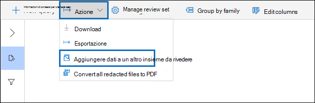
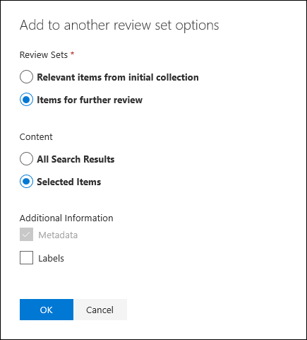

# Aggiunta di dati a un insieme da rivedere da un altro insieme da rivedere

In alcuni casi, potrebbe essere necessario selezionare i documenti da un set di revisioni e lavorare con loro singolarmente in un altro set di revisione. Ciò è particolarmente utile se sono stati raccolti contenuti in un insieme da rivedere e si desidera eseguire un'analisi sul sottoinsieme di dati.

Seguire il flusso di lavoro in questo articolo per aggiungere contenuto da un set di recensioni a un altro.

## Creare un set di recensioni

Prima di iniziare, dovrai creare un set di recensioni a cui aggiungere i dati.  È possibile aggiungere un nuovo set di revisioni nella **scheda Set di revisioni** del caso. Per ulteriori informazioni, vedere [Create a review set.](managing-review-sets.md#create-a-review-set)

## Passaggio 1: identificare il contenuto da aggiungere a un altro set di recensioni

È possibile aggiungere contenuti da un insieme da rivedere a un altro selezionando documenti specifici nell'insieme da rivedere di origine oppure selezionando tutti gli elementi restituiti dalla query dell'insieme da rivedere. Se si aggiungono elementi selezionati, selezionarli, selezionare **Azione** e quindi **aggiungi a un altro set di revisione.**

## Passaggio 2: Specificare le opzioni per l'aggiunta a un altro set di recensioni

Nella pagina **a comparsa Aggiungi a un altro set di** recensioni scegliere il set di recensioni a cui si desidera aggiungere gli elementi. Scegliere se aggiungere Tutti **i risultati della ricerca** o Elementi **selezionati**.  **Ulteriori informazioni** forniscono opzioni per includere tutti i metadati degli elementi  e se includere i tag (selezionando la casella di controllo Etichette) dal set di revisione di origine quando i documenti vengono aggiunti al nuovo set di revisioni.  

Dopo aver fatto clic su **Ok,** viene creato un nuovo processo (denominato Aggiunta di dati a un altro **set** di revisione) per aggiungere il contenuto a un altro set di revisioni. È possibile passare alla **scheda Processi** e monitorare l'avanzamento del processo. Per ulteriori informazioni, vedere [Manage jobs.](managing-jobs-ediscovery20.md)
