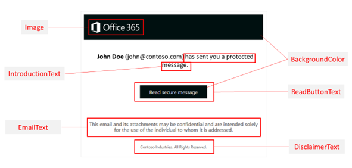

# <a name="add-your-organizations-brand-to-your-encrypted-messages"></a><span data-ttu-id="615bd-103">Aggiungere il logo della propria organizzazione ai messaggi crittografati</span><span class="sxs-lookup"><span data-stu-id="615bd-103">Add your organization's brand to your encrypted messages</span></span>

<span data-ttu-id="615bd-104">In qualità di amministratore di Exchange Online o Exchange Online Protection, è possibile applicare il marchio dell'azienda per personalizzare l'aspetto dei messaggi di posta elettronica di crittografia del messaggio Microsoft 365 for business dell'organizzazione e il contenuto del portale di crittografia.</span><span class="sxs-lookup"><span data-stu-id="615bd-104">As an Exchange Online or Exchange Online Protection administrator, you can apply your company branding to customize the look of your organization's Microsoft 365 for business Message Encryption email messages and the contents of the encryption portal.</span></span> <span data-ttu-id="615bd-105">Utilizzando i cmdlet Get-OMEConfiguration e set-OMEConfiguration di Windows PowerShell, è possibile personalizzare i seguenti aspetti dell'esperienza di visualizzazione per i destinatari dei messaggi di posta elettronica crittografati:</span><span class="sxs-lookup"><span data-stu-id="615bd-105">Using the Get-OMEConfiguration and Set-OMEConfiguration Windows PowerShell cmdlets, you can customize the following aspects of the viewing experience for recipients of encrypted email messages:</span></span>
  
- <span data-ttu-id="615bd-106">Testo introduttivo del messaggio di posta elettronica contenente il messaggio crittografato</span><span class="sxs-lookup"><span data-stu-id="615bd-106">Introductory text of the email that contains the encrypted message</span></span>

- <span data-ttu-id="615bd-107">Testo della dichiarazione di non responsabilità del messaggio di posta elettronica contenente il messaggio crittografato</span><span class="sxs-lookup"><span data-stu-id="615bd-107">Disclaimer text of the email that contains the encrypted message</span></span>

- <span data-ttu-id="615bd-108">URL dell'informativa sulla privacy per l'organizzazione</span><span class="sxs-lookup"><span data-stu-id="615bd-108">URL of the privacy statement for your organization</span></span>

- <span data-ttu-id="615bd-109">Testo visualizzato nel portale OME</span><span class="sxs-lookup"><span data-stu-id="615bd-109">Text that appears in the OME portal</span></span>

- <span data-ttu-id="615bd-110">Logo visualizzato nel messaggio di posta elettronica e nel portale OME o se utilizzare un logo</span><span class="sxs-lookup"><span data-stu-id="615bd-110">Logo that appears in the email message and OME portal, or whether to use a logo at all</span></span>

- <span data-ttu-id="615bd-111">Colore di sfondo nel messaggio di posta elettronica e nel portale OME</span><span class="sxs-lookup"><span data-stu-id="615bd-111">Background color in the email message and OME portal</span></span>

<span data-ttu-id="615bd-112">È anche possibile ripristinare l'aspetto predefinito in qualsiasi momento.</span><span class="sxs-lookup"><span data-stu-id="615bd-112">You can also revert back to the default look and feel at any time.</span></span>

<span data-ttu-id="615bd-113">Se si desidera un maggiore controllo, è possibile utilizzare la crittografia avanzata dei messaggi di Office 365 e creare più modelli per i messaggi di posta elettronica crittografati provenienti dall'organizzazione.</span><span class="sxs-lookup"><span data-stu-id="615bd-113">If you'd like more control, you can use Office 365 Advanced Message Encryption and create multiple templates for encrypted emails originating from your organization.</span></span> <span data-ttu-id="615bd-114">Utilizzando questi modelli, è possibile controllare più solo l'aspetto dei messaggi di posta elettronica, ma anche controllare le parti dell'esperienza dell'utente finale.</span><span class="sxs-lookup"><span data-stu-id="615bd-114">Using these templates, you can control more than just the look and feel of the email messages, but also control parts of the end-user experience.</span></span> <span data-ttu-id="615bd-115">Ad esempio, è possibile specificare se i destinatari di posta elettronica a cui è applicato il modello e che utilizzano Google, Yahoo e gli account Microsoft possono utilizzare questi account per accedere al portale di crittografia dei messaggi di Office 365.</span><span class="sxs-lookup"><span data-stu-id="615bd-115">For example, you can specify whether recipients of mail that have this template applied and who use Google, Yahoo, and Microsoft Accounts can use these accounts to sign in to the Office 365 Message Encryption portal.</span></span> <span data-ttu-id="615bd-116">È possibile utilizzare i modelli per soddisfare diversi casi di utilizzo, ad esempio:</span><span class="sxs-lookup"><span data-stu-id="615bd-116">You might use templates to fulfill several use cases, such as:</span></span>

- <span data-ttu-id="615bd-117">Modelli per ogni reparto, ad esempio Finance, Sales e così via.</span><span class="sxs-lookup"><span data-stu-id="615bd-117">Templates for each department, such as Finance, Sales, and so on.</span></span>

- <span data-ttu-id="615bd-118">Modelli per prodotti diversi</span><span class="sxs-lookup"><span data-stu-id="615bd-118">Templates for different products</span></span>

- <span data-ttu-id="615bd-119">Modelli per aree geografiche o paesi diversi</span><span class="sxs-lookup"><span data-stu-id="615bd-119">Templates for different geographical regions or countries</span></span>

- <span data-ttu-id="615bd-120">Se si desidera consentire la revoca di messaggi di posta elettronica</span><span class="sxs-lookup"><span data-stu-id="615bd-120">Whether you want to allow emails to be revoked</span></span>

- <span data-ttu-id="615bd-121">Se si desidera che i messaggi di posta elettronica inviati a destinatari esterni scadano dopo un determinato numero di giorni.</span><span class="sxs-lookup"><span data-stu-id="615bd-121">Whether you want emails sent to external recipients to expire after a specified number of days.</span></span>

<span data-ttu-id="615bd-122">Dopo aver creato i modelli, è possibile applicarli ai messaggi di posta elettronica crittografati utilizzando le regole del flusso di messaggi di Exchange.</span><span class="sxs-lookup"><span data-stu-id="615bd-122">Once you've created the templates, you can apply them to encrypted emails by using Exchange mail flow rules.</span></span> <span data-ttu-id="615bd-123">Se si dispone della crittografia avanzata dei messaggi di Office 365, è possibile revocare tutti i messaggi di posta elettronica che sono stati creati utilizzando questi modelli.</span><span class="sxs-lookup"><span data-stu-id="615bd-123">If you have Office 365 Advanced Message Encryption, you can revoke any email that you've branded by using these templates.</span></span>

## <a name="work-with-ome-branding-templates"></a><span data-ttu-id="615bd-124">Utilizzo dei modelli di personalizzazione OME</span><span class="sxs-lookup"><span data-stu-id="615bd-124">Work with OME branding templates</span></span>

<span data-ttu-id="615bd-125">È possibile modificare diverse funzionalità all'interno di un modello di branding.</span><span class="sxs-lookup"><span data-stu-id="615bd-125">You can modify several features within a branding template.</span></span> <span data-ttu-id="615bd-126">È possibile modificare, ma non rimuovere, il modello predefinito.</span><span class="sxs-lookup"><span data-stu-id="615bd-126">You can modify, but not remove, the default template.</span></span> <span data-ttu-id="615bd-127">Se si dispone di una crittografia avanzata dei messaggi, è anche possibile creare, modificare e rimuovere modelli personalizzati.</span><span class="sxs-lookup"><span data-stu-id="615bd-127">If you have Advanced Message Encryption, you can also create, modify, and remove custom templates.</span></span> <span data-ttu-id="615bd-128">Utilizzare Windows PowerShell per l'utilizzo di un modello di personalizzazione alla volta.</span><span class="sxs-lookup"><span data-stu-id="615bd-128">Use Windows PowerShell to work with one branding template at a time.</span></span> <span data-ttu-id="615bd-129">È necessario disporre di un account aziendale o dell'Istituto di istruzione che disponga delle autorizzazioni di amministratore globale nell'organizzazione per l'utilizzo di tali cmdlet.</span><span class="sxs-lookup"><span data-stu-id="615bd-129">You'll need a work or school account that has global administrator permissions in your organization to use these cmdlets.</span></span>

- <span data-ttu-id="615bd-130">[Set-OMEConfiguration](https://docs.microsoft.com/powershell/module/exchange/set-omeconfiguration) : consente di modificare il modello di personalizzazione predefinito o un modello personalizzato di personalizzazione creato.</span><span class="sxs-lookup"><span data-stu-id="615bd-130">[Set-OMEConfiguration](https://docs.microsoft.com/powershell/module/exchange/set-omeconfiguration) - Modify the default branding template or a custom branding template that you created.</span></span>
- <span data-ttu-id="615bd-131">[New-OMEConfiguration](https://docs.microsoft.com/powershell/module/exchange/new-omeconfiguration) -creare un nuovo modello di branding, solo crittografia avanzata dei messaggi.</span><span class="sxs-lookup"><span data-stu-id="615bd-131">[New-OMEConfiguration](https://docs.microsoft.com/powershell/module/exchange/new-omeconfiguration) - Create a new branding template, Advanced Message Encryption only.</span></span>
- <span data-ttu-id="615bd-132">[Remove-OMEConfiguration](https://docs.microsoft.com/powershell/module/exchange/remove-omeconfiguration) -rimuove un modello di personalizzazione personalizzato, solo la crittografia avanzata dei messaggi.</span><span class="sxs-lookup"><span data-stu-id="615bd-132">[Remove-OMEConfiguration](https://docs.microsoft.com/powershell/module/exchange/remove-omeconfiguration) - Remove a custom branding template, Advanced Message Encryption only.</span></span> <span data-ttu-id="615bd-133">Non è possibile eliminare il modello di personalizzazione predefinito.</span><span class="sxs-lookup"><span data-stu-id="615bd-133">You can't delete the default branding template.</span></span>
  
## <a name="modify-an-ome-branding-template"></a><span data-ttu-id="615bd-134">Modificare un modello di branding OME</span><span class="sxs-lookup"><span data-stu-id="615bd-134">Modify an OME branding template</span></span>

<span data-ttu-id="615bd-135">Utilizzare Windows PowerShell per modificare un modello di branding alla volta.</span><span class="sxs-lookup"><span data-stu-id="615bd-135">Use Windows PowerShell to modify one branding template at a time.</span></span> <span data-ttu-id="615bd-136">Se si dispone di una crittografia avanzata dei messaggi, è anche possibile creare, modificare e rimuovere modelli personalizzati.</span><span class="sxs-lookup"><span data-stu-id="615bd-136">If you have Advanced Message Encryption, you can also create, modify, and remove custom templates.</span></span>

1. <span data-ttu-id="615bd-137">Utilizzo di un account aziendale o dell'Istituto di istruzione con autorizzazioni di amministratore globale nell'organizzazione, avviare una sessione di Windows PowerShell e connettersi a Exchange Online.</span><span class="sxs-lookup"><span data-stu-id="615bd-137">Using a work or school account that has global administrator permissions in your organization, start a Windows PowerShell session and connect to Exchange Online.</span></span> <span data-ttu-id="615bd-138">Per istruzioni, vedere [Connettersi a PowerShell di Exchange Online](https://aka.ms/exopowershell).</span><span class="sxs-lookup"><span data-stu-id="615bd-138">For instructions, see [Connect to Exchange Online PowerShell](https://aka.ms/exopowershell).</span></span>

2. <span data-ttu-id="615bd-139">Modificare il modello utilizzando il cmdlet Set-OMEConfiguration come descritto in [set-OMEConfiguration](https://docs.microsoft.com/powershell/module/exchange/Set-OMEConfiguration) oppure utilizzare la seguente tabella grafica e per indicazioni.</span><span class="sxs-lookup"><span data-stu-id="615bd-139">Modify the template by using the Set-OMEConfiguration cmdlet as described in [Set-OMEConfiguration](https://docs.microsoft.com/powershell/module/exchange/Set-OMEConfiguration) or use the following graphic and table for guidance.</span></span>



|<span data-ttu-id="615bd-141">**Per personalizzare questa funzionalità dell'esperienza di crittografia**</span><span class="sxs-lookup"><span data-stu-id="615bd-141">**To customize this feature of the encryption experience**</span></span>|<span data-ttu-id="615bd-142">**Utilizzare questi comandi**</span><span class="sxs-lookup"><span data-stu-id="615bd-142">**Use these commands**</span></span>|
|:-----|:-----|
|<span data-ttu-id="615bd-143">Colore di sfondo</span><span class="sxs-lookup"><span data-stu-id="615bd-143">Background color</span></span>|`Set-OMEConfiguration -Identity "<OMEConfigurationName>" -BackgroundColor "<#RRGGBB hexadecimal color code or name value>"` <br/> <span data-ttu-id="615bd-144">**Esempio:**</span><span class="sxs-lookup"><span data-stu-id="615bd-144">**Example:**</span></span> <br/>  `Set-OMEConfiguration -Identity "Branding Template 1" -BackgroundColor "#ffffff"` <br/> <span data-ttu-id="615bd-145">Per ulteriori informazioni sui colori di sfondo, vedere la sezione [colori di sfondo](#background-color-reference) più avanti in questo argomento.</span><span class="sxs-lookup"><span data-stu-id="615bd-145">For more information about background colors, see the [Background colors](#background-color-reference) section later in this topic.</span></span>|
|<span data-ttu-id="615bd-146">Logo</span><span class="sxs-lookup"><span data-stu-id="615bd-146">Logo</span></span>|`Set-OMEConfiguration -Identity "<OMEConfigurationName>" -Image <Byte[]>` <br/> <span data-ttu-id="615bd-147">**Esempio:**</span><span class="sxs-lookup"><span data-stu-id="615bd-147">**Example:**</span></span> <br/>  `Set-OMEConfiguration -Identity "Branding Template 1" -Image (Get-Content "C:\Temp\contosologo.png" -Encoding byte)` <br/> <span data-ttu-id="615bd-148">Formati di file supportati: png, jpg, bmp o tiff</span><span class="sxs-lookup"><span data-stu-id="615bd-148">Supported file formats: .png, .jpg, .bmp, or .tiff</span></span>  <br/> <span data-ttu-id="615bd-149">Dimensione ottimale relativa al file del logo: inferiore a 40 KB</span><span class="sxs-lookup"><span data-stu-id="615bd-149">Optimal size of logo file: less than 40 KB</span></span>  <br/> <span data-ttu-id="615bd-150">Dimensioni ottimali dell'immagine del logo: 170x70 pixel.</span><span class="sxs-lookup"><span data-stu-id="615bd-150">Optimal size of logo image: 170x70 pixels.</span></span> <span data-ttu-id="615bd-151">Se l'immagine supera queste dimensioni, il logo viene ridimensionato per essere visualizzato nel portale.</span><span class="sxs-lookup"><span data-stu-id="615bd-151">If your image exceeds these dimensions, the service resizes your logo for display in the portal.</span></span> <span data-ttu-id="615bd-152">Il servizio non modifica il file grafico stesso.</span><span class="sxs-lookup"><span data-stu-id="615bd-152">The service doesn't modify the graphic file itself.</span></span> <span data-ttu-id="615bd-153">Per ottenere risultati ottimali, utilizzare le dimensioni ottimali.</span><span class="sxs-lookup"><span data-stu-id="615bd-153">For best results, use the optimal size.</span></span>|
|<span data-ttu-id="615bd-154">Testo accanto al nome e all'indirizzo di posta elettronica del mittente</span><span class="sxs-lookup"><span data-stu-id="615bd-154">Text next to the sender's name and email address</span></span>|`Set-OMEConfiguration -Identity "<OMEConfigurationName>" -IntroductionText "<String up to 1024 characters>"` <br/> <span data-ttu-id="615bd-155">**Esempio:**</span><span class="sxs-lookup"><span data-stu-id="615bd-155">**Example:**</span></span> <br/>  `Set-OMEConfiguration -Identity "Branding Template 1" -IntroductionText "has sent you a secure message."`|
|<span data-ttu-id="615bd-156">Testo visualizzato sul pulsante "Leggi messaggio"</span><span class="sxs-lookup"><span data-stu-id="615bd-156">Text that appears on the "Read Message" button</span></span>|`Set-OMEConfiguration -Identity "<OMEConfigurationName>" -ReadButtonText "<String up to 1024 characters>"` <br/> <span data-ttu-id="615bd-157">**Esempio:**</span><span class="sxs-lookup"><span data-stu-id="615bd-157">**Example:**</span></span> <br/>  `Set-OMEConfiguration -Identity "OME Configuration" -ReadButtonText "Read Secure Message."`|
|<span data-ttu-id="615bd-158">Testo visualizzato sotto il pulsante "Leggi messaggio"</span><span class="sxs-lookup"><span data-stu-id="615bd-158">Text that appears below the "Read Message" button</span></span>|`Set-OMEConfiguration -Identity "<OMEConfigurationName>" -EmailText "<String up to 1024 characters>"` <br/> <span data-ttu-id="615bd-159">**Esempio:**</span><span class="sxs-lookup"><span data-stu-id="615bd-159">**Example:**</span></span> <br/>  `Set-OMEConfiguration -Identity "OME Configuration" -EmailText "Encrypted message from ContosoPharma secure messaging system."`|
|<span data-ttu-id="615bd-160">URL del collegamento all'informativa sulla privacy</span><span class="sxs-lookup"><span data-stu-id="615bd-160">URL for the Privacy Statement link</span></span>|`Set-OMEConfiguration -Identity "<OMEConfigurationName>" -PrivacyStatementURL "<URL>"` <br/> <span data-ttu-id="615bd-161">**Esempio:**</span><span class="sxs-lookup"><span data-stu-id="615bd-161">**Example:**</span></span> <br/>  `Set-OMEConfiguration -Identity "Branding Template 1" -PrivacyStatementURL "https://contoso.com/privacystatement.html"`|
|<span data-ttu-id="615bd-162">dichiarazione di non responsabilità nella posta elettronica che contiene il messaggio crittografato</span><span class="sxs-lookup"><span data-stu-id="615bd-162">Disclaimer statement in the email that contains the encrypted message</span></span>|`Set-OMEConfiguration -Identity "<OMEConfigurationName>" -DisclaimerText "<Disclaimer statement. String of up to 1024 characters.>"` <br/> <span data-ttu-id="615bd-163">**Esempio:**</span><span class="sxs-lookup"><span data-stu-id="615bd-163">**Example:**</span></span> <br/>  `Set-OMEConfiguration -Identity "Branding Template 1" -DisclaimerText "This message is confidential for the use of the addressee only."`|
|<span data-ttu-id="615bd-164">testo visualizzato nella parte superiore del portale di visualizzazione del messaggio crittografato</span><span class="sxs-lookup"><span data-stu-id="615bd-164">Text that appears at the top of the encrypted mail viewing portal</span></span>|`Set-OMEConfiguration -Identity "<OMEConfigurationName>" -PortalText "<Text for your portal. String of up to 128 characters.>"` <br/> <span data-ttu-id="615bd-165">**Esempio:**</span><span class="sxs-lookup"><span data-stu-id="615bd-165">**Example:**</span></span> <br/>  `Set-OMEConfiguration -Identity "OME Configuration" -PortalText "ContosoPharma secure email portal."`|
|<span data-ttu-id="615bd-166">Per abilitare o disabilitare l'autenticazione con un codice Pass una tantum per questo modello personalizzato</span><span class="sxs-lookup"><span data-stu-id="615bd-166">To enable or disable authentication with a one-time pass code for this custom template</span></span>|`Set-OMEConfiguration -Identity "<OMEConfigurationName>" -OTPEnabled <$true|$false>` <br/> <span data-ttu-id="615bd-167">**Esempi:**</span><span class="sxs-lookup"><span data-stu-id="615bd-167">**Examples:**</span></span> <br/><span data-ttu-id="615bd-168">Per abilitare i codici di accesso una tantum per questo modello personalizzato</span><span class="sxs-lookup"><span data-stu-id="615bd-168">To enable one-time passcodes for this custom template</span></span> <br/>  `Set-OMEConfiguration -Identity "Branding Template 1" -OTPEnabled $true` <br/> <span data-ttu-id="615bd-169">Per disabilitare i codici di accesso una tantum per questo modello personalizzato</span><span class="sxs-lookup"><span data-stu-id="615bd-169">To disable one-time passcodes for this custom template</span></span> <br/>  `Set-OMEConfiguration -Identity "Branding Template 1" -OTPEnabled $false`|
|<span data-ttu-id="615bd-170">Per abilitare o disabilitare l'autenticazione con identità Microsoft, Google o Yahoo per questo modello personalizzato</span><span class="sxs-lookup"><span data-stu-id="615bd-170">To enable or disable authentication with Microsoft, Google, or Yahoo identities for this custom template</span></span>|`Set-OMEConfiguration -Identity "<OMEConfigurationName>" -SocialIdSignIn <$true|$false>` <br/> <span data-ttu-id="615bd-171">**Esempi:**</span><span class="sxs-lookup"><span data-stu-id="615bd-171">**Examples:**</span></span> <br/><span data-ttu-id="615bd-172">Per abilitare gli ID di social networking per questo modello personalizzato</span><span class="sxs-lookup"><span data-stu-id="615bd-172">To enable social IDs for this custom template</span></span> <br/>  `Set-OMEConfiguration -Identity "Branding Template 1" -SocialIdSignIn $true` <br/> <span data-ttu-id="615bd-173">Per disabilitare gli ID di social networking per questo modello personalizzato</span><span class="sxs-lookup"><span data-stu-id="615bd-173">To disable social IDs for this custom template</span></span> <br/>  `Set-OMEConfiguration -Identity "Branding Template 1" -SocialIdSignIn $false`|

## <a name="create-an-ome-branding-template-advanced-message-encryption"></a><span data-ttu-id="615bd-174">Creare un modello di branding OME (Advanced Message Encryption)</span><span class="sxs-lookup"><span data-stu-id="615bd-174">Create an OME branding template (Advanced Message Encryption)</span></span>

<span data-ttu-id="615bd-175">Se si dispone della crittografia dei messaggi avanzata di Office 365, è possibile creare modelli di personalizzazione personalizzati per l'organizzazione utilizzando il cmdlet [New-OMEConfiguration](https://docs.microsoft.com/powershell/module/exchange/new-omeconfiguration) .</span><span class="sxs-lookup"><span data-stu-id="615bd-175">If you have Office 365 Advanced Message Encryption, you can create custom branding templates for your organization by using the [New-OMEConfiguration](https://docs.microsoft.com/powershell/module/exchange/new-omeconfiguration) cmdlet.</span></span> <span data-ttu-id="615bd-176">Dopo aver creato il modello, è possibile modificare il modello utilizzando il cmdlet Set-OMEConfiguration, come descritto in [Modify an ome branding template](#modify-an-ome-branding-template).</span><span class="sxs-lookup"><span data-stu-id="615bd-176">Once you've created the template, you modify the template by using the Set-OMEConfiguration cmdlet as described in [Modify an OME branding template](#modify-an-ome-branding-template).</span></span> <span data-ttu-id="615bd-177">È possibile creare più modelli.</span><span class="sxs-lookup"><span data-stu-id="615bd-177">You can create multiple templates.</span></span>

<span data-ttu-id="615bd-178">Per creare un nuovo modello di personalizzazione personalizzato:</span><span class="sxs-lookup"><span data-stu-id="615bd-178">To create a new custom branding template:</span></span>

1. <span data-ttu-id="615bd-179">Utilizzo di un account aziendale o dell'Istituto di istruzione con autorizzazioni di amministratore globale nell'organizzazione, avviare una sessione di Windows PowerShell e connettersi a Exchange Online.</span><span class="sxs-lookup"><span data-stu-id="615bd-179">Using a work or school account that has global administrator permissions in your organization, start a Windows PowerShell session and connect to Exchange Online.</span></span> <span data-ttu-id="615bd-180">Per istruzioni, vedere [Connettersi a PowerShell di Exchange Online](https://aka.ms/exopowershell).</span><span class="sxs-lookup"><span data-stu-id="615bd-180">For instructions, see [Connect to Exchange Online PowerShell](https://aka.ms/exopowershell).</span></span>

2. <span data-ttu-id="615bd-181">Utilizzare il cmdlet [New-OMEConfiguration](https://docs.microsoft.com/powershell/module/exchange/new-omeconfiguration) per creare un nuovo modello.</span><span class="sxs-lookup"><span data-stu-id="615bd-181">Use the [New-OMEConfiguration](https://docs.microsoft.com/powershell/module/exchange/new-omeconfiguration) cmdlet to create a new template.</span></span>

   ```powershell
   New-OMEConfiguration -Identity "<OMEConfigurationName>"
   ```

   <span data-ttu-id="615bd-182">For example,</span><span class="sxs-lookup"><span data-stu-id="615bd-182">For example,</span></span>

   ```powershell
   New-OMEConfiguration -Identity "Custom branding template"
   ```

## <a name="return-the-default-branding-template-to-its-original-values"></a><span data-ttu-id="615bd-183">Ripristinare i valori originali del modello di personalizzazione predefinito</span><span class="sxs-lookup"><span data-stu-id="615bd-183">Return the default branding template to its original values</span></span>

<span data-ttu-id="615bd-184">Per rimuovere tutte le modifiche dal modello predefinito, incluse le personalizzazioni del marchio e così via, eseguire la procedura seguente:</span><span class="sxs-lookup"><span data-stu-id="615bd-184">To remove all modifications from the default template, including brand customizations, and so on, complete these steps:</span></span>
  
1. <span data-ttu-id="615bd-185">Utilizzo di un account aziendale o dell'Istituto di istruzione con autorizzazioni di amministratore globale nell'organizzazione, avviare una sessione di Windows PowerShell e connettersi a Exchange Online.</span><span class="sxs-lookup"><span data-stu-id="615bd-185">Using a work or school account that has global administrator permissions in your organization, start a Windows PowerShell session and connect to Exchange Online.</span></span> <span data-ttu-id="615bd-186">Per istruzioni, vedere [Connettersi a PowerShell di Exchange Online](https://aka.ms/exopowershell).</span><span class="sxs-lookup"><span data-stu-id="615bd-186">For instructions, see [Connect to Exchange Online PowerShell](https://aka.ms/exopowershell).</span></span>

2. <span data-ttu-id="615bd-187">Utilizzare il cmdlet **set-OMEConfiguration** come descritto in [set-OMEConfiguration](https://docs.microsoft.com/powershell/module/exchange/Set-OMEConfiguration).</span><span class="sxs-lookup"><span data-stu-id="615bd-187">Use the **Set-OMEConfiguration** cmdlet as described in [Set-OMEConfiguration](https://docs.microsoft.com/powershell/module/exchange/Set-OMEConfiguration).</span></span> <span data-ttu-id="615bd-188">Per rimuovere le personalizzazioni personalizzate dell'organizzazione dai valori DisclaimerText, EmailText e PortalText, impostare il valore su una stringa vuota `""` .</span><span class="sxs-lookup"><span data-stu-id="615bd-188">To remove your organization's branded customizations from the DisclaimerText, EmailText, and PortalText values, set the value to an empty string, `""`.</span></span> <span data-ttu-id="615bd-189">Per tutti i valori di immagine, ad esempio logo, impostare il valore su `"$null"` .</span><span class="sxs-lookup"><span data-stu-id="615bd-189">For all image values, such as Logo, set the value to  `"$null"`.</span></span>

   <span data-ttu-id="615bd-190">Nella tabella seguente vengono descritte le impostazioni predefinite dell'opzione di personalizzazione della crittografia.</span><span class="sxs-lookup"><span data-stu-id="615bd-190">The following table describes the encryption customization option defaults.</span></span>

   <span data-ttu-id="615bd-191">**Per ripristinare il testo e l'immagine predefiniti per questa funzionalità dell'esperienza di crittografia**</span><span class="sxs-lookup"><span data-stu-id="615bd-191">**To revert this feature of the encryption experience back to the default text and image**</span></span>|<span data-ttu-id="615bd-192">**Utilizzare questi comandi**</span><span class="sxs-lookup"><span data-stu-id="615bd-192">**Use these commands**</span></span>|
   |:-----|:-----|
   |<span data-ttu-id="615bd-193">Testo predefinito che accompagna i messaggi di posta elettronica crittografati</span><span class="sxs-lookup"><span data-stu-id="615bd-193">Default text that accompanies encrypted email messages</span></span>  <br/> <span data-ttu-id="615bd-194">Il testo predefinito viene visualizzato sopra le istruzioni per la visualizzazione di messaggi crittografati</span><span class="sxs-lookup"><span data-stu-id="615bd-194">The default text appears above the instructions for viewing encrypted messages</span></span>|`Set-OMEConfiguration -Identity "<OMEConfigurationName>" -EmailText "<empty string>"` <br/> <span data-ttu-id="615bd-195">**Esempio:**</span><span class="sxs-lookup"><span data-stu-id="615bd-195">**Example:**</span></span> <br/>  `Set-OMEConfiguration -Identity "OME Configuration" -EmailText ""`|
   |<span data-ttu-id="615bd-196">dichiarazione di non responsabilità nella posta elettronica che contiene il messaggio crittografato</span><span class="sxs-lookup"><span data-stu-id="615bd-196">Disclaimer statement in the email that contains the encrypted message</span></span>|`Set-OMEConfiguration -Identity "<OMEConfigurationName>" DisclaimerText "<empty string>"` <br/> <span data-ttu-id="615bd-197">**Esempio:**</span><span class="sxs-lookup"><span data-stu-id="615bd-197">**Example:**</span></span> <br/>  `Set-OMEConfiguration -Identity "OME Configuration" -DisclaimerText ""`|
   |<span data-ttu-id="615bd-198">testo visualizzato nella parte superiore del portale di visualizzazione del messaggio crittografato</span><span class="sxs-lookup"><span data-stu-id="615bd-198">Text that appears at the top of the encrypted mail viewing portal</span></span>|`Set-OMEConfiguration -Identity "<OMEConfigurationName>" -PortalText "<empty string>"` <br/> <span data-ttu-id="615bd-199">**Esempio ripristinando il valore predefinito:**</span><span class="sxs-lookup"><span data-stu-id="615bd-199">**Example reverting back to default:**</span></span> <br/>  `Set-OMEConfiguration -Identity "OME Configuration" -PortalText ""`|
   |<span data-ttu-id="615bd-200">Logo</span><span class="sxs-lookup"><span data-stu-id="615bd-200">Logo</span></span>|`Set-OMEConfiguration -Identity "<OMEConfigurationName>" -Image <"$null">` <br/> <span data-ttu-id="615bd-201">**Esempio ripristinando il valore predefinito:**</span><span class="sxs-lookup"><span data-stu-id="615bd-201">**Example reverting back to default:**</span></span> <br/>  `Set-OMEConfiguration -Identity "OME configuration" -Image $null`|
   |<span data-ttu-id="615bd-202">Colore di sfondo</span><span class="sxs-lookup"><span data-stu-id="615bd-202">Background color</span></span>|`Set-OMEConfiguration -Identity "<OMEConfigurationName>" -BackgroundColor "$null">` <br/> <span data-ttu-id="615bd-203">**Esempio ripristinando il valore predefinito:**</span><span class="sxs-lookup"><span data-stu-id="615bd-203">**Example reverting back to default:**</span></span> <br/> `Set-OMEConfiguration -Identity "OME configuration" -BackgroundColor $null`|
   |

## <a name="remove-a-custom-branding-template-advanced-message-encryption"></a><span data-ttu-id="615bd-204">Rimuovere un modello di personalizzazione personalizzato (Advanced Message Encryption)</span><span class="sxs-lookup"><span data-stu-id="615bd-204">Remove a custom branding template (Advanced Message Encryption)</span></span>

<span data-ttu-id="615bd-205">È possibile rimuovere o eliminare solo i modelli di personalizzazione che sono stati apportati.</span><span class="sxs-lookup"><span data-stu-id="615bd-205">You can only remove or delete branding templates that you've made.</span></span> <span data-ttu-id="615bd-206">Non è possibile rimuovere il modello di personalizzazione predefinito.</span><span class="sxs-lookup"><span data-stu-id="615bd-206">You can't remove the default branding template.</span></span>

<span data-ttu-id="615bd-207">Per rimuovere un modello di personalizzazione personalizzato:</span><span class="sxs-lookup"><span data-stu-id="615bd-207">To remove a custom branding template:</span></span>
  
1. <span data-ttu-id="615bd-208">Utilizzo di un account aziendale o dell'Istituto di istruzione con autorizzazioni di amministratore globale nell'organizzazione, avviare una sessione di Windows PowerShell e connettersi a Exchange Online.</span><span class="sxs-lookup"><span data-stu-id="615bd-208">Using a work or school account that has global administrator permissions in your organization, start a Windows PowerShell session and connect to Exchange Online.</span></span> <span data-ttu-id="615bd-209">Per istruzioni, vedere [Connettersi a PowerShell di Exchange Online](https://aka.ms/exopowershell).</span><span class="sxs-lookup"><span data-stu-id="615bd-209">For instructions, see [Connect to Exchange Online PowerShell](https://aka.ms/exopowershell).</span></span>

2. <span data-ttu-id="615bd-210">Utilizzare il cmdlet **Remove-OMEConfiguration** come indicato di seguito:</span><span class="sxs-lookup"><span data-stu-id="615bd-210">Use the **Remove-OMEConfiguration** cmdlet as follows:</span></span>

   ```powershell
   Remove-OMEConfiguration -Identity ""<OMEConfigurationName>"
   ```

   <span data-ttu-id="615bd-211">For example,</span><span class="sxs-lookup"><span data-stu-id="615bd-211">For example,</span></span>

   ```powershell
   Remove-OMEConfiguration -Identity "Branding template 1"
   ```

   <span data-ttu-id="615bd-212">Per ulteriori informazioni, vedere [Remove-OMEConfiguration](https://docs.microsoft.com/powershell/module/exchange/remove-omeconfiguration).</span><span class="sxs-lookup"><span data-stu-id="615bd-212">For more information, see [Remove-OMEConfiguration](https://docs.microsoft.com/powershell/module/exchange/remove-omeconfiguration).</span></span>

## <a name="create-an-exchange-mail-flow-rule-that-applies-your-custom-branding-to-encrypted-emails"></a><span data-ttu-id="615bd-213">Creare una regola del flusso di posta di Exchange che applica il branding personalizzato ai messaggi di posta elettronica crittografati</span><span class="sxs-lookup"><span data-stu-id="615bd-213">Create an Exchange mail flow rule that applies your custom branding to encrypted emails</span></span>

<span data-ttu-id="615bd-214">Dopo aver modificato il modello predefinito o creato nuovi modelli di branding, è possibile creare le regole del flusso di posta di Exchange per applicare il marchio personalizzato in base a determinate condizioni.</span><span class="sxs-lookup"><span data-stu-id="615bd-214">After you've either modified the default template or created new branding templates, you can create Exchange mail flow rules to apply your custom branding based on certain conditions.</span></span> <span data-ttu-id="615bd-215">Una regola di questo tipo applicherà il marchio personalizzato negli scenari seguenti:</span><span class="sxs-lookup"><span data-stu-id="615bd-215">Such a rule will apply custom branding in the following scenarios:</span></span>

- <span data-ttu-id="615bd-216">Se il messaggio di posta elettronica è stato crittografato manualmente dall'utente finale dal client Outlook o Outlook sul Web (in precedenza noto come Outlook Web App)</span><span class="sxs-lookup"><span data-stu-id="615bd-216">If the email was manually encrypted by the end user from the Outlook or Outlook on the web (formerly known as Outlook Web App) clients</span></span>

- <span data-ttu-id="615bd-217">Se il messaggio di posta elettronica è stato crittografato automaticamente da una regola del flusso di posta di Exchange o da un criterio di prevenzione</span><span class="sxs-lookup"><span data-stu-id="615bd-217">If the email was automatically encrypted by an Exchange mail flow rule or Data Loss Prevention policy</span></span>

<span data-ttu-id="615bd-218">Per informazioni su come creare una regola del flusso di posta di Exchange che applica la crittografia, vedere [definire le regole del flusso di posta per crittografare i messaggi di posta elettronica in Office 365](define-mail-flow-rules-to-encrypt-email.md).</span><span class="sxs-lookup"><span data-stu-id="615bd-218">For information on how to create an Exchange mail flow rule that applies encryption, see [Define mail flow rules to encrypt email messages in Office 365](define-mail-flow-rules-to-encrypt-email.md).</span></span>

1. <span data-ttu-id="615bd-219">In un Web browser, utilizzando un account aziendale o dell'Istituto di istruzione a cui sono state concesse le autorizzazioni di amministratore globale, [accedere a Office 365](https://support.office.com/article/b9582171-fd1f-4284-9846-bdd72bb28426#ID0EAABAAA=Web_browser).</span><span class="sxs-lookup"><span data-stu-id="615bd-219">In a web browser, using a work or school account that has been granted global administrator permissions, [sign in to Office 365](https://support.office.com/article/b9582171-fd1f-4284-9846-bdd72bb28426#ID0EAABAAA=Web_browser).</span></span>

2. <span data-ttu-id="615bd-220">Scegliere il riquadro **amministratore** .</span><span class="sxs-lookup"><span data-stu-id="615bd-220">Choose the **Admin** tile.</span></span>

3. <span data-ttu-id="615bd-221">Nell'interfaccia di amministrazione di Microsoft 365 fare clic su interfaccia di **Amministrazione** di \> **Exchange**.</span><span class="sxs-lookup"><span data-stu-id="615bd-221">In the Microsoft 365 admin center, choose **Admin centers** \> **Exchange**.</span></span>

4. <span data-ttu-id="615bd-222">Nell'interfaccia di amministrazione di Exchange, andare a regole del **flusso di posta** \> **Rules** e selezionare **nuova** nuova  \> **creare una nuova regola**.</span><span class="sxs-lookup"><span data-stu-id="615bd-222">In the EAC, go to **Mail flow** \> **Rules** and select **New**  \> **Create a new rule**.</span></span> <span data-ttu-id="615bd-223">Per ulteriori informazioni sull'utilizzo di EAC, vedere interfaccia [di amministrazione di Exchange in Exchange Online](https://docs.microsoft.com/exchange/exchange-admin-center).</span><span class="sxs-lookup"><span data-stu-id="615bd-223">For more information about using the EAC, see [Exchange admin center in Exchange Online](https://docs.microsoft.com/exchange/exchange-admin-center).</span></span>

5. <span data-ttu-id="615bd-224">In **nome**Digitare un nome per la regola, ad esempio branding per il reparto vendite.</span><span class="sxs-lookup"><span data-stu-id="615bd-224">In **Name**, type a name for the rule, such as Branding for sales department.</span></span>

6. <span data-ttu-id="615bd-225">In **applica questa regola se**, selezionare la condizione in cui **il mittente si trova all'interno dell'organizzazione** e altre condizioni desiderate nell'elenco delle condizioni disponibili.</span><span class="sxs-lookup"><span data-stu-id="615bd-225">In **Apply this rule if**, select the condition **The sender is located inside the organization** as well as other conditions you want from the list of available conditions.</span></span> <span data-ttu-id="615bd-226">Ad esempio, potrebbe essere necessario applicare un modello di branding specifico a:</span><span class="sxs-lookup"><span data-stu-id="615bd-226">For example, you might want to apply a particular branding template to:</span></span>

   - <span data-ttu-id="615bd-227">Tutti i messaggi di posta elettronica crittografati inviati dai membri del reparto Finanze</span><span class="sxs-lookup"><span data-stu-id="615bd-227">All encrypted emails sent from members of the finance department</span></span>
   - <span data-ttu-id="615bd-228">Messaggi di posta elettronica crittografati inviati con una determinata parola chiave, ad esempio "esterno" o "partner"</span><span class="sxs-lookup"><span data-stu-id="615bd-228">Encrypted emails sent with a certain keyword such as "External" or "Partner"</span></span>
   - <span data-ttu-id="615bd-229">Messaggi di posta elettronica crittografati inviati a un dominio specifico</span><span class="sxs-lookup"><span data-stu-id="615bd-229">Encrypted emails sent to a particular domain</span></span>

7. <span data-ttu-id="615bd-230">Da **procedere come segue**, selezionare **modifica la sicurezza dei**messaggi  >  **applicare il marchio personalizzato ai messaggi ome**.</span><span class="sxs-lookup"><span data-stu-id="615bd-230">From **Do the following**, select **Modify the message security** > **Apply custom branding to OME messages**.</span></span> <span data-ttu-id="615bd-231">Successivamente, dal menu a discesa, selezionare un modello di branding tra quelli creati o modificati.</span><span class="sxs-lookup"><span data-stu-id="615bd-231">Next, from the drop-down, select a branding template from those you created or modified.</span></span>

8. <span data-ttu-id="615bd-232">Optional Se si desidera che la regola del flusso di posta applichi la crittografia oltre al marchio personalizzato, **fare**clic su **modifica la sicurezza dei messaggi**e quindi scegliere **Apply Office 365 Message Encryption and Rights Protection**.</span><span class="sxs-lookup"><span data-stu-id="615bd-232">(Optional) If you want the mail flow rule to apply encryption in addition to the custom branding, from **Do the following**, select **Modify the message security**, and then choose **Apply Office 365 Message Encryption and rights protection**.</span></span> <span data-ttu-id="615bd-233">Selezionare un modello RMS nell'elenco, scegliere **Salva**e quindi fare clic su **OK**.</span><span class="sxs-lookup"><span data-stu-id="615bd-233">Select an RMS template from the list, choose **Save**, and then choose **OK**.</span></span>
  
   <span data-ttu-id="615bd-234">L'elenco dei modelli include tutti i modelli e le opzioni predefiniti, nonché tutti i modelli personalizzati creati per l'utilizzo da parte di Office 365.</span><span class="sxs-lookup"><span data-stu-id="615bd-234">The list of templates includes all default templates and options as well as any custom templates you've created for use by Office 365.</span></span> <span data-ttu-id="615bd-235">Se l'elenco è vuoto, verificare di aver configurato la crittografia dei messaggi di Office 365 con le nuove funzionalità descritte in [configurare le nuove funzionalità di crittografia dei messaggi di office 365](set-up-new-message-encryption-capabilities.md).</span><span class="sxs-lookup"><span data-stu-id="615bd-235">If the list is empty, ensure that you have set up Office 365 Message Encryption with the new capabilities as described in [Set up new Office 365 Message Encryption capabilities](set-up-new-message-encryption-capabilities.md).</span></span> <span data-ttu-id="615bd-236">Per informazioni sui modelli predefiniti, vedere [Configuring and Managing templates for Azure Information Protection](https://docs.microsoft.com/information-protection/deploy-use/configure-policy-templates).</span><span class="sxs-lookup"><span data-stu-id="615bd-236">For information about the default templates, see [Configuring and managing templates for Azure Information Protection](https://docs.microsoft.com/information-protection/deploy-use/configure-policy-templates).</span></span> <span data-ttu-id="615bd-237">Per informazioni sull'opzione non **inoltrare** , vedere non [inoltrare l'opzione per i messaggi di posta elettronica](https://docs.microsoft.com/information-protection/deploy-use/configure-usage-rights#do-not-forward-option-for-emails).</span><span class="sxs-lookup"><span data-stu-id="615bd-237">For information about the **Do Not Forward** option, see [Do Not Forward option for emails](https://docs.microsoft.com/information-protection/deploy-use/configure-usage-rights#do-not-forward-option-for-emails).</span></span> <span data-ttu-id="615bd-238">Per informazioni sull'opzione **solo crittografia** , vedere [opzione di crittografia solo per i messaggi di posta elettronica](https://docs.microsoft.com/information-protection/deploy-use/configure-usage-rights#encrypt-only-option-for-emails).</span><span class="sxs-lookup"><span data-stu-id="615bd-238">For information about the **encrypt only** option, see [Encrypt Only option for emails](https://docs.microsoft.com/information-protection/deploy-use/configure-usage-rights#encrypt-only-option-for-emails).</span></span>

   <span data-ttu-id="615bd-239">Fare clic su **Aggiungi azione** se si desidera specificare un'altra azione.</span><span class="sxs-lookup"><span data-stu-id="615bd-239">Choose **add action** if you want to specify another action.</span></span>

## <a name="background-color-reference"></a><span data-ttu-id="615bd-240">Riferimento al colore di sfondo</span><span class="sxs-lookup"><span data-stu-id="615bd-240">Background color reference</span></span>

<span data-ttu-id="615bd-241">I nomi di colore che è possibile utilizzare per il colore di sfondo sono limitati.</span><span class="sxs-lookup"><span data-stu-id="615bd-241">The color names that you can use for the background color are limited.</span></span> <span data-ttu-id="615bd-242">Invece del nome di un colore, è possibile utilizzare un valore di codice esadecimale (#RRGGBB).</span><span class="sxs-lookup"><span data-stu-id="615bd-242">Instead of a color name, you can use a hex code value (#RRGGBB).</span></span> <span data-ttu-id="615bd-243">È possibile utilizzare un valore di codice esadecimale corrispondente a un nome di colore oppure è possibile utilizzare un valore di codice esadecimale personalizzato.</span><span class="sxs-lookup"><span data-stu-id="615bd-243">You can use a hex code value that corresponds to a color name, or you can use a custom hex code value.</span></span> <span data-ttu-id="615bd-244">Tenere presente che il valore del codice esadecimale viene racchiuso tra virgolette (ad esempio, `"#f0f8ff"` ).</span><span class="sxs-lookup"><span data-stu-id="615bd-244">Be sure to enclose the hex code value in quotation marks (for example, `"#f0f8ff"`).</span></span>

<span data-ttu-id="615bd-245">Nella tabella seguente sono descritti i nomi dei colori di sfondo disponibili e i valori del codice esadecimale corrispondenti.</span><span class="sxs-lookup"><span data-stu-id="615bd-245">The available background color names and their corresponding hex code values are described in the following table.</span></span>

|||
|---|---|
|<span data-ttu-id="615bd-246">**Nome colore**</span><span class="sxs-lookup"><span data-stu-id="615bd-246">**Color name**</span></span>|<span data-ttu-id="615bd-247">**Codice colore**</span><span class="sxs-lookup"><span data-stu-id="615bd-247">**Color code**</span></span>|
|<span data-ttu-id="615bd-248">AliceBlue</span><span class="sxs-lookup"><span data-stu-id="615bd-248">aliceblue</span></span>|<span data-ttu-id="615bd-249">#f0f8ff</span><span class="sxs-lookup"><span data-stu-id="615bd-249">#f0f8ff</span></span>|
|<span data-ttu-id="615bd-250">AntiqueWhite</span><span class="sxs-lookup"><span data-stu-id="615bd-250">antiquewhite</span></span>|<span data-ttu-id="615bd-251">#faebd7</span><span class="sxs-lookup"><span data-stu-id="615bd-251">#faebd7</span></span>|
|<span data-ttu-id="615bd-252">azzurro</span><span class="sxs-lookup"><span data-stu-id="615bd-252">aqua</span></span>|<span data-ttu-id="615bd-253">#00ffff</span><span class="sxs-lookup"><span data-stu-id="615bd-253">#00ffff</span></span>|
|<span data-ttu-id="615bd-254">Acquamarina</span><span class="sxs-lookup"><span data-stu-id="615bd-254">aquamarine</span></span>|<span data-ttu-id="615bd-255">#7fffd4</span><span class="sxs-lookup"><span data-stu-id="615bd-255">#7fffd4</span></span>|
|<span data-ttu-id="615bd-256">Azure</span><span class="sxs-lookup"><span data-stu-id="615bd-256">azure</span></span>|<span data-ttu-id="615bd-257">#f0ffff</span><span class="sxs-lookup"><span data-stu-id="615bd-257">#f0ffff</span></span>|
|<span data-ttu-id="615bd-258">beige</span><span class="sxs-lookup"><span data-stu-id="615bd-258">beige</span></span>|<span data-ttu-id="615bd-259">#f5f5dc</span><span class="sxs-lookup"><span data-stu-id="615bd-259">#f5f5dc</span></span>|
|<span data-ttu-id="615bd-260">Bisque</span><span class="sxs-lookup"><span data-stu-id="615bd-260">bisque</span></span>|<span data-ttu-id="615bd-261">#ffe4c4</span><span class="sxs-lookup"><span data-stu-id="615bd-261">#ffe4c4</span></span>|
|<span data-ttu-id="615bd-262">nero</span><span class="sxs-lookup"><span data-stu-id="615bd-262">black</span></span>|<span data-ttu-id="615bd-263">#000000</span><span class="sxs-lookup"><span data-stu-id="615bd-263">#000000</span></span>|
|<span data-ttu-id="615bd-264">BlanchedAlmond</span><span class="sxs-lookup"><span data-stu-id="615bd-264">blanchedalmond</span></span>|<span data-ttu-id="615bd-265">#ffebcd</span><span class="sxs-lookup"><span data-stu-id="615bd-265">#ffebcd</span></span>|
|<span data-ttu-id="615bd-266">blu</span><span class="sxs-lookup"><span data-stu-id="615bd-266">blue</span></span>|<span data-ttu-id="615bd-267">#0000ff</span><span class="sxs-lookup"><span data-stu-id="615bd-267">#0000ff</span></span>|
|<span data-ttu-id="615bd-268">BlueViolet</span><span class="sxs-lookup"><span data-stu-id="615bd-268">blueviolet</span></span>|<span data-ttu-id="615bd-269">#8a2be2</span><span class="sxs-lookup"><span data-stu-id="615bd-269">#8a2be2</span></span>|
|<span data-ttu-id="615bd-270">mogano</span><span class="sxs-lookup"><span data-stu-id="615bd-270">brown</span></span>|<span data-ttu-id="615bd-271">#a52a2a</span><span class="sxs-lookup"><span data-stu-id="615bd-271">#a52a2a</span></span>|
|<span data-ttu-id="615bd-272">BurlyWood</span><span class="sxs-lookup"><span data-stu-id="615bd-272">burlywood</span></span>|<span data-ttu-id="615bd-273">#deb887</span><span class="sxs-lookup"><span data-stu-id="615bd-273">#deb887</span></span>|
|<span data-ttu-id="615bd-274">CadetBlue</span><span class="sxs-lookup"><span data-stu-id="615bd-274">cadetblue</span></span>|<span data-ttu-id="615bd-275">#5f9ea0</span><span class="sxs-lookup"><span data-stu-id="615bd-275">#5f9ea0</span></span>|
|<span data-ttu-id="615bd-276">Chartreuse</span><span class="sxs-lookup"><span data-stu-id="615bd-276">chartreuse</span></span>|<span data-ttu-id="615bd-277">#7fff00</span><span class="sxs-lookup"><span data-stu-id="615bd-277">#7fff00</span></span>|
|<span data-ttu-id="615bd-278">cioccolato</span><span class="sxs-lookup"><span data-stu-id="615bd-278">chocolate</span></span>|<span data-ttu-id="615bd-279">#d2691e</span><span class="sxs-lookup"><span data-stu-id="615bd-279">#d2691e</span></span>|
|<span data-ttu-id="615bd-280">corallo</span><span class="sxs-lookup"><span data-stu-id="615bd-280">coral</span></span>|<span data-ttu-id="615bd-281">#ff7f50</span><span class="sxs-lookup"><span data-stu-id="615bd-281">#ff7f50</span></span>|
|<span data-ttu-id="615bd-282">CornflowerBlue</span><span class="sxs-lookup"><span data-stu-id="615bd-282">cornflowerblue</span></span>|<span data-ttu-id="615bd-283">#6495ed</span><span class="sxs-lookup"><span data-stu-id="615bd-283">#6495ed</span></span>|
|<span data-ttu-id="615bd-284">Cornsilk</span><span class="sxs-lookup"><span data-stu-id="615bd-284">cornsilk</span></span>|<span data-ttu-id="615bd-285">#fff8dc</span><span class="sxs-lookup"><span data-stu-id="615bd-285">#fff8dc</span></span>|
|<span data-ttu-id="615bd-286">Crimson</span><span class="sxs-lookup"><span data-stu-id="615bd-286">crimson</span></span>|<span data-ttu-id="615bd-287">#dc143c</span><span class="sxs-lookup"><span data-stu-id="615bd-287">#dc143c</span></span>|
|<span data-ttu-id="615bd-288">ciano</span><span class="sxs-lookup"><span data-stu-id="615bd-288">cyan</span></span>|<span data-ttu-id="615bd-289">#00ffff</span><span class="sxs-lookup"><span data-stu-id="615bd-289">#00ffff</span></span>|
|<span data-ttu-id="615bd-290">DarkBlue</span><span class="sxs-lookup"><span data-stu-id="615bd-290">darkblue</span></span>|<span data-ttu-id="615bd-291">#00008b</span><span class="sxs-lookup"><span data-stu-id="615bd-291">#00008b</span></span>|
|<span data-ttu-id="615bd-292">DarkCyan</span><span class="sxs-lookup"><span data-stu-id="615bd-292">darkcyan</span></span>|<span data-ttu-id="615bd-293">#008b8b</span><span class="sxs-lookup"><span data-stu-id="615bd-293">#008b8b</span></span>|
|<span data-ttu-id="615bd-294">DarkGoldenrod</span><span class="sxs-lookup"><span data-stu-id="615bd-294">darkgoldenrod</span></span>|<span data-ttu-id="615bd-295">#b8860b</span><span class="sxs-lookup"><span data-stu-id="615bd-295">#b8860b</span></span>|
|<span data-ttu-id="615bd-296">DarkGray</span><span class="sxs-lookup"><span data-stu-id="615bd-296">darkgray</span></span>|<span data-ttu-id="615bd-297">#a9a9a9</span><span class="sxs-lookup"><span data-stu-id="615bd-297">#a9a9a9</span></span>|
|<span data-ttu-id="615bd-298">DarkGreen</span><span class="sxs-lookup"><span data-stu-id="615bd-298">darkgreen</span></span>|<span data-ttu-id="615bd-299">#006400</span><span class="sxs-lookup"><span data-stu-id="615bd-299">#006400</span></span>|
|<span data-ttu-id="615bd-300">DarkKhaki</span><span class="sxs-lookup"><span data-stu-id="615bd-300">darkkhaki</span></span>|<span data-ttu-id="615bd-301">#bdb76b</span><span class="sxs-lookup"><span data-stu-id="615bd-301">#bdb76b</span></span>|
|<span data-ttu-id="615bd-302">DarkMagenta</span><span class="sxs-lookup"><span data-stu-id="615bd-302">darkmagenta</span></span>|<span data-ttu-id="615bd-303">#8b008b</span><span class="sxs-lookup"><span data-stu-id="615bd-303">#8b008b</span></span>|
|<span data-ttu-id="615bd-304">DarkOliveGreen</span><span class="sxs-lookup"><span data-stu-id="615bd-304">darkolivegreen</span></span>|<span data-ttu-id="615bd-305">#556b2f</span><span class="sxs-lookup"><span data-stu-id="615bd-305">#556b2f</span></span>|
|<span data-ttu-id="615bd-306">arancione scuro</span><span class="sxs-lookup"><span data-stu-id="615bd-306">darkorange</span></span>|<span data-ttu-id="615bd-307">#ff8c00</span><span class="sxs-lookup"><span data-stu-id="615bd-307">#ff8c00</span></span>|
|<span data-ttu-id="615bd-308">DarkOrchid</span><span class="sxs-lookup"><span data-stu-id="615bd-308">darkorchid</span></span>|<span data-ttu-id="615bd-309">#9932cc</span><span class="sxs-lookup"><span data-stu-id="615bd-309">#9932cc</span></span>|
|<span data-ttu-id="615bd-310">DarkRed</span><span class="sxs-lookup"><span data-stu-id="615bd-310">darkred</span></span>|<span data-ttu-id="615bd-311">#8b0000</span><span class="sxs-lookup"><span data-stu-id="615bd-311">#8b0000</span></span>|
|<span data-ttu-id="615bd-312">DarkSalmon</span><span class="sxs-lookup"><span data-stu-id="615bd-312">darksalmon</span></span>|<span data-ttu-id="615bd-313">#e9967a</span><span class="sxs-lookup"><span data-stu-id="615bd-313">#e9967a</span></span>|
|<span data-ttu-id="615bd-314">DarkSeaGreen</span><span class="sxs-lookup"><span data-stu-id="615bd-314">darkseagreen</span></span>|<span data-ttu-id="615bd-315">#8fbc8f</span><span class="sxs-lookup"><span data-stu-id="615bd-315">#8fbc8f</span></span>|
|<span data-ttu-id="615bd-316">DarkSlateBlue</span><span class="sxs-lookup"><span data-stu-id="615bd-316">darkslateblue</span></span>|<span data-ttu-id="615bd-317">#483d8b</span><span class="sxs-lookup"><span data-stu-id="615bd-317">#483d8b</span></span>|
|<span data-ttu-id="615bd-318">DarkSlateGray</span><span class="sxs-lookup"><span data-stu-id="615bd-318">darkslategray</span></span>|<span data-ttu-id="615bd-319">#2f4f4f</span><span class="sxs-lookup"><span data-stu-id="615bd-319">#2f4f4f</span></span>|
|<span data-ttu-id="615bd-320">DarkTurquoise</span><span class="sxs-lookup"><span data-stu-id="615bd-320">darkturquoise</span></span>|<span data-ttu-id="615bd-321">#00ced1</span><span class="sxs-lookup"><span data-stu-id="615bd-321">#00ced1</span></span>|
|<span data-ttu-id="615bd-322">DarkViolet</span><span class="sxs-lookup"><span data-stu-id="615bd-322">darkviolet</span></span>|<span data-ttu-id="615bd-323">#9400d3</span><span class="sxs-lookup"><span data-stu-id="615bd-323">#9400d3</span></span>|
|<span data-ttu-id="615bd-324">DeepPink</span><span class="sxs-lookup"><span data-stu-id="615bd-324">deeppink</span></span>|<span data-ttu-id="615bd-325">#ff1493</span><span class="sxs-lookup"><span data-stu-id="615bd-325">#ff1493</span></span>|
|<span data-ttu-id="615bd-326">DeepSkyBlue</span><span class="sxs-lookup"><span data-stu-id="615bd-326">deepskyblue</span></span>|<span data-ttu-id="615bd-327">#00bfff</span><span class="sxs-lookup"><span data-stu-id="615bd-327">#00bfff</span></span>|
|<span data-ttu-id="615bd-328">DimGray</span><span class="sxs-lookup"><span data-stu-id="615bd-328">dimgray</span></span>|<span data-ttu-id="615bd-329">#696969</span><span class="sxs-lookup"><span data-stu-id="615bd-329">#696969</span></span>|
|<span data-ttu-id="615bd-330">DodgerBlue</span><span class="sxs-lookup"><span data-stu-id="615bd-330">dodgerblue</span></span>|<span data-ttu-id="615bd-331">#1e90ff</span><span class="sxs-lookup"><span data-stu-id="615bd-331">#1e90ff</span></span>|
|<span data-ttu-id="615bd-332">Firebrick</span><span class="sxs-lookup"><span data-stu-id="615bd-332">firebrick</span></span>|<span data-ttu-id="615bd-333">#b22222</span><span class="sxs-lookup"><span data-stu-id="615bd-333">#b22222</span></span>|
|<span data-ttu-id="615bd-334">FloralWhite</span><span class="sxs-lookup"><span data-stu-id="615bd-334">floralwhite</span></span>|<span data-ttu-id="615bd-335">#fffaf0</span><span class="sxs-lookup"><span data-stu-id="615bd-335">#fffaf0</span></span>|
|<span data-ttu-id="615bd-336">ForestGreen</span><span class="sxs-lookup"><span data-stu-id="615bd-336">forestgreen</span></span>|<span data-ttu-id="615bd-337">#228b22</span><span class="sxs-lookup"><span data-stu-id="615bd-337">#228b22</span></span>|
|<span data-ttu-id="615bd-338">fucsia</span><span class="sxs-lookup"><span data-stu-id="615bd-338">fuchsia</span></span>|<span data-ttu-id="615bd-339">#ff00ff</span><span class="sxs-lookup"><span data-stu-id="615bd-339">#ff00ff</span></span>|
|<span data-ttu-id="615bd-340">Gainsboro</span><span class="sxs-lookup"><span data-stu-id="615bd-340">gainsboro</span></span>|<span data-ttu-id="615bd-341">#dcdcdc</span><span class="sxs-lookup"><span data-stu-id="615bd-341">#dcdcdc</span></span>|
|<span data-ttu-id="615bd-342">GhostWhite</span><span class="sxs-lookup"><span data-stu-id="615bd-342">ghostwhite</span></span>|<span data-ttu-id="615bd-343">#f8f8ff</span><span class="sxs-lookup"><span data-stu-id="615bd-343">#f8f8ff</span></span>|
|<span data-ttu-id="615bd-344">oro</span><span class="sxs-lookup"><span data-stu-id="615bd-344">gold</span></span>|<span data-ttu-id="615bd-345">#ffd700</span><span class="sxs-lookup"><span data-stu-id="615bd-345">#ffd700</span></span>|
|<span data-ttu-id="615bd-346">ocra</span><span class="sxs-lookup"><span data-stu-id="615bd-346">goldenrod</span></span>|<span data-ttu-id="615bd-347">#daa520</span><span class="sxs-lookup"><span data-stu-id="615bd-347">#daa520</span></span>|
|<span data-ttu-id="615bd-348">grigio</span><span class="sxs-lookup"><span data-stu-id="615bd-348">gray</span></span>|<span data-ttu-id="615bd-349">#808080</span><span class="sxs-lookup"><span data-stu-id="615bd-349">#808080</span></span>|
|<span data-ttu-id="615bd-350">verde</span><span class="sxs-lookup"><span data-stu-id="615bd-350">green</span></span>|<span data-ttu-id="615bd-351">#008000</span><span class="sxs-lookup"><span data-stu-id="615bd-351">#008000</span></span>|
|<span data-ttu-id="615bd-352">GreenYellow</span><span class="sxs-lookup"><span data-stu-id="615bd-352">greenyellow</span></span>|<span data-ttu-id="615bd-353">#adff2f</span><span class="sxs-lookup"><span data-stu-id="615bd-353">#adff2f</span></span>|
|<span data-ttu-id="615bd-354">melata</span><span class="sxs-lookup"><span data-stu-id="615bd-354">honeydew</span></span>|<span data-ttu-id="615bd-355">#f0fff0</span><span class="sxs-lookup"><span data-stu-id="615bd-355">#f0fff0</span></span>|
|<span data-ttu-id="615bd-356">HotPink</span><span class="sxs-lookup"><span data-stu-id="615bd-356">hotpink</span></span>|<span data-ttu-id="615bd-357">#ff69b4</span><span class="sxs-lookup"><span data-stu-id="615bd-357">#ff69b4</span></span>|
|<span data-ttu-id="615bd-358">IndianRed</span><span class="sxs-lookup"><span data-stu-id="615bd-358">indianred</span></span>|<span data-ttu-id="615bd-359">#cd5c5c</span><span class="sxs-lookup"><span data-stu-id="615bd-359">#cd5c5c</span></span>|
|<span data-ttu-id="615bd-360">Indigo</span><span class="sxs-lookup"><span data-stu-id="615bd-360">indigo</span></span>|<span data-ttu-id="615bd-361">#4b0082</span><span class="sxs-lookup"><span data-stu-id="615bd-361">#4b0082</span></span>|
|<span data-ttu-id="615bd-362">avorio</span><span class="sxs-lookup"><span data-stu-id="615bd-362">ivory</span></span>|<span data-ttu-id="615bd-363">#fffff0</span><span class="sxs-lookup"><span data-stu-id="615bd-363">#fffff0</span></span>|
|<span data-ttu-id="615bd-364">Khaki</span><span class="sxs-lookup"><span data-stu-id="615bd-364">khaki</span></span>|<span data-ttu-id="615bd-365">#f0e68c</span><span class="sxs-lookup"><span data-stu-id="615bd-365">#f0e68c</span></span>|
|<span data-ttu-id="615bd-366">lavanda</span><span class="sxs-lookup"><span data-stu-id="615bd-366">lavender</span></span>|<span data-ttu-id="615bd-367">#e6e6fa</span><span class="sxs-lookup"><span data-stu-id="615bd-367">#e6e6fa</span></span>|
|<span data-ttu-id="615bd-368">LavenderBlush</span><span class="sxs-lookup"><span data-stu-id="615bd-368">lavenderblush</span></span>|<span data-ttu-id="615bd-369">#fff0f5</span><span class="sxs-lookup"><span data-stu-id="615bd-369">#fff0f5</span></span>|
|<span data-ttu-id="615bd-370">LawnGreen</span><span class="sxs-lookup"><span data-stu-id="615bd-370">lawngreen</span></span>|<span data-ttu-id="615bd-371">#7cfc00</span><span class="sxs-lookup"><span data-stu-id="615bd-371">#7cfc00</span></span>|
|<span data-ttu-id="615bd-372">LemonChiffon</span><span class="sxs-lookup"><span data-stu-id="615bd-372">lemonchiffon</span></span>|<span data-ttu-id="615bd-373">#fffacd</span><span class="sxs-lookup"><span data-stu-id="615bd-373">#fffacd</span></span>|
|<span data-ttu-id="615bd-374">azzurro</span><span class="sxs-lookup"><span data-stu-id="615bd-374">lightblue</span></span>|<span data-ttu-id="615bd-375">#add8e6</span><span class="sxs-lookup"><span data-stu-id="615bd-375">#add8e6</span></span>|
|<span data-ttu-id="615bd-376">LightCoral</span><span class="sxs-lookup"><span data-stu-id="615bd-376">lightcoral</span></span>|<span data-ttu-id="615bd-377">#f08080</span><span class="sxs-lookup"><span data-stu-id="615bd-377">#f08080</span></span>|
|<span data-ttu-id="615bd-378">LightCyan</span><span class="sxs-lookup"><span data-stu-id="615bd-378">lightcyan</span></span>|<span data-ttu-id="615bd-379">#e0ffff</span><span class="sxs-lookup"><span data-stu-id="615bd-379">#e0ffff</span></span>|
|<span data-ttu-id="615bd-380">LightGoldenrodYellow</span><span class="sxs-lookup"><span data-stu-id="615bd-380">lightgoldenrodyellow</span></span>|<span data-ttu-id="615bd-381">#fafad2</span><span class="sxs-lookup"><span data-stu-id="615bd-381">#fafad2</span></span>|
|<span data-ttu-id="615bd-382">LightGray</span><span class="sxs-lookup"><span data-stu-id="615bd-382">lightgray</span></span>|<span data-ttu-id="615bd-383">#d3d3d3</span><span class="sxs-lookup"><span data-stu-id="615bd-383">#d3d3d3</span></span>|
|<span data-ttu-id="615bd-384">lightgrey</span><span class="sxs-lookup"><span data-stu-id="615bd-384">lightgrey</span></span>|<span data-ttu-id="615bd-385">#d3d3d3</span><span class="sxs-lookup"><span data-stu-id="615bd-385">#d3d3d3</span></span>|
|<span data-ttu-id="615bd-386">verde chiaro</span><span class="sxs-lookup"><span data-stu-id="615bd-386">lightgreen</span></span>|<span data-ttu-id="615bd-387">#90ee90</span><span class="sxs-lookup"><span data-stu-id="615bd-387">#90ee90</span></span>|
|<span data-ttu-id="615bd-388">LightPink</span><span class="sxs-lookup"><span data-stu-id="615bd-388">lightpink</span></span>|<span data-ttu-id="615bd-389">#ffb6c1</span><span class="sxs-lookup"><span data-stu-id="615bd-389">#ffb6c1</span></span>|
|<span data-ttu-id="615bd-390">LightSalmon</span><span class="sxs-lookup"><span data-stu-id="615bd-390">lightsalmon</span></span>|<span data-ttu-id="615bd-391">#ffa07a</span><span class="sxs-lookup"><span data-stu-id="615bd-391">#ffa07a</span></span>|
|<span data-ttu-id="615bd-392">LightSeaGreen</span><span class="sxs-lookup"><span data-stu-id="615bd-392">lightseagreen</span></span>|<span data-ttu-id="615bd-393">#20b2aa</span><span class="sxs-lookup"><span data-stu-id="615bd-393">#20b2aa</span></span>|
|<span data-ttu-id="615bd-394">LightSkyBlue</span><span class="sxs-lookup"><span data-stu-id="615bd-394">lightskyblue</span></span>|<span data-ttu-id="615bd-395">#87cefa</span><span class="sxs-lookup"><span data-stu-id="615bd-395">#87cefa</span></span>|
|<span data-ttu-id="615bd-396">lightslategray</span><span class="sxs-lookup"><span data-stu-id="615bd-396">lightslategray</span></span>|<span data-ttu-id="615bd-397">#778899</span><span class="sxs-lookup"><span data-stu-id="615bd-397">#778899</span></span>|
|<span data-ttu-id="615bd-398">LightSteelBlue</span><span class="sxs-lookup"><span data-stu-id="615bd-398">lightsteelblue</span></span>|<span data-ttu-id="615bd-399">#b0c4de</span><span class="sxs-lookup"><span data-stu-id="615bd-399">#b0c4de</span></span>|
|<span data-ttu-id="615bd-400">LightYellow</span><span class="sxs-lookup"><span data-stu-id="615bd-400">lightyellow</span></span>|<span data-ttu-id="615bd-401">#ffffe0</span><span class="sxs-lookup"><span data-stu-id="615bd-401">#ffffe0</span></span>|
|<span data-ttu-id="615bd-402">calce</span><span class="sxs-lookup"><span data-stu-id="615bd-402">lime</span></span>|<span data-ttu-id="615bd-403">#00ff00</span><span class="sxs-lookup"><span data-stu-id="615bd-403">#00ff00</span></span>|
|<span data-ttu-id="615bd-404">LimeGreen</span><span class="sxs-lookup"><span data-stu-id="615bd-404">limegreen</span></span>|<span data-ttu-id="615bd-405">#32cd32</span><span class="sxs-lookup"><span data-stu-id="615bd-405">#32cd32</span></span>|
|<span data-ttu-id="615bd-406">biancheria</span><span class="sxs-lookup"><span data-stu-id="615bd-406">linen</span></span>|<span data-ttu-id="615bd-407">#faf0e6</span><span class="sxs-lookup"><span data-stu-id="615bd-407">#faf0e6</span></span>|
|<span data-ttu-id="615bd-408">Magenta</span><span class="sxs-lookup"><span data-stu-id="615bd-408">magenta</span></span>|<span data-ttu-id="615bd-409">#ff00ff</span><span class="sxs-lookup"><span data-stu-id="615bd-409">#ff00ff</span></span>|
|<span data-ttu-id="615bd-410">marrone</span><span class="sxs-lookup"><span data-stu-id="615bd-410">maroon</span></span>|<span data-ttu-id="615bd-411">#800000</span><span class="sxs-lookup"><span data-stu-id="615bd-411">#800000</span></span>|
|<span data-ttu-id="615bd-412">MediumAquamarine</span><span class="sxs-lookup"><span data-stu-id="615bd-412">mediumaquamarine</span></span>|<span data-ttu-id="615bd-413">#66cdaa</span><span class="sxs-lookup"><span data-stu-id="615bd-413">#66cdaa</span></span>|
|<span data-ttu-id="615bd-414">MediumBlue</span><span class="sxs-lookup"><span data-stu-id="615bd-414">mediumblue</span></span>|<span data-ttu-id="615bd-415">#0000cd</span><span class="sxs-lookup"><span data-stu-id="615bd-415">#0000cd</span></span>|
|<span data-ttu-id="615bd-416">MediumOrchid</span><span class="sxs-lookup"><span data-stu-id="615bd-416">mediumorchid</span></span>|<span data-ttu-id="615bd-417">#ba55d3</span><span class="sxs-lookup"><span data-stu-id="615bd-417">#ba55d3</span></span>|
|<span data-ttu-id="615bd-418">MediumPurple</span><span class="sxs-lookup"><span data-stu-id="615bd-418">mediumpurple</span></span>|<span data-ttu-id="615bd-419">#9370db</span><span class="sxs-lookup"><span data-stu-id="615bd-419">#9370db</span></span>|
|<span data-ttu-id="615bd-420">MediumSeaGreen</span><span class="sxs-lookup"><span data-stu-id="615bd-420">mediumseagreen</span></span>|<span data-ttu-id="615bd-421">#3cb371</span><span class="sxs-lookup"><span data-stu-id="615bd-421">#3cb371</span></span>|
|<span data-ttu-id="615bd-422">MediumSlateBlue</span><span class="sxs-lookup"><span data-stu-id="615bd-422">mediumslateblue</span></span>|<span data-ttu-id="615bd-423">#7b68ee</span><span class="sxs-lookup"><span data-stu-id="615bd-423">#7b68ee</span></span>|
|<span data-ttu-id="615bd-424">MediumSpringGreen</span><span class="sxs-lookup"><span data-stu-id="615bd-424">mediumspringgreen</span></span>|<span data-ttu-id="615bd-425">#00fa9a</span><span class="sxs-lookup"><span data-stu-id="615bd-425">#00fa9a</span></span>|
|<span data-ttu-id="615bd-426">MediumTurquoise</span><span class="sxs-lookup"><span data-stu-id="615bd-426">mediumturquoise</span></span>|<span data-ttu-id="615bd-427">#48d1cc</span><span class="sxs-lookup"><span data-stu-id="615bd-427">#48d1cc</span></span>|
|<span data-ttu-id="615bd-428">MediumVioletRed</span><span class="sxs-lookup"><span data-stu-id="615bd-428">mediumvioletred</span></span>|<span data-ttu-id="615bd-429">#c71585</span><span class="sxs-lookup"><span data-stu-id="615bd-429">#c71585</span></span>|
|<span data-ttu-id="615bd-430">MidnightBlue</span><span class="sxs-lookup"><span data-stu-id="615bd-430">midnightblue</span></span>|<span data-ttu-id="615bd-431">#191970</span><span class="sxs-lookup"><span data-stu-id="615bd-431">#191970</span></span>|
|<span data-ttu-id="615bd-432">MintCream</span><span class="sxs-lookup"><span data-stu-id="615bd-432">mintcream</span></span>|<span data-ttu-id="615bd-433">#f5fffa</span><span class="sxs-lookup"><span data-stu-id="615bd-433">#f5fffa</span></span>|
|<span data-ttu-id="615bd-434">MistyRose</span><span class="sxs-lookup"><span data-stu-id="615bd-434">mistyrose</span></span>|<span data-ttu-id="615bd-435">#ffe4e1</span><span class="sxs-lookup"><span data-stu-id="615bd-435">#ffe4e1</span></span>|
|<span data-ttu-id="615bd-436">Mocassino</span><span class="sxs-lookup"><span data-stu-id="615bd-436">moccasin</span></span>|<span data-ttu-id="615bd-437">#ffe4b5</span><span class="sxs-lookup"><span data-stu-id="615bd-437">#ffe4b5</span></span>|
|<span data-ttu-id="615bd-438">NavajoWhite</span><span class="sxs-lookup"><span data-stu-id="615bd-438">navajowhite</span></span>|<span data-ttu-id="615bd-439">#ffdead</span><span class="sxs-lookup"><span data-stu-id="615bd-439">#ffdead</span></span>|
|<span data-ttu-id="615bd-440">Marina</span><span class="sxs-lookup"><span data-stu-id="615bd-440">navy</span></span>|<span data-ttu-id="615bd-441">#000080</span><span class="sxs-lookup"><span data-stu-id="615bd-441">#000080</span></span>|
|<span data-ttu-id="615bd-442">OldLace</span><span class="sxs-lookup"><span data-stu-id="615bd-442">oldlace</span></span>|<span data-ttu-id="615bd-443">#fdf5e6</span><span class="sxs-lookup"><span data-stu-id="615bd-443">#fdf5e6</span></span>|
|<span data-ttu-id="615bd-444">verde oliva</span><span class="sxs-lookup"><span data-stu-id="615bd-444">olive</span></span>|<span data-ttu-id="615bd-445">#808000</span><span class="sxs-lookup"><span data-stu-id="615bd-445">#808000</span></span>|
|<span data-ttu-id="615bd-446">OliveDrab</span><span class="sxs-lookup"><span data-stu-id="615bd-446">olivedrab</span></span>|<span data-ttu-id="615bd-447">#6b8e23</span><span class="sxs-lookup"><span data-stu-id="615bd-447">#6b8e23</span></span>|
|<span data-ttu-id="615bd-448">arancione</span><span class="sxs-lookup"><span data-stu-id="615bd-448">orange</span></span>|<span data-ttu-id="615bd-449">#ffa500</span><span class="sxs-lookup"><span data-stu-id="615bd-449">#ffa500</span></span>|
|<span data-ttu-id="615bd-450">OrangeRed</span><span class="sxs-lookup"><span data-stu-id="615bd-450">orangered</span></span>|<span data-ttu-id="615bd-451">#ff4500</span><span class="sxs-lookup"><span data-stu-id="615bd-451">#ff4500</span></span>|
|<span data-ttu-id="615bd-452">violetto</span><span class="sxs-lookup"><span data-stu-id="615bd-452">orchid</span></span>|<span data-ttu-id="615bd-453">#da70d6</span><span class="sxs-lookup"><span data-stu-id="615bd-453">#da70d6</span></span>|
|<span data-ttu-id="615bd-454">PaleGoldenrod</span><span class="sxs-lookup"><span data-stu-id="615bd-454">palegoldenrod</span></span>|<span data-ttu-id="615bd-455">#eee8aa</span><span class="sxs-lookup"><span data-stu-id="615bd-455">#eee8aa</span></span>|
|<span data-ttu-id="615bd-456">PaleGreen</span><span class="sxs-lookup"><span data-stu-id="615bd-456">palegreen</span></span>|<span data-ttu-id="615bd-457">#98fb98</span><span class="sxs-lookup"><span data-stu-id="615bd-457">#98fb98</span></span>|
|<span data-ttu-id="615bd-458">PaleTurquoise</span><span class="sxs-lookup"><span data-stu-id="615bd-458">paleturquoise</span></span>|<span data-ttu-id="615bd-459">#afeeee</span><span class="sxs-lookup"><span data-stu-id="615bd-459">#afeeee</span></span>|
|<span data-ttu-id="615bd-460">PaleVioletRed</span><span class="sxs-lookup"><span data-stu-id="615bd-460">palevioletred</span></span>|<span data-ttu-id="615bd-461">#db7093</span><span class="sxs-lookup"><span data-stu-id="615bd-461">#db7093</span></span>|
|<span data-ttu-id="615bd-462">PapayaWhip</span><span class="sxs-lookup"><span data-stu-id="615bd-462">papayawhip</span></span>|<span data-ttu-id="615bd-463">#ffefd5</span><span class="sxs-lookup"><span data-stu-id="615bd-463">#ffefd5</span></span>|
|<span data-ttu-id="615bd-464">PeachPuff</span><span class="sxs-lookup"><span data-stu-id="615bd-464">peachpuff</span></span>|<span data-ttu-id="615bd-465">#ffdab9</span><span class="sxs-lookup"><span data-stu-id="615bd-465">#ffdab9</span></span>|
|<span data-ttu-id="615bd-466">Perù</span><span class="sxs-lookup"><span data-stu-id="615bd-466">peru</span></span>|<span data-ttu-id="615bd-467">#cd853f</span><span class="sxs-lookup"><span data-stu-id="615bd-467">#cd853f</span></span>|
|<span data-ttu-id="615bd-468">rosa</span><span class="sxs-lookup"><span data-stu-id="615bd-468">pink</span></span>|<span data-ttu-id="615bd-469">#ffc0cb</span><span class="sxs-lookup"><span data-stu-id="615bd-469">#ffc0cb</span></span>|
|<span data-ttu-id="615bd-470">prugna</span><span class="sxs-lookup"><span data-stu-id="615bd-470">plum</span></span>|<span data-ttu-id="615bd-471">#dda0dd</span><span class="sxs-lookup"><span data-stu-id="615bd-471">#dda0dd</span></span>|
|<span data-ttu-id="615bd-472">PowderBlue</span><span class="sxs-lookup"><span data-stu-id="615bd-472">powderblue</span></span>|<span data-ttu-id="615bd-473">#b0e0e6</span><span class="sxs-lookup"><span data-stu-id="615bd-473">#b0e0e6</span></span>|
|<span data-ttu-id="615bd-474">viola</span><span class="sxs-lookup"><span data-stu-id="615bd-474">purple</span></span>|<span data-ttu-id="615bd-475">#800080</span><span class="sxs-lookup"><span data-stu-id="615bd-475">#800080</span></span>|
|<span data-ttu-id="615bd-476">rosso</span><span class="sxs-lookup"><span data-stu-id="615bd-476">red</span></span>|<span data-ttu-id="615bd-477">#ff0000</span><span class="sxs-lookup"><span data-stu-id="615bd-477">#ff0000</span></span>|
|<span data-ttu-id="615bd-478">RosyBrown</span><span class="sxs-lookup"><span data-stu-id="615bd-478">rosybrown</span></span>|<span data-ttu-id="615bd-479">#bc8f8f</span><span class="sxs-lookup"><span data-stu-id="615bd-479">#bc8f8f</span></span>|
|<span data-ttu-id="615bd-480">royalblue</span><span class="sxs-lookup"><span data-stu-id="615bd-480">royalblue</span></span>|<span data-ttu-id="615bd-481">#4169e1</span><span class="sxs-lookup"><span data-stu-id="615bd-481">#4169e1</span></span>|
|<span data-ttu-id="615bd-482">SaddleBrown</span><span class="sxs-lookup"><span data-stu-id="615bd-482">saddlebrown</span></span>|<span data-ttu-id="615bd-483">#8b4513</span><span class="sxs-lookup"><span data-stu-id="615bd-483">#8b4513</span></span>|
|<span data-ttu-id="615bd-484">salmone</span><span class="sxs-lookup"><span data-stu-id="615bd-484">salmon</span></span>|<span data-ttu-id="615bd-485">#fa8072</span><span class="sxs-lookup"><span data-stu-id="615bd-485">#fa8072</span></span>|
|<span data-ttu-id="615bd-486">Sandybrown</span><span class="sxs-lookup"><span data-stu-id="615bd-486">sandybrown</span></span>|<span data-ttu-id="615bd-487">#f4a460</span><span class="sxs-lookup"><span data-stu-id="615bd-487">#f4a460</span></span>|
|<span data-ttu-id="615bd-488">SeaGreen</span><span class="sxs-lookup"><span data-stu-id="615bd-488">seagreen</span></span>|
|<span data-ttu-id="615bd-489">Seashell</span><span class="sxs-lookup"><span data-stu-id="615bd-489">seashell</span></span>|<span data-ttu-id="615bd-490">#fff5ee</span><span class="sxs-lookup"><span data-stu-id="615bd-490">#fff5ee</span></span>|
|<span data-ttu-id="615bd-491">Siena</span><span class="sxs-lookup"><span data-stu-id="615bd-491">sienna</span></span>|<span data-ttu-id="615bd-492">#a0522d</span><span class="sxs-lookup"><span data-stu-id="615bd-492">#a0522d</span></span>|
|<span data-ttu-id="615bd-493">argento</span><span class="sxs-lookup"><span data-stu-id="615bd-493">silver</span></span>|<span data-ttu-id="615bd-494">#c0c0c0</span><span class="sxs-lookup"><span data-stu-id="615bd-494">#c0c0c0</span></span>|
|<span data-ttu-id="615bd-495">SkyBlue</span><span class="sxs-lookup"><span data-stu-id="615bd-495">skyblue</span></span>|<span data-ttu-id="615bd-496">#87ceeb</span><span class="sxs-lookup"><span data-stu-id="615bd-496">#87ceeb</span></span>|
|<span data-ttu-id="615bd-497">SlateBlue</span><span class="sxs-lookup"><span data-stu-id="615bd-497">slateblue</span></span>|<span data-ttu-id="615bd-498">#6a5acd</span><span class="sxs-lookup"><span data-stu-id="615bd-498">#6a5acd</span></span>|
|<span data-ttu-id="615bd-499">SlateGray</span><span class="sxs-lookup"><span data-stu-id="615bd-499">slategray</span></span>|<span data-ttu-id="615bd-500">#708090</span><span class="sxs-lookup"><span data-stu-id="615bd-500">#708090</span></span>|
|<span data-ttu-id="615bd-501">Snow</span><span class="sxs-lookup"><span data-stu-id="615bd-501">snow</span></span>|<span data-ttu-id="615bd-502">#fffafa</span><span class="sxs-lookup"><span data-stu-id="615bd-502">#fffafa</span></span>|
|<span data-ttu-id="615bd-503">SpringGreen</span><span class="sxs-lookup"><span data-stu-id="615bd-503">springgreen</span></span>|<span data-ttu-id="615bd-504">#00ff7f</span><span class="sxs-lookup"><span data-stu-id="615bd-504">#00ff7f</span></span>|
|<span data-ttu-id="615bd-505">SteelBlue</span><span class="sxs-lookup"><span data-stu-id="615bd-505">steelblue</span></span>|<span data-ttu-id="615bd-506">#4682b4</span><span class="sxs-lookup"><span data-stu-id="615bd-506">#4682b4</span></span>|
|<span data-ttu-id="615bd-507">Tan</span><span class="sxs-lookup"><span data-stu-id="615bd-507">tan</span></span>|<span data-ttu-id="615bd-508">#d2b48c</span><span class="sxs-lookup"><span data-stu-id="615bd-508">#d2b48c</span></span>|
|<span data-ttu-id="615bd-509">verde acqua</span><span class="sxs-lookup"><span data-stu-id="615bd-509">teal</span></span>|<span data-ttu-id="615bd-510">#008080</span><span class="sxs-lookup"><span data-stu-id="615bd-510">#008080</span></span>|
|<span data-ttu-id="615bd-511">Cardo</span><span class="sxs-lookup"><span data-stu-id="615bd-511">thistle</span></span>|<span data-ttu-id="615bd-512">#d8bfd8</span><span class="sxs-lookup"><span data-stu-id="615bd-512">#d8bfd8</span></span>|
|<span data-ttu-id="615bd-513">pomodoro</span><span class="sxs-lookup"><span data-stu-id="615bd-513">tomato</span></span>|<span data-ttu-id="615bd-514">#ff6347</span><span class="sxs-lookup"><span data-stu-id="615bd-514">#ff6347</span></span>|
|<span data-ttu-id="615bd-515">turchese</span><span class="sxs-lookup"><span data-stu-id="615bd-515">turquoise</span></span>|<span data-ttu-id="615bd-516">#40e0d0</span><span class="sxs-lookup"><span data-stu-id="615bd-516">#40e0d0</span></span>|
|<span data-ttu-id="615bd-517">viola</span><span class="sxs-lookup"><span data-stu-id="615bd-517">violet</span></span>|<span data-ttu-id="615bd-518">#ee82ee</span><span class="sxs-lookup"><span data-stu-id="615bd-518">#ee82ee</span></span>|
|<span data-ttu-id="615bd-519">grano</span><span class="sxs-lookup"><span data-stu-id="615bd-519">wheat</span></span>|<span data-ttu-id="615bd-520">#f5deb3</span><span class="sxs-lookup"><span data-stu-id="615bd-520">#f5deb3</span></span>|
|<span data-ttu-id="615bd-521">White</span><span class="sxs-lookup"><span data-stu-id="615bd-521">white</span></span>|<span data-ttu-id="615bd-522">#ffffff</span><span class="sxs-lookup"><span data-stu-id="615bd-522">#ffffff</span></span>|
|<span data-ttu-id="615bd-523">WhiteSmoke</span><span class="sxs-lookup"><span data-stu-id="615bd-523">whitesmoke</span></span>|<span data-ttu-id="615bd-524">#f5f5f5</span><span class="sxs-lookup"><span data-stu-id="615bd-524">#f5f5f5</span></span>|
|<span data-ttu-id="615bd-525">giallo</span><span class="sxs-lookup"><span data-stu-id="615bd-525">yellow</span></span>|<span data-ttu-id="615bd-526">#ffff00</span><span class="sxs-lookup"><span data-stu-id="615bd-526">#ffff00</span></span>|
|<span data-ttu-id="615bd-527">YellowGreen</span><span class="sxs-lookup"><span data-stu-id="615bd-527">yellowgreen</span></span>|<span data-ttu-id="615bd-528">#9acd32</span><span class="sxs-lookup"><span data-stu-id="615bd-528">#9acd32</span></span>|
