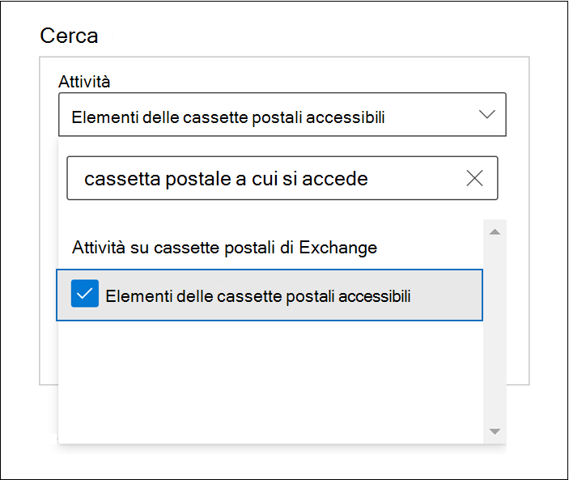
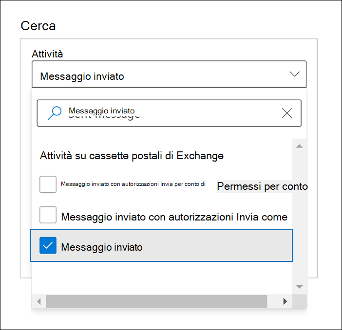
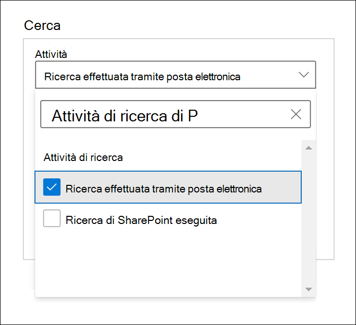
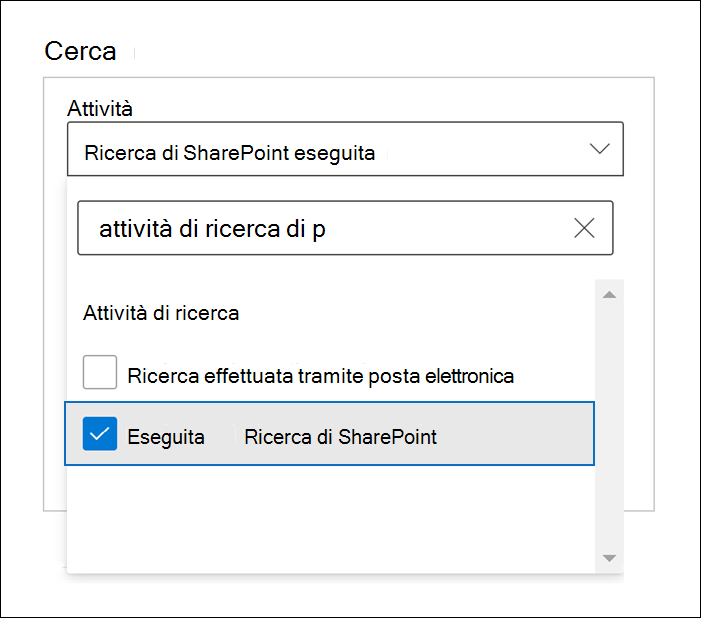

# Audit avanzato in Microsoft 365

La [funzionalità di audit unificato](search-the-audit-log-in-security-and-compliance.md) in Microsoft 365 consente alle organizzazioni di avere visibilità su molti tipi di attività controllate in molti servizi diversi in Microsoft 365. Audit avanzato aiuta le organizzazioni a svolgere indagini forensi e di conformità aumentando il periodo di conservazione dei log di controllo richiesto per condurre un'indagine, fornendo accesso a eventi cruciali che consentono di determinare la portata della violazione e velocizzando l'accesso alla API Office 365 Management Activity.

> [!NOTE]
> Audit avanzato è disponibile per le organizzazioni con un abbonamento a Office 365 E5/G5 o Microsoft 365 Enterprise E5/G5. Inoltre, è possibile assegnare agli utenti una licenza per il componente aggiuntivo Microsoft 365 E5 Compliance o per E5 Discovery and Audit Compliance nei casi in cui sia necessaria una licenza a utente per le funzionalità Audit avanzato, come nel caso di conservazione a lungo termine dei log di controllo e di accesso agli eventi cruciali per le indagini. Per altre informazioni sulle licenze, vedere [Indicazioni sulla gestione delle licenze di Microsoft 365 per la sicurezza e la conformità](https://docs.microsoft.com/office365/servicedescriptions/microsoft-365-service-descriptions/microsoft-365-tenantlevel-services-licensing-guidance/microsoft-365-security-compliance-licensing-guidance#advanced-audit).

Questo articolo fornisce una panoramica delle funzionalità di Audit avanzato e mostra come configurare gli utenti per l'Audit avanzato.

## Conservazione a lungo termine dei log di controllo

Audit avanzato conserva tutti i record di controllo di Exchange, SharePoint e Azure Active Directory per un anno. Questa operazione viene eseguita da un criterio di conservazione predefinito dei log di controllo che conserva per un anno tutti i record di controllo che contengono il valore **Exchange**, **SharePoint** o **AzureActiveDirectory** per la proprietà **Workload**, che indica il servizio in cui si è verificata l'attività. Conservare i record di controllo per periodi più lunghi può essere utile per le indagini forensi o di conformità in corso. Per altre informazioni, vedere la sezione "Criterio di conservazione dei log di controllo predefinito" in [Gestire i criteri di conservazione dei log di controllo](audit-log-retention-policies.md#default-audit-log-retention-policy).

Stiamo anche offrendo la possibilità di conservare i log di controllo per 10 anni. Il periodo di conservazione di 10 anni dei log di controllo consente di supportare le indagini lunghe e rispondere a obblighi normativi, legali e interni.

> [!NOTE]
> La conservazione dei log di controllo per 10 anni richiede una licenza per componenti aggiuntivi.  Questa nuova licenza sarà disponibile all'inizio del 2021. Per altre informazioni, vedere [Domande frequenti su Audit avanzato](#faqs-for-advanced-audit) in questo articolo.

### Criteri di conservazione dei log di controllo

Tutti i record di controllo generati in altri servizi non coperti dai criteri di conservazione dei log di controllo predefiniti descritti nella sezione precedente vengono conservati per 90 giorni. Ma è possibile creare criteri di conservazione dei log di controllo personalizzati per conservare altri record di controllo per periodi più lunghi, fino a 10 anni. Si può creare un criterio per conservare i record di controllo in base a uno o più dei seguenti criteri:

- Il servizio Microsoft 365 in cui si sono verificate le attività controllate.

- Le specifiche attività controllate.

- L'utente che esegue un'attività controllata.

È anche possibile specificare per quanto tempo conservare i record di controllo che soddisfano i criteri e un livello di priorità, affinché determinati criteri abbiano priorità su altri. Si noti inoltre che i criteri di conservazione dei log di controllo personalizzati hanno la precedenza sui criteri di conservazione predefiniti in caso sia necessario conservare i record di controllo di Exchange, SharePoint o Azure Active Directory per meno di un anno (o per 10 anni) per alcuni o tutti gli utenti dell'organizzazione. Per altre informazioni, vedere [Gestire i criteri di conservazione dei log di controllo](audit-log-retention-policies.md).

## Accesso agli eventi cruciali per le indagini

Audit avanzato aiuta le organizzazioni a svolgere indagini forensi o di conformità fornendo accesso a eventi cruciali, come quando l'utente accede agli elementi della posta elettronica, invia risposte per essi o li inoltra, e quando e cosa gli utenti hanno cercato in Exchange Online e SharePoint Online. Questi eventi cruciali consentono di indagare sulle possibili violazioni e stabilire la portata della compromissione.  Audit avanzato fornisce i seguenti eventi cruciali:

- [MailItemsAccessed](#mailitemsaccessed)

- [Send](#send)

- [SearchQueryInitiatedExchange](#searchqueryinitiatedexchange)

- [SearchQueryInitiatedSharePoint](#searchqueryinitiatedsharepoint)

### MailItemsAccessed

L'evento MailItemsAccessed è un azione di controllo delle cassette postali, ed è attivato quando i protocolli o i client di posta elettronica accedono ai dati della posta elettronica. L'azione MailItemsAccessed può aiutare gli investigatori a identificare violazioni dei dati e a determinare l'ambito dei messaggi che potrebbero essere stati compromessi. Se un utente malintenzionato ha ottenuto l'accesso alle e-mail, viene attivata l'azione MailItemsAccessed anche in assenza di segnale esplicito che indichi la lettura dei messaggi; in altri termini, nel record di controllo viene registrato il tipo di accesso, ad esempio un'associazione o sincronizzazione.

L'azione MailItemsAccessed per le cassette postali sostituisce MessageBind nella registrazione di controllo delle cassette postali in Exchange Online, e offre i miglioramenti seguenti:

- MessageBind era configurabile solo per il tipo di accesso utente AuditAdmin; non si applicava alle azioni delegate o proprietarie. MailItemsAccessed si applica a tutti i tipi di accesso.

- MessageBind copriva solo l'accesso da parte di un client di posta elettronica. Non si applicava alle attività di sincronizzazione. Gli eventi di MailItemsAccessed vengono generati dai tipi di accesso di associazione e sincronizzazione.

- Le azioni MessageBind attivavano la creazione di più record di controllo al momento dell'accesso alla stessa e-mail, con conseguente "rumore" di controllo. Gli eventi MailItemsAccessed, invece, sono aggregati in un numero minore di record di controllo.

Per informazioni sui record di controllo per le attività di MailItemsAccessed, vedere [Usare l’Audit avanzato per individuare gli account compromessi](mailitemsaccessed-forensics-investigations.md).

Per cercare i record di controllo MailItemsAccessed, è possibile cercare l'attività **Elementi delle cassette postali accessibili** nell'elenco a discesa **Attività su cassette postali di Exchange** nello [strumento Ricerca log di audit](search-the-audit-log-in-security-and-compliance.md) nel Centro conformità Microsoft 365.

È anche possibile eseguire i comandi [Search-UnifiedAuditLog -Operations MailItemsAccessed](https://docs.microsoft.com/powershell/module/exchange/search-unifiedauditlog) o [Search-MailboxAuditLog -Operations MailItemsAccessed](https://docs.microsoft.com/powershell/module/exchange/search-mailboxauditlog) in PowerShell per Exchange Online.

### Send

Anche l'evento send è un'azione di controllo delle cassette postali, ed è avviato quando l'utente esegue una di queste azioni:

- Inviare un messaggio di posta elettronica

- Rispondere a un messaggio di posta elettronica

- Inoltrare un messaggio di posta elettronica

Gli investigatori possono usare l'evento Send per identificare i messaggi di posta elettronica inviati da account compromessi. Il record di controllo dell'evento Send contiene informazioni sul messaggio, come l'orario di invio del messaggio, l'ID InternetMessage, l'oggetto del messaggio e se il messaggio conteneva allegati. Queste informazioni di controllo possono aiutare gli investigatori a identificare informazioni sui messaggi di posta elettronica inviati da account compromessi o da utenti malintenzionati. Inoltre, gli investigatori possono usare lo strumento di eDiscovery di Microsoft 365 per cercare il messaggio (usando l'oggetto o l'ID del messaggio) per identificazione i destinatari a cui è stato inviato, e il contenuto effettivo del messaggio inviato.

Per cercare i record di controllo dell'evento Send, cercare l'attività **Messaggi inviati** nell'elenco a discesa **Attività su cassette postali di Exchange** nello [Strumento di ricerca dei log di controllo](search-the-audit-log-in-security-and-compliance.md) del Centro conformità Microsoft 365.

È anche possibile eseguire i comandi [Search-UnifiedAuditLog -Operations Send](https://docs.microsoft.com/powershell/module/exchange/search-unifiedauditlog) o [Search-MailboxAuditLog -Operations Send](https://docs.microsoft.com/powershell/module/exchange/search-mailboxauditlog) in PowerShell per Exchange Online.

### SearchQueryInitiatedExchange

L'evento SearchQueryInitiatedExchange viene attivato quando un utente usa Outlook per cercare gli elementi di una cassetta postale. Gli eventi vengono attivati quando vengono eseguite ricerche nei seguenti ambienti di Outlook:

- Outlook (client desktop)

- Outlook sul Web (OWA)

- Outlook per iOS

- Outlook per Android

- App Posta per Windows 10

Gli investigatori possono usare l'evento SearchQueryInitiatedExchange per determinare se un utente malintenzionato può aver compromesso un account cercato, oppure aver tentato di accedere alle informazioni sensibili della cassetta postale. Il record di controllo per un evento SearchQueryInitiatedExchange contiene informazioni come il testo effettivo della query di ricerca. Il record di controllo indica anche l'ambiente di Outlook in cui è stata eseguita la ricerca. Esaminando le ricerche che possono essere state eseguite dagli utenti malintenzionati, gli investigatori possono comprendere meglio la finalità dei dati della posta elettronica che sono stati cercati.

Per cercare i record di controllo dell'evento SearchQueryInitiatedExchange, cercare l'attività **Ricerche email eseguite** nell'elenco a discesa **Attività di ricerca** nello [Strumento di ricerca dei log di controllo](search-the-audit-log-in-security-and-compliance.md) del Centro conformità.

È anche possibile eseguire [Search-UnifiedAuditLog -Operations SearchQueryInitiatedExchange](https://docs.microsoft.com/powershell/module/exchange/search-unifiedauditlog) in PowerShell per Exchange Online.

> [!NOTE]
> Bisogna eseguire questo comando in PowerShell per Exchange Online, in modo che gli eventi SearchQueryInitiatedExchange (eseguiti dallo specifico utente E5) siano inclusi nei risultati della ricerca dei log di controllo: `Set-Mailbox <user identity> -AuditOwner @{Add="SearchQueryInitiated"}`.  
In un ambiente multi-geografico, è necessario eseguire il comando **Set-Mailbox** nella foresta di domini in cui si trova la cassetta postale dell'utente. Per identificare la posizione della cassetta postale dell'utente, eseguire il comando seguente: `Get-Mailbox <user identity> | FL MailboxLocations`.
Se il comando `Set-Mailbox -AuditOwner @{Add="SearchQueryInitiated"}` è stato eseguito in precedenza in una foresta diversa da quella della cassetta postale dell'utente, è necessario rimuovere il valore SearchQueryInitiated dalla cassetta postale, eseguendo `Set-Mailbox -AuditOwner @{Remove="SearchQueryInitiated"}`, e quindi aggiungerlo alla cassetta postale nella foresta in cui si trova la cassetta postale dell’utente.

### SearchQueryInitiatedSharePoint

Analogamente agli elementi della cassetta postale, l'evento SearchQueryInitiatedSharePoint viene attivato quando un utente cerca degli elementi in SharePoint. Gli eventi vengono attivati quando vengono eseguite ricerche nei seguenti tipi di siti di SharePoint:

- Siti Home

- Siti di comunicazione

- Siti hub

- Siti associati a Microsoft Teams

Gli investigatori possono usare l'evento SearchQueryInitiatedSharePoint per stabilire se un utente malintenzionato ha tentato di trovare e potenzialmente accedere a informazioni sensibili in SharePoint. Il record di controllo per un evento SearchQueryInitiatedSharePoint contiene anche il testo effettivo della query di ricerca. Il record di controllo indica anche il tipo di sito di SharePoint in cui è stata cercata. Esaminando le ricerche che possono essere state eseguite dagli utenti malintenzionati, gli investigatori possono comprendere meglio la finalità e la portata dei dati dei file che sono stati cercati.

Per cercare i record di controllo dell'evento SearchQueryInitiatedSharePoint, cercare l'attività **Ricerche di SharePoint eseguite** nell'elenco a discesa **Attività di ricerca** nello [Strumento di ricerca dei log di controllo](search-the-audit-log-in-security-and-compliance.md) del Centro conformità.

È anche possibile eseguire [Search-UnifiedAuditLog -Operations SearchQueryInitiatedSharePoint](https://docs.microsoft.com/powershell/module/exchange/search-unifiedauditlog) in PowerShell per Exchange Online.

> [!NOTE]
> Bisogna eseguire questo comando in PowerShell per Exchange Online, in modo che gli eventi SearchQueryInitiatedExchange (eseguiti dallo specifico utente E5) siano inclusi nei risultati della ricerca dei log di controllo: `Set-Mailbox <user identity> -AuditOwner @{Add="SearchQueryInitiated"}`.  
In un ambiente multi-geografico, è necessario eseguire il comando **Set-Mailbox** nella foresta di domini in cui si trova la cassetta postale dell'utente. Per identificare la posizione della cassetta postale dell'utente, eseguire il comando seguente: `Get-Mailbox <user identity> | FL MailboxLocations`.
Se il comando `Set-Mailbox -AuditOwner @{Add="SearchQueryInitiated"}` è stato eseguito in precedenza in una foresta diversa da quella della cassetta postale dell'utente, è necessario rimuovere il valore SearchQueryInitiated dalla cassetta postale, eseguendo `Set-Mailbox -AuditOwner @{Remove="SearchQueryInitiated"}`, e quindi aggiungerlo alla cassetta postale nella foresta in cui si trova la cassetta postale dell’utente.

## Accesso a larghezza di banda elevata all'API Office 365 Management Activity

Le organizzazioni che accedono ai log di controllo con l'API Office 365 Management Activity erano vincolate da limitazioni a livello di publisher. Questo significa che per un publisher che estrae dati per conto di più clienti, il limite era condiviso da tutti i clienti.

Con il rilascio di Audit avanzato, si passa da un limite a livello di publisher a un limite a livello di tenant. Il risultato è che ogni organizzazione otterrà una quota di larghezza di banda completamente allocata per accedere ai dati di controllo. La larghezza di banda non è un limite predefinito statico, ma è modellata in base a una combinazione di fattori, tra cui il numero di postazioni nell'organizzazione e il fatto che le organizzazioni E5 otterranno una larghezza di banda maggiore rispetto alle organizzazioni non E5.

A tutte le organizzazioni viene inizialmente assegnata una baseline di 2.000 richieste al minuto. Questo limite verrà incrementato in modo dinamico in base al numero di postazioni di un'organizzazione e all'abbonamento di licenza. Le organizzazioni E5 otterranno circa il doppio della larghezza di banda delle organizzazioni non E5. Sarà anche previsto un tetto per la larghezza di banda massima per proteggere l'integrità del servizio.

Per altre informazioni, vedere la sezione dedicata alla limitazione dell'API nell'argomento di [riferimento all'API Office 365 Management Activity](https://docs.microsoft.com/office/office-365-management-api/office-365-management-activity-api-reference#api-throttling).

## Configurare Audit avanzato per gli utenti

Le funzionalità di Audit avanzato, come la possibilità di registrare eventi cruciali come MailItemsAccessed e Send, richiedono una licenza E5 appropriata assegnata agli utenti. Inoltre, è necessario che per tali utenti siano abilitati l'app Controllo avanzato e/o il piano di servizio. Per verificare che l'app Controllo avanzato sia assegnata agli utenti, eseguire la procedura seguente per ogni utente:

1. Nell'[interfaccia di amministrazione di Microsoft 365](https://admin.microsoft.com/Adminportal) passare a **Utenti** > **Utenti attivi** e selezionare un utente.

2. Nel riquadro a comparsa delle proprietà utente fare clic su **Licenze e app**.

3. Nella sezione **Licenze** verificare che all'utente sia assegnata una licenza E5.

4. Espandere la sezione **App** e verificare che la casella di controllo **Controllo avanzato Microsoft 365** sia selezionata.

5. Se la casella di controllo non è selezionata, selezionarla e quindi fare clic su **Salva modifiche.**

   La registrazione dei record di controllo per MailItemsAccessed, Send e altri eventi cruciali per l'utente inizierà entro 24 ore.

Per le organizzazioni che assegnano licenze ai gruppi di utenti usando le licenze basate su gruppi, è necessario disabilitare l'assegnazione delle licenze per il controllo avanzato di Microsoft 365 per il gruppo. Dopo aver salvato le modifiche, verificare che il controllo avanzato di Microsoft 365 sia disabilitato per il gruppo. Quindi, riabilitare l'assegnazione delle licenze per il gruppo. Per istruzioni sulle licenze basate su gruppi, vedere [Assegnare licenze agli utenti in base all'appartenenza ai gruppi in Azure Active Directory](https://docs.microsoft.com/azure/active-directory/users-groups-roles/licensing-groups-assign).

Inoltre, se sono state personalizzate le azioni della cassetta postale registrate nelle cassette postali degli utenti o nelle cassette postali condivise, le nuove azioni predefinite della cassetta postale, come MailItemsAccessed, non verranno controllate automaticamente in tali cassette postali. Per informazioni sulla modifica delle azioni della cassetta postale controllate per ogni tipo di accesso, vedere la sezione "Modificare o ripristinare le azioni della cassetta postale registrate per impostazione predefinita" in [Gestire il controllo delle cassette postali](enable-mailbox-auditing.md#change-or-restore-mailbox-actions-logged-by-default).

## Domande frequenti su Audit avanzato

**Ogni utente deve avere una licenza E5 per usufruire di Audit avanzato?**

Un utente deve essere assegnato a una licenza E5 per usufruire delle funzionalità di Audit avanzato a livello utente. Sono presenti alcune funzionalità che verificano la disponibilità della licenza appropriata per fornire la funzionalità all'utente. Ad esempio, se si sta provando a conservare i record di controllo di un utente a cui non è stata assegnata una licenza E5 per più di 90 giorni, il sistema restituirà un messaggio di errore.

**Se l'organizzazione ha un abbonamento a E5, in che modo è possibile ottenere l'accesso ai record di controllo per gli eventi più importanti?**

Per i clienti idonei e gli utenti a cui è assegnata la licenza appropriata, non ci sono azioni da intraprendere per accedere agli eventi di controllo cruciali.

**Quando sarà disponibile il componente aggiuntivo per la conservazione dei log di controllo per 10 anni?**

Il nuovo componente aggiuntivo per la conservazione dei log di controllo per 10 anni è ora disponibile per l’acquisto per i clienti con abbonamento E5.

**Che cosa succede ai log di controllo della mia organizzazione se creo un criterio di conservazione dei log di controllo per 10 anni quando la funzionalità viene rilasciata al pubblico, ma prima che la licenza necessaria per il componente aggiuntivo sia resa disponibile a febbraio 2021?**

Qualsiasi dato dei log di controllo coperto da un criterio di conservazione per 10 anni creato dopo che il componente sarà reso disponibile sarà conservato per 10 anni. Se la licenza per il componente aggiuntivo di conservazione del log di controllo per 10 anni sarà disponibile all'inizio del 2021, l'utente dovrà acquistare le licenze del componente aggiuntivo per gli utenti i cui dati di controllo vengono conservati ai sensi di un criterio di conservazione da 10 anni già esistente.

**I nuovi eventi di Audit avanzato sono disponibili nell'API Office 365 Management Activity?**

Sì. Finché verranno generati record di controllo per gli utenti in possesso della licenza appropriata, sarà possibile accedere a tali record tramite l'API Office 365 Management Activity.

**Una larghezza di banda superiore comporta una latenza o un contratto di servizio migliore?**

Al momento, una larghezza di banda superiore garantisce una pipeline migliore, soprattutto per le organizzazioni con un volume elevato di segnali di controllo e modelli di consumo significativi. Una larghezza di banda superiore può migliorare la latenza. Ma non esiste un contratto di servizio associato a una larghezza di banda superiore. Le latenze standard sono documentate e non subiscono modifiche con il rilascio di Audit avanzato.
