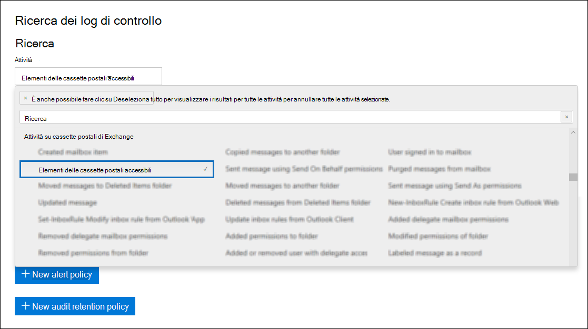

# Audit avanzato in Microsoft 365

La [funzionalità di audit unificato](search-the-audit-log-in-security-and-compliance.md) in Microsoft 365 consente alle organizzazioni di avere visibilità su molti tipi di attività controllate in molti servizi diversi in Microsoft 365. Con il rilascio di Audit avanzato in Microsoft 365 sono state aggiunte nuove funzionalità di audit per aiutare l'organizzazione nelle indagini forensi e di conformità.

> [!NOTE]
> Audit avanzato è disponibile per le organizzazioni con un abbonamento a Office 365 E5 o Microsoft 365 Enterprise E5. Inoltre, è possibile assegnare agli utenti una licenza per il componente aggiuntivo Microsoft 365 E5 Compliance nei casi in cui sia necessaria una licenza a utente per le funzionalità Audit avanzato, come nel caso di conservazione a lungo termine dei log di controllo e di accesso agli eventi cruciali per le indagini.

Questo articolo offre una panoramica delle funzionalità di Audit avanzato.

## Conservazione a lungo termine dei log di controllo

Audit avanzato conserva tutti i record di controllo di Exchange, SharePoint e Azure Active Directory per un anno. Questa operazione viene eseguita da un criterio di conservazione predefinito dei log di controllo che conserva per un anno tutti i record di controllo che contengono il valore **Exchange**, **SharePoint** o **AzureActiveDirectory** per la proprietà **Workload**, che indica il servizio in cui si è verificata l'attività. Questo può essere utile nell'ambito delle indagini forensi o di conformità in corso. Per altre informazioni, vedere la sezione "Criterio di conservazione dei log di controllo predefinito" in [Gestire i criteri di conservazione dei log di controllo](audit-log-retention-policies.md#default-audit-log-retention-policy).

## Criteri di conservazione dei log di controllo

Tutti i record di controllo generati in altri servizi non coperti dai criteri di conservazione dei log di controllo predefiniti descritti nella sezione precedente vengono conservati per 90 giorni. Ora, però, è possibile creare criteri di conservazione dei log di controllo personalizzati per conservare altri record di controllo per un massimo di un anno. Si può creare un criterio per conservare i record di controllo in base a uno o più dei seguenti criteri:

- Il servizio Microsoft 365 in cui si sono verificate le attività controllate

- Attività controllate specifiche

- Utente che esegue un'attività controllata

È anche possibile specificare per quanto tempo conservare i record di controllo che soddisfano i criteri e un livello di priorità, affinché determinati criteri abbiano priorità su altri. Si noti inoltre che i criteri di conservazione dei log di controllo personalizzati hanno la precedenza sui criteri di conservazione predefiniti in caso sia necessario conservare i record di controllo di Exchange, SharePoint o Azure Active Directory per meno di un anno per alcuni o tutti gli utenti dell'organizzazione. Per altre informazioni, vedere [Gestire i criteri di conservazione dei log di controllo](audit-log-retention-policies.md).

## Accesso agli eventi cruciali per le indagini

Gli eventi di controllo cruciali a livello di sicurezza e conformità sono quelli che consentono di indagare su possibili violazioni o eseguire altre indagini di tipo forense. Il primo evento di questo tipo rilasciato è l'azione di controllo delle cassette postali *MailItemsAccessed*. Questa azione si attiva quando viene eseguito l'accesso ai dati di posta elettronica da protocolli e client di posta elettronica. L'azione MailItemsAccessed può aiutare gli investigatori a identificare violazioni dei dati e a determinare l'ambito dei messaggi che potrebbero essere stati compromessi. Se un utente malintenzionato ha ottenuto l'accesso alle e-mail, viene attivata l'azione MailItemsAccessed anche in assenza di segnale esplicito che indichi la lettura dei messaggi; in altri termini, nel record di controllo viene registrato il tipo di accesso, ad esempio un'associazione o sincronizzazione.

La nuova azione MailItemsAccessed per le cassette postali sostituisce MessageBind nella registrazione di controllo delle cassette postali in Exchange Online e offre i miglioramenti seguenti:

- MessageBind era configurabile solo per il tipo di accesso utente AuditAdmin; non si applicava alle azioni delegate o proprietarie. MailItemsAccessed si applica a tutti i tipi di accesso.

- MessageBind copriva solo l'accesso da parte di un client di posta elettronica. Non si applicava alle attività di sincronizzazione. Gli eventi di MailItemsAccessed vengono generati dai tipi di accesso di associazione e sincronizzazione.

- Le azioni MessageBind attivavano la creazione di più record di controllo al momento dell'accesso alla stessa e-mail, con conseguente "rumore" di controllo. Gli eventi MailItemsAccessed, invece, sono aggregati in un numero minore di record di controllo.

Per informazioni sui record di controllo per le attività di MailItemsAccessed, vedere [Usare l’Audit avanzato per individuare gli account compromessi](mailitemsaccessed-forensics-investigations.md).

### Ricerca dei record di controllo MailItemsAccessed

Per cercare i record di controllo MailItemsAccessed, è possibile cercare l'attività **Elementi delle cassette postali accessibili** nell'elenco a discesa **Attività su cassette postali di Exchange** nello [strumento Ricerca log di audit](search-the-audit-log-in-security-and-compliance.md) nel Centro sicurezza e conformità di Office 365.

È anche possibile eseguire i comandi [Search-UnifiedAuditLog -Operations MailItemsAccessed](https://docs.microsoft.com/powershell/module/exchange/policy-and-compliance-audit/search-unifiedauditlog) o [Search-MailboxAuditLog -Operations MailItemsAccessed](https://docs.microsoft.com/powershell/module/exchange/policy-and-compliance-audit/search-mailboxauditlog) in PowerShell per Exchange Online.

## Accesso a larghezza di banda elevata all'API Office 365 Management Activity

Le organizzazioni che accedono ai log di controllo con l'API Office 365 Management Activity erano vincolate da limitazioni a livello di publisher. Questo significa che per un publisher che estrae dati per conto di più clienti, il limite era condiviso da tutti i clienti.

Con il rilascio di Audit avanzato, si passa da un limite a livello di publisher a un limite a livello di tenant. Il risultato è che ogni organizzazione otterrà una quota di larghezza di banda completamente allocata per accedere ai dati di controllo. La larghezza di banda non è un limite predefinito statico, ma è modellata in base a una combinazione di fattori, tra cui il numero di postazioni nell'organizzazione e il fatto che le organizzazioni E5 otterranno una larghezza di banda maggiore rispetto alle organizzazioni non E5.

A tutte le organizzazioni viene inizialmente assegnata una baseline di 2.000 richieste al minuto. Questo limite verrà incrementato in modo dinamico in base al numero di postazioni di un'organizzazione e all'abbonamento di licenza. Le organizzazioni E5 otterranno approssimativamente il doppio della larghezza di banda delle organizzazioni non E5. Sarà anche previsto un tetto per la larghezza di banda massima per proteggere l'integrità del servizio.

Per altre informazioni, vedere la sezione dedicata alla limitazione dell'API nell'argomento di [riferimento all'API Office 365 Management Activity](https://docs.microsoft.com/office/office-365-management-api/office-365-management-activity-api-reference#api-throttling).

## Domande frequenti su Audit avanzato

**Dove è possibile accedere ad Audit avanzato?**

Dopo aver distribuito Audit avanzato nell'organizzazione, è possibile creare criteri di conservazione dei log di controllo e cercare i record di controllo MailItemsAccessed tramite lo strumento Ricerca log di audit nel [Centro sicurezza e conformità di Office 365](https://protection.office.com). I lavori per implementare Audit avanzato nel [Centro conformità Microsoft 365](https://compliance.microsoft.com) nelle prossime settimane sono in corso.

**Ogni utente deve avere una licenza E5 per usufruire di Audit avanzato?**

Un utente deve essere assegnato a una licenza E5 per usufruire delle funzionalità di Audit avanzato a livello utente. Sono presenti alcune funzionalità che verificano la disponibilità della licenza appropriata per fornire la funzionalità all'utente. Ad esempio, se si sta provando a conservare i record di controllo di un utente a cui non è stata assegnata una licenza E5 per più di 90 giorni, il sistema restituirà un messaggio di errore.

**Perché Audit avanzato non viene mostrato nell'organizzazione, nonostante si disponga di un abbonamento a E5 e siano presenti utenti con licenze E5 assegnate?**

È possibile che le funzionalità di Audit avanzato (ad esempio la possibilità di creare i criteri di conservazione dei log di controllo e la registrazione dei record di controllo MailItemsAccessed) non siano disponibili nell'organizzazione, nonostante si dispongano delle licenze corrette. In caso si verifichi, è possibile che il pacchetto di Audit avanzato non sia stato ancora distribuito nell'organizzazione. Si tratta di un problema temporaneo di recupero delle informazioni delle licenze, che dovrebbe venire risolto per le organizzazioni interessate nelle prossime settimane. Per ovviare a tale problema, eseguire la procedura seguente per ogni utente E5:

1. Nell'interfaccia di amministrazione di Microsoft 365, passare a **Utenti > Utenti attivi** e quindi selezionare un utente.

2. Nel riquadro a comparsa delle proprietà utente, fare clic su **Licenze e app**.

3. Espandere la sezione **App** ed eseguire una delle operazioni seguenti:

   a. Se la casella di controllo **Controllo avanzato Microsoft 365** non è selezionata, selezionarla e quindi fare clic su **Salva modifiche.** I record di controllo delle azioni MailItemsAccessed per l'utente dovrebbero diventare disponibili per la ricerca entro 24 ore.

   b. Se la casella di controllo **Controllo avanzato Microsoft 365** è selezionata, deselezionarla e quindi fare clic su **Salva modifiche.** Vedere il passaggio 4.

4. Se al passaggio 3 è stata deselezionata la casella di controllo, attendere 60 minuti e quindi ripetere il passaggio 3a per abilitare l'app Controllo avanzato Microsoft 365.

**Cosa succede se l'organizzazione era in anteprima privata per la conservazione annuale dei record di controllo?**

I criteri di conservazione dei log di controllo del programma di anteprima verranno mantenuti finché non verranno sostituiti e modificati con criteri di conservazione dei log di controllo personalizzati.

**È possibile per l'organizzazione conservare i log di controllo per più di un anno?**

Si stanno esplorando opzioni per rendere disponibili periodi di conservazione dei record di controllo più lunghi. È possibile fornire feedback al riguardo sulla piattaforma [UserVoice per Office 365](https://office365.uservoice.com/forums/289138-office-365-security-compliance?category_id=137187).

**Se l'organizzazione ha un abbonamento a E5, in che modo è possibile ottenere l'accesso ai record di controllo per gli eventi MailItemsAccessed?**

Per i clienti idonei, non è necessario svolgere alcuna azione per ottenere l'accesso agli eventi MailItemsAccessed. Tuttavia, come indicato in precedenza, la latenza causata dal problema di recupero delle informazioni delle licenze potrebbe impedire ai record di controllo dell'evento MailItemsAccessed di apparire in una ricerca log di audit. In tal caso, seguire le istruzioni presenti nella sezione Ricerca dei record di controllo MailItemsAccessed.

**È previsto il rilascio di altri eventi quest'anno?**

Sì, è in programma nei prossimi mesi il rilascio di nuovi eventi cruciali per le indagini. Le informazioni su questi nuovi eventi verranno pubblicate nella [Roadmap di Microsoft 365](https://www.microsoft.com/microsoft-365/roadmap) in prossimità della data di rilascio.

**I nuovi eventi di Audit avanzato sono disponibili nell'API Office 365 Management Activity?**

Sì. Finché verranno generati record di controllo per gli utenti in possesso della licenza appropriata, sarà possibile accedere a tali record tramite l'API Office 365 Management Activity.

**Una larghezza di banda superiore comporta una latenza o un contratto di servizio migliore?**

Al momento, una larghezza di banda superiore garantisce una pipeline migliore, soprattutto per le organizzazioni con un volume elevato di segnali di controllo e modelli di consumo significativi. Ciò può comportare una latenza migliore, ma non esiste un contratto di servizio associato a una larghezza di banda superiore. Le latenze standard sono documentate e non subiscono modifiche con il rilascio di Audit avanzato.
