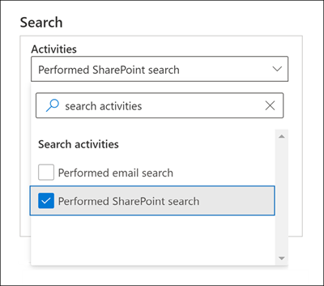

# Audit avanzato in Microsoft 365Advanced Audit in Microsoft 365

La [funzionalità di audit unificato](search-the-audit-log-in-security-and-compliance.md) in Microsoft 365 consente alle organizzazioni di avere visibilità su molti tipi di attività controllate in molti servizi diversi in Microsoft 365.The [unified auditing functionality](search-the-audit-log-in-security-and-compliance.md) in Microsoft 365 provides organizations with visibility into many types of audited activities across many different services in Microsoft 365. Audit avanzato aiuta le organizzazioni a svolgere indagini forensi e di conformità aumentando il periodo di conservazione dei log di controllo richiesto per condurre un'indagine, fornendo accesso a eventi cruciali che consentono di determinare la portata della violazione e velocizzando l'accesso alla API Office 365 Management Activity.Advanced Audit helps organizations to conduct forensic and compliance investigations by increasing audit log retention required to conduct an investigation, providing access to crucial events that help determine scope of compromise, and faster access to Office 365 Management Activity API.

> [!NOTE]
> Audit avanzato è disponibile per le organizzazioni con un abbonamento a Office 365 E5/G5 o Microsoft 365 Enterprise E5/G5.Advanced Audit is available for organizations with an Office 365 E5/G5 or Microsoft 365 Enterprise E5/G5 subscription. Inoltre, è possibile assegnare agli utenti una licenza per il componente aggiuntivo Microsoft 365 E5 Compliance o per E5 Discovery and Audit Compliance nei casi in cui sia necessaria una licenza a utente per le funzionalità Audit avanzato, come nel caso di conservazione a lungo termine dei log di controllo e di accesso agli eventi cruciali per le indagini.Additionally, a Microsoft 365 E5 Compliance or E5 eDiscovery and Audit add-on license can be assigned to users when per-user licensing is required for Advanced Audit features as is the case for long-term retention of audit logs and access to crucial events for investigations. Per altre informazioni sulle licenze, vedere [Indicazioni sulla gestione delle licenze di Microsoft 365 per la sicurezza e la conformità](https://docs.microsoft.com/office365/servicedescriptions/microsoft-365-service-descriptions/microsoft-365-tenantlevel-services-licensing-guidance/microsoft-365-security-compliance-licensing-guidance#advanced-audit).For more information about licensing, see [Microsoft 365 licensing guidance for security & compliance](https://docs.microsoft.com/office365/servicedescriptions/microsoft-365-service-descriptions/microsoft-365-tenantlevel-services-licensing-guidance/microsoft-365-security-compliance-licensing-guidance#advanced-audit).

Questo articolo fornisce una panoramica delle funzionalità di Audit avanzato e mostra come configurare gli utenti per l'Audit avanzato.This article provides an overview of Advanced Audit capabilities and shows you how to set up users for Advanced Audit.

## Conservazione a lungo termine dei log di controlloLong-term retention of audit logs

Audit avanzato conserva tutti i record di controllo di Exchange, SharePoint e Azure Active Directory per un anno.Advanced Audit retains all Exchange, SharePoint, and Azure Active Directory audit records for one year. Questa operazione viene eseguita da un criterio di conservazione predefinito dei log di controllo che conserva per un anno tutti i record di controllo che contengono il valore **Exchange**, **SharePoint** o **AzureActiveDirectory** per la proprietà **Workload**, che indica il servizio in cui si è verificata l'attività.This is accomplished by a default audit log retention policy that retains any audit record that contains the value of **Exchange**, **SharePoint**, or **AzureActiveDirectory** for the **Workload** property (which indicates the service in which the activity occurred) for one year. Conservare i record di controllo per periodi più lunghi può essere utile per le indagini forensi o di conformità in corso.Retaining audit records for longer periods can help with on-going forensic or compliance investigations. Per altre informazioni, vedere la sezione "Criterio di conservazione dei log di controllo predefinito" in [Gestire i criteri di conservazione dei log di controllo](audit-log-retention-policies.md#default-audit-log-retention-policy).For more information, see the "Default audit log retention policy" section in [Manage audit log retention policies](audit-log-retention-policies.md#default-audit-log-retention-policy).

Stiamo anche offrendo la possibilità di conservare i log di controllo per 10 anni.We're also releasing the capability to retain audit logs for 10 years. Il periodo di conservazione di 10 anni dei log di controllo consente di supportare le indagini lunghe e rispondere a obblighi normativi, legali e interni.The 10-year retention of audit logs helps support long running investigations and respond to regulatory, legal, and internal obligations.

> [!NOTE]
> La conservazione dei log di controllo per 10 anni richiede una licenza per componenti aggiuntivi. Retaining audit logs for 10 years will require an additional add-on license. Questa nuova licenza sarà disponibile all'inizio del 2021.This new license will be available in early 2021. Per altre informazioni, vedere [Domande frequenti su Audit avanzato](#faqs-for-advanced-audit) in questo articolo.For more information, see the [FAQs for Advanced Audit](#faqs-for-advanced-audit) section in this article.

### Criteri di conservazione dei log di controlloAudit log retention policies

Tutti i record di controllo generati in altri servizi non coperti dai criteri di conservazione dei log di controllo predefiniti descritti nella sezione precedente vengono conservati per 90 giorni.All audit records generated in other services that aren't covered by the default audit log retention policy (described in the previous section) are retained for 90 days. Ma è possibile creare criteri di conservazione dei log di controllo personalizzati per conservare altri record di controllo per periodi più lunghi, fino a 10 anni.But you can create customized audit log retention policies to retain other audit records for longer periods of time up to 10 years. Si può creare un criterio per conservare i record di controllo in base a uno o più dei seguenti criteri:You can create a policy to retain audit records based on one or more of the following criteria:

- Il servizio Microsoft 365 in cui si sono verificate le attività controllate.The Microsoft 365 service where the audited activities occur.

- Le specifiche attività controllate.Specific audited activities.

- L'utente che esegue un'attività controllata.The user who performs an audited activity.

È anche possibile specificare per quanto tempo conservare i record di controllo che soddisfano i criteri e un livello di priorità, affinché determinati criteri abbiano priorità su altri.You can also specify how long to retain audit records that match the policy and a priority level so that specific policies will take priority over other policies. Si noti inoltre che i criteri di conservazione dei log di controllo personalizzati hanno la precedenza sui criteri di conservazione predefiniti in caso sia necessario conservare i record di controllo di Exchange, SharePoint o Azure Active Directory per meno di un anno (o per 10 anni) per alcuni o tutti gli utenti dell'organizzazione.Also note that any custom audit log retention policy will take precedence over the default audit retention policy in case you need retain Exchange, SharePoint, or Azure Active Directory audit records for less than a year (or for 10 years) for some or all users in your organization. Per altre informazioni, vedere [Gestire i criteri di conservazione dei log di controllo](audit-log-retention-policies.md).For more information, see [Manage audit log retention policies](audit-log-retention-policies.md).

## Accesso agli eventi cruciali per le indaginiAccess to crucial events for investigations

Audit avanzato aiuta le organizzazioni a svolgere indagini forensi o di conformità fornendo accesso a eventi cruciali, come quando l'utente accede agli elementi della posta elettronica, invia risposte per essi o li inoltra, e quando e cosa gli utenti hanno cercato in Exchange Online e SharePoint Online.Advanced Audit helps organizations to conduct forensic and compliance investigations by providing access to crucial events such as when mail items were accessed, or when mail items were replied to and forwarded, and when and what a user searched for in Exchange Online and SharePoint Online. Questi eventi cruciali consentono di indagare sulle possibili violazioni e stabilire la portata della compromissione.These crucial events can help you investigate possible breaches and determine the scope of compromise.  Audit avanzato fornisce i seguenti eventi cruciali:Advanced Auditing provides the following crucial events:

- [MailItemsAccessedMailItemsAccessed](#mailitemsaccessed)

- [SendSend](#send)

- [SearchQueryInitiatedExchangeSearchQueryInitiatedExchange](#searchqueryinitiatedexchange)

- [SearchQueryInitiatedSharePointSearchQueryInitiatedSharePoint](#searchqueryinitiatedsharepoint)

### MailItemsAccessedMailItemsAccessed

L'evento MailItemsAccessed è un azione di controllo delle cassette postali, ed è attivato quando i protocolli o i client di posta elettronica accedono ai dati della posta elettronica.The MailItemsAccessed event is a mailbox auditing action and is triggered when mail data is accessed by mail protocols and mail clients. L'azione MailItemsAccessed può aiutare gli investigatori a identificare violazioni dei dati e a determinare l'ambito dei messaggi che potrebbero essere stati compromessi.The MailItemsAccessed action can help investigators identify data breaches and determine the scope of messages that may have been compromised. Se un utente malintenzionato ha ottenuto l'accesso alle e-mail, viene attivata l'azione MailItemsAccessed anche in assenza di segnale esplicito che indichi la lettura dei messaggi; in altri termini, nel record di controllo viene registrato il tipo di accesso, ad esempio un'associazione o sincronizzazione.If an attacker gained access to email messages, the MailItemsAccessed action will be triggered even if there is no explicit signal that messages were actually read (in other words, the type of access such as a bind or sync is recorded in the audit record).

L'azione MailItemsAccessed per le cassette postali sostituisce MessageBind nella registrazione di controllo delle cassette postali in Exchange Online, e offre i miglioramenti seguenti:The MailItemsAccessed mailbox action replaces MessageBind in mailbox auditing logging in Exchange Online and provides these improvements:

- MessageBind era configurabile solo per il tipo di accesso utente AuditAdmin; non si applicava alle azioni delegate o proprietarie.MessageBind was only configurable for AuditAdmin user logon type; it did not apply to delegate or owner actions. MailItemsAccessed si applica a tutti i tipi di accesso.MailItemsAccessed applies to all logon types.

- MessageBind copriva solo l'accesso da parte di un client di posta elettronica.MessageBind only covered access by a mail client. Non si applicava alle attività di sincronizzazione.It didn't apply to sync activities. Gli eventi di MailItemsAccessed vengono generati dai tipi di accesso di associazione e sincronizzazione.MailItemsAccessed events are triggered by both bind and sync access types.

- Le azioni MessageBind attivavano la creazione di più record di controllo al momento dell'accesso alla stessa e-mail, con conseguente "rumore" di controllo.MessageBind actions would trigger the creation of multiple audit records when the same email message was accessed, which resulted in auditing "noise". Gli eventi MailItemsAccessed, invece, sono aggregati in un numero minore di record di controllo.In contrast, MailItemsAccessed events are aggregated into fewer audit records.

Per informazioni sui record di controllo per le attività di MailItemsAccessed, vedere [Usare l’Audit avanzato per individuare gli account compromessi](mailitemsaccessed-forensics-investigations.md).For information about audit records for MailItemsAccessed activities, see [Use Advanced Audit to investigate compromised accounts](mailitemsaccessed-forensics-investigations.md).

Per cercare i record di controllo MailItemsAccessed, è possibile cercare l'attività **Elementi delle cassette postali accessibili** nell'elenco a discesa **Attività su cassette postali di Exchange** nello [strumento Ricerca log di audit](search-the-audit-log-in-security-and-compliance.md) nel Centro conformità Microsoft 365.To search for MailItemsAccessed audit records, you can search for the **Accessed mailbox items** activity in the **Exchange mailbox activities** drop-down list in the [audit log search tool](search-the-audit-log-in-security-and-compliance.md) in the Microsoft 365 compliance center.

È anche possibile eseguire i comandi [Search-UnifiedAuditLog -Operations MailItemsAccessed](https://docs.microsoft.com/powershell/module/exchange/search-unifiedauditlog) o [Search-MailboxAuditLog -Operations MailItemsAccessed](https://docs.microsoft.com/powershell/module/exchange/search-mailboxauditlog) in PowerShell per Exchange Online.You can also run the [Search-UnifiedAuditLog -Operations MailItemsAccessed](https://docs.microsoft.com/powershell/module/exchange/search-unifiedauditlog) or [Search-MailboxAuditLog -Operations MailItemsAccessed](https://docs.microsoft.com/powershell/module/exchange/search-mailboxauditlog) commands in Exchange Online PowerShell.

### SendSend

Anche l'evento send è un'azione di controllo delle cassette postali, ed è avviato quando l'utente esegue una di queste azioni:The Send event is also a mailbox auditing action and is triggered when a user performs one of the following actions:

- Inviare un messaggio di posta elettronicaSends an email message

- Rispondere a un messaggio di posta elettronicaReplies to an email message

- Inoltrare un messaggio di posta elettronicaForwards an email message

Gli investigatori possono usare l'evento Send per identificare i messaggi di posta elettronica inviati da account compromessi.Investigators can use the Send event to identify email sent from a compromised account. Il record di controllo dell'evento Send contiene informazioni sul messaggio, come l'orario di invio del messaggio, l'ID InternetMessage, l'oggetto del messaggio e se il messaggio conteneva allegati.The audit record for a Send event contains information about the message, such as when the message was sent, the InternetMessage ID, the subject line, and if the message contained attachments. Queste informazioni di controllo possono aiutare gli investigatori a identificare informazioni sui messaggi di posta elettronica inviati da account compromessi o da utenti malintenzionati.This auditing information can help investigators identify information about email messages sent from a compromised account or sent by an attacker. Inoltre, gli investigatori possono usare lo strumento di eDiscovery di Microsoft 365 per cercare il messaggio (usando l'oggetto o l'ID del messaggio) per identificazione i destinatari a cui è stato inviato, e il contenuto effettivo del messaggio inviato.Additionally, investigators can use a Microsoft 365 eDiscovery tool to search for the message (by using the subject line or message ID) to identify the recipients the message was sent to and the actual contents of the sent message.

Per cercare i record di controllo dell'evento Send, cercare l'attività **Messaggi inviati** nell'elenco a discesa **Attività su cassette postali di Exchange** nello [Strumento di ricerca dei log di controllo](search-the-audit-log-in-security-and-compliance.md) del Centro conformità Microsoft 365.To search for Send audit records, you can search for the **Sent message** activity in the **Exchange mailbox activities** drop-down list in the [audit log search tool](search-the-audit-log-in-security-and-compliance.md) in the Microsoft 365 compliance center.

È anche possibile eseguire i comandi [Search-UnifiedAuditLog -Operations Send](https://docs.microsoft.com/powershell/module/exchange/search-unifiedauditlog) o [Search-MailboxAuditLog -Operations Send](https://docs.microsoft.com/powershell/module/exchange/search-mailboxauditlog) in PowerShell per Exchange Online.You can also run the [Search-UnifiedAuditLog -Operations Send](https://docs.microsoft.com/powershell/module/exchange/search-unifiedauditlog) or [Search-MailboxAuditLog -Operations Send](https://docs.microsoft.com/powershell/module/exchange/search-mailboxauditlog) commands in Exchange Online PowerShell.

### SearchQueryInitiatedExchangeSearchQueryInitiatedExchange

L'evento SearchQueryInitiatedExchange viene attivato quando un utente usa Outlook per cercare gli elementi di una cassetta postale.The SearchQueryInitiatedExchange event is triggered when a person uses Outlook to search for items in a mailbox. Gli eventi vengono attivati quando vengono eseguite ricerche nei seguenti ambienti di Outlook:Events are triggered when searches are performed in the following Outlook environments:

- Outlook (client desktop)Outlook (desktop client)

- Outlook sul Web (OWA)Outlook on the web (OWA)

- Outlook per iOSOutlook for iOS

- Outlook per AndroidOutlook for Android

- App Posta per Windows 10Mail app for Windows 10

Gli investigatori possono usare l'evento SearchQueryInitiatedExchange per determinare se un utente malintenzionato può aver compromesso un account cercato, oppure aver tentato di accedere alle informazioni sensibili della cassetta postale.Investigators can use the SearchQueryInitiatedExchange event to determine if an attacker who may have compromised an account looked for or tried to access sensitive information in the mailbox. Il record di controllo per un evento SearchQueryInitiatedExchange contiene informazioni come il testo effettivo della query di ricerca.The audit record for a SearchQueryInitiatedExchange event contains information such as the actual text of the search query. Il record di controllo indica anche l'ambiente di Outlook in cui è stata eseguita la ricerca.The audit record also indicates the Outlook environment the search was performed in. Esaminando le ricerche che possono essere state eseguite dagli utenti malintenzionati, gli investigatori possono comprendere meglio la finalità dei dati della posta elettronica che sono stati cercati.By looking at the search queries that an attacker may have performed, an investigator can better understand the intent of the email data that was searched for.

Per cercare i record di controllo dell'evento SearchQueryInitiatedExchange, cercare l'attività **Ricerche email eseguite** nell'elenco a discesa **Attività di ricerca** nello [Strumento di ricerca dei log di controllo](search-the-audit-log-in-security-and-compliance.md) del Centro conformità.To search for SearchQueryInitiatedExchange audit records, you can search for the **Performed email search** activity in the **Search activities** drop-down list in the [audit log search tool](search-the-audit-log-in-security-and-compliance.md) in the compliance center.

È anche possibile eseguire [Search-UnifiedAuditLog -Operations SearchQueryInitiatedExchange](https://docs.microsoft.com/powershell/module/exchange/search-unifiedauditlog) in PowerShell per Exchange Online.You can also run the [Search-UnifiedAuditLog -Operations SearchQueryInitiatedExchange](https://docs.microsoft.com/powershell/module/exchange/search-unifiedauditlog) in Exchange Online PowerShell.

> [!NOTE]
> Bisogna eseguire questo comando in PowerShell per Exchange Online, in modo che gli eventi SearchQueryInitiatedExchange (eseguiti dallo specifico utente E5) siano inclusi nei risultati della ricerca dei log di controllo: `Set-Mailbox <user identity> -AuditOwner @{Add="SearchQueryInitiated"}`.You must run the following command in Exchange Online PowerShell so that SearchQueryInitiatedExchange events (performed by the specified E5 user) are included in audit log search results: `Set-Mailbox <user identity> -AuditOwner @{Add="SearchQueryInitiated"}`.   
In un ambiente multi-geografico, è necessario eseguire il comando **Set-Mailbox** nella foresta di domini in cui si trova la cassetta postale dell'utente.In a multi-geo environment, you must run the **Set-Mailbox** command in the forest where the user's mailbox is located. Per identificare la posizione della cassetta postale dell'utente, eseguire il comando seguente: `Get-Mailbox <user identity> | FL MailboxLocations`.To identify the user's mailbox location, run the following command: `Get-Mailbox <user identity> | FL MailboxLocations`.
Se il comando `Set-Mailbox -AuditOwner @{Add="SearchQueryInitiated"}` è stato eseguito in precedenza in una foresta diversa da quella della cassetta postale dell'utente, è necessario rimuovere il valore SearchQueryInitiated dalla cassetta postale, eseguendo `Set-Mailbox -AuditOwner @{Remove="SearchQueryInitiated"}`, e quindi aggiungerlo alla cassetta postale nella foresta in cui si trova la cassetta postale dell’utente.If the `Set-Mailbox -AuditOwner @{Add="SearchQueryInitiated"}` command was previously run in the forest that's different than the one the user's mailbox is located in, then you must remove the SearchQueryInitiated value from the user's mailbox (by running `Set-Mailbox -AuditOwner @{Remove="SearchQueryInitiated"}`) and then add it to the user's mailbox in the forest where the user's mailbox is located.

### SearchQueryInitiatedSharePointSearchQueryInitiatedSharePoint

Analogamente agli elementi della cassetta postale, l'evento SearchQueryInitiatedSharePoint viene attivato quando un utente cerca degli elementi in SharePoint.Similar to searching for mailbox items, the SearchQueryInitiatedSharePoint event is triggered when a person searches for items in SharePoint. Gli eventi vengono attivati quando vengono eseguite ricerche nei seguenti tipi di siti di SharePoint:Events are triggered when searches are performed in the following types of SharePoint sites:

- Siti HomeHome sites

- Siti di comunicazioneCommunication sites

- Siti hubHub sites

- Siti associati a Microsoft TeamsSites associated with Microsoft Teams

Gli investigatori possono usare l'evento SearchQueryInitiatedSharePoint per stabilire se un utente malintenzionato ha tentato di trovare e potenzialmente accedere a informazioni sensibili in SharePoint.Investigators can use the SearchQueryInitiatedSharePoint event to determine if an attacker tried to find (and possibly accessed) sensitive information in SharePoint. Il record di controllo per un evento SearchQueryInitiatedSharePoint contiene anche il testo effettivo della query di ricerca.The audit record for a SearchQueryInitiatedSharePoint event contains also contains the actual text of the search query. Il record di controllo indica anche il tipo di sito di SharePoint in cui è stata cercata.The audit record also indicates the type of SharePoint site that was searched. Esaminando le ricerche che possono essere state eseguite dagli utenti malintenzionati, gli investigatori possono comprendere meglio la finalità e la portata dei dati dei file che sono stati cercati.By looking at the search queries that an attacker may have performed, an investigator can better understand the intent and scope of the file data being searched for.

Per cercare i record di controllo dell'evento SearchQueryInitiatedSharePoint, cercare l'attività **Ricerche di SharePoint eseguite** nell'elenco a discesa **Attività di ricerca** nello [Strumento di ricerca dei log di controllo](search-the-audit-log-in-security-and-compliance.md) del Centro conformità.To search for SearchQueryInitiatedSharePoint audit records, you can search for the **Performed SharePoint search** activity in the **Search activities** drop-down list in the [audit log search tool](search-the-audit-log-in-security-and-compliance.md) in the compliance center.

È anche possibile eseguire [Search-UnifiedAuditLog -Operations SearchQueryInitiatedSharePoint](https://docs.microsoft.com/powershell/module/exchange/search-unifiedauditlog) in PowerShell per Exchange Online.You can also run the [Search-UnifiedAuditLog -Operations SearchQueryInitiatedSharePoint](https://docs.microsoft.com/powershell/module/exchange/search-unifiedauditlog) in Exchange Online PowerShell.

> [!NOTE]
> Bisogna eseguire questo comando in PowerShell per Exchange Online, in modo che gli eventi SearchQueryInitiatedExchange (eseguiti dallo specifico utente E5) siano inclusi nei risultati della ricerca dei log di controllo: `Set-Mailbox <user identity> -AuditOwner @{Add="SearchQueryInitiated"}`.You must run the following command in Exchange Online PowerShell so that SearchQueryInitiatedExchange events (performed by the specified E5 user) are included in audit log search results: `Set-Mailbox <user identity> -AuditOwner @{Add="SearchQueryInitiated"}`.   
In un ambiente multi-geografico, è necessario eseguire il comando **Set-Mailbox** nella foresta di domini in cui si trova la cassetta postale dell'utente.In a multi-geo environment, you must run the **Set-Mailbox** command in the forest where the user's mailbox is located. Per identificare la posizione della cassetta postale dell'utente, eseguire il comando seguente: `Get-Mailbox <user identity> | FL MailboxLocations`.To identify the user's mailbox location, run the following command: `Get-Mailbox <user identity> | FL MailboxLocations`.
Se il comando `Set-Mailbox -AuditOwner @{Add="SearchQueryInitiated"}` è stato eseguito in precedenza in una foresta diversa da quella della cassetta postale dell'utente, è necessario rimuovere il valore SearchQueryInitiated dalla cassetta postale, eseguendo `Set-Mailbox -AuditOwner @{Remove="SearchQueryInitiated"}`, e quindi aggiungerlo alla cassetta postale nella foresta in cui si trova la cassetta postale dell’utente.If the `Set-Mailbox -AuditOwner @{Add="SearchQueryInitiated"}` command was previously run in the forest that's different than the one the user's mailbox is located in, then you must remove the SearchQueryInitiated value from the user's mailbox (by running `Set-Mailbox -AuditOwner @{Remove="SearchQueryInitiated"}`) and then add it to the user's mailbox in the forest where the user's mailbox is located.

## Accesso a larghezza di banda elevata all'API Office 365 Management ActivityHigh-bandwidth access to the Office 365 Management Activity API

Le organizzazioni che accedono ai log di controllo con l'API Office 365 Management Activity erano vincolate da limitazioni a livello di publisher.Organizations that access auditing logs through the Office 365 Management Activity API were restricted by throttling limits at the publisher level. Questo significa che per un publisher che estrae dati per conto di più clienti, il limite era condiviso da tutti i clienti.This means that for a publisher pulling data on behalf of multiple customers, the limit was shared by all those customers.

Con il rilascio di Audit avanzato, si passa da un limite a livello di publisher a un limite a livello di tenant.With the release of Advanced Audit, we're moving from a publisher-level limit to a tenant-level limit. Il risultato è che ogni organizzazione otterrà una quota di larghezza di banda completamente allocata per accedere ai dati di controllo.The result is that each organization will get their own fully allocated bandwidth quota to access their auditing data. La larghezza di banda non è un limite predefinito statico, ma è modellata in base a una combinazione di fattori, tra cui il numero di postazioni nell'organizzazione e il fatto che le organizzazioni E5 otterranno una larghezza di banda maggiore rispetto alle organizzazioni non E5.The bandwidth is not a static, predefined limit but is modeled on a combination of factors including the number of seats in the organization and that E5 organizations will get more bandwidth than non-E5 organizations.

A tutte le organizzazioni viene inizialmente assegnata una baseline di 2.000 richieste al minuto.All organizations are initially allocated a baseline of 2,000 requests per minute. Questo limite verrà incrementato in modo dinamico in base al numero di postazioni di un'organizzazione e all'abbonamento di licenza.This limit will dynamically increase depending on an organization's seat count and their licensing subscription. Le organizzazioni E5 otterranno circa il doppio della larghezza di banda delle organizzazioni non E5.E5 organizations will get about twice as much bandwidth as non-E5 organizations. Sarà anche previsto un tetto per la larghezza di banda massima per proteggere l'integrità del servizio.There will also be cap on the maximum bandwidth to protect the health of the service.

Per altre informazioni, vedere la sezione dedicata alla limitazione dell'API nell'argomento di [riferimento all'API Office 365 Management Activity](https://docs.microsoft.com/office/office-365-management-api/office-365-management-activity-api-reference#api-throttling).For more information, see the "API throttling" section in [Office 365 Management Activity API reference](https://docs.microsoft.com/office/office-365-management-api/office-365-management-activity-api-reference#api-throttling).

## Configurare Audit avanzato per gli utentiSet up Advanced Audit for users

Le funzionalità di Audit avanzato, come la possibilità di registrare eventi cruciali come MailItemsAccessed e Send, richiedono una licenza E5 appropriata assegnata agli utenti.Advanced Audit features such as the ability to log crucial events such as MailItemsAccessed and Send require an appropriate E5 license assigned to users. Inoltre, è necessario che per tali utenti siano abilitati l'app Controllo avanzato e/o il piano di servizio.Additionally, the Advanced Auditing app/service plan must be enabled for those users. Per verificare che l'app Controllo avanzato sia assegnata agli utenti, eseguire la procedura seguente per ogni utente:To verify that the Advanced Auditing app is assigned to users, perform the following steps for each user:

1. Nell'[interfaccia di amministrazione di Microsoft 365](https://admin.microsoft.com/Adminportal) passare a **Utenti** > **Utenti attivi** e selezionare un utente.In the [Microsoft 365 admin center](https://admin.microsoft.com/Adminportal), go to **Users** > **Active users**, and select a user.

2. Nel riquadro a comparsa delle proprietà utente fare clic su **Licenze e app**.On the user properties flyout page, click **Licenses and apps**.

3. Nella sezione **Licenze** verificare che all'utente sia assegnata una licenza E5.In the **Licenses** section, verify that the user is assigned an E5 license.

4. Espandere la sezione **App** e verificare che la casella di controllo **Controllo avanzato Microsoft 365** sia selezionata.Expand the **Apps** section, and verify that the **Microsoft 365 Advanced Auditing** checkbox is selected.

5. Se la casella di controllo non è selezionata, selezionarla e quindi fare clic su **Salva modifiche.**If the checkbox isn’t selected, select it, and then click **Save changes.**

   La registrazione dei record di controllo per MailItemsAccessed, Send e altri eventi cruciali per l'utente inizierà entro 24 ore.The logging of audit records for MailItemsAccessed, Send, and other crucial events for the user will begin within 24 hours.

Per le organizzazioni che assegnano licenze ai gruppi di utenti usando le licenze basate su gruppi, è necessario disabilitare l'assegnazione delle licenze per il controllo avanzato di Microsoft 365 per il gruppo.For organizations that assign licenses to groups of users by using group-based licensing, you have to turn off the licensing assignment for Microsoft 365 Advanced Auditing for the group. Dopo aver salvato le modifiche, verificare che il controllo avanzato di Microsoft 365 sia disabilitato per il gruppo.After you save your changes, verify that Microsoft 365 Advanced Auditing is turned off for the group. Quindi, riabilitare l'assegnazione delle licenze per il gruppo.Then turn the licensing assignment for the group back on. Per istruzioni sulle licenze basate su gruppi, vedere [Assegnare licenze agli utenti in base all'appartenenza ai gruppi in Azure Active Directory](https://docs.microsoft.com/azure/active-directory/users-groups-roles/licensing-groups-assign).For instructions about group-based licensing, see [Assign licenses to users by group membership in Azure Active Directory](https://docs.microsoft.com/azure/active-directory/users-groups-roles/licensing-groups-assign).

Inoltre, se sono state personalizzate le azioni della cassetta postale registrate nelle cassette postali degli utenti o nelle cassette postali condivise, le nuove azioni predefinite della cassetta postale, come MailItemsAccessed, non verranno controllate automaticamente in tali cassette postali.Also, if you have customized the mailbox actions that are logged on user mailboxes or shared mailboxes, new default mailbox actions such as MailItemsAccessed will not be automatically audited on those mailboxes. Per informazioni sulla modifica delle azioni della cassetta postale controllate per ogni tipo di accesso, vedere la sezione "Modificare o ripristinare le azioni della cassetta postale registrate per impostazione predefinita" in [Gestire il controllo delle cassette postali](enable-mailbox-auditing.md#change-or-restore-mailbox-actions-logged-by-default).For information about changing the mailbox actions that are audited for each logon type, see the "Change or restore mailbox actions logged by default" section in [Manage mailbox auditing](enable-mailbox-auditing.md#change-or-restore-mailbox-actions-logged-by-default).

## Domande frequenti su Audit avanzatoFAQs for Advanced Audit

**Ogni utente deve avere una licenza E5 per usufruire di Audit avanzato?****Does every user need an E5 license to benefit from Advanced Audit?**

Un utente deve essere assegnato a una licenza E5 per usufruire delle funzionalità di Audit avanzato a livello utente.To benefit from user-level Advanced Audit capabilities, a user needs to be assigned an E5 license. Sono presenti alcune funzionalità che verificano la disponibilità della licenza appropriata per fornire la funzionalità all'utente.There are some capabilities that will check for the appropriate license to expose the feature for the user. Ad esempio, se si sta provando a conservare i record di controllo di un utente a cui non è stata assegnata una licenza E5 per più di 90 giorni, il sistema restituirà un messaggio di errore.For example, if you're trying to retain the audit records for a user who isn't assigned an E5 license for longer than 90 days, the system will return an error message.

**Se l'organizzazione ha un abbonamento a E5, in che modo è possibile ottenere l'accesso ai record di controllo per gli eventi più importanti?****My organization has an E5 subscription, do I need to do anything to get access to audit records for crucial events?**

Per i clienti idonei e gli utenti a cui è assegnata la licenza appropriata, non ci sono azioni da intraprendere per accedere agli eventi di controllo cruciali.For eligible customers and users that are assigned the appropriate license, there is no action to get access to crucial auditing events.

**Quando sarà disponibile il componente aggiuntivo per la conservazione dei log di controllo per 10 anni?****When will the new 10-year audit log retention add-on license be available?**

Il nuovo componente per la conservazione dei log di controllo per 10 anni sarà disponibile per i clienti con abbonamento E5 all'inizio del 2021.The new 10-year audit log retention add-on will be available for purchase by customers with E5 subscriptions in early 2021.

**Che cosa succede ai log di controllo della mia organizzazione se creo un criterio di conservazione dei log di controllo per 10 anni quando la funzionalità viene rilasciata al pubblico, ma prima che la licenza necessaria per il componente aggiuntivo sia resa disponibile all'inizio del 2021?****What happens to my organization's audit log data if I create 10-year audit log retention policy the feature is released to general availability but before the required add-on license is available in early 2021?**

Qualsiasi dato dei log di controllo coperto da un criterio di conservazione per 10 anni creato dopo che il componente sarà reso disponibile sarà conservato per 10 anni.Any audit log data covered by a 10-year audit log retention policy that you create after general availability will be retained for 10 years. Se la licenza per il componente aggiuntivo di conservazione del log di controllo per 10 anni sarà disponibile all'inizio del 2021, l'utente dovrà acquistare le licenze del componente aggiuntivo per gli utenti i cui dati di controllo vengono conservati ai sensi di un criterio di conservazione da 10 anni già esistente.When the 10-year audit log retention add-on license is available in early 2021, you will need to purchase add-on licenses for users who's audit data is being retained by an existing 10-year audit retention policy. Inoltre, quando la licenza per il componente aggiuntivo sarà disponibile all'inizio del 2021, verrà applicata la licenza appropriata quando saranno creati i nuovi criteri di conservazione dei log di controllo per 10 anni.Also, once the add-on license is available in early 2021, the appropriate licensing will be enforced when you create new 10-year audit log retention policies.

**I nuovi eventi di Audit avanzato sono disponibili nell'API Office 365 Management Activity?****Are the new events in Advanced Audit available in the Office 365 Management Activity API?**

Sì.Yes. Finché verranno generati record di controllo per gli utenti in possesso della licenza appropriata, sarà possibile accedere a tali record tramite l'API Office 365 Management Activity.As long as audit records are generated for users with the appropriate license, you'll be able to access these records via the Office 365 Management Activity API.

**Una larghezza di banda superiore comporta una latenza o un contratto di servizio migliore?****Does higher bandwidth mean better latency or higher SLA?**

Al momento, una larghezza di banda superiore garantisce una pipeline migliore, soprattutto per le organizzazioni con un volume elevato di segnali di controllo e modelli di consumo significativi.At this time, high bandwidth provides a better pipeline, especially for organizations with a high volume of auditing signals and significant consumption patterns. Una larghezza di banda superiore può migliorare la latenza.More bandwidth can lead to better latency. Ma non esiste un contratto di servizio associato a una larghezza di banda superiore.But there isn't an SLA associated with high bandwidth. Le latenze standard sono documentate e non subiscono modifiche con il rilascio di Audit avanzato.Standard latencies are documented, and these latencies don't change with the release of Advanced Audit.
