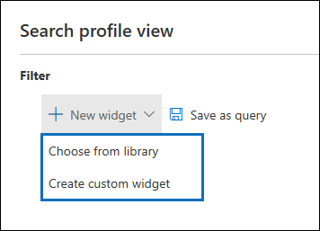

# Dashboard avanzato di eDiscovery per i set di riesami (anteprima)

Per alcuni casi in Advanced eDiscovery, è possibile che si disponga di un volume elevato di documenti e messaggi di posta elettronica che devono essere esaminati. Prima di avviare il processo di revisione, è consigliabile analizzare rapidamente il corpus per identificare le tendenze o le statistiche chiave che consentono di sviluppare la strategia di revisione. A tale scopo, è possibile utilizzare il dashboard Advanced eDiscovery per i set di revisione per analizzare rapidamente il corpo.

## Passaggio 1: creare un widget nel dashboard del set di recensioni

1. Nel centro sicurezza & conformità, accedere a **eDiscovery > Advanced eDiscovery** per visualizzare l'elenco dei casi nell'organizzazione.
  
2. Selezionare un caso esistente.
  
3. Fare clic sulla scheda **Revisione set** e quindi selezionare un set di revisione.
  
4. Nell'elenco a discesa **singoli risultati** fare clic su **visualizzazione profilo di ricerca**. 

   

   Viene visualizzata la pagina **visualizzazione profilo di ricerca** . la prima volta che si visualizza questa pagina, vengono visualizzati tre widget predefiniti.

   
  
5. Fare clic sul **nuovo widget** e quindi selezionare uno degli elementi seguenti:

   

   - **Scegliere dalla raccolta:** Visualizza una raccolta predefinita di widget. Si fa clic su un widget e quindi si fa clic su **Aggiungi** per aggiungerlo ai widget nella pagina **visualizzazione profilo di ricerca** .
  
   - **Creare widget personalizzato:** Visualizza una pagina a comparsa che è possibile utilizzare per configurare un widget personalizzato. 

6. Per creare un widget personalizzato, fare quanto segue nella pagina Aggiungi riquadro a comparsa **del widget** :

   

    a. Digitare un nome per il widget, visualizzato nella barra del titolo del widget. È necessario denominare un widget, ma è utile identificare i dati del widget.

    b. Selezionare una proprietà nell'elenco a discesa **Scegli pivot** che verrà utilizzato per i dati del widget. Gli elementi di questo elenco sono le proprietà ricercabili per gli elementi del set di revisione. Per una descrizione di queste proprietà, vedere [Document Metadata Fields in Advanced eDiscovery](document-metadata-fields-in-Advanced-eDiscovery.md). Le opzioni di pivot per il widget sono elencate nella colonna **nome campo ricercabile** in questo argomento.

    c. Selezionare un tipo di grafico per visualizzare i dati dalla proprietà pivot selezionata.

  6. Fare clic su **Aggiungi** per creare il widget personalizzato e visualizzarlo nella pagina **visualizzazione profilo di ricerca** .

## Passaggio 2: creare una query di ricerca set di Revisione

1. Fare clic su **...** nella barra del titolo del widget, quindi fare clic su **applica condizione**.

   

2. Nella pagina del riquadro a comparsa, fare clic su un elemento nel tasto widget o nel grafico widget per creare un filtro.

   

3. Ripetere i passaggi 1-2 per altri widget. 

4. Al termine, fare clic su **Salva con nome** per salvare le condizioni come una nuova query di ricerca per il set di revisione.

   

5. Chiudere la **visualizzazione del profilo di ricerca** per tornare alla visualizzazione dei risultati della ricerca.

   Se sono stati creati filtri visivi, la query risultante viene applicata ai risultati della ricerca visualizzati e la query di ricerca salvata nel passaggio 4 viene visualizzata sotto **query salvate**. Per ulteriori informazioni sulle query dei set di revisione, vedere [query the data in a Review set](review-set-search.md).
