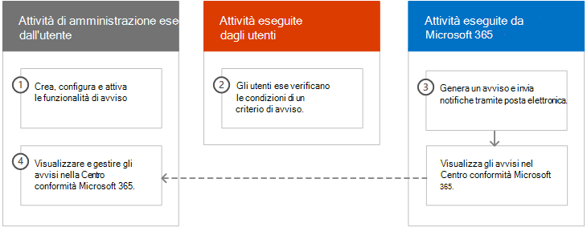
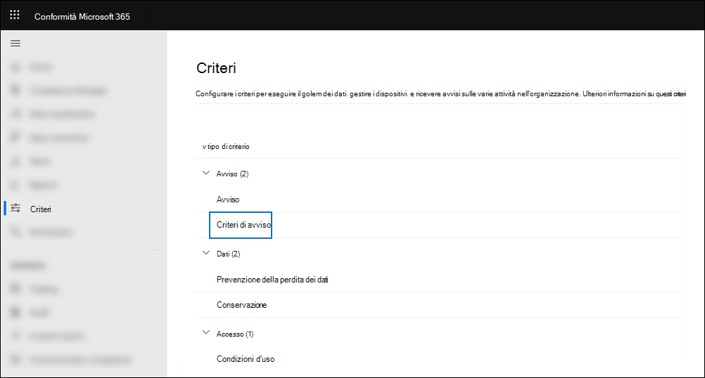
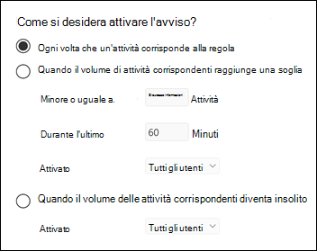
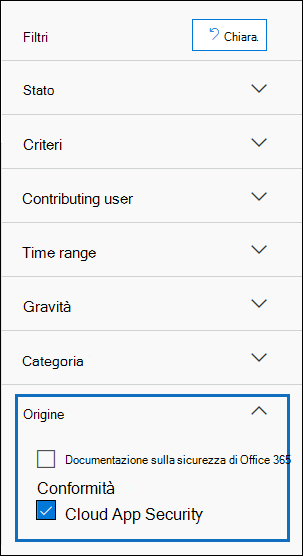
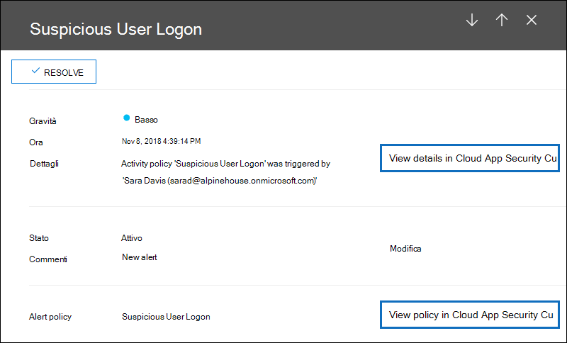

# <a name="alert-policies-in-the-microsoft-365-compliance-center"></a>Criteri di avviso nella Centro conformità Microsoft 365

È possibile utilizzare i criteri di avviso e gli strumenti del dashboard degli avvisi nel Centro conformità Microsoft 365 per creare criteri di avviso e quindi visualizzare gli avvisi generati quando gli utenti eseguono attività che soddisfano le condizioni di un criterio di avviso. Esistono diversi criteri di avviso predefiniti che consentono di monitorare attività quali l'assegnazione di privilegi di amministratore in Exchange Online, attacchi di malware, campagne di phishing e livelli insoliti di eliminazioni di file e condivisione esterna.

I criteri di avviso consentono di categorizzare gli avvisi attivati da un criterio, applicare il criterio a tutti gli utenti dell'organizzazione, impostare un livello di soglia per l'attivazione di un avviso e decidere se ricevere notifiche tramite posta elettronica quando vengono attivati gli avvisi. È inoltre disponibile  una pagina Avvisi nel Centro conformità in cui è possibile visualizzare e filtrare gli avvisi, impostare uno stato di avviso per gestire gli avvisi e quindi ignorare gli avvisi dopo aver risolto o risolto l'evento imprevisto sottostante.

> [!NOTE]
> I criteri di avviso sono disponibili per le organizzazioni con una sottoscrizione Microsoft 365 Enterprise, Office 365 Enterprise o Office 365 US Government E1/F1/G1, E3/F3/G3 o E5/G5. La funzionalità avanzata è disponibile solo per le organizzazioni con una sottoscrizione E5/G5 o per le organizzazioni che dispongono di una sottoscrizione E1/F1/G1 o E3/F3/G3 e microsoft Defender per Office 365 P2 o un Microsoft 365 E5 Compliance o una sottoscrizione del componente aggiuntivo E5 eDiscovery e Controllo. La funzionalità che richiede un abbonamento A5/G5 o a un componente aggiuntivo è evidenziata in questo argomento. Tieni inoltre presente che i criteri di avviso sono disponibili negli ambienti Office 365 GCC, GCC High e DoD US government.

## <a name="how-alert-policies-work"></a>Funzionamento dei criteri di avviso

Ecco una breve panoramica del funzionamento dei criteri di avviso e degli avvisi che vengono attivati quando l'attività dell'utente o dell'amministratore soddisfa le condizioni di un criterio di avviso.



1. Un amministratore dell'organizzazione crea, configura e attiva un criterio di avviso utilizzando la **pagina Criteri** di avviso nel Centro conformità. È inoltre possibile creare criteri di avviso utilizzando il cmdlet [New-ProtectionAlert](/powershell/module/exchange/new-protectionalert) in PowerShell & Centro conformità.

   Per creare criteri di avviso, è necessario disporre del ruolo Gestisci avvisi o Configurazione organizzazione nel Centro conformità.

   > [!NOTE]
   > Sono necessarie fino a 24 ore dopo la creazione o l'aggiornamento di un criterio di avviso prima che gli avvisi possano essere attivati dal criterio. Questo perché il criterio deve essere sincronizzato con il motore di rilevamento degli avvisi.

2. Un utente esegue un'attività che corrisponde alle condizioni di un criterio di avviso. In caso di attacchi malware, i messaggi di posta elettronica infetti inviati agli utenti dell'organizzazione attivano un avviso.

3. Microsoft 365 viene generato un avviso visualizzato nella pagina **Avvisi** di Centro conformità Microsoft 365. Inoltre, se le notifiche di posta elettronica sono abilitate per il criterio di avviso, Microsoft invia una notifica a un elenco di destinatari. Gli avvisi che possono essere visualizzati da un amministratore o da altri utenti nella pagina Avvisi sono determinati dai ruoli assegnati all'utente. Per ulteriori informazioni, vedere [Autorizzazioni RBAC necessarie per visualizzare gli avvisi.](#rbac-permissions-required-to-view-alerts)

4. Un amministratore gestisce gli avvisi nel Centro conformità. La gestione degli avvisi consiste nell'assegnare uno stato di avviso per tenere traccia e gestire qualsiasi indagine.

## <a name="alert-policy-settings"></a>Impostazioni dei criteri di avviso

Un criterio di avviso è costituito da un set di regole e condizioni che definiscono l'attività dell'utente o dell'amministratore che genera un avviso, un elenco di utenti che attivano l'avviso se eseguono l'attività e una soglia che definisce quante volte deve verificarsi l'attività prima dell'attivazione di un avviso. È inoltre possibile categorizzare il criterio e assegnare un livello di gravità. Queste due impostazioni consentono di gestire i criteri di avviso (e gli avvisi che vengono attivati quando vengono soddisfatte le condizioni dei criteri) perché è possibile filtrare in base a queste impostazioni durante la gestione dei criteri e la visualizzazione degli avvisi nel Centro conformità. Ad esempio, è possibile visualizzare gli avvisi che soddisfano le condizioni della stessa categoria o visualizzare gli avvisi con lo stesso livello di gravità.

**Per visualizzare e creare criteri di avviso:**

Vai a <https://compliance.microsoft.com> e quindi seleziona **Criteri**  >  **Criteri Avviso**  >  **Criteri** avviso . In alternativa, è possibile passare direttamente a <https://compliance.microsoft.com/alertpolicies> .



> [!NOTE]
> È necessario essere assegnati al ruolo View-Only Gestisci avvisi per visualizzare i criteri di avviso nella Centro conformità Microsoft 365. Per creare e modificare i criteri di avviso, è necessario disporre del ruolo Gestisci avvisi. Per ulteriori informazioni, vedere [Autorizzazioni nel Centro sicurezza e conformità.](../security/office-365-security/permissions-in-the-security-and-compliance-center.md)

Un criterio di avviso è costituito dalle impostazioni e dalle condizioni seguenti.

- **Attività che l'avviso sta verificando**. È possibile creare un criterio per tenere traccia di un'attività o in alcuni casi di alcune attività correlate, ad esempio la condivisione di un file con un utente esterno tramite la condivisione, l'assegnazione delle autorizzazioni di accesso o la creazione di un collegamento anonimo. Quando un utente esegue l'attività definita dal criterio, viene attivato un avviso in base alle impostazioni della soglia di avviso.

    > [!NOTE]
    > Le attività che è possibile tenere traccia dipendono dal piano dell'organizzazione Office 365 Enterprise o Office 365 del governo degli Stati Uniti. In generale, le attività correlate a campagne di malware e attacchi di phishing richiedono un abbonamento E5/G5 o un abbonamento E1/F1/G1 o E3/F3/G3 con un abbonamento al componente aggiuntivo [Defender per Office 365](../security/office-365-security/defender-for-office-365.md) Piano 2.

- **Condizioni di attività**. Per la maggior parte delle attività, è possibile definire condizioni aggiuntive che devono essere soddisfatte per attivare un avviso. Le condizioni comuni includono gli indirizzi IP (in modo che un avviso sia attivato quando l'utente esegue l'attività su un computer con un indirizzo IP specifico o all'interno di un intervallo di indirizzi IP), se un avviso viene attivato se un utente o un utente specifico esegue tale attività e se l'attività viene eseguita su un nome di file o un URL specifico. È inoltre possibile configurare una condizione che attiva un avviso quando l'attività viene eseguita da qualsiasi utente dell'organizzazione. Le condizioni disponibili dipendono dall'attività selezionata.

- **Quando viene attivato l'avviso**. È possibile configurare un'impostazione che definisce la frequenza di esecuzione di un'attività prima dell'attivazione di un avviso. In questo modo è possibile configurare un criterio per generare un avviso ogni volta che un'attività soddisfa le condizioni dei criteri, quando viene superata una determinata soglia o quando l'occorrenza dell'attività che l'avviso sta verificando diventa insolita per l'organizzazione.

    

    Se si seleziona l'impostazione in base ad attività insolite, Microsoft stabilisce un valore di base che definisce la frequenza normale per l'attività selezionata. Per stabilire questa linea di base sono necessari fino a sette giorni, durante i quali gli avvisi non verranno generati. Una volta stabilita la previsione, viene attivato un avviso quando la frequenza dell'attività monitorata dal criterio di avviso supera notevolmente il valore di base. Per le attività correlate al controllo , ad esempio le attività di file e cartelle, è possibile stabilire una linea di base basata su un singolo utente o su tutti gli utenti dell'organizzazione. per le attività correlate al malware, è possibile stabilire una linea di base basata su una singola famiglia di malware, su un singolo destinatario o su tutti i messaggi dell'organizzazione.

    > [!NOTE]
    > La possibilità di configurare i criteri di avviso in base a una soglia o a attività insolite richiede una sottoscrizione E5/G5 o una sottoscrizione E1/F1/G1 o E3/F3/G3 con un abbonamento al componente aggiuntivo Microsoft Defender per Office 365 P2, Microsoft 365 E5 Compliance o Microsoft 365 eDiscovery e controllo. Le organizzazioni con una sottoscrizione E1/F1/G1 e E3/F3/G3 possono creare solo criteri di avviso in cui viene attivato un avviso ogni volta che si verifica un'attività.

- **Categoria avviso**. Per facilitare il rilevamento e la gestione degli avvisi generati da un criterio, è possibile assegnare una delle categorie seguenti a un criterio.

  - Prevenzione della perdita dei dati

  - Governance delle informazioni

  - Flusso di posta

  - Autorizzazioni

  - Gestione dei rischi

  - Altri

  Quando si verifica un'attività che soddisfa le condizioni del criterio di avviso, l'avviso generato viene contrassegnato con la categoria definita in questa impostazione. In questo modo è possibile tenere traccia e gestire gli avvisi con la stessa impostazione di categoria nella pagina **Avvisi** nel Centro conformità perché è possibile ordinare e filtrare gli avvisi in base alla categoria.

- **Gravità dell'avviso**. Analogamente alla categoria di avviso, ai criteri di avviso viene assegnato un attributo di gravità (**Low**, **Medium**, **High** o **Informational).** Analogamente alla categoria di avviso, quando si verifica un'attività che corrisponde alle condizioni del criterio di avviso, l'avviso generato viene contrassegnato con lo stesso livello di gravità impostato per il criterio di avviso. Anche in questo caso, è possibile tenere traccia e gestire gli avvisi con la stessa impostazione di gravità nella **pagina Avvisi.** Ad esempio, è possibile filtrare l'elenco degli avvisi in modo che siano visualizzati solo gli avvisi **con** gravità Elevata.

    > [!TIP]
    > Quando si configura un criterio di avviso, è consigliabile assegnare un livello di gravità maggiore alle attività che possono provocare conseguenze molto negative, ad esempio il rilevamento di malware dopo il recapito agli utenti, la visualizzazione di dati riservati o classificati, la condivisione di dati con utenti esterni o altre attività che possono causare la perdita di dati o minacce alla sicurezza. In questo modo è possibile definire la priorità degli avvisi e le azioni intraprese per analizzare e risolvere le cause sottostanti.

- **Notifiche tramite posta elettronica**. È possibile configurare il criterio in modo che le notifiche di posta elettronica siano inviate (o non inviate) a un elenco di utenti quando viene attivato un avviso. Puoi anche impostare un limite di notifica giornaliero in modo che, una volta raggiunto il numero massimo di notifiche, non verranno inviate altre notifiche per l'avviso durante quel giorno. Oltre alle notifiche tramite posta elettronica, l'utente o altri amministratori possono visualizzare gli avvisi attivati da un criterio nella **pagina Avvisi.** Prendere in considerazione l'abilitazione delle notifiche di posta elettronica per i criteri di avviso di una categoria specifica o con un'impostazione di gravità superiore.

## <a name="default-alert-policies"></a>Criteri di avviso predefiniti

Microsoft fornisce criteri di avviso predefiniti che consentono di identificare Exchange di abuso delle autorizzazioni di amministratore, attività di malware, potenziali minacce esterne e interne e rischi di governance delle informazioni. Nella pagina **Criteri di** avviso i nomi di questi criteri predefiniti sono in grassetto e il tipo di criterio è definito come **Sistema**. Questi criteri sono attivati per impostazione predefinita. È possibile disattivare questi criteri (o riattivarlo), configurare un elenco di destinatari a cui inviare notifiche tramite posta elettronica e impostare un limite di notifica giornaliero. Le altre impostazioni per questi criteri non possono essere modificate.

Nella tabella seguente sono elencati e descritti i criteri di avviso predefiniti disponibili e la categoria a cui è assegnato ogni criterio. La categoria viene utilizzata per determinare quali avvisi possono essere visualizzati da un utente nella pagina Avvisi. Per ulteriori informazioni, vedere [Autorizzazioni RBAC necessarie per visualizzare gli avvisi.](#rbac-permissions-required-to-view-alerts)

La tabella indica inoltre il piano Office 365 Enterprise e Office 365 del governo statunitense necessario per ognuno di essi. Alcuni criteri di avviso predefiniti sono disponibili se l'organizzazione dispone dell'abbonamento al componente aggiuntivo appropriato oltre a una sottoscrizione E1/F1/G1 o E3/F3/G3.

| Criterio di avviso predefinito | Descrizione | Categoria | Enterprise abbonamento |
|:-----|:-----|:-----|:-----|
|**È stato rilevato un clic sull'URL potenzialmente dannoso**|Genera un avviso quando un utente protetto da Cassaforte [collegamenti nell'organizzazione](../security/office-365-security/safe-links.md) fa clic su un collegamento dannoso. Questo evento viene attivato quando Microsoft Defender per Office 365 identifica le modifiche al verdetto degli URL o quando gli utenti sostituiscono le pagine dei collegamenti di Cassaforte (in base al criterio Microsoft 365 for business Cassaforte Links dell'organizzazione). Questo criterio di avviso ha **un'impostazione** di gravità elevata. Per i clienti di Defender Office 365 P2, E5, G5, questo avviso attiva automaticamente l'indagine e la risposta [automatizzate in Office 365](../security/office-365-security/office-365-air.md). Per ulteriori informazioni sugli eventi che attivano questo avviso, vedere [Set up Cassaforte Links policies.](../security/office-365-security/set-up-safe-links-policies.md)|Gestione dei rischi|E5/G5 o Defender per Office 365 di componente aggiuntivo P2|
|**Risultato invio amministratore completato**|Genera un avviso quando un [invio dell'amministratore](../security/office-365-security/admin-submission.md) completa la nuova analisi dell'entità inviata. Un avviso verrà attivato ogni volta che viene eseguito il rendering di un risultato di nuova analisi da un invio dell'amministratore. Questi avvisi hanno lo scopo di ricordare di esaminare i risultati degli invii [precedenti,](https://compliance.microsoft.com/reportsubmission)inviare messaggi segnalati dall'utente per ottenere il controllo più recente dei criteri e analizzare di nuovo i verdetti e aiutare a determinare se i criteri di filtro nell'organizzazione hanno l'impatto previsto. Questo criterio ha **un'impostazione di gravità** informativo.|Gestione dei rischi|E1/F1, E3/F3 o E5|
|**L'amministratore ha attivato l'analisi manuale della posta elettronica**|Genera un avviso quando un amministratore attiva l'analisi manuale di un messaggio di posta elettronica da Threat Explorer. Per altre informazioni, vedi [Esempio: un amministratore della sicurezza attiva un'indagine da Threat Explorer.](../security/office-365-security/automated-investigation-response-office.md#example-a-security-administrator-triggers-an-investigation-from-threat-explorer) Questo avviso notifica all'organizzazione che l'indagine è stata avviata. L'avviso fornisce informazioni sull'utente che l'ha attivato e include un collegamento all'indagine. Questo criterio ha **un'impostazione di gravità** informativo.|Gestione dei rischi| Abbonamento al componente aggiuntivo E5/G5 o Microsoft Defender per Office 365 componente aggiuntivo P2| 
|**Creazione di regole di inoltro/reindirizzamento**|Genera un avviso quando un utente dell'organizzazione crea una regola di posta in arrivo per la propria cassetta postale che inoltra o reindirizza i messaggi a un altro account di posta elettronica. Questo criterio tiene traccia solo delle regole di Posta in arrivo create Outlook sul web (in precedenza noto come Outlook Web App) o Exchange Online PowerShell. Questo criterio ha **un'impostazione di gravità** informativo. Per ulteriori informazioni sull'utilizzo delle regole di Posta in arrivo per inoltrare e reindirizzare la posta elettronica in Outlook sul web, vedere [Use rules in Outlook sul web to automatically forward messages to another account](https://support.office.com/article/1433e3a0-7fb0-4999-b536-50e05cb67fed).|Gestione dei rischi|E1/F1/G1, E3/F3/G3 o E5/G5|
|**Ricerca e-discovery avviata o esportata**|Genera un avviso quando un utente usa lo strumento ricerca contenuto nel Centro sicurezza e conformità. Viene generato un avviso quando vengono eseguite le attività di ricerca contenuto seguenti: <br/><br/>* Viene avviata una ricerca di contenuto<br/>* I risultati di una ricerca di contenuto vengono esportati<br/>* Viene esportato un report di ricerca contenuto<br/><br/>Gli avvisi vengono attivati anche quando le attività di ricerca del contenuto precedenti vengono eseguite in associazione a un caso di eDiscovery. Questo criterio ha **un'impostazione di gravità** informativo. Per ulteriori informazioni sulle attività di ricerca contenuto, vedere [Search for eDiscovery activities in the audit log.](search-for-ediscovery-activities-in-the-audit-log.md#ediscovery-activities)|Gestione dei rischi|E1/F1/G1, E3/F3/G3 o E5/G5|
|**Elevazione dei privilegi Exchange amministratore**|Genera un avviso quando a un utente vengono assegnate autorizzazioni amministrative nell'Exchange Online organizzazione. Ad esempio, quando un utente viene aggiunto al gruppo di ruoli Gestione organizzazione in Exchange Online. Questo criterio ha **un'impostazione di** gravità Bassa.|Autorizzazioni|E1/F1/G1, E3/F3/G3 o E5/G5|
|**Messaggi di posta elettronica contenenti malware rimossi dopo il recapito**|Genera un avviso quando i messaggi contenenti malware vengono recapitati alle cassette postali dell'organizzazione. Se si verifica questo evento, Microsoft rimuove i messaggi infetti dalle cassette postali Exchange Online utilizzando l'eliminazione automatica [di zero ore.](../security/office-365-security/zero-hour-auto-purge.md) Questo criterio ha **un'impostazione di gravità** informativo e attiva automaticamente l'indagine e la risposta automatizzate [in Office 365](../security/office-365-security/office-365-air.md).|Gestione dei rischi|Abbonamento al componente aggiuntivo E5/G5 o Microsoft Defender per Office 365 componente aggiuntivo P2|
|**Dei messaggi di posta elettronica contenenti URL di phishing sono stati rimossi dopo il recapito**|Genera un avviso quando i messaggi contenenti phish vengono recapitati alle cassette postali dell'organizzazione. Se si verifica questo evento, Microsoft rimuove i messaggi infetti dalle cassette postali Exchange Online utilizzando l'eliminazione automatica [di zero ore.](../security/office-365-security/zero-hour-auto-purge.md) Questo criterio ha **un'impostazione di gravità** informativo e attiva automaticamente l'indagine e la risposta automatizzate [in Office 365](../security/office-365-security/office-365-air.md).|Gestione dei rischi|E5/G5 o Defender per Office 365 di componente aggiuntivo P2|
|**Email segnalata dagli utenti come malware o phishing**|Genera un avviso quando gli utenti dell'organizzazione segnalano i messaggi come posta elettronica di phishing utilizzando il componente aggiuntivo Segnala messaggio. Questo criterio ha **un'impostazione di** gravità Bassa. Per ulteriori informazioni su questo componente aggiuntivo, vedere [Use the Report Message add-in](https://support.office.com/article/b5caa9f1-cdf3-4443-af8c-ff724ea719d2). Per i clienti di Defender Office 365 P2, E5, G5, questo avviso attiva automaticamente l'indagine e la risposta [automatizzate in Office 365](../security/office-365-security/office-365-air.md).|Gestione dei rischi|E1/F1/G1, E3/F3/G3 o E5/G5|
|**Limite di invio della posta elettronica superato**|Genera un avviso quando un utente dell'organizzazione ha inviato più posta di quella consentita dal criterio di posta indesiderata in uscita. Questa è in genere un'indicazione che l'utente sta inviando troppi messaggi di posta elettronica o che l'account potrebbe essere compromesso. Questo criterio ha **un'impostazione di** gravità Media. Se si ottiene un avviso generato da questo criterio di avviso, è buona idea verificare se [l'account utente è compromesso.](../security/office-365-security/responding-to-a-compromised-email-account.md)|Gestione dei rischi|E1/F1/G1, E3/F3/G3 o E5/G5|
|**Modulo bloccato a causa di un potenziale tentativo di phishing**|Genera un avviso quando a un utente dell'organizzazione è stata limitata la condivisione di moduli e la raccolta di risposte tramite Microsoft Forms a causa di un comportamento ripetuto di tentativo di phishing rilevato. Questo criterio ha **un'impostazione di gravità** elevata.|Gestione dei rischi|E1, E3/F3 o E5|
|**Modulo contrassegnato e confermato come phishing**|Genera un avviso quando un modulo creato in Microsoft Forms dall'organizzazione è stato identificato come potenziale phishing tramite segnalazione di abuso e confermato come phishing da Microsoft. Questo criterio ha **un'impostazione** di gravità elevata.|Gestione dei rischi|E1, E3/F3 o E5|
|**I messaggi sono stati ritardati**|Genera un avviso quando Microsoft non è in grado di recapitare messaggi di posta elettronica all'organizzazione locale o a un server partner utilizzando un connettore. In questo caso, il messaggio viene accodato in Office 365. Questo avviso viene attivato quando sono presenti 2.000 messaggi o più che sono stati accodati per più di un'ora. Questo criterio ha **un'impostazione** di gravità elevata.|Flusso di posta|E1/F1/G1, E3/F3/G3 o E5/G5|
|**Campagna antimalware rilevata dopo il recapito**|Genera un avviso quando un numero insolitamente elevato di messaggi contenenti malware viene recapitato alle cassette postali dell'organizzazione. Se si verifica questo evento, Microsoft rimuove i messaggi infetti dalle Exchange Online cassette postali. Questo criterio ha **un'impostazione** di gravità elevata.|Gestione dei rischi|Abbonamento al componente aggiuntivo E5/G5 o Microsoft Defender per Office 365 componente aggiuntivo P2|
|**Campagna antimalware rilevata e bloccata**|Genera un avviso quando qualcuno ha tentato di inviare un numero insolitamente elevato di messaggi di posta elettronica contenenti un determinato tipo di malware agli utenti dell'organizzazione. Se si verifica questo evento, i messaggi infetti vengono bloccati da Microsoft e non recapitati alle cassette postali. Questo criterio ha **un'impostazione di** gravità Bassa.|Gestione dei rischi|E5/G5 o Defender per Office 365 di componente aggiuntivo P2|
|**Campagna di malware rilevata in SharePoint e OneDrive**|Genera un avviso quando viene rilevato un volume insolitamente elevato di malware o virus nei file che si trovano in SharePoint siti o OneDrive account nell'organizzazione. Questo criterio ha **un'impostazione** di gravità elevata.|Gestione dei rischi|E5/G5 o Defender per Office 365 di componente aggiuntivo P2|
|**Malware non zapped because ZAP is disabled**| Genera un avviso quando Microsoft rileva il recapito di un messaggio di malware a una cassetta postale perché Zero-Hour l'eliminazione automatica per i messaggi phish è disabilitata. Questo criterio ha **un'impostazione di gravità** informativo. |Gestione dei rischi|E5/G5 o Defender per Office 365 di componente aggiuntivo P2|
|**Phish recapitato perché la cartella Posta indesiderata di un utente è disabilitata**|Genera un avviso quando Microsoft rileva che la cartella Posta indesiderata di un utente è disabilitata, consentendo il recapito di un messaggio di phishing ad alta probabilità a una cassetta postale. Questo criterio ha **un'impostazione di gravità** informativo.|Gestione dei rischi|E5/G5 o Defender per Office 365 di componente aggiuntivo P1 o P2|
|**Phish recapitato a causa di una sostituzione ETR**|Genera un avviso quando Microsoft rileva una regola Exchange Transport Rule (ETR) che consente il recapito di un messaggio di phishing ad alta probabilità a una cassetta postale. Questo criterio ha **un'impostazione di gravità** informativo. Per ulteriori informazioni sulle Exchange di trasporto (regole del flusso di posta), vedere [Mail flow rules (transport rules) in Exchange Online](/exchange/security-and-compliance/mail-flow-rules/mail-flow-rules).|Gestione dei rischi|E5/G5 o Defender per Office 365 di componente aggiuntivo P1 o P2|
|**Phish recapitato a causa di un criterio di ip consentiti**|Genera un avviso quando Microsoft rileva un criterio di autorizzazione IP che consente il recapito di un messaggio di phishing ad alta probabilità a una cassetta postale. Questo criterio ha **un'impostazione di gravità** informativo. Per ulteriori informazioni sul criterio di autorizzazione IP (filtro connessioni), vedere [Configure the default connection filter policy - Office 365](../security/office-365-security/configure-the-connection-filter-policy.md).|Gestione dei rischi|E5/G5 o Defender per Office 365 di componente aggiuntivo P1 o P2|
|**Phish non zapped perché ZAP è disabilitato**| Genera un avviso quando Microsoft rileva il recapito di un messaggio di phishing ad alta probabilità a una cassetta postale perché Zero-Hour eliminazione automatica per i messaggi phish è disabilitata. Questo criterio ha **un'impostazione di gravità** informativo.|Gestione dei rischi|E5/G5 o Defender per Office 365 di componente aggiuntivo P2|
|**Phish recapitato a causa dell'override del tenant o dell'utente**<sup>1</sup>|Genera un avviso quando Microsoft rileva che l'override di un amministratore o di un utente ha consentito il recapito di un messaggio di phishing a una cassetta postale. Esempi di sostituzioni includono una regola di posta in arrivo o del flusso di posta che consente i messaggi provenienti da un mittente o un dominio specifico oppure un criterio di protezione da posta indesiderata che consente i messaggi provenienti da mittenti o domini specifici. Questo criterio ha **un'impostazione** di gravità elevata.|Gestione dei rischi|E5/G5 o Defender per Office 365 di componente aggiuntivo P2|
|**Attività sospetta di inoltro della posta elettronica**|Genera un avviso quando un utente dell'organizzazione ha inviato automaticamente un messaggio di posta elettronica a un account esterno sospetto. Si tratta di un avviso anticipato per il comportamento che potrebbe indicare che l'account è compromesso, ma non abbastanza grave da limitare l'utente. Questo criterio ha **un'impostazione** di gravità elevata. Anche se è raro, un avviso generato da questo criterio potrebbe essere un'anomalia. È buona idea verificare se [l'account utente è compromesso.](../security/office-365-security/responding-to-a-compromised-email-account.md)|Gestione dei rischi|E1/F1/G1, E3/F3/G3 o E5/G5|
|**Rilevati modelli di invio di posta elettronica sospetti**|Genera un avviso quando un utente dell'organizzazione ha inviato messaggi di posta elettronica sospetti ed è a rischio di essere limitato a inviare messaggi di posta elettronica. Si tratta di un avviso anticipato per il comportamento che potrebbe indicare che l'account è compromesso, ma non abbastanza grave da limitare l'utente. Questo criterio ha **un'impostazione di** gravità Media. Anche se è raro, un avviso generato da questo criterio potrebbe essere un'anomalia. È tuttavia buona idea verificare se [l'account utente è compromesso.](../security/office-365-security/responding-to-a-compromised-email-account.md)|Gestione dei rischi|E1/F1/G1, E3/F3/G3 o E5/G5  |
|**Tenant con restrizioni per l'invio di posta elettronica**|Genera un avviso quando la maggior parte del traffico di posta elettronica proveniente dall'organizzazione è stata rilevata come sospetta e Microsoft ha limitato l'invio di posta elettronica all'organizzazione. Analizzare eventuali account utente e amministratore potenzialmente compromessi, nuovi connettori o inoltri aperti, quindi contattare il supporto Tecnico Microsoft per sbloccare l'organizzazione. Questo criterio ha **un'impostazione** di gravità elevata. Per ulteriori informazioni sul motivo per cui le organizzazioni sono bloccate, vedere Risolvere i problemi di recapito della posta elettronica per il codice di errore [5.7.7xx in Exchange Online](/Exchange/mail-flow-best-practices/non-delivery-reports-in-exchange-online/fix-error-code-5-7-700-through-5-7-750).|Gestione dei rischi|E1/F1/G1, E3/F3/G3 o E5/G5|
|**Attività insolita dei file degli utenti esterni**|Genera un avviso quando un numero insolitamente elevato di attività viene eseguito su file in SharePoint o OneDrive da utenti esterni all'organizzazione. Sono incluse attività quali l'accesso ai file, il download dei file e l'eliminazione di file. Questo criterio ha **un'impostazione** di gravità elevata.|Governance delle informazioni|E5/G5, Microsoft Defender per Office 365 P2 o Microsoft 365 E5 di componente aggiuntivo|
|**Volume insolito di condivisione di file esterni**|Genera un avviso quando un numero insolitamente elevato di file SharePoint o OneDrive condivisi con utenti esterni all'organizzazione. Questo criterio ha **un'impostazione di** gravità Media.|Governance delle informazioni|E5/G5, Defender per Office 365 P2 o Microsoft 365 E5 di componente aggiuntivo|
|**Volume insolito di eliminazione dei file**|Genera un avviso quando un numero insolitamente elevato di file viene eliminato in SharePoint o OneDrive in un breve periodo di tempo. Questo criterio ha **un'impostazione di** gravità Media.|Governance delle informazioni|E5/G5, Defender per Office 365 P2 o Microsoft 365 E5 di componente aggiuntivo|
|**Aumento insolito dei messaggi segnalati come tentativi di phishing**|Genera un avviso quando si verifica un aumento significativo del numero di persone nell'organizzazione utilizzando il componente aggiuntivo Segnala messaggio Outlook per segnalare i messaggi come posta di phishing. Questo criterio ha **un'impostazione di** gravità Media. Per ulteriori informazioni su questo componente aggiuntivo, vedere [Use the Report Message add-in](https://support.office.com/article/b5caa9f1-cdf3-4443-af8c-ff724ea719d2).|Gestione dei rischi|E5/G5 o Defender per Office 365 di componente aggiuntivo P2|
|**Phish di rappresentazione utente recapitato nella posta in arrivo/cartella**<sup>1,</sup><sup>2</sup>|Genera un avviso quando Microsoft rileva che un amministratore o una sostituzione utente ha consentito il recapito di un messaggio di phishing di rappresentazione utente nella posta in arrivo (o in un'altra cartella accessibile dall'utente) di una cassetta postale. Esempi di sostituzioni includono una regola di posta in arrivo o del flusso di posta che consente i messaggi provenienti da un mittente o un dominio specifico oppure un criterio di protezione da posta indesiderata che consente i messaggi provenienti da mittenti o domini specifici. Questo criterio ha **un'impostazione di** gravità Media.|Gestione dei rischi|E5/G5 o Defender per Office 365 di componente aggiuntivo P2|
|**Utente con restrizioni per l'invio di posta elettronica**|Genera un avviso quando a un utente dell'organizzazione non è consentita l'invio di posta in uscita. Questo in genere si verifica quando un account viene compromesso e l'utente è elencato nella pagina **Utenti** con restrizioni nella Centro conformità Microsoft 365. Per accedere a questa pagina, passare a **Gestione delle minacce > esaminare > utenti con restrizioni**). Questo criterio ha **un'impostazione** di gravità elevata. Per ulteriori informazioni sugli utenti con restrizioni, vedere Rimozione di un utente, un dominio o un indirizzo IP da un elenco di indirizzi IP non consentiti dopo l'invio [di posta indesiderata.](/office365/securitycompliance/removing-user-from-restricted-users-portal-after-spam)|Gestione dei rischi|E1/F1/G1, E3/F3/G3 o E5/G5|
|**Utenti con restrizioni per la condivisione di moduli e la raccolta di risposte**|Genera un avviso quando a un utente dell'organizzazione è stata limitata la condivisione di moduli e la raccolta di risposte tramite Microsoft Forms a causa di un comportamento ripetuto di tentativo di phishing rilevato. Questo criterio ha **un'impostazione** di gravità elevata.|Gestione dei rischi|E1, E3/F3 o E5|
|||||

> [!NOTE]
> <sup>1</sup> Questo criterio di avviso predefinito è stato rimosso temporaneamente in base al feedback dei clienti. Stiamo lavorando per migliorarlo e lo sostituiremo con una nuova versione nel prossimo futuro. Fino ad allora, è possibile creare un criterio di avviso personalizzato per sostituire questa funzionalità utilizzando le impostazioni seguenti:<br/>&nbsp; * L'attività è phish email rilevata al momento della consegna<br/>&nbsp; * La posta non è ZAP'd<br/>&nbsp; * La direzione della posta è in ingresso<br/>&nbsp; * Lo stato di recapito della posta è Recapitato<br/>&nbsp; * La tecnologia di rilevamento è conservazione di URL dannosi, detonazione URL, filtro phish avanzato, filtro phish generale, rappresentazione di dominio, rappresentazione utente e rappresentazione del marchio<br/><br/>&nbsp;&nbsp;&nbsp;Per ulteriori informazioni sull'anti-phishing in Office 365, vedere [Set up anti-phishing and anti-phishing policies](../security/office-365-security/set-up-anti-phishing-policies.md).<br/><br/><sup>2</sup> Per ricreare questo criterio di avviso, seguire le indicazioni riportate nella nota a piè di pagina precedente, ma scegliere Rappresentazione utente come unica tecnologia di rilevamento.

L'attività insolita monitorata da alcuni dei criteri predefiniti si basa sullo stesso processo dell'impostazione della soglia di avviso descritta in precedenza. Microsoft stabilisce un valore di base che definisce la frequenza normale per l'attività "normale". Gli avvisi vengono quindi attivati quando la frequenza delle attività rilevate dal criterio di avviso predefinito supera notevolmente il valore di base.

## <a name="viewing-alerts"></a>Visualizzazione degli avvisi

Quando un'attività eseguita dagli utenti nell'organizzazione corrisponde alle impostazioni di un criterio di avviso, viene generato e visualizzato un avviso nella pagina **Avvisi** nel Centro conformità. A seconda delle impostazioni di un criterio di avviso, una notifica tramite posta elettronica viene inviata anche a un elenco di utenti specificati quando viene attivato un avviso. Per ogni avviso, nel  dashboard della pagina Avvisi vengono visualizzati il nome del criterio di avviso corrispondente, la gravità e la categoria dell'avviso (definiti nel criterio di avviso) e il numero di volte in cui si è verificata un'attività che ha generato l'avviso. Questo valore si basa sull'impostazione di soglia del criterio di avviso. Il dashboard mostra anche lo stato di ogni avviso. Per ulteriori informazioni sull'utilizzo della proprietà status per gestire gli avvisi, vedere [Managing alerts](#managing-alerts).

Per visualizzare gli avvisi, <https://compliance.microsoft.com> passare a e quindi selezionare **Avvisi**. In alternativa, è possibile passare direttamente a <https://compliance.microsoft.com/compliancealerts> .


È possibile utilizzare i filtri seguenti per visualizzare un sottoinsieme di tutti gli avvisi nella **pagina** Avvisi.

- **Stato.** Utilizzare questo filtro per visualizzare gli avvisi a cui è assegnato uno stato specifico. Lo stato predefinito è **Active**. L'utente o altri amministratori possono modificare il valore di stato.

- **Criterio.** Utilizzare questo filtro per visualizzare gli avvisi che corrispondono all'impostazione di uno o più criteri di avviso. Oppure è possibile visualizzare tutti gli avvisi per tutti i criteri di avviso.

- **Intervallo di tempo.** Utilizzare questo filtro per visualizzare gli avvisi generati in un intervallo di data e ora specifico.

- **Gravità.** Utilizzare questo filtro per visualizzare gli avvisi a cui è assegnata una gravità specifica.

- **Categoria.** Utilizzare questo filtro per visualizzare gli avvisi di una o più categorie di avvisi.

- **Tag.** Utilizzare questo filtro per visualizzare gli avvisi di uno o più tag utente. I tag vengono applicati in base alle cassette postali contrassegnate o agli utenti visualizzati negli avvisi. Vedi [Tag utente in Office 356 ATP](../security/office-365-security/user-tags.md) per altre informazioni.

- **Source.** Utilizzare questo filtro per visualizzare gli avvisi attivati dai criteri di avviso nel Centro conformità o gli avvisi attivati Office 365 Cloud App Security criteri di conformità o entrambi. Per ulteriori informazioni sugli Office 365 Cloud App Security, vedere [Viewing Cloud App Security alerts](#viewing-cloud-app-security-alerts).

> [!IMPORTANT]
> Il filtro e l'ordinamento in base ai tag utente sono attualmente in anteprima pubblica.
> Potrebbe essere sostanzialmente modificato prima che venga rilasciato commercialmente. Microsoft non fa alcuna garanzia, espressa o implicita, rispetto alle informazioni fornite.

## <a name="alert-aggregation"></a>Aggregazione degli avvisi

Quando si verificano più eventi che soddisfano le condizioni di un criterio di avviso con un breve periodo di tempo, vengono aggiunti a un avviso esistente da un processo denominato *aggregazione degli avvisi.* Quando un evento attiva un avviso, l'avviso viene generato e visualizzato nella **pagina Avvisi** e viene inviata una notifica. Se lo stesso evento si verifica entro l'intervallo di aggregazione, Microsoft 365 dettagli sul nuovo evento all'avviso esistente anziché attivare un nuovo avviso. L'obiettivo dell'aggregazione degli avvisi è ridurre la "fatica" degli avvisi e consentire di concentrarsi e intervenire su un numero minore di avvisi per lo stesso evento.

La lunghezza dell'intervallo di aggregazione dipende dall'Office 365 o Microsoft 365 sottoscrizione.

|Abbonamento|Intervallo di aggregazione|
|:---------|:---------:|
|Office 365 o Microsoft 365 E5/G5|1 minuto|
|Defender per Office 365 Piano 2 |1 minuto|
|E5 Compliance add-on or E5 Discovery and Audit add-on|1 minuto|
|Office 365 o Microsoft 365 E1/F1/G1 o E3/F3/G3|15 minuti|
|Defender per Office 365 Piano 1 o Exchange Online Protection|15 minuti|
|||

Quando si verificano eventi che corrispondono allo stesso criterio di avviso entro l'intervallo di aggregazione, i dettagli sull'evento successivo vengono aggiunti all'avviso originale. Per tutti gli eventi, le informazioni sugli eventi aggregati vengono visualizzate nel campo dei dettagli e il numero di volte in cui un evento si è verificato con l'intervallo di aggregazione viene visualizzato nel campo activity/hit count. È possibile visualizzare ulteriori informazioni su tutte le istanze di eventi aggregati visualizzando l'elenco delle attività.

Lo screenshot seguente mostra un avviso con quattro eventi aggregati. L'elenco delle attività contiene informazioni sui quattro messaggi di posta elettronica rilevanti per l'avviso.


Tenere presente quanto segue sull'aggregazione degli avvisi:

- Gli avvisi attivati dal clic sull'URL potenzialmente **dannoso** [](#default-alert-policies) rilevato non vengono aggregati. Questo perché gli avvisi attivati da questo criterio sono univoci per ogni utente e messaggio di posta elettronica.

- Al momento, la proprietà di avviso **Conteggio** risultati non indica il numero di eventi aggregati per tutti i criteri di avviso. Per gli avvisi attivati da questi criteri di avviso, è possibile visualizzare gli eventi aggregati facendo clic su Visualizza elenco messaggi o **Visualizza attività** nell'avviso.  Stiamo lavorando per rendere disponibile il numero di eventi aggregati elencati nella proprietà di avviso **Conteggio** risultati per tutti i criteri di avviso.

## <a name="rbac-permissions-required-to-view-alerts"></a>Autorizzazioni RBAC necessarie per visualizzare gli avvisi

Le autorizzazioni RBAC (Role Based Access Control) assegnate agli utenti dell'organizzazione determinano quali avvisi possono essere visualizzati da un utente nella **pagina** Avvisi. Come viene eseguita questa operazione? I ruoli di gestione assegnati agli utenti (in base all'appartenenza ai gruppi di ruoli nel Centro conformità Microsoft 365) determinano le categorie di avviso che un utente può visualizzare nella **pagina** Avvisi. Di seguito vengono descritti alcuni esempi:

- I membri del gruppo di ruoli Gestione record possono visualizzare solo gli avvisi generati dai criteri di avviso assegnati alla **categoria Governance delle** informazioni.

- I membri del gruppo di ruoli Amministratore conformità non possono visualizzare gli avvisi generati dai criteri di avviso assegnati alla **categoria di gestione delle** minacce.

- I membri del gruppo di ruoli Manager eDiscovery non possono visualizzare alcun avviso perché nessuno dei ruoli assegnati fornisce l'autorizzazione per visualizzare gli avvisi da qualsiasi categoria di avviso.

Questa progettazione (basata sulle autorizzazioni RBAC) consente di determinare quali avvisi possono essere visualizzati (e gestiti) dagli utenti in ruoli di processo specifici nell'organizzazione.

Nella tabella seguente sono elencati i ruoli necessari per visualizzare gli avvisi delle sei diverse categorie di avvisi. Nella prima colonna delle tabelle sono elencati tutti i ruoli nell'Centro conformità Microsoft 365.  Un segno di spunta indica che un utente assegnato a tale ruolo può visualizzare gli avvisi della categoria di avviso corrispondente elencata nella riga superiore.

Per vedere a quale categoria è assegnato un criterio di avviso predefinito, vedere la tabella in [Criteri di avviso predefiniti.](#default-alert-policies)

|Ruolo|Governance delle informazioni|Prevenzione della perdita dei dati|Flusso di posta|Autorizzazioni|Gestione dei rischi|Altri|
|:---------|:---------:|:---------:|:---------:|:---------:|:---------:|:---------:|
|Log di audit|||||||
|Gestione dei casi|||||||
|Amministratore di conformità|||||||
|Ricerca di conformità|||||||
|Gestione dei dispositivi|||||||
|Gestione dell'eliminazione|||||||
|Gestione della conformità DLP|||||||
|Esportazione|||||||
|Hold|||||||
|Gestione avvisi|||||||
|Configurazione organizzazione|||||||
|Anteprima|||||||
|Gestione record|||||||
|Gestione della conservazione|||||||
|Revisione|||||||
|Decrittografia RMS|||||||
|Gestione ruoli|||||||
|Ricerca ed eliminazione|||||||
|Amministratore della sicurezza|||||||
|Ruolo con autorizzazioni di lettura per la sicurezza||||||
|Visualizzazione Garanzia del servizio|||||||
|Supervisory Review Administrator|||||||
|Log di audit di sola visualizzazione|||||||
|View-Only gestione dei dispositivi|||||||
|View-Only conformità DLP|||||||
|View-Only gestire gli avvisi|||||||
|Destinatari solo visualizzazione|||||||
|View-Only Gestione record|||||||
|View-Only gestione della conservazione|||||||
|||||||

> [!TIP]
> Per visualizzare i ruoli assegnati a ognuno dei gruppi di ruoli predefiniti, eseguire i comandi seguenti in PowerShell & Centro sicurezza e conformità:
> 
> ```powershell
> $RoleGroups = Get-RoleGroup
> ```
> 
> ```powershell
> $RoleGroups | foreach {Write-Output -InputObject `r`n,$_.Name,"-----------------------"; Get-RoleGroup $_.Identity | Select-Object -ExpandProperty Roles}
> ```
>
> È inoltre possibile visualizzare i ruoli assegnati a un gruppo di ruoli nella Centro conformità Microsoft 365. Passare alla **pagina Autorizzazioni** e selezionare un gruppo di ruoli. I ruoli assegnati sono elencati nella pagina a comparsa.

## <a name="managing-alerts"></a>Gestione degli avvisi

Dopo aver generato e visualizzato gli avvisi nella pagina **Avvisi** nel Centro conformità, è possibile analizzarli, analizzarli e risolverli. Ecco alcune attività che è possibile eseguire per gestire gli avvisi.

- **Assegnare uno stato agli avvisi.** È possibile assegnare uno dei seguenti stati agli avvisi: **Attivo** (valore predefinito), **Investigating,** **Resolved** o **Dismissed.** È quindi possibile filtrare questa impostazione per visualizzare gli avvisi con la stessa impostazione di stato. Questa impostazione di stato consente di tenere traccia del processo di gestione degli avvisi.

- **Visualizzare i dettagli dell'avviso.** È possibile selezionare un avviso per visualizzare una pagina a comparsa con i dettagli sull'avviso. Le informazioni dettagliate dipendono dal criterio di avviso corrispondente, ma in genere includono quanto segue:

  - Nome dell'operazione effettiva che ha attivato l'avviso, ad esempio un cmdlet o un'operazione del log di controllo.

  - Descrizione dell'attività che ha attivato l'avviso.

  - Utente (o elenco di utenti) che ha attivato l'avviso. È incluso solo per i criteri di avviso impostati per tenere traccia di un singolo utente o di una singola attività.

  - Numero di volte in cui è stata eseguita l'attività monitorata dall'avviso. Questo numero potrebbe non corrispondere al numero effettivo di avvisi correlati elencati nella pagina Avvisi perché potrebbero essere stati attivati più avvisi.

  - Collegamento a un elenco di attività che include un elemento per ogni attività eseguita che ha attivato l'avviso. Ogni voce in questo elenco identifica quando si è verificata l'attività, il nome dell'operazione effettiva (ad esempio "FileDeleted"), l'utente che ha eseguito l'attività, l'oggetto (ad esempio un file, un caso di eDiscovery o una cassetta postale) su cui è stata eseguita l'attività e l'indirizzo IP del computer dell'utente. Per gli avvisi correlati al malware, questo collegamento a un elenco di messaggi.

  - Nome (e collegamento) del criterio di avviso corrispondente.

- **Eliminare le notifiche di posta elettronica.** Puoi disattivare (o eliminare) le notifiche di posta elettronica dalla pagina a comparsa per un avviso. Quando si sopprimeno le notifiche di posta elettronica, Microsoft non invierà notifiche quando si verificano attività o eventi che soddisfano le condizioni del criterio di avviso. Tuttavia, gli avvisi verranno attivati quando le attività eseguite dagli utenti corrispondono alle condizioni del criterio di avviso. È inoltre possibile disattivare le notifiche tramite posta elettronica modificando i criteri di avviso.

- **Risolvere gli avvisi.** È possibile contrassegnare un avviso come risolto nella pagina a comparsa per un avviso (che imposta lo stato dell'avviso su **Risolto**). A meno che non si modifica il filtro, gli avvisi risolti non vengono visualizzati nella **pagina Avvisi.**

## <a name="viewing-cloud-app-security-alerts"></a>Visualizzazione Cloud App Security avvisi

Gli avvisi attivati dai criteri Office 365 Cloud App Security vengono ora visualizzati nella **pagina Avvisi** nel Centro conformità. Sono inclusi gli avvisi attivati dai criteri attività e dagli avvisi attivati dai criteri di rilevamento delle anomalie in Office 365 Cloud App Security. Ciò significa che è possibile visualizzare tutti gli avvisi nel Centro conformità. Office 365 Cloud App Security è disponibile solo per le organizzazioni con un abbonamento Office 365 Enterprise E5 o Office 365 US Government G5. Per ulteriori informazioni, vedere [Overview of Cloud App Security](/cloud-app-security/what-is-cloud-app-security).

Le organizzazioni che hanno Microsoft Cloud App Security come parte di una sottoscrizione Enterprise Mobility + Security E5 o come servizio autonomo possono anche visualizzare gli avvisi di Cloud App Security correlati alle app e ai servizi di Microsoft 365 nel Centro conformità Microsoft 365.

Per visualizzare solo Cloud App Security avvisi nel Centro conformità, utilizzare il filtro **Origine** e selezionare **Cloud App Security**.



Analogamente a un avviso attivato da un criterio di avviso nel Centro conformità, è possibile selezionare un avviso Cloud App Security per visualizzare una pagina a comparsa con i dettagli sull'avviso. L'avviso include un collegamento per visualizzare i dettagli e gestire l'avviso nel portale di Cloud App Security e un collegamento al criterio di Cloud App Security corrispondente che ha attivato l'avviso. Vedere [Monitorare gli avvisi in Cloud App Security](/cloud-app-security/monitor-alerts).



> [!IMPORTANT]
> La modifica dello stato di un Cloud App Security nel Centro conformità non aggiornerà lo stato di risoluzione per lo stesso avviso nel portale Cloud App Security conformità. Ad esempio, se si contrassegna  lo stato dell'avviso come Risolto nel Centro conformità, lo stato dell'avviso nel portale Cloud App Security non viene modificato. Per risolvere o ignorare un Cloud App Security, gestire l'avviso nel portale Cloud App Security.
