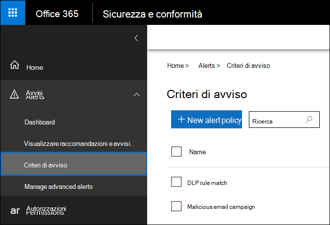
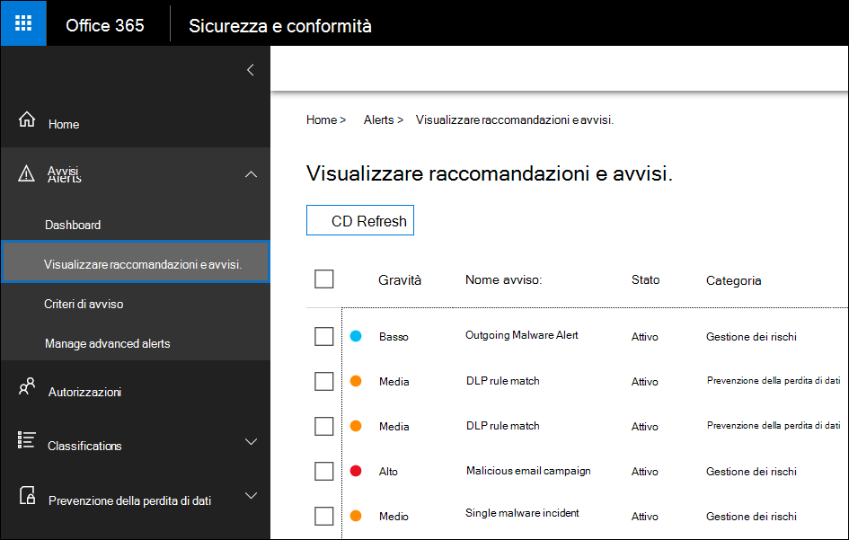

# <a name="alert-policies-in-the-security-and-compliance-center"></a>Criteri di avviso nel Centro sicurezza e conformità

È possibile utilizzare i criteri di avviso e gli strumenti del dashboard di avviso nei centri di sicurezza e conformità di Microsoft 365 per creare criteri di avviso e quindi visualizzare gli avvisi generati quando gli utenti eseguono attività che soddisfano le condizioni di un criterio di avviso. Sono disponibili diversi criteri di avviso predefiniti che consentono di monitorare le attività, ad esempio l'assegnazione dei privilegi di amministratore in Exchange Online, gli attacchi di malware, le campagne di phishing e i livelli inusuali di eliminazione dei file e la condivisione esterna.

I criteri di avviso consentono di suddividere in categorie gli avvisi attivati da un criterio, applicare il criterio a tutti gli utenti dell'organizzazione, impostare un livello di soglia per il momento in cui viene attivato un avviso e decidere se ricevere notifiche tramite posta elettronica quando vengono attivati gli avvisi. È inoltre disponibile una pagina **Visualizza avvisi** nel centro sicurezza e conformità in cui è possibile visualizzare e filtrare gli avvisi, impostare lo stato di avviso per la gestione degli avvisi e quindi ignorare gli avvisi dopo aver affrontato o risolto l'evento sottostante.

> [!NOTE]
> I criteri di avviso sono disponibili per le organizzazioni che dispongono di un abbonamento a Microsoft 365 Enterprise, Office 365 Enterprise o Office 365 US Government E1/F1/G1, E3/G3 o E5/G5. La funzionalità avanzata è disponibile solo per le organizzazioni con un abbonamento E5/G5 o per le organizzazioni che dispongono di un abbonamento E1/F1/G1 o E3/G3 e di una sottoscrizione di Office 365 Advanced Threat Protection (ATP) P2 o Microsoft 365 E5 o Microsoft 365 E5 eDiscovery e l'abbonamento di controllo del componente aggiuntivo. In questo argomento è evidenziata la funzionalità che richiede un abbonamento E5/G5 o un componente aggiuntivo. Si noti inoltre che i criteri di avviso sono disponibili in Office 365 GCC, GCC High e DoD US Government environments.

## <a name="how-alert-policies-work"></a>Funzionamento di criteri di avviso

Di seguito viene illustrata una breve panoramica del funzionamento dei criteri di avviso e degli avvisi attivati quando l'attività dell'utente o dell'amministratore corrisponde alle condizioni di un criterio di avviso.


1. Un amministratore dell'organizzazione crea, configura e attiva un criterio di avviso utilizzando la pagina **criteri di avviso** nel centro sicurezza e conformità. È inoltre possibile creare criteri di avviso utilizzando il cmdlet **New-ProtectionAlert** in PowerShell per il centro sicurezza & Compliance. Per creare criteri di avviso, è necessario assegnare il ruolo Gestisci avvisi o il ruolo Configurazione organizzazione nel centro sicurezza e conformità.

   > [!NOTE]
   > Dopo aver creato o aggiornato un criterio di avviso, sono necessari fino a 24 ore prima che i criteri vengano attivati dagli avvisi. Ciò è dovuto al fatto che i criteri devono essere sincronizzati con il motore di rilevamento degli avvisi.

2. Un utente esegue un'attività che soddisfa le condizioni di un criterio di avviso. In caso di attacchi di malware, i messaggi di posta elettronica infetti inviati agli utenti dell'organizzazione attivano un avviso.

3. Microsoft 365 genera un avviso visualizzato nella pagina **Visualizza avvisi** nel centro sicurezza & conformità. Inoltre, se le notifiche di posta elettronica sono abilitate per il criterio di avviso, Microsoft invia una notifica a un elenco di destinatari. Gli avvisi che un amministratore o altri utenti possono vedere che nella pagina Visualizza avvisi è determinato dai ruoli assegnati all'utente. Per ulteriori informazioni, vedere la sezione [autorizzazioni RBAC necessarie per visualizzare gli avvisi](#rbac-permissions-required-to-view-alerts) .

4. Un amministratore gestisce gli avvisi nel centro sicurezza e conformità. La gestione degli avvisi consiste nell'assegnare uno stato di avviso che consenta di monitorare e gestire qualsiasi indagine.

## <a name="alert-policy-settings"></a>Impostazioni di criteri di avviso

Un criterio di avviso è costituito da un insieme di regole e condizioni che definiscono l'attività dell'utente o dell'amministratore che genera un avviso, un elenco di utenti che attivano l'avviso se eseguono l'attività e una soglia che definisce il numero di volte in cui l'attività deve verificarsi prima che venga attivato un avviso. È inoltre possibile suddividere in categorie il criterio e assegnargli un livello di gravità. Queste due impostazioni consentono di gestire i criteri di avviso (e gli avvisi attivati quando vengono soddisfatte le condizioni dei criteri) perché è possibile filtrare queste impostazioni quando si gestiscono i criteri e si visualizzano gli avvisi nel centro sicurezza e conformità. Ad esempio, è possibile visualizzare gli avvisi che soddisfano le condizioni della stessa categoria o visualizzare gli avvisi con lo stesso livello di gravità.

Per visualizzare e creare criteri di avviso, passare a [https://protection.office.com](https://protection.office.com) e selezionare **avvisi** per i \> **criteri di avviso**.



Un criterio di avviso è costituito dalle impostazioni e dalle condizioni seguenti.

- **Attività l'avviso sta verificando** : si crea un criterio per tenere traccia di un'attività o in alcuni casi alcune attività correlate, ad esempio la condivisione di un file con un utente esterno, la condivisione, l'assegnazione di autorizzazioni di accesso o la creazione di un collegamento anonimo. Quando un utente esegue l'attività definita dal criterio, viene attivato un avviso in base alle impostazioni della soglia di avviso.

    > [!NOTE]
    > Le attività che è possibile monitorare dipendono dal piano di amministrazione dell'organizzazione Office 365 Enterprise o Office 365 US. In generale, le attività relative alle campagne antimalware e agli attacchi di phishing richiedono un abbonamento E5/G5 o un abbonamento E1/F1/G1 o E3/G3 con un abbonamento al componente aggiuntivo di [Office 365 Advanced Threat Protection](../security/office-365-security/office-365-atp.md) Plan 2.

- **Condizioni di attività** -per la maggior parte delle attività, è possibile definire condizioni aggiuntive che devono essere soddisfatte per attivare un avviso. Le condizioni comuni includono gli indirizzi IP (in modo che venga attivato un avviso quando l'utente esegue l'attività su un computer con un indirizzo IP specifico o all'interno di un intervallo di indirizzi IP), se un avviso viene attivato se un utente o gli utenti specifici eseguono tale attività e se l'attività viene eseguita su un nome di file o un URL specifico. È inoltre possibile configurare una condizione che attiva un avviso quando l'attività viene eseguita da qualsiasi utente dell'organizzazione. Le condizioni disponibili dipendono dall'attività selezionata.

- **Quando si attiva l'avviso** , è possibile configurare un'impostazione che definisce la frequenza con cui è possibile eseguire un'attività prima che venga attivato un avviso. In questo modo è possibile impostare un criterio per generare un avviso ogni volta che un'attività corrisponde alle condizioni dei criteri, quando si supera una determinata soglia o quando si verifica l'insorgenza dell'attività in cui l'avviso è inusuale per l'organizzazione.

    

    Se si seleziona l'impostazione in base alle attività inusuali, Microsoft stabilisce un valore di base che definisce la frequenza normale per l'attività selezionata. Per definire questa linea di base, sono necessari fino a sette giorni, durante i quali gli avvisi non verranno generati. Dopo che la linea di base è stata stabilita, viene attivato un avviso quando la frequenza dell'attività registrata dal criterio di avviso è notevolmente superiore al valore di base. Per le attività relative al controllo, ad esempio attività per file e cartelle, è possibile stabilire una linea di base basata su un singolo utente o su tutti gli utenti dell'organizzazione. per le attività correlate al malware, è possibile stabilire una linea di base basata su una singola famiglia di malware, un singolo destinatario o tutti i messaggi nell'organizzazione.

    > [!NOTE]
    > La possibilità di configurare i criteri di avviso basati su una soglia o in base a attività insolite richiede un abbonamento E5/G5 oppure un abbonamento E1/F1/G1 o E3/G3 con una sottoscrizione di Office 365 ATP P2, Microsoft 365 E5 o Microsoft 365 eDiscovery e l'abbonamento al componente aggiuntivo audit. Le organizzazioni che dispongono di un abbonamento E1/F1/G1 e E3/G3 possono creare solo criteri di avviso in cui viene attivato un avviso ogni volta che si verifica un'attività.

- **Categoria avviso** : per facilitare la verifica e la gestione degli avvisi generati da un criterio, è possibile assegnare una delle categorie seguenti a un criterio.

  - Prevenzione della perdita di dati

  - Governance delle informazioni

  - Flusso di posta

  - Autorizzazioni

  - Gestione dei rischi

  - Altri

  Quando si verifica un'attività che corrisponde alle condizioni dei criteri di avviso, l'avviso generato viene contrassegnato con la categoria definita in questa impostazione. In questo modo è possibile monitorare e gestire gli avvisi con la stessa impostazione di categoria nella pagina **Visualizza avvisi** nel centro sicurezza e conformità, in quanto consente di ordinare e filtrare gli avvisi in base alla categoria.

- **Severità degli avvisi** -analoga alla categoria di avviso, è possibile assegnare un attributo Severity (**basso**, **medio**, **alto**o **informativo**) ai criteri di avviso. Analogamente alla categoria avviso, quando si verifica un'attività che corrisponde alle condizioni del criterio di avviso, l'avviso generato viene contrassegnato con lo stesso livello di gravità impostato per il criterio di avviso. Di nuovo, in questo modo è possibile monitorare e gestire gli avvisi che hanno la stessa impostazione di gravità nella pagina **Visualizza avvisi** . Ad esempio, è possibile filtrare l'elenco di avvisi in modo che vengano visualizzati solo gli avvisi con un livello di gravità **elevato** .

    > [!TIP]
    > Quando si configura un criterio di avviso, è consigliabile assegnare un livello di gravità maggiore alle attività che possono comportare conseguenze gravemente negative, ad esempio il rilevamento di malware dopo il recapito agli utenti, la visualizzazione di dati sensibili o classificati, la condivisione di dati con utenti esterni o altre attività che possono causare perdite di dati o minacce alla sicurezza. In questo modo è possibile definire la priorità per gli avvisi e le azioni da intraprendere per analizzare e risolvere le cause sottostanti.

- **Notifiche tramite posta elettronica** -è possibile configurare i criteri in modo che le notifiche di posta elettronica vengano inviate (o non inviate) a un elenco di utenti quando si attiva un avviso. È inoltre possibile impostare un limite di notifica giornaliero in modo che, dopo aver raggiunto il numero massimo di notifiche, non vengano inviate altre notifiche per l'avviso durante quel giorno. Oltre alle notifiche tramite posta elettronica, l'utente o altri amministratori possono visualizzare gli avvisi attivati da un criterio nella pagina **Visualizza avvisi** . È consigliabile abilitare le notifiche di posta elettronica per i criteri di avviso di una categoria specifica o che dispongono di un'impostazione di gravità maggiore.

## <a name="default-alert-policies"></a>Criteri di avviso predefiniti

Microsoft fornisce criteri di avviso incorporati che consentono di identificare l'abuso delle autorizzazioni di amministratore di Exchange, l'attività antimalware, potenziali minacce esterne e interne e rischi di governance delle informazioni. Nella pagina **criteri di avviso** i nomi di questi criteri incorporati sono in grassetto e il tipo di criterio è definito come **System**. Questi criteri sono attivati per impostazione predefinita. È possibile disattivare questi criteri (o viceversa), configurare un elenco di destinatari a cui inviare notifiche tramite posta elettronica e impostare un limite di notifica giornaliero. Le altre impostazioni per questi criteri non possono essere modificate.

Nella tabella seguente sono elencati e descritti i criteri di avviso predefiniti disponibili e la categoria a cui sono assegnati tutti i criteri. La categoria viene utilizzata per determinare gli avvisi che un utente può visualizzare nella pagina Visualizza avvisi. Per ulteriori informazioni, vedere la sezione [autorizzazioni RBAC necessarie per visualizzare gli avvisi](#rbac-permissions-required-to-view-alerts) .

La tabella indica anche il piano Office 365 Enterprise and Office 365 US Government obbligatorio per ognuno di essi. Alcuni criteri di avviso predefiniti sono disponibili se l'organizzazione ha la sottoscrizione del componente aggiuntivo appropriata oltre a una sottoscrizione E1/F1/G1 o E3/G3.

|**Criterio di avviso predefinito**|**Descrizione**|**Categoria**|**Abbonamento a Office 365 Enterprise**|
|:-----|:-----|:-----|:-----|
|**È stato rilevato un clic URL potenzialmente dannoso**|Genera un avviso quando un utente protetto da [collegamenti sicuri ATP di Office 365](../security/office-365-security/atp-safe-links.md) nell'organizzazione fa clic su un collegamento dannoso. Questo evento viene attivato quando le modifiche al verdetto degli URL sono identificate da Office 365 ATP o quando gli utenti eseguono l'override delle pagine di collegamenti sicuri ATP di Office 365 (in base al criterio collegamenti sicuri ATP Microsoft 365 for business dell'organizzazione). Questo criterio di avviso ha un'impostazione di gravità **elevata** . Per i clienti di Office 365 ATP P2, E5 e G5, questo avviso attiva automaticamente l' [analisi e la risposta automatizzate in office 365](https://docs.microsoft.com/microsoft-365/security/office-365-security/office-365-air). Per ulteriori informazioni sugli eventi che attivano questo avviso, vedere [set up Office 365 ATP Safe Links Policies](../security/office-365-security/set-up-atp-safe-links-policies.md).|Gestione dei rischi|Sottoscrizione di un componente aggiuntivo per i componenti aggiuntivi di E5/G5 o Office 365 ATP P2|
|**Risultato dell'invio dell'amministratore completato**|Genera un avviso quando l' [invio](../security/office-365-security/admin-submission.md) di un amministratore completa la ripetizione dell'analisi dell'entità inviata. Un avviso verrà attivato ogni volta che viene eseguito il rendering di un risultato di rianalisi da un invio di amministratore. Questi avvisi devono ricordare di [esaminare i risultati degli invii precedenti](https://protection.office.com/reportsubmission), inviare messaggi segnalati dall'utente per ottenere il controllo dei criteri più recente e ripetere l'analisi dei verdetti e aiutare a determinare se i criteri di filtro nell'organizzazione hanno l'impatto previsto. Questo criterio ha un'impostazione di gravità **bassa** .|Gestione dei rischi|E1/F1, E3 o E5|
|**Creazione di una regola di inoltro/Reindirizzamento**|Genera un avviso quando un utente dell'organizzazione crea una regola di posta in arrivo per la propria cassetta postale che inoltra o reindirizza i messaggi a un altro account di posta elettronica. Questo criterio tiene traccia solo le regole della posta in arrivo create utilizzando Outlook sul Web (in precedenza noto come Outlook Web App) o Exchange Online PowerShell. Questo criterio ha un'impostazione di gravità **bassa** . Per ulteriori informazioni sull'utilizzo delle regole di posta in arrivo per inoltrare e reindirizzare la posta elettronica in Outlook sul Web, vedere [use rules in Outlook sul Web per inoltrare automaticamente i messaggi a un altro account](https://support.office.com/article/1433e3a0-7fb0-4999-b536-50e05cb67fed).|Gestione dei rischi|E1/F1/G1, E3/G3 o E5/G5|
|**ricerca eDiscovery avviata o esportata**|Genera un avviso quando qualcuno utilizza lo strumento di ricerca contenuto nel centro sicurezza e conformità. Viene attivato un avviso quando vengono eseguite le attività di ricerca del contenuto seguenti: <br/><br/>* Viene avviata una ricerca di contenuto<br/>* Vengono esportati i risultati di una ricerca di contenuto<br/>* Viene esportato un report di ricerca contenuto<br/><br/>Gli avvisi vengono attivati anche quando le attività di ricerca di contenuto precedenti vengono eseguite in associazione a un caso di eDiscovery. Questo criterio ha un'impostazione di gravità **media** . Per ulteriori informazioni sulle attività di ricerca del contenuto, vedere [ricerca di attività di eDiscovery nel registro di controllo](search-for-ediscovery-activities-in-the-audit-log.md#ediscovery-activities).|Gestione dei rischi|E1/F1/G1, E3/G3 o E5/G5|
|**Privilegi di amministratore di Exchange per l'elevazione**|Genera un avviso quando a un utente sono assegnate autorizzazioni amministrative nell'organizzazione di Exchange Online. Ad esempio, quando un utente viene aggiunto al gruppo di ruoli Gestione organizzazione in Exchange Online. Questo criterio ha un'impostazione di gravità **bassa** .|Autorizzazioni|E1/F1/G1, E3/G3 o E5/G5|
|**Messaggi di posta elettronica contenenti malware rimossi dopo il recapito**|Genera un avviso quando tutti i messaggi contenenti malware vengono recapitati alle cassette postali dell'organizzazione. Se si verifica questo evento, Microsoft rimuove i messaggi infetti dalle cassette postali di Exchange Online utilizzando l' [eliminazione automatica zero-hour](../security/office-365-security/zero-hour-auto-purge.md). Questo criterio ha un livello di gravità **informativo** e attiva automaticamente l' [analisi e la risposta automatizzata in Office 365](https://docs.microsoft.com/microsoft-365/security/office-365-security/office-365-air).|Gestione dei rischi|Sottoscrizione di un componente aggiuntivo per i componenti aggiuntivi di E5/G5 o Office 365 ATP P2|
|**Messaggi di posta elettronica contenenti gli URL di phishing rimossi dopo il recapito**|Genera un avviso quando tutti i messaggi contenenti phishing vengono recapitati alle cassette postali dell'organizzazione. Se si verifica questo evento, Microsoft rimuove i messaggi infetti dalle cassette postali di Exchange Online utilizzando l' [eliminazione automatica zero-hour](../security/office-365-security/zero-hour-auto-purge.md). Questo criterio ha un livello di gravità **informativo** e attiva automaticamente l' [analisi e la risposta automatizzata in Office 365](https://docs.microsoft.com/microsoft-365/security/office-365-security/office-365-air).|Gestione dei rischi|Sottoscrizione di un componente aggiuntivo per i componenti aggiuntivi di E5/G5 o Office 365 ATP P2|
|**Messaggi di posta elettronica segnalati dall'utente come malware o phishing**|Genera un avviso quando gli utenti dell'organizzazione segnalano i messaggi come messaggio di posta elettronica di phishing tramite il componente aggiuntivo per i messaggi di report. Questo criterio ha un livello di gravità **informativo** . Per ulteriori informazioni su questo componente aggiuntivo, vedere [use the report Message Add-in](https://support.office.com/article/b5caa9f1-cdf3-4443-af8c-ff724ea719d2). Per i clienti di Office 365 ATP P2, E5 e G5, questo avviso attiva automaticamente l' [analisi e la risposta automatizzate in office 365](https://docs.microsoft.com/microsoft-365/security/office-365-security/office-365-air).|Gestione dei rischi|E1/F1/G1, E3/G3 o E5/G5|
|**Limite di invio di posta elettronica superato**|Genera un avviso quando un utente dell'organizzazione ha inviato più messaggi rispetto a quelli consentiti dal criterio di posta indesiderata in uscita. Si tratta in genere di un'indicazione che l'utente sta inviando troppi messaggi di posta elettronica o che l'account potrebbe essere compromesso. Questo criterio ha un'impostazione di gravità **media** . Se si riceve un avviso generato da questo criterio di avviso, è consigliabile [verificare se l'account utente è stato compromesso](../security/office-365-security/responding-to-a-compromised-email-account.md).|Gestione dei rischi|E1/F1/G1, E3/G3 o E5/G5|
|**I messaggi sono stati ritardati**|Genera un avviso quando Microsoft non è in grado di recapitare messaggi di posta elettronica all'organizzazione locale o a un server partner utilizzando un connettore. In questo caso, il messaggio viene accodato in Office 365. Questo avviso viene attivato quando sono presenti 2.000 messaggi o più che sono stati accodati per più di un'ora. Questo criterio è impostato **su un livello** di gravità elevato.|Flusso di posta|E1/F1/G1, E3/G3 o E5/G5|
|**Campagna malware rilevata dopo il recapito**|Genera un avviso quando un numero insolitamente elevato di messaggi contenenti malware viene recapitato alle cassette postali dell'organizzazione. Se si verifica questo evento, Microsoft rimuove i messaggi infetti dalle cassette postali di Exchange Online. Questo criterio è impostato **su un livello** di gravità elevato.|Gestione dei rischi|Sottoscrizione di un componente aggiuntivo per i componenti aggiuntivi di E5/G5 o Office 365 ATP P2|
|**La campagna antimalware è stata rilevata e bloccata**|Genera un avviso quando un utente ha tentato di inviare un numero insolitamente elevato di messaggi di posta elettronica contenenti un determinato tipo di malware per gli utenti dell'organizzazione. Se si verifica questo evento, i messaggi infetti vengono bloccati da Microsoft e non vengono recapitati alle cassette postali. Questo criterio ha un'impostazione di gravità **bassa** .|Gestione dei rischi|Sottoscrizione di un componente aggiuntivo per i componenti aggiuntivi di E5/G5 o Office 365 ATP P2|
|**La campagna antimalware rilevata in SharePoint e OneDrive**|Genera un avviso quando un volume insolitamente elevato di malware o virus viene rilevato nei file che si trovano in siti di SharePoint o negli account di OneDrive nell'organizzazione. Questo criterio è impostato **su un livello** di gravità elevato.|Gestione dei rischi|Sottoscrizione di un componente aggiuntivo per i componenti aggiuntivi di E5/G5 o Office 365 ATP P2|
|**Phishing recapitato a causa di override del tenant o dell'utente**<sup>1</sup>|Genera un avviso quando Microsoft rileva che un amministratore o un override dell'utente ha consentito la recapito di un messaggio di phishing a una cassetta postale. Esempi di sostituzioni includono una regola di posta in arrivo o flusso di posta che consente messaggi provenienti da un mittente o da un dominio specifico oppure da un criterio di protezione da posta indesiderata che consente messaggi provenienti da mittenti o domini specifici Questo criterio è impostato **su un livello** di gravità elevato.|Gestione dei rischi|Sottoscrizione di un componente aggiuntivo per i componenti aggiuntivi di E5/G5 o Office 365 ATP P2|
|**Modelli di invio di messaggi di posta elettronica sospetti**|Genera un avviso quando un utente dell'organizzazione ha inviato messaggi di posta elettronica sospetti ed è a rischio di essere limitato dall'invio di messaggi di posta elettronica. Si tratta di un avviso iniziale per il comportamento che potrebbe indicare che l'account è stato compromesso, ma non abbastanza grave da limitare l'utente. Questo criterio ha un'impostazione di gravità **media** . Anche se è raro, un avviso generato da questo criterio potrebbe essere un'anomalia. Tuttavia, è consigliabile [verificare se l'account utente è stato compromesso](../security/office-365-security/responding-to-a-compromised-email-account.md).|Gestione dei rischi|E1/F1/G1, E3/G3 o E5/G5  |
|**Tenant con limitazioni all'invio di posta elettronica**|Genera un avviso quando la maggior parte del traffico di posta elettronica proveniente dall'organizzazione è stata rilevata come sospetta e Microsoft ha limitato l'organizzazione all'invio di posta elettronica. Esaminare gli account utente e di amministratore potenzialmente compromessi, i nuovi connettori o i relè aperti e quindi contattare il supporto tecnico Microsoft per sbloccare l'organizzazione. Questo criterio è impostato **su un livello** di gravità elevato. Per ulteriori informazioni su perché le organizzazioni sono bloccate, vedere [risolvere i problemi di recapito della posta elettronica per il codice di errore 5.7.7 XX in Exchange Online](https://go.microsoft.com/fwlink/?linkid=2022138).|Gestione dei rischi|E1/F1/G1, E3/G3 o E5/G5|
|**Attività di file utente esterne insolite**|Genera un avviso quando un numero insolitamente elevato di attività viene eseguito su file in SharePoint o OneDrive da parte di utenti esterni all'organizzazione. Sono incluse attività quali l'accesso ai file, il download di file e l'eliminazione di file. Questo criterio è impostato **su un livello** di gravità elevato.|Governance delle informazioni|Abbonamento al componente aggiuntivo E5/G5, Office 365 ATP P2 o Microsoft 365 E5|
|**Volume insolito di condivisione di file esterni**|Genera un avviso quando un numero insolitamente elevato di file in SharePoint o OneDrive viene condiviso con utenti esterni all'organizzazione. Questo criterio ha un'impostazione di gravità **media** .|Governance delle informazioni|Abbonamento al componente aggiuntivo E5/G5, Office 365 ATP P2 o Microsoft 365 E5|
|**Volume insolito di eliminazione dei file**|Genera un avviso quando un numero insolitamente elevato di file viene eliminato in SharePoint o OneDrive in un intervallo di tempo breve. Questo criterio ha un'impostazione di gravità **media** .|Governance delle informazioni|Abbonamento al componente aggiuntivo E5/G5, Office 365 ATP P2 o Microsoft 365 E5|
|**Aumento insolito del messaggio di posta elettronica riportato come phishing**|Genera un avviso quando si verifica un aumento significativo del numero di persone nell'organizzazione che utilizzano il componente aggiuntivo segnala messaggio in Outlook per segnalare i messaggi come messaggio di posta elettronica di phishing. Questo criterio è impostato **su un livello** di gravità elevato. Per ulteriori informazioni su questo componente aggiuntivo, vedere [use the report Message Add-in](https://support.office.com/article/b5caa9f1-cdf3-4443-af8c-ff724ea719d2).|Gestione dei rischi|Sottoscrizione di un componente aggiuntivo per i componenti aggiuntivi di E5/G5 o Office 365 ATP P2|
|**Phishing rappresentazione utente recapitata in posta in arrivo/cartella**<sup>1,</sup><sup>2</sup>|Genera un avviso quando Microsoft rileva che un amministratore o un override dell'utente ha consentito il recapito di un messaggio di phishing della rappresentazione dell'utente alla posta in arrivo (o a un'altra cartella accessibile dall'utente) di una cassetta postale. Esempi di sostituzioni includono una regola di posta in arrivo o flusso di posta che consente messaggi provenienti da un mittente o da un dominio specifico oppure da un criterio di protezione da posta indesiderata che consente messaggi provenienti da mittenti o domini specifici Questo criterio ha un'impostazione di gravità **media** .|Gestione dei rischi|Sottoscrizione di un componente aggiuntivo per i componenti aggiuntivi di E5/G5 o Office 365 ATP P2|
|**Utente con limitazioni all'invio di posta elettronica**|Genera un avviso quando un utente dell'organizzazione ha la limitazione di inviare la posta in uscita. Questo in genere risulta quando un account è compromesso e l'utente è elencato nella pagina **utenti con restrizioni** nel centro sicurezza & conformità. Per accedere a questa pagina, passare a **threat management > Review > utenti con restrizioni**). Questo criterio è impostato **su un livello** di gravità elevato. Per ulteriori informazioni sugli utenti con restrizioni, vedere [rimozione di un utente, dominio o indirizzo IP da un elenco di blocco dopo l'invio di posta indesiderata](https://docs.microsoft.com/office365/securitycompliance/removing-user-from-restricted-users-portal-after-spam).|Gestione dei rischi|E1/F1/G1, E3/G3 o E5/G5|
|||||

> [!NOTE]
> <sup>1</sup> è stato temporaneamente rimosso questo criterio di avviso predefinito in base al feedback dei clienti. Stiamo lavorando per migliorarlo e lo rimpiazzerà con una nuova versione nel prossimo futuro. Fino a quel momento, è possibile creare un criterio di avviso personalizzato per sostituire questa funzionalità utilizzando le impostazioni seguenti:<br/>&nbsp; * L'attività è phishing posta elettronica rilevato al momento del parto<br/>&nbsp; * Mail non è ZAP ' d<br/>&nbsp; * La direzione della posta è in ingresso<br/>&nbsp; * Lo stato di recapito della posta viene recapitato<br/>&nbsp; * La tecnologia di rilevamento è la conservazione di URL dannosi, la detonazione degli URL, il filtro phishing avanzato, il filtro phishing generale, la rappresentazione del dominio, la rappresentazione dell'utente e la rappresentazione del marchio<br/><br/>&nbsp;&nbsp;&nbsp;Per ulteriori informazioni su anti-phishing in Office 365, vedere [set up anti-phishing and anti-phishing Policies](../security/office-365-security/set-up-anti-phishing-policies.md).<br/><br/><sup>2</sup> per ricreare questo criterio di avviso, seguire le indicazioni riportate nella nota a piè di pagina precedente, ma scegliere rappresentazione utente come unica tecnologia di rilevamento.

Le attività insolite monitorate da alcuni dei criteri incorporati si basano sullo stesso processo dell'impostazione della soglia di avviso descritta in precedenza. Microsoft stabilisce un valore di base che definisce la frequenza normale per l'attività "usuale". Gli avvisi vengono quindi attivati quando la frequenza delle attività monitorate dal criterio di avviso incorporato supera notevolmente il valore previsto.

## <a name="viewing-alerts"></a>Visualizzazione degli avvisi

Quando un'attività eseguita dagli utenti nell'organizzazione corrisponde alle impostazioni di un criterio di avviso, viene generato un avviso e visualizzato nella pagina **Visualizza avvisi** nel centro sicurezza e conformità. A seconda delle impostazioni di un criterio di avviso, una notifica di posta elettronica viene inviata anche a un elenco di utenti specificati quando si attiva un avviso. Per ogni avviso, il dashboard nella pagina **Visualizza avvisi** Visualizza il nome del criterio di avviso corrispondente, la gravità e la categoria dell'avviso (definiti nel criterio di avviso) e il numero di volte in cui si è verificata un'attività che ha determinato la generazione dell'avviso. Questo valore si basa sull'impostazione di soglia del criterio di avviso. Il dashboard Visualizza anche lo stato di ogni avviso. Per ulteriori informazioni sull'utilizzo della proprietà Status per gestire gli avvisi, vedere la sezione [Managing Alerts](#managing-alerts) .

Per visualizzare gli avvisi, passare a [https://protection.office.com](https://protection.office.com) e quindi selezionare **avvisi** \> **Visualizza**avvisi.



È possibile utilizzare i seguenti filtri per visualizzare un sottoinsieme di tutti gli avvisi nella pagina **Visualizza avvisi** .

- **Stato.** Utilizzare questo filtro per visualizzare gli avvisi a cui è assegnato un determinato stato. Lo stato predefinito è **attivo**. Il valore dello stato può essere modificato da un utente o da altri amministratori.

- **Politica.** Utilizzare questo filtro per visualizzare gli avvisi che corrispondono all'impostazione di uno o più criteri di avviso. In alternativa, è possibile visualizzare tutti gli avvisi per tutti i criteri di avviso.

- **Intervallo di tempo.** Utilizzare questo filtro per visualizzare gli avvisi generati all'interno di un intervallo di tempo e data specifici.

- **Gravità.** Utilizzare questo filtro per visualizzare gli avvisi a cui viene assegnata una gravità specifica.

- **Categoria.** Utilizzare questo filtro per visualizzare gli avvisi di una o più categorie di avvisi.

- **Fonte.** Utilizzare questo filtro per visualizzare gli avvisi attivati dai criteri di avviso nel centro sicurezza e conformità o gli avvisi attivati dai criteri di sicurezza di Office 365 cloud app o entrambi. Per ulteriori informazioni sugli avvisi di sicurezza per le app di Office 365 cloud, vedere la sezione [Visualizzazione avvisi di sicurezza per le app Cloud](#viewing-cloud-app-security-alerts) .

## <a name="alert-aggregation"></a>Aggregazione degli avvisi

Quando più eventi che soddisfano le condizioni di un criterio di avviso si verificano con un breve periodo di tempo, vengono aggiunti a un avviso esistente tramite un processo denominato *aggregazione avvisi*. Quando un evento attiva un avviso, l'avviso viene generato e visualizzato nella pagina **Visualizza avvisi** e viene inviata una notifica. Se si verifica lo stesso evento all'interno dell'intervallo di aggregazione, Microsoft 365 aggiunge dettagli sul nuovo evento all'avviso esistente anziché attivare un nuovo avviso. L'obiettivo dell'aggregazione degli avvisi consiste nel contribuire a ridurre l'avviso "affaticamento" e a concentrarsi e a intervenire su un numero inferiore di avvisi per lo stesso evento.

La durata dell'intervallo di aggregazione dipende dall'abbonamento a Office 365 o Microsoft 365.

|Abbonamento|Intervallo di aggregazione|
|:---------|:---------:|
|Office 365 o Microsoft 365 E5/G5|1 minuto|
|Office 365 ATP Piano 2 |1 minuto|
|Componente aggiuntivo per la conformità E5 o per l'individuazione e l'identificazione di controllo|1 minuto|
|Office 365 o Microsoft 365 E1/F1/G1 o E3/F3/G3|15 minuti|
|Office 365 ATP piano 1 o Exchange Online Protection|15 minuti|
|||

Quando gli eventi che corrispondono allo stesso criterio di avviso si verificano all'interno dell'intervallo di aggregazione, i dettagli sull'evento successivo vengono aggiunti all'avviso originale. Per tutti gli eventi, le informazioni sugli eventi aggregati vengono visualizzate nel campo Details e il numero di volte in cui si è verificato un evento con l'intervallo di aggregazione viene visualizzato nel campo attività/hit count. È possibile visualizzare ulteriori informazioni su tutte le istanze di eventi aggregati visualizzando l'elenco attività.

Nella schermata seguente viene mostrato un avviso con quattro eventi aggregati. L'elenco attività contiene informazioni sui quattro messaggi di posta elettronica rilevanti per l'avviso.


Tenere presenti le considerazioni seguenti sull'aggregazione degli avvisi:

- Gli avvisi attivati dal **clic su un URL potenzialmente dannoso sono stati rilevati** i [criteri di avviso predefiniti](#default-alert-policies) non vengono aggregati. Ciò è dovuto al fatto che gli avvisi attivati da questo criterio sono univoci per ogni utente e messaggio di posta elettronica.

- A questo punto, la proprietà avviso di **hit count** non indica il numero di eventi aggregati per tutti i criteri di avviso. Per gli avvisi attivati da questi criteri di avviso, è possibile visualizzare gli eventi aggregati facendo clic su **Visualizza elenco messaggi** o su **attività di visualizzazione** nell'avviso. Stiamo lavorando per rendere il numero di eventi aggregati elencati nella proprietà Alert **count hit** disponibile per tutti i criteri di avviso.

## <a name="rbac-permissions-required-to-view-alerts"></a>Autorizzazioni RBAC necessarie per visualizzare gli avvisi

Le autorizzazioni di controllo di accesso basato sui ruoli (RBAC) assegnate agli utenti nell'organizzazione determinano gli avvisi che un utente può visualizzare nella pagina **Visualizza avvisi** . Come è possibile eseguire questa operazione? I ruoli di gestione assegnati agli utenti (in base alla loro appartenenza ai gruppi di ruoli nel centro sicurezza & conformità) determinano le categorie di avvisi che un utente può visualizzare nella pagina **Visualizza avvisi** . Ecco alcuni esempi:

- I membri del gruppo di ruoli Gestione record possono visualizzare solo gli avvisi generati dai criteri di avviso a cui viene assegnata la categoria di **governance delle informazioni** .

- I membri del gruppo di ruoli amministratore conformità non possono visualizzare gli avvisi generati dai criteri di avviso a cui è assegnata la categoria **gestione minacce** .

- I membri del gruppo di ruoli eDiscovery Manager non sono in grado di visualizzare gli avvisi perché nessuno dei ruoli assegnati fornisce l'autorizzazione per visualizzare gli avvisi da qualsiasi categoria di avviso.

Questa struttura (in base alle autorizzazioni RBAC) consente di determinare gli avvisi che possono essere visualizzati (e gestiti) dagli utenti in ruoli specifici per i processi nell'organizzazione.

Nella tabella seguente sono elencati i ruoli necessari per visualizzare gli avvisi dalle sei diverse categorie di avviso. La prima colonna nelle tabelle elenca tutti i ruoli nel centro sicurezza & conformità.  Un segno di spunta indica che un utente a cui è assegnato il ruolo può visualizzare gli avvisi dalla categoria di avviso corrispondente elencata nella riga superiore.

Per visualizzare la categoria a cui è assegnato un criterio di avviso predefinito, vedere la tabella nella sezione [criteri di avviso predefiniti](#default-alert-policies) .

|Ruolo|Governance delle informazioni|Prevenzione della perdita di dati|Flusso di posta|Autorizzazioni|Gestione dei rischi|Altri|
|:---------|:---------:|:---------:|:---------:|:---------:|:---------:|:---------:|
|Registri di controllo|||||||
|Gestione dei casi|||||||
|Amministratore di conformità|||||||
|Ricerca di conformità|||||||
|Gestione dei dispositivi|||||||
|Gestione della disposizione|||||||
|Gestione della conformità DLP|||||||
|Esporta|||||||
|Hold|||||||
|Gestione avvisi|||||||
|Configurazione dell'organizzazione|||||||
|Anteprima|||||||
|Gestione dei record|||||||
|Gestione della conservazione|||||||
|Revisione|||||||
|Decrittografia RMS|||||||
|Gestione dei ruoli|||||||
|Ricerca ed eliminazione|||||||
|Amministratore della sicurezza|||||||
|Ruolo con autorizzazioni di lettura per la sicurezza||||||
|Visualizzazione garanzia del servizio|||||||
|Amministratore revisione di supervisione|||||||
|Registri di controllo di sola visualizzazione|||||||
|Gestione dei dispositivi di sola visualizzazione|||||||
|Gestione della conformità DLP solo visualizzazione|||||||
|Visualizzazione-solo Gestione avvisi|||||||
|Destinatari solo visualizzazione|||  ||||
|Gestione dei record di sola visualizzazione|||||||
|Gestione della conservazione in sola visualizzazione|||||||
|||||||

**Suggerimento:** Per visualizzare i ruoli assegnati a ognuno dei gruppi di ruoli predefiniti, eseguire i comandi seguenti in PowerShell per il Centro sicurezza & Compliance:

```PowerShell
$RoleGroups = Get-RoleGroup
```

```PowerShell
$RoleGroups | foreach {Write-Output -InputObject `r`n,$_.Name,"-----------------------"; Get-RoleGroup $_.Identity | Select-Object -ExpandProperty Roles}
```

È inoltre possibile visualizzare i ruoli assegnati a un gruppo di ruoli nel centro sicurezza & conformità. Passare alla pagina **autorizzazioni** e selezionare un gruppo di ruoli. I ruoli assegnati sono elencati nella pagina a comparsa.

## <a name="managing-alerts"></a>Gestione degli avvisi

Dopo che gli avvisi sono stati generati e visualizzati nella pagina **Visualizza avvisi** nel centro sicurezza e conformità, è possibile eseguire la valutazione, l'analisi e la risoluzione dei problemi. Di seguito sono riportate alcune attività che è possibile eseguire per gestire gli avvisi.

- **Assegnare uno stato agli avvisi.** È possibile assegnare uno degli Stati seguenti agli avvisi: **attivo** (valore predefinito), **analisi**, **risoluzione** **o annullamento**. È quindi possibile filtrare su questa impostazione per visualizzare gli avvisi con la stessa impostazione di stato. Questa impostazione di stato può contribuire a monitorare il processo di gestione degli avvisi.

- **Visualizzare i dettagli degli avvisi.** È possibile selezionare un avviso per visualizzare una pagina a comparsa con informazioni dettagliate sull'avviso. Le informazioni dettagliate dipendono dal criterio di avviso corrispondente, ma in genere sono incluse le seguenti: nome dell'operazione effettiva che ha attivato l'avviso (ad esempio, un cmdlet), una descrizione dell'attività che ha attivato l'avviso, l'utente (o l'elenco di utenti) che ha attivato l'avviso e il nome e il collegamento del criterio di avviso corrispondente.

  - Nome dell'operazione effettiva che ha attivato l'avviso, ad esempio un cmdlet o un'operazione del registro di controllo.

  - Descrizione dell'attività che ha attivato l'avviso.

  - L'utente che ha attivato l'avviso. Questo è incluso solo per i criteri di avviso che sono configurati per monitorare un singolo utente o una singola attività.

  - Numero di volte in cui è stata eseguita l'attività registrata dall'avviso. Questo numero potrebbe non corrispondere al numero effettivo di avvisi correlati elencati nella pagina Visualizza avvisi perché potrebbero essere stati attivati più avvisi.

  - Collegamento a un elenco di attività che include un elemento per ogni attività eseguita che ha attivato l'avviso. Ogni voce di questo elenco identifica quando si è verificato l'attività, il nome dell'operazione effettiva (ad esempio "fileDeleted") e l'utente che ha eseguito l'attività, l'oggetto, ad esempio un file, un caso di eDiscovery, o una cassetta postale, in cui è stata eseguita l'attività e l'indirizzo IP del computer dell'utente. Per gli avvisi correlati al malware, questo collegamento a un elenco di messaggi.

  - Il nome (e il collegamento a) del criterio di avviso corrispondente.

- **Non visualizzare le notifiche tramite posta elettronica.** È possibile disattivare (o sopprimere) le notifiche di posta elettronica dalla pagina del riquadro a comparsa per un avviso. Quando si eliminano le notifiche tramite posta elettronica, Microsoft non invierà notifiche quando le attività o gli eventi che soddisfano le condizioni del criterio di avviso. Tuttavia, gli avvisi vengono attivati quando le attività eseguite dagli utenti soddisfano le condizioni del criterio di avviso. È inoltre possibile disattivare le notifiche di posta elettronica modificando il criterio di avviso.

- **Risoluzione degli avvisi.** È possibile contrassegnare un avviso come risolto nella pagina a comparsa per un avviso (che imposta lo stato dell'avviso su **risolto**). A meno che non si modifichi il filtro, gli avvisi risolti non vengono visualizzati nella pagina **Visualizza avvisi** .

## <a name="viewing-cloud-app-security-alerts"></a>Visualizzazione degli avvisi di sicurezza delle app Cloud

Gli avvisi attivati dai criteri di protezione delle app di Office 365 cloud sono ora visualizzati nella pagina **Visualizza avvisi** nel centro sicurezza e conformità. Sono inclusi gli avvisi attivati da criteri di attività e avvisi attivati dai criteri di rilevamento delle anomalie in Office 365 cloud app Security. Questo significa che è possibile visualizzare tutti gli avvisi nel centro sicurezza e conformità. Office 365 cloud app Security è disponibile solo per le organizzazioni con un abbonamento a Office 365 Enterprise E5 o Office 365 US Government G5. Per ulteriori informazioni, vedere [Overview of cloud app Security](https://docs.microsoft.com/cloud-app-security/what-is-cloud-app-security).

Le organizzazioni che dispongono di Microsoft cloud app Security come parte di un abbonamento Enterprise Mobility + Security E5 o come servizio autonomo possono anche visualizzare gli avvisi di sicurezza delle app Cloud correlati alle app e ai servizi di Office 365 nel centro sicurezza & Compliance.

Per visualizzare solo gli avvisi di sicurezza delle app Cloud nel centro sicurezza e conformità, utilizzare il filtro di **origine** e selezionare **cloud app Security**.


Analogamente a un avviso attivato da un criterio di avviso nel centro sicurezza e conformità, è possibile selezionare un avviso di protezione delle app cloud per visualizzare una pagina a comparsa con informazioni dettagliate sull'avviso. L'avviso include un collegamento per visualizzare i dettagli e gestire l'avviso nel cloud app Security Portal e un collegamento ai criteri di protezione delle app cloud corrispondenti che hanno attivato l'avviso. Vedere [monitorare gli avvisi in cloud app Security](https://docs.microsoft.com/cloud-app-security/monitor-alerts).


> [!IMPORTANT]
> Se si modifica lo stato di un avviso di protezione delle app Cloud nel centro sicurezza e conformità, non verrà aggiornato lo stato della risoluzione per lo stesso avviso nel portale di protezione delle app cloud. Ad esempio, se si contrassegna lo stato dell'avviso come **risolto** nel centro sicurezza e conformità, lo stato dell'avviso nel portale di sicurezza delle app Cloud è invariato. Per risolvere o ignorare un avviso di protezione delle app Cloud, gestire l'avviso nel portale di sicurezza cloud app.
