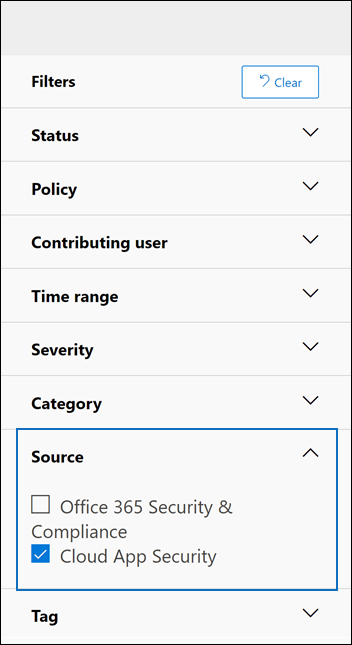

# <a name="alert-policies-in-the-microsoft-365-compliance-center"></a><span data-ttu-id="84dc5-103">Criteri di avviso nella Centro conformità Microsoft 365</span><span class="sxs-lookup"><span data-stu-id="84dc5-103">Alert policies in the Microsoft 365 compliance center</span></span>

<span data-ttu-id="84dc5-104">È possibile utilizzare i criteri di avviso e gli strumenti del dashboard degli avvisi nel Centro conformità Microsoft 365 per creare criteri di avviso e quindi visualizzare gli avvisi generati quando gli utenti eseguono attività che soddisfano le condizioni di un criterio di avviso.</span><span class="sxs-lookup"><span data-stu-id="84dc5-104">You can use the alert policy and alert dashboard tools in the Microsoft 365 compliance center to create alert policies and then view the alerts generated when users perform activities that match the conditions of an alert policy.</span></span> <span data-ttu-id="84dc5-105">Esistono diversi criteri di avviso predefiniti che consentono di monitorare attività quali l'assegnazione di privilegi di amministratore in Exchange Online, attacchi di malware, campagne di phishing e livelli insoliti di eliminazioni di file e condivisione esterna.</span><span class="sxs-lookup"><span data-stu-id="84dc5-105">There are several default alert policies that help you monitor activities such as assigning admin privileges in Exchange Online, malware attacks, phishing campaigns, and unusual levels of file deletions and external sharing.</span></span>

<span data-ttu-id="84dc5-106">I criteri di avviso consentono di categorizzare gli avvisi attivati da un criterio, applicare il criterio a tutti gli utenti dell'organizzazione, impostare un livello di soglia per l'attivazione di un avviso e decidere se ricevere notifiche tramite posta elettronica quando vengono attivati gli avvisi.</span><span class="sxs-lookup"><span data-stu-id="84dc5-106">Alert policies let you categorize the alerts that are triggered by a policy, apply the policy to all users in your organization, set a threshold level for when an alert is triggered, and decide whether to receive email notifications when alerts are triggered.</span></span> <span data-ttu-id="84dc5-107">È inoltre disponibile  una pagina Avvisi nel Centro conformità in cui è possibile visualizzare e filtrare gli avvisi, impostare uno stato di avviso per gestire gli avvisi e quindi ignorare gli avvisi dopo aver risolto o risolto l'evento imprevisto sottostante.</span><span class="sxs-lookup"><span data-stu-id="84dc5-107">There's also a **Alerts** page in the compliance center where you can view and filter alerts, set an alert status to help you manage alerts, and then dismiss alerts after you've addressed or resolved the underlying incident.</span></span>

> [!NOTE]
> <span data-ttu-id="84dc5-108">I criteri di avviso sono disponibili per le organizzazioni con una sottoscrizione Microsoft 365 Enterprise, Office 365 Enterprise o Office 365 US Government E1/F1/G1, E3/F3/G3 o E5/G5.</span><span class="sxs-lookup"><span data-stu-id="84dc5-108">Alert policies are available for organizations with a Microsoft 365 Enterprise, Office 365 Enterprise, or Office 365 US Government E1/F1/G1, E3/F3/G3, or E5/G5 subscription.</span></span> <span data-ttu-id="84dc5-109">La funzionalità avanzata è disponibile solo per le organizzazioni con una sottoscrizione E5/G5 o per le organizzazioni che dispongono di una sottoscrizione E1/F1/G1 o E3/F3/G3 e microsoft Defender per Office 365 P2 o un Microsoft 365 E5 Compliance o una sottoscrizione del componente aggiuntivo E5 eDiscovery e Controllo.</span><span class="sxs-lookup"><span data-stu-id="84dc5-109">Advanced functionality is only available for organizations with an E5/G5 subscription, or for organizations that have an E1/F1/G1 or E3/F3/G3 subscription and a Microsoft Defender for Office 365 P2 or a Microsoft 365 E5 Compliance or an E5 eDiscovery and Audit add-on subscription.</span></span> <span data-ttu-id="84dc5-110">La funzionalità che richiede un abbonamento A5/G5 o a un componente aggiuntivo è evidenziata in questo argomento.</span><span class="sxs-lookup"><span data-stu-id="84dc5-110">The functionality that requires an E5/G5 or add-on subscription is highlighted in this topic.</span></span> <span data-ttu-id="84dc5-111">Tieni inoltre presente che i criteri di avviso sono disponibili negli ambienti Office 365 GCC, GCC High e DoD US government.</span><span class="sxs-lookup"><span data-stu-id="84dc5-111">Also note that alert policies are available in Office 365 GCC, GCC High, and DoD US government environments.</span></span>

## <a name="how-alert-policies-work"></a><span data-ttu-id="84dc5-112">Funzionamento dei criteri di avviso</span><span class="sxs-lookup"><span data-stu-id="84dc5-112">How alert policies work</span></span>

<span data-ttu-id="84dc5-113">Ecco una breve panoramica del funzionamento dei criteri di avviso e degli avvisi che vengono attivati quando l'attività dell'utente o dell'amministratore soddisfa le condizioni di un criterio di avviso.</span><span class="sxs-lookup"><span data-stu-id="84dc5-113">Here's a quick overview of how alert policies work and the alerts that are triggers when user or admin activity matches the conditions of an alert policy.</span></span>


1. <span data-ttu-id="84dc5-115">Un amministratore dell'organizzazione crea, configura e attiva un criterio di avviso utilizzando la **pagina Criteri** di avviso nel Centro conformità.</span><span class="sxs-lookup"><span data-stu-id="84dc5-115">An admin in your organization creates, configures, and turns on an alert policy by using the **Alert policies** page in the compliance center.</span></span> <span data-ttu-id="84dc5-116">È inoltre possibile creare criteri di avviso utilizzando il cmdlet [New-ProtectionAlert](/powershell/module/exchange/new-protectionalert) in PowerShell & Centro conformità.</span><span class="sxs-lookup"><span data-stu-id="84dc5-116">You can also create alert policies by using the [New-ProtectionAlert](/powershell/module/exchange/new-protectionalert) cmdlet in Security & Compliance Center PowerShell.</span></span>

   <span data-ttu-id="84dc5-117">Per creare criteri di avviso, è necessario disporre del ruolo Gestisci avvisi o Configurazione organizzazione nel Centro conformità.</span><span class="sxs-lookup"><span data-stu-id="84dc5-117">To create alert policies, you have to be assigned the Manage Alerts role or the Organization Configuration role in the compliance center.</span></span>

   > [!NOTE]
   > <span data-ttu-id="84dc5-118">Sono necessarie fino a 24 ore dopo la creazione o l'aggiornamento di un criterio di avviso prima che gli avvisi possano essere attivati dal criterio.</span><span class="sxs-lookup"><span data-stu-id="84dc5-118">It takes up to 24 hours after creating or updating an alert policy before alerts can be triggered by the policy.</span></span> <span data-ttu-id="84dc5-119">Questo perché il criterio deve essere sincronizzato con il motore di rilevamento degli avvisi.</span><span class="sxs-lookup"><span data-stu-id="84dc5-119">This is because the policy has to be synced to the alert detection engine.</span></span>

2. <span data-ttu-id="84dc5-120">Un utente esegue un'attività che corrisponde alle condizioni di un criterio di avviso.</span><span class="sxs-lookup"><span data-stu-id="84dc5-120">A user performs an activity that matches the conditions of an alert policy.</span></span> <span data-ttu-id="84dc5-121">In caso di attacchi malware, i messaggi di posta elettronica infetti inviati agli utenti dell'organizzazione attivano un avviso.</span><span class="sxs-lookup"><span data-stu-id="84dc5-121">In the case of malware attacks, infected email messages sent to users in your organization trigger an alert.</span></span>

3. <span data-ttu-id="84dc5-122">Microsoft 365 viene generato un avviso visualizzato nella pagina **Avvisi** di Centro conformità Microsoft 365.</span><span class="sxs-lookup"><span data-stu-id="84dc5-122">Microsoft 365 generates an alert that's displayed on the **Alerts** page in Microsoft 365 compliance center.</span></span> <span data-ttu-id="84dc5-123">Inoltre, se le notifiche di posta elettronica sono abilitate per il criterio di avviso, Microsoft invia una notifica a un elenco di destinatari.</span><span class="sxs-lookup"><span data-stu-id="84dc5-123">Also, if email notifications are enabled for the alert policy, Microsoft sends a notification to a list of recipients.</span></span> <span data-ttu-id="84dc5-124">Gli avvisi che possono essere visualizzati da un amministratore o da altri utenti nella pagina Avvisi sono determinati dai ruoli assegnati all'utente.</span><span class="sxs-lookup"><span data-stu-id="84dc5-124">The alerts that an admin or other users can see that on the Alerts page is determined by the roles assigned to the user.</span></span> <span data-ttu-id="84dc5-125">Per ulteriori informazioni, vedere [Autorizzazioni RBAC necessarie per visualizzare gli avvisi.](#rbac-permissions-required-to-view-alerts)</span><span class="sxs-lookup"><span data-stu-id="84dc5-125">For more information, see [RBAC permissions required to view alerts](#rbac-permissions-required-to-view-alerts).</span></span>

4. <span data-ttu-id="84dc5-126">Un amministratore gestisce gli avvisi nel Centro conformità.</span><span class="sxs-lookup"><span data-stu-id="84dc5-126">An admin manages alerts in the compliance center.</span></span> <span data-ttu-id="84dc5-127">La gestione degli avvisi consiste nell'assegnare uno stato di avviso per tenere traccia e gestire qualsiasi indagine.</span><span class="sxs-lookup"><span data-stu-id="84dc5-127">Managing alerts consists of assigning an alert status to help track and manage any investigation.</span></span>

## <a name="alert-policy-settings"></a><span data-ttu-id="84dc5-128">Impostazioni dei criteri di avviso</span><span class="sxs-lookup"><span data-stu-id="84dc5-128">Alert policy settings</span></span>

<span data-ttu-id="84dc5-129">Un criterio di avviso è costituito da un set di regole e condizioni che definiscono l'attività dell'utente o dell'amministratore che genera un avviso, un elenco di utenti che attivano l'avviso se eseguono l'attività e una soglia che definisce quante volte deve verificarsi l'attività prima dell'attivazione di un avviso.</span><span class="sxs-lookup"><span data-stu-id="84dc5-129">An alert policy consists of a set of rules and conditions that define the user or admin activity that generates an alert, a list of users who trigger the alert if they perform the activity, and a threshold that defines how many times the activity has to occur before an alert is triggered.</span></span> <span data-ttu-id="84dc5-130">È inoltre possibile categorizzare il criterio e assegnare un livello di gravità.</span><span class="sxs-lookup"><span data-stu-id="84dc5-130">You also categorize the policy and assign it a severity level.</span></span> <span data-ttu-id="84dc5-131">Queste due impostazioni consentono di gestire i criteri di avviso (e gli avvisi che vengono attivati quando vengono soddisfatte le condizioni dei criteri) perché è possibile filtrare in base a queste impostazioni durante la gestione dei criteri e la visualizzazione degli avvisi nel Centro conformità.</span><span class="sxs-lookup"><span data-stu-id="84dc5-131">These two settings help you manage alert policies (and the alerts that are triggered when the policy conditions are matched) because you can filter on these settings when managing policies and viewing alerts in the compliance center.</span></span> <span data-ttu-id="84dc5-132">Ad esempio, è possibile visualizzare gli avvisi che soddisfano le condizioni della stessa categoria o visualizzare gli avvisi con lo stesso livello di gravità.</span><span class="sxs-lookup"><span data-stu-id="84dc5-132">For example, you can view alerts that match the conditions from the same category or view alerts with the same severity level.</span></span>

<span data-ttu-id="84dc5-133">**Per visualizzare e creare criteri di avviso:**</span><span class="sxs-lookup"><span data-stu-id="84dc5-133">**To view and create alert policies:**</span></span>

<span data-ttu-id="84dc5-134">Vai a <https://compliance.microsoft.com> e quindi seleziona **Criteri**  >  **Criteri Avviso**  >  **Criteri** avviso .</span><span class="sxs-lookup"><span data-stu-id="84dc5-134">Go to <https://compliance.microsoft.com> and then select **Policies** > **Alert** > **Alert policies**.</span></span> <span data-ttu-id="84dc5-135">In alternativa, è possibile passare direttamente a <https://compliance.microsoft.com/alertpolicies> .</span><span class="sxs-lookup"><span data-stu-id="84dc5-135">Alternatively, you can go directly to <https://compliance.microsoft.com/alertpolicies>.</span></span>


<span data-ttu-id="84dc5-137">Un criterio di avviso è costituito dalle impostazioni e dalle condizioni seguenti.</span><span class="sxs-lookup"><span data-stu-id="84dc5-137">An alert policy consists of the following settings and conditions.</span></span>

- <span data-ttu-id="84dc5-138">**Attività che l'avviso sta verificando**.</span><span class="sxs-lookup"><span data-stu-id="84dc5-138">**Activity the alert is tracking**.</span></span> <span data-ttu-id="84dc5-139">È possibile creare un criterio per tenere traccia di un'attività o in alcuni casi di alcune attività correlate, ad esempio la condivisione di un file con un utente esterno tramite la condivisione, l'assegnazione delle autorizzazioni di accesso o la creazione di un collegamento anonimo.</span><span class="sxs-lookup"><span data-stu-id="84dc5-139">You create a policy to track an activity or in some cases a few related activities, such a sharing a file with an external user by sharing it, assigning access permissions, or creating an anonymous link.</span></span> <span data-ttu-id="84dc5-140">Quando un utente esegue l'attività definita dal criterio, viene attivato un avviso in base alle impostazioni della soglia di avviso.</span><span class="sxs-lookup"><span data-stu-id="84dc5-140">When a user performs the activity defined by the policy, an alert is triggered based on the alert threshold settings.</span></span>

    > [!NOTE]
    > <span data-ttu-id="84dc5-141">Le attività che è possibile tenere traccia dipendono dal piano dell'organizzazione Office 365 Enterprise o Office 365 del governo degli Stati Uniti.</span><span class="sxs-lookup"><span data-stu-id="84dc5-141">The activities that you can track depend on your organization's Office 365 Enterprise or Office 365 US Government plan.</span></span> <span data-ttu-id="84dc5-142">In generale, le attività correlate a campagne di malware e attacchi di phishing richiedono un abbonamento E5/G5 o un abbonamento E1/F1/G1 o E3/F3/G3 con un abbonamento al componente aggiuntivo [Defender per Office 365](../security/office-365-security/defender-for-office-365.md) Piano 2.</span><span class="sxs-lookup"><span data-stu-id="84dc5-142">In general, activities related to malware campaigns and phishing attacks require an E5/G5 subscription or an E1/F1/G1 or E3/F3/G3 subscription with an [Defender for Office 365](../security/office-365-security/defender-for-office-365.md) Plan 2 add-on subscription.</span></span>

- <span data-ttu-id="84dc5-143">**Condizioni di attività**.</span><span class="sxs-lookup"><span data-stu-id="84dc5-143">**Activity conditions**.</span></span> <span data-ttu-id="84dc5-144">Per la maggior parte delle attività, è possibile definire condizioni aggiuntive che devono essere soddisfatte per attivare un avviso.</span><span class="sxs-lookup"><span data-stu-id="84dc5-144">For most activities, you can define additional conditions that must be met to trigger an alert.</span></span> <span data-ttu-id="84dc5-145">Le condizioni comuni includono gli indirizzi IP (in modo che un avviso sia attivato quando l'utente esegue l'attività su un computer con un indirizzo IP specifico o all'interno di un intervallo di indirizzi IP), se un avviso viene attivato se un utente o un utente specifico esegue tale attività e se l'attività viene eseguita su un nome di file o un URL specifico.</span><span class="sxs-lookup"><span data-stu-id="84dc5-145">Common conditions include IP addresses (so that an alert is triggered when the user performs the activity on a computer with a specific IP address or within an IP address range), whether an alert is triggered if a specific user or users perform that activity, and whether the activity is performed on a specific file name or URL.</span></span> <span data-ttu-id="84dc5-146">È inoltre possibile configurare una condizione che attiva un avviso quando l'attività viene eseguita da qualsiasi utente dell'organizzazione.</span><span class="sxs-lookup"><span data-stu-id="84dc5-146">You can also configure a condition that triggers an alert when the activity is performed by any user in your organization.</span></span> <span data-ttu-id="84dc5-147">Le condizioni disponibili dipendono dall'attività selezionata.</span><span class="sxs-lookup"><span data-stu-id="84dc5-147">The available conditions are dependent on the selected activity.</span></span>

- <span data-ttu-id="84dc5-148">**Quando viene attivato l'avviso**.</span><span class="sxs-lookup"><span data-stu-id="84dc5-148">**When the alert is triggered**.</span></span> <span data-ttu-id="84dc5-149">È possibile configurare un'impostazione che definisce la frequenza di esecuzione di un'attività prima dell'attivazione di un avviso.</span><span class="sxs-lookup"><span data-stu-id="84dc5-149">You can configure a setting that defines how often an activity can occur before an alert is triggered.</span></span> <span data-ttu-id="84dc5-150">In questo modo è possibile configurare un criterio per generare un avviso ogni volta che un'attività soddisfa le condizioni dei criteri, quando viene superata una determinata soglia o quando l'occorrenza dell'attività che l'avviso sta verificando diventa insolita per l'organizzazione.</span><span class="sxs-lookup"><span data-stu-id="84dc5-150">This allows you to set up a policy to generate an alert every time an activity matches the policy conditions, when a certain threshold is exceeded, or when the occurrence of the activity the alert is tracking becomes unusual for your organization.</span></span>

    

    <span data-ttu-id="84dc5-152">Se si seleziona l'impostazione in base ad attività insolite, Microsoft stabilisce un valore di base che definisce la frequenza normale per l'attività selezionata.</span><span class="sxs-lookup"><span data-stu-id="84dc5-152">If you select the setting based on unusual activity, Microsoft establishes a baseline value that defines the normal frequency for the selected activity.</span></span> <span data-ttu-id="84dc5-153">Per stabilire questa linea di base sono necessari fino a sette giorni, durante i quali gli avvisi non verranno generati.</span><span class="sxs-lookup"><span data-stu-id="84dc5-153">It takes up to seven days to establish this baseline, during which alerts won't be generated.</span></span> <span data-ttu-id="84dc5-154">Una volta stabilita la previsione, viene attivato un avviso quando la frequenza dell'attività monitorata dal criterio di avviso supera notevolmente il valore di base.</span><span class="sxs-lookup"><span data-stu-id="84dc5-154">After the baseline is established, an alert is triggered when the frequency of the activity tracked by the alert policy greatly exceeds the baseline value.</span></span> <span data-ttu-id="84dc5-155">Per le attività correlate al controllo , ad esempio le attività di file e cartelle, è possibile stabilire una linea di base basata su un singolo utente o su tutti gli utenti dell'organizzazione. per le attività correlate al malware, è possibile stabilire una linea di base basata su una singola famiglia di malware, su un singolo destinatario o su tutti i messaggi dell'organizzazione.</span><span class="sxs-lookup"><span data-stu-id="84dc5-155">For auditing-related activities (such as file and folder activities), you can establish a baseline based on a single user or based on all users in your organization; for malware-related activities, you can establish a baseline based on a single malware family, a single recipient, or all messages in your organization.</span></span>

    > [!NOTE]
    > <span data-ttu-id="84dc5-156">La possibilità di configurare i criteri di avviso in base a una soglia o a attività insolite richiede una sottoscrizione E5/G5 o una sottoscrizione E1/F1/G1 o E3/F3/G3 con un abbonamento al componente aggiuntivo Microsoft Defender per Office 365 P2, Microsoft 365 E5 Compliance o Microsoft 365 eDiscovery e controllo.</span><span class="sxs-lookup"><span data-stu-id="84dc5-156">The ability to configure alert policies based on a threshold or based on unusual activity requires an E5/G5 subscription, or an E1/F1/G1 or E3/F3/G3 subscription with a Microsoft Defender for Office 365 P2, Microsoft 365 E5 Compliance, or Microsoft 365 eDiscovery and Audit add-on subscription.</span></span> <span data-ttu-id="84dc5-157">Le organizzazioni con una sottoscrizione E1/F1/G1 e E3/F3/G3 possono creare solo criteri di avviso in cui viene attivato un avviso ogni volta che si verifica un'attività.</span><span class="sxs-lookup"><span data-stu-id="84dc5-157">Organizations with an E1/F1/G1 and E3/F3/G3 subscription can only create alert policies where an alert is triggered every time that an activity occurs.</span></span>

- <span data-ttu-id="84dc5-158">**Categoria avviso**.</span><span class="sxs-lookup"><span data-stu-id="84dc5-158">**Alert category**.</span></span> <span data-ttu-id="84dc5-159">Per facilitare il rilevamento e la gestione degli avvisi generati da un criterio, è possibile assegnare una delle categorie seguenti a un criterio.</span><span class="sxs-lookup"><span data-stu-id="84dc5-159">To help with tracking and managing the alerts generated by a policy, you can assign one of the following categories to a policy.</span></span>

  - <span data-ttu-id="84dc5-160">Prevenzione della perdita dei dati</span><span class="sxs-lookup"><span data-stu-id="84dc5-160">Data loss prevention</span></span>

  - <span data-ttu-id="84dc5-161">Governance delle informazioni</span><span class="sxs-lookup"><span data-stu-id="84dc5-161">Information governance</span></span>

  - <span data-ttu-id="84dc5-162">Flusso di posta</span><span class="sxs-lookup"><span data-stu-id="84dc5-162">Mail flow</span></span>

  - <span data-ttu-id="84dc5-163">Autorizzazioni</span><span class="sxs-lookup"><span data-stu-id="84dc5-163">Permissions</span></span>

  - <span data-ttu-id="84dc5-164">Gestione dei rischi</span><span class="sxs-lookup"><span data-stu-id="84dc5-164">Threat management</span></span>

  - <span data-ttu-id="84dc5-165">Altri</span><span class="sxs-lookup"><span data-stu-id="84dc5-165">Others</span></span>

  <span data-ttu-id="84dc5-166">Quando si verifica un'attività che soddisfa le condizioni del criterio di avviso, l'avviso generato viene contrassegnato con la categoria definita in questa impostazione.</span><span class="sxs-lookup"><span data-stu-id="84dc5-166">When an activity occurs that matches the conditions of the alert policy, the alert that's generated is tagged with the category defined in this setting.</span></span> <span data-ttu-id="84dc5-167">In questo modo è possibile tenere traccia e gestire gli avvisi con la stessa impostazione di categoria nella pagina **Avvisi** nel Centro conformità perché è possibile ordinare e filtrare gli avvisi in base alla categoria.</span><span class="sxs-lookup"><span data-stu-id="84dc5-167">This allows you to track and manage alerts that have the same category setting on the **Alerts** page in the compliance center because you can sort and filter alerts based on category.</span></span>

- <span data-ttu-id="84dc5-168">**Gravità dell'avviso**.</span><span class="sxs-lookup"><span data-stu-id="84dc5-168">**Alert severity**.</span></span> <span data-ttu-id="84dc5-169">Analogamente alla categoria di avviso, ai criteri di avviso viene assegnato un attributo di gravità (**Low**, **Medium**, **High** o **Informational).**</span><span class="sxs-lookup"><span data-stu-id="84dc5-169">Similar to the alert category, you assign a severity attribute (**Low**, **Medium**, **High**, or **Informational**) to alert policies.</span></span> <span data-ttu-id="84dc5-170">Analogamente alla categoria di avviso, quando si verifica un'attività che corrisponde alle condizioni del criterio di avviso, l'avviso generato viene contrassegnato con lo stesso livello di gravità impostato per il criterio di avviso.</span><span class="sxs-lookup"><span data-stu-id="84dc5-170">Like the alert category, when an activity occurs that matches the conditions of the alert policy, the alert that's generated is tagged with the same severity level that's set for the alert policy.</span></span> <span data-ttu-id="84dc5-171">Anche in questo caso, è possibile tenere traccia e gestire gli avvisi con la stessa impostazione di gravità nella **pagina Avvisi.**</span><span class="sxs-lookup"><span data-stu-id="84dc5-171">Again, this allows you to track and manage alerts that have the same severity setting on the **Alerts** page.</span></span> <span data-ttu-id="84dc5-172">Ad esempio, è possibile filtrare l'elenco degli avvisi in modo che siano visualizzati solo gli avvisi **con** gravità Elevata.</span><span class="sxs-lookup"><span data-stu-id="84dc5-172">For example, you can filter the list of alerts so that only alerts with a **High** severity are displayed.</span></span>

    > [!TIP]
    > <span data-ttu-id="84dc5-173">Quando si configura un criterio di avviso, è consigliabile assegnare un livello di gravità maggiore alle attività che possono provocare conseguenze molto negative, ad esempio il rilevamento di malware dopo il recapito agli utenti, la visualizzazione di dati riservati o classificati, la condivisione di dati con utenti esterni o altre attività che possono causare la perdita di dati o minacce alla sicurezza.</span><span class="sxs-lookup"><span data-stu-id="84dc5-173">When setting up an alert policy, consider assigning a higher severity to activities that can result in severely negative consequences, such as detection of malware after delivery to users, viewing of sensitive or classified data, sharing data with external users, or other activities that can result in data loss or security threats.</span></span> <span data-ttu-id="84dc5-174">In questo modo è possibile definire la priorità degli avvisi e le azioni intraprese per analizzare e risolvere le cause sottostanti.</span><span class="sxs-lookup"><span data-stu-id="84dc5-174">This can help you prioritize alerts and the actions you take to investigate and resolve the underlying causes.</span></span>

- <span data-ttu-id="84dc5-175">**Notifiche tramite posta elettronica**.</span><span class="sxs-lookup"><span data-stu-id="84dc5-175">**Email notifications**.</span></span> <span data-ttu-id="84dc5-176">È possibile configurare il criterio in modo che le notifiche di posta elettronica siano inviate (o non inviate) a un elenco di utenti quando viene attivato un avviso.</span><span class="sxs-lookup"><span data-stu-id="84dc5-176">You can set up the policy so that email notifications are sent (or not sent) to a list of users when an alert is triggered.</span></span> <span data-ttu-id="84dc5-177">Puoi anche impostare un limite di notifica giornaliero in modo che, una volta raggiunto il numero massimo di notifiche, non verranno inviate altre notifiche per l'avviso durante quel giorno.</span><span class="sxs-lookup"><span data-stu-id="84dc5-177">You can also set a daily notification limit so that once the maximum number of notifications has been reached, no more notifications are sent for the alert during that day.</span></span> <span data-ttu-id="84dc5-178">Oltre alle notifiche tramite posta elettronica, l'utente o altri amministratori possono visualizzare gli avvisi attivati da un criterio nella **pagina Avvisi.**</span><span class="sxs-lookup"><span data-stu-id="84dc5-178">In addition to email notifications, you or other administrators can view the alerts that are triggered by a policy on the **Alerts** page.</span></span> <span data-ttu-id="84dc5-179">Prendere in considerazione l'abilitazione delle notifiche di posta elettronica per i criteri di avviso di una categoria specifica o con un'impostazione di gravità superiore.</span><span class="sxs-lookup"><span data-stu-id="84dc5-179">Consider enabling email notifications for alert policies of a specific category or that have a higher severity setting.</span></span>

## <a name="default-alert-policies"></a><span data-ttu-id="84dc5-180">Criteri di avviso predefiniti</span><span class="sxs-lookup"><span data-stu-id="84dc5-180">Default alert policies</span></span>

<span data-ttu-id="84dc5-181">Microsoft fornisce criteri di avviso predefiniti che consentono di identificare Exchange di abuso delle autorizzazioni di amministratore, attività di malware, potenziali minacce esterne e interne e rischi di governance delle informazioni.</span><span class="sxs-lookup"><span data-stu-id="84dc5-181">Microsoft provides built-in alert policies that help identify Exchange admin permissions abuse, malware activity, potential external and internal threats, and information governance risks.</span></span> <span data-ttu-id="84dc5-182">Nella pagina **Criteri di** avviso i nomi di questi criteri predefiniti sono in grassetto e il tipo di criterio è definito come **Sistema**.</span><span class="sxs-lookup"><span data-stu-id="84dc5-182">On the **Alert policies** page, the names of these built-in policies are in bold and the policy type is defined as **System**.</span></span> <span data-ttu-id="84dc5-183">Questi criteri sono attivati per impostazione predefinita.</span><span class="sxs-lookup"><span data-stu-id="84dc5-183">These policies are turned on by default.</span></span> <span data-ttu-id="84dc5-184">È possibile disattivare questi criteri (o riattivarlo), configurare un elenco di destinatari a cui inviare notifiche tramite posta elettronica e impostare un limite di notifica giornaliero.</span><span class="sxs-lookup"><span data-stu-id="84dc5-184">You can turn off these policies (or back on again), set up a list of recipients to send email notifications to, and set a daily notification limit.</span></span> <span data-ttu-id="84dc5-185">Le altre impostazioni per questi criteri non possono essere modificate.</span><span class="sxs-lookup"><span data-stu-id="84dc5-185">The other settings for these policies can't be edited.</span></span>

<span data-ttu-id="84dc5-186">Nella tabella seguente sono elencati e descritti i criteri di avviso predefiniti disponibili e la categoria a cui è assegnato ogni criterio.</span><span class="sxs-lookup"><span data-stu-id="84dc5-186">The following table lists and describes the available default alert policies and the category each policy is assigned to.</span></span> <span data-ttu-id="84dc5-187">La categoria viene utilizzata per determinare quali avvisi possono essere visualizzati da un utente nella pagina Avvisi.</span><span class="sxs-lookup"><span data-stu-id="84dc5-187">The category is used to determine which alerts a user can view on the Alerts page.</span></span> <span data-ttu-id="84dc5-188">Per ulteriori informazioni, vedere [Autorizzazioni RBAC necessarie per visualizzare gli avvisi.](#rbac-permissions-required-to-view-alerts)</span><span class="sxs-lookup"><span data-stu-id="84dc5-188">For more information, see [RBAC permissions required to view alerts](#rbac-permissions-required-to-view-alerts).</span></span>

<span data-ttu-id="84dc5-189">La tabella indica inoltre il piano Office 365 Enterprise e Office 365 del governo statunitense necessario per ognuno di essi.</span><span class="sxs-lookup"><span data-stu-id="84dc5-189">The table also indicates the Office 365 Enterprise and Office 365 US Government plan required for each one.</span></span> <span data-ttu-id="84dc5-190">Alcuni criteri di avviso predefiniti sono disponibili se l'organizzazione dispone dell'abbonamento al componente aggiuntivo appropriato oltre a una sottoscrizione E1/F1/G1 o E3/F3/G3.</span><span class="sxs-lookup"><span data-stu-id="84dc5-190">Some default alert policies are available if your organization has the appropriate add-on subscription in addition to an E1/F1/G1 or E3/F3/G3 subscription.</span></span>

| <span data-ttu-id="84dc5-191">Criterio di avviso predefinito</span><span class="sxs-lookup"><span data-stu-id="84dc5-191">Default alert policy</span></span> | <span data-ttu-id="84dc5-192">Descrizione</span><span class="sxs-lookup"><span data-stu-id="84dc5-192">Description</span></span> | <span data-ttu-id="84dc5-193">Categoria</span><span class="sxs-lookup"><span data-stu-id="84dc5-193">Category</span></span> | <span data-ttu-id="84dc5-194">Enterprise abbonamento</span><span class="sxs-lookup"><span data-stu-id="84dc5-194">Enterprise subscription</span></span> |
|:-----|:-----|:-----|:-----|
|<span data-ttu-id="84dc5-195">**È stato rilevato un clic sull'URL potenzialmente dannoso**</span><span class="sxs-lookup"><span data-stu-id="84dc5-195">**A potentially malicious URL click was detected**</span></span>|<span data-ttu-id="84dc5-196">Genera un avviso quando un utente protetto da Cassaforte [collegamenti nell'organizzazione](../security/office-365-security/safe-links.md) fa clic su un collegamento dannoso.</span><span class="sxs-lookup"><span data-stu-id="84dc5-196">Generates an alert when a user protected by [Safe Links](../security/office-365-security/safe-links.md) in your organization clicks a malicious link.</span></span> <span data-ttu-id="84dc5-197">Questo evento viene attivato quando Microsoft Defender per Office 365 identifica le modifiche al verdetto degli URL o quando gli utenti sostituiscono le pagine dei collegamenti di Cassaforte (in base al criterio Microsoft 365 for business Cassaforte Links dell'organizzazione).</span><span class="sxs-lookup"><span data-stu-id="84dc5-197">This event is triggered when URL verdict changes are identified by Microsoft Defender for Office 365 or when users override the Safe Links pages (based on your organization's Microsoft 365 for business Safe Links policy).</span></span> <span data-ttu-id="84dc5-198">Questo criterio di avviso ha **un'impostazione** di gravità elevata.</span><span class="sxs-lookup"><span data-stu-id="84dc5-198">This alert policy has a **High** severity setting.</span></span> <span data-ttu-id="84dc5-199">Per i clienti di Defender Office 365 P2, E5, G5, questo avviso attiva automaticamente l'indagine e la risposta [automatizzate in Office 365](../security/office-365-security/office-365-air.md).</span><span class="sxs-lookup"><span data-stu-id="84dc5-199">For Defender for Office 365 P2, E5, G5 customers, this alert automatically triggers [automated investigation and response in Office 365](../security/office-365-security/office-365-air.md).</span></span> <span data-ttu-id="84dc5-200">Per ulteriori informazioni sugli eventi che attivano questo avviso, vedere [Set up Cassaforte Links policies.](../security/office-365-security/set-up-safe-links-policies.md)</span><span class="sxs-lookup"><span data-stu-id="84dc5-200">For more information on events that trigger this alert, see [Set up Safe Links policies](../security/office-365-security/set-up-safe-links-policies.md).</span></span>|<span data-ttu-id="84dc5-201">Gestione dei rischi</span><span class="sxs-lookup"><span data-stu-id="84dc5-201">Threat management</span></span>|<span data-ttu-id="84dc5-202">E5/G5 o Defender per Office 365 di componente aggiuntivo P2</span><span class="sxs-lookup"><span data-stu-id="84dc5-202">E5/G5 or Defender for Office 365 P2 add-on subscription</span></span>|
|<span data-ttu-id="84dc5-203">**Risultato invio amministratore completato**</span><span class="sxs-lookup"><span data-stu-id="84dc5-203">**Admin Submission result completed**</span></span>|<span data-ttu-id="84dc5-204">Genera un avviso quando un [invio dell'amministratore](../security/office-365-security/admin-submission.md) completa la nuova analisi dell'entità inviata.</span><span class="sxs-lookup"><span data-stu-id="84dc5-204">Generates an alert when an [Admin Submission](../security/office-365-security/admin-submission.md) completes the rescan of the submitted entity.</span></span> <span data-ttu-id="84dc5-205">Un avviso verrà attivato ogni volta che viene eseguito il rendering di un risultato di nuova analisi da un invio dell'amministratore.</span><span class="sxs-lookup"><span data-stu-id="84dc5-205">An alert will be triggered every time a rescan result is rendered from an Admin Submission.</span></span> <span data-ttu-id="84dc5-206">Questi avvisi hanno lo scopo di ricordare di esaminare i risultati degli invii [precedenti,](https://protection.office.com/reportsubmission)inviare messaggi segnalati dall'utente per ottenere il controllo più recente dei criteri e analizzare di nuovo i verdetti e aiutare a determinare se i criteri di filtro nell'organizzazione hanno l'impatto previsto.</span><span class="sxs-lookup"><span data-stu-id="84dc5-206">These alerts are meant to remind you to [review the results of previous submissions](https://protection.office.com/reportsubmission), submit user reported messages to get the latest policy check and rescan verdicts, and help you determine if the filtering policies in your organization are having the intended impact.</span></span> <span data-ttu-id="84dc5-207">Questo criterio ha **un'impostazione di gravità** informativo.</span><span class="sxs-lookup"><span data-stu-id="84dc5-207">This policy has a **Informational** severity setting.</span></span>|<span data-ttu-id="84dc5-208">Gestione dei rischi</span><span class="sxs-lookup"><span data-stu-id="84dc5-208">Threat management</span></span>|<span data-ttu-id="84dc5-209">E1/F1, E3/F3 o E5</span><span class="sxs-lookup"><span data-stu-id="84dc5-209">E1/F1, E3/F3, or E5</span></span>|
|<span data-ttu-id="84dc5-210">**L'amministratore ha attivato l'analisi manuale della posta elettronica**</span><span class="sxs-lookup"><span data-stu-id="84dc5-210">**Admin triggered manual investigation of email**</span></span>|<span data-ttu-id="84dc5-211">Genera un avviso quando un amministratore attiva l'analisi manuale di un messaggio di posta elettronica da Threat Explorer.</span><span class="sxs-lookup"><span data-stu-id="84dc5-211">Generates an alert when an admin triggers the manual investigation of an email from Threat Explorer.</span></span> <span data-ttu-id="84dc5-212">Per altre informazioni, vedi [Esempio: un amministratore della sicurezza attiva un'indagine da Threat Explorer.](../security/office-365-security/automated-investigation-response-office.md#example-a-security-administrator-triggers-an-investigation-from-threat-explorer)</span><span class="sxs-lookup"><span data-stu-id="84dc5-212">For more information, see [Example: A security administrator triggers an investigation from Threat Explorer](../security/office-365-security/automated-investigation-response-office.md#example-a-security-administrator-triggers-an-investigation-from-threat-explorer).</span></span> <span data-ttu-id="84dc5-213">Questo avviso notifica all'organizzazione che l'indagine è stata avviata.</span><span class="sxs-lookup"><span data-stu-id="84dc5-213">This alert notifies your organization that the investigation was started.</span></span> <span data-ttu-id="84dc5-214">L'avviso fornisce informazioni sull'utente che l'ha attivato e include un collegamento all'indagine.</span><span class="sxs-lookup"><span data-stu-id="84dc5-214">The alert provides information about who triggered it and includes a link to the investigation.</span></span> <span data-ttu-id="84dc5-215">Questo criterio ha **un'impostazione di gravità** informativo.</span><span class="sxs-lookup"><span data-stu-id="84dc5-215">This policy has an **Informational** severity setting.</span></span>|<span data-ttu-id="84dc5-216">Gestione dei rischi</span><span class="sxs-lookup"><span data-stu-id="84dc5-216">Threat management</span></span>| <span data-ttu-id="84dc5-217">Abbonamento al componente aggiuntivo E5/G5 o Microsoft Defender per Office 365 componente aggiuntivo P2</span><span class="sxs-lookup"><span data-stu-id="84dc5-217">E5/G5 or Microsoft Defender for Office 365 P2 add-on subscription</span></span>| 
|<span data-ttu-id="84dc5-218">**Creazione di regole di inoltro/reindirizzamento**</span><span class="sxs-lookup"><span data-stu-id="84dc5-218">**Creation of forwarding/redirect rule**</span></span>|<span data-ttu-id="84dc5-219">Genera un avviso quando un utente dell'organizzazione crea una regola di posta in arrivo per la propria cassetta postale che inoltra o reindirizza i messaggi a un altro account di posta elettronica.</span><span class="sxs-lookup"><span data-stu-id="84dc5-219">Generates an alert when someone in your organization creates an inbox rule for their mailbox that forwards or redirects messages to another email account.</span></span> <span data-ttu-id="84dc5-220">Questo criterio tiene traccia solo delle regole di Posta in arrivo create Outlook sul web (in precedenza noto come Outlook Web App) o Exchange Online PowerShell.</span><span class="sxs-lookup"><span data-stu-id="84dc5-220">This policy only tracks inbox rules that are created using Outlook on the web (formerly known as Outlook Web App) or Exchange Online PowerShell.</span></span> <span data-ttu-id="84dc5-221">Questo criterio ha **un'impostazione di gravità** informativo.</span><span class="sxs-lookup"><span data-stu-id="84dc5-221">This policy has a **Informational** severity setting.</span></span> <span data-ttu-id="84dc5-222">Per ulteriori informazioni sull'utilizzo delle regole di Posta in arrivo per inoltrare e reindirizzare la posta elettronica in Outlook sul web, vedere [Use rules in Outlook sul web to automatically forward messages to another account](https://support.office.com/article/1433e3a0-7fb0-4999-b536-50e05cb67fed).</span><span class="sxs-lookup"><span data-stu-id="84dc5-222">For more information about using inbox rules to forward and redirect email in Outlook on the web, see [Use rules in Outlook on the web to automatically forward messages to another account](https://support.office.com/article/1433e3a0-7fb0-4999-b536-50e05cb67fed).</span></span>|<span data-ttu-id="84dc5-223">Gestione dei rischi</span><span class="sxs-lookup"><span data-stu-id="84dc5-223">Threat management</span></span>|<span data-ttu-id="84dc5-224">E1/F1/G1, E3/F3/G3 o E5/G5</span><span class="sxs-lookup"><span data-stu-id="84dc5-224">E1/F1/G1, E3/F3/G3, or E5/G5</span></span>|
|<span data-ttu-id="84dc5-225">**Ricerca eDiscovery avviata o esportata**</span><span class="sxs-lookup"><span data-stu-id="84dc5-225">**eDiscovery search started or exported**</span></span>|<span data-ttu-id="84dc5-226">Genera un avviso quando un utente usa lo strumento ricerca contenuto nel Centro sicurezza e conformità.</span><span class="sxs-lookup"><span data-stu-id="84dc5-226">Generates an alert when someone uses the Content search tool in the Security and compliance center.</span></span> <span data-ttu-id="84dc5-227">Viene generato un avviso quando vengono eseguite le attività di ricerca contenuto seguenti:</span><span class="sxs-lookup"><span data-stu-id="84dc5-227">An alert is triggered when the following content search activities are performed:</span></span> <br/><br/><span data-ttu-id="84dc5-228">\* Viene avviata una ricerca di contenuto</span><span class="sxs-lookup"><span data-stu-id="84dc5-228">\* A content search is started</span></span><br/><span data-ttu-id="84dc5-229">\* I risultati di una ricerca di contenuto vengono esportati</span><span class="sxs-lookup"><span data-stu-id="84dc5-229">\* The results of a content search are exported</span></span><br/><span data-ttu-id="84dc5-230">\* Viene esportato un report di ricerca contenuto</span><span class="sxs-lookup"><span data-stu-id="84dc5-230">\* A content search report is exported</span></span><br/><br/><span data-ttu-id="84dc5-231">Gli avvisi vengono attivati anche quando le attività di ricerca del contenuto precedenti vengono eseguite in associazione a un caso di eDiscovery.</span><span class="sxs-lookup"><span data-stu-id="84dc5-231">Alerts are also triggered when the previous content search activities are performed in association with an eDiscovery case.</span></span> <span data-ttu-id="84dc5-232">Questo criterio ha **un'impostazione di gravità** informativo.</span><span class="sxs-lookup"><span data-stu-id="84dc5-232">This policy has a **Informational** severity setting.</span></span> <span data-ttu-id="84dc5-233">Per ulteriori informazioni sulle attività di ricerca contenuto, vedere [Search for eDiscovery activities in the audit log.](search-for-ediscovery-activities-in-the-audit-log.md#ediscovery-activities)</span><span class="sxs-lookup"><span data-stu-id="84dc5-233">For more information about content search activities, see [Search for eDiscovery activities in the audit log](search-for-ediscovery-activities-in-the-audit-log.md#ediscovery-activities).</span></span>|<span data-ttu-id="84dc5-234">Gestione dei rischi</span><span class="sxs-lookup"><span data-stu-id="84dc5-234">Threat management</span></span>|<span data-ttu-id="84dc5-235">E1/F1/G1, E3/F3/G3 o E5/G5</span><span class="sxs-lookup"><span data-stu-id="84dc5-235">E1/F1/G1, E3/F3/G3, or E5/G5</span></span>|
|<span data-ttu-id="84dc5-236">**Elevazione dei privilegi Exchange amministratore**</span><span class="sxs-lookup"><span data-stu-id="84dc5-236">**Elevation of Exchange admin privilege**</span></span>|<span data-ttu-id="84dc5-237">Genera un avviso quando a un utente vengono assegnate autorizzazioni amministrative nell'Exchange Online organizzazione.</span><span class="sxs-lookup"><span data-stu-id="84dc5-237">Generates an alert when someone is assigned administrative permissions in your Exchange Online organization.</span></span> <span data-ttu-id="84dc5-238">Ad esempio, quando un utente viene aggiunto al gruppo di ruoli Gestione organizzazione in Exchange Online.</span><span class="sxs-lookup"><span data-stu-id="84dc5-238">For example, when a user is added to the Organization Management role group in Exchange Online.</span></span> <span data-ttu-id="84dc5-239">Questo criterio ha **un'impostazione di** gravità Bassa.</span><span class="sxs-lookup"><span data-stu-id="84dc5-239">This policy has a **Low** severity setting.</span></span>|<span data-ttu-id="84dc5-240">Autorizzazioni</span><span class="sxs-lookup"><span data-stu-id="84dc5-240">Permissions</span></span>|<span data-ttu-id="84dc5-241">E1/F1/G1, E3/F3/G3 o E5/G5</span><span class="sxs-lookup"><span data-stu-id="84dc5-241">E1/F1/G1, E3/F3/G3, or E5/G5</span></span>|
|<span data-ttu-id="84dc5-242">**Messaggi di posta elettronica contenenti malware rimossi dopo il recapito**</span><span class="sxs-lookup"><span data-stu-id="84dc5-242">**Email messages containing malware removed after delivery**</span></span>|<span data-ttu-id="84dc5-243">Genera un avviso quando i messaggi contenenti malware vengono recapitati alle cassette postali dell'organizzazione.</span><span class="sxs-lookup"><span data-stu-id="84dc5-243">Generates an alert when any messages containing malware are delivered to mailboxes in your organization.</span></span> <span data-ttu-id="84dc5-244">Se si verifica questo evento, Microsoft rimuove i messaggi infetti dalle cassette postali Exchange Online utilizzando l'eliminazione automatica [di zero ore.](../security/office-365-security/zero-hour-auto-purge.md)</span><span class="sxs-lookup"><span data-stu-id="84dc5-244">If this event occurs, Microsoft removes the infected messages from Exchange Online mailboxes using [Zero-hour auto purge](../security/office-365-security/zero-hour-auto-purge.md).</span></span> <span data-ttu-id="84dc5-245">Questo criterio ha **un'impostazione di gravità** informativo e attiva automaticamente l'indagine e la risposta automatizzate [in Office 365](../security/office-365-security/office-365-air.md).</span><span class="sxs-lookup"><span data-stu-id="84dc5-245">This policy has an **Informational** severity setting and automatically triggers [automated investigation and response in Office 365](../security/office-365-security/office-365-air.md).</span></span>|<span data-ttu-id="84dc5-246">Gestione dei rischi</span><span class="sxs-lookup"><span data-stu-id="84dc5-246">Threat management</span></span>|<span data-ttu-id="84dc5-247">Abbonamento al componente aggiuntivo E5/G5 o Microsoft Defender per Office 365 componente aggiuntivo P2</span><span class="sxs-lookup"><span data-stu-id="84dc5-247">E5/G5 or Microsoft Defender for Office 365 P2 add-on subscription</span></span>|
|<span data-ttu-id="84dc5-248">**Dei messaggi di posta elettronica contenenti URL di phishing sono stati rimossi dopo il recapito**</span><span class="sxs-lookup"><span data-stu-id="84dc5-248">**Email messages containing phish URLs removed after delivery**</span></span>|<span data-ttu-id="84dc5-249">Genera un avviso quando i messaggi contenenti phish vengono recapitati alle cassette postali dell'organizzazione.</span><span class="sxs-lookup"><span data-stu-id="84dc5-249">Generates an alert when any messages containing phish are delivered to mailboxes in your organization.</span></span> <span data-ttu-id="84dc5-250">Se si verifica questo evento, Microsoft rimuove i messaggi infetti dalle cassette postali Exchange Online utilizzando l'eliminazione automatica [di zero ore.](../security/office-365-security/zero-hour-auto-purge.md)</span><span class="sxs-lookup"><span data-stu-id="84dc5-250">If this event occurs, Microsoft removes the infected messages from Exchange Online mailboxes using [Zero-hour auto purge](../security/office-365-security/zero-hour-auto-purge.md).</span></span> <span data-ttu-id="84dc5-251">Questo criterio ha **un'impostazione di gravità** informativo e attiva automaticamente l'indagine e la risposta automatizzate [in Office 365](../security/office-365-security/office-365-air.md).</span><span class="sxs-lookup"><span data-stu-id="84dc5-251">This policy has an **Informational** severity setting and automatically triggers [automated investigation and response in Office 365](../security/office-365-security/office-365-air.md).</span></span>|<span data-ttu-id="84dc5-252">Gestione dei rischi</span><span class="sxs-lookup"><span data-stu-id="84dc5-252">Threat management</span></span>|<span data-ttu-id="84dc5-253">E5/G5 o Defender per Office 365 di componente aggiuntivo P2</span><span class="sxs-lookup"><span data-stu-id="84dc5-253">E5/G5 or Defender for Office 365 P2 add-on subscription</span></span>|
|<span data-ttu-id="84dc5-254">**Email segnalata dagli utenti come malware o phishing**</span><span class="sxs-lookup"><span data-stu-id="84dc5-254">**Email reported by user as malware or phish**</span></span>|<span data-ttu-id="84dc5-255">Genera un avviso quando gli utenti dell'organizzazione segnalano i messaggi come posta elettronica di phishing utilizzando il componente aggiuntivo Segnala messaggio.</span><span class="sxs-lookup"><span data-stu-id="84dc5-255">Generates an alert when users in your organization  report messages as phishing email using the Report Message add-in.</span></span> <span data-ttu-id="84dc5-256">Questo criterio ha **un'impostazione di** gravità Bassa.</span><span class="sxs-lookup"><span data-stu-id="84dc5-256">This policy has an **Low** severity setting.</span></span> <span data-ttu-id="84dc5-257">Per ulteriori informazioni su questo componente aggiuntivo, vedere [Use the Report Message add-in](https://support.office.com/article/b5caa9f1-cdf3-4443-af8c-ff724ea719d2).</span><span class="sxs-lookup"><span data-stu-id="84dc5-257">For more information about this add-in, see [Use the Report Message add-in](https://support.office.com/article/b5caa9f1-cdf3-4443-af8c-ff724ea719d2).</span></span> <span data-ttu-id="84dc5-258">Per i clienti di Defender Office 365 P2, E5, G5, questo avviso attiva automaticamente l'indagine e la risposta [automatizzate in Office 365](../security/office-365-security/office-365-air.md).</span><span class="sxs-lookup"><span data-stu-id="84dc5-258">For Defender for Office 365 P2, E5, G5 customers, this alert automatically triggers [automated investigation and response in Office 365](../security/office-365-security/office-365-air.md).</span></span>|<span data-ttu-id="84dc5-259">Gestione dei rischi</span><span class="sxs-lookup"><span data-stu-id="84dc5-259">Threat management</span></span>|<span data-ttu-id="84dc5-260">E1/F1/G1, E3/F3/G3 o E5/G5</span><span class="sxs-lookup"><span data-stu-id="84dc5-260">E1/F1/G1, E3/F3/G3, or E5/G5</span></span>|
|<span data-ttu-id="84dc5-261">**Limite di invio della posta elettronica superato**</span><span class="sxs-lookup"><span data-stu-id="84dc5-261">**Email sending limit exceeded**</span></span>|<span data-ttu-id="84dc5-262">Genera un avviso quando un utente dell'organizzazione ha inviato più posta di quella consentita dal criterio di posta indesiderata in uscita.</span><span class="sxs-lookup"><span data-stu-id="84dc5-262">Generates an alert when someone in your organization has sent more mail than is allowed by the outbound spam policy.</span></span> <span data-ttu-id="84dc5-263">Questa è in genere un'indicazione che l'utente sta inviando troppi messaggi di posta elettronica o che l'account potrebbe essere compromesso.</span><span class="sxs-lookup"><span data-stu-id="84dc5-263">This is usually an indication the user is sending too much email or that the account may be compromised.</span></span> <span data-ttu-id="84dc5-264">Questo criterio ha **un'impostazione di** gravità Media.</span><span class="sxs-lookup"><span data-stu-id="84dc5-264">This policy has a **Medium** severity setting.</span></span> <span data-ttu-id="84dc5-265">Se si ottiene un avviso generato da questo criterio di avviso, è buona idea verificare se [l'account utente è compromesso.](../security/office-365-security/responding-to-a-compromised-email-account.md)</span><span class="sxs-lookup"><span data-stu-id="84dc5-265">If you get an alert generated by this alert policy, it's a good idea to [check whether the user account is compromised](../security/office-365-security/responding-to-a-compromised-email-account.md).</span></span>|<span data-ttu-id="84dc5-266">Gestione dei rischi</span><span class="sxs-lookup"><span data-stu-id="84dc5-266">Threat management</span></span>|<span data-ttu-id="84dc5-267">E1/F1/G1, E3/F3/G3 o E5/G5</span><span class="sxs-lookup"><span data-stu-id="84dc5-267">E1/F1/G1, E3/F3/G3, or E5/G5</span></span>|
|<span data-ttu-id="84dc5-268">**Modulo bloccato a causa di un potenziale tentativo di phishing**</span><span class="sxs-lookup"><span data-stu-id="84dc5-268">**Form blocked due to potential phishing attempt**</span></span>|<span data-ttu-id="84dc5-269">Genera un avviso quando a un utente dell'organizzazione è stata limitata la condivisione di moduli e la raccolta di risposte tramite Microsoft Forms a causa di un comportamento ripetuto di tentativo di phishing rilevato.</span><span class="sxs-lookup"><span data-stu-id="84dc5-269">Generates an alert when someone in your organization has been restricted from sharing forms and collecting responses using Microsoft Forms due to detected repeated phishing attempt behavior.</span></span> <span data-ttu-id="84dc5-270">Questo criterio ha **un'impostazione di gravità** elevata.</span><span class="sxs-lookup"><span data-stu-id="84dc5-270">This policy has a **High severity** setting.</span></span>|<span data-ttu-id="84dc5-271">Gestione dei rischi</span><span class="sxs-lookup"><span data-stu-id="84dc5-271">Threat management</span></span>|<span data-ttu-id="84dc5-272">E1, E3/F3 o E5</span><span class="sxs-lookup"><span data-stu-id="84dc5-272">E1, E3/F3, or E5</span></span>|
|<span data-ttu-id="84dc5-273">**Modulo contrassegnato e confermato come phishing**</span><span class="sxs-lookup"><span data-stu-id="84dc5-273">**Form flagged and confirmed as phishing**</span></span>|<span data-ttu-id="84dc5-274">Genera un avviso quando un modulo creato in Microsoft Forms dall'organizzazione è stato identificato come potenziale phishing tramite segnalazione di abuso e confermato come phishing da Microsoft.</span><span class="sxs-lookup"><span data-stu-id="84dc5-274">Generates an alert when a form created in Microsoft Forms from within your organization has been identified as potential phishing through Report Abuse and confirmed as phishing by Microsoft.</span></span> <span data-ttu-id="84dc5-275">Questo criterio ha **un'impostazione** di gravità elevata.</span><span class="sxs-lookup"><span data-stu-id="84dc5-275">This policy has a **High** severity setting.</span></span>|<span data-ttu-id="84dc5-276">Gestione dei rischi</span><span class="sxs-lookup"><span data-stu-id="84dc5-276">Threat management</span></span>|<span data-ttu-id="84dc5-277">E1, E3/F3 o E5</span><span class="sxs-lookup"><span data-stu-id="84dc5-277">E1, E3/F3, or E5</span></span>|
|<span data-ttu-id="84dc5-278">**I messaggi sono stati ritardati**</span><span class="sxs-lookup"><span data-stu-id="84dc5-278">**Messages have been delayed**</span></span>|<span data-ttu-id="84dc5-279">Genera un avviso quando Microsoft non è in grado di recapitare messaggi di posta elettronica all'organizzazione locale o a un server partner utilizzando un connettore.</span><span class="sxs-lookup"><span data-stu-id="84dc5-279">Generates an alert when Microsoft can't deliver email messages to your on-premises organization or a partner server by using a connector.</span></span> <span data-ttu-id="84dc5-280">In questo caso, il messaggio viene accodato in Office 365.</span><span class="sxs-lookup"><span data-stu-id="84dc5-280">When this happens, the message is queued in Office 365.</span></span> <span data-ttu-id="84dc5-281">Questo avviso viene attivato quando sono presenti 2.000 messaggi o più che sono stati accodati per più di un'ora.</span><span class="sxs-lookup"><span data-stu-id="84dc5-281">This alert is triggered when there are 2,000 messages or more that have been queued for more than an hour.</span></span> <span data-ttu-id="84dc5-282">Questo criterio ha **un'impostazione** di gravità elevata.</span><span class="sxs-lookup"><span data-stu-id="84dc5-282">This policy has a **High** severity setting.</span></span>|<span data-ttu-id="84dc5-283">Flusso di posta</span><span class="sxs-lookup"><span data-stu-id="84dc5-283">Mail flow</span></span>|<span data-ttu-id="84dc5-284">E1/F1/G1, E3/F3/G3 o E5/G5</span><span class="sxs-lookup"><span data-stu-id="84dc5-284">E1/F1/G1, E3/F3/G3, or E5/G5</span></span>|
|<span data-ttu-id="84dc5-285">**Campagna antimalware rilevata dopo il recapito**</span><span class="sxs-lookup"><span data-stu-id="84dc5-285">**Malware campaign detected after delivery**</span></span>|<span data-ttu-id="84dc5-286">Genera un avviso quando un numero insolitamente elevato di messaggi contenenti malware viene recapitato alle cassette postali dell'organizzazione.</span><span class="sxs-lookup"><span data-stu-id="84dc5-286">Generates an alert when an unusually large number of messages containing malware are delivered to mailboxes in your organization.</span></span> <span data-ttu-id="84dc5-287">Se si verifica questo evento, Microsoft rimuove i messaggi infetti dalle Exchange Online cassette postali.</span><span class="sxs-lookup"><span data-stu-id="84dc5-287">If this event occurs, Microsoft removes the infected messages from Exchange Online mailboxes.</span></span> <span data-ttu-id="84dc5-288">Questo criterio ha **un'impostazione** di gravità elevata.</span><span class="sxs-lookup"><span data-stu-id="84dc5-288">This policy has a **High** severity setting.</span></span>|<span data-ttu-id="84dc5-289">Gestione dei rischi</span><span class="sxs-lookup"><span data-stu-id="84dc5-289">Threat management</span></span>|<span data-ttu-id="84dc5-290">Abbonamento al componente aggiuntivo E5/G5 o Microsoft Defender per Office 365 componente aggiuntivo P2</span><span class="sxs-lookup"><span data-stu-id="84dc5-290">E5/G5 or Microsoft Defender for Office 365 P2 add-on subscription</span></span>|
|<span data-ttu-id="84dc5-291">**Campagna antimalware rilevata e bloccata**</span><span class="sxs-lookup"><span data-stu-id="84dc5-291">**Malware campaign detected and blocked**</span></span>|<span data-ttu-id="84dc5-292">Genera un avviso quando qualcuno ha tentato di inviare un numero insolitamente elevato di messaggi di posta elettronica contenenti un determinato tipo di malware agli utenti dell'organizzazione.</span><span class="sxs-lookup"><span data-stu-id="84dc5-292">Generates an alert when someone has attempted to send an unusually large number of email messages containing a certain type of malware to users in your organization.</span></span> <span data-ttu-id="84dc5-293">Se si verifica questo evento, i messaggi infetti vengono bloccati da Microsoft e non recapitati alle cassette postali.</span><span class="sxs-lookup"><span data-stu-id="84dc5-293">If this event occurs, the infected messages are blocked by Microsoft and not delivered to mailboxes.</span></span> <span data-ttu-id="84dc5-294">Questo criterio ha **un'impostazione di** gravità Bassa.</span><span class="sxs-lookup"><span data-stu-id="84dc5-294">This policy has a **Low** severity setting.</span></span>|<span data-ttu-id="84dc5-295">Gestione dei rischi</span><span class="sxs-lookup"><span data-stu-id="84dc5-295">Threat management</span></span>|<span data-ttu-id="84dc5-296">E5/G5 o Defender per Office 365 di componente aggiuntivo P2</span><span class="sxs-lookup"><span data-stu-id="84dc5-296">E5/G5 or Defender for Office 365 P2 add-on subscription</span></span>|
|<span data-ttu-id="84dc5-297">**Campagna di malware rilevata in SharePoint e OneDrive**</span><span class="sxs-lookup"><span data-stu-id="84dc5-297">**Malware campaign detected in SharePoint and OneDrive**</span></span>|<span data-ttu-id="84dc5-298">Genera un avviso quando viene rilevato un volume insolitamente elevato di malware o virus nei file che si trovano in SharePoint siti o OneDrive account nell'organizzazione.</span><span class="sxs-lookup"><span data-stu-id="84dc5-298">Generates an alert when an unusually high volume of malware or viruses is detected in files located in SharePoint sites or OneDrive accounts in your organization.</span></span> <span data-ttu-id="84dc5-299">Questo criterio ha **un'impostazione** di gravità elevata.</span><span class="sxs-lookup"><span data-stu-id="84dc5-299">This policy has a **High** severity setting.</span></span>|<span data-ttu-id="84dc5-300">Gestione dei rischi</span><span class="sxs-lookup"><span data-stu-id="84dc5-300">Threat management</span></span>|<span data-ttu-id="84dc5-301">E5/G5 o Defender per Office 365 di componente aggiuntivo P2</span><span class="sxs-lookup"><span data-stu-id="84dc5-301">E5/G5 or Defender for Office 365 P2 add-on subscription</span></span>|
|<span data-ttu-id="84dc5-302">**Malware non zapped because ZAP is disabled**</span><span class="sxs-lookup"><span data-stu-id="84dc5-302">**Malware not zapped because ZAP is disabled**</span></span>| <span data-ttu-id="84dc5-303">Genera un avviso quando Microsoft rileva il recapito di un messaggio di malware a una cassetta postale perché Zero-Hour l'eliminazione automatica per i messaggi phish è disabilitata.</span><span class="sxs-lookup"><span data-stu-id="84dc5-303">Generates an alert when Microsoft detects delivery of a malware message to a mailbox because Zero-Hour Auto Purge for Phish messages is disabled.</span></span> <span data-ttu-id="84dc5-304">Questo criterio ha **un'impostazione di gravità** informativo.</span><span class="sxs-lookup"><span data-stu-id="84dc5-304">This policy has an **Informational** severity setting.</span></span> |<span data-ttu-id="84dc5-305">Gestione dei rischi</span><span class="sxs-lookup"><span data-stu-id="84dc5-305">Threat management</span></span>|<span data-ttu-id="84dc5-306">E5/G5 o Defender per Office 365 di componente aggiuntivo P2</span><span class="sxs-lookup"><span data-stu-id="84dc5-306">E5/G5 or Defender for Office 365 P2 add-on subscription</span></span>|
|<span data-ttu-id="84dc5-307">**Phish recapitato perché la cartella Posta indesiderata di un utente è disabilitata**</span><span class="sxs-lookup"><span data-stu-id="84dc5-307">**Phish delivered because a user's Junk Mail folder is disabled**</span></span>|<span data-ttu-id="84dc5-308">Genera un avviso quando Microsoft rileva che la cartella Posta indesiderata di un utente è disabilitata, consentendo il recapito di un messaggio di phishing ad alta probabilità a una cassetta postale.</span><span class="sxs-lookup"><span data-stu-id="84dc5-308">Generates an alert when Microsoft detects a user’s Junk Mail folder is disabled, allowing delivery of a high confidence phishing message to a mailbox.</span></span> <span data-ttu-id="84dc5-309">Questo criterio ha **un'impostazione di gravità** informativo.</span><span class="sxs-lookup"><span data-stu-id="84dc5-309">This policy has an **Informational** severity setting.</span></span>|<span data-ttu-id="84dc5-310">Gestione dei rischi</span><span class="sxs-lookup"><span data-stu-id="84dc5-310">Threat management</span></span>|<span data-ttu-id="84dc5-311">E5/G5 o Defender per Office 365 di componente aggiuntivo P1 o P2</span><span class="sxs-lookup"><span data-stu-id="84dc5-311">E5/G5 or Defender for Office 365 P1 or P2 add-on subscription</span></span>|
|<span data-ttu-id="84dc5-312">**Phish recapitato a causa di una sostituzione ETR**</span><span class="sxs-lookup"><span data-stu-id="84dc5-312">**Phish delivered due to an ETR override**</span></span>|<span data-ttu-id="84dc5-313">Genera un avviso quando Microsoft rileva una regola Exchange Transport Rule (ETR) che consente il recapito di un messaggio di phishing ad alta probabilità a una cassetta postale.</span><span class="sxs-lookup"><span data-stu-id="84dc5-313">Generates an alert when Microsoft detects an Exchange Transport Rule (ETR) that allowed delivery of a high confidence phishing message to a mailbox.</span></span> <span data-ttu-id="84dc5-314">Questo criterio ha **un'impostazione di gravità** informativo.</span><span class="sxs-lookup"><span data-stu-id="84dc5-314">This policy has an **Informational** severity setting.</span></span> <span data-ttu-id="84dc5-315">Per ulteriori informazioni sulle Exchange di trasporto (regole del flusso di posta), vedere [Mail flow rules (transport rules) in Exchange Online](/exchange/security-and-compliance/mail-flow-rules/mail-flow-rules).</span><span class="sxs-lookup"><span data-stu-id="84dc5-315">For more information about Exchange Transport Rules (Mail flow rules), see [Mail flow rules (transport rules) in Exchange Online](/exchange/security-and-compliance/mail-flow-rules/mail-flow-rules).</span></span>|<span data-ttu-id="84dc5-316">Gestione dei rischi</span><span class="sxs-lookup"><span data-stu-id="84dc5-316">Threat management</span></span>|<span data-ttu-id="84dc5-317">E5/G5 o Defender per Office 365 di componente aggiuntivo P1 o P2</span><span class="sxs-lookup"><span data-stu-id="84dc5-317">E5/G5 or Defender for Office 365 P1 or P2 add-on subscription</span></span>|
|<span data-ttu-id="84dc5-318">**Phish recapitato a causa di un criterio di ip consentiti**</span><span class="sxs-lookup"><span data-stu-id="84dc5-318">**Phish delivered due to an IP allow policy**</span></span>|<span data-ttu-id="84dc5-319">Genera un avviso quando Microsoft rileva un criterio di autorizzazione IP che consente il recapito di un messaggio di phishing ad alta probabilità a una cassetta postale.</span><span class="sxs-lookup"><span data-stu-id="84dc5-319">Generates an alert when Microsoft detects an IP allow policy that allowed delivery of a high confidence phishing message to a mailbox.</span></span> <span data-ttu-id="84dc5-320">Questo criterio ha **un'impostazione di gravità** informativo.</span><span class="sxs-lookup"><span data-stu-id="84dc5-320">This policy has an **Informational** severity setting.</span></span> <span data-ttu-id="84dc5-321">Per ulteriori informazioni sul criterio di autorizzazione IP (filtro connessioni), vedere [Configure the default connection filter policy - Office 365](../security/office-365-security/configure-the-connection-filter-policy.md).</span><span class="sxs-lookup"><span data-stu-id="84dc5-321">For more information about the IP allow policy (connection filtering), see [Configure the default connection filter policy - Office 365](../security/office-365-security/configure-the-connection-filter-policy.md).</span></span>|<span data-ttu-id="84dc5-322">Gestione dei rischi</span><span class="sxs-lookup"><span data-stu-id="84dc5-322">Threat management</span></span>|<span data-ttu-id="84dc5-323">E5/G5 o Defender per Office 365 di componente aggiuntivo P1 o P2</span><span class="sxs-lookup"><span data-stu-id="84dc5-323">E5/G5 or Defender for Office 365 P1 or P2 add-on subscription</span></span>|
|<span data-ttu-id="84dc5-324">**Phish non zapped perché ZAP è disabilitato**</span><span class="sxs-lookup"><span data-stu-id="84dc5-324">**Phish not zapped because ZAP is disabled**</span></span>| <span data-ttu-id="84dc5-325">Genera un avviso quando Microsoft rileva il recapito di un messaggio di phishing ad alta probabilità a una cassetta postale perché Zero-Hour eliminazione automatica per i messaggi phish è disabilitata.</span><span class="sxs-lookup"><span data-stu-id="84dc5-325">Generates an alert when Microsoft detects delivery of a high confidence phishing message to a mailbox because Zero-Hour Auto Purge for Phish messages is disabled.</span></span> <span data-ttu-id="84dc5-326">Questo criterio ha **un'impostazione di gravità** informativo.</span><span class="sxs-lookup"><span data-stu-id="84dc5-326">This policy has an **Informational** severity setting.</span></span>|<span data-ttu-id="84dc5-327">Gestione dei rischi</span><span class="sxs-lookup"><span data-stu-id="84dc5-327">Threat management</span></span>|<span data-ttu-id="84dc5-328">E5/G5 o Defender per Office 365 di componente aggiuntivo P2</span><span class="sxs-lookup"><span data-stu-id="84dc5-328">E5/G5 or Defender for Office 365 P2 add-on subscription</span></span>|
|<span data-ttu-id="84dc5-329">**Phish recapitato a causa dell'override del tenant o dell'utente**<sup>1</sup></span><span class="sxs-lookup"><span data-stu-id="84dc5-329">**Phish delivered due to tenant or user override**<sup>1</sup></span></span>|<span data-ttu-id="84dc5-330">Genera un avviso quando Microsoft rileva che l'override di un amministratore o di un utente ha consentito il recapito di un messaggio di phishing a una cassetta postale.</span><span class="sxs-lookup"><span data-stu-id="84dc5-330">Generates an alert when Microsoft  detects an admin or user override allowed the delivery of a phishing message to a mailbox.</span></span> <span data-ttu-id="84dc5-331">Esempi di sostituzioni includono una regola di posta in arrivo o del flusso di posta che consente i messaggi provenienti da un mittente o un dominio specifico oppure un criterio di protezione da posta indesiderata che consente i messaggi provenienti da mittenti o domini specifici.</span><span class="sxs-lookup"><span data-stu-id="84dc5-331">Examples of overrides include an inbox or mail flow rule that allows messages from a specific sender or domain, or an anti-spam policy that allows messages from specific senders or domains.</span></span> <span data-ttu-id="84dc5-332">Questo criterio ha **un'impostazione** di gravità elevata.</span><span class="sxs-lookup"><span data-stu-id="84dc5-332">This policy has a **High** severity setting.</span></span>|<span data-ttu-id="84dc5-333">Gestione dei rischi</span><span class="sxs-lookup"><span data-stu-id="84dc5-333">Threat management</span></span>|<span data-ttu-id="84dc5-334">E5/G5 o Defender per Office 365 di componente aggiuntivo P2</span><span class="sxs-lookup"><span data-stu-id="84dc5-334">E5/G5 or Defender for Office 365 P2 add-on subscription</span></span>|
|<span data-ttu-id="84dc5-335">**Attività sospetta di inoltro della posta elettronica**</span><span class="sxs-lookup"><span data-stu-id="84dc5-335">**Suspicious email forwarding activity**</span></span>|<span data-ttu-id="84dc5-336">Genera un avviso quando un utente dell'organizzazione ha inviato automaticamente un messaggio di posta elettronica a un account esterno sospetto.</span><span class="sxs-lookup"><span data-stu-id="84dc5-336">Generates an alert when someone in your organization has autoforwarded email to a suspicious external account.</span></span> <span data-ttu-id="84dc5-337">Si tratta di un avviso anticipato per il comportamento che potrebbe indicare che l'account è compromesso, ma non abbastanza grave da limitare l'utente.</span><span class="sxs-lookup"><span data-stu-id="84dc5-337">This is an early warning for behavior that may indicate the account is compromised, but not severe enough to restrict the user.</span></span> <span data-ttu-id="84dc5-338">Questo criterio ha **un'impostazione** di gravità elevata.</span><span class="sxs-lookup"><span data-stu-id="84dc5-338">This policy has a **High** severity setting.</span></span> <span data-ttu-id="84dc5-339">Anche se è raro, un avviso generato da questo criterio potrebbe essere un'anomalia.</span><span class="sxs-lookup"><span data-stu-id="84dc5-339">Although it's rare, an alert generated by this policy may be an anomaly.</span></span> <span data-ttu-id="84dc5-340">È buona idea verificare se [l'account utente è compromesso.](../security/office-365-security/responding-to-a-compromised-email-account.md)</span><span class="sxs-lookup"><span data-stu-id="84dc5-340">It's a good idea to [check whether the user account is compromised](../security/office-365-security/responding-to-a-compromised-email-account.md).</span></span>|<span data-ttu-id="84dc5-341">Gestione dei rischi</span><span class="sxs-lookup"><span data-stu-id="84dc5-341">Threat management</span></span>|<span data-ttu-id="84dc5-342">E1/F1/G1, E3/F3/G3 o E5/G5</span><span class="sxs-lookup"><span data-stu-id="84dc5-342">E1/F1/G1, E3/F3/G3, or E5/G5</span></span>|
|<span data-ttu-id="84dc5-343">**Rilevati modelli di invio di posta elettronica sospetti**</span><span class="sxs-lookup"><span data-stu-id="84dc5-343">**Suspicious email sending patterns detected**</span></span>|<span data-ttu-id="84dc5-344">Genera un avviso quando un utente dell'organizzazione ha inviato messaggi di posta elettronica sospetti ed è a rischio di essere limitato a inviare messaggi di posta elettronica.</span><span class="sxs-lookup"><span data-stu-id="84dc5-344">Generates an alert when someone in your organization has sent suspicious email and is at risk of being restricted from sending email.</span></span> <span data-ttu-id="84dc5-345">Si tratta di un avviso anticipato per il comportamento che potrebbe indicare che l'account è compromesso, ma non abbastanza grave da limitare l'utente.</span><span class="sxs-lookup"><span data-stu-id="84dc5-345">This is an early warning for behavior that may indicate that the account is compromised, but not severe enough to restrict the user.</span></span> <span data-ttu-id="84dc5-346">Questo criterio ha **un'impostazione di** gravità Media.</span><span class="sxs-lookup"><span data-stu-id="84dc5-346">This policy has a **Medium** severity setting.</span></span> <span data-ttu-id="84dc5-347">Anche se è raro, un avviso generato da questo criterio potrebbe essere un'anomalia.</span><span class="sxs-lookup"><span data-stu-id="84dc5-347">Although it's rare, an alert generated by this policy may be an anomaly.</span></span> <span data-ttu-id="84dc5-348">È tuttavia buona idea verificare se [l'account utente è compromesso.](../security/office-365-security/responding-to-a-compromised-email-account.md)</span><span class="sxs-lookup"><span data-stu-id="84dc5-348">However, it's a good idea to [check whether the user account is compromised](../security/office-365-security/responding-to-a-compromised-email-account.md).</span></span>|<span data-ttu-id="84dc5-349">Gestione dei rischi</span><span class="sxs-lookup"><span data-stu-id="84dc5-349">Threat management</span></span>|<span data-ttu-id="84dc5-350">E1/F1/G1, E3/F3/G3 o E5/G5</span><span class="sxs-lookup"><span data-stu-id="84dc5-350">E1/F1/G1, E3/F3/G3, or E5/G5</span></span>  |
|<span data-ttu-id="84dc5-351">**Tenant con restrizioni per l'invio di posta elettronica**</span><span class="sxs-lookup"><span data-stu-id="84dc5-351">**Tenant restricted from sending email**</span></span>|<span data-ttu-id="84dc5-352">Genera un avviso quando la maggior parte del traffico di posta elettronica proveniente dall'organizzazione è stata rilevata come sospetta e Microsoft ha limitato l'invio di posta elettronica all'organizzazione.</span><span class="sxs-lookup"><span data-stu-id="84dc5-352">Generates an alert when most of the email traffic from your organization has been detected as suspicious and Microsoft has restricted your organization from sending email.</span></span> <span data-ttu-id="84dc5-353">Analizzare eventuali account utente e amministratore potenzialmente compromessi, nuovi connettori o inoltri aperti, quindi contattare il supporto Tecnico Microsoft per sbloccare l'organizzazione.</span><span class="sxs-lookup"><span data-stu-id="84dc5-353">Investigate any potentially compromised user and admin accounts, new connectors, or open relays, and then contact Microsoft Support to unblock your organization.</span></span> <span data-ttu-id="84dc5-354">Questo criterio ha **un'impostazione** di gravità elevata.</span><span class="sxs-lookup"><span data-stu-id="84dc5-354">This policy has a **High** severity setting.</span></span> <span data-ttu-id="84dc5-355">Per ulteriori informazioni sul motivo per cui le organizzazioni sono bloccate, vedere Risolvere i problemi di recapito della posta elettronica per il codice di errore [5.7.7xx in Exchange Online](/Exchange/mail-flow-best-practices/non-delivery-reports-in-exchange-online/fix-error-code-5-7-700-through-5-7-750).</span><span class="sxs-lookup"><span data-stu-id="84dc5-355">For more information about why organizations are blocked, see [Fix email delivery issues for error code 5.7.7xx in Exchange Online](/Exchange/mail-flow-best-practices/non-delivery-reports-in-exchange-online/fix-error-code-5-7-700-through-5-7-750).</span></span>|<span data-ttu-id="84dc5-356">Gestione dei rischi</span><span class="sxs-lookup"><span data-stu-id="84dc5-356">Threat management</span></span>|<span data-ttu-id="84dc5-357">E1/F1/G1, E3/F3/G3 o E5/G5</span><span class="sxs-lookup"><span data-stu-id="84dc5-357">E1/F1/G1, E3/F3/G3, or E5/G5</span></span>|
|<span data-ttu-id="84dc5-358">**Attività insolita dei file degli utenti esterni**</span><span class="sxs-lookup"><span data-stu-id="84dc5-358">**Unusual external user file activity**</span></span>|<span data-ttu-id="84dc5-359">Genera un avviso quando un numero insolitamente elevato di attività viene eseguito su file in SharePoint o OneDrive da utenti esterni all'organizzazione.</span><span class="sxs-lookup"><span data-stu-id="84dc5-359">Generates an alert when an unusually large number of activities are performed on files in SharePoint or OneDrive by users outside of your organization.</span></span> <span data-ttu-id="84dc5-360">Sono incluse attività quali l'accesso ai file, il download dei file e l'eliminazione di file.</span><span class="sxs-lookup"><span data-stu-id="84dc5-360">This includes activities such as accessing files, downloading files, and deleting files.</span></span> <span data-ttu-id="84dc5-361">Questo criterio ha **un'impostazione** di gravità elevata.</span><span class="sxs-lookup"><span data-stu-id="84dc5-361">This policy has a **High** severity setting.</span></span>|<span data-ttu-id="84dc5-362">Governance delle informazioni</span><span class="sxs-lookup"><span data-stu-id="84dc5-362">Information governance</span></span>|<span data-ttu-id="84dc5-363">E5/G5, Microsoft Defender per Office 365 P2 o Microsoft 365 E5 di componente aggiuntivo</span><span class="sxs-lookup"><span data-stu-id="84dc5-363">E5/G5, Microsoft Defender for Office 365 P2, or Microsoft 365 E5 add-on subscription</span></span>|
|<span data-ttu-id="84dc5-364">**Volume insolito di condivisione di file esterni**</span><span class="sxs-lookup"><span data-stu-id="84dc5-364">**Unusual volume of external file sharing**</span></span>|<span data-ttu-id="84dc5-365">Genera un avviso quando un numero insolitamente elevato di file SharePoint o OneDrive condivisi con utenti esterni all'organizzazione.</span><span class="sxs-lookup"><span data-stu-id="84dc5-365">Generates an alert when an unusually large number of files in SharePoint or OneDrive are shared with users outside of your organization.</span></span> <span data-ttu-id="84dc5-366">Questo criterio ha **un'impostazione di** gravità Media.</span><span class="sxs-lookup"><span data-stu-id="84dc5-366">This policy has a **Medium** severity setting.</span></span>|<span data-ttu-id="84dc5-367">Governance delle informazioni</span><span class="sxs-lookup"><span data-stu-id="84dc5-367">Information governance</span></span>|<span data-ttu-id="84dc5-368">E5/G5, Defender per Office 365 P2 o Microsoft 365 E5 di componente aggiuntivo</span><span class="sxs-lookup"><span data-stu-id="84dc5-368">E5/G5, Defender for Office 365 P2, or Microsoft 365 E5 add-on subscription</span></span>|
|<span data-ttu-id="84dc5-369">**Volume insolito di eliminazione dei file**</span><span class="sxs-lookup"><span data-stu-id="84dc5-369">**Unusual volume of file deletion**</span></span>|<span data-ttu-id="84dc5-370">Genera un avviso quando un numero insolitamente elevato di file viene eliminato in SharePoint o OneDrive in un breve periodo di tempo.</span><span class="sxs-lookup"><span data-stu-id="84dc5-370">Generates an alert when an unusually large number of files are deleted in SharePoint or OneDrive within a short time frame.</span></span> <span data-ttu-id="84dc5-371">Questo criterio ha **un'impostazione di** gravità Media.</span><span class="sxs-lookup"><span data-stu-id="84dc5-371">This policy has a **Medium** severity setting.</span></span>|<span data-ttu-id="84dc5-372">Governance delle informazioni</span><span class="sxs-lookup"><span data-stu-id="84dc5-372">Information governance</span></span>|<span data-ttu-id="84dc5-373">E5/G5, Defender per Office 365 P2 o Microsoft 365 E5 di componente aggiuntivo</span><span class="sxs-lookup"><span data-stu-id="84dc5-373">E5/G5, Defender for Office 365 P2, or Microsoft 365 E5 add-on subscription</span></span>|
|<span data-ttu-id="84dc5-374">**Aumento insolito dei messaggi segnalati come tentativi di phishing**</span><span class="sxs-lookup"><span data-stu-id="84dc5-374">**Unusual increase in email reported as phish**</span></span>|<span data-ttu-id="84dc5-375">Genera un avviso quando si verifica un aumento significativo del numero di persone nell'organizzazione utilizzando il componente aggiuntivo Segnala messaggio Outlook per segnalare i messaggi come posta di phishing.</span><span class="sxs-lookup"><span data-stu-id="84dc5-375">Generates an alert when there's a significant increase in the number of people in your organization using the Report Message add-in in Outlook to report messages as phishing mail.</span></span> <span data-ttu-id="84dc5-376">Questo criterio ha **un'impostazione di** gravità Media.</span><span class="sxs-lookup"><span data-stu-id="84dc5-376">This policy has a **Medium** severity setting.</span></span> <span data-ttu-id="84dc5-377">Per ulteriori informazioni su questo componente aggiuntivo, vedere [Use the Report Message add-in](https://support.office.com/article/b5caa9f1-cdf3-4443-af8c-ff724ea719d2).</span><span class="sxs-lookup"><span data-stu-id="84dc5-377">For more information about this add-in, see [Use the Report Message add-in](https://support.office.com/article/b5caa9f1-cdf3-4443-af8c-ff724ea719d2).</span></span>|<span data-ttu-id="84dc5-378">Gestione dei rischi</span><span class="sxs-lookup"><span data-stu-id="84dc5-378">Threat management</span></span>|<span data-ttu-id="84dc5-379">E5/G5 o Defender per Office 365 di componente aggiuntivo P2</span><span class="sxs-lookup"><span data-stu-id="84dc5-379">E5/G5 or Defender for Office 365 P2 add-on subscription</span></span>|
|<span data-ttu-id="84dc5-380">**Phish di rappresentazione utente recapitato nella posta in arrivo/cartella**<sup>1,</sup><sup>2</sup></span><span class="sxs-lookup"><span data-stu-id="84dc5-380">**User impersonation phish delivered to inbox/folder**<sup>1,</sup><sup>2</sup></span></span>|<span data-ttu-id="84dc5-381">Genera un avviso quando Microsoft rileva che un amministratore o una sostituzione utente ha consentito il recapito di un messaggio di phishing di rappresentazione utente nella posta in arrivo (o in un'altra cartella accessibile dall'utente) di una cassetta postale.</span><span class="sxs-lookup"><span data-stu-id="84dc5-381">Generates an alert when Microsoft detects that an admin or user override has allowed the delivery of a user impersonation phishing message to the inbox (or other user-accessible folder) of a mailbox.</span></span> <span data-ttu-id="84dc5-382">Esempi di sostituzioni includono una regola di posta in arrivo o del flusso di posta che consente i messaggi provenienti da un mittente o un dominio specifico oppure un criterio di protezione da posta indesiderata che consente i messaggi provenienti da mittenti o domini specifici.</span><span class="sxs-lookup"><span data-stu-id="84dc5-382">Examples of overrides include an inbox or mail flow rule that allows messages from a specific sender or domain, or an anti-spam policy that allows messages from specific senders or domains.</span></span> <span data-ttu-id="84dc5-383">Questo criterio ha **un'impostazione di** gravità Media.</span><span class="sxs-lookup"><span data-stu-id="84dc5-383">This policy has a **Medium** severity setting.</span></span>|<span data-ttu-id="84dc5-384">Gestione dei rischi</span><span class="sxs-lookup"><span data-stu-id="84dc5-384">Threat management</span></span>|<span data-ttu-id="84dc5-385">E5/G5 o Defender per Office 365 di componente aggiuntivo P2</span><span class="sxs-lookup"><span data-stu-id="84dc5-385">E5/G5 or Defender for Office 365 P2 add-on subscription</span></span>|
|<span data-ttu-id="84dc5-386">**Utente con restrizioni per l'invio di posta elettronica**</span><span class="sxs-lookup"><span data-stu-id="84dc5-386">**User restricted from sending email**</span></span>|<span data-ttu-id="84dc5-387">Genera un avviso quando a un utente dell'organizzazione non è consentita l'invio di posta in uscita.</span><span class="sxs-lookup"><span data-stu-id="84dc5-387">Generates an alert when someone in your organization is restricted from sending outbound mail.</span></span> <span data-ttu-id="84dc5-388">Questo in genere si verifica quando un account viene compromesso e l'utente è elencato nella pagina **Utenti** con restrizioni nella Centro conformità Microsoft 365.</span><span class="sxs-lookup"><span data-stu-id="84dc5-388">This typically results when an account is compromised, and the user is listed on the **Restricted Users** page in the Microsoft 365 compliance center.</span></span> <span data-ttu-id="84dc5-389">Per accedere a questa pagina, passare a **Gestione delle minacce > esaminare > utenti con restrizioni**).</span><span class="sxs-lookup"><span data-stu-id="84dc5-389">(To access this page, go to **Threat management > Review > Restricted Users**).</span></span> <span data-ttu-id="84dc5-390">Questo criterio ha **un'impostazione** di gravità elevata.</span><span class="sxs-lookup"><span data-stu-id="84dc5-390">This policy has a **High** severity setting.</span></span> <span data-ttu-id="84dc5-391">Per ulteriori informazioni sugli utenti con restrizioni, vedere Rimozione di un utente, un dominio o un indirizzo IP da un elenco di indirizzi IP non consentiti dopo l'invio [di posta indesiderata.](/office365/securitycompliance/removing-user-from-restricted-users-portal-after-spam)</span><span class="sxs-lookup"><span data-stu-id="84dc5-391">For more information about restricted users, see [Removing a user, domain, or IP address from a block list after sending spam email](/office365/securitycompliance/removing-user-from-restricted-users-portal-after-spam).</span></span>|<span data-ttu-id="84dc5-392">Gestione dei rischi</span><span class="sxs-lookup"><span data-stu-id="84dc5-392">Threat management</span></span>|<span data-ttu-id="84dc5-393">E1/F1/G1, E3/F3/G3 o E5/G5</span><span class="sxs-lookup"><span data-stu-id="84dc5-393">E1/F1/G1, E3/F3/G3, or E5/G5</span></span>|
|<span data-ttu-id="84dc5-394">**Utenti con restrizioni per la condivisione di moduli e la raccolta di risposte**</span><span class="sxs-lookup"><span data-stu-id="84dc5-394">**User restricted from sharing forms and collecting responses**</span></span>|<span data-ttu-id="84dc5-395">Genera un avviso quando a un utente dell'organizzazione è stata limitata la condivisione di moduli e la raccolta di risposte tramite Microsoft Forms a causa di un comportamento ripetuto di tentativo di phishing rilevato.</span><span class="sxs-lookup"><span data-stu-id="84dc5-395">Generates an alert when someone in your organization has been restricted from sharing forms and collecting responses using Microsoft Forms due to detected repeated phishing attempt behavior.</span></span> <span data-ttu-id="84dc5-396">Questo criterio ha **un'impostazione** di gravità elevata.</span><span class="sxs-lookup"><span data-stu-id="84dc5-396">This policy has a **High** severity setting.</span></span>|<span data-ttu-id="84dc5-397">Gestione dei rischi</span><span class="sxs-lookup"><span data-stu-id="84dc5-397">Threat management</span></span>|<span data-ttu-id="84dc5-398">E1, E3/F3 o E5</span><span class="sxs-lookup"><span data-stu-id="84dc5-398">E1, E3/F3, or E5</span></span>|
|||||

> [!NOTE]
> <span data-ttu-id="84dc5-399"><sup>1</sup> Questo criterio di avviso predefinito è stato rimosso temporaneamente in base al feedback dei clienti.</span><span class="sxs-lookup"><span data-stu-id="84dc5-399"><sup>1</sup> We've temporarily removed this default alert policy based on customer feedback.</span></span> <span data-ttu-id="84dc5-400">Stiamo lavorando per migliorarlo e lo sostituiremo con una nuova versione nel prossimo futuro.</span><span class="sxs-lookup"><span data-stu-id="84dc5-400">We're working to improve it, and will replace it with a new version in the near future.</span></span> <span data-ttu-id="84dc5-401">Fino ad allora, è possibile creare un criterio di avviso personalizzato per sostituire questa funzionalità utilizzando le impostazioni seguenti:</span><span class="sxs-lookup"><span data-stu-id="84dc5-401">Until then, you can create a custom alert policy to replace this functionality by using the following settings:</span></span><br/><span data-ttu-id="84dc5-402">&nbsp; \* L'attività è phish email rilevata al momento della consegna</span><span class="sxs-lookup"><span data-stu-id="84dc5-402">&nbsp; \* Activity is Phish email detected at time of delivery</span></span><br/><span data-ttu-id="84dc5-403">&nbsp; \* La posta non è ZAP'd</span><span class="sxs-lookup"><span data-stu-id="84dc5-403">&nbsp; \* Mail is not ZAP'd</span></span><br/><span data-ttu-id="84dc5-404">&nbsp; \* La direzione della posta è in ingresso</span><span class="sxs-lookup"><span data-stu-id="84dc5-404">&nbsp; \* Mail direction is Inbound</span></span><br/><span data-ttu-id="84dc5-405">&nbsp; \* Lo stato di recapito della posta è Recapitato</span><span class="sxs-lookup"><span data-stu-id="84dc5-405">&nbsp; \* Mail delivery status is Delivered</span></span><br/><span data-ttu-id="84dc5-406">&nbsp; \* La tecnologia di rilevamento è conservazione di URL dannosi, detonazione URL, filtro phish avanzato, filtro phish generale, rappresentazione di dominio, rappresentazione utente e rappresentazione del marchio</span><span class="sxs-lookup"><span data-stu-id="84dc5-406">&nbsp; \* Detection technology is Malicious URL retention, URL detonation, Advanced phish filter, General phish filter, Domain impersonation, User impersonation, and Brand impersonation</span></span><br/><br/><span data-ttu-id="84dc5-407">&nbsp;&nbsp;&nbsp;Per ulteriori informazioni sull'anti-phishing in Office 365, vedere [Set up anti-phishing and anti-phishing policies](../security/office-365-security/set-up-anti-phishing-policies.md).</span><span class="sxs-lookup"><span data-stu-id="84dc5-407">&nbsp;&nbsp;&nbsp;For more information about anti-phishing in Office 365, see [Set up anti-phishing and anti-phishing policies](../security/office-365-security/set-up-anti-phishing-policies.md).</span></span><br/><br/><span data-ttu-id="84dc5-408"><sup>2</sup> Per ricreare questo criterio di avviso, seguire le indicazioni riportate nella nota a piè di pagina precedente, ma scegliere Rappresentazione utente come unica tecnologia di rilevamento.</span><span class="sxs-lookup"><span data-stu-id="84dc5-408"><sup>2</sup> To recreate this alert policy, follow the guidance in the previous footnote, but choose User impersonation as the only Detection technology.</span></span>

<span data-ttu-id="84dc5-409">L'attività insolita monitorata da alcuni dei criteri predefiniti si basa sullo stesso processo dell'impostazione della soglia di avviso descritta in precedenza.</span><span class="sxs-lookup"><span data-stu-id="84dc5-409">The unusual activity monitored by some of the built-in policies is based on the same process as the alert threshold setting that was previously described.</span></span> <span data-ttu-id="84dc5-410">Microsoft stabilisce un valore di base che definisce la frequenza normale per l'attività "normale".</span><span class="sxs-lookup"><span data-stu-id="84dc5-410">Microsoft establishes a baseline value that defines the normal frequency for "usual" activity.</span></span> <span data-ttu-id="84dc5-411">Gli avvisi vengono quindi attivati quando la frequenza delle attività rilevate dal criterio di avviso predefinito supera notevolmente il valore di base.</span><span class="sxs-lookup"><span data-stu-id="84dc5-411">Alerts are then triggered when the frequency of activities tracked by the built-in alert policy greatly exceeds the baseline value.</span></span>

## <a name="viewing-alerts"></a><span data-ttu-id="84dc5-412">Visualizzazione degli avvisi</span><span class="sxs-lookup"><span data-stu-id="84dc5-412">Viewing alerts</span></span>

<span data-ttu-id="84dc5-413">Quando un'attività eseguita dagli utenti nell'organizzazione corrisponde alle impostazioni di un criterio di avviso, viene generato e visualizzato un avviso nella pagina **Avvisi** nel Centro conformità.</span><span class="sxs-lookup"><span data-stu-id="84dc5-413">When an activity performed by users in your organization matches the settings of an alert policy, an alert is generated and displayed on the **Alerts** page in the compliance center.</span></span> <span data-ttu-id="84dc5-414">A seconda delle impostazioni di un criterio di avviso, una notifica tramite posta elettronica viene inviata anche a un elenco di utenti specificati quando viene attivato un avviso.</span><span class="sxs-lookup"><span data-stu-id="84dc5-414">Depending on the settings of an alert policy, an email notification is also sent to a list of specified users when an alert is triggered.</span></span> <span data-ttu-id="84dc5-415">Per ogni avviso, nel  dashboard della pagina Avvisi vengono visualizzati il nome del criterio di avviso corrispondente, la gravità e la categoria dell'avviso (definiti nel criterio di avviso) e il numero di volte in cui si è verificata un'attività che ha generato l'avviso.</span><span class="sxs-lookup"><span data-stu-id="84dc5-415">For each alert, the dashboard on the **Alerts** page displays the name of the corresponding alert policy, the severity and category for the alert (defined in the alert policy), and the number of times an activity has occurred that resulted in the alert being generated.</span></span> <span data-ttu-id="84dc5-416">Questo valore si basa sull'impostazione di soglia del criterio di avviso.</span><span class="sxs-lookup"><span data-stu-id="84dc5-416">This value is based on the threshold setting of the alert policy.</span></span> <span data-ttu-id="84dc5-417">Il dashboard mostra anche lo stato di ogni avviso.</span><span class="sxs-lookup"><span data-stu-id="84dc5-417">The dashboard also shows the status for each alert.</span></span> <span data-ttu-id="84dc5-418">Per ulteriori informazioni sull'utilizzo della proprietà status per gestire gli avvisi, vedere [Managing alerts](#managing-alerts).</span><span class="sxs-lookup"><span data-stu-id="84dc5-418">For more information about using the status property to manage alerts, see [Managing alerts](#managing-alerts).</span></span>

<span data-ttu-id="84dc5-419">Per visualizzare gli avvisi, <https://compliance.microsoft.com> passare a e quindi selezionare **Avvisi**.</span><span class="sxs-lookup"><span data-stu-id="84dc5-419">To view alerts, go to <https://compliance.microsoft.com> and then select **Alerts**.</span></span> <span data-ttu-id="84dc5-420">In alternativa, è possibile passare direttamente a <https://compliance.microsoft.com/compliancealerts> .</span><span class="sxs-lookup"><span data-stu-id="84dc5-420">Alternatively, you can go directly to <https://compliance.microsoft.com/compliancealerts>.</span></span>


<span data-ttu-id="84dc5-422">È possibile utilizzare i filtri seguenti per visualizzare un sottoinsieme di tutti gli avvisi nella **pagina** Avvisi.</span><span class="sxs-lookup"><span data-stu-id="84dc5-422">You can use the following filters to view a subset of all the alerts on the **Alerts** page.</span></span>

- <span data-ttu-id="84dc5-423">**Stato.**</span><span class="sxs-lookup"><span data-stu-id="84dc5-423">**Status.**</span></span> <span data-ttu-id="84dc5-424">Utilizzare questo filtro per visualizzare gli avvisi a cui è assegnato uno stato specifico.</span><span class="sxs-lookup"><span data-stu-id="84dc5-424">Use this filter to show alerts that are assigned a particular status.</span></span> <span data-ttu-id="84dc5-425">Lo stato predefinito è **Active**.</span><span class="sxs-lookup"><span data-stu-id="84dc5-425">The default status is **Active**.</span></span> <span data-ttu-id="84dc5-426">L'utente o altri amministratori possono modificare il valore di stato.</span><span class="sxs-lookup"><span data-stu-id="84dc5-426">You or other administrators can change the status value.</span></span>

- <span data-ttu-id="84dc5-427">**Criterio.**</span><span class="sxs-lookup"><span data-stu-id="84dc5-427">**Policy.**</span></span> <span data-ttu-id="84dc5-428">Utilizzare questo filtro per visualizzare gli avvisi che corrispondono all'impostazione di uno o più criteri di avviso.</span><span class="sxs-lookup"><span data-stu-id="84dc5-428">Use this filter to show alerts that match the setting of one or more alert policies.</span></span> <span data-ttu-id="84dc5-429">Oppure è possibile visualizzare tutti gli avvisi per tutti i criteri di avviso.</span><span class="sxs-lookup"><span data-stu-id="84dc5-429">Or you can display all alerts for all alert policies.</span></span>

- <span data-ttu-id="84dc5-430">**Intervallo di tempo.**</span><span class="sxs-lookup"><span data-stu-id="84dc5-430">**Time range.**</span></span> <span data-ttu-id="84dc5-431">Utilizzare questo filtro per visualizzare gli avvisi generati in un intervallo di data e ora specifico.</span><span class="sxs-lookup"><span data-stu-id="84dc5-431">Use this filter to show alerts that were generated within a specific date and time range.</span></span>

- <span data-ttu-id="84dc5-432">**Gravità.**</span><span class="sxs-lookup"><span data-stu-id="84dc5-432">**Severity.**</span></span> <span data-ttu-id="84dc5-433">Utilizzare questo filtro per visualizzare gli avvisi a cui è assegnata una gravità specifica.</span><span class="sxs-lookup"><span data-stu-id="84dc5-433">Use this filter to show alerts that are assigned a specific severity.</span></span>

- <span data-ttu-id="84dc5-434">**Categoria.**</span><span class="sxs-lookup"><span data-stu-id="84dc5-434">**Category.**</span></span> <span data-ttu-id="84dc5-435">Utilizzare questo filtro per visualizzare gli avvisi di una o più categorie di avvisi.</span><span class="sxs-lookup"><span data-stu-id="84dc5-435">Use this filter to show alerts from one or more alert categories.</span></span>

- <span data-ttu-id="84dc5-436">**Tag.**</span><span class="sxs-lookup"><span data-stu-id="84dc5-436">**Tags.**</span></span> <span data-ttu-id="84dc5-437">Utilizzare questo filtro per visualizzare gli avvisi di uno o più tag utente.</span><span class="sxs-lookup"><span data-stu-id="84dc5-437">Use this filter to show alerts from one or more user tags.</span></span> <span data-ttu-id="84dc5-438">I tag vengono applicati in base alle cassette postali contrassegnate o agli utenti visualizzati negli avvisi.</span><span class="sxs-lookup"><span data-stu-id="84dc5-438">Tags are reflected based on tagged mailboxes or users that appear in the alerts.</span></span> <span data-ttu-id="84dc5-439">Vedi [Tag utente in Office 356 ATP](../security/office-365-security/user-tags.md) per altre informazioni.</span><span class="sxs-lookup"><span data-stu-id="84dc5-439">See [User tags in Office 356 ATP](../security/office-365-security/user-tags.md) to learn more.</span></span>

- <span data-ttu-id="84dc5-440">**Source.**</span><span class="sxs-lookup"><span data-stu-id="84dc5-440">**Source.**</span></span> <span data-ttu-id="84dc5-441">Utilizzare questo filtro per visualizzare gli avvisi attivati dai criteri di avviso nel Centro conformità o gli avvisi attivati Office 365 Cloud App Security criteri di conformità o entrambi.</span><span class="sxs-lookup"><span data-stu-id="84dc5-441">Use this filter to show alerts triggered by alert policies in the compliance center or alerts triggered by Office 365 Cloud App Security policies, or both.</span></span> <span data-ttu-id="84dc5-442">Per ulteriori informazioni sugli Office 365 Cloud App Security, vedere [Viewing Cloud App Security alerts](#viewing-cloud-app-security-alerts).</span><span class="sxs-lookup"><span data-stu-id="84dc5-442">For more information about Office 365 Cloud App Security alerts, see [Viewing Cloud App Security alerts](#viewing-cloud-app-security-alerts).</span></span>

> [!IMPORTANT]
> <span data-ttu-id="84dc5-443">Il filtro e l'ordinamento in base ai tag utente sono attualmente in anteprima pubblica.</span><span class="sxs-lookup"><span data-stu-id="84dc5-443">Filtering and sorting by user tags is currently in public preview.</span></span>
> <span data-ttu-id="84dc5-444">Potrebbe essere sostanzialmente modificato prima che venga rilasciato commercialmente.</span><span class="sxs-lookup"><span data-stu-id="84dc5-444">It may be substantially modified before it's commercially released.</span></span> <span data-ttu-id="84dc5-445">Microsoft non fa alcuna garanzia, espressa o implicita, rispetto alle informazioni fornite.</span><span class="sxs-lookup"><span data-stu-id="84dc5-445">Microsoft makes no warranties, express or implied, with respect to the information provided about it.</span></span>

## <a name="alert-aggregation"></a><span data-ttu-id="84dc5-446">Aggregazione degli avvisi</span><span class="sxs-lookup"><span data-stu-id="84dc5-446">Alert aggregation</span></span>

<span data-ttu-id="84dc5-447">Quando si verificano più eventi che soddisfano le condizioni di un criterio di avviso con un breve periodo di tempo, vengono aggiunti a un avviso esistente da un processo denominato *aggregazione degli avvisi.*</span><span class="sxs-lookup"><span data-stu-id="84dc5-447">When multiple events that match the conditions of an alert policy occur with a short period of time, they are added to an existing alert by a process called *alert aggregation*.</span></span> <span data-ttu-id="84dc5-448">Quando un evento attiva un avviso, l'avviso viene generato e visualizzato nella **pagina Avvisi** e viene inviata una notifica.</span><span class="sxs-lookup"><span data-stu-id="84dc5-448">When an event triggers an alert, the alert is generated and displayed on the **Alerts** page and a notification is sent.</span></span> <span data-ttu-id="84dc5-449">Se lo stesso evento si verifica entro l'intervallo di aggregazione, Microsoft 365 dettagli sul nuovo evento all'avviso esistente anziché attivare un nuovo avviso.</span><span class="sxs-lookup"><span data-stu-id="84dc5-449">If the same event occurs within the aggregation interval, then Microsoft 365 adds details about the new event to the existing alert instead of triggering a new alert.</span></span> <span data-ttu-id="84dc5-450">L'obiettivo dell'aggregazione degli avvisi è ridurre la "fatica" degli avvisi e consentire di concentrarsi e intervenire su un numero minore di avvisi per lo stesso evento.</span><span class="sxs-lookup"><span data-stu-id="84dc5-450">The goal of alert aggregation is to help reduce alert "fatigue" and let you focus and take action on fewer alerts for the same event.</span></span>

<span data-ttu-id="84dc5-451">La lunghezza dell'intervallo di aggregazione dipende dall'Office 365 o Microsoft 365 sottoscrizione.</span><span class="sxs-lookup"><span data-stu-id="84dc5-451">The length of the aggregation interval depends on your Office 365 or Microsoft 365 subscription.</span></span>

|<span data-ttu-id="84dc5-452">Abbonamento</span><span class="sxs-lookup"><span data-stu-id="84dc5-452">Subscription</span></span>|<span data-ttu-id="84dc5-453">Intervallo di aggregazione</span><span class="sxs-lookup"><span data-stu-id="84dc5-453">Aggregation interval</span></span>|
|:---------|:---------:|
|<span data-ttu-id="84dc5-454">Office 365 o Microsoft 365 E5/G5</span><span class="sxs-lookup"><span data-stu-id="84dc5-454">Office 365 or Microsoft 365 E5/G5</span></span>|<span data-ttu-id="84dc5-455">1 minuto</span><span class="sxs-lookup"><span data-stu-id="84dc5-455">1 minute</span></span>|
|<span data-ttu-id="84dc5-456">Defender per Office 365 Piano 2</span><span class="sxs-lookup"><span data-stu-id="84dc5-456">Defender for Office 365 Plan 2</span></span> |<span data-ttu-id="84dc5-457">1 minuto</span><span class="sxs-lookup"><span data-stu-id="84dc5-457">1 minute</span></span>|
|<span data-ttu-id="84dc5-458">E5 Compliance add-on or E5 Discovery and Audit add-on</span><span class="sxs-lookup"><span data-stu-id="84dc5-458">E5 Compliance add-on or E5 Discovery and Audit add-on</span></span>|<span data-ttu-id="84dc5-459">1 minuto</span><span class="sxs-lookup"><span data-stu-id="84dc5-459">1 minute</span></span>|
|<span data-ttu-id="84dc5-460">Office 365 o Microsoft 365 E1/F1/G1 o E3/F3/G3</span><span class="sxs-lookup"><span data-stu-id="84dc5-460">Office 365 or Microsoft 365 E1/F1/G1 or E3/F3/G3</span></span>|<span data-ttu-id="84dc5-461">15 minuti</span><span class="sxs-lookup"><span data-stu-id="84dc5-461">15 minutes</span></span>|
|<span data-ttu-id="84dc5-462">Defender per Office 365 Piano 1 o Exchange Online Protection</span><span class="sxs-lookup"><span data-stu-id="84dc5-462">Defender for Office 365 Plan 1 or Exchange Online Protection</span></span>|<span data-ttu-id="84dc5-463">15 minuti</span><span class="sxs-lookup"><span data-stu-id="84dc5-463">15 minutes</span></span>|
|||

<span data-ttu-id="84dc5-464">Quando si verificano eventi che corrispondono allo stesso criterio di avviso entro l'intervallo di aggregazione, i dettagli sull'evento successivo vengono aggiunti all'avviso originale.</span><span class="sxs-lookup"><span data-stu-id="84dc5-464">When events that match the same alert policy occur within the aggregation interval, details about the subsequent event are added to the original alert.</span></span> <span data-ttu-id="84dc5-465">Per tutti gli eventi, le informazioni sugli eventi aggregati vengono visualizzate nel campo dei dettagli e il numero di volte in cui un evento si è verificato con l'intervallo di aggregazione viene visualizzato nel campo activity/hit count.</span><span class="sxs-lookup"><span data-stu-id="84dc5-465">For all events, information about aggregated events is displayed in the details field and the number of times an event occurred with the aggregation interval is displayed in the activity/hit count field.</span></span> <span data-ttu-id="84dc5-466">È possibile visualizzare ulteriori informazioni su tutte le istanze di eventi aggregati visualizzando l'elenco delle attività.</span><span class="sxs-lookup"><span data-stu-id="84dc5-466">You can view more information about all aggregated events instances by viewing the activity list.</span></span>

<span data-ttu-id="84dc5-467">Lo screenshot seguente mostra un avviso con quattro eventi aggregati.</span><span class="sxs-lookup"><span data-stu-id="84dc5-467">The following screenshot shows an alert with four aggregated events.</span></span> <span data-ttu-id="84dc5-468">L'elenco delle attività contiene informazioni sui quattro messaggi di posta elettronica rilevanti per l'avviso.</span><span class="sxs-lookup"><span data-stu-id="84dc5-468">The activity list contains information about the four email messages relevant to the alert.</span></span>


<span data-ttu-id="84dc5-470">Tenere presente quanto segue sull'aggregazione degli avvisi:</span><span class="sxs-lookup"><span data-stu-id="84dc5-470">Keep the following things in mind about alert aggregation:</span></span>

- <span data-ttu-id="84dc5-471">Gli avvisi attivati dal clic sull'URL potenzialmente **dannoso** [](#default-alert-policies) rilevato non vengono aggregati.</span><span class="sxs-lookup"><span data-stu-id="84dc5-471">Alerts triggered by the **A potentially malicious URL click was detected** [default alert policy](#default-alert-policies) are not aggregated.</span></span> <span data-ttu-id="84dc5-472">Questo perché gli avvisi attivati da questo criterio sono univoci per ogni utente e messaggio di posta elettronica.</span><span class="sxs-lookup"><span data-stu-id="84dc5-472">This is because alerts triggered by this policy are unique to each user and email message.</span></span>

- <span data-ttu-id="84dc5-473">Al momento, la proprietà di avviso **Conteggio** risultati non indica il numero di eventi aggregati per tutti i criteri di avviso.</span><span class="sxs-lookup"><span data-stu-id="84dc5-473">At this time, the **Hit count** alert property doesn't indicate the number of aggregated events for all alert policies.</span></span> <span data-ttu-id="84dc5-474">Per gli avvisi attivati da questi criteri di avviso, è possibile visualizzare gli eventi aggregati facendo clic su Visualizza elenco messaggi o **Visualizza attività** nell'avviso. </span><span class="sxs-lookup"><span data-stu-id="84dc5-474">For alerts triggered by these alert policies, you can view the aggregated events by clicking **View message list** or **View activity** on the alert.</span></span> <span data-ttu-id="84dc5-475">Stiamo lavorando per rendere disponibile il numero di eventi aggregati elencati nella proprietà di avviso **Conteggio** risultati per tutti i criteri di avviso.</span><span class="sxs-lookup"><span data-stu-id="84dc5-475">We're working to make the number of aggregated events listed in the **Hit count** alert property available for all alert policies.</span></span>

## <a name="rbac-permissions-required-to-view-alerts"></a><span data-ttu-id="84dc5-476">Autorizzazioni RBAC necessarie per visualizzare gli avvisi</span><span class="sxs-lookup"><span data-stu-id="84dc5-476">RBAC permissions required to view alerts</span></span>

<span data-ttu-id="84dc5-477">Le autorizzazioni RBAC (Role Based Access Control) assegnate agli utenti dell'organizzazione determinano quali avvisi possono essere visualizzati da un utente nella **pagina** Avvisi.</span><span class="sxs-lookup"><span data-stu-id="84dc5-477">The Role Based Access Control (RBAC) permissions assigned to users in your organization determine which alerts a user can see on the **Alerts** page.</span></span> <span data-ttu-id="84dc5-478">Come viene eseguita questa operazione?</span><span class="sxs-lookup"><span data-stu-id="84dc5-478">How is this accomplished?</span></span> <span data-ttu-id="84dc5-479">I ruoli di gestione assegnati agli utenti (in base all'appartenenza ai gruppi di ruoli nel Centro conformità Microsoft 365) determinano le categorie di avviso che un utente può visualizzare nella **pagina** Avvisi.</span><span class="sxs-lookup"><span data-stu-id="84dc5-479">The management roles assigned to users (based on their membership in role groups in the Microsoft 365 compliance center) determine which alert categories a user can see on the **Alerts** page.</span></span> <span data-ttu-id="84dc5-480">Di seguito vengono descritti alcuni esempi:</span><span class="sxs-lookup"><span data-stu-id="84dc5-480">Here are some examples:</span></span>

- <span data-ttu-id="84dc5-481">I membri del gruppo di ruoli Gestione record possono visualizzare solo gli avvisi generati dai criteri di avviso assegnati alla **categoria Governance delle** informazioni.</span><span class="sxs-lookup"><span data-stu-id="84dc5-481">Members of the Records Management role group can view only the alerts that are generated by alert policies that are assigned the **Information governance** category.</span></span>

- <span data-ttu-id="84dc5-482">I membri del gruppo di ruoli Amministratore conformità non possono visualizzare gli avvisi generati dai criteri di avviso assegnati alla **categoria di gestione delle** minacce.</span><span class="sxs-lookup"><span data-stu-id="84dc5-482">Members of the Compliance Administrator  role group can't view alerts that are generated by alert policies that are assigned the **Threat management** category.</span></span>

- <span data-ttu-id="84dc5-483">I membri del gruppo di ruoli Manager eDiscovery non possono visualizzare alcun avviso perché nessuno dei ruoli assegnati fornisce l'autorizzazione per visualizzare gli avvisi da qualsiasi categoria di avviso.</span><span class="sxs-lookup"><span data-stu-id="84dc5-483">Members of the eDiscovery Manager role group can't view any alerts because none of the assigned roles provide permission to view alerts from any alert category.</span></span>

<span data-ttu-id="84dc5-484">Questa progettazione (basata sulle autorizzazioni RBAC) consente di determinare quali avvisi possono essere visualizzati (e gestiti) dagli utenti in ruoli di processo specifici nell'organizzazione.</span><span class="sxs-lookup"><span data-stu-id="84dc5-484">This design (based on RBAC permissions) lets you determine which alerts can be  viewed (and managed) by users in specific job roles in your organization.</span></span>

<span data-ttu-id="84dc5-485">Nella tabella seguente sono elencati i ruoli necessari per visualizzare gli avvisi delle sei diverse categorie di avvisi.</span><span class="sxs-lookup"><span data-stu-id="84dc5-485">The following table lists the roles that are required to view alerts from the six different alert categories.</span></span> <span data-ttu-id="84dc5-486">Nella prima colonna delle tabelle sono elencati tutti i ruoli nell'Centro conformità Microsoft 365.</span><span class="sxs-lookup"><span data-stu-id="84dc5-486">The first column in the tables lists all roles in the Microsoft 365 compliance center.</span></span>  <span data-ttu-id="84dc5-487">Un segno di spunta indica che un utente assegnato a tale ruolo può visualizzare gli avvisi della categoria di avviso corrispondente elencata nella riga superiore.</span><span class="sxs-lookup"><span data-stu-id="84dc5-487">A check mark indicates that a user who is assigned that role can view alerts from the corresponding alert category listed in the top row.</span></span>

<span data-ttu-id="84dc5-488">Per vedere a quale categoria è assegnato un criterio di avviso predefinito, vedere la tabella in [Criteri di avviso predefiniti.](#default-alert-policies)</span><span class="sxs-lookup"><span data-stu-id="84dc5-488">To see which category a default alert policy is assigned to, see the table in [Default alert policies](#default-alert-policies).</span></span>

|<span data-ttu-id="84dc5-489">Ruolo</span><span class="sxs-lookup"><span data-stu-id="84dc5-489">Role</span></span>|<span data-ttu-id="84dc5-490">Governance delle informazioni</span><span class="sxs-lookup"><span data-stu-id="84dc5-490">Information governance</span></span>|<span data-ttu-id="84dc5-491">Prevenzione della perdita dei dati</span><span class="sxs-lookup"><span data-stu-id="84dc5-491">Data loss prevention</span></span>|<span data-ttu-id="84dc5-492">Flusso di posta</span><span class="sxs-lookup"><span data-stu-id="84dc5-492">Mail flow</span></span>|<span data-ttu-id="84dc5-493">Autorizzazioni</span><span class="sxs-lookup"><span data-stu-id="84dc5-493">Permissions</span></span>|<span data-ttu-id="84dc5-494">Gestione dei rischi</span><span class="sxs-lookup"><span data-stu-id="84dc5-494">Threat management</span></span>|<span data-ttu-id="84dc5-495">Altri</span><span class="sxs-lookup"><span data-stu-id="84dc5-495">Others</span></span>|
|:---------|:---------:|:---------:|:---------:|:---------:|:---------:|:---------:|
|<span data-ttu-id="84dc5-496">Log di audit</span><span class="sxs-lookup"><span data-stu-id="84dc5-496">Audit Logs</span></span>|||||||
|<span data-ttu-id="84dc5-497">Gestione dei casi</span><span class="sxs-lookup"><span data-stu-id="84dc5-497">Case Management</span></span>|||||||
|<span data-ttu-id="84dc5-498">Amministratore di conformità</span><span class="sxs-lookup"><span data-stu-id="84dc5-498">Compliance Administrator</span></span>|||||||
|<span data-ttu-id="84dc5-503">Ricerca di conformità</span><span class="sxs-lookup"><span data-stu-id="84dc5-503">Compliance Search</span></span>|||||||
|<span data-ttu-id="84dc5-504">Gestione dei dispositivi</span><span class="sxs-lookup"><span data-stu-id="84dc5-504">Device Management</span></span>|||||||
|<span data-ttu-id="84dc5-505">Gestione dell'eliminazione</span><span class="sxs-lookup"><span data-stu-id="84dc5-505">Disposition Management</span></span>|||||||
|<span data-ttu-id="84dc5-506">Gestione della conformità DLP</span><span class="sxs-lookup"><span data-stu-id="84dc5-506">DLP Compliance Management</span></span>|||||||
|<span data-ttu-id="84dc5-508">Esporta</span><span class="sxs-lookup"><span data-stu-id="84dc5-508">Export</span></span>|||||||
|<span data-ttu-id="84dc5-509">Hold</span><span class="sxs-lookup"><span data-stu-id="84dc5-509">Hold</span></span>|||||||
|<span data-ttu-id="84dc5-510">Gestione avvisi</span><span class="sxs-lookup"><span data-stu-id="84dc5-510">Manage Alerts</span></span>|||||||
|<span data-ttu-id="84dc5-512">Configurazione organizzazione</span><span class="sxs-lookup"><span data-stu-id="84dc5-512">Organization Configuration</span></span>|||||||
|<span data-ttu-id="84dc5-514">Anteprima</span><span class="sxs-lookup"><span data-stu-id="84dc5-514">Preview</span></span>|||||||
|<span data-ttu-id="84dc5-515">Gestione record</span><span class="sxs-lookup"><span data-stu-id="84dc5-515">Record Management</span></span>|||||||
|<span data-ttu-id="84dc5-517">Gestione della conservazione</span><span class="sxs-lookup"><span data-stu-id="84dc5-517">Retention Management</span></span>|||||||
|<span data-ttu-id="84dc5-519">Revisione</span><span class="sxs-lookup"><span data-stu-id="84dc5-519">Review</span></span>|||||||
|<span data-ttu-id="84dc5-520">Decrittografia RMS</span><span class="sxs-lookup"><span data-stu-id="84dc5-520">RMS Decrypt</span></span>|||||||
|<span data-ttu-id="84dc5-521">Gestione ruoli</span><span class="sxs-lookup"><span data-stu-id="84dc5-521">Role Management</span></span>|||||||
|<span data-ttu-id="84dc5-523">Ricerca ed eliminazione</span><span class="sxs-lookup"><span data-stu-id="84dc5-523">Search And Purge</span></span>|||||||
|<span data-ttu-id="84dc5-524">Amministratore della sicurezza</span><span class="sxs-lookup"><span data-stu-id="84dc5-524">Security Administrator</span></span>|||||||
|<span data-ttu-id="84dc5-529">Ruolo con autorizzazioni di lettura per la sicurezza</span><span class="sxs-lookup"><span data-stu-id="84dc5-529">Security Reader</span></span>||||||
|<span data-ttu-id="84dc5-534">Visualizzazione Garanzia del servizio</span><span class="sxs-lookup"><span data-stu-id="84dc5-534">Service Assurance View</span></span>|||||||
|<span data-ttu-id="84dc5-535">Supervisory Review Administrator</span><span class="sxs-lookup"><span data-stu-id="84dc5-535">Supervisory Review Administrator</span></span>|||||||
|<span data-ttu-id="84dc5-536">Log di audit di sola visualizzazione</span><span class="sxs-lookup"><span data-stu-id="84dc5-536">View-Only Audit Logs</span></span>|||||||
|<span data-ttu-id="84dc5-537">View-Only gestione dei dispositivi</span><span class="sxs-lookup"><span data-stu-id="84dc5-537">View-Only Device Management</span></span>|||||||
|<span data-ttu-id="84dc5-538">View-Only conformità DLP</span><span class="sxs-lookup"><span data-stu-id="84dc5-538">View-Only DLP Compliance Management</span></span>|||||||
|<span data-ttu-id="84dc5-540">View-Only gestire gli avvisi</span><span class="sxs-lookup"><span data-stu-id="84dc5-540">View-Only Manage Alerts</span></span>|||||||
|<span data-ttu-id="84dc5-542">Destinatari solo visualizzazione</span><span class="sxs-lookup"><span data-stu-id="84dc5-542">View-Only Recipients</span></span>|||||||
|<span data-ttu-id="84dc5-544">View-Only Gestione record</span><span class="sxs-lookup"><span data-stu-id="84dc5-544">View-Only Record Management</span></span>|||||||
|<span data-ttu-id="84dc5-546">View-Only gestione della conservazione</span><span class="sxs-lookup"><span data-stu-id="84dc5-546">View-Only Retention Management</span></span>|||||||
|||||||

> [!TIP]
> <span data-ttu-id="84dc5-548">Per visualizzare i ruoli assegnati a ognuno dei gruppi di ruoli predefiniti, eseguire i comandi seguenti in PowerShell & Centro sicurezza e conformità:</span><span class="sxs-lookup"><span data-stu-id="84dc5-548">To view the roles that are assigned to each of the default role groups, run the following commands in Security & Compliance Center PowerShell:</span></span>
> 
> ```powershell
> $RoleGroups = Get-RoleGroup
> ```
> 
> ```powershell
> $RoleGroups | foreach {Write-Output -InputObject `r`n,$_.Name,"-----------------------"; Get-RoleGroup $_.Identity | Select-Object -ExpandProperty Roles}
> ```
>
> <span data-ttu-id="84dc5-549">È inoltre possibile visualizzare i ruoli assegnati a un gruppo di ruoli nella Centro conformità Microsoft 365.</span><span class="sxs-lookup"><span data-stu-id="84dc5-549">You can also view the roles assigned to a role group in the Microsoft 365 compliance center.</span></span> <span data-ttu-id="84dc5-550">Passare alla **pagina Autorizzazioni** e selezionare un gruppo di ruoli.</span><span class="sxs-lookup"><span data-stu-id="84dc5-550">Go to the **Permissions** page, and select a role group.</span></span> <span data-ttu-id="84dc5-551">I ruoli assegnati sono elencati nella pagina a comparsa.</span><span class="sxs-lookup"><span data-stu-id="84dc5-551">The assigned roles are listed on the flyout page.</span></span>

## <a name="managing-alerts"></a><span data-ttu-id="84dc5-552">Gestione degli avvisi</span><span class="sxs-lookup"><span data-stu-id="84dc5-552">Managing alerts</span></span>

<span data-ttu-id="84dc5-553">Dopo aver generato e visualizzato gli avvisi nella pagina **Avvisi** nel Centro conformità, è possibile analizzarli, analizzarli e risolverli.</span><span class="sxs-lookup"><span data-stu-id="84dc5-553">After alerts have been generated and displayed on the **Alerts** page in the compliance center, you can triage, investigate, and resolve them.</span></span> <span data-ttu-id="84dc5-554">Ecco alcune attività che è possibile eseguire per gestire gli avvisi.</span><span class="sxs-lookup"><span data-stu-id="84dc5-554">Here are some tasks you can perform to manage alerts.</span></span>

- <span data-ttu-id="84dc5-555">**Assegnare uno stato agli avvisi.**</span><span class="sxs-lookup"><span data-stu-id="84dc5-555">**Assign a status to alerts.**</span></span> <span data-ttu-id="84dc5-556">È possibile assegnare uno dei seguenti stati agli avvisi: **Attivo** (valore predefinito), **Investigating,** **Resolved** o **Dismissed.**</span><span class="sxs-lookup"><span data-stu-id="84dc5-556">You can assign one of the following statuses to alerts: **Active** (the default value), **Investigating**, **Resolved**, or **Dismissed**.</span></span> <span data-ttu-id="84dc5-557">È quindi possibile filtrare questa impostazione per visualizzare gli avvisi con la stessa impostazione di stato.</span><span class="sxs-lookup"><span data-stu-id="84dc5-557">Then, you can filter on this setting to display alerts with the same status setting.</span></span> <span data-ttu-id="84dc5-558">Questa impostazione di stato consente di tenere traccia del processo di gestione degli avvisi.</span><span class="sxs-lookup"><span data-stu-id="84dc5-558">This status setting can help track the process of managing alerts.</span></span>

- <span data-ttu-id="84dc5-559">**Visualizzare i dettagli dell'avviso.**</span><span class="sxs-lookup"><span data-stu-id="84dc5-559">**View alert details.**</span></span> <span data-ttu-id="84dc5-560">È possibile selezionare un avviso per visualizzare una pagina a comparsa con i dettagli sull'avviso.</span><span class="sxs-lookup"><span data-stu-id="84dc5-560">You can select an alert to display a flyout page with details about the alert.</span></span> <span data-ttu-id="84dc5-561">Le informazioni dettagliate dipendono dal criterio di avviso corrispondente, ma in genere includono quanto segue:</span><span class="sxs-lookup"><span data-stu-id="84dc5-561">The detailed information depends on the corresponding alert policy, but it typically includes the following:</span></span>

  - <span data-ttu-id="84dc5-562">Nome dell'operazione effettiva che ha attivato l'avviso, ad esempio un cmdlet o un'operazione del log di controllo.</span><span class="sxs-lookup"><span data-stu-id="84dc5-562">The name of the actual operation that triggered the alert, such as a cmdlet or an audit log operation.</span></span>

  - <span data-ttu-id="84dc5-563">Descrizione dell'attività che ha attivato l'avviso.</span><span class="sxs-lookup"><span data-stu-id="84dc5-563">A description of the activity that triggered the alert.</span></span>

  - <span data-ttu-id="84dc5-564">Utente (o elenco di utenti) che ha attivato l'avviso.</span><span class="sxs-lookup"><span data-stu-id="84dc5-564">The user (or list of users) who triggered the alert.</span></span> <span data-ttu-id="84dc5-565">È incluso solo per i criteri di avviso impostati per tenere traccia di un singolo utente o di una singola attività.</span><span class="sxs-lookup"><span data-stu-id="84dc5-565">This is included only for alert policies that are set up to track a single user or a single activity.</span></span>

  - <span data-ttu-id="84dc5-566">Numero di volte in cui è stata eseguita l'attività monitorata dall'avviso.</span><span class="sxs-lookup"><span data-stu-id="84dc5-566">The number of times the activity tracked by the alert was performed.</span></span> <span data-ttu-id="84dc5-567">Questo numero potrebbe non corrispondere al numero effettivo di avvisi correlati elencati nella pagina Avvisi perché potrebbero essere stati attivati più avvisi.</span><span class="sxs-lookup"><span data-stu-id="84dc5-567">This number may not match that actual number of related alerts listed on the Alerts page because more alerts may have been triggered.</span></span>

  - <span data-ttu-id="84dc5-568">Collegamento a un elenco di attività che include un elemento per ogni attività eseguita che ha attivato l'avviso.</span><span class="sxs-lookup"><span data-stu-id="84dc5-568">A link to an activity list that includes an item for each activity that was performed that triggered the alert.</span></span> <span data-ttu-id="84dc5-569">Ogni voce in questo elenco identifica quando si è verificata l'attività, il nome dell'operazione effettiva (ad esempio "FileDeleted"), l'utente che ha eseguito l'attività, l'oggetto (ad esempio un file, un caso di eDiscovery o una cassetta postale) su cui è stata eseguita l'attività e l'indirizzo IP del computer dell'utente.</span><span class="sxs-lookup"><span data-stu-id="84dc5-569">Each entry in this list identifies when the activity occurred, the name of the actual operation (such as "FileDeleted"), the user who performed the activity, the object (such as a file, an eDiscovery case, or a mailbox) that the activity was performed on, and the IP address of the user's computer.</span></span> <span data-ttu-id="84dc5-570">Per gli avvisi correlati al malware, questo collegamento a un elenco di messaggi.</span><span class="sxs-lookup"><span data-stu-id="84dc5-570">For malware-related alerts, this links to a message list.</span></span>

  - <span data-ttu-id="84dc5-571">Nome (e collegamento) del criterio di avviso corrispondente.</span><span class="sxs-lookup"><span data-stu-id="84dc5-571">The name (and link) of the corresponding alert policy.</span></span>

- <span data-ttu-id="84dc5-572">**Eliminare le notifiche di posta elettronica.**</span><span class="sxs-lookup"><span data-stu-id="84dc5-572">**Suppress email notifications.**</span></span> <span data-ttu-id="84dc5-573">Puoi disattivare (o eliminare) le notifiche di posta elettronica dalla pagina a comparsa per un avviso.</span><span class="sxs-lookup"><span data-stu-id="84dc5-573">You can turn off (or suppress) email notifications from the flyout page for an alert.</span></span> <span data-ttu-id="84dc5-574">Quando si sopprimeno le notifiche di posta elettronica, Microsoft non invierà notifiche quando si verificano attività o eventi che soddisfano le condizioni del criterio di avviso.</span><span class="sxs-lookup"><span data-stu-id="84dc5-574">When you suppress email notifications, Microsoft won't send notifications when activities or events that match the conditions of the alert policy occur.</span></span> <span data-ttu-id="84dc5-575">Tuttavia, gli avvisi verranno attivati quando le attività eseguite dagli utenti corrispondono alle condizioni del criterio di avviso.</span><span class="sxs-lookup"><span data-stu-id="84dc5-575">But alerts will be triggered when activities performed by users match the conditions of the alert policy.</span></span> <span data-ttu-id="84dc5-576">È inoltre possibile disattivare le notifiche tramite posta elettronica modificando i criteri di avviso.</span><span class="sxs-lookup"><span data-stu-id="84dc5-576">You can also turn off email notifications by editing the alert policy.</span></span>

- <span data-ttu-id="84dc5-577">**Risolvere gli avvisi.**</span><span class="sxs-lookup"><span data-stu-id="84dc5-577">**Resolve alerts.**</span></span> <span data-ttu-id="84dc5-578">È possibile contrassegnare un avviso come risolto nella pagina a comparsa per un avviso (che imposta lo stato dell'avviso su **Risolto**).</span><span class="sxs-lookup"><span data-stu-id="84dc5-578">You can mark an alert as resolved on the flyout page for an alert (which sets the status of the alert to **Resolved**).</span></span> <span data-ttu-id="84dc5-579">A meno che non si modifica il filtro, gli avvisi risolti non vengono visualizzati nella **pagina Avvisi.**</span><span class="sxs-lookup"><span data-stu-id="84dc5-579">Unless you change the filter, resolved alerts aren't displayed on the **Alerts** page.</span></span>

## <a name="viewing-cloud-app-security-alerts"></a><span data-ttu-id="84dc5-580">Visualizzazione Cloud App Security avvisi</span><span class="sxs-lookup"><span data-stu-id="84dc5-580">Viewing Cloud App Security alerts</span></span>

<span data-ttu-id="84dc5-581">Gli avvisi attivati dai criteri Office 365 Cloud App Security vengono ora visualizzati nella **pagina Avvisi** nel Centro conformità.</span><span class="sxs-lookup"><span data-stu-id="84dc5-581">Alerts that are triggered by Office 365 Cloud App Security policies are now displayed on the **Alerts** page in the compliance center.</span></span> <span data-ttu-id="84dc5-582">Sono inclusi gli avvisi attivati dai criteri attività e dagli avvisi attivati dai criteri di rilevamento delle anomalie in Office 365 Cloud App Security.</span><span class="sxs-lookup"><span data-stu-id="84dc5-582">This includes alerts that are triggered by activity policies and alerts that are triggered by anomaly detection policies in Office 365 Cloud App Security.</span></span> <span data-ttu-id="84dc5-583">Ciò significa che è possibile visualizzare tutti gli avvisi nel Centro conformità.</span><span class="sxs-lookup"><span data-stu-id="84dc5-583">This means you can view all alerts in the compliance center.</span></span> <span data-ttu-id="84dc5-584">Office 365 Cloud App Security è disponibile solo per le organizzazioni con un abbonamento Office 365 Enterprise E5 o Office 365 US Government G5.</span><span class="sxs-lookup"><span data-stu-id="84dc5-584">Office 365 Cloud App Security is only available for organizations with an Office 365 Enterprise E5 or Office 365 US Government G5 subscription.</span></span> <span data-ttu-id="84dc5-585">Per ulteriori informazioni, vedere [Overview of Cloud App Security](/cloud-app-security/what-is-cloud-app-security).</span><span class="sxs-lookup"><span data-stu-id="84dc5-585">For more information, see [Overview of Cloud App Security](/cloud-app-security/what-is-cloud-app-security).</span></span>

<span data-ttu-id="84dc5-586">Le organizzazioni che hanno Microsoft Cloud App Security come parte di una sottoscrizione Enterprise Mobility + Security E5 o come servizio autonomo possono anche visualizzare gli avvisi di Cloud App Security correlati alle app e ai servizi di Microsoft 365 nel Centro conformità Microsoft 365.</span><span class="sxs-lookup"><span data-stu-id="84dc5-586">Organizations that have Microsoft Cloud App Security as part of an Enterprise Mobility + Security E5 subscription or as a standalone service can also view Cloud App Security alerts that are related to Microsoft 365 apps and services in the Microsoft 365 compliance center.</span></span>

<span data-ttu-id="84dc5-587">Per visualizzare solo Cloud App Security avvisi nel Centro conformità, utilizzare il filtro **Origine** e selezionare **Cloud App Security**.</span><span class="sxs-lookup"><span data-stu-id="84dc5-587">To display only Cloud App Security alerts in the compliance center, use the **Source** filter and select **Cloud App Security**.</span></span>



<span data-ttu-id="84dc5-589">Analogamente a un avviso attivato da un criterio di avviso nel Centro conformità, è possibile selezionare un avviso Cloud App Security per visualizzare una pagina a comparsa con i dettagli sull'avviso.</span><span class="sxs-lookup"><span data-stu-id="84dc5-589">Similar to an alert triggered by an alert policy in the compliance center, you can select a Cloud App Security alert to display a flyout page with details about the alert.</span></span> <span data-ttu-id="84dc5-590">L'avviso include un collegamento per visualizzare i dettagli e gestire l'avviso nel portale di Cloud App Security e un collegamento al criterio di Cloud App Security corrispondente che ha attivato l'avviso.</span><span class="sxs-lookup"><span data-stu-id="84dc5-590">The alert includes a link to view the details and manage the alert in the Cloud App Security portal and a link to the corresponding Cloud App Security policy that triggered the alert.</span></span> <span data-ttu-id="84dc5-591">Vedere [Monitorare gli avvisi in Cloud App Security](/cloud-app-security/monitor-alerts).</span><span class="sxs-lookup"><span data-stu-id="84dc5-591">See [Monitor alerts in Cloud App Security](/cloud-app-security/monitor-alerts).</span></span>


> [!IMPORTANT]
> <span data-ttu-id="84dc5-593">La modifica dello stato di un Cloud App Security nel Centro conformità non aggiornerà lo stato di risoluzione per lo stesso avviso nel portale Cloud App Security conformità.</span><span class="sxs-lookup"><span data-stu-id="84dc5-593">Changing the status of a Cloud App Security alert in the compliance center won't update the resolution status for the same alert in the Cloud App Security portal.</span></span> <span data-ttu-id="84dc5-594">Ad esempio, se si contrassegna  lo stato dell'avviso come Risolto nel Centro conformità, lo stato dell'avviso nel portale Cloud App Security non viene modificato.</span><span class="sxs-lookup"><span data-stu-id="84dc5-594">For example, if you mark the status of the alert as **Resolved** in the compliance center, the status of the alert in the Cloud App Security portal is unchanged.</span></span> <span data-ttu-id="84dc5-595">Per risolvere o ignorare un Cloud App Security, gestire l'avviso nel portale Cloud App Security.</span><span class="sxs-lookup"><span data-stu-id="84dc5-595">To resolve or dismiss a Cloud App Security alert, manage the alert in the Cloud App Security portal.</span></span>
