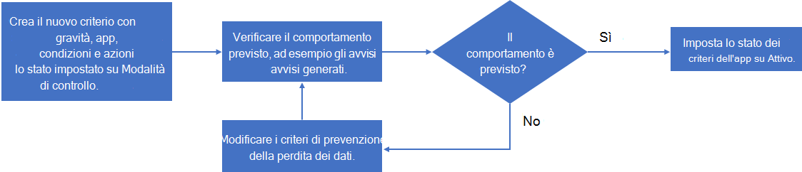

# Creare criteri per le app

>*[Indicazioni per l'assegnazione di licenze di Microsoft 365 per sicurezza e conformità](https://aka.ms/ComplianceSD).*

Oltre a un set predefinito di funzionalità per rilevare il comportamento anomalo delle app e generare avvisi, i criteri delle app nella governance delle app Microsoft sono un modo per:

- Specificare le condizioni in base alle quali la governance delle app può avvisare l'utente del comportamento dell'app per la correzione automatica o manuale.
- Implementare i criteri di conformità delle app per l'organizzazione.

È possibile creare criteri per le app dai modelli forniti personalizzabili oppure è possibile creare criteri personalizzati per le app.

Per creare un nuovo criterio dell'app, passare a **Centro conformità Microsoft 365 > Protezione e governance dell'app > Panoramica > Criteri**:

- Per creare un nuovo criterio dell'app con modelli progettati per l'utilizzo dell'app, selezionare **Crea criterio** in **Crea un criterio di utilizzo delle app**.
- Per creare un nuovo criterio dell'app con modelli progettati per il permesso dell'app, selezionare **Crea criterio** in **Crea un criterio di permesso delle app**.
- Per creare un nuovo criterio dell'app per la certificazione dell'app o un criterio personalizzato, selezionare **Crea nuovo**.

## Modelli di criteri per le app

Per creare un nuovo criterio dell'app basato su un modello di criteri dell'app, nella pagina **Scegli modello di criteri dell'app** selezionare una categoria di modello di app, selezionare il nome del modello e infine scegliere **Avanti**.

La governance delle app include tre categorie di modelli di criteri per le app.

### Utenti dell'app e accesso ai dati

La governance delle app include questi modelli per generare avvisi per l'utilizzo delle app.

| Nome modello | Descrizione |
|:-------|:-----|
| Nuova app con un volume elevato di accesso ai dati | Evidenzia tutte le app registrate di recente con accesso a grandi volumi di dati per garantire che siano previsti tali modelli di dati.    Per impostazione predefinita, questo criterio contrassegnerà tutte le app registrate negli ultimi 7 giorni e che hanno avuto più di 1 GB di accesso ai dati in quel periodo. Questo criterio può essere personalizzato con più condizioni e azioni. |
|||

### Autorizzazioni app

La governance delle app include questi modelli per generare avvisi per le autorizzazioni delle app.

| Nome modello | Descrizione |
|:-------|:-----|
| App con privilegi eccessivi | Evidenzia tutte le app con più autorizzazioni concesse rispetto a quelle usate dalle app in modo da identificare opportunità di riduzione potenziale delle autorizzazioni.    Per impostazione predefinita, questo criterio contrassegnerà tutte le app contrassegnate con privilegi eccessivi se non usate per 90 giorni. Questo filtro del periodo di tempo può essere personalizzato con più condizioni e azioni. |
| Nuova app con autorizzazioni di privilegio elevato | Evidenzia tutte le nuove app che hanno autorizzazioni con privilegi elevati in modo da identificare quali sono le app più adottate che potrebbe essere necessario controllare.    Per impostazione predefinita, questo criterio contrassegnerà tutte le app registrate negli ultimi 7 giorni che dispongono di autorizzazioni di ambito elevato. |
|||

### Certificazione delle app

La governance delle app include questi modelli per generare avvisi per la certificazione delle app.

| Nome modello | Descrizione |
|:-------|:-----|
| Nuova app non certificata | Evidenzia le nuove app che non hanno superato il processo di certificazione delle app in modo da assicurarsi che siano previste nel tenant.    Per impostazione predefinita, questo criterio contrassegnerà tutte le app registrate negli ultimi 7 giorni e non sono certificate. |
|||

## Criteri app personalizzati

Usare un criterio app personalizzato quando è necessario eseguire un'operazione non ancora eseguita da uno dei modelli incorporati.

Per creare un nuovo criterio dell'app personalizzato, selezionare **Crea nuovo** nella pagina **Criteri**. Nella **pagina Scegli modello di criteri app** selezionare la categoria **Personalizzato**, il modello **Criterio personalizzato** e quindi scegliere **Avanti**.

Nella pagina **Nome e descrizione** configurare quanto segue:

- Nome criterio

- Descrizione criterio

- Selezionare la gravità dei criteri, che imposta la gravità degli avvisi generati da questo criterio.

  - Alto
  - Medio
  - Basso

Nella pagina **Scegli le impostazioni e le condizioni dei criteri**, in **Scegli per quali app è applicabile questo criterio**, selezionare:

- Tutte le app
- Scegli le app specifiche

  Un riquadro consente di selezionare una o più app.
  Selezionare **Aggiungi**.

Selezionare **Avanti**.

Nella pagina **Scegli le impostazioni e le condizioni dei criteri** selezionare **Imposta nuove condizioni per i criteri** e quindi scegliere **Avanti**.

Il riquadro **Crea regola** consente di selezionare le condizioni per una nuova regola. Selezionare **Aggiungi condizione**, selezionare dall'elenco delle condizioni e infine specificare il valore della condizione. È possibile aggiungere più condizioni.

Di seguito sono elencate le condizioni disponibili per un criterio app personalizzato.

|Condizione | Valori di condizione accettati | Altre informazioni |
|:-------|:-----|:-------|
| Età della registrazione dell'app | Negli ultimi X giorni |  |
| Certificazione delle app | Conformità di base, conformità MCAS o N/D | [Certificazione Microsoft 365](https://docs.microsoft.com/microsoft-365-app-certification/docs/enterprise-app-certification-guide) |
| Verifica autore | Sì o No | [Verifica dell'autore](https://docs.microsoft.com/azure/active-directory/develop/publisher-verification-overview) |
| Autorizzazione applicazione | Selezionare una o più autorizzazioni API dall'elenco | [Informazioni di riferimento sulle autorizzazioni di Microsoft Graph](https://docs.microsoft.com/graph/permissions-reference) |
| Autorizzazione delegata | Selezionare una o più autorizzazioni API dall'elenco | [Informazioni di riferimento sulle autorizzazioni di Microsoft Graph](https://docs.microsoft.com/graph/permissions-reference) |
| Privilegio elevato | Sì o No | Si tratta di una designazione interna basata sulla stessa logica usata da MCAS. |
| App con privilegi eccessivi | Sì o No | App con più autorizzazioni concesse rispetto a quelle utilizzate da tali app. |
| Accesso ai dati dell'app | Accesso ai dati superiore a X GB all'ora |  |
| Tendenza di accesso ai dati dell'app | X% di aumento dell'utilizzo dei dati negli ultimi 7 giorni |  |
| Accesso all'API dell'app | Più di X chiamate API all'ora |  |
| Tendenza di accesso all'API dell'app | X% di aumento delle chiamate API negli ultimi 7 giorni     |  |
| Utenti con consenso | (Maggiore o minore di) X utenti con consenso |  |
| Utente prioritario acconsentito | Sì o No | Un utente con un [account prioritario](https://docs.microsoft.com/microsoft-365/admin/setup/priority-accounts). |
| App consentita da | Selezionare uno o più utenti dall'elenco |  |
| Ruolo dell'utente che fornisce il consenso | Selezionare uno o più ruoli: amministratore di Teams, amministratori che leggono la directory, amministratore che legge i dati di sicurezza, amministratore di conformità, amministratore della sicurezza, amministratore di supporto tecnico, amministratore di SharePoint, amministratore di Exchange, lettore globale, amministratore globale, amministratore dati di conformità, amministratore utenti, amministratore del supporto dei servizio | Selezioni multiple consentite.    I ruoli Azure AD con un membro assegnato devono essere resi disponibili in questo elenco. |
| Accesso al carico di lavoro | OneDrive e/o SharePoint e/o Exchange | Selezioni multiple consentite. |
| Tasso di errore | Il tasso di errore è maggiore di X% negli ultimi 7 giorni, dove X è un valore definito dall'amministratore |  |
||||

<!--
NOTE TO WRITER: Replace X in the above table with correct values.
-->

Per applicare questo criterio dell'app, è necessario soddisfare tutte le condizioni specificate.

Dopo aver specificato le condizioni, selezionare **Salva** e infine scegliere **Avanti**.

Nella pagina **Definisci azioni criteri** selezionare **Disabilita app** se si desidera che la governance dell'app disabiliti l'app quando viene generato un avviso basato su questo criterio e infine selezionare **Avanti**.

Nella pagina **Definisci stato criteri** selezionare una delle opzioni seguenti:

- **Modalità di controllo**: i criteri vengono valutati, ma le azioni configurate non verranno eseguite. I criteri della modalità di controllo vengono visualizzati con lo stato di **Controlla** nell'elenco dei criteri.
- **Attivo**: i criteri vengono valutati e verranno eseguite azioni configurate.
- **Inattivo**: i criteri non vengono valutati e non verranno eseguite azioni configurate.

<!--
## Configure a user-based policy

## Create an app metadata-based policy

Publish metadata-based policies

## Configure access permissions
-->

## Testare e monitorare i nuovi criteri dell'app

Ora che i criteri dell'app sono stati creati, è necessario monitorarli nella pagina **Criteri** per assicurarsi che registrino un numero previsto di avvisi attivi e avvisi totali durante i test. 

Se il numero di avvisi è un valore inaspettatamente basso, modificare le impostazioni del criterio dell'app per assicurarsi di averlo configurato correttamente prima di impostarne lo stato.

Di seguito è riportato un esempio di processo per creare un nuovo criterio, testarlo e renderlo attivo:

1. Creare i nuovi criteri con gravità, app, condizioni e azioni impostati sui valori iniziali e lo stato impostato su **Modalità di controllo**.
2. Verificare il comportamento previsto, ad esempio gli avvisi generati.
3. Se il comportamento non è previsto, modificare le impostazioni delle app, le condizioni e le azioni dei criteri in base alle esigenze e tornare al passaggio 2.
4. Se il comportamento è previsto, modificare il criterio e modificarne lo stato in **Attivo**.

## Passaggio successivo

[Gestire i criteri delle app.](app-governance-app-policies-manage.md)
