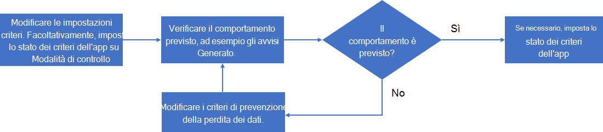

# Gestire i criteri delle app

>*[Indicazioni per l'assegnazione di licenze di Microsoft 365 per sicurezza e conformità](https://aka.ms/ComplianceSD).*

Per restare al passo con le app più recenti che l'organizzazione usa, rispondere a nuovi attacchi basati su app e per le continue modifiche alle esigenze di conformità delle app, potrebbe essere necessario gestire i criteri delle app in questi modi:

- Crea nuovi criteri destinati alle nuove app
- Modifica lo stato di un criterio esistente (attivo, inattivo, modalità di controllo)
- Modifica le condizioni di un criterio esistente
- Modifica le azioni di un criterio esistente per la correzione automatica degli avvisi

Ecco un esempio di processo per la gestione di un criterio esistente:

1. Modifica il criterio:

  - Modifica le impostazioni dei criteri.
  - Se necessario, modifica lo stato in **modalità di controllo** per i test.

2. Verifica il comportamento previsto, ad esempio gli avvisi generati.
1. Se il comportamento non è previsto, torna al passaggio 1.
1. Se il comportamento è previsto, modifica il criterio e modificane lo stato in attivo (se necessario).

## Modifica di una configurazione dei criteri dell'app

Per modificare la configurazione di un criterio app esistente:

- Seleziona il criterio nell'elenco dei criteri e quindi seleziona **Modifica** nel riquadro dei criteri dell'app.
- Seleziona i puntini di sospensione verticali per il criterio nell'elenco, e quindi seleziona **Modifica**.

Per la pagina **Modifica criterio**, scorri le pagine e apporta le modifiche appropriate:

- **Descrizione**: modifica la descrizione per semplificare la comprensione dello scopo del criterio.
- **Gravità**
- **Impostazioni dei criteri**: modifica il set di app a cui si applicano i criteri. È anche possibile scegliere di usare le condizioni esistenti o di modificare le condizioni
- **Azioni**: modifica l'azione di correzione automatica per gli avvisi generati dai criteri.
- **Stato**: modifica lo stato dei criteri.

## Eliminazione di un criterio dell'app

Per eliminare un criterio dell'app, puoi fare quanto segue:

- Seleziona il criterio nell'elenco dei criteri e seleziona **Elimina** nel riquadro dei criteri dell'app.
- Seleziona i puntini di sospensione verticali per il criterio nell'elenco e quindi seleziona **Elimina**.

Un'alternativa all'eliminazione di un criterio dell'app consiste nel modificarne lo stato in inattivo. Una volta inattivo, non genererà avvisi. Ad esempio, invece di eliminare un criterio app per un'app con un set specifico di condizioni utili per un criterio futuro, rinomina il criterio dell'app per indicarne l'utilità e impostarne lo stato su inattivo. In un secondo momento è possibile tornare al criterio e modificarlo per un'app simile e impostarne lo stato sulla modalità di controllo o inattivo.
