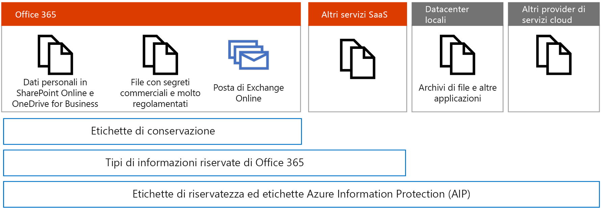
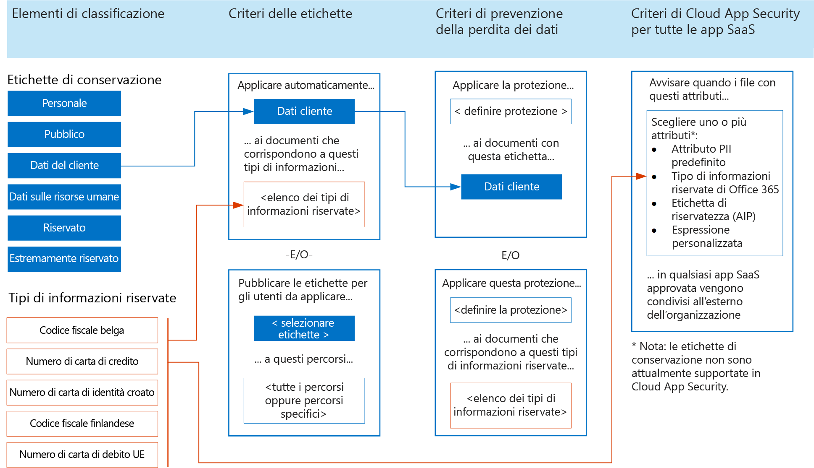
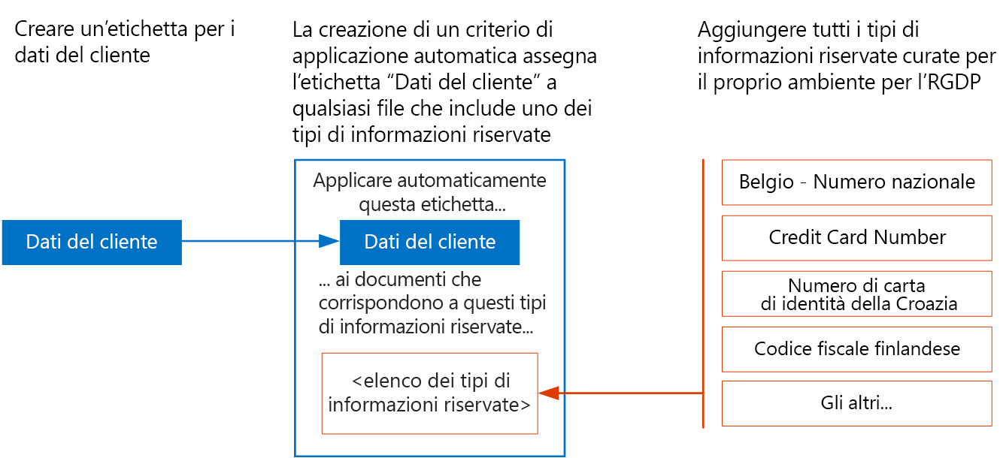

# Applicare le etichette ai dati personali

 Consultare questo argomento se si usano etichette di classificazione per il piano di protezione GDPR. 

Se si usano etichette per la protezione dei dati personali in Microsoft 365, Microsoft consiglia di iniziare con le [etichette di conservazione](retention.md#retention-labels). Con le etichette di conservazione è possibile:
- Usare Advanced Data Governance per applicare automaticamente le etichette in base ai tipi di informazioni sensibili o ad altri criteri.
- Usare le etichette di conservazione con la prevenzione della perdita dei dati per applicare la protezione. 
- Usare le etichette con eDiscovery e Ricerca contenuto. 

Cloud App Security attualmente non supporta le etichette di conservazione, ma è possibile usare i tipi di informazioni sensibili di Microsoft 365 con Cloud App Security per monitorare i dati personali che si trovano in altre app SaaS.

Le [etichette di riservatezza](sensitivity-labels.md) sono attualmente consigliate per l'applicazione di etichette a file locali e in altri provider e servizi cloud. Sono consigliate anche per file in Microsoft 365 che richiedono la crittografia di Azure Information Protection per la protezione dei dati, ad esempio file contenenti segreti commerciali.

Al momento, l'uso di Azure Information Protection per applicare la crittografia non è consigliabile per i file in Microsoft 365 contenenti dati soggetti al GDPR. I servizi di Microsoft 365 attualmente non possono leggere nei file con crittografia AIP. Di conseguenza, il servizio non trova i dati sensibili in questi file.

Le etichette di conservazione possono essere applicate ai messaggi di posta elettronica in Exchange Online e queste etichette funzionano con la prevenzione della perdita dei dati di Microsoft 365. 

Nella figura:

-   Usare le etichette di conservazione per i dati personali per i file con segreti commerciali e soggetti a normative in SharePoint Online e OneDrive for Business.
-   È possibile usare i tipi di informazioni sensibili di Microsoft 365 all'interno di Microsoft 365 e Cloud App Security per monitorare i dati personali che si trovano in altre app SaaS.
-   Usare le etichette di riservatezza per i file con segreti commerciali e soggetti a normative, la posta elettronica di Exchange Online, file in altri servizi SaaS, file in datacenter locali e file in altri provider cloud.

## Usare le etichette di conservazione e i tipi di informazioni sensibili in Microsoft 365 per la protezione delle informazioni

La figura seguente mostra come usare le etichette di conservazione e i tipi di informazioni sensibili in criteri di etichetta, criteri di prevenzione della perdita dei dati e i criteri di Cloud App Security.

Ai fini dell'accessibilità, la seguente tabella fornisce le stesse informazioni dell'illustrazione.

<table>
<thead>
<tr class="header">
<th align="left"><strong>Elementi di classificazione</strong></th>
<th align="left"><strong>Criteri delle etichette - 2 esempi</strong></th>
<th align="left"><strong>Criteri di prevenzione della perdita dei dati - 2 esempi</strong></th>
<th align="left"><strong>I criteri di Cloud App Security per tutte le app SaaS - 1 esempio</strong></th>
</tr>
</thead>
<tbody>
<tr class="odd">
<td align="left">Etichette di conservazione. Esempi: Personale, Pubblico, Dati cliente, Dati risorse umane, Riservato, Estremamente riservato</td>
<td align="left">
Auto apply this label . . .

Dati cliente

. . . to documents that match these sensitive information types . . .

&lt;elenco dei tipi di informazioni riservate&gt;
</td>
<td align="left">
Apply this protection . . .

&lt;definire la protezione&gt;

. . . to documents with this label . . .

Dati cliente

</td>
<td align="left">
Alert when files with these attributes . . .

Scegliere uno o più attributi: attributo PII predefinito, tipologia di informazioni riservate di Microsoft 365, etichetta di riservatezza (AIP), espressione personalizzata

. . . in qualsiasi app SaaS approvata vengono condivisi all'esterno dell'organizzazione

Nota: le etichette di conservazione non sono attualmente supportate in Cloud App Security.</td>
</tr>
<tr class="even">
<td align="left">Sensitive information types. Examples: Belgium National Number, Credit Card Number, Croatia Identity Cart Number, Finland National ID</td>
<td align="left">
Publish these labels for users to manually apply . . .

&lt;selezionare etichette&gt;

. . . to these locations . . .

&lt;tutte i percorsi oppure percorsi specifici&gt;
</td>
<td align="left">
Apply this protection . . .

&lt;definire la protezione&gt;

. . . to documents that match these sensitive information types&gt;
</td>
<td align="left"></td>
</tr>
</tbody>
</table>

## Definire la priorità dei criteri per applicare automaticamente le etichette

For personal data that is subject to GDPR, Microsoft recommends auto-applying labels by using the sensitive information types you curated for your environment. It is important that auto-apply label policies are well designed and tested to ensure the intended behavior occurs.

The order that auto-apply policies are created and whether users are also applying these labels affect the result. So, it's important to carefully plan the roll-out. Here's what you need to know.

### Un'etichetta alla volta

È possibile assegnare solo un'etichetta a un documento.

### I criteri più vecchi hanno la precedenza

If there are multiple rules that assign an auto-apply label and content meets the conditions of multiple rules, the label for the oldest rule is assigned. For this reason, it's important to plan the label policies carefully before configuring them. If an organization requires a change to the priority of the label policies, they'll need to delete and recreate them.

### Le etichette applicate manualmente dall'utente hanno la precedenza su quelle applicate automaticamente

Manual user applied labels trump auto-applied labels. Auto-apply policies can't replace a label that is already applied by a user. Users can replace labels that are auto-applied.

### Le etichette assegnate automaticamente possono essere aggiornate

Le etichette assegnate automaticamente possono essere aggiornate creando nuovi criteri o aggiornando quelli esistenti.

Assicurarsi che il piano di implementazione delle etichette includa:

- Creare i criteri di applicazione automatica secondo l'ordine di priorità.

- Allowing enough time for labels to be automatically applied before rolling these out for users to manually apply. It can take up to seven days for the labels to be applied to all content that matches the conditions.

### Esempio di priorità per creare i criteri di applicazione automatica

<table>
<thead>
<tr class="header">
<th align="left"><strong>Etichette</strong></th>
<th align="left"><strong>Ordine di priorità per creare criteri da applicare automaticamente</strong></th>
</tr>
</thead>
<tbody>
<tr class="odd">
<td align="left">Risorse umane - Dati dipendenti</td>
<td align="left">1</td>
</tr>
<tr class="even">
<td align="left">Dati cliente
</td>
<td align="left">2</td>
</tr>
<tr class="odd">
<td align="left">Estremamente riservato
</td>
<td align="left">3</td>
</tr>
<tr class="even">
<td align="left">Risorse umane - Dati sugli stipendi</td>
<td align="left">4</td>
</tr>
<tr class="odd">
<td align="left">Riservato</td>
<td align="left">5</td>
</tr>
<tr class="even">
<td align="left">Pubblico</td>
<td align="left">6</td>
</tr>
<tr class="odd">
<td align="left">Personale</td>
<td align="left">Nessun criterio di applicazione automatica</td>
</tr>
</tbody>
</table>

## Creare le etichette e i criteri per applicare le etichette automaticamente

Creare le etichette e i criteri nel centro sicurezza o nel centro conformità.

<table>
<thead>
<tr class="header">
<th align="left"><strong>Passaggio</strong></th>
<th align="left"><strong>Descrizione</strong></th>
</tr>
</thead>
<tbody>
<tr class="odd">
<td align="left">
Assegnare autorizzazioni ai membri del team di conformità.
</td>
<td align="left">
Members of your compliance team who will create labels need permissions to use the security center and/or the compliance center. Go to Permissions in the security center or the compliance center and modify the members of the Compliance Administrator group.

Vedere <a href="https://docs.microsoft.com/microsoft-365/security/office-365-security/grant-access-to-the-security-and-compliance-center">Concedere agli utenti l'accesso al centro sicurezza e/o al centro conformità</a>.
</td>
</tr>
<tr class="even">
<td align="left">
Creare etichette di conservazione.
</td>
<td align="left">Passare a Classificazioni nel Centro sicurezza o nel Centro conformità, scegliere Etichette di conservazione e creare le etichette per il proprio ambiente.</td>
</tr>
<tr class="odd">
<td align="left">
Creare criteri di applicazione automatica per le etichette.
</td>
<td align="left">Go to Classification in security center or the compliance center, choose Label policies, and create the policies for auto-applying labels. Be sure to create these policies in the prioritized order.</td>
</tr>
</tbody>
</table>

La figura seguente mostra come creare un'etichetta Dati cliente da applicare automaticamente.

Nella figura:

- Viene creata l'etichetta "Dati del cliente".

- I tipi di informazioni riservate desiderate per l'RGPD sono: codice fiscale belga, numero di carta di credito, numero identità Croazia, codice fiscale Finlandese.

- La creazione di un criterio di applicazione automatica assegna l'etichetta "Dati del cliente" a qualsiasi file che include uno dei tipi di informazioni sensibili aggiunto al criterio.
