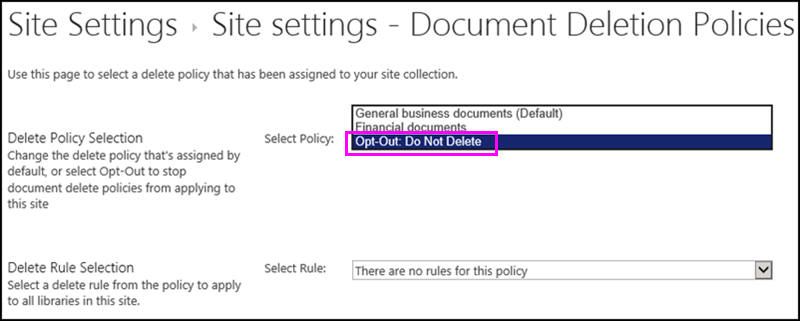

# Applicare o rimuovere un criterio di eliminazione del documento per un sitoApply or remove a document deletion policy for a site

Le organizzazioni spesso sono soggette a regolamentazioni di conformità, normative legali o di altro tipo, che richiedono di mantenere i documenti per un certo periodo di tempo.Organizations are often subject to compliance, legal, or other regulations that require them to retain documents for a certain period of time. Tuttavia, mantenere i documenti più a lungo del necessario può esporre l'organizzazione a rischi legali.However, retaining documents for longer than required can expose the organization to legal risk. Per questo motivo, è possibile che l'organizzazione abbia creato un criterio di eliminazione dei&mdash;documenti per il sito, ad esempio, i documenti aziendali generali potrebbero essere necessari per essere eliminati cinque anni dopo la loro creazione.For this reason, your organization may have created a document deletion policy for your site&mdash;for example, general business documents might be required to be deleted five years after they were created.
  
A seconda dell'organizzazione, un criterio di eliminazione del documento può essere:Depending on your organization, a document deletion policy might be:
  
- **Obbligatorio** Il proprietario di un sito non può escludere un criterio obbligatorio, che viene automaticamente applicato al sito.**Mandatory** A site owner can't opt out of a mandatory policy, which is automatically applied to the site. 
    
- **Predefinito** Un criterio predefinito è applicato al sito automaticamente, ma il proprietario del sito può:**Default** A default policy is automatically applied to a site, but a site owner can: 
    
  - Selezionare un altro criterio, se disponibile.Choose another policy if available.
    
  - Escludere completamente il criterio se non è pertinente per il contenuto del sito.Opt out of the policy entirely if it isn't relevant to the content in the site.
    
- **Né obbligatorio né predefinito** In questo caso, nessun criterio è applicato al sito automaticamente e il proprietario del sito deve eseguire determinate azioni per applicarne uno.**Neither mandatory nor default** In this case, no policy is automatically applied to the site, and the site owner needs to take action to apply one. 
    
Un criterio di eliminazione dei documenti può contenere più di&mdash;una regola, ad esempio, una regola potrebbe dire eliminare i documenti un anno dopo che sono stati creati, ma un'altra regola potrebbe dire eliminare i documenti un anno dopo l'ultima modifica.A document deletion policy may contain more than one rule&mdash;for example, one rule might say delete documents one year after they were created, but another rule might say delete documents one year after they were last modified. Se un criterio contiene più di una regola, è possibile selezionare la regola che meglio si applica al sito.If a policy contains more than one rule, you can select the rule that best applies to your site. La regola di eliminazione verrà applicata a tutte le raccolte all'interno del sito.The delete rule will be applied to all libraries within the site. Solo un criterio e una regola alla volta possono essere attivi in un sito.Only one policy and one rule can be active in a site at one time. Analogamente a un criterio, è possibile impostare una regola come predefinita, in modo che venga applicata automaticamente quando viene applicato il criterio.Like a policy, a rule can be set as default, so that it's applied automatically when the policy is applied.
  
Infine, i criteri di eliminazione del documento vengono ereditati. Quando selezioni un criterio o una regola per il tuo sito, tale scelta viene ereditata da tutti i siti secondari, anche se il proprietario di un sito secondario può interrompere l'ereditarietà selezionando un criterio o una regola diversi. Quando selezioni un criterio o una regola, tieni presente il contenuto di eventuali siti secondari all'interno del tuo sito.Finally, document deletion policies are inherited. When you select a policy or rule for your site, that selection is inherited by all subsites, although an owner of a subsite can break inheritance by selecting a different policy or rule. When you select a policy or rule, consider the content of any subsites below your site.
  
## Visualizzare i criteri di eliminazione del documento disponibili in una raccolta sitiView the document deletion policies available in a site collection

La tua organizzazione può assegnare criteri diversi a raccolte siti diverse. A livello della raccolta siti, il proprietario di una raccolta siti può visualizzare tutti i criteri di eliminazione del documento disponibili per tale raccolta siti. I criteri possono essere stati resi disponibili per il modello della raccolta siti (e di conseguenza per tutte le raccolte siti create da quel modello) oppure per quella specifica raccolta siti.Your organization may assign different policies to different site collections. At the site collection level, an owner of a site collection can view all of the document deletion policies that are available to that site collection. The policies may have been made available to the site collection template (and therefore all site collections created from this template) or to this specific site collection.
  
1. Nel sito principale della raccolta siti, nell'angolo in alto a destra, scegliere **Impostazioni** [icona Gear] \> **Impostazioni sito**.In the top-level site in the site collection, in the upper-right corner, choose **Settings** [gear icon] \> **Site Settings**.
    
2. In **criteri di eliminazione dei documenti**di **Amministrazione** \> raccolta siti.Under **Site Collection Administration** \> **Document Deletion Policies**.
    
    > [!NOTE]
    > Il collegamento **criteri di eliminazione dei documenti** non verrà visualizzato a meno che non siano stati assegnati criteri alla raccolta siti.The **Document Deletion Policies** link won't appear unless policies have been assigned to the site collection. Inoltre, il collegamento non viene visualizzato subito dopo che i criteri sono stati assegnati al sito, ma può richiedere fino a 24 ore da quando i criteri vengono assegnati quando viene visualizzato il collegamento **criteri di eliminazione dei documenti** .Also, the link doesn't appear immediately after policies have been assigned to the site — it can take up to 24 hours from when the policies are assigned to when the **Document Deletion Policies** link appears. 
  
3. In questa pagina puoi trovare:On this page you can view:
    
  - I criteri attualmente assegnati e le regole associate. Seleziona un criterio per visualizzare le regole nel riquadro destro.The currently assigned policies and the associated rules. Select a policy to view the rules in the right pane.
    
  - Se presente, il criterio predefinito presenta l'opzione **Sì** nella colonna **predefinita**.The default policy, if any, displays **Yes** in the **Default** column. 
    
  - Se è stato assegnato un criterio **obbligatorio**, al di sotto dell'elenco viene visualizzato un messaggio.A message is displayed below the list if the policy has been assigned as **Mandatory**.
    
Questo elenco è solo in modalità visualizzazione e consente al proprietario della raccolta siti di vedere tutti i criteri e le regole disponibili. Per informazioni sull'applicazione di un criterio, consulta la sezione successiva.This list is view only, for the site collection owner to see all of the available policies and rules. To apply a policy, see the next section.
  

  
## Applicare o rimuovere un criterio di eliminazione del documento per un sitoApply or remove a document deletion policy for a site

È possibile che la tua organizzazione abbia creato dei criteri che, in qualità di proprietario di un sito o di una raccolta siti, puoi sia applicare al tuo sito sia disattivare completamente.As a site owner or site collection owner, your organization may have created policies that you can either apply to your site or opt out of entirely.
  
1. Nell'angolo in alto a destra, scegliere **Impostazioni** [icona ingranaggi] \> **Impostazioni sito**.In the upper-right corner, choose **Settings** [gear icon] \> **Site Settings**.
    
2. In **criteri di eliminazione dei documenti**di amministrazione \> del **sito** .Under **Site Administration** \> **Document Deletion Policies**.
    
    > [!NOTE]
    > Il collegamento **criteri di eliminazione dei documenti** non verrà visualizzato a meno che non siano stati assegnati criteri alla raccolta siti.The **Document Deletion Policies** link won't appear unless policies have been assigned to the site collection. Inoltre, il collegamento non viene visualizzato subito dopo che i criteri sono stati assegnati al sito, ma può richiedere fino a 24 ore da quando i criteri vengono assegnati quando viene visualizzato il collegamento **criteri di eliminazione dei documenti** .Also, the link doesn't appear immediately after policies have been assigned to the site — it can take up to 24 hours from when the policies are assigned to when the **Document Deletion Policies** link appears. 
  
3. Eseguire una delle operazioni seguenti:Do one of the following:
    
  - **Per applicare un criterio** Selezionare un criterio \> selezionare una regola per il \> **salvataggio**di un criterio.**To apply a policy** Select a policy \> select a rule in that policy \> **Save**.
    
    Solo un criterio e una regola alla volta possono essere attivi in un sito. L'organizzazione può fornire più criteri e regole tra cui scegliere oppure metterne a disposizione solo uno.Only one policy and one rule can be active in a site at one time. Your organization may provide several policies and rules to choose from, or only one policy or rule.
    
    
  
  - **Per rifiutare l'esclusione di un criterio** Scegliere **opt-out: do note Delete** \> **Save**.**To opt out of a policy** Choose **Opt-Out: Do Note Delete** \> **Save**.
    
    Come proprietario di un sito, è possibile escludere un criterio di eliminazione dei documenti se si determina che il criterio non è applicabile al contenuto del sito.As a site owner, you can opt out of a document deletion policy if you determine that the policy isn't applicable to the content in your site. Tuttavia, non è possibile escludere un criterio contrassegnato come **obbligatorio**.However, you can't opt out of a policy that has been marked as **Mandatory**.
    
    
  
## I criteri di eliminazione del documento ignorano altri criteriDocument deletion policies override other policies

Un sito può utilizzare altri criteri per il mantenimento e l'eliminazione dei contenuti:A site may use other policies for retaining and deleting content:
  
- Criteri tipo di contenuto per la raccolta siti.Content type policies for the site collection.
    
- Criteri di gestione delle informazioni per un elenco o una libreria.Information management policies for a list or library.
    
Se applichi un criterio di eliminazione del documento a un sito che già utilizza criteri tipo di contenuto o criteri di gestione delle informazioni per un elenco o una libreria, tali criteri vengono ignorati mentre il criterio di eliminazione del documento è attivo.If you apply a document deletion policy to a site that already uses content type policies or information management policies for a list or library, those policies are ignored while the document deletion policy is in effect. Se altri criteri vengono ignorati, verrà visualizzato il messaggio "contenuto in questo sito utilizza i criteri di eliminazione dei documenti".If other policies are ignored, you'll see the message "Content on this site uses Document Deletion Policies".
  
Questo significa che dovresti pianificare un sito che utilizzi solo criteri destinati a contenuti strutturati (criteri di gestione delle informazioni e criteri tipo di contenuto) o contenuti non strutturati (criteri di eliminazione del documento) e non ad entrambi.This means you should plan for a site to use only policies meant for structured content (information management policies and content type policies) or unstructured content (document deletion policies), not both. Se si sceglie di escludere un criterio di eliminazione dei documenti, l'avviso non verrà visualizzato e altri tipi di criteri continueranno a funzionare.If you opt out of a document deletion policy, the warning won't be displayed and other types of policies will continue to work.
  
I criteri di eliminazione del documento non hanno alcun effetto sui criteri sito.Site policies are not affected by document deletion policies.
  
### Determinare se i criteri tipo di contenuto vengono ignoratiDetermine if content type policies are being ignored

Se il tuo sito stava utilizzando criteri tipo di contenuto e ne ricevi il messaggio solo adesso, quei criteri non sono più attivi.If your site was using content type policies and you now see this message, those policies are no longer in effect. Per ripristinare i criteri dei tipi di contenuto, è possibile rimuovere il criterio di eliminazione dei documenti dal sito, come descritto in precedenza, se è disponibile un'opzione di disattivazione.To restore the content type policies, you can remove the document deletion policy from your site, as described earlier, if there's an opt-out option available. Se non è possibile escludere l'opzione, i criteri di eliminazione dei documenti sono obbligatori ed è necessario contattare il responsabile della conformità nell'organizzazione.If there's no option to opt out, the document deletion policy is mandatory, and you need to contact the compliance officer in your organization.
  
1. Nell'angolo in alto a destra, scegliere **Impostazioni** [icona ingranaggi] \> **Impostazioni sito**.In the upper-right corner, choose **Settings** [gear icon] \> **Site Settings**.
    
2. In \> **modelli di criteri tipo di contenuto** **Amministrazione sito** .Under **Site Administration** \> **Content Type Policy Templates**.
    
    
  
### Determinare se i criteri di gestione delle informazioni vengono ignoratiDetermine if information management policies are being ignored

Se il tuo sito stava utilizzando criteri di gestione delle informazioni e ne ricevi il messaggio solo adesso, quei criteri non sono più attivi.If your site was using information management policies and you now see this message, those policies are no longer in effect. Per ripristinare i criteri di gestione delle informazioni, è possibile rimuovere il criterio di eliminazione dei documenti dal sito, come descritto in precedenza, se è disponibile un'opzione di disattivazione.To restore the information management policies, you can remove the document deletion policy from your site, as described earlier, if there's an opt-out option available. Se non è possibile escludere l'opzione, i criteri di eliminazione dei documenti sono obbligatori ed è necessario contattare il responsabile della conformità nell'organizzazione.If there's no option to opt out, the document deletion policy is mandatory, and you need to contact the compliance officer in your organization.
  
- Per un elenco o una raccolta, nelle impostazioni \> della \> **raccolta** \> **schede della raccolta della** barra multifunzione in **autorizzazioni e gestione** \> delle informazioni di gestione **delle impostazioni dei criteri**.For a list or library, on the Ribbon \> **Library** tab \> **Library Settings** \> under **Permissions and Management** \> **Information Management Policy Settings**.
    
    
  
## Vedere ancheSee also

[Panoramica dei criteri di eliminazione dei documentiOverview of document deletion policies](document-deletion-policies.md)
  
[Creare un criterio di eliminazione dei documentiCreate a document deletion policy](create-a-document-deletion-policy.md)

