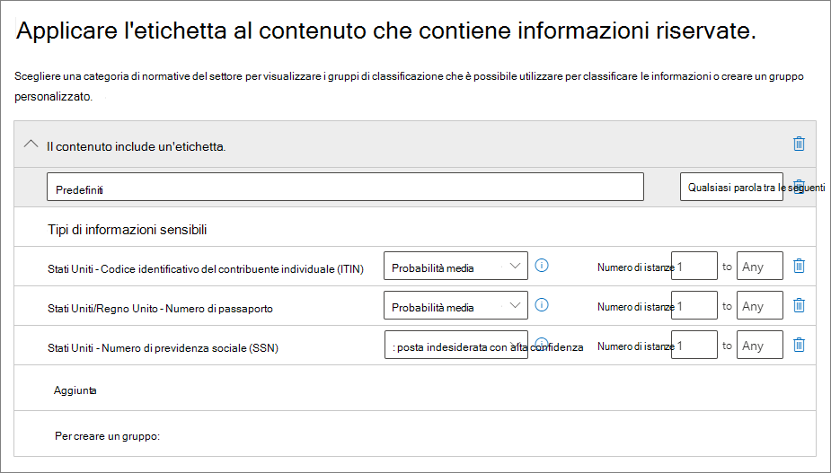

# <a name="automatically-apply-a-retention-label-to-retain-or-delete-content"></a>Applicare automaticamente un'etichetta di conservazione per conservare o eliminare il contenuto

>*[Indicazioni per l'assegnazione di licenze di Microsoft 365 per sicurezza e conformità](/office365/servicedescriptions/microsoft-365-service-descriptions/microsoft-365-tenantlevel-services-licensing-guidance/microsoft-365-security-compliance-licensing-guidance).*

> [!NOTE]
> Questo scenario non è supportato per i [record normativi](records-management.md#records).

Una delle funzionalità più efficaci delle [etichette di conservazione](retention.md) è la possibilità di applicarle automaticamente al contenuto che soddisfa condizioni specificate. In questo caso, gli utenti dell'organizzazione non dovranno applicare le etichette di conservazione. Microsoft 365 lo farà automaticamente.
  
Le etichette di conservazione applicate automaticamente sono potenti perché:
  
- Non è necessario formare gli utenti su tutte le classificazioni.
    
- Non è necessario affidarsi solo agli utenti per la classificazione corretta di tutto il contenuto.
    
- Gli utenti non hanno più bisogno di conoscere i criteri di governance dai dati e possono concentrarsi sul loro lavoro.
    
È possibile applicare automaticamente etichette di conservazione al contenuto quando questo include informazioni sensibili, parole chiave, proprietà disponibili per la ricerca o una corrispondenza per [classificatori sottoponibili a training](classifier-get-started-with.md).

> [!TIP]
> Rilasciate di recente, le proprietà disponibili per la ricerca consentono di identificare le [Registrazioni delle riunioni di Teams](#microsoft-teams-meeting-recordings).

I processi per l'applicazione automatica di un'etichetta di conservazione si basano sulle condizioni seguenti:


Usare le istruzioni seguenti per i due passaggi per l'amministratore.

> [!NOTE]
> I criteri di applicazione automatica usano l'etichettatura sul lato servizio con condizioni per applicare automaticamente etichette di conservazione. È anche possibile applicare automaticamente un'etichetta di conservazione con un criterio di etichetta eseguendo le operazioni seguenti: 
>
> - Applicare un'etichetta di conservazione a un modello di analisi dei documenti in SharePoint Syntex
> - Applicare un'etichetta di conservazione per SharePoint e Outlook
>- Applicare un'etichetta di conservazione alla posta elettronica mediante le regole di Outlook
>
> Per questi scenari, vedere [Creare e applicare etichette di conservazione nelle app](create-apply-retention-labels.md).

## <a name="before-you-begin"></a>Prima di iniziare

L'amministratore globale dell'organizzazione dispone delle autorizzazioni complete per creare e modificare le etichette conservazione e i relativi criteri. Se non si esegue l'accesso come amministratore globale, vedere le [autorizzazioni necessarie per creare e gestire criteri di conservazione ed etichette di conservazione](get-started-with-retention.md#permissions-required-to-create-and-manage-retention-policies-and-retention-labels).

## <a name="how-to-auto-apply-a-retention-label"></a>Come applicare automaticamente un'etichetta di conservazione

Creare prima di tutto l'etichetta di conservazione. Quindi, creare un criterio automatico per applicare l'etichetta. Se è già stata creata l'etichetta di conservazione, passare a [Creare un criterio di applicazione automatica](#step-2-create-an-auto-apply-policy).

Le istruzioni di spostamento variano a seconda che si usi o meno la [gestione dei record](records-management.md). Sono disponibili istruzioni per entrambi gli scenari.

### <a name="step-1-create-a-retention-label"></a>Passaggio 1: Creare un'etichetta di conservazione

1. Nel [Centro conformità Microsoft 365](https://compliance.microsoft.com/) passare a una delle posizioni seguenti:
    
    - Se si usa la gestione dei record:
        - **Soluzioni** > **Records management** > scheda **Piano di archiviazione** > **+ Crea un'etichetta** > **Etichetta di conservazione**
        
    - Se non si usa la gestione dei record:
       - **Soluzioni** > **Governance delle informazioni** > scheda **Etichette** > + **Crea un'etichetta**
    
    L'opzione non è immediatamente visibile? Selezionare per prima cosa **Mostra tutto**. 

2. Seguire le istruzioni della procedura guidata. Se si usa la gestione dei record:
    
    - Per informazioni sui descrittori del piano di archiviazione, vedere [Usare il piano di archiviazione per gestire le etichette di conservazione](file-plan-manager.md).
    
    - Per usare le etichette di conservazione per dichiarare i record, selezionare **Contrassegna elementi come record** o **Contrassegna elementi come record normativi**. Per altre informazioni, vedere [Configurare le etichette di conservazione per dichiarare i record](declare-records.md#configuring-retention-labels-to-declare-records).

3. Una volta creata l'etichetta e dopo la comparsa dell'opzione per pubblicarla, applicare automaticamente l'etichetta o semplicemente salvarla: selezionare **Applica automaticamente questa etichetta a un tipo specifico di contenuto**, quindi selezionare **Fatto** per avviare la procedura guidata di creazione automatica delle etichette e procedere direttamente al passaggio 2 della procedura seguente.

Per modificare un'etichetta esistente, selezionarla e quindi selezionare l'opzione **Modifica etichetta** per avviare la procedura guidata di modifica che consente di modificare le descrizioni dell'etichetta e qualsiasi [impostazione idonea](#updating-retention-labels-and-their-policies) del passaggio 2.

### <a name="step-2-create-an-auto-apply-policy"></a>Passaggio 2: Creare un criterio di applicazione automatica

Quando si crea un criterio di applicazione automatica, si seleziona un'etichetta di conservazione da applicare automaticamente al contenuto in base alle condizioni specificate.

1. Nel [Centro conformità Microsoft 365](https://compliance.microsoft.com/) passare a una delle posizioni seguenti:
    
    - Se si usa la gestione dei record: **Governance delle informazioni**:
        - **Soluzioni** > **Gestione dei record** > scheda **Criteri delle etichette** > **Applica automaticamente etichetta**
    
    - Se non si usa la gestione dei record:
        - **Soluzioni** > **Governance delle informazioni** > scheda **Criteri delle etichette** > **Applica automaticamente etichetta**
    
    L'opzione non è immediatamente visibile? Selezionare per prima cosa **Mostra tutto**. 

2. Seguire le istruzioni della procedura guidata per la creazione automatica di etichette.
    
    Per informazioni su come configurare le condizioni per l'applicazione automatica dell'etichetta di conservazione, vedere la sezione [Configurare le condizioni per l'applicazione automatica delle etichette di conservazione](#configuring-conditions-for-auto-apply-retention-labels) in questa pagina.
    
    Per informazioni sulle posizioni supportate dalle etichette di conservazione, vedere la sezione [Etichette di conservazione e posizioni](retention.md#retention-label-policies-and-locations).

Per modificare un criterio di applicazione automatica esistente, selezionarlo per avviare la procedura guidata di modifica del criteri di conservazione, che consente di modificare l'etichetta selezionata e qualsiasi [impostazione idonea](#updating-retention-labels-and-their-policies) del passaggio 2.

Dopo aver applicato l’etichetta al contenuto tramite un criterio di applicazione automatica, non è possibile rimuovere o cambiare automaticamente l’etichetta cambiando il contenuto o il criterio oppure tramite un nuovo criterio di applicazione automatica dell’etichetta. Per altre informazioni, vedere [Panoramica delle etichette di conservazione](retention.md#only-one-retention-label-at-a-time).

### <a name="configuring-conditions-for-auto-apply-retention-labels"></a>Configurare le condizioni per l'applicazione automatica delle etichette di conservazione

È possibile applicare automaticamente etichette di conservazione al contenuto quando questo contiene:

- [Tipi specifici di informazioni riservate.](#auto-apply-labels-to-content-with-specific-types-of-sensitive-information)

- [Parole chiave specifiche o proprietà disponibili per la ricerca che corrispondono a una query creata.](#auto-apply-labels-to-content-with-keywords-or-searchable-properties)

- [Una corrispondenza per classificatori sottoponibili a training](#auto-apply-labels-to-content-by-using-trainable-classifiers)

#### <a name="auto-apply-labels-to-content-with-specific-types-of-sensitive-information"></a>Applicare automaticamente etichette al contenuto con tipi specifici di informazioni sensibili

> [!WARNING]
> Questa configurazione attualmente ha una limitazione nota per cui a tutti i messaggi di posta elettronica senza etichetta viene sempre applicata l’etichetta di conservazione selezionata, quando vi è una corrispondenza per i tipi di informazioni riservate scelte. Ad esempio, anche se il criterio di applicazione automatica viene riservato a specifici utenti oppure vengono selezionati percorsi diversi da Exchange per i criteri, l’etichetta viene sempre applicata ai messaggi di posta elettronica senza etichetta quando vi è una corrispondenza.

Quando si creano criteri di conservazione ad applicazione automatica per le informazioni riservate, viene visualizzato lo stesso elenco di modelli di criteri mostrato quando si creano criteri di prevenzione della perdita dei dati (DLP). Ogni modello è preconfigurato in modo da cercare specifici tipi di informazioni riservate. Nell'esempio seguente, i tipi di informazioni sensibili appartengono alla categoria **Privacy** e al modello dei **dati relativi alle Informazioni personali statunitense**:



Per altre informazioni sui tipi di informazioni sensibili, vedere [Definizioni delle entità tipo di informazione sensibile](sensitive-information-type-entity-definitions.md). Attualmente, le [corrispondenze esatte dei dati](create-custom-sensitive-information-types-with-exact-data-match-based-classification.md) e la [creazione dell'impronta digitale dei documenti](document-fingerprinting.md) non sono supportate per questo scenario.

Dopo aver selezionato un modello di criteri, è possibile aggiungere o rimuovere qualsiasi tipo di informazioni e cambiare il livello di confidenza e il numero di istanze. Nello screenshot dell'esempio precedente, queste opzioni sono state modificate in modo da poter applicare un'etichetta di conservazione solo quando:
  
- Il tipo di informazioni sensibili che presentano un'accuratezza (o un [livello di confidenza](sensitive-information-type-learn-about.md#more-on-confidence-levels)) di almeno **Media confidenza** per due dei tipi di informazioni sensibili e **Alta confidenza** per uno. Molti tipi di informazioni sensibili sono definiti con più criteri. I criteri con un livello di accuratezza della corrispondenza superiore richiedono l'individuazione di ulteriori elementi di prova (ad esempio parole chiave, date o indirizzi), mentre i criteri con un livello di accuratezza della corrispondenza inferiore richiedono meno elementi di prova. Un livello di confidenza più basso corrisponde a una maggiore corrispondenza dei contenuti alla condizione, ma anche a un maggior numero di potenziali falsi positivi.

- Il contenuto include tra 1 e 9 istanze di qualsiasi di questi tre tipi di informazioni riservate. L'impostazione predefinita per il valore **a** è **Qualsiasi**.

Per altre informazioni su queste opzioni, vedere le indicazioni seguenti della documentazione sulla prevenzione della perdita dei dati [Modificare le regole per rendere più facili o difficili le corrispondenze](data-loss-prevention-policies.md#tuning-rules-to-make-them-easier-or-harder-to-match).

Per considerare quando si usano tipi di informazioni riservate per applicare automaticamente etichette di conservazione:

- Gli elementi nuovo e modificato possono essere etichettati automaticamente.

#### <a name="auto-apply-labels-to-content-with-keywords-or-searchable-properties"></a>Applicare automaticamente etichette al contenuto con parole chiave o con proprietà disponibili per le ricerche

È possibile applicare automaticamente etichette al contenuto usando una query che include parole, frasi, valori o proprietà disponibili per le ricerche specifiche. È possibile perfezionare la query usando operatori di ricerca come AND, OR e NOT.


Per altre informazioni sulla sintassi della query che usa Keyword Query Language (KQL), vedere [Riferimenti alla sintassi KQL (Keyword Query Language)](/sharepoint/dev/general-development/keyword-query-language-kql-syntax-reference).

I criteri di applicazione automatica basati su query usano lo stesso indice di ricerca della ricerca contenuto di eDiscovery per identificare il contenuto. Per altre informazioni sulle proprietà ricercabili utilizzabili, vedere [Query con parola chiave e condizioni di ricerca per la ricerca di contenuto](keyword-queries-and-search-conditions.md).

Alcuni aspetti da considerare quando si usano parole chiave o proprietà ricercabili per applicare automaticamente etichette di conservazione:

- Gli elementi nuovo, modificato ed esistente verranno etichettati automaticamente per SharePoint, OneDrive ed Exchange.

- Per SharePoint, le proprietà sottoposte a ricerca per indicizzazione e le proprietà personalizzate non sono supportate per queste query KQL ed è necessario usare solo le proprietà gestite predefinite. È tuttavia possibile usare i mapping a livello di tenant con le proprietà gestite predefinite abilitate come criteri di affinamento ricerca per impostazione predefinita (RefinableDate00-19, RefinableString00-99, RefinableInt00-49, RefinableDecimals00-09 e RefinableDouble00-09). Per altre informazioni, vedere [Panoramica delle proprietà gestite e sottoposte a ricerca per indicizzazione in SharePoint Server](/SharePoint/technical-reference/crawled-and-managed-properties-overview)e per le istruzioni, vedere [Creare una nuova proprietà gestita](/sharepoint/manage-search-schema#create-a-new-managed-property).

- Se si esegue il mapping di una proprietà personalizzata a una delle proprietà di affinamento, attendere 24 ore prima di usarla nella query KQL per un'etichetta di conservazione.

- Anche se le proprietà gestite di SharePoint possono essere rinominate con gli alias, non usare queste per le query di KQL nelle etichette. Specificare sempre il nome effettivo della proprietà gestita, ad esempio RefinableString01.

- Per cercare valori contenenti spazi o caratteri speciali, usare le virgolette doppie (`" "`) per includere la frase, come riportato nell'esempio seguente: `subject:"Financial Statements"`.

- Usare la proprietà *DocumentLink* anziché *Percorso* per trovare una corrispondenza con un elemento in base all'URL. 

- Le ricerche con caratteri jolly come suffisso ( come `*cat`) o le ricerche con carattere jolly come sottostringa (come `*cat*`) non sono supportate. Tuttavia, i caratteri jolly sono supportati nelle ricerche con prefissi (come `cat*`).

- Tenere presente che gli elementi parzialmente indicizzati possono essere responsabili della mancata etichettatura di elementi previsti o dell'etichettatura di elementi che si prevede di escludere dall'etichettatura quando si usa l'operatore NOT. Per altre informazioni, vedere [Elementi parzialmente indicizzati](partially-indexed-items-in-content-search.md).


Esempi di query:

| Carico di lavoro | Esempio |
|:-----|:-----|
|Exchange   | `subject:"Financial Statements"` |
|Exchange   | `recipients:garthf@contoso.com` |
|SharePoint | `contenttype:document` |
|SharePoint | `site:https://contoso.sharepoint.com/sites/teams/procurement AND contenttype:document`|
|Exchange o SharePoint | `"customer information" OR "private"`|

Esempi più complessi problemi:

La query seguente per SharePoint identifica i documenti di Word o i fogli di calcolo di Excel quando tali file contengono le parole chiave **password**, **password** o **PW**:

```
(password OR passwords OR pw) AND (filetype:doc* OR filetype:xls*)
```

La query seguente per Exchange identifica qualsiasi documento di Word o PDF che contiene la parola **nda** o la frase **Accordo di riservatezza** quando tali documenti sono allegati a un messaggio di posta elettronica:

```
(nda OR "non disclosure agreement") AND (attachmentnames:.doc* OR attachmentnames:.pdf)
```

La query seguente per SharePoint identifica i documenti che contengono un numero di carta di credito: 

```
sensitivetype:"credit card number"
```

La query seguente contiene alcune parole chiave tipiche che consentono di identificare documenti o messaggi di posta elettronica contenenti contenuto legale:

```
ACP OR (Attorney Client Privilege*) OR (AC Privilege)
```

La query seguente contiene parole chiave tipiche che consentono di identificare documenti o messaggi di posta elettronica per risorse umane: 

```
(resume AND staff AND employee AND salary AND recruitment AND candidate)
```

Si noti che in questo esempio finale viene usata la procedura consigliata che include sempre operatori tra parole chiave. Uno spazio tra parole chiave (o due espressioni proprietà:valore) corrisponde all'uso di AND. Aggiungendo sempre operatori, risulta più facile notare che la query di esempio consente di identificare solo il contenuto che include tutte le parole chiave, anziché il contenuto che contiene una qualsiasi delle parole chiave. Se si intende identificare il contenuto che contiene una qualsiasi delle parole chiave, specificare O al posto di E. Come mostrato in questo esempio, quando si specificano sempre gli operatori, risulta più facile interpretare correttamente la query. 

##### <a name="microsoft-teams-meeting-recordings"></a>Registrazioni delle riunioni di Teams

> [!NOTE]
> La funzionalità che consente di mantenere o eliminare le registrazioni delle riunioni di Teams e non sarà disponibile prima che le registrazioni siano salvate in OneDrive o SharePoint. Per altre informazioni, vedere [Usare OneDrive for Business e SharePoint o Stream per registrare le riunioni](/MicrosoftTeams/tmr-meeting-recording-change).

Per identificare le registrazioni delle riunioni di Microsoft Teams salvate negli account OneDrive degli utenti o in SharePoint, specificare quanto segue nell'**Editor di query con parole chiave**:

``` 
ProgID:Media AND ProgID:Meeting
```

Nella maggior parte dei casi le registrazioni delle riunioni vengono salvate in OneDrive, ma le riunioni di canale vengono salvate in SharePoint.


#### <a name="auto-apply-labels-to-content-by-using-trainable-classifiers"></a>Etichette applicate automaticamente al contenuto con classificatori sottoponibili a training

Se si sceglie l'opzione del classificatore sottoponibile a training, è possibile selezionare un classificatore predefinito oppure personalizzato. I classificatori predefiniti includono i **curriculum**, il **codice sorgente**, le **molestie mirate**, i **contenuti volgari** e le **minacce**:


> [!CAUTION]
> Il classificatore predefinito **Linguaggio offensivo** è stato deprecato perché generava un numero elevato di falsi positivi. Non usare questo classificatore predefinito e, se è in uso, è consigliabile spostare i processi aziendali da esso. Usare invece i classificatori predefiniti per **molestie**, **volgarità** e **minacce**.

Per applicare automaticamente un'etichetta utilizzando questa opzione, i siti e le cassette postali di SharePoint devono avere almeno 10 MB di dati.

Per altre informazioni sui classificatori sottoponibili a training, vedere [Informazioni sui classificatori sottoponibili a training](classifier-learn-about.md).

> [!TIP]
> Se si usano classificatori sottoponibili a training per Exchange, vedere [Come ripetere il training in Esplora contenuto](classifier-how-to-retrain-content-explorer.md).

Per considerare quando si usano tipi di classificatori sottoposti a training per applicare automaticamente etichette di conservazione:

- Gli elementi nuovo e modificato possono essere etichettati automaticamente, insieme agli elementi esistenti degli ultimi sei mesi.

## <a name="how-long-it-takes-for-retention-labels-to-take-effect"></a>Tempo necessario per l'applicazione delle etichette di conservazione

In caso di applicazione automatica di etichette di conservazione, possono essere necessari fino a sette giorni prima che le etichette vengano applicate a tutto il contenuto esistente che soddisfa le condizioni.
  


Se le etichette previste non compaiono dopo sette giorni, verificare lo **stato** del criterio di applicazione automatica selezionandolo dalla pagina **Criteri etichetta** nel centro conformità. Se viene visualizzato lo stato **Disattivato (errore)** e nei dettagli per i percorsi viene visualizzato un messaggio che richiede più tempo del previsto per la distribuzione del criterio (per SharePoint) o per provare a ridistribuire i criteri (per OneDrive), provare a eseguire il comando di PowerShell [Set-RetentionCompliancePolicy](/powershell/module/exchange/set-retentioncompliancepolicy) per riprovare la distribuzione dei criteri:

1. [Connettersi a PowerShell in Centro sicurezza e conformità](/powershell/exchange/connect-to-scc-powershell).

2. Eseguire il comando seguente:
    
    ``` PowerShell
    Set-RetentionCompliancePolicy -Identity <policy name> -RetryDistribution
   ```

## <a name="updating-retention-labels-and-their-policies"></a>Aggiornare le etichette di conservazione e i criteri

Quando si modifica un'etichetta di conservazione o un criterio di applicazione automatica e l'etichetta di conservazione è già applicata al contenuto, le impostazioni aggiornate verranno applicate automaticamente a tale contenuto oltre che a quello identificato per la prima volta.

Alcune impostazioni non possono essere modificate dopo aver creato e salvato l'etichetta o i criteri, tra cui:
- L’etichetta di conservazione, il nome del criterio di conservazione e le impostazioni di conservazione, ad eccezione del periodo di conservazione. Tuttavia, non è possibile modificare il periodo di conservazione quando il periodo di conservazione è basato sulla data di etichettatura degli elementi.
- Opzione per contrassegnare gli elementi come record.

### <a name="deleting-retention-labels"></a>Eliminazione delle etichette di conservazione.

È possibile eliminare le etichette di conservazione che al momento non sono incluse in alcun criterio di conservazione, che non sono configurate per la conservazione basata su eventi o che contrassegnano gli elementi come record normativi.

Nel caso delle etichette di conservazione eliminabili, l'eliminazione non riuscirà se sono state applicate agli elementi e viene visualizzato un collegamento a Esplora contenuto per identificare gli elementi etichettati.

Tuttavia, la visualizzazione degli elementi etichettati in Esplora contenuto può richiedere fino a due giorni. In questo scenario, l'etichetta di conservazione può essere eliminata senza visualizzare il collegamento a Esplora contenuto.

## <a name="locking-the-policy-to-prevent-changes"></a>Blocco dei criteri per evitare le modifiche

Se occorre fare in modo che nessuno possa disattivare o eliminarle i criteri o renderli meno restrittivi, vedere [Usare la protezione dell'archiviazione per limitare le modifiche ai criteri di conservazione e ai criteri per le etichette di conservazione](retention-preservation-lock.md).

## <a name="next-steps"></a>Passaggi successivi

Vedere [Usare etichette di riservatezza per gestire il ciclo di vita dei documenti archiviati in SharePoint](auto-apply-retention-labels-scenario.md) per uno scenario di esempio in cui viene usato un criterio di applicazione automatica dell'etichetta di conservazione con proprietà gestite in SharePoint, e la conservazione basata su eventi per avviare il periodo di conservazione.