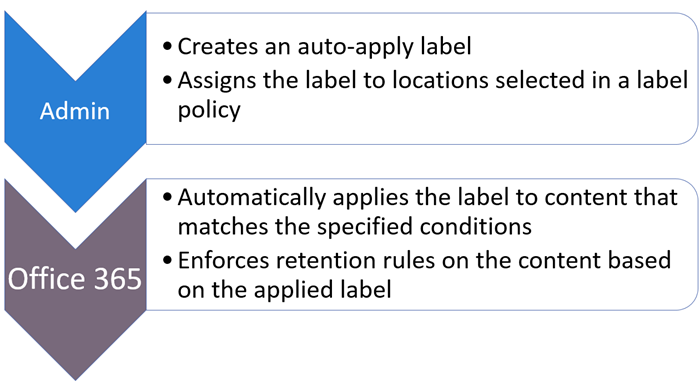
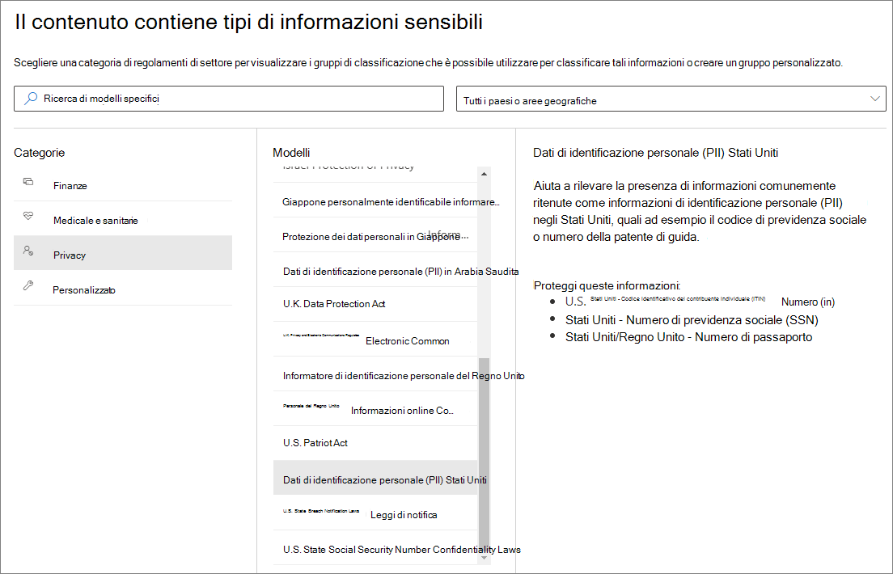
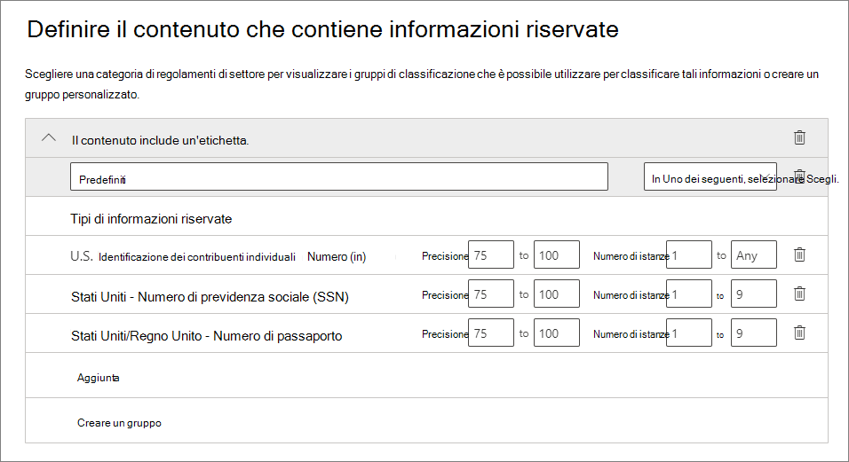
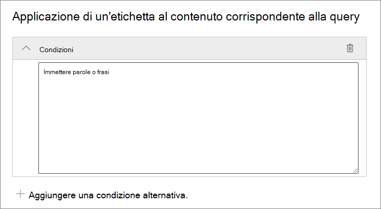
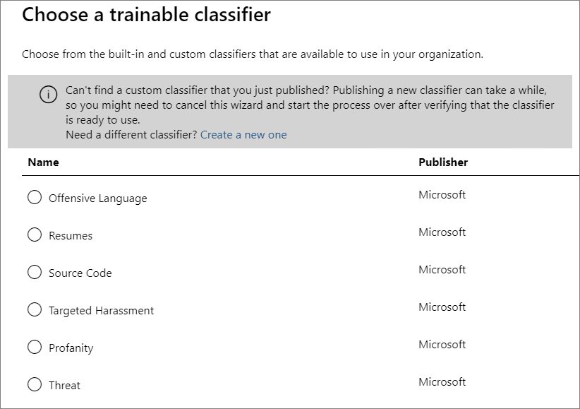
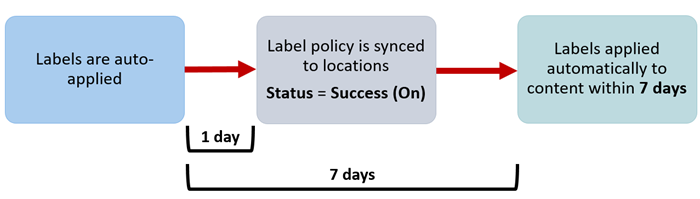

# <a name="automatically-apply-a-retention-label-to-retain-or-delete-content"></a><span data-ttu-id="17367-103">Applicare automaticamente un'etichetta di conservazione per conservare o eliminare il contenuto</span><span class="sxs-lookup"><span data-stu-id="17367-103">Automatically apply a retention label to retain or delete content</span></span>

><span data-ttu-id="17367-104">*[Indicazioni per l'assegnazione di licenze di Microsoft 365 per sicurezza e conformità](https://aka.ms/ComplianceSD).*</span><span class="sxs-lookup"><span data-stu-id="17367-104">*[Microsoft 365 licensing guidance for security & compliance](https://aka.ms/ComplianceSD).*</span></span>

> [!NOTE]
> <span data-ttu-id="17367-105">Questo scenario non è supportato per i [record normativi](records-management.md#records).</span><span class="sxs-lookup"><span data-stu-id="17367-105">This scenario is not supported for [regulatory records](records-management.md#records).</span></span>

<span data-ttu-id="17367-106">Una delle funzionalità più efficaci delle [etichette di conservazione](retention.md) è la possibilità di applicarle automaticamente al contenuto che soddisfa condizioni specificate.</span><span class="sxs-lookup"><span data-stu-id="17367-106">One of the most powerful features of [retention labels](retention.md) is the ability to apply them automatically to content that matches specified conditions.</span></span> <span data-ttu-id="17367-107">In questo caso, gli utenti dell'organizzazione non dovranno applicare le etichette di conservazione.</span><span class="sxs-lookup"><span data-stu-id="17367-107">In this case, people in your organization don't need to apply the retention labels.</span></span> <span data-ttu-id="17367-108">Microsoft 365 lo farà automaticamente.</span><span class="sxs-lookup"><span data-stu-id="17367-108">Microsoft 365 does the work for them.</span></span>
  
<span data-ttu-id="17367-109">Le etichette di conservazione applicate automaticamente sono potenti perché:</span><span class="sxs-lookup"><span data-stu-id="17367-109">Auto-applying retention labels are powerful because:</span></span>
  
- <span data-ttu-id="17367-110">Non è necessario formare gli utenti su tutte le classificazioni.</span><span class="sxs-lookup"><span data-stu-id="17367-110">You don't need to train your users on all of your classifications.</span></span>
    
- <span data-ttu-id="17367-111">Non è necessario affidarsi solo agli utenti per la classificazione corretta di tutto il contenuto.</span><span class="sxs-lookup"><span data-stu-id="17367-111">You don't need to rely on users to classify all content correctly.</span></span>
    
- <span data-ttu-id="17367-112">Gli utenti non hanno più bisogno di conoscere i criteri di governance dai dati e possono concentrarsi sul loro lavoro.</span><span class="sxs-lookup"><span data-stu-id="17367-112">Users no longer need to know about data governance policies - they can focus on their work.</span></span>
    
<span data-ttu-id="17367-113">È possibile applicare automaticamente etichette di conservazione al contenuto quando questo include informazioni sensibili, parole chiave, proprietà disponibili per la ricerca o una corrispondenza per [classificatori sottoponibili a training](classifier-get-started-with.md).</span><span class="sxs-lookup"><span data-stu-id="17367-113">You can apply retention labels to content automatically when that content contains sensitive information, keywords or searchable properties, or a match for [trainable classifiers](classifier-get-started-with.md).</span></span>

> [!TIP]
> <span data-ttu-id="17367-114">Ora, in anteprima, usare le proprietà ricercabili per identificare le [Registrazioni delle riunioni di Teams](#microsoft-teams-meeting-recordings).</span><span class="sxs-lookup"><span data-stu-id="17367-114">Now in preview, use searchable properties to identify [Teams meeting recordings](#microsoft-teams-meeting-recordings).</span></span>

<span data-ttu-id="17367-115">I processi per l'applicazione automatica di un'etichetta di conservazione si basano sulle condizioni seguenti:</span><span class="sxs-lookup"><span data-stu-id="17367-115">The processes to automatically apply a retention label based on these conditions:</span></span>



<span data-ttu-id="17367-117">Usare le istruzioni seguenti per i due passaggi per l'amministratore.</span><span class="sxs-lookup"><span data-stu-id="17367-117">Use the following instructions for the two admin steps.</span></span>

> [!NOTE]
> <span data-ttu-id="17367-118">I criteri di applicazione automatica usano l'etichettatura sul lato servizio con condizioni per applicare automaticamente etichette di conservazione.</span><span class="sxs-lookup"><span data-stu-id="17367-118">Auto-policies use service-side labeling with conditions to automatically apply retention labels.</span></span> <span data-ttu-id="17367-119">È anche possibile applicare automaticamente un'etichetta di conservazione con un criterio di etichetta eseguendo le operazioni seguenti:</span><span class="sxs-lookup"><span data-stu-id="17367-119">You can also automatically apply a retention label with a label policy when you do the following:</span></span> 
>
> - <span data-ttu-id="17367-120">Applicare un'etichetta di conservazione predefinita a un set di documenti, una cartella o una raccolta di SharePoint in modo che il contenuto non etichettato presente nel contenitore venga etichettato automaticamente</span><span class="sxs-lookup"><span data-stu-id="17367-120">Apply a default retention label to a SharePoint library, folder, or document set so that unlabeled content in that container is automatically labeled</span></span>
>- <span data-ttu-id="17367-121">Applicazione automatica di un'etichetta di conservazione alla posta elettronica mediante regole</span><span class="sxs-lookup"><span data-stu-id="17367-121">Automatically applying a retention label to email by using rules</span></span>
>
> <span data-ttu-id="17367-122">Per questi scenari, vedere [Creare e applicare etichette di conservazione nelle app](create-apply-retention-labels.md).</span><span class="sxs-lookup"><span data-stu-id="17367-122">For these scenarios, see [Create and apply retention labels in apps](create-apply-retention-labels.md).</span></span>

## <a name="before-you-begin"></a><span data-ttu-id="17367-123">Prima di iniziare</span><span class="sxs-lookup"><span data-stu-id="17367-123">Before you begin</span></span>

<span data-ttu-id="17367-124">L'amministratore globale dell'organizzazione dispone delle autorizzazioni complete per creare e modificare le etichette conservazione e i relativi criteri.</span><span class="sxs-lookup"><span data-stu-id="17367-124">The global admin for your organization has full permissions to create and edit retention labels and their policies.</span></span> <span data-ttu-id="17367-125">Se non si esegue l'accesso come amministratore globale, vedere le [autorizzazioni necessarie per creare e gestire criteri di conservazione ed etichette di conservazione](get-started-with-retention.md#permissions-required-to-create-and-manage-retention-policies-and-retention-labels).</span><span class="sxs-lookup"><span data-stu-id="17367-125">If you aren't signing in as a global admin, see [Permissions required to create and manage retention policies and retention labels](get-started-with-retention.md#permissions-required-to-create-and-manage-retention-policies-and-retention-labels).</span></span>

## <a name="how-to-auto-apply-a-retention-label"></a><span data-ttu-id="17367-126">Come applicare automaticamente un'etichetta di conservazione</span><span class="sxs-lookup"><span data-stu-id="17367-126">How to auto-apply a retention label</span></span>

<span data-ttu-id="17367-127">Creare prima di tutto l'etichetta di conservazione.</span><span class="sxs-lookup"><span data-stu-id="17367-127">First, create your retention label.</span></span> <span data-ttu-id="17367-128">Quindi, creare un criterio automatico per applicare l'etichetta.</span><span class="sxs-lookup"><span data-stu-id="17367-128">Then create an auto-policy to apply that label.</span></span> <span data-ttu-id="17367-129">Se è già stata creata l'etichetta di conservazione, passare a [Creare un criterio di applicazione automatica](#step-2-create-an-auto-apply-policy).</span><span class="sxs-lookup"><span data-stu-id="17367-129">If you have already created your retention label, skip to [creating an auto-policy](#step-2-create-an-auto-apply-policy).</span></span>

<span data-ttu-id="17367-130">Le istruzioni di spostamento variano a seconda che si usi o meno la [gestione dei record](records-management.md).</span><span class="sxs-lookup"><span data-stu-id="17367-130">Navigation instructions depend on whether you're using [records management](records-management.md) or not.</span></span> <span data-ttu-id="17367-131">Sono disponibili istruzioni per entrambi gli scenari.</span><span class="sxs-lookup"><span data-stu-id="17367-131">Instructions are provided for both scenarios.</span></span>

### <a name="step-1-create-a-retention-label"></a><span data-ttu-id="17367-132">Passaggio 1: Creare un'etichetta di conservazione</span><span class="sxs-lookup"><span data-stu-id="17367-132">Step 1: Create a retention label</span></span>

1. <span data-ttu-id="17367-133">Nel [Centro conformità Microsoft 365](https://compliance.microsoft.com/) passare a una delle posizioni seguenti:</span><span class="sxs-lookup"><span data-stu-id="17367-133">In the [Microsoft 365 compliance center](https://compliance.microsoft.com/), navigate to one of the following locations:</span></span>
    
    - <span data-ttu-id="17367-134">Se si usa la gestione dei record:</span><span class="sxs-lookup"><span data-stu-id="17367-134">If you are using records management:</span></span>
        - <span data-ttu-id="17367-135">**Soluzioni** > **Records management** > scheda **Piano di archiviazione** > **+ Crea un'etichetta** > **Etichetta di conservazione**</span><span class="sxs-lookup"><span data-stu-id="17367-135">**Solutions** > **Records management** > **File plan** tab > **+ Create a label** > **Retention label**</span></span>
        
    - <span data-ttu-id="17367-136">Se non si usa la gestione dei record:</span><span class="sxs-lookup"><span data-stu-id="17367-136">If you are not using records management:</span></span>
       - <span data-ttu-id="17367-137">**Soluzioni** > **Governance delle informazioni** > scheda **Etichette** > + **Crea un'etichetta**</span><span class="sxs-lookup"><span data-stu-id="17367-137">**Solutions** > **Information governance** > **Labels** tab > + **Create a label**</span></span>
    
    <span data-ttu-id="17367-138">L'opzione non è immediatamente visibile?</span><span class="sxs-lookup"><span data-stu-id="17367-138">Don't immediately see your option?</span></span> <span data-ttu-id="17367-139">Selezionare per prima cosa **Mostra tutto**.</span><span class="sxs-lookup"><span data-stu-id="17367-139">First select **Show all**.</span></span> 

2. <span data-ttu-id="17367-140">Seguire le istruzioni della procedura guidata.</span><span class="sxs-lookup"><span data-stu-id="17367-140">Follow the prompts in the wizard.</span></span> <span data-ttu-id="17367-141">Se si usa la gestione dei record:</span><span class="sxs-lookup"><span data-stu-id="17367-141">If you are using records management:</span></span>
    
    - <span data-ttu-id="17367-142">Per informazioni sui descrittori del piano di archiviazione, vedere [Usare il piano di archiviazione per gestire le etichette di conservazione](file-plan-manager.md).</span><span class="sxs-lookup"><span data-stu-id="17367-142">For information about the file plan descriptors, see [Use file plan to manage retention labels](file-plan-manager.md)</span></span>
    
    - <span data-ttu-id="17367-143">Per usare le etichette di conservazione per dichiarare i record, selezionare **Contrassegna elementi come record** o **Contrassegna elementi come record normativi**.</span><span class="sxs-lookup"><span data-stu-id="17367-143">To use the retention label to declare records, select **Mark items as records**, or **Mark items as regulatory records**.</span></span> <span data-ttu-id="17367-144">Per altre informazioni, vedere [Configurare le etichette di conservazione per dichiarare i record](declare-records.md#configuring-retention-labels-to-declare-records).</span><span class="sxs-lookup"><span data-stu-id="17367-144">For more information, see [Configuring retention labels to declare records](declare-records.md#configuring-retention-labels-to-declare-records).</span></span>

3. <span data-ttu-id="17367-145">Una volta creata l'etichetta e dopo la comparsa dell'opzione per pubblicarla, applicare automaticamente l'etichetta o semplicemente salvarla: selezionare **Applica automaticamente questa etichetta a un tipo specifico di contenuto**, quindi selezionare **Fatto** per avviare la procedura guidata di creazione automatica delle etichette e procedere direttamente al passaggio 2 della procedura seguente.</span><span class="sxs-lookup"><span data-stu-id="17367-145">After you have created the label and you see the options to publish the label, auto-apply the label, or just save the label: Select **Auto-apply this label to a specific type of content**, and then select **Done** to start the Create auto-labeling wizard that takes you directly to step 2 in the following procedure.</span></span>

<span data-ttu-id="17367-146">Per modificare un'etichetta esistente, selezionarla e quindi selezionare l'opzione **Modifica etichetta** per avviare la procedura guidata di modifica che consente di modificare le descrizioni dell'etichetta e qualsiasi [impostazione idonea](#updating-retention-labels-and-their-policies) del passaggio 2.</span><span class="sxs-lookup"><span data-stu-id="17367-146">To edit an existing label, select it, and then select the **Edit label** option to start the Edit retention wizard that lets you change the label descriptions and any [eligible settings](#updating-retention-labels-and-their-policies) from step 2.</span></span>


### <a name="step-2-create-an-auto-apply-policy"></a><span data-ttu-id="17367-147">Passaggio 2: Creare un criterio di applicazione automatica</span><span class="sxs-lookup"><span data-stu-id="17367-147">Step 2: Create an auto-apply policy</span></span>

<span data-ttu-id="17367-148">Quando si crea un criterio di applicazione automatica, si seleziona un'etichetta di conservazione da applicare automaticamente al contenuto in base alle condizioni specificate.</span><span class="sxs-lookup"><span data-stu-id="17367-148">When you create an auto-apply policy, you select a retention label to automatically apply to content, based on the conditions that you specify.</span></span>

1. <span data-ttu-id="17367-149">Nel [Centro conformità Microsoft 365](https://compliance.microsoft.com/) passare a una delle posizioni seguenti:</span><span class="sxs-lookup"><span data-stu-id="17367-149">In the [Microsoft 365 compliance center](https://compliance.microsoft.com/), navigate to one of the following locations:</span></span>
    
    - <span data-ttu-id="17367-150">Se si usa la gestione dei record: **Governance delle informazioni**:</span><span class="sxs-lookup"><span data-stu-id="17367-150">If you are using records management: **Information governance**:</span></span>
        - <span data-ttu-id="17367-151">**Soluzioni** > **Gestione dei record** > scheda **Criteri delle etichette** > **Applica automaticamente etichetta**</span><span class="sxs-lookup"><span data-stu-id="17367-151">**Solutions** > **Records management** > **Label policies** tab > **Auto-apply a label**</span></span>
    
    - <span data-ttu-id="17367-152">Se non si usa la gestione dei record:</span><span class="sxs-lookup"><span data-stu-id="17367-152">If you are not using records management:</span></span>
        - <span data-ttu-id="17367-153">**Soluzioni** > **Governance delle informazioni** > scheda **Criteri delle etichette** > **Applica automaticamente etichetta**</span><span class="sxs-lookup"><span data-stu-id="17367-153">**Solutions** > **Information governance** > **Label policies** tab > **Auto-apply a label**</span></span>
    
    <span data-ttu-id="17367-154">L'opzione non è immediatamente visibile?</span><span class="sxs-lookup"><span data-stu-id="17367-154">Don't immediately see your option?</span></span> <span data-ttu-id="17367-155">Selezionare per prima cosa **Mostra tutto**.</span><span class="sxs-lookup"><span data-stu-id="17367-155">First select **Show all**.</span></span> 

2. <span data-ttu-id="17367-156">Seguire le istruzioni della procedura guidata per la creazione automatica di etichette.</span><span class="sxs-lookup"><span data-stu-id="17367-156">Follow the prompts in the Create auto-labeling wizard.</span></span>
    
    <span data-ttu-id="17367-157">Per informazioni su come configurare le condizioni per l'applicazione automatica dell'etichetta di conservazione, vedere la sezione [Configurare le condizioni per l'applicazione automatica delle etichette di conservazione](#configuring-conditions-for-auto-apply-retention-labels) in questa pagina.</span><span class="sxs-lookup"><span data-stu-id="17367-157">For information about configuring the conditions that automatically apply the retention label, see the [Configuring conditions for auto-apply retention labels](#configuring-conditions-for-auto-apply-retention-labels) section on this page.</span></span>
    
    <span data-ttu-id="17367-158">Per informazioni sulle posizioni supportate dalle etichette di conservazione, vedere la sezione [Etichette di conservazione e posizioni](retention.md#retention-label-policies-and-locations).</span><span class="sxs-lookup"><span data-stu-id="17367-158">For information about the locations supported by retention labels, see the [Retention labels and locations](retention.md#retention-label-policies-and-locations) section.</span></span>

<span data-ttu-id="17367-159">Per modificare un criterio di applicazione automatica esistente, selezionarlo per avviare la procedura guidata di modifica del criteri di conservazione, che consente di modificare l'etichetta selezionata e qualsiasi [impostazione idonea](#updating-retention-labels-and-their-policies) del passaggio 2.</span><span class="sxs-lookup"><span data-stu-id="17367-159">To edit an existing auto-apply policy, select it to start the Edit retention policy wizard that lets you change the selected retention label and any [eligible settings](#updating-retention-labels-and-their-policies) from step 2.</span></span>


### <a name="configuring-conditions-for-auto-apply-retention-labels"></a><span data-ttu-id="17367-160">Configurare le condizioni per l'applicazione automatica delle etichette di conservazione</span><span class="sxs-lookup"><span data-stu-id="17367-160">Configuring conditions for auto-apply retention labels</span></span>

<span data-ttu-id="17367-161">È possibile applicare automaticamente etichette di conservazione al contenuto quando questo contiene:</span><span class="sxs-lookup"><span data-stu-id="17367-161">You can apply retention labels to content automatically when that content contains:</span></span>

- [<span data-ttu-id="17367-162">Tipi specifici di informazioni riservate.</span><span class="sxs-lookup"><span data-stu-id="17367-162">Specific types of sensitive information</span></span>](#auto-apply-labels-to-content-with-specific-types-of-sensitive-information)

- [<span data-ttu-id="17367-163">Parole chiave specifiche o proprietà disponibili per la ricerca che corrispondono a una query creata.</span><span class="sxs-lookup"><span data-stu-id="17367-163">Specific keywords or searchable properties that match a query you create</span></span>](#auto-apply-labels-to-content-with-keywords-or-searchable-properties)

- [<span data-ttu-id="17367-164">Una corrispondenza per classificatori sottoponibili a training</span><span class="sxs-lookup"><span data-stu-id="17367-164">A match for trainable classifiers</span></span>](#auto-apply-labels-to-content-by-using-trainable-classifiers)

#### <a name="auto-apply-labels-to-content-with-specific-types-of-sensitive-information"></a><span data-ttu-id="17367-165">Applicare automaticamente etichette al contenuto con tipi specifici di informazioni sensibili</span><span class="sxs-lookup"><span data-stu-id="17367-165">Auto-apply labels to content with specific types of sensitive information</span></span>

<span data-ttu-id="17367-166">Quando si creano criteri di conservazione ad applicazione automatica per le informazioni riservate, viene visualizzato lo stesso elenco di modelli di criteri mostrato quando si creano criteri di prevenzione della perdita dei dati (DLP).</span><span class="sxs-lookup"><span data-stu-id="17367-166">When you create auto-apply retention label policies for sensitive information, you see the same list of policy templates as when you create a data loss prevention (DLP) policy.</span></span> <span data-ttu-id="17367-167">Ogni modello è preconfigurato in modo da cercare specifici tipi di informazioni riservate.</span><span class="sxs-lookup"><span data-stu-id="17367-167">Each template is preconfigured to look for specific types of sensitive information.</span></span> <span data-ttu-id="17367-168">Ad esempio, il modello mostrato qui cerca i numeri ITIN, SSN e di passaporto nella categoria **Privacy**, e nel **Modello dati personali (PII) Stati Uniti**:</span><span class="sxs-lookup"><span data-stu-id="17367-168">For example, the template shown here looks for U.S. ITIN, SSN, and passport numbers from the **Privacy** category, and **U.S Personally Identifiable Information (PII) Data template**:</span></span>



<span data-ttu-id="17367-170">Per altre informazioni sui tipi di informazioni sensibili, vedere [Definizioni delle entità tipo di informazione sensibile](sensitive-information-type-entity-definitions.md).</span><span class="sxs-lookup"><span data-stu-id="17367-170">To learn more about the sensitivity information types, see [Sensitive information type entity definitions](sensitive-information-type-entity-definitions.md).</span></span>

<span data-ttu-id="17367-171">Dopo aver selezionato un modello di criteri, è possibile aggiungere o rimuovere qualunque tipo di informazione riservata e modificare il numero di istanze e l'accuratezza della corrispondenza.</span><span class="sxs-lookup"><span data-stu-id="17367-171">After you select a policy template, you can add or remove any types of sensitive information, and you can change the instance count and match accuracy.</span></span> <span data-ttu-id="17367-172">Nella schermata di esempio seguente, un'etichetta di conservazione sarà applicata automaticamente solo quando:</span><span class="sxs-lookup"><span data-stu-id="17367-172">In the example screenshot shown next, a retention label will be auto-applied only when:</span></span>
  
- <span data-ttu-id="17367-173">Il tipo di informazioni sensibili rilevate ha un'accuratezza della corrispondenza (o livello di attendibilità) di almeno 75.</span><span class="sxs-lookup"><span data-stu-id="17367-173">The type of sensitive information that's detected has a match accuracy (or confidence level) of at least 75.</span></span> <span data-ttu-id="17367-174">Molti tipi di informazioni sensibili sono definiti con più criteri. I criteri con un livello di accuratezza della corrispondenza superiore richiedono l'individuazione di ulteriori elementi di prova (ad esempio parole chiave, date o indirizzi), mentre i criteri con un livello di accuratezza della corrispondenza inferiore richiedono meno elementi di prova.</span><span class="sxs-lookup"><span data-stu-id="17367-174">Many sensitive information types are defined with multiple patterns, where a pattern with a higher match accuracy requires more evidence to be found (such as keywords, dates, or addresses), while a pattern with a lower match accuracy requires less evidence.</span></span> <span data-ttu-id="17367-175">Più basso è il valore di accuratezza della corrispondenza **min**, più facile sarà che il contenuto soddisfi la condizione.</span><span class="sxs-lookup"><span data-stu-id="17367-175">The lower the **min** match accuracy, the easier it is for content to match the condition.</span></span>

- <span data-ttu-id="17367-176">Il contenuto include tra 1 e 9 istanze di qualsiasi di questi tre tipi di informazioni riservate.</span><span class="sxs-lookup"><span data-stu-id="17367-176">The content contains between 1 and 9 instances of any of these three sensitive information types.</span></span> <span data-ttu-id="17367-177">È possibile eliminare il valore **a** in modo che diventi **Qualsiasi**.</span><span class="sxs-lookup"><span data-stu-id="17367-177">You can delete the **to** value so that it changes to **Any**.</span></span>

<span data-ttu-id="17367-178">Per altre informazioni su queste opzioni, vedere le indicazioni seguenti della documentazione sulla prevenzione della perdita dei dati [Modificare le regole per rendere più facili o difficili le corrispondenze](data-loss-prevention-policies.md#tuning-rules-to-make-them-easier-or-harder-to-match).</span><span class="sxs-lookup"><span data-stu-id="17367-178">For more information about these options, see the following guidance from the DLP documentation [Tuning rules to make them easier or harder to match](data-loss-prevention-policies.md#tuning-rules-to-make-them-easier-or-harder-to-match).</span></span>
    


<span data-ttu-id="17367-180">Per considerare quando si usano tipi di informazioni riservate per applicare automaticamente etichette di conservazione:</span><span class="sxs-lookup"><span data-stu-id="17367-180">To consider when using sensitive information types to auto-apply retention labels:</span></span>

- <span data-ttu-id="17367-181">Gli elementi nuovo e modificato possono essere etichettati automaticamente.</span><span class="sxs-lookup"><span data-stu-id="17367-181">New and modified items can be auto-labeled.</span></span>

#### <a name="auto-apply-labels-to-content-with-keywords-or-searchable-properties"></a><span data-ttu-id="17367-182">Applicare automaticamente etichette al contenuto con parole chiave o con proprietà disponibili per le ricerche</span><span class="sxs-lookup"><span data-stu-id="17367-182">Auto-apply labels to content with keywords or searchable properties</span></span>

<span data-ttu-id="17367-p114">È possibile applicare automaticamente etichette al contenuto usando una query che include parole, frasi, valori o proprietà disponibili per le ricerche specifiche. È possibile perfezionare la query usando operatori di ricerca come AND, OR e NOT.</span><span class="sxs-lookup"><span data-stu-id="17367-p114">You can auto-apply labels to content by using a query that contains specific words, phrases, or values of searchable properties. You can refine your query by using search operators such as AND, OR, and NOT.</span></span>



<span data-ttu-id="17367-186">Per altre informazioni sulla sintassi della query che usa Keyword Query Language (KQL), vedere [Riferimenti alla sintassi KQL (Keyword Query Language)](https://docs.microsoft.com/sharepoint/dev/general-development/keyword-query-language-kql-syntax-reference).</span><span class="sxs-lookup"><span data-stu-id="17367-186">For more information about the query syntax that uses Keyword Query Language (KQL), see [Keyword Query Language (KQL) syntax reference](https://docs.microsoft.com/sharepoint/dev/general-development/keyword-query-language-kql-syntax-reference).</span></span>

<span data-ttu-id="17367-187">I criteri di applicazione automatica basati su query usano lo stesso indice di ricerca della ricerca contenuto di eDiscovery per identificare il contenuto.</span><span class="sxs-lookup"><span data-stu-id="17367-187">Query-based auto-apply policies use the same search index as eDiscovery content search to identify content.</span></span> <span data-ttu-id="17367-188">Per altre informazioni sulle proprietà ricercabili utilizzabili, vedere [Query con parola chiave e condizioni di ricerca per la ricerca di contenuto](keyword-queries-and-search-conditions.md).</span><span class="sxs-lookup"><span data-stu-id="17367-188">For more information about the searchable properties that you can use, see [Keyword queries and search conditions for Content Search](keyword-queries-and-search-conditions.md).</span></span>

<span data-ttu-id="17367-189">Alcuni aspetti da considerare quando si usano parole chiave o proprietà ricercabili per applicare automaticamente etichette di conservazione:</span><span class="sxs-lookup"><span data-stu-id="17367-189">Some things to consider when using keywords or searchable properties to auto-apply retention labels:</span></span>

- <span data-ttu-id="17367-190">Gli elementi nuovo, modificato ed esistente verranno etichettati automaticamente per SharePoint, OneDrive ed Exchange.</span><span class="sxs-lookup"><span data-stu-id="17367-190">New, modified, and existing items will be auto-labeled for SharePoint, OneDrive, and Exchange.</span></span>

- <span data-ttu-id="17367-191">Per SharePoint, le proprietà sottoposte a ricerca per indicizzazione e le proprietà personalizzate non sono supportate per queste query KQL ed è necessario usare solo le proprietà gestite predefinite.</span><span class="sxs-lookup"><span data-stu-id="17367-191">For SharePoint, crawled properties and custom properties aren't supported for these KQL queries and you must use only predefined managed properties.</span></span> <span data-ttu-id="17367-192">È tuttavia possibile usare i mapping a livello di tenant con le proprietà gestite predefinite abilitate come criteri di affinamento ricerca per impostazione predefinita (RefinableDate00-19, RefinableString00-99, RefinableInt00-49, RefinableDecimals00-09 e RefinableDouble00-09).</span><span class="sxs-lookup"><span data-stu-id="17367-192">However, you can use mappings at the tenant level with the predefined managed properties that are enabled as refiners by default (RefinableDate00-19, RefinableString00-99, RefinableInt00-49, RefinableDecimals00-09, and RefinableDouble00-09).</span></span> <span data-ttu-id="17367-193">Per altre informazioni, vedere [Panoramica delle proprietà gestite e sottoposte a ricerca per indicizzazione in SharePoint Server](https://docs.microsoft.com/SharePoint/technical-reference/crawled-and-managed-properties-overview)e per le istruzioni, vedere [Creare una nuova proprietà gestita](https://docs.microsoft.com/sharepoint/manage-search-schema#create-a-new-managed-property).</span><span class="sxs-lookup"><span data-stu-id="17367-193">For more information, see [Overview of crawled and managed properties in SharePoint Server](https://docs.microsoft.com/SharePoint/technical-reference/crawled-and-managed-properties-overview), and for instructions, see [Create a new managed property](https://docs.microsoft.com/sharepoint/manage-search-schema#create-a-new-managed-property).</span></span>

- <span data-ttu-id="17367-194">Se si esegue il mapping di una proprietà personalizzata a una delle proprietà di affinamento, attendere 24 ore prima di usarla nella query KQL per un'etichetta di conservazione.</span><span class="sxs-lookup"><span data-stu-id="17367-194">If you map a custom property to one of the refiner properties, wait 24 hours before you use it in your KQL query for a retention label.</span></span>

- <span data-ttu-id="17367-195">Anche se le proprietà gestite di SharePoint possono essere rinominate con gli alias, non usare queste per le query di KQL nelle etichette.</span><span class="sxs-lookup"><span data-stu-id="17367-195">Although SharePoint managed properties can be renamed by using aliases, don't use these for KQL queries in your labels.</span></span> <span data-ttu-id="17367-196">Specificare sempre il nome effettivo della proprietà gestita, ad esempio RefinableString01.</span><span class="sxs-lookup"><span data-stu-id="17367-196">Always specify the actual name of the managed property, for example, "RefinableString01".</span></span>

- <span data-ttu-id="17367-197">Per cercare valori contenenti spazi o caratteri speciali, usare le virgolette doppie (`" "`) per includere la frase, come riportato nell'esempio seguente: `subject:"Financial Statements"`.</span><span class="sxs-lookup"><span data-stu-id="17367-197">To search for values that contain spaces or special characters, use double quotation marks (`" "`) to contain the phrase; for example, `subject:"Financial Statements"`.</span></span>

- <span data-ttu-id="17367-198">Usare la proprietà *DocumentLink* anziché *Percorso* per trovare una corrispondenza con un elemento in base all'URL.</span><span class="sxs-lookup"><span data-stu-id="17367-198">Use the *DocumentLink* property instead of *Path* to match an item based on its URL.</span></span> 

- <span data-ttu-id="17367-199">Le ricerche con caratteri jolly come suffisso ( come `*cat`) o le ricerche con carattere jolly come sottostringa (come `*cat*`) non sono supportate.</span><span class="sxs-lookup"><span data-stu-id="17367-199">Suffix wildcard searches ( such as `*cat`) or substring wildcard searches (such as `*cat*`) aren't supported.</span></span> <span data-ttu-id="17367-200">Tuttavia, i caratteri jolly sono supportati nelle ricerche con prefissi (come `cat*`).</span><span class="sxs-lookup"><span data-stu-id="17367-200">However, prefix wildcard searches (such as `cat*`) are supported.</span></span>

- <span data-ttu-id="17367-201">Tenere presente che gli elementi parzialmente indicizzati possono essere responsabili della mancata etichettatura di elementi previsti o dell'etichettatura di elementi che si prevede di escludere dall'etichettatura quando si usa l'operatore NOT.</span><span class="sxs-lookup"><span data-stu-id="17367-201">Be aware that partially indexed items can be responsible for not labeling items that you're expecting, or labeling items that you're expecting to be excluded from labeling when you use the NOT operator.</span></span> <span data-ttu-id="17367-202">Per altre informazioni, vedere [Elementi parzialmente indicizzati](partially-indexed-items-in-content-search.md).</span><span class="sxs-lookup"><span data-stu-id="17367-202">For more information, see [Partially indexed items in Content Search](partially-indexed-items-in-content-search.md).</span></span>


<span data-ttu-id="17367-203">Esempi di query:</span><span class="sxs-lookup"><span data-stu-id="17367-203">Examples queries:</span></span>

| <span data-ttu-id="17367-204">Carico di lavoro</span><span class="sxs-lookup"><span data-stu-id="17367-204">Workload</span></span> | <span data-ttu-id="17367-205">Esempio</span><span class="sxs-lookup"><span data-stu-id="17367-205">Example</span></span> |
|:-----|:-----|
|<span data-ttu-id="17367-206">Exchange</span><span class="sxs-lookup"><span data-stu-id="17367-206">Exchange</span></span>   | `subject:"Financial Statements"` |
|<span data-ttu-id="17367-207">Exchange</span><span class="sxs-lookup"><span data-stu-id="17367-207">Exchange</span></span>   | `recipients:garthf@contoso.com` |
|<span data-ttu-id="17367-208">SharePoint</span><span class="sxs-lookup"><span data-stu-id="17367-208">SharePoint</span></span> | `contenttype:document` |
|<span data-ttu-id="17367-209">SharePoint</span><span class="sxs-lookup"><span data-stu-id="17367-209">SharePoint</span></span> | `site:https://contoso.sharepoint.com/sites/teams/procurement AND contenttype:document`|
|<span data-ttu-id="17367-210">Exchange o SharePoint</span><span class="sxs-lookup"><span data-stu-id="17367-210">Exchange or SharePoint</span></span> | `"customer information" OR "private"`|

<span data-ttu-id="17367-211">Esempi più complessi problemi:</span><span class="sxs-lookup"><span data-stu-id="17367-211">More complex examples:</span></span>

<span data-ttu-id="17367-212">La query seguente per SharePoint identifica i documenti di Word o i fogli di calcolo di Excel quando tali file contengono le parole chiave **password**, **password** o **PW**:</span><span class="sxs-lookup"><span data-stu-id="17367-212">The following query for SharePoint identifies Word documents or Excel spreadsheets when those files contain the keywords **password**, **passwords**, or **pw**:</span></span>

```
(password OR passwords OR pw) AND (filetype:doc* OR filetype:xls*)
```

<span data-ttu-id="17367-213">La query seguente per Exchange identifica qualsiasi documento di Word o PDF che contiene la parola **nda** o la frase **Accordo di riservatezza** quando tali documenti sono allegati a un messaggio di posta elettronica:</span><span class="sxs-lookup"><span data-stu-id="17367-213">The following query for Exchange identifies any Word document or PDF that contains the word **nda** or the phrase **non disclosure agreement** when those documents are attached to an email:</span></span>

```
(nda OR "non disclosure agreement") AND (attachmentnames:.doc* OR attachmentnames:.pdf)
```

<span data-ttu-id="17367-214">La query seguente per SharePoint identifica i documenti che contengono un numero di carta di credito:</span><span class="sxs-lookup"><span data-stu-id="17367-214">The following query for SharePoint identifies documents that contain a credit card number:</span></span> 

```
sensitivetype:"credit card number"
```

<span data-ttu-id="17367-215">La query seguente contiene alcune parole chiave tipiche che consentono di identificare documenti o messaggi di posta elettronica contenenti contenuto legale:</span><span class="sxs-lookup"><span data-stu-id="17367-215">The following query contains some typical keywords to help identify documents or emails that contain legal content:</span></span>

```
ACP OR (Attorney Client Privilege*) OR (AC Privilege)
```

<span data-ttu-id="17367-216">La query seguente contiene parole chiave tipiche che consentono di identificare documenti o messaggi di posta elettronica per risorse umane:</span><span class="sxs-lookup"><span data-stu-id="17367-216">The following query contains typical keywords to help identify documents or emails for human resources:</span></span> 

```
(resume AND staff AND employee AND salary AND recruitment AND candidate)
```

<span data-ttu-id="17367-217">Si noti che in questo esempio finale viene usata la procedura consigliata che include sempre operatori tra parole chiave.</span><span class="sxs-lookup"><span data-stu-id="17367-217">Note that this final example uses the best practice of always including  operators between keywords.</span></span> <span data-ttu-id="17367-218">Uno spazio tra parole chiave (o due espressioni proprietà:valore) corrisponde all'uso di AND.</span><span class="sxs-lookup"><span data-stu-id="17367-218">A space between keywords (or two property:value expressions) is the same as using AND.</span></span> <span data-ttu-id="17367-219">Aggiungendo sempre operatori, risulta più facile notare che la query di esempio consente di identificare solo il contenuto che include tutte le parole chiave, anziché il contenuto che contiene una qualsiasi delle parole chiave.</span><span class="sxs-lookup"><span data-stu-id="17367-219">By always adding operators, it's easier to see that this example query will identify only content that contains all these keywords, instead of content that contains any of the keywords.</span></span> <span data-ttu-id="17367-220">Se si intende identificare il contenuto che contiene una qualsiasi delle parole chiave, specificare O al posto di E.</span><span class="sxs-lookup"><span data-stu-id="17367-220">If your intention is to identify content that contains any of the keywords, specify OR instead of AND.</span></span> <span data-ttu-id="17367-221">Come mostrato in questo esempio, quando si specificano sempre gli operatori, risulta più facile interpretare correttamente la query.</span><span class="sxs-lookup"><span data-stu-id="17367-221">As this example shows, when you always specify the operators, it's easier to correctly interpret the query.</span></span> 

##### <a name="microsoft-teams-meeting-recordings"></a><span data-ttu-id="17367-222">Registrazioni delle riunioni di Teams</span><span class="sxs-lookup"><span data-stu-id="17367-222">Microsoft Teams meeting recordings</span></span>

> [!NOTE]
> <span data-ttu-id="17367-223">La funzionalità che consente di mantenere o eliminare le registrazioni delle riunioni di Teams è in anteprima, e non sarà disponibile prima che le registrazioni siano salvate in OneDrive o SharePoint.</span><span class="sxs-lookup"><span data-stu-id="17367-223">The ability to retain and delete Teams meeting recordings is in preview and won't work before recordings are saved to OneDrive or SharePoint.</span></span> <span data-ttu-id="17367-224">Per altre informazioni, vedere [Usare OneDrive for Business e SharePoint o Stream per registrare le riunioni](https://docs.microsoft.com/MicrosoftTeams/tmr-meeting-recording-change).</span><span class="sxs-lookup"><span data-stu-id="17367-224">For more information, see [Use OneDrive for Business and SharePoint Online or Stream for meeting recordings](https://docs.microsoft.com/MicrosoftTeams/tmr-meeting-recording-change).</span></span>

<span data-ttu-id="17367-225">Per identificare le registrazioni delle riunioni di Microsoft Teams salvate negli account OneDrive degli utenti o in SharePoint, specificare quanto segue nell'**Editor di query con parole chiave**:</span><span class="sxs-lookup"><span data-stu-id="17367-225">To identify Microsoft Teams meeting recordings that are stored in users' OneDrive accounts or in SharePoint, specify the following for the **Keyword query editor**:</span></span>

``` 
ProgID:Media AND ProgID:Meeting
```

<span data-ttu-id="17367-226">Nella maggior parte dei casi, le registrazioni delle riunioni vengono salvate in OneDrive.</span><span class="sxs-lookup"><span data-stu-id="17367-226">Most of the time, meeting recordings are saved to OneDrive.</span></span> <span data-ttu-id="17367-227">Tuttavia, le riunioni di canale vengono salvate in SharePoint.</span><span class="sxs-lookup"><span data-stu-id="17367-227">But for channel meetings, they are saved in SharePoint.</span></span>


#### <a name="auto-apply-labels-to-content-by-using-trainable-classifiers"></a><span data-ttu-id="17367-228">Etichette applicate automaticamente al contenuto con classificatori sottoponibili a training</span><span class="sxs-lookup"><span data-stu-id="17367-228">Auto-apply labels to content by using trainable classifiers</span></span>

<span data-ttu-id="17367-229">Se si sceglie l'opzione del classificatore sottoponibile a training, è possibile selezionare un classificatore predefinito oppure personalizzato.</span><span class="sxs-lookup"><span data-stu-id="17367-229">When you choose the option for a trainable classifier, you can select one of the built-in classifiers, or a custom classifier.</span></span> <span data-ttu-id="17367-230">I classificatori predefiniti includono i **curriculum**, il **codice sorgente**, le **molestie mirate**, i **contenuti volgari** e le **minacce**:</span><span class="sxs-lookup"><span data-stu-id="17367-230">The built-in classifiers include **Resumes**, **SourceCode**, **Targeted Harassment**, **Profanity**, and **Threat**:</span></span>



> [!CAUTION]
> <span data-ttu-id="17367-232">Il classificatore predefinito **Linguaggio offensivo** è stato deprecato perché generava un numero elevato di falsi positivi.</span><span class="sxs-lookup"><span data-stu-id="17367-232">We are deprecating the **Offensive Language** built-in classifier because it has been producing a high number of false positives.</span></span> <span data-ttu-id="17367-233">Non usare questo classificatore predefinito e, se è in uso, è consigliabile spostare i processi aziendali da esso.</span><span class="sxs-lookup"><span data-stu-id="17367-233">Don't use this built-in classifier and if you are currently using it, you should move your business processes off it.</span></span> <span data-ttu-id="17367-234">Usare invece i classificatori predefiniti per **molestie**, **volgarità** e **minacce**.</span><span class="sxs-lookup"><span data-stu-id="17367-234">We recommend using the **Targeted Harassment**, **Profanity**, and **Threat** built-in classifiers instead.</span></span>

<span data-ttu-id="17367-235">Per applicare automaticamente un'etichetta utilizzando questa opzione, i siti e le cassette postali di SharePoint devono avere almeno 10 MB di dati.</span><span class="sxs-lookup"><span data-stu-id="17367-235">To automatically apply a label by using this option, SharePoint sites and mailboxes must have at least 10 MB of data.</span></span>

<span data-ttu-id="17367-236">Per altre informazioni sui classificatori sottoponibili a training, vedere [Informazioni sui classificatori sottoponibili a training (anteprima)](classifier-learn-about.md).</span><span class="sxs-lookup"><span data-stu-id="17367-236">For more information about trainable classifiers, see [Learn about trainable classifiers (preview)](classifier-learn-about.md).</span></span>

> [!TIP]
> <span data-ttu-id="17367-237">Se si usano classificatori sottoponibili a training per Exchange, vedere il recente articolo [Come ripetere il training in Esplora contenuto (anteprima)](classifier-how-to-retrain-content-explorer.md).</span><span class="sxs-lookup"><span data-stu-id="17367-237">If you use trainable classifiers for Exchange, see the recently released [How to retrain a classifier in content explorer (preview)](classifier-how-to-retrain-content-explorer.md).</span></span>

<span data-ttu-id="17367-238">Per considerare quando si usano tipi di classificatori sottoposti a training per applicare automaticamente etichette di conservazione:</span><span class="sxs-lookup"><span data-stu-id="17367-238">To consider when using trainable classifiers to auto-apply retention labels:</span></span>

- <span data-ttu-id="17367-239">Gli elementi nuovo e modificato possono essere etichettati automaticamente, insieme agli elementi esistenti degli ultimi sei mesi.</span><span class="sxs-lookup"><span data-stu-id="17367-239">New and modified items can be auto-labeled, and existing items from the last six months.</span></span>

## <a name="how-long-it-takes-for-retention-labels-to-take-effect"></a><span data-ttu-id="17367-240">Tempo necessario per l'applicazione delle etichette di conservazione</span><span class="sxs-lookup"><span data-stu-id="17367-240">How long it takes for retention labels to take effect</span></span>

<span data-ttu-id="17367-241">In caso di applicazione automatica di etichette di conservazione, possono essere necessari fino a sette giorni prima che le etichette vengano applicate a tutto il contenuto esistente che soddisfa le condizioni.</span><span class="sxs-lookup"><span data-stu-id="17367-241">When you auto-apply retention labels, it can take up to seven days for the retention labels to be applied to all existing content that matches the conditions.</span></span>
  


<span data-ttu-id="17367-243">Se le etichette previste non compaiono dopo sette giorni, verificare lo **stato** del criterio di applicazione automatica selezionandolo dalla pagina **Criteri etichetta** nel centro conformità.</span><span class="sxs-lookup"><span data-stu-id="17367-243">If the expected labels don't appear after seven days, check the **Status** of the auto-apply policy by selecting it from the **Label policies** page in the compliance center.</span></span> <span data-ttu-id="17367-244">Se viene visualizzato lo stato **Disattivato (errore)** e nei dettagli per i percorsi viene visualizzato un messaggio che richiede più tempo del previsto per la distribuzione del criterio (per SharePoint) o per provare a ridistribuire i criteri (per OneDrive), provare a eseguire il comando di PowerShell [Set-RetentionCompliancePolicy](https://docs.microsoft.com/powershell/module/exchange/set-retentioncompliancepolicy) per riprovare la distribuzione dei criteri:</span><span class="sxs-lookup"><span data-stu-id="17367-244">If you see the status of **Off (Error)** and in the details for the locations see a message that it's taking longer than expected to deploy the policy (for SharePoint) or to try redeploying the policy (for OneDrive), try running the [Set-RetentionCompliancePolicy](https://docs.microsoft.com/powershell/module/exchange/set-retentioncompliancepolicy) PowerShell command to retry the policy distribution:</span></span>

1. <span data-ttu-id="17367-245">[Connettersi a PowerShell in Centro sicurezza e conformità](https://docs.microsoft.com/powershell/exchange/connect-to-scc-powershell).</span><span class="sxs-lookup"><span data-stu-id="17367-245">[Connect to Security & Compliance Center PowerShell](https://docs.microsoft.com/powershell/exchange/connect-to-scc-powershell).</span></span>

2. <span data-ttu-id="17367-246">Eseguire il comando seguente:</span><span class="sxs-lookup"><span data-stu-id="17367-246">Run the following command:</span></span>
    
    ``` PowerShell
    Set-RetentionCompliancePolicy -Identity <policy name> -RetryDistribution
   ```

## <a name="updating-retention-labels-and-their-policies"></a><span data-ttu-id="17367-247">Aggiornare le etichette di conservazione e i criteri</span><span class="sxs-lookup"><span data-stu-id="17367-247">Updating retention labels and their policies</span></span>

<span data-ttu-id="17367-248">Quando si modifica un'etichetta di conservazione o un criterio di applicazione automatica e l'etichetta di conservazione è già applicata al contenuto, le impostazioni aggiornate verranno applicate automaticamente a tale contenuto oltre che a quello identificato per la prima volta.</span><span class="sxs-lookup"><span data-stu-id="17367-248">When you edit a retention label or auto-apply policy, and the retention label is already applied to content, your updated settings will automatically be applied to this content in addition to content that's newly identified.</span></span>

<span data-ttu-id="17367-249">Alcune impostazioni non possono essere modificate dopo aver creato e salvato l'etichetta o i criteri, tra cui:</span><span class="sxs-lookup"><span data-stu-id="17367-249">Some settings can't be changed after the label or policy is created and saved, which include:</span></span>
- <span data-ttu-id="17367-250">L’etichetta di conservazione, il nome del criterio di conservazione e le impostazioni di conservazione, ad eccezione del periodo di conservazione.</span><span class="sxs-lookup"><span data-stu-id="17367-250">The retention label and policy name, and the retention settings except the retention period.</span></span> <span data-ttu-id="17367-251">Tuttavia, non è possibile modificare il periodo di conservazione quando il periodo di conservazione è basato sulla data di etichettatura degli elementi.</span><span class="sxs-lookup"><span data-stu-id="17367-251">However, you can't change the retention period when the retention period is based on when items were labeled.</span></span>
- <span data-ttu-id="17367-252">Opzione per contrassegnare gli elementi come record.</span><span class="sxs-lookup"><span data-stu-id="17367-252">The option to mark items as a record.</span></span>

## <a name="locking-the-policy-to-prevent-changes"></a><span data-ttu-id="17367-253">Blocco dei criteri per evitare le modifiche</span><span class="sxs-lookup"><span data-stu-id="17367-253">Locking the policy to prevent changes</span></span>

<span data-ttu-id="17367-254">Se occorre fare in modo che nessuno possa disattivare o eliminarle i criteri o renderli meno restrittivi, vedere [Usare la protezione dell'archiviazione per limitare le modifiche ai criteri di conservazione e ai criteri per le etichette di conservazione](retention-preservation-lock.md).</span><span class="sxs-lookup"><span data-stu-id="17367-254">If you need to ensure that no one can turn off the policy, delete the policy, or make it less restrictive, see [Use Preservation Lock to restrict changes to retention policies and retention label policies](retention-preservation-lock.md).</span></span>

## <a name="next-steps"></a><span data-ttu-id="17367-255">Passaggi successivi</span><span class="sxs-lookup"><span data-stu-id="17367-255">Next steps</span></span>

<span data-ttu-id="17367-256">Vedere [Usare etichette di riservatezza per gestire il ciclo di vita dei documenti archiviati in SharePoint](auto-apply-retention-labels-scenario.md) per uno scenario di esempio in cui viene usato un criterio di applicazione automatica dell'etichetta di conservazione con proprietà gestite in SharePoint, e la conservazione basata su eventi per avviare il periodo di conservazione.</span><span class="sxs-lookup"><span data-stu-id="17367-256">See [Use retention labels to manage the lifecycle of documents stored in SharePoint](auto-apply-retention-labels-scenario.md) for an example scenario that uses an auto-apply retention label policy with managed properties in SharePoint, and event-based retention to start the retention period.</span></span>
