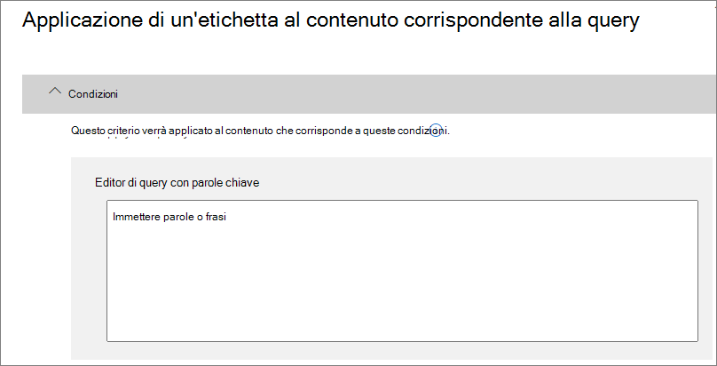

# Applicare automaticamente un'etichetta di conservazione per conservare o eliminare il contenutoAutomatically apply a retention label to retain or delete content

>*[Indicazioni per l'assegnazione di licenze di Microsoft 365 per sicurezza e conformità](https://aka.ms/ComplianceSD).**[Microsoft 365 licensing guidance for security & compliance](https://aka.ms/ComplianceSD).*

Una delle funzionalità più efficaci delle [etichette di conservazione](retention.md) è la possibilità di applicarle automaticamente al contenuto che soddisfa condizioni specificate.One of the most powerful features of [retention labels](retention.md) is the ability to apply them automatically to content that matches specified conditions. In questo caso, gli utenti dell'organizzazione non dovranno applicare le etichette di conservazione.In this case, people in your organization don't need to apply the retention labels. Microsoft 365 lo farà automaticamente.Microsoft 365 does the work for them.
  
Le etichette di conservazione applicate automaticamente sono potenti perché:Auto-applying retention labels are powerful because:
  
- Non è necessario formare gli utenti su tutte le classificazioni.You don't need to train your users on all of your classifications.
    
- Non è necessario affidarsi solo agli utenti per la classificazione corretta di tutto il contenuto.You don't need to rely on users to classify all content correctly.
    
- Gli utenti non hanno più bisogno di conoscere i criteri di governance dai dati e possono concentrarsi sul loro lavoro.Users no longer need to know about data governance policies - they can focus on their work.
    
È possibile applicare automaticamente etichette di conservazione al contenuto quando questo include informazioni sensibili, parole chiave, proprietà disponibili per la ricerca o una corrispondenza per [classificatori sottoponibili a training](classifier-getting-started-with.md).You can apply retention labels to content automatically when that content contains sensitive information, keywords or searchable properties, or a match for [trainable classifiers](classifier-getting-started-with.md).

I processi per l'applicazione automatica di un'etichetta di conservazione si basano sulle condizioni seguenti:The processes to automatically apply a retention label based on these conditions:

Usare le istruzioni seguenti per i due passaggi per l'amministratore.Use the following instructions for the two admin steps.

> [!NOTE]
> I criteri di applicazione automatica usano l'etichettatura sul lato servizio con condizioni per applicare automaticamente etichette di conservazione.Auto-policies use service-side labeling with conditions to automatically apply retention labels. È anche possibile applicare automaticamente un'etichetta di conservazione con un criterio di etichetta eseguendo le operazioni seguenti:You can also automatically apply a retention label with a label policy when you do the following: 
>
> - Applicare un'etichetta di conservazione predefinita a un set di documenti, una cartella o una raccolta di SharePoint in modo che il contenuto non etichettato presente nel contenitore venga etichettato automaticamenteApply a default retention label to a SharePoint library, folder, or document set so that unlabeled content in that container is automatically labeled
>- Applicazione automatica di un'etichetta di conservazione alla posta elettronica mediante regoleAutomatically applying a retention label to email by using rules
>
> Per questi scenari, vedere [Creare e applicare etichette di conservazione nelle app](create-apply-retention-labels.md).For these scenarios, see [Create and apply retention labels in apps](create-apply-retention-labels.md).

## Prima di iniziareBefore you begin

L'amministratore globale dell'organizzazione dispone delle autorizzazioni complete per creare e modificare le etichette conservazione e i relativi criteri.The global admin for your organization has full permissions to create and edit retention labels and their policies. Se non si esegue l'accesso come amministratore globale, vedere le [autorizzazioni necessarie per creare e gestire criteri di conservazione ed etichette di conservazione](get-started-with-retention.md#permissions-required-to-create-and-manage-retention-policies-and-retention-labels).If you aren't signing in as a global admin, see [Permissions required to create and manage retention policies and retention labels](get-started-with-retention.md#permissions-required-to-create-and-manage-retention-policies-and-retention-labels).

## Come applicare automaticamente un'etichetta di conservazioneHow to auto-apply a retention label

Creare prima di tutto l'etichetta di conservazione.First, create your retention label. Quindi, creare un criterio automatico per applicare l'etichetta.Then create an auto-policy to apply that label. Se è già stata creata l'etichetta di conservazione, passare a [Creare un criterio di applicazione automatica](#step-2-create-an-auto-apply-policy).If you have already created your retention label, skip to [creating an auto-policy](#step-2-create-an-auto-apply-policy).

Le istruzioni di spostamento variano a seconda che si usi o meno la [gestione dei record](records-management.md).Navigation instructions depend on whether you're using [records management](records-management.md) or not. Sono disponibili istruzioni per entrambi gli scenari.Instructions are provided for both scenarios.

### Passaggio 1: Creare un'etichetta di conservazioneStep 1: Create a retention label

1. Nel [Centro conformità Microsoft 365](https://compliance.microsoft.com/) passare a una delle posizioni seguenti:In the [Microsoft 365 compliance center](https://compliance.microsoft.com/), navigate to one of the following locations:
    
    - Se si usa la gestione dei record:If you are using records management:
        - **Soluzioni** > **Records management** > scheda **Piano di archiviazione** > **+ Crea un'etichetta** > **Etichetta di conservazione****Solutions** > **Records management** > **File plan** tab > **+ Create a label** > **Retention label**
        
    - Se non si usa la gestione dei record:If you are not using records management:
       - **Soluzioni** > **Governance delle informazioni** > scheda **Etichette** > + **Crea un'etichetta****Solutions** > **Information governance** > **Labels** tab > + **Create a label**
    
    L'opzione non è immediatamente visibile?Don't immediately see your option? Selezionare per prima cosa **Mostra tutto**.First select **Show all**. 

2. Seguire le istruzioni della procedura guidata.Follow the prompts in the wizard. Se si usa la gestione dei record:If you are using records management:
    
    - Per informazioni sui descrittori del piano di archiviazione, vedere [Usare il piano di archiviazione per gestire le etichette di conservazione](file-plan-manager.md).For information about the file plan descriptors, see [Use file plan to manage retention labels](file-plan-manager.md)
    
    - Per usare l'etichetta di conservazione per dichiarare il contenuto come record, attivare la casella di controllo **Usa l'etichetta per classificare il contenuto come "Record"**.To use the retention label to declare content as a record, enable the checkbox **Use label to classify content as a "Record"**.

Per modificare un'etichetta esistente, selezionarla e quindi selezionare **Modifica etichetta** per avviare la stessa procedura guidata che consente di modificare le descrizioni dell'etichetta e le [impostazioni idonee](#updating-retention-labels-and-their-policies) dal passaggio 2.To edit an existing label, select it, and then select **Edit label** to start the same wizard that lets you change the label descriptions and any [eligible settings](#updating-retention-labels-and-their-policies) from step 2. In alternativa, selezionare una delle opzioni **Modifica** disponibili per passare direttamente alla pagina pertinente per eseguire l'aggiornamento.Alternatively, select any of the available **Edit** options to go directly to the relevant page to make your update.

### Passaggio 2: Creare un criterio di applicazione automaticaStep 2: Create an auto-apply policy

Quando si crea un criterio di applicazione automatica, si seleziona un'etichetta di conservazione da applicare automaticamente al contenuto in base alle condizioni specificate.When you create an auto-apply policy, you select a retention label to automatically apply to content, based on the conditions that you specify.

1. Nel [Centro conformità Microsoft 365](https://compliance.microsoft.com/) passare a una delle posizioni seguenti:In the [Microsoft 365 compliance center](https://compliance.microsoft.com/), navigate to one of the following locations:
    
    - Se si usa la gestione dei record: **Governance delle informazioni**:If you are using records management: **Information governance**:
        - **Soluzioni** > **Gestione dei record** > scheda **Criteri delle etichette** > **Applica automaticamente le etichette****Solutions** > **Records management** > **Label policies** tab > **Auto-apply label**
    
    - Se non si usa la gestione dei record:If you are not using records management:
        - **Soluzioni** > **Governance delle informazioni** > scheda **Criteri delle etichette** > **Applica automaticamente le etichette****Solutions** > **Information governance** > **Label policies** tab > **Auto-apply label**
    
    L'opzione non è immediatamente visibile?Don't immediately see your option? Selezionare per prima cosa **Mostra tutto**.First select **Show all**. 

2. Seguire le istruzioni della procedura guidata.Follow the prompts in the wizard.
    
    Per informazioni su come configurare le condizioni per l'applicazione automatica dell'etichetta di conservazione, vedere la sezione [Configurare le condizioni per l'applicazione automatica delle etichette di conservazione](#configuring-conditions-for-auto-apply-retention-labels) in questa pagina.For information about configuring the conditions that automatically apply the retention label, see the [Configuring conditions for auto-apply retention labels](#configuring-conditions-for-auto-apply-retention-labels) section on this page.
    
    Per informazioni sulle posizioni supportate dalle etichette di conservazione, vedere la sezione [Etichette di conservazione e posizioni](retention.md#retention-label-policies-and-locations).For information about the locations supported by retention labels, see the [Retention labels and locations](retention.md#retention-label-policies-and-locations) section.

Per modificare un criterio di etichetta applicata automaticamente, selezionarlo e quindi selezionare **Modifica criteri** per avviare la stessa procedura guidata che consente di modificare la descrizione del criterio e le [impostazioni idonee](#updating-retention-labels-and-their-policies) dal passaggio 2.To edit an existing auto-apply label policy, select it, and then select **Edit policy** to start the same wizard that lets you change the policy description and any [eligible settings](#updating-retention-labels-and-their-policies) from step 2. In alternativa, selezionare una delle opzioni **Modifica** disponibili per passare direttamente alla pagina pertinente per eseguire l'aggiornamento.Alternatively, select any of the available **Edit** options to go directly to the relevant page to make your update.

### Configurare le condizioni per l'applicazione automatica delle etichette di conservazioneConfiguring conditions for auto-apply retention labels

È possibile applicare automaticamente etichette di conservazione al contenuto quando questo contiene:You can apply retention labels to content automatically when that content contains:

- [Tipi specifici di informazioni riservate.Specific types of sensitive information](#auto-apply-labels-to-content-with-specific-types-of-sensitive-information)

- [Parole chiave specifiche o proprietà disponibili per la ricerca che corrispondono a una query creata.Specific keywords or searchable properties that match a query you create](#auto-apply-labels-to-content-with-keywords-or-searchable-properties)

- [Una corrispondenza per classificatori sottoponibili a trainingA match for trainable classifiers](#auto-apply-labels-to-content-by-using-trainable-classifiers)

#### Applicare automaticamente etichette al contenuto con tipi specifici di informazioni sensibiliAuto-apply labels to content with specific types of sensitive information

Quando si creano etichette di conservazione ad applicazione automatica per le informazioni riservate, viene visualizzato lo stesso elenco di modelli di criteri mostrato quando si creano criteri di prevenzione della perdita dei dati (DLP).When you create auto-apply retention labels for sensitive information, you see the same list of policy templates as when you create a data loss prevention (DLP) policy. Ogni modello di criteri è preconfigurato in modo da cercare specifici tipi di informazioni riservate.Each policy template is preconfigured to look for specific types of sensitive information. Ad esempio, il modello illustrato di seguito cerca codici identificativi del singolo contribuente (ITIN), codici di previdenza sociale (SSN) e numeri di passaporto statunitensi.For example, the template shown here looks for U.S. ITIN, SSN, and passport numbers. Per altre informazioni sui criteri DLP, vedere [Panoramica dei criteri di prevenzione della perdita dei dati](data-loss-prevention-policies.md).To learn more about DLP, see [Overview of data loss prevention policies](data-loss-prevention-policies.md).
  

  
Dopo aver selezionato un modello di criteri, è possibile aggiungere o rimuovere qualunque tipo di informazioni riservate e modificare il numero di istanze e l'accuratezza della corrispondenza. Nell'esempio mostrato di seguito, verrà applicata automaticamente un'etichetta di conservazione solo quando:After you select a policy template, you can add or remove any types of sensitive information, and you can change the instance count and match accuracy. In the example shown here, a retention label will be auto-applied only when:
  
- Il contenuto include tra 1 e 9 istanze di qualsiasi di tipo di informazioni riservate. È possibile eliminare il valore **max** in modo che diventi **qualsiasi**.The content contains between 1 and 9 instances of any of these three sensitive information types. You can delete the **max** value so that it changes to **any**.
    
- Il tipo di informazioni sensibili rilevate ha un'accuratezza della corrispondenza (o livello di attendibilità) di almeno 75.The type of sensitive information that's detected has a match accuracy (or confidence level) of at least 75. Molti tipi di informazioni sensibili sono definiti con più criteri. I criteri con un livello di accuratezza della corrispondenza superiore richiedono l'individuazione di ulteriori elementi di prova (ad esempio parole chiave, date o indirizzi), mentre i criteri con un livello di accuratezza della corrispondenza inferiore richiedono meno elementi di prova.Many sensitive information types are defined with multiple patterns, where a pattern with a higher match accuracy requires more evidence to be found (such as keywords, dates, or addresses), while a pattern with a lower match accuracy requires less evidence. Più basso è il valore di accuratezza della corrispondenza **min**, più facile sarà che il contenuto soddisfi la condizione.The lower the **min** match accuracy, the easier it is for content to match the condition. 
    
Per altre informazioni su queste opzioni, vedere [Tuning rules to make them easier or harder to match](data-loss-prevention-policies.md#tuning-rules-to-make-them-easier-or-harder-to-match) (Ottimizzazione delle regole per rendere più facile o difficile la corrispondenza).For more information on these options, see [Tuning rules to make them easier or harder to match](data-loss-prevention-policies.md#tuning-rules-to-make-them-easier-or-harder-to-match).
    

  
#### Applicare automaticamente etichette al contenuto con parole chiave o con proprietà disponibili per le ricercheAuto-apply labels to content with keywords or searchable properties

È possibile applicare automaticamente etichette al contenuto usando una query che include parole, frasi, valori o proprietà disponibili per le ricerche specifiche. È possibile perfezionare la query usando operatori di ricerca come AND, OR e NOT.You can auto-apply labels to content by using a query that contains specific words, phrases, or values of searchable properties. You can refine your query by using search operators such as AND, OR, and NOT.

Per altre informazioni sulla sintassi della query che usa Keyword Query Language (KQL), vedere [Riferimenti alla sintassi KQL (Keyword Query Language)](https://docs.microsoft.com/sharepoint/dev/general-development/keyword-query-language-kql-syntax-reference).For more information about the query syntax that uses Keyword Query Language (KQL), see [Keyword Query Language (KQL) syntax reference](https://docs.microsoft.com/sharepoint/dev/general-development/keyword-query-language-kql-syntax-reference).

Le etichette basate su query usano l'indice di ricerca per identificare il contenuto.Query-based labels use the search index to identify content. Per ulteriori informazioni sulle proprietà disponibili per la ricerca, vedere:For more information about the searchable properties that you can use, see:

- [Query con parole chiave e condizioni di ricerca per la Ricerca contenutoKeyword queries and search conditions for Content Search](keyword-queries-and-search-conditions.md)
- [Panoramica delle proprietà gestite e sottoposte a ricerca per indicizzazione in SharePoint ServerOverview of crawled and managed properties in SharePoint Server](https://docs.microsoft.com/SharePoint/technical-reference/crawled-and-managed-properties-overview)

> [!NOTE]
> Sebbene le proprietà gestite da SharePoint supportino gli alias, non devono essere usate quando si configurano le etichette di conservazione.Although SharePoint managed properties support aliases, don't use these when you configure your retention labels. Specificare sempre il nome effettivo della proprietà gestita, ad esempio RefinableString01.Always specify the actual name of the managed property, for example, "RefinableString01".

Esempi di query:Examples queries:

| Carico di lavoroWorkload | EsempioExample |
|:-----|:-----|
|ExchangeExchange   | `subject:"Quarterly Financials"` |
|ExchangeExchange   | `recipients:garthf@contoso.com` |
|SharePointSharePoint | `contenttype:contract` |
|SharePointSharePoint | `site:https://contoso.sharepoint.com/sites/teams/procurement AND contenttype:contract`|

#### Etichette applicate automaticamente al contenuto con classificatori sottoponibili a trainingAuto-apply labels to content by using trainable classifiers

Se si sceglie l'opzione del classificatore sottoponibile a training, è possibile selezionare un classificatore predefinito oppure personalizzato.When you choose the option for a trainable classifier, you can select one of the built-in classifiers, or a custom classifier. I classificatori predefiniti includono i **curriculum**, il **codice sorgente**, le **molestie mirate**, i **contenuti volgari** e le **minacce**:The built-in classifiers include **Resumes**, **SourceCode**, **Targeted Harassment**, **Profanity**, and **Threat**:

> [!CAUTION]
> Il classificatore predefinito **Linguaggio offensivo** è stato deprecato perché generava un numero elevato di falsi positivi.We are deprecating the **Offensive Language** built-in classifier because it has been producing a high number of false positives. Non usare questo classificatore predefinito e, se è in uso, è consigliabile spostare i processi aziendali da esso.Don't use this built-in classifier and if you are currently using it, you should move your business processes off it. Usare invece i classificatori predefiniti per **molestie**, **volgarità** e **minacce**.We recommend using the **Targeted Harassment**, **Profanity**, and **Threat** built-in classifiers instead.

Per applicare automaticamente un'etichetta utilizzando questa opzione, i siti e le cassette postali di SharePoint Online devono avere almeno 10 MB di dati.To automatically apply a label by using this option, SharePoint Online sites and mailboxes must have at least 10 MB of data.

Per altre informazioni sui classificatori sottoponibili a training, vedere [Introduzione ai classificatori sottoponibili a training (anteprima)](classifier-getting-started-with.md).For more information about trainable classifiers, see [Getting started with trainable classifiers (preview)](classifier-getting-started-with.md).

Per avere un esempio di configurazione, vedere [Come preparare e usare un classificatore integrato](classifier-using-a-ready-to-use-classifier.md#how-to-verify-that-a-built-in-classifier-will-meet-your-needs).For an example configuration, see [How to prepare for and use a built-in classifier](classifier-using-a-ready-to-use-classifier.md#how-to-verify-that-a-built-in-classifier-will-meet-your-needs).

## Tempo necessario per l'applicazione delle etichette di conservazioneHow long it takes for retention labels to take effect

In caso di applicazione automatica di etichette di conservazione, possono essere necessari fino a sette giorni prima che le etichette vengano applicate a tutto il contenuto esistente che soddisfa le condizioni.When you auto-apply retention labels, it can take up to seven days for the retention labels to be applied to all existing content that matches the conditions.
  

  
## Aggiornare le etichette di conservazione e i criteriUpdating retention labels and their policies

Quando si modifica un'etichetta di conservazione o un criterio di applicazione automatica e l'etichetta di conservazione è già applicata al contenuto, le impostazioni aggiornate verranno applicate automaticamente a tale contenuto oltre che a quello identificato per la prima volta.When you edit a retention label or auto-apply policy, and the retention label is already applied to content, your updated settings will automatically be applied to this content in addition to content that's newly identified.

Alcune impostazioni non possono essere modificate dopo aver creato e salvato l'etichetta o i criteri, tra cui:Some settings can't be changed after the label or policy is created and saved, which include:
- Le impostazioni di conservazione tranne il periodo di conservazione, a meno che l'etichetta non sia stata configurata per conservare o eliminare il contenuto in base alla data di creazione.The retention settings except the retention period, unless you've configured the label to retain or delete the content based on when it was created.
- L'opzione per classificare come record.The option to classify as a record.

## Passaggi successiviNext steps

Vedere [Usare etichette di riservatezza per gestire il ciclo di vita dei documenti archiviati in SharePoint](auto-apply-retention-labels-scenario.md) per uno scenario di esempio in cui vengono usati un criterio di applicazione automatica con proprietà gestite in SharePoint conservazione e la conservazione basata su eventi per avviare il periodo di conservazione.See [Use retention labels to manage the lifecycle of documents stored in SharePoint](auto-apply-retention-labels-scenario.md) for an example scenario that uses an auto-apply policy with managed properties in SharePoint, and event-based retention to start the retention period.
