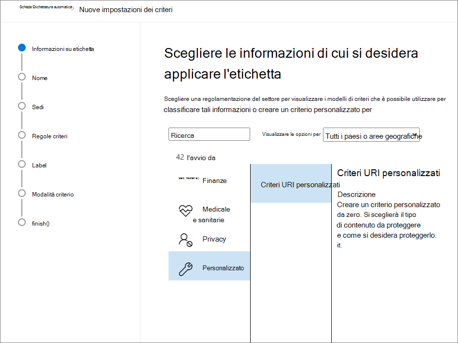
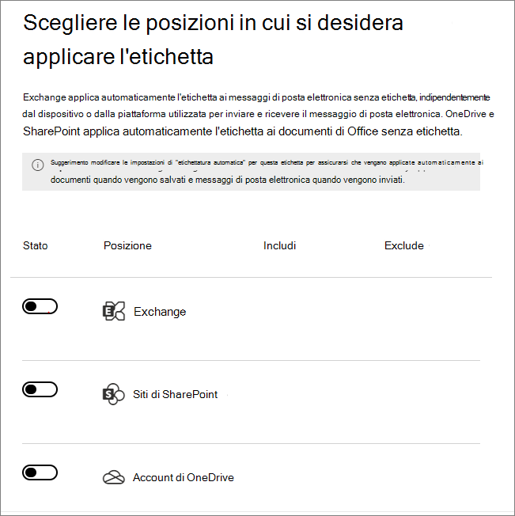
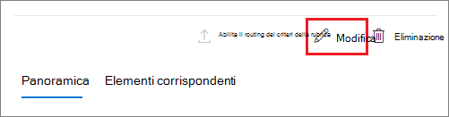

# <a name="apply-a-sensitivity-label-to-content-automatically"></a><span data-ttu-id="47fac-103">Applicare automaticamente un'etichetta di riservatezza al contenuto</span><span class="sxs-lookup"><span data-stu-id="47fac-103">Apply a sensitivity label to content automatically</span></span>

><span data-ttu-id="47fac-104">*[Indicazioni per l'assegnazione di licenze di Microsoft 365 per sicurezza e conformità](/office365/servicedescriptions/microsoft-365-service-descriptions/microsoft-365-tenantlevel-services-licensing-guidance/microsoft-365-security-compliance-licensing-guidance).*</span><span class="sxs-lookup"><span data-stu-id="47fac-104">*[Microsoft 365 licensing guidance for security & compliance](/office365/servicedescriptions/microsoft-365-service-descriptions/microsoft-365-tenantlevel-services-licensing-guidance/microsoft-365-security-compliance-licensing-guidance).*</span></span>

> [!NOTE]
> <span data-ttu-id="47fac-105">Per informazioni su come classificare ed etichettare i dati in Azure Purview, attualmente in anteprima, vedere [Etichettare automaticamente contenuti in Azure Purview](/azure/purview/create-sensitivity-label).</span><span class="sxs-lookup"><span data-stu-id="47fac-105">For information about automatically applying a sensitivity label in Azure Purview (preview), see [Automatically label your content in Azure Purview](/azure/purview/create-sensitivity-label).</span></span>

<span data-ttu-id="47fac-106">Quando si crea un'etichetta di riservatezza, è possibile assegnarla automaticamente a file e messaggi di posta elettronica quando soddisfano le condizioni specificate.</span><span class="sxs-lookup"><span data-stu-id="47fac-106">When you create a sensitivity label, you can automatically assign that label to files and emails when it matches conditions that you specify.</span></span>

<span data-ttu-id="47fac-107">La possibilità di applicare automaticamente etichette di riservatezza al contenuto è importante perché:</span><span class="sxs-lookup"><span data-stu-id="47fac-107">This ability to apply sensitivity labels to content automatically is important because:</span></span>

- <span data-ttu-id="47fac-108">Non è necessario spiegare agli utenti quando usare le singole classificazioni.</span><span class="sxs-lookup"><span data-stu-id="47fac-108">You don't need to train your users when to use each of your classifications.</span></span>

- <span data-ttu-id="47fac-109">Non è necessario affidarsi solo agli utenti per la classificazione corretta di tutto il contenuto.</span><span class="sxs-lookup"><span data-stu-id="47fac-109">You don't need to rely on users to classify all content correctly.</span></span>

- <span data-ttu-id="47fac-110">Gli utenti non hanno più bisogno di conoscere i criteri e possono concentrarsi sul loro lavoro.</span><span class="sxs-lookup"><span data-stu-id="47fac-110">Users no longer need to know about your policies—they can instead focus on their work.</span></span>

<span data-ttu-id="47fac-111">Quando il contenuto è stato etichettato manualmente, quell'etichetta non verrà mai sostituita dall'etichettatura automatica.</span><span class="sxs-lookup"><span data-stu-id="47fac-111">When content has been manually labeled, that label will never be replaced by automatic labeling.</span></span> <span data-ttu-id="47fac-112">Tuttavia, l'etichettatura automatica può sostituire un'[etichetta con livello di priorità inferiore](sensitivity-labels.md#label-priority-order-matters) applicata automaticamente.</span><span class="sxs-lookup"><span data-stu-id="47fac-112">However, automatic labeling can replace a [lower priority label](sensitivity-labels.md#label-priority-order-matters) that was automatically applied.</span></span>

<span data-ttu-id="47fac-113">Esistono due metodi diversi per applicare automaticamente un'etichetta di riservatezza al contenuto in Microsoft 365:</span><span class="sxs-lookup"><span data-stu-id="47fac-113">There are two different methods for automatically applying a sensitivity label to content in Microsoft 365:</span></span>

- <span data-ttu-id="47fac-114">**Etichettatura lato client quando gli utenti modificano documenti o compongono (e rispondono o inoltrano) messaggi di posta elettronica**: usare un'etichetta configurata per l'applicazione automatica di etichette per file e messaggi di posta elettronica (include Word, Excel, PowerPoint e Outlook).</span><span class="sxs-lookup"><span data-stu-id="47fac-114">**Client-side labeling when users edit documents or compose (also reply or forward) emails**: Use a label that's configured for auto-labeling for files and emails (includes Word, Excel, PowerPoint, and Outlook).</span></span> 
    
    <span data-ttu-id="47fac-115">Questo metodo supporta la raccomandazione di un'etichetta agli utenti, nonché l'applicazione automatica di un'etichetta.</span><span class="sxs-lookup"><span data-stu-id="47fac-115">This method supports recommending a label to users, as well as automatically applying a label.</span></span> <span data-ttu-id="47fac-116">In entrambi i casi, comunque, l'utente decide se accettarla o rifiutarla, per garantire la corretta etichettatura del contenuto.</span><span class="sxs-lookup"><span data-stu-id="47fac-116">But in both cases, the user decides whether to accept or reject the label, to help ensure the correct labeling of content.</span></span> <span data-ttu-id="47fac-117">Questa etichettatura lato client ha un ritardo minimo per i documenti perché l'etichetta può essere applicata anche prima di salvare il documento.</span><span class="sxs-lookup"><span data-stu-id="47fac-117">This client-side labeling has minimal delay for documents because the label can be applied even before the document is saved.</span></span> <span data-ttu-id="47fac-118">Tuttavia, non tutte le app client supportano l'etichettatura automatica.</span><span class="sxs-lookup"><span data-stu-id="47fac-118">However, not all client apps support auto-labeling.</span></span> <span data-ttu-id="47fac-119">Questa funzionalità è supportata dal client di etichettatura unificata di Azure Information Protection e da [alcune versioni di Office](sensitivity-labels-office-apps.md#support-for-sensitivity-label-capabilities-in-apps).</span><span class="sxs-lookup"><span data-stu-id="47fac-119">This capability is supported by the Azure Information Protection unified labeling client, and [some versions of Office](sensitivity-labels-office-apps.md#support-for-sensitivity-label-capabilities-in-apps).</span></span> 
    
    <span data-ttu-id="47fac-120">Per le istruzioni di configurazione, vedere [Come configurare l'applicazione automatica di etichette per le app di Office](#how-to-configure-auto-labeling-for-office-apps) in questa pagina.</span><span class="sxs-lookup"><span data-stu-id="47fac-120">For configuration instructions, see [How to configure auto-labeling for Office apps](#how-to-configure-auto-labeling-for-office-apps) on this page.</span></span>

- <span data-ttu-id="47fac-121">**Etichettatura lato servizio quando il contenuto è già salvato (in SharePoint o OneDrive) o inviato tramite posta elettronica (elaborato da Exchange Online)**: usare un criterio di applicazione automatica di etichette.</span><span class="sxs-lookup"><span data-stu-id="47fac-121">**Service-side labeling when content is already saved (in SharePoint or OneDrive) or emailed (processed by Exchange Online)**: Use an auto-labeling policy.</span></span> 
    
    <span data-ttu-id="47fac-p103">Questo metodo potrebbe essere indicato anche come applicazione automatica di etichette per i dati inattivi (documenti in SharePoint e OneDrive) e per i dati in transito (messaggi di posta elettronica inviati o ricevuti da Exchange). Per Exchange, non include i messaggi di posta elettronica inattivi (cassette postali).</span><span class="sxs-lookup"><span data-stu-id="47fac-p103">You might also hear this method referred to as auto-labeling for data at rest (documents in SharePoint and OneDrive) and data in transit (email that is sent or received by Exchange). For Exchange, it doesn't include emails at rest (mailboxes).</span></span>
    
    <span data-ttu-id="47fac-124">Dato che questa etichettatura viene applicata dai servizi e non dalle applicazioni, non è necessario preoccuparsi delle app e delle versioni usate dagli utenti.</span><span class="sxs-lookup"><span data-stu-id="47fac-124">Because this labeling is applied by services rather than by applications, you don't need to worry about what apps users have and what version.</span></span> <span data-ttu-id="47fac-125">Di conseguenza, questa funzionalità è immediatamente disponibile nell'intera organizzazione ed è adatta per l'applicazione di etichette su vasta scala.</span><span class="sxs-lookup"><span data-stu-id="47fac-125">As a result, this capability is immediately available throughout your organization and suitable for labeling at scale.</span></span> <span data-ttu-id="47fac-126">I criteri di applicazione automatica di etichette non supportano l'applicazione di etichette consigliate perché l'utente non interagisce con il processo di etichettatura.</span><span class="sxs-lookup"><span data-stu-id="47fac-126">Auto-labeling policies don't support recommended labeling because the user doesn't interact with the labeling process.</span></span> <span data-ttu-id="47fac-127">L'amministratore esegue invece i criteri in modalità di simulazione per garantire la corretta etichettatura del contenuto prima dell'applicazione effettiva dell'etichetta.</span><span class="sxs-lookup"><span data-stu-id="47fac-127">Instead, the administrator runs the policies in simulation mode to help ensure the correct labeling of content before actually applying the label.</span></span>
    
    <span data-ttu-id="47fac-128">Per istruzioni sulla configurazione, vedere [Come configurare i criteri di applicazione automatica di etichette per SharePoint, OneDrive e Exchange](#how-to-configure-auto-labeling-policies-for-sharepoint-onedrive-and-exchange) in questa pagina.</span><span class="sxs-lookup"><span data-stu-id="47fac-128">For configuration instructions, see [How to configure auto-labeling policies for SharePoint, OneDrive, and Exchange](#how-to-configure-auto-labeling-policies-for-sharepoint-onedrive-and-exchange) on this page.</span></span>
    
    <span data-ttu-id="47fac-129">Caratteristiche specifiche dell'etichettatura automatica per SharePoint e OneDrive:</span><span class="sxs-lookup"><span data-stu-id="47fac-129">Specific to auto-labeling for SharePoint and OneDrive:</span></span>
    - <span data-ttu-id="47fac-p105">Sono supportati i file di Office per Word, PowerPoint ed Excel. È supportato il formato Open XML, ad esempio le estensioni .docx e .xlsx, ma non il formato di Microsoft Office 97-2003, ad esempio le estensioni .doc e .xls.</span><span class="sxs-lookup"><span data-stu-id="47fac-p105">Office files for Word, PowerPoint, and Excel are supported. Open XML format is supported (such as .docx and .xlsx) but not Microsoft Office 97-2003 format (such as .doc and .xls).</span></span>
        - <span data-ttu-id="47fac-132">Questi file inattivi possono essere etichettati automaticamente prima o dopo la creazione dei criteri di etichettatura automatica.</span><span class="sxs-lookup"><span data-stu-id="47fac-132">These files can be auto-labeled at rest before or after the auto-labeling policies are created.</span></span> <span data-ttu-id="47fac-133">I file non possono essere etichettati automaticamente se fanno parte di una sessione aperta (il file è aperto).</span><span class="sxs-lookup"><span data-stu-id="47fac-133">Files cannot be auto-labeled if they are part of an open session (the file is open).</span></span>
        - <span data-ttu-id="47fac-134">Al momento gli allegati agli elementi dell'elenco non sono supportati e non verranno etichettati automaticamente.</span><span class="sxs-lookup"><span data-stu-id="47fac-134">Currently, attachments to list items aren't supported and won't be auto-labeled.</span></span>
    - <span data-ttu-id="47fac-135">Massimo 25.000 file etichettati automaticamente nel tenant al giorno.</span><span class="sxs-lookup"><span data-stu-id="47fac-135">Maximum of 25,000 automatically labeled files in your tenant per day.</span></span>
    - <span data-ttu-id="47fac-136">Massimo di 10 criteri di etichettatura automatica per tenant, ognuno dei quali ha un massimo di 10 siti (SharePoint o OneDrive).</span><span class="sxs-lookup"><span data-stu-id="47fac-136">Maximum of 10 auto-labeling policies per tenant, each targeting up to 10 sites (SharePoint or OneDrive).</span></span>
    - <span data-ttu-id="47fac-137">I valori esistenti per "Modificato", "Modificato da" e la data non vengono cambiati dai criteri di etichettatura automatica, sia per la modalità di simulazione che per l'applicazione delle etichette.</span><span class="sxs-lookup"><span data-stu-id="47fac-137">Existing values for modified, modified by, and the date are not changed as a result of auto-labeling policies—for both simulation mode and when labels are applied.</span></span>
    - <span data-ttu-id="47fac-138">Quando si applica la crittografia all'etichetta, [l'emittente di Rights Management e il proprietario di Rights Management](/azure/information-protection/configure-usage-rights#rights-management-issuer-and-rights-management-owner) è il conto che ha modificato per ultimo il file.</span><span class="sxs-lookup"><span data-stu-id="47fac-138">When the label applies encryption, the [Rights Management issuer and Rights Management owner](/azure/information-protection/configure-usage-rights#rights-management-issuer-and-rights-management-owner) is the account that last modified the file.</span></span>

    <span data-ttu-id="47fac-139">Caratteristiche specifiche dell'etichettatura automatica per Exchange:</span><span class="sxs-lookup"><span data-stu-id="47fac-139">Specific to auto-labeling for Exchange:</span></span>
    - <span data-ttu-id="47fac-p107">A differenza dell'etichettatura manuale o dell'etichettatura automatica per le app di Office, negli allegati di Office (file Word, Excel e PowerPoint) e PDF vengono ricercate anche le condizioni specificate nei criteri di etichettatura automatica. Quando viene rilevata una corrispondenza, viene applicata un'etichetta al messaggio di posta elettronica ma non all'allegato.</span><span class="sxs-lookup"><span data-stu-id="47fac-p107">Unlike manual labeling or auto-labeling with Office apps, PDF attachments as well as Office attachments (Word, Excel, and PowerPoint files) are also scanned for the conditions you specify in your auto-labeling policy. When there is a match, the email is labeled but not the attachment.</span></span>
        - <span data-ttu-id="47fac-142">Per i file PDF, se l'etichetta applica la crittografia, questi file vengono crittografati quando il tenant [abilitati per gli allegati PDF](ome-faq.yml#are-pdf-file-attachments-supported-).</span><span class="sxs-lookup"><span data-stu-id="47fac-142">For PDF files, if the label applies encryption, these files are encrypted when your tenant is [enabled for PDF attachments](ome-faq.yml#are-pdf-file-attachments-supported-).</span></span>
        - <span data-ttu-id="47fac-p108">Per questi file di Office, è supportato il formato Open XML, ad esempio le estensioni .docx e .xlsx, ma non il formato di Microsoft Office 97-2003, ad esempio le estensioni .doc e .xls. Se l'etichetta applica la crittografia, questi file vengono crittografati.</span><span class="sxs-lookup"><span data-stu-id="47fac-p108">For these Office files, Open XML format is supported (such as .docx and .xlsx) but not Microsoft Office 97-2003 format (such as .doc and .xls). If the label applies encryption, these files are encrypted.</span></span>
    - <span data-ttu-id="47fac-145">Se sono presenti regole per il flusso di posta di Exchange o criteri di prevenzione della perdita dei dati che applicano la crittografia IRM: quando il contenuto viene identificato da queste regole o criteri e da un criterio di applicazione automatica di etichette, l'etichetta viene applicata.</span><span class="sxs-lookup"><span data-stu-id="47fac-145">If you have Exchange mail flow rules or data loss prevention (DLP) policies that apply IRM encryption: When content is identified by these rules or policies and an auto-labeling policy, the label is applied.</span></span> <span data-ttu-id="47fac-146">Se quell'etichetta applica la crittografia, le impostazioni IRM delle regole per il flusso di posta di Exchange o dei criteri di prevenzione della perdita dei dati vengono ignorate.</span><span class="sxs-lookup"><span data-stu-id="47fac-146">If that label applies encryption, the IRM settings from the Exchange mail flow rules or DLP policies are ignored.</span></span> <span data-ttu-id="47fac-147">Se invece quella etichetta non applica la crittografia, in aggiunta all'etichetta vengono applicate le impostazioni IRM delle regole per il flusso di posta di Exchange o dei criteri di prevenzione della perdita dei dati.</span><span class="sxs-lookup"><span data-stu-id="47fac-147">However, if that label doesn't apply encryption, the IRM settings from the mail flow rules or DLP policies are applied in addition to the label.</span></span>
    - <span data-ttu-id="47fac-148">I messaggi di posta elettronica con crittografia IRM senza etichetta verranno sostituiti da un'etichetta con qualsiasi impostazione di crittografia se esiste una corrispondenza usando l'etichettatura automatica.</span><span class="sxs-lookup"><span data-stu-id="47fac-148">Email that has IRM encryption with no label will be replaced by a label with any encryption settings when there is a match by using auto-labeling.</span></span>
    - <span data-ttu-id="47fac-149">La posta in arrivo viene etichettata quando esiste una corrispondenza con le condizioni di etichettatura automatica:</span><span class="sxs-lookup"><span data-stu-id="47fac-149">Incoming email is labeled when there is a match with your auto-labeling conditions:</span></span>
        - <span data-ttu-id="47fac-150">Se l'etichetta è configurata per la [crittografia](encryption-sensitivity-labels.md), la crittografia non viene applicata.</span><span class="sxs-lookup"><span data-stu-id="47fac-150">If the label is configured for [encryption](encryption-sensitivity-labels.md), that encryption isn't applied.</span></span>
        - <span data-ttu-id="47fac-151">Se l'etichetta è configurata per l'applicazione di [contrassegni dinamici](sensitivity-labels-office-apps.md#dynamic-markings-with-variables), tenere presente che questo può risultare in nomi di persone esterne all'organizzazione.</span><span class="sxs-lookup"><span data-stu-id="47fac-151">If the label is configured to apply [dynamic markings](sensitivity-labels-office-apps.md#dynamic-markings-with-variables), be aware that this can result in the names of people outside your organization.</span></span>
    - <span data-ttu-id="47fac-152">Quando si applica la crittografia all'etichetta, [l'emittente di Rights Management e il proprietario di Rights Management](/azure/information-protection/configure-usage-rights#rights-management-issuer-and-rights-management-owner) è la persona che invia il messaggio di posta elettronica.</span><span class="sxs-lookup"><span data-stu-id="47fac-152">When the label applies encryption, the [Rights Management issuer and Rights Management owner](/azure/information-protection/configure-usage-rights#rights-management-issuer-and-rights-management-owner) is the person who sends the email.</span></span> <span data-ttu-id="47fac-153">Al momento non è possibile impostare un proprietario di Rights Manager per tutte le e-mail in arrivo che vengono crittografate automaticamente.</span><span class="sxs-lookup"><span data-stu-id="47fac-153">There currently isn't a way to set a Rights Manager owner for all incoming email messages that are automatically encrypted.</span></span>
    

## <a name="compare-auto-labeling-for-office-apps-with-auto-labeling-policies"></a><span data-ttu-id="47fac-154">Confronto tra l'applicazione automatica di etichette per le app di Office e i criteri di applicazione automatica di etichette</span><span class="sxs-lookup"><span data-stu-id="47fac-154">Compare auto-labeling for Office apps with auto-labeling policies</span></span>

<span data-ttu-id="47fac-155">Nella tabella seguente sono riportate le differenze di comportamento tra i due metodi complementari di etichettatura automatica:</span><span class="sxs-lookup"><span data-stu-id="47fac-155">Use the following table to help you identify the differences in behavior for the two complementary automatic labeling methods:</span></span>

|<span data-ttu-id="47fac-156">Funzionalità o comportamento</span><span class="sxs-lookup"><span data-stu-id="47fac-156">Feature or behavior</span></span>|<span data-ttu-id="47fac-157">Impostazione di etichettatura: Applicazione automatica delle etichette per file e messaggi di posta elettronica</span><span class="sxs-lookup"><span data-stu-id="47fac-157">Label setting: Auto-labeling for files and emails</span></span>  |<span data-ttu-id="47fac-158">Criterio: Etichettatura automatica</span><span class="sxs-lookup"><span data-stu-id="47fac-158">Policy: Auto-labeling</span></span>|
|:-----|:-----|:-----|
|<span data-ttu-id="47fac-159">Dipendenza dall'app</span><span class="sxs-lookup"><span data-stu-id="47fac-159">App dependency</span></span>|[<span data-ttu-id="47fac-160">Sì</span><span class="sxs-lookup"><span data-stu-id="47fac-160">Yes</span></span>](sensitivity-labels-office-apps.md#support-for-sensitivity-label-capabilities-in-apps) |<span data-ttu-id="47fac-161">No \*</span><span class="sxs-lookup"><span data-stu-id="47fac-161">No \*</span></span> |
|<span data-ttu-id="47fac-162">Limitazione in base alla posizione</span><span class="sxs-lookup"><span data-stu-id="47fac-162">Restrict by location</span></span>|<span data-ttu-id="47fac-163">No</span><span class="sxs-lookup"><span data-stu-id="47fac-163">No</span></span> |<span data-ttu-id="47fac-164">Sì</span><span class="sxs-lookup"><span data-stu-id="47fac-164">Yes</span></span> |
|<span data-ttu-id="47fac-165">Condizioni: Classificatori sottoponibili a training</span><span class="sxs-lookup"><span data-stu-id="47fac-165">Conditions: Trainable classifiers</span></span>|<span data-ttu-id="47fac-166">Sì</span><span class="sxs-lookup"><span data-stu-id="47fac-166">Yes</span></span> |<span data-ttu-id="47fac-167">No</span><span class="sxs-lookup"><span data-stu-id="47fac-167">No</span></span> |
|<span data-ttu-id="47fac-168">Condizioni: Opzioni di condivisione e opzioni aggiuntive per la posta elettronica</span><span class="sxs-lookup"><span data-stu-id="47fac-168">Conditions: Sharing options and additional options for email</span></span>|<span data-ttu-id="47fac-169">No</span><span class="sxs-lookup"><span data-stu-id="47fac-169">No</span></span> |<span data-ttu-id="47fac-170">Sì</span><span class="sxs-lookup"><span data-stu-id="47fac-170">Yes</span></span> |
|<span data-ttu-id="47fac-171">Condizioni: Eccezioni</span><span class="sxs-lookup"><span data-stu-id="47fac-171">Conditions: Exceptions</span></span>|<span data-ttu-id="47fac-172">No</span><span class="sxs-lookup"><span data-stu-id="47fac-172">No</span></span> |<span data-ttu-id="47fac-173">Sì (solo posta elettronica)</span><span class="sxs-lookup"><span data-stu-id="47fac-173">Yes (email only)</span></span> |
|<span data-ttu-id="47fac-174">Consigli, suggerimento criteri e criteri ignorati dagli utenti</span><span class="sxs-lookup"><span data-stu-id="47fac-174">Recommendations, policy tooltip, and user overrides</span></span>|<span data-ttu-id="47fac-175">Sì</span><span class="sxs-lookup"><span data-stu-id="47fac-175">Yes</span></span> |<span data-ttu-id="47fac-176">No</span><span class="sxs-lookup"><span data-stu-id="47fac-176">No</span></span> |
|<span data-ttu-id="47fac-177">Modalità di simulazione</span><span class="sxs-lookup"><span data-stu-id="47fac-177">Simulation mode</span></span>|<span data-ttu-id="47fac-178">No</span><span class="sxs-lookup"><span data-stu-id="47fac-178">No</span></span> |<span data-ttu-id="47fac-179">Sì</span><span class="sxs-lookup"><span data-stu-id="47fac-179">Yes</span></span> |
|<span data-ttu-id="47fac-180">Verifica delle condizioni negli allegati di Exchange</span><span class="sxs-lookup"><span data-stu-id="47fac-180">Exchange attachments checked for conditions</span></span>|<span data-ttu-id="47fac-181">No</span><span class="sxs-lookup"><span data-stu-id="47fac-181">No</span></span> | <span data-ttu-id="47fac-182">Sì</span><span class="sxs-lookup"><span data-stu-id="47fac-182">Yes</span></span>|
|<span data-ttu-id="47fac-183">Applicazione di contrassegni visivi</span><span class="sxs-lookup"><span data-stu-id="47fac-183">Apply visual markings</span></span> |<span data-ttu-id="47fac-184">Sì</span><span class="sxs-lookup"><span data-stu-id="47fac-184">Yes</span></span> |<span data-ttu-id="47fac-185">Sì (solo posta elettronica)</span><span class="sxs-lookup"><span data-stu-id="47fac-185">Yes (email only)</span></span> |
|<span data-ttu-id="47fac-186">Override della crittografia IRM applicata senza etichetta</span><span class="sxs-lookup"><span data-stu-id="47fac-186">Override IRM encryption applied without a label</span></span>|<span data-ttu-id="47fac-187">Sì, se l'utente dispone del diritto minimo di utilizzo per l'esportazione</span><span class="sxs-lookup"><span data-stu-id="47fac-187">Yes if the user has the minimum usage right of Export</span></span> |<span data-ttu-id="47fac-188">Sì (solo posta elettronica)</span><span class="sxs-lookup"><span data-stu-id="47fac-188">Yes (email only)</span></span> |
|<span data-ttu-id="47fac-189">Etichettatura della posta in arrivo</span><span class="sxs-lookup"><span data-stu-id="47fac-189">Label incoming email</span></span>|<span data-ttu-id="47fac-190">No</span><span class="sxs-lookup"><span data-stu-id="47fac-190">No</span></span> |<span data-ttu-id="47fac-191">Sì</span><span class="sxs-lookup"><span data-stu-id="47fac-191">Yes</span></span>|

<span data-ttu-id="47fac-192">\* L'applicazione automatica di etichette non è attualmente disponibile in tutte le aree geografiche.</span><span class="sxs-lookup"><span data-stu-id="47fac-192">\* Auto-labeling isn't currently available in all regions.</span></span> <span data-ttu-id="47fac-193">Se il tenant non supporta questa funzionalità, la scheda di applicazione automatica delle etichette non è visibile nell'interfaccia di amministrazione relativa all’applicazione delle etichette.</span><span class="sxs-lookup"><span data-stu-id="47fac-193">If your tenant can't support this functionality, the Auto-labeling tab isn't visible in the admin labeling center.</span></span>

## <a name="how-multiple-conditions-are-evaluated-when-they-apply-to-more-than-one-label"></a><span data-ttu-id="47fac-194">Modalità di valutazione di più condizioni quando si applicano a più etichette</span><span class="sxs-lookup"><span data-stu-id="47fac-194">How multiple conditions are evaluated when they apply to more than one label</span></span>

<span data-ttu-id="47fac-p112">Le etichette sono ordinate per la valutazione in base alla posizione specificata nei criteri: la prima etichetta ha la posizione più bassa (meno riservata) mentre l'ultima etichetta ha la posizione più alta (più riservata). Per altre informazioni sulla priorità, vedere [Priorità dell’etichetta (l’ordine è importante)](sensitivity-labels.md#label-priority-order-matters).</span><span class="sxs-lookup"><span data-stu-id="47fac-p112">The labels are ordered for evaluation according to their position that you specify in the policy: The label positioned first has the lowest position (least sensitive) and the label positioned last has the highest position (most sensitive). For more information on priority, see [Label priority (order matters)](sensitivity-labels.md#label-priority-order-matters).</span></span>

## <a name="dont-configure-a-parent-label-to-be-applied-automatically-or-recommended"></a><span data-ttu-id="47fac-197">Non configurare un'etichetta padre in modo che venga applicata automaticamente o consigliata</span><span class="sxs-lookup"><span data-stu-id="47fac-197">Don't configure a parent label to be applied automatically or recommended</span></span>

<span data-ttu-id="47fac-198">Tenere presente che non è possibile applicare al contenuto un'etichetta padre (un'etichetta con sottoetichette).</span><span class="sxs-lookup"><span data-stu-id="47fac-198">Remember, you can't apply a parent label (a label with sublabels) to content.</span></span> <span data-ttu-id="47fac-199">Verificare che non sia stata configurata un'etichetta padre per essere applicata automaticamente o consigliata nelle app di Office e non selezionare un'etichetta padre per un criterio di applicazione automatica di etichette,</span><span class="sxs-lookup"><span data-stu-id="47fac-199">Make sure that you don't configure a parent label to be auto-applied or recommended in Office apps, and don't select a parent label for an auto-labeling policy.</span></span> <span data-ttu-id="47fac-200">altrimenti l'etichetta padre non verrà applicata al contenuto.</span><span class="sxs-lookup"><span data-stu-id="47fac-200">If you do, the parent label won't be applied to content.</span></span>

<span data-ttu-id="47fac-201">Per usare l'etichettatura automatica con le sottoetichette, assicurarsi di pubblicare sia l'etichetta padre che la sottoetichetta.</span><span class="sxs-lookup"><span data-stu-id="47fac-201">To use automatic labeling with sublabels, make sure you publish both the parent label and the sublabel.</span></span>

<span data-ttu-id="47fac-202">Per ulteriori informazioni sulle etichette padre e sulle sottoetichette, vedere [Sottoetichette (raggruppamento etichette)](sensitivity-labels.md#sublabels-grouping-labels).</span><span class="sxs-lookup"><span data-stu-id="47fac-202">For more information on parent labels and sublabels, see [Sublabels (grouping labels)](sensitivity-labels.md#sublabels-grouping-labels).</span></span>

## <a name="how-to-configure-auto-labeling-for-office-apps"></a><span data-ttu-id="47fac-203">Come configurare l'applicazione automatica di etichette per le app di Office</span><span class="sxs-lookup"><span data-stu-id="47fac-203">How to configure auto-labeling for Office apps</span></span>

<span data-ttu-id="47fac-204">L'assegnazione automatica di etichette nelle app Office per Windows è supportata dal client di etichettatura unificata di Azure Information Protection.</span><span class="sxs-lookup"><span data-stu-id="47fac-204">Automatic labeling in Office apps for Windows is supported by the Azure Information Protection unified labeling client.</span></span> <span data-ttu-id="47fac-205">Per l’etichettatura predefinita delle app di Office, questa funzionalità [prevede fasi di disponibilità diverse per app differenti](sensitivity-labels-office-apps.md#support-for-sensitivity-label-capabilities-in-apps).</span><span class="sxs-lookup"><span data-stu-id="47fac-205">For built-in labeling in Office apps, this capability is in [different stages of availability for different apps](sensitivity-labels-office-apps.md#support-for-sensitivity-label-capabilities-in-apps).</span></span>

<span data-ttu-id="47fac-206">Le impostazioni di applicazione automatica delle etichette per le app di Office sono disponibili quando si [crea o modifica un'etichetta di riservatezza](create-sensitivity-labels.md).</span><span class="sxs-lookup"><span data-stu-id="47fac-206">The auto-labeling settings for Office apps are available when you [create or edit a sensitivity label](create-sensitivity-labels.md).</span></span> <span data-ttu-id="47fac-207">Assicurarsi che **File e messaggi di posta elettronica** sia selezionato per l'ambito dell'etichetta:</span><span class="sxs-lookup"><span data-stu-id="47fac-207">Make sure **Files & emails** is selected for the label's scope:</span></span> 


<span data-ttu-id="47fac-209">Mentre ci si sposta attraverso la procedura guidata, viene visualizzata la pagina **Applicazione automatica delle etichette per file e messaggi di posta elettronica**, in cui è possibile scegliere da un elenco di tipi di informazioni sensibili o di classificatori sottoponibili a training:</span><span class="sxs-lookup"><span data-stu-id="47fac-209">As you move through the wizard, you see the **Auto-labeling for files and emails** page where you can choose from a list of sensitive info types or trainable classifiers:</span></span>


<span data-ttu-id="47fac-p116">Quando questa etichetta di riservatezza viene applicata automaticamente, l'utente riceve una notifica nella propria app Office. Ad esempio:</span><span class="sxs-lookup"><span data-stu-id="47fac-p116">When this sensitivity label is automatically applied, the user sees a notification in their Office app. For example:</span></span>


### <a name="configuring-sensitive-info-types-for-a-label"></a><span data-ttu-id="47fac-214">Configurazione dei tipi di informazioni sensibili per un'etichetta</span><span class="sxs-lookup"><span data-stu-id="47fac-214">Configuring sensitive info types for a label</span></span>

<span data-ttu-id="47fac-215">Quando si seleziona l'opzione **Tipi di informazioni sensibili**, viene visualizzato lo stesso elenco di tipi di informazioni sensibili mostrato durante la creazione di un criterio di prevenzione della perdita dei dati (DLP).</span><span class="sxs-lookup"><span data-stu-id="47fac-215">When you select the **Sensitive info types** option, you see the same list of sensitive information types as when you create a data loss prevention (DLP) policy.</span></span> <span data-ttu-id="47fac-216">Ad esempio, è possibile applicare automaticamente un'etichetta Estremamente riservato a qualsiasi contenuto che include informazioni personali dei clienti, ad esempio numeri di carte di credito, codici fiscali o numeri di passaporto:</span><span class="sxs-lookup"><span data-stu-id="47fac-216">So you can, for example, automatically apply a Highly Confidential label to any content that contains customers' personal information, such as credit card numbers, social security numbers, or passport numbers:</span></span>


<span data-ttu-id="47fac-p118">Analogamente a quando si configurano i criteri sulla prevenzione della perdita dei dati, è possibile perfezionare la condizione cambiando il numero delle istanze e l’accuratezza della corrispondenza. Ad esempio:</span><span class="sxs-lookup"><span data-stu-id="47fac-p118">Similarly to when you configure DLP policies, you can then refine your condition by changing the instance count and match accuracy. For example:</span></span>


<span data-ttu-id="47fac-221">Per altre informazioni su queste opzioni di configurazione, vedere la documentazione sulla prevenzione della perdita dei dati: [Modificare le regole per rendere più facili o difficili le corrispondenze](data-loss-prevention-policies.md#tuning-rules-to-make-them-easier-or-harder-to-match).</span><span class="sxs-lookup"><span data-stu-id="47fac-221">You can learn more about these configuration options from the DLP documentation: [Tuning rules to make them easier or harder to match](data-loss-prevention-policies.md#tuning-rules-to-make-them-easier-or-harder-to-match).</span></span>

<span data-ttu-id="47fac-222">Inoltre, analogamente alla configurazione dei criteri di prevenzione della perdita dei dati, è possibile scegliere se una condizione deve rilevare tutti i tipi di informazioni sensibili o solo una di esse.</span><span class="sxs-lookup"><span data-stu-id="47fac-222">Also similarly to DLP policy configuration, you can choose whether a condition must detect all sensitive information types, or just one of them.</span></span> <span data-ttu-id="47fac-223">Per rendere le condizioni più flessibili o complesse, è possibile aggiungere [gruppi e usare operatori logici tra i gruppi](data-loss-prevention-policies.md#grouping-and-logical-operators).</span><span class="sxs-lookup"><span data-stu-id="47fac-223">And to make your conditions more flexible or complex, you can add [groups and use logical operators between the groups](data-loss-prevention-policies.md#grouping-and-logical-operators).</span></span>

> [!NOTE]
> <span data-ttu-id="47fac-224">I criteri di etichettatura automatica basati su tipi di informazioni sensibili personalizzati si applicano solo al contenuto appena creato o modificato in OneDrive e SharePoint.</span><span class="sxs-lookup"><span data-stu-id="47fac-224">Auto-labelling policies based on custom sensitive information types only apply to newly created or modified content in OneDrive and SharePoint.</span></span> 

### <a name="configuring-trainable-classifiers-for-a-label"></a><span data-ttu-id="47fac-225">Configurazione di classificatori sottoponibili a training per un'etichetta</span><span class="sxs-lookup"><span data-stu-id="47fac-225">Configuring trainable classifiers for a label</span></span>

<span data-ttu-id="47fac-226">Al momento questa opzione è disponibile in anteprima.</span><span class="sxs-lookup"><span data-stu-id="47fac-226">This option is currently in preview.</span></span> <span data-ttu-id="47fac-227">Se si usa questa opzione, assicurare di avere pubblicato nel tenant almeno un'altra etichetta di riservatezza che sia configurata per l'assegnazione automatica delle etichette e l'opzione [tipi di informazioni sensibili](#configuring-sensitive-info-types-for-a-label).</span><span class="sxs-lookup"><span data-stu-id="47fac-227">If you use this option, make sure you have published in your tenant at least one other sensitivity label that's configured for auto-labeling and the [sensitive info types option](#configuring-sensitive-info-types-for-a-label).</span></span>

<span data-ttu-id="47fac-228">Quando si seleziona l'opzione **Classificatori sottoponibili a training**, scegliere uno o più dei classificatori sottoponibili a training predefiniti di Microsoft.</span><span class="sxs-lookup"><span data-stu-id="47fac-228">When you select the **Trainable classifiers** option, select one or more of the built-in trainable classifiers from Microsoft.</span></span> <span data-ttu-id="47fac-229">Se sono stati creati classificatori sottoponibili a training personalizzati, saranno anch'essi disponibili per la selezione:</span><span class="sxs-lookup"><span data-stu-id="47fac-229">If you've created your own custom trainable classifiers, these are also available to select:</span></span>


> [!CAUTION]
> <span data-ttu-id="47fac-231">Il classificatore predefinito **Linguaggio offensivo** è stato deprecato perché generava un numero elevato di falsi positivi.</span><span class="sxs-lookup"><span data-stu-id="47fac-231">We are deprecating the **Offensive Language** built-in classifier because it has been producing a high number of false positives.</span></span> <span data-ttu-id="47fac-232">Non usare questo classificatore predefinito e, se è in uso, è consigliabile spostare i processi aziendali da esso.</span><span class="sxs-lookup"><span data-stu-id="47fac-232">Don't use this built-in classifier and if you are currently using it, you should move your business processes off it.</span></span> <span data-ttu-id="47fac-233">Usare invece i classificatori predefiniti per **molestie**, **volgarità** e **minacce**.</span><span class="sxs-lookup"><span data-stu-id="47fac-233">We recommend using the **Targeted Harassment**, **Profanity**, and **Threat** built-in classifiers instead.</span></span>

<span data-ttu-id="47fac-234">Per altre informazioni su questi classificatori, vedere [Informazioni sui classificatori sottoponibili a training](classifier-learn-about.md).</span><span class="sxs-lookup"><span data-stu-id="47fac-234">For more information about these classifiers, see [Learn about trainable classifiers](classifier-learn-about.md).</span></span>

<span data-ttu-id="47fac-235">Durante il periodo di anteprima dell'opzione, le app seguenti supportano i classificatori sottoponibili a training per le etichette di riservatezza:</span><span class="sxs-lookup"><span data-stu-id="47fac-235">During the preview period for this option, the following apps support trainable classifiers for sensitivity labels:</span></span>

- <span data-ttu-id="47fac-236">Microsoft 365 Apps for enterprise ([in precedenza Office 365 ProPlus](/deployoffice/name-change)) per Windows, ora in distribuzione nel [Canale corrente](/deployoffice/overview-update-channels#current-channel-overview) nella versione 2006 e successive:</span><span class="sxs-lookup"><span data-stu-id="47fac-236">Microsoft 365 Apps for enterprise ([formerly Office 365 ProPlus](/deployoffice/name-change)) for Windows, now rolling out to the [Current Channel](/deployoffice/overview-update-channels#current-channel-overview) in version 2006 and later:</span></span>
    - <span data-ttu-id="47fac-237">Word</span><span class="sxs-lookup"><span data-stu-id="47fac-237">Word</span></span>
    - <span data-ttu-id="47fac-238">Excel</span><span class="sxs-lookup"><span data-stu-id="47fac-238">Excel</span></span>
    - <span data-ttu-id="47fac-239">PowerPoint</span><span class="sxs-lookup"><span data-stu-id="47fac-239">PowerPoint</span></span>

- <span data-ttu-id="47fac-240">Office per le app Web, se le [etichette di riservatezza sono abilitate per i file di Office in SharePoint e OneDrive](sensitivity-labels-sharepoint-onedrive-files.md):</span><span class="sxs-lookup"><span data-stu-id="47fac-240">Office for the web apps, when you have [enabled sensitivity labels for Office files in SharePoint and OneDrive](sensitivity-labels-sharepoint-onedrive-files.md):</span></span>
    - <span data-ttu-id="47fac-241">Word</span><span class="sxs-lookup"><span data-stu-id="47fac-241">Word</span></span>
    - <span data-ttu-id="47fac-242">Excel</span><span class="sxs-lookup"><span data-stu-id="47fac-242">Excel</span></span>
    - <span data-ttu-id="47fac-243">PowerPoint</span><span class="sxs-lookup"><span data-stu-id="47fac-243">PowerPoint</span></span>
    - <span data-ttu-id="47fac-244">Outlook</span><span class="sxs-lookup"><span data-stu-id="47fac-244">Outlook</span></span>

### <a name="recommend-that-the-user-applies-a-sensitivity-label"></a><span data-ttu-id="47fac-245">Consigliare all'utente di applicare un'etichetta di riservatezza</span><span class="sxs-lookup"><span data-stu-id="47fac-245">Recommend that the user applies a sensitivity label</span></span>

<span data-ttu-id="47fac-p123">Se si preferisce, si può consigliare agli utenti di applicare l'etichetta. Con questa opzione, gli utenti possono accettare la classificazione e l'eventuale protezione associata oppure chiudere il suggerimento, se l'etichetta non è adatta al contenuto.</span><span class="sxs-lookup"><span data-stu-id="47fac-p123">If you prefer, you can recommend to your users that they apply the label. With this option, your users can accept the classification and any associated protection, or dismiss the recommendation if the label isn't suitable for their content.</span></span>


<span data-ttu-id="47fac-p124">Ecco un esempio di un avviso del client di etichettatura unificata di Azure Information Protection quando si configura una condizione per applicare un'etichetta come azione consigliata, con un suggerimento per i criteri personalizzati. È possibile scegliere quale testo visualizzare nel suggerimento per i criteri.</span><span class="sxs-lookup"><span data-stu-id="47fac-p124">Here's an example of a prompt from the Azure Information Protection unified labeling client when you configure a condition to apply a label as a recommended action, with a custom policy tip. You can choose what text is displayed in the policy tip.</span></span>


### <a name="when-automatic-or-recommended-labels-are-applied"></a><span data-ttu-id="47fac-252">Quando vengono applicate le etichette automatiche o consigliate</span><span class="sxs-lookup"><span data-stu-id="47fac-252">When automatic or recommended labels are applied</span></span>

<span data-ttu-id="47fac-p125">L'implementazione dell'etichettatura automatica e consigliata nelle app di Office varia a seconda che si usi l'etichettatura integrata in Office o il client di etichettatura unificata di Azure Information Protection. In entrambi i casi, tuttavia:</span><span class="sxs-lookup"><span data-stu-id="47fac-p125">The implementation of automatic and recommended labeling in Office apps depend on whether you're using labeling that's built into Office, or the Azure Information Protection unified labeling client. In both cases, however:</span></span>

- <span data-ttu-id="47fac-p126">Non è possibile usare l'assegnazione automatica di etichette per le e-mail e i documenti in precedenza etichettati manualmente o associati automaticamente a un grado maggiore di riservatezza. È possibile applicare una singola etichetta di riservatezza a un documento o un messaggio di posta elettronica (oltre a una singola etichetta di conservazione).</span><span class="sxs-lookup"><span data-stu-id="47fac-p126">You can't use automatic labeling for documents and emails that were previously manually labeled, or previously automatically labeled with a higher sensitivity. Remember, you can only apply a single sensitivity label to a document or email (in addition to a single retention label).</span></span>

- <span data-ttu-id="47fac-p127">Non è possibile usare la classificazione consigliata per i documenti etichettati in precedenza con un grado maggiore di riservatezza. Quando il contenuto è già stato etichettato con una riservatezza superiore, l'utente non visualizzerà l'avviso con il consiglio e il suggerimento per i criteri.</span><span class="sxs-lookup"><span data-stu-id="47fac-p127">You can't use recommended labeling for documents or emails that were previously labeled with a higher sensitivity. When the content's already labeled with a higher sensitivity, the user won't see the prompt with the recommendation and policy tip.</span></span>

<span data-ttu-id="47fac-259">Caratteristiche specifiche dell'etichettatura predefinita:</span><span class="sxs-lookup"><span data-stu-id="47fac-259">Specific to built-in labeling:</span></span>

- <span data-ttu-id="47fac-260">Non tutte le app di Office supportano l'etichettatura automatica (e consigliata).</span><span class="sxs-lookup"><span data-stu-id="47fac-260">Not all Office apps support automatic (and recommended) labeling.</span></span> <span data-ttu-id="47fac-261">Per altre informazioni, vedere [Supporto per le funzionalità di riservatezza nelle app](sensitivity-labels-office-apps.md#support-for-sensitivity-label-capabilities-in-apps).</span><span class="sxs-lookup"><span data-stu-id="47fac-261">For more information, see [Support for sensitivity label capabilities in apps](sensitivity-labels-office-apps.md#support-for-sensitivity-label-capabilities-in-apps).</span></span>

- <span data-ttu-id="47fac-262">Per le etichette consigliate nelle versioni desktop di Word, il contenuto sensibile che ha generato il suggerimento viene contrassegnato in modo che gli utenti possano rivedere e rimuovere tale contenuto anziché applicare l'etichetta di riservatezza consigliata.</span><span class="sxs-lookup"><span data-stu-id="47fac-262">For recommended labels in the desktop versions of Word, the sensitive content that triggered the recommendation is flagged so that users can review and remove the sensitive content instead of applying the recommended sensitivity label.</span></span>

- <span data-ttu-id="47fac-263">Per informazioni su come vengono applicate tali etichette nelle app di Office, screenshot di esempio e dettagli su come vengono rilevate le informazioni sensibili, vedere [Applicare automaticamente o consigliare l'applicazione di etichette di riservatezza ai file e ai messaggi di posta elettronica in Office](https://support.office.com/it-IT/article/automatically-apply-or-recommend-sensitivity-labels-to-your-files-and-emails-in-office-622e0d9c-f38c-470a-bcdb-9e90b24d71a1).</span><span class="sxs-lookup"><span data-stu-id="47fac-263">For details about how these labels are applied in Office apps, example screenshots, and how sensitive information is detected, see [Automatically apply or recommend sensitivity labels to your files and emails in Office](https://support.office.com/it-IT/article/automatically-apply-or-recommend-sensitivity-labels-to-your-files-and-emails-in-office-622e0d9c-f38c-470a-bcdb-9e90b24d71a1).</span></span>

<span data-ttu-id="47fac-264">Caratteristiche specifiche del client di etichettatura unificata di Azure Information Protection:</span><span class="sxs-lookup"><span data-stu-id="47fac-264">Specific to the Azure Information Protection unified labeling client:</span></span>

-  <span data-ttu-id="47fac-265">L'assegnazione automatica e consigliata delle etichette si applica a Word, Excel e PowerPoint al salvataggio dei documenti e in Outlook all'invio di messaggi di posta elettronica.</span><span class="sxs-lookup"><span data-stu-id="47fac-265">Automatic and recommended labeling applies to Word, Excel, and PowerPoint when you save a document, and to Outlook when you send an email.</span></span>

- <span data-ttu-id="47fac-266">Affinché Outlook sia in grado di supportare l'etichettatura consigliata, è prima necessario configurare un'[impostazione dei criteri avanzata](/azure/information-protection/rms-client/clientv2-admin-guide-customizations#enable-recommended-classification-in-outlook).</span><span class="sxs-lookup"><span data-stu-id="47fac-266">For Outlook to support recommended labeling, you must first configure an [advanced policy setting](/azure/information-protection/rms-client/clientv2-admin-guide-customizations#enable-recommended-classification-in-outlook).</span></span>

- <span data-ttu-id="47fac-267">Le informazioni sensibili possono essere rilevate nel corpo del testo nei documenti e nei messaggi di posta elettronica e nelle intestazioni a piè di pagina, ma non nella riga dell'oggetto o negli allegati di posta elettronica.</span><span class="sxs-lookup"><span data-stu-id="47fac-267">Sensitive information can be detected in the body text in documents and emails, and to headers and footers—but not in the subject line or attachments of email.</span></span>

## <a name="how-to-configure-auto-labeling-policies-for-sharepoint-onedrive-and-exchange"></a><span data-ttu-id="47fac-268">Come configurare i criteri di applicazione automatica di etichette per SharePoint, OneDrive e Exchange</span><span class="sxs-lookup"><span data-stu-id="47fac-268">How to configure auto-labeling policies for SharePoint, OneDrive, and Exchange</span></span>

<span data-ttu-id="47fac-269">Assicurarsi di conoscere i prerequisiti prima di configurare i criteri di etichetta automatica.</span><span class="sxs-lookup"><span data-stu-id="47fac-269">Make sure you're aware of the prerequisites before you configure auto-labeling policies.</span></span> 

### <a name="prerequisites-for-auto-labeling-policies"></a><span data-ttu-id="47fac-270">Prerequisiti per i criteri di applicazione automatica di etichette</span><span class="sxs-lookup"><span data-stu-id="47fac-270">Prerequisites for auto-labeling policies</span></span>

- <span data-ttu-id="47fac-271">Modalità di simulazione:</span><span class="sxs-lookup"><span data-stu-id="47fac-271">Simulation mode:</span></span>
    - <span data-ttu-id="47fac-272">È necessario abilitare il controllo per Microsoft 365.</span><span class="sxs-lookup"><span data-stu-id="47fac-272">Auditing for Microsoft 365 must be turned on.</span></span> <span data-ttu-id="47fac-273">Per abilitare il controllo o verificare se è già attivato, vedere [Abilitare o disabilitare la ricerca nel log di audit](turn-audit-log-search-on-or-off.md).</span><span class="sxs-lookup"><span data-stu-id="47fac-273">If you need to turn on auditing or you're not sure whether auditing is already on, see [Turn audit log search on or off](turn-audit-log-search-on-or-off.md).</span></span>
    - <span data-ttu-id="47fac-274">Per visualizzare il contenuto del file e del messaggio di posta elettronica nella visualizzazione origine, è necessario avere il ruolo di **Visualizzatore contenuto di Esplora contenuto**.</span><span class="sxs-lookup"><span data-stu-id="47fac-274">To view file or email contents in the source view, you must have the **Content Explorer Content Viewer** role.</span></span> <span data-ttu-id="47fac-275">Per impostazione predefinita, gli amministratori globali non hanno questo ruolo.</span><span class="sxs-lookup"><span data-stu-id="47fac-275">Global admins don't have this role by default.</span></span> <span data-ttu-id="47fac-276">Se non si dispone di questa autorizzazione, non viene visualizzato il riquadro di anteprima quando si seleziona un elemento dalla scheda **Elementi corrispondenti**.</span><span class="sxs-lookup"><span data-stu-id="47fac-276">If you don't have this permission, you don't see the preview pane when you select an item from the **Matched Items** tab.</span></span>

- <span data-ttu-id="47fac-277">Per assegnare automaticamente un'etichetta ai file in SharePoint e OneDrive:</span><span class="sxs-lookup"><span data-stu-id="47fac-277">To auto-label files in SharePoint and OneDrive:</span></span>
    - <span data-ttu-id="47fac-278">Sono state [abilitate le etichette di riservatezza per i file di Office in SharePoint e OneDrive](sensitivity-labels-sharepoint-onedrive-files.md).</span><span class="sxs-lookup"><span data-stu-id="47fac-278">You have [enabled sensitivity labels for Office files in SharePoint and OneDrive](sensitivity-labels-sharepoint-onedrive-files.md).</span></span>
    - <span data-ttu-id="47fac-279">Nel momento in cui vengono eseguiti i criteri di applicazione automatica di etichette, il file non deve essere aperto da un altro processo o utente.</span><span class="sxs-lookup"><span data-stu-id="47fac-279">At the time the auto-labeling policy runs, the file mustn't be open by another process or user.</span></span> <span data-ttu-id="47fac-280">Un file estratto per la modifica rientra in questa categoria.</span><span class="sxs-lookup"><span data-stu-id="47fac-280">A file that's checked out for editing falls into this category.</span></span>

- <span data-ttu-id="47fac-281">Se si prevede di usare [tipi di informazioni sensibili personalizzati](sensitive-information-type-learn-about.md) anziché quelli predefiniti:</span><span class="sxs-lookup"><span data-stu-id="47fac-281">If you plan to use [custom sensitive information types](sensitive-information-type-learn-about.md) rather than the built-in sensitivity types:</span></span> 
    - <span data-ttu-id="47fac-282">I tipi di informazioni di sensibili personalizzati riguardano solo il contenuto aggiunto o modificato in SharePoint o a OneDrive successivamente alla loro applicazione.</span><span class="sxs-lookup"><span data-stu-id="47fac-282">Custom sensitivity information types apply only to content that is added or modified in SharePoint or OneDrive after the custom sensitivity information types are enforced.</span></span> 
    - <span data-ttu-id="47fac-283">Per testare nuovi tipi di informazioni sensibili personalizzati, crearli prima di creare i criteri di applicazione automatica di etichette e quindi creare nuovi documenti con i dati di esempio per il test.</span><span class="sxs-lookup"><span data-stu-id="47fac-283">To test new custom sensitive information types, create them before you create your auto-labeling policy, and then create new documents with sample data for testing.</span></span>

- <span data-ttu-id="47fac-284">Una o più etichette di riservatezza [create e pubblicate](create-sensitivity-labels.md) (per almeno un utente) che è possibile selezionare per i criteri di applicazione automatica di etichette.</span><span class="sxs-lookup"><span data-stu-id="47fac-284">One or more sensitivity labels [created and published](create-sensitivity-labels.md) (to at least one user) that you can select for your auto-labeling policies.</span></span> <span data-ttu-id="47fac-285">Per queste etichette:</span><span class="sxs-lookup"><span data-stu-id="47fac-285">For these labels:</span></span>
    - <span data-ttu-id="47fac-286">Non è rilevante se l'opzione di etichettatura automatica nelle app di Office sia attivata o disattivata perché, come spiegato nell'introduzione, quella impostazione delle etichette integra i criteri di applicazione automatica di etichette.</span><span class="sxs-lookup"><span data-stu-id="47fac-286">It doesn't matter if the auto-labeling in Office apps label setting is turned on or off, because that label setting supplements auto-labeling policies, as explained in the introduction.</span></span>
    - <span data-ttu-id="47fac-287">Se le etichette che si vogliono usare per l'applicazione automatica di etichette sono configurate per l'uso di contrassegni visivi (intestazioni, piè di pagina e filigrane), tenere presente che non questi non vengono applicati ai documenti.</span><span class="sxs-lookup"><span data-stu-id="47fac-287">If the labels you want to use for auto-labeling are configured to use visual markings (headers, footers, watermarks), note that these are not applied to documents.</span></span>
    - <span data-ttu-id="47fac-288">Se le etichette applicano la [crittografia](encryption-sensitivity-labels.md):</span><span class="sxs-lookup"><span data-stu-id="47fac-288">If the labels apply [encryption](encryption-sensitivity-labels.md):</span></span>
        - <span data-ttu-id="47fac-289">Quando il criterio di applicazione automatica delle etichette include posizioni per SharePoint o OneDrive, l'etichetta deve essere configurata per l'impostazione **Assegnare le autorizzazioni adesso**.</span><span class="sxs-lookup"><span data-stu-id="47fac-289">When the auto-labeling policy includes locations for SharePoint or OneDrive, the label must be configured for the **Assign permissions now** setting.</span></span>
        - <span data-ttu-id="47fac-290">Quando il criterio di applicazione automatica delle etichette è solo per Exchange, l'etichetta può essere configurata sia per **Assegnare le autorizzazioni adesso** o **Consentire agli utenti di assegnare le autorizzazioni** (per le opzioni Non inoltrare o Solo crittografia).</span><span class="sxs-lookup"><span data-stu-id="47fac-290">When the auto-labeling policy is just for Exchange, the label can be configured for either **Assign permissions now** or **Let users assign permissions** (for the Do Not Forward or Encrypt-Only options).</span></span>

### <a name="learn-about-simulation-mode"></a><span data-ttu-id="47fac-291">Informazioni sulla modalità di simulazione</span><span class="sxs-lookup"><span data-stu-id="47fac-291">Learn about simulation mode</span></span>

<span data-ttu-id="47fac-292">La modalità di simulazione è specifica dei criteri di applicazione automatica di etichette ed è integrata nel flusso di lavoro.</span><span class="sxs-lookup"><span data-stu-id="47fac-292">Simulation mode is unique to auto-labeling policies and woven into the workflow.</span></span> <span data-ttu-id="47fac-293">Non è possibile applicare automaticamente etichette ai documenti e ai messaggi di posta elettronica prima che il criterio abbia eseguito almeno una simulazione.</span><span class="sxs-lookup"><span data-stu-id="47fac-293">You can't automatically label documents and emails until your policy has run at least one simulation.</span></span>

<span data-ttu-id="47fac-294">Flusso di lavoro per un criterio di applicazione automatica di etichette:</span><span class="sxs-lookup"><span data-stu-id="47fac-294">Workflow for an auto-labeling policy:</span></span>

1. <span data-ttu-id="47fac-295">Creare e configurare un criterio di applicazione automatica di etichette.</span><span class="sxs-lookup"><span data-stu-id="47fac-295">Create and configure an auto-labeling policy.</span></span>

2. <span data-ttu-id="47fac-296">Eseguire il criterio in modalità di simulazione. Il completamento può richiedere fino a 48 ore.</span><span class="sxs-lookup"><span data-stu-id="47fac-296">Run the policy in simulation mode, which can take 48 hours to complete.</span></span>

3. <span data-ttu-id="47fac-297">Rivedere i risultati e, se necessario, perfezionare il criterio.</span><span class="sxs-lookup"><span data-stu-id="47fac-297">Review the results, and if necessary, refine your policy.</span></span> <span data-ttu-id="47fac-298">Rieseguire la modalità di simulazione e attendere che la procedura sia completata di nuovo.</span><span class="sxs-lookup"><span data-stu-id="47fac-298">Rerun simulation mode and wait for it to complete again.</span></span>

4. <span data-ttu-id="47fac-299">Ripetere il passaggio 3 in base alle esigenze.</span><span class="sxs-lookup"><span data-stu-id="47fac-299">Repeat step 3 as needed.</span></span>

5. <span data-ttu-id="47fac-300">Distribuire in produzione.</span><span class="sxs-lookup"><span data-stu-id="47fac-300">Deploy in production.</span></span>

<span data-ttu-id="47fac-301">La distribuzione simulata viene eseguita come il parametro WhatIf per PowerShell.</span><span class="sxs-lookup"><span data-stu-id="47fac-301">The simulated deployment runs like the WhatIf parameter for PowerShell.</span></span> <span data-ttu-id="47fac-302">Vengono riportati i risultati come se il criterio di applicazione automatica di etichette avesse applicato l'etichetta selezionata, usando le regole definite.</span><span class="sxs-lookup"><span data-stu-id="47fac-302">You see results reported as if the auto-labeling policy had applied your selected label, using the rules that you defined.</span></span> <span data-ttu-id="47fac-303">È possibile perfezionare le regole, se necessario, ed eseguire di nuovo la simulazione.</span><span class="sxs-lookup"><span data-stu-id="47fac-303">You can then refine your rules for accuracy if needed, and rerun the simulation.</span></span> <span data-ttu-id="47fac-304">Tuttavia, dato che l'etichettatura automatica per Exchange si applica ai messaggi di posta elettronica inviati e ricevuti e non ai messaggi archiviati nelle cassette postali, i risultati relativi alla posta in una simulazione non saranno coerenti, a meno che non si riesca a inviare e ricevere gli stessi identici messaggi.</span><span class="sxs-lookup"><span data-stu-id="47fac-304">However, because auto-labeling for Exchange applies to emails that are sent and received, rather than emails stored in mailboxes, don't expect results for email in a simulation to be consistent unless you're able to send and receive the exact same email messages.</span></span>

<span data-ttu-id="47fac-305">La modalità di simulazione consente anche di aumentare gradualmente l'ambito del criterio di applicazione automatica di etichette prima della distribuzione.</span><span class="sxs-lookup"><span data-stu-id="47fac-305">Simulation mode also lets you gradually increase the scope of your auto-labeling policy before deployment.</span></span> <span data-ttu-id="47fac-306">Ad esempio, è possibile iniziare con una singola posizione, come un sito di SharePoint site, con una singola raccolta documenti.</span><span class="sxs-lookup"><span data-stu-id="47fac-306">For example, you might start with a single location, such as a SharePoint site, with a single document library.</span></span> <span data-ttu-id="47fac-307">Quindi, con le modifiche iterative, estendere l'ambito a più siti e quindi a un'altra posizione, ad esempio OneDrive.</span><span class="sxs-lookup"><span data-stu-id="47fac-307">Then, with iterative changes, increase the scope to multiple sites, and then to another location, such as OneDrive.</span></span>

<span data-ttu-id="47fac-308">Infine, è possibile usare la modalità di simulazione per ottenere un'approssimazione del tempo necessario per eseguire il criterio di applicazione automatica di etichette, per agevolare la pianificazione e la programmazione della sua esecuzione senza la modalità di simulazione.</span><span class="sxs-lookup"><span data-stu-id="47fac-308">Finally, you can use simulation mode to provide an approximation of the time needed to run your auto-labeling policy, to help you plan and schedule when to run it without simulation mode.</span></span>

### <a name="creating-an-auto-labeling-policy"></a><span data-ttu-id="47fac-309">Creazione di un criterio di applicazione automatica di etichette</span><span class="sxs-lookup"><span data-stu-id="47fac-309">Creating an auto-labeling policy</span></span>

1. <span data-ttu-id="47fac-310">Nel [Centro conformità Microsoft 365](https://compliance.microsoft.com/) passare alle etichette di riservatezza:</span><span class="sxs-lookup"><span data-stu-id="47fac-310">In the [Microsoft 365 compliance center](https://compliance.microsoft.com/), navigate to sensitivity labels:</span></span>
    
    - <span data-ttu-id="47fac-311">**Soluzioni** > **Information Protection)**</span><span class="sxs-lookup"><span data-stu-id="47fac-311">**Solutions** > **Information protection**</span></span>
    
    <span data-ttu-id="47fac-312">Se questa opzione non è immediatamente visibile, selezionare prima **Mostra tutto**.</span><span class="sxs-lookup"><span data-stu-id="47fac-312">If you don't immediately see this option, first select **Show all**.</span></span>

2. <span data-ttu-id="47fac-313">Selezionare la scheda **Etichettatura automatica**:</span><span class="sxs-lookup"><span data-stu-id="47fac-313">Select the **Auto-labeling** tab:</span></span>
    
    
    
    > [!NOTE]
    > <span data-ttu-id="47fac-315">Se non viene visualizzata la scheda di **Applicazione automatica di etichette**, questa funzionalità non è attualmente disponibile nella propria area geografica.</span><span class="sxs-lookup"><span data-stu-id="47fac-315">If you don't see the **Auto-labeling** tab, this functionality isn't currently available in your region.</span></span>

3. <span data-ttu-id="47fac-316">Selezionare **+ Crea criterio di applicazione automatica di etichette**.</span><span class="sxs-lookup"><span data-stu-id="47fac-316">Select **+ Create auto-labeling policy**.</span></span> <span data-ttu-id="47fac-317">Verrà avviata la creazione guidata del nuovo criterio:</span><span class="sxs-lookup"><span data-stu-id="47fac-317">This starts the New policy wizard:</span></span>
    
    

4. <span data-ttu-id="47fac-319">Per la pagina **Scegliere le informazioni a cui applicare questa etichetta**: selezionare uno dei modelli, ad esempio **Finanziari** o **Privacy**.</span><span class="sxs-lookup"><span data-stu-id="47fac-319">For the page **Choose info you want this label applied to**: Select one of the templates, such as **Financial** or **Privacy**.</span></span> <span data-ttu-id="47fac-320">È possibile perfezionare la ricerca usando l'elenco a discesa **Mostra le opzioni per**.</span><span class="sxs-lookup"><span data-stu-id="47fac-320">You can refine your search by using the **Show options for** dropdown.</span></span> <span data-ttu-id="47fac-321">In alternativa, selezionare **Criterio personalizzato** se i modelli non soddisfano i propri requisiti.</span><span class="sxs-lookup"><span data-stu-id="47fac-321">Or, select **Custom policy** if the templates don't meet your requirements.</span></span> <span data-ttu-id="47fac-322">Selezionare **Avanti**.</span><span class="sxs-lookup"><span data-stu-id="47fac-322">Select **Next**.</span></span>

5. <span data-ttu-id="47fac-323">Per la pagina **Assegnare un nome al criterio di applicazione automatica delle etichette**: specificare un nome univoco e, facoltativamente, una descrizione per l'etichetta applicata automaticamente, le posizioni e le condizioni che identificano il contenuto da etichettare.</span><span class="sxs-lookup"><span data-stu-id="47fac-323">For the page **Name your auto-labeling policy**: Provide a unique name, and optionally a description to help identify the automatically applied label, locations, and conditions that identify the content to label.</span></span>

6. <span data-ttu-id="47fac-324">Per la pagina **Scegliere le posizioni in cui si desidera applicare l'etichetta**: selezionare e specificare le posizioni per Exchange, siti di SharePoint e OneDrive.</span><span class="sxs-lookup"><span data-stu-id="47fac-324">For the page **Choose locations where you want to apply the label**: Select and specify locations for Exchange, SharePoint sites, and OneDrive.</span></span> <span data-ttu-id="47fac-325">Quindi, scegliere **Avanti**.</span><span class="sxs-lookup"><span data-stu-id="47fac-325">Then select **Next**.</span></span>
    
    
    
    <span data-ttu-id="47fac-327">È necessario specificare singoli siti di SharePoint e account di OneDrive.</span><span class="sxs-lookup"><span data-stu-id="47fac-327">You must specify individual SharePoint sites and OneDrive accounts.</span></span> <span data-ttu-id="47fac-328">Per OneDrive, l'URL dell'account di OneDrive di un utente ha il seguente formato: `https://<tenant name>-my.sharepoint.com/personal/<user_name>_<tenant name>_com`</span><span class="sxs-lookup"><span data-stu-id="47fac-328">For OneDrive, the URL for a user's OneDrive account is in the following format: `https://<tenant name>-my.sharepoint.com/personal/<user_name>_<tenant name>_com`</span></span>
    
    <span data-ttu-id="47fac-329">Ad esempio, per un utente nel tenant Contoso con il nome utente "rsimone": `https://contoso-my.sharepoint.com/personal/rsimone_contoso_onmicrosoft_com`</span><span class="sxs-lookup"><span data-stu-id="47fac-329">For example, for a user in the contoso tenant that has a user name of "rsimone": `https://contoso-my.sharepoint.com/personal/rsimone_contoso_onmicrosoft_com`</span></span>
    
    <span data-ttu-id="47fac-330">Per verificare la sintassi del tenant e identificare gli URL per gli utenti, vedere [Ottenere un elenco di tutti gli URL di OneDrive dell'utente nell'organizzazione](/onedrive/list-onedrive-urls).</span><span class="sxs-lookup"><span data-stu-id="47fac-330">To verify the syntax for your tenant and identify URLs for users, see [Get a list of all user OneDrive URLs in your organization](/onedrive/list-onedrive-urls).</span></span>

7. <span data-ttu-id="47fac-331">Per la pagina **Configurare regole comuni o avanzate**: mantenere l'impostazione predefinita di **Regole comuni** per definire le regole che identificano il contenuto da etichettare in tutte le posizioni selezionate.</span><span class="sxs-lookup"><span data-stu-id="47fac-331">For the **Set up common or advanced rules** page: Keep the default of **Common rules** to define rules that identify content to label across all your selected locations.</span></span> <span data-ttu-id="47fac-332">Se sono necessarie regole diverse per ogni posizione, selezionare **Regole avanzate**.</span><span class="sxs-lookup"><span data-stu-id="47fac-332">If you need different rules per location, select **Advanced rules**.</span></span> <span data-ttu-id="47fac-333">Quindi, scegliere **Avanti**.</span><span class="sxs-lookup"><span data-stu-id="47fac-333">Then select **Next**.</span></span>
    
    <span data-ttu-id="47fac-334">Le regole usano condizioni che includono i tipi di informazioni sensibili e le opzioni di condivisione:</span><span class="sxs-lookup"><span data-stu-id="47fac-334">The rules use conditions that include sensitive information types and sharing options:</span></span>
    - <span data-ttu-id="47fac-335">Per i tipi di informazioni sensibili, è possibile selezionare tipi predefiniti e personalizzati.</span><span class="sxs-lookup"><span data-stu-id="47fac-335">For sensitive information types, you can select both built-in and custom sensitive information types.</span></span>
    - <span data-ttu-id="47fac-336">Per le opzioni di condivisione, è possibile scegliere **Solo con persone interne all'organizzazione** o **Con persone esterne all'organizzazione**.</span><span class="sxs-lookup"><span data-stu-id="47fac-336">For the shared options, you can choose **only with people inside my organization** or **with people outside my organization**.</span></span>
    
    <span data-ttu-id="47fac-337">Se l'unica posizione è **Exchange** o se si seleziona **Regole avanzate**, è possibile selezionare altre condizioni:</span><span class="sxs-lookup"><span data-stu-id="47fac-337">If your only location is **Exchange**, or if you select **Advanced rules**, there are additional conditions that you can select:</span></span>
    - <span data-ttu-id="47fac-338">L'indirizzo IP del mittente è</span><span class="sxs-lookup"><span data-stu-id="47fac-338">Sender IP address is</span></span>
    - <span data-ttu-id="47fac-339">Il dominio del destinatario è</span><span class="sxs-lookup"><span data-stu-id="47fac-339">Recipient domain is</span></span>
    - <span data-ttu-id="47fac-340">Il destinatario è</span><span class="sxs-lookup"><span data-stu-id="47fac-340">Recipient is</span></span>
    - <span data-ttu-id="47fac-341">L'estensione del file allegato è</span><span class="sxs-lookup"><span data-stu-id="47fac-341">Attachment's file extension is</span></span>
    - <span data-ttu-id="47fac-342">L'allegato è protetto da password</span><span class="sxs-lookup"><span data-stu-id="47fac-342">Attachment is password protected</span></span>
    - <span data-ttu-id="47fac-343">Non è stato possibile analizzare il contenuto degli allegati di posta elettronica</span><span class="sxs-lookup"><span data-stu-id="47fac-343">Any email attachment's content could not be scanned</span></span>
    - <span data-ttu-id="47fac-344">L'analisi del contenuto degli allegati di posta elettronica non è stata completata</span><span class="sxs-lookup"><span data-stu-id="47fac-344">Any email attachment's content didn't complete scanning</span></span>
    - <span data-ttu-id="47fac-345">L'intestazione corrisponde ai criteri</span><span class="sxs-lookup"><span data-stu-id="47fac-345">Header matches patterns</span></span>
    - <span data-ttu-id="47fac-346">Il soggetto corrisponde ai criteri</span><span class="sxs-lookup"><span data-stu-id="47fac-346">Subject matches patterns</span></span>
    - <span data-ttu-id="47fac-347">L'indirizzo del destinatario contiene parole</span><span class="sxs-lookup"><span data-stu-id="47fac-347">Recipient address contains words</span></span>
    - <span data-ttu-id="47fac-348">L'indirizzo del destinatario corrisponde ai criteri</span><span class="sxs-lookup"><span data-stu-id="47fac-348">Recipient address matches patterns</span></span>
    - <span data-ttu-id="47fac-349">L'indirizzo del mittente corrisponde ai criteri</span><span class="sxs-lookup"><span data-stu-id="47fac-349">Sender address matches patterns</span></span>
    - <span data-ttu-id="47fac-350">Il dominio del mittente è</span><span class="sxs-lookup"><span data-stu-id="47fac-350">Sender domain is</span></span>
    - <span data-ttu-id="47fac-351">Il destinatario è un membro di</span><span class="sxs-lookup"><span data-stu-id="47fac-351">Recipient is a member of</span></span>
    - <span data-ttu-id="47fac-352">Il mittente è</span><span class="sxs-lookup"><span data-stu-id="47fac-352">Sender is</span></span>
    
    <span data-ttu-id="47fac-353">Per ognuna di queste condizioni, è quindi possibile specificare le eccezioni.</span><span class="sxs-lookup"><span data-stu-id="47fac-353">For each of these conditions, you can then specify exceptions.</span></span>
    
8. <span data-ttu-id="47fac-354">A seconda delle scelte effettuate in precedenza, è possibile creare regole nuove usando condizioni ed eccezioni.</span><span class="sxs-lookup"><span data-stu-id="47fac-354">Depending on your previous choices, you'll now have an opportunity to create new rules by using conditions and exceptions.</span></span>
    
    <span data-ttu-id="47fac-355">Le opzioni di configurazione per i tipi di informazioni sensibili sono identiche a quelle selezionate per l'applicazione automatica di etichette per le app di Office.</span><span class="sxs-lookup"><span data-stu-id="47fac-355">The configuration options for sensitive information types are the same as those you select for auto-labeling for Office apps.</span></span> <span data-ttu-id="47fac-356">Per altre informazioni, vedere [Configurazione dei tipi di informazioni sensibili per un'etichetta](#configuring-sensitive-info-types-for-a-label).</span><span class="sxs-lookup"><span data-stu-id="47fac-356">If you need more information, see [Configuring sensitive info types for a label](#configuring-sensitive-info-types-for-a-label).</span></span>
    
    <span data-ttu-id="47fac-357">Dopo avere definito tutte le regole necessarie e avere verificato che il relativo stato è attivato, selezionare **Avanti** per scegliere l’etichetta da applicare automaticamente.</span><span class="sxs-lookup"><span data-stu-id="47fac-357">When you have defined all the rules you need, and confirmed their status is on, select **Next** to move on to choosing a label to auto-apply.</span></span>

11. <span data-ttu-id="47fac-358">Per la pagina **Scegliere un'etichetta da applicare automaticamente**: selezionare **+ Scegli un'etichetta**, selezionare un'etichetta nel riquadro **Choose a sensitivity label**, quindi scegliere **Avanti**.</span><span class="sxs-lookup"><span data-stu-id="47fac-358">For the **Choose a label to auto-apply** page: Select **+ Choose a label**, select a label from the **Choose a sensitivity label** pane, and then select **Next**.</span></span>

12. <span data-ttu-id="47fac-359">Per la pagina **Decidere se si vuole eseguire il test dei criteri ora o in un secondo momento**: selezionare **Esegui criteri in modalità di simulazione** se si è pronti per eseguire il criterio di applicazione automatica di etichette in modalità di simulazione.</span><span class="sxs-lookup"><span data-stu-id="47fac-359">For the **Decide if you want to test out the policy now or later** page: Select **Run policy in simulation mode** if you're ready to run the auto-labeling policy now, in simulation mode.</span></span> <span data-ttu-id="47fac-360">In caso contrario, selezionare **Mantieni il criterio disabilitato**.</span><span class="sxs-lookup"><span data-stu-id="47fac-360">Otherwise, select **Leave policy turned off**.</span></span> <span data-ttu-id="47fac-361">Selezionare **Avanti**:</span><span class="sxs-lookup"><span data-stu-id="47fac-361">Select **Next**:</span></span> 
    
    

13. <span data-ttu-id="47fac-363">Per la pagina **Riepilogo**: esaminare la configurazione del criterio di applicazione automatica di etichette e apportare le modifiche necessarie, quindi completare la procedura guidata.</span><span class="sxs-lookup"><span data-stu-id="47fac-363">For the **Summary** page: Review the configuration of your auto-labeling policy and make any changes that needed, and complete the wizard.</span></span>

<span data-ttu-id="47fac-364">Andando alla pagina **Protezione delle informazioni** > **Applicazione automatica di etichette**, ora è possibile visualizzare i criteri di applicazione automatica di etichette nella sezione **Simulazione** o **Disattivato**, a seconda che si sia scelto di eseguirlo in modalità di simulazione o meno.</span><span class="sxs-lookup"><span data-stu-id="47fac-364">Now on the **Information protection** > **Auto-labeling** page, you see your auto-labeling policy in the **Simulation** or **Off** section, depending on whether you chose to run it in simulation mode or not.</span></span> <span data-ttu-id="47fac-365">Selezionare il criterio per visualizzare i dettagli della configurazione e dello stato, ad esempio **Simulazione del criterio ancora in corso**.</span><span class="sxs-lookup"><span data-stu-id="47fac-365">Select your policy to see the details of the configuration and status (for example, **Policy simulation is still running**).</span></span> <span data-ttu-id="47fac-366">Per i criteri in modalità di simulazione, selezionare la scheda **Elementi corrispondenti** per vedere quali e-mail o documenti corrispondono alle regole specificate.</span><span class="sxs-lookup"><span data-stu-id="47fac-366">For policies in simulation mode, select the **Matched items** tab to see which emails or documents matched the rules that you specified.</span></span>

<span data-ttu-id="47fac-367">È possibile modificare i criteri direttamente dall'interfaccia:</span><span class="sxs-lookup"><span data-stu-id="47fac-367">You can modify your policy directly from this interface:</span></span>

- <span data-ttu-id="47fac-368">Per un criterio nella sezione **Disattivato**, selezionare il pulsante **Modifica criterio**.</span><span class="sxs-lookup"><span data-stu-id="47fac-368">For a policy in the **Off** section, select the **Edit policy** button.</span></span>

- <span data-ttu-id="47fac-369">Per i criteri nella sezione **Simulazione**, selezionare l'opzione **Modifica criteri** nella parte superiore della pagina, da entrambe le schede:</span><span class="sxs-lookup"><span data-stu-id="47fac-369">For policy in the **Simulation** section, select the **Edit policy** option at the top of the page, from either tab:</span></span>
    
    
    
    <span data-ttu-id="47fac-371">Quando si è pronti per eseguire il criterio senza simulazione, selezionare l'opzione **Abilita criterio**.</span><span class="sxs-lookup"><span data-stu-id="47fac-371">When you're ready to run the policy without simulation, select the **Turn on policy** option.</span></span>

<span data-ttu-id="47fac-372">I criteri automatici vengono eseguiti continuativamente finché non vengono eliminati.</span><span class="sxs-lookup"><span data-stu-id="47fac-372">Your auto-policies run continuously until they are deleted.</span></span> <span data-ttu-id="47fac-373">Ad esempio, i documenti nuovi e modificati verranno inclusi nelle impostazioni dei criteri correnti.</span><span class="sxs-lookup"><span data-stu-id="47fac-373">For example, new and modified documents will be included with the current policy settings.</span></span>

<span data-ttu-id="47fac-374">Per visualizzare i risultati del criterio di applicazione automatica di etichette è possibile anche usare [Esplora contenuto](data-classification-content-explorer.md) quando si hanno le [autorizzazioni](data-classification-content-explorer.md#permissions) appropriate:</span><span class="sxs-lookup"><span data-stu-id="47fac-374">You can also see the results of your auto-labeling policy by using [content explorer](data-classification-content-explorer.md) when you have the appropriate [permissions](data-classification-content-explorer.md#permissions):</span></span>
- <span data-ttu-id="47fac-375">**Visualizzatore elenco di Esplora contenuto** consente di vedere l'etichetta di un file ma non il contenuto del file.</span><span class="sxs-lookup"><span data-stu-id="47fac-375">**Content Explorer List Viewer** lets you see a file's label but not the file's contents.</span></span>
- <span data-ttu-id="47fac-376">**Visualizzatore contenuto di Esplora contenuto** consente di vedere il contenuto del file.</span><span class="sxs-lookup"><span data-stu-id="47fac-376">**Content Explorer Content Viewer** lets you see the file's contents.</span></span>

> [!TIP]
> <span data-ttu-id="47fac-377">È anche possibile usare Esplora contenuto per identificare le posizioni in cui sono presenti documenti con informazioni sensibili, ma senza etichetta.</span><span class="sxs-lookup"><span data-stu-id="47fac-377">You can also use content explorer to identify locations that have documents with sensitive information, but are unlabeled.</span></span> <span data-ttu-id="47fac-378">Usando queste informazioni, è possibile aggiungere queste posizioni ai criteri di applicazione automatica di etichette e includere come regole i tipi di informazioni sensibili identificati.</span><span class="sxs-lookup"><span data-stu-id="47fac-378">Using this information, consider adding these locations to your auto-labeling policy, and include the identified sensitive information types as rules.</span></span>

### <a name="use-powershell-for-auto-labeling-policies"></a><span data-ttu-id="47fac-379">Usare PowerShell per i criteri di applicazione automatica di etichette.</span><span class="sxs-lookup"><span data-stu-id="47fac-379">Use PowerShell for auto-labeling policies</span></span>

<span data-ttu-id="47fac-380">È possibile usare il [ Centro conformità e conformità di PowerShell](/powershell/exchange/scc-powershell) per creare e configurare criteri di applicazione automatica di etichette.</span><span class="sxs-lookup"><span data-stu-id="47fac-380">You can use [Security & Compliance Center PowerShell](/powershell/exchange/scc-powershell) to create and configure auto-labeling policies.</span></span> <span data-ttu-id="47fac-381">Questo significa che è possibile creare script per la creazione e la manutenzione dei criteri di applicazione automatica di etichette, che forniscono anche un metodo più efficiente per specificare multipli URL per OneDrive e percorsi di SharePoint.</span><span class="sxs-lookup"><span data-stu-id="47fac-381">This means you can fully script the creation and maintenance of your auto-labeling policies, which also provides a more efficient method of specifying multiple URLs for OneDrive and SharePoint locations.</span></span>

<span data-ttu-id="47fac-382">Per poter eseguire i comandi di PowerShell, è prima necessario [connettersi al Centro sicurezza e conformità di PowerShell](/powershell/exchange/connect-to-scc-powershell).</span><span class="sxs-lookup"><span data-stu-id="47fac-382">Before you run the commands in PowerShell, you must first [connect to Security & Compliance Center PowerShell](/powershell/exchange/connect-to-scc-powershell).</span></span>

<span data-ttu-id="47fac-383">Per creare un nuovo criterio di applicazione automatica di etichette:</span><span class="sxs-lookup"><span data-stu-id="47fac-383">To create a new auto-labeling policy:</span></span> 

```powershell
New-AutoSensitivityLabelPolicy -Name <AutoLabelingPolicyName> -SharePointLocation "<SharePointSiteLocation>" -ApplySensitivityLabel <Label> -Mode TestWithoutNotifications
```
<span data-ttu-id="47fac-384">Questo comando crea un criterio di applicazione automatica di etichette per un sito di SharePoint che viene specificato.</span><span class="sxs-lookup"><span data-stu-id="47fac-384">This command creates an auto-labeling policy for a SharePoint site that you specify.</span></span> <span data-ttu-id="47fac-385">Per una posizione di OneDrive, usare invece il parametro *OneDriveLocation*.</span><span class="sxs-lookup"><span data-stu-id="47fac-385">For a OneDrive location, use the *OneDriveLocation* parameter, instead.</span></span> 

<span data-ttu-id="47fac-386">Per aggiungere altri siti a criteri di applicazione automatica di etichette esistenti:</span><span class="sxs-lookup"><span data-stu-id="47fac-386">To add additional sites to an existing auto-labeling policy:</span></span>

```powershell
$spoLocations = @("<SharePointSiteLocation1>","<SharePointSiteLocation2>")
Set-AutoSensitivityLabelPolicy -Identity <AutoLabelingPolicyName> -AddSharePointLocation $spoLocations -ApplySensitivityLabel <Label> -Mode TestWithoutNotifications
```

<span data-ttu-id="47fac-387">Questo comando specifica gli URL di SharePoint aggiuntivi in una variabile che viene quindi aggiunta a un criterio di applicazione automatica di etichette esistente.</span><span class="sxs-lookup"><span data-stu-id="47fac-387">This command specifies the additional SharePoint URLs in a variable that is then added to an existing auto-labeling policy.</span></span> <span data-ttu-id="47fac-388">Per aggiungere percorsi di OneDrive, usare il parametro *AddOneDriveLocation* con una variabile diversa, ad esempio *$OneDriveLocations*.</span><span class="sxs-lookup"><span data-stu-id="47fac-388">To add OneDrive locations instead, use the *AddOneDriveLocation* parameter with a different variable, such as *$OneDriveLocations*.</span></span>

<span data-ttu-id="47fac-389">Per creare una nuova regola per i criteri di applicazione automatica di etichette:</span><span class="sxs-lookup"><span data-stu-id="47fac-389">To create a new auto-labeling policy rule:</span></span>

```powershell
New-AutoSensitivityLabelRule -Policy <AutoLabelingPolicyName> -Name <AutoLabelingRuleName> -ContentContainsSensitiveInformation @{"name"= "a44669fe-0d48-453d-a9b1-2cc83f2cba77"; "mincount" = "2"} -Workload SharePoint
```

<span data-ttu-id="47fac-390">Per i criteri di applicazione automatica di etichette esistenti, questo comando crea una nuova regola per i criteri per rilevare informazioni riservate, del tipo **Numero di previdenza sociale (SSN, Stati Uniti)**, che ha un ID entità di a44669fe-0d48-453d-a9b1-2cc83f2cba77.</span><span class="sxs-lookup"><span data-stu-id="47fac-390">For an existing auto-labeling policy, this command creates a new policy rule to detect the sensitive information type of **U.S. social security number (SSN)**, which has an entity ID of a44669fe-0d48-453d-a9b1-2cc83f2cba77.</span></span> <span data-ttu-id="47fac-391">Per trovare gli ID entità per altri tipi di informazioni sensibili, vedere [Definizioni delle entità tipo di informazioni sensibili](sensitive-information-type-entity-definitions.md).</span><span class="sxs-lookup"><span data-stu-id="47fac-391">To find the entity IDs for other sensitive information types, refer to [Sensitive information type entity definitions](sensitive-information-type-entity-definitions.md).</span></span>

<span data-ttu-id="47fac-392">Per altre informazioni sui cmdlet di PowerShell che supportano i criteri di applicazione automatica di etichette, sui parametri disponibili e su alcuni esempi, vedere la guida ai cmdlet seguente:</span><span class="sxs-lookup"><span data-stu-id="47fac-392">For more information about the PowerShell cmdlets that support auto-labeling policies, their available parameters and some examples, see the following cmdlet help:</span></span>

- [<span data-ttu-id="47fac-393">Get-AutoSensitivityLabelPolicy</span><span class="sxs-lookup"><span data-stu-id="47fac-393">Get-AutoSensitivityLabelPolicy</span></span>](/powershell/module/exchange/get-autosensitivitylabelpolicy)
- [<span data-ttu-id="47fac-394">New-AutoSensitivityLabelPolicy</span><span class="sxs-lookup"><span data-stu-id="47fac-394">New-AutoSensitivityLabelPolicy</span></span>](/powershell/module/exchange/new-autosensitivitylabelpolicy)
- [<span data-ttu-id="47fac-395">New-AutoSensitivityLabelRule</span><span class="sxs-lookup"><span data-stu-id="47fac-395">New-AutoSensitivityLabelRule</span></span>](/powershell/module/exchange/new-autosensitivitylabelrule)
- [<span data-ttu-id="47fac-396">Remove-AutoSensitivityLabelPolicy</span><span class="sxs-lookup"><span data-stu-id="47fac-396">Remove-AutoSensitivityLabelPolicy</span></span>](/powershell/module/exchange/remove-autosensitivitylabelpolicy)
- [<span data-ttu-id="47fac-397">Remove-AutoSensitivityLabelRule</span><span class="sxs-lookup"><span data-stu-id="47fac-397">Remove-AutoSensitivityLabelRule</span></span>](/powershell/module/exchange/remove-autosensitivitylabelrule)
- [<span data-ttu-id="47fac-398">Set-AutoSensitivityLabelPolicy</span><span class="sxs-lookup"><span data-stu-id="47fac-398">Set-AutoSensitivityLabelPolicy</span></span>](/powershell/module/exchange/set-autosensitivitylabelpolicy)
- [<span data-ttu-id="47fac-399">Set-AutoSensitivityLabelRule</span><span class="sxs-lookup"><span data-stu-id="47fac-399">Set-AutoSensitivityLabelRule</span></span>](/powershell/module/exchange/set-autosensitivitylabelrule)

## <a name="tips-to-increase-labeling-reach"></a><span data-ttu-id="47fac-400">Suggerimenti per aumentare la portata dell'etichettatura</span><span class="sxs-lookup"><span data-stu-id="47fac-400">Tips to increase labeling reach</span></span>

<span data-ttu-id="47fac-401">Anche se l'etichettatura automatica è uno dei modi più efficienti per classificare, etichettare e proteggere i file di Office di proprietà dell'organizzazione, verificare se è possibile integrarla con uno dei metodi aggiuntivi per aumentarne la portata:</span><span class="sxs-lookup"><span data-stu-id="47fac-401">Although auto-labeling is one of the most efficient ways to classify, label, and protect Office files that your organization owns, check whether you can supplement it with any of the additional methods to increase your labeling reach:</span></span>

- <span data-ttu-id="47fac-402">Quando si usa il [client di etichettatura unificata di Azure Information Protection](/azure/information-protection/rms-client/aip-clientv2):</span><span class="sxs-lookup"><span data-stu-id="47fac-402">When you use the [Azure Information Protection unified labeling client](/azure/information-protection/rms-client/aip-clientv2):</span></span>
    
    - <span data-ttu-id="47fac-403">Per i file in archivi dati locali, ad esempio condivisioni di rete e raccolte di SharePoint Server: usare lo [scanner](/azure/information-protection/deploy-aip-scanner) per individuare le informazioni sensibili in questi file ed etichettarli in modo appropriato.</span><span class="sxs-lookup"><span data-stu-id="47fac-403">For files in on-premises data stores such as network shares and SharePoint Server libraries: Use the [scanner](/azure/information-protection/deploy-aip-scanner) to discover sensitive information in these files and label them appropriately.</span></span> <span data-ttu-id="47fac-404">Se si prevede di eseguire la migrazione o caricare questi file in SharePoint in Microsoft 365, usare lo scanner per etichettare i file prima di spostarli nel cloud.</span><span class="sxs-lookup"><span data-stu-id="47fac-404">If you are planning to migrate or upload these files to SharePoint in Microsoft 365, use the scanner to label the files before you move them to the cloud.</span></span>
    
    - <span data-ttu-id="47fac-405">Se è stata usata un'altra soluzione di etichettatura prima di usare le etichette di riservatezza: usare PowerShell e [un'impostazione avanzata per riutilizzare le etichette](/azure/information-protection/rms-client/clientv2-admin-guide-customizations#migrate-labels-from-secure-islands-and-other-labeling-solutions) da queste soluzioni.</span><span class="sxs-lookup"><span data-stu-id="47fac-405">If you have used another labeling solution before using sensitivity labels: Use PowerShell and [an advanced setting to reuse labels](/azure/information-protection/rms-client/clientv2-admin-guide-customizations#migrate-labels-from-secure-islands-and-other-labeling-solutions) from these solutions.</span></span>

- <span data-ttu-id="47fac-406">Incoraggiare l'uso dell'[etichettatura manuale](https://support.microsoft.com/office/apply-sensitivity-labels-to-your-files-and-email-in-office-2f96e7cd-d5a4-403b-8bd7-4cc636bae0f9) dopo aver formato gli utenti su quali etichette di riservatezza applicare.</span><span class="sxs-lookup"><span data-stu-id="47fac-406">Encourage [manual labeling](https://support.microsoft.com/office/apply-sensitivity-labels-to-your-files-and-email-in-office-2f96e7cd-d5a4-403b-8bd7-4cc636bae0f9) after providing users with training which sensitivity labels to apply.</span></span> <span data-ttu-id="47fac-407">Quando si è certi che gli utenti comprendano quale etichetta applicare, valutare la possibilità di configurare un'etichetta predefinita e l'etichettatura obbligatoria come [impostazioni dei criteri](sensitivity-labels.md#what-label-policies-can-do).</span><span class="sxs-lookup"><span data-stu-id="47fac-407">When you're confident that users understand which label to apply, consider configuring a default label and mandatory labeling as [policy settings](sensitivity-labels.md#what-label-policies-can-do).</span></span> 

<span data-ttu-id="47fac-408">È inoltre consigliabile [contrassegnare i nuovi file come sensibili per impostazione predefinita](/sharepoint/sensitive-by-default) in SharePoint per impedire che gli utenti guest possano accedere ai nuovi file aggiunti prima che almeno un criterio DLP abbia ne analizzato il contenuto.</span><span class="sxs-lookup"><span data-stu-id="47fac-408">Additionally, consider [marking new files as sensitive by default](/sharepoint/sensitive-by-default) in SharePoint to prevent guests from accessing newly added files until at least one DLP policy scans the content of the file.</span></span>
