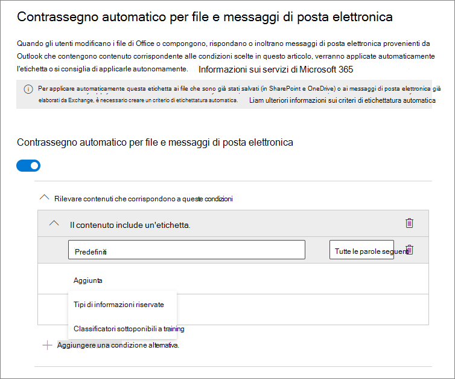
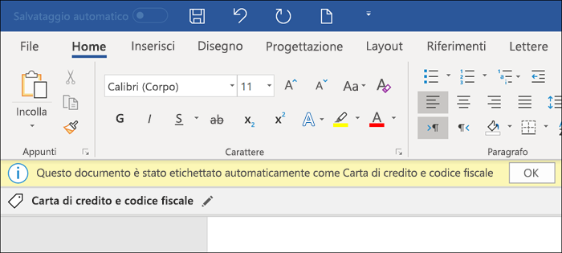
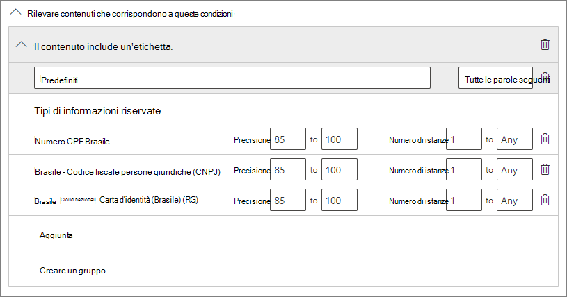
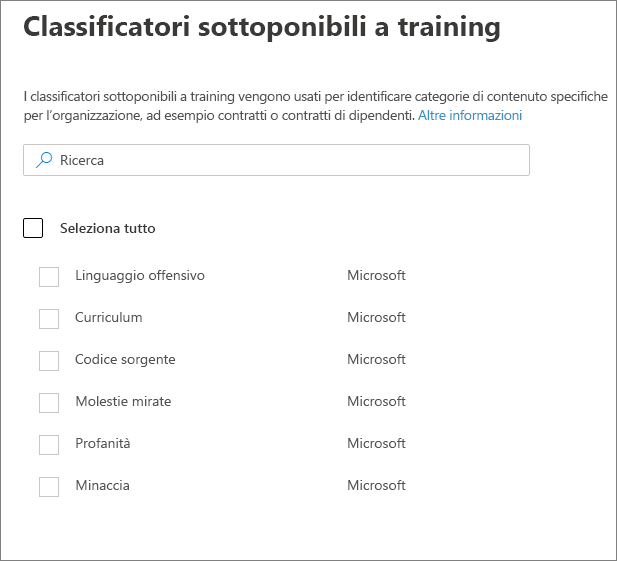
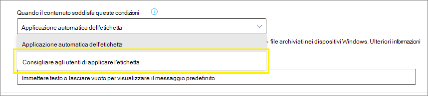
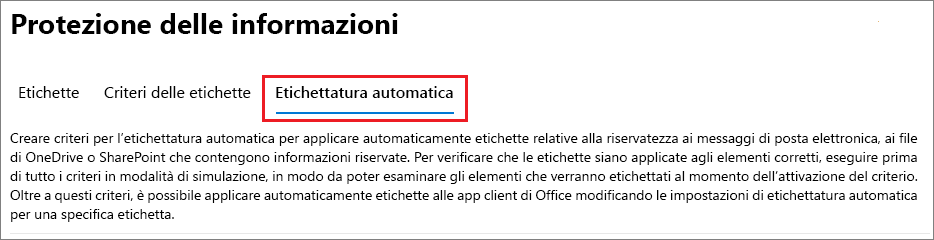

# Applicare automaticamente un'etichetta di riservatezza al contenutoApply a sensitivity label to content automatically

>*[Indicazioni per l'assegnazione di licenze di Microsoft 365 per sicurezza e conformità](https://aka.ms/ComplianceSD).**[Microsoft 365 licensing guidance for security & compliance](https://aka.ms/ComplianceSD).*

Quando si crea un'etichetta di riservatezza, è possibile assegnarla automaticamente al contenuto quando soddisfa le condizioni specificate.When you create a sensitivity label, you can automatically assign that label to content when it matches conditions that you specify.

La possibilità di applicare automaticamente etichette di riservatezza al contenuto è importante perché:The ability to apply sensitivity labels to content automatically is important because:

- Non è necessario spiegare agli utenti quando usare le singole classificazioni.You don't need to train your users when to use each of your classifications.

- Non è necessario affidarsi solo agli utenti per la classificazione corretta di tutto il contenuto.You don't need to rely on users to classify all content correctly.

- Gli utenti non hanno più bisogno di conoscere i criteri e possono concentrarsi sul loro lavoro.Users no longer need to know about your policies — they can instead focus on their work.

Esistono due metodi diversi per applicare automaticamente un'etichetta di riservatezza:There are two different methods for automatically applying a sensitivity label:

- **Etichettatura lato client quando gli utenti modificano documenti o compongono (e rispondono o inoltrano) messaggi di posta elettronica**: usare un'etichetta configurata per l'applicazione automatica di etichette per le app di Office (Word, Excel, PowerPoint e Outlook).**Client-side labeling when users edit documents or compose (also reply or forward) emails**: Use a label that's configured for auto-labeling for Office apps (Word, Excel, PowerPoint, and Outlook). 
    
    Questo metodo supporta la raccomandazione di un'etichetta agli utenti, nonché l'applicazione automatica di un'etichetta.This method supports recommending a label to users, as well as automatically applying a label. In entrambi i casi, comunque, l'utente decide se accettarla o rifiutarla, per garantire la corretta etichettatura del contenuto.But in both cases, the user decides whether to accept or reject the label, to help ensure the correct labeling of content. Questa etichettatura lato client ha un ritardo minimo per i documenti perché l'etichetta può essere applicata anche prima di salvare il documento.This client-side labeling has minimal delay for documents because the label can be applied even before the document is saved. Tuttavia, non tutte le app client supportano l'etichettatura automatica.However, not all client apps support auto-labeling. Questa funzionalità è supportata dal client di etichettatura unificata di Azure Information Protection e da [alcune versioni di Office](sensitivity-labels-office-apps.md#support-for-sensitivity-label-capabilities-in-apps).This capability is supported by the Azure Information Protection unified labeling client, and [some versions of Office](sensitivity-labels-office-apps.md#support-for-sensitivity-label-capabilities-in-apps). 
    
    Per le istruzioni di configurazione, vedere [Come configurare l'applicazione automatica di etichette per le app di Office](#how-to-configure-auto-labeling-for-office-apps) in questa pagina.For configuration instructions, see [How to configure auto-labeling for Office apps](#how-to-configure-auto-labeling-for-office-apps) on this page.

- **Etichettatura lato servizio quando il contenuto è già salvato (in SharePoint Online o OneDrive for Business) o inviato tramite posta elettronica (elaborato da Exchange Online)**: usare un criterio di applicazione automatica di etichette, attualmente in anteprima.**Service-side labeling when content is already saved (in SharePoint Online or OneDrive for Business) or emailed (processed by Exchange Online)**: Use an auto-labeling policy—currently in preview. 
    
    > [!NOTE]
    > Vedere l'[annuncio dell'anteprima pubblica della classificazione automatica con etichette di riservatezza nei servizi Microsoft 365](https://techcommunity.microsoft.com/t5/security-privacy-and-compliance/announcing-public-preview-of-auto-classification-with/ba-p/1279961).See the preview announcement, [Announcing public preview of auto classification with sensitivity labels in Microsoft 365 services](https://techcommunity.microsoft.com/t5/security-privacy-and-compliance/announcing-public-preview-of-auto-classification-with/ba-p/1279961).
    
    Questo metodo è denominato classificazione automatica con etichette di riservatezza.This method is referred to as auto classification with sensitivity labels. Potrebbe essere indicato anche come applicazione automatica di etichette per i dati inattivi (documenti in SharePoint e OneDrive) e per i dati in transito (messaggi di posta elettronica inviati o ricevuti da Exchange).You might also hear it referred to as auto-labeling for data at rest (documents in SharePoint and OneDrive) and data in transit (email that is sent or received by Exchange). Per Exchange, non include i messaggi di posta elettronica inattivi (cassette postali).For Exchange, it doesn't include emails at rest (mailboxes). 
    
    Dato che questa etichettatura viene applicata dai servizi e non dalle applicazioni, non è necessario preoccuparsi delle app e delle versioni usate dagli utenti.Because this labeling is applied by services rather than by applications, you don't need to worry about what apps users have and what version. Di conseguenza, questa funzionalità è immediatamente disponibile nell'intera organizzazione ed è adatta per l'applicazione di etichette su vasta scala.As a result, this capability is immediately available throughout your organization and suitable for labeling at scale. I criteri di applicazione automatica di etichette non supportano l'applicazione di etichette consigliate perché l'utente non interagisce con il processo di etichettatura.Auto-labeling policies don't support recommended labeling because the user doesn't interact with the labeling process. L'amministratore esegue invece i criteri in modalità di simulazione per garantire la corretta etichettatura del contenuto prima dell'applicazione effettiva dell'etichetta.Instead, the administrator runs the policies in simulation mode to help ensure the correct labeling of content before actually applying the label.
    
    Per istruzioni sulla configurazione, vedere [Come configurare i criteri di applicazione automatica di etichette per SharePoint, OneDrive e Exchange](#how-to-configure-auto-labeling-policies-for-sharepoint-onedrive-and-exchange) in questa pagina.For configuration instructions, see [How to configure auto-labeling policies for SharePoint, OneDrive, and Exchange](#how-to-configure-auto-labeling-policies-for-sharepoint-onedrive-and-exchange) on this page.
    
    Caratteristiche specifiche dell'etichettatura automatica per SharePoint e OneDrive:Specific to auto-labeling for SharePoint and OneDrive:
    - Numero massimo di 25.000 file (Word, PowerPoint o Excel) nel tenant al giornoMaximum number of 25,000 files (Word, PowerPoint, or Excel) in your tenant per day
    - Numero massimo di 10 raccolte siti in tutti i criteriMaximum number of 10 sites collections across all policies
    - Numero massimo di 10 criteri nel tenantMaximum number of 10 policies across your tenant

    Caratteristiche specifiche dell'etichettatura automatica per Exchange:Specific to auto-labeling for Exchange:
    - A differenza dell'etichettatura manuale o dell'etichettatura automatica per le app di Office, negli allegati di Office vengono ricercate anche le condizioni specificate nei criteri di applicazione automatica di etichette.Unlike manual labeling or auto-labeling with Office apps, Office attachments are also scanned for the conditions you specify in your auto-labeling policy. Quando viene rilevata una corrispondenza, viene applicata un'etichetta al messaggio ma non all'allegato.When there is a match, the email is labeled but not the attachment.
    - Se sono presenti regole per il flusso di posta di Exchange o criteri di prevenzione della perdita dei dati che applicano la crittografia IRM: quando il contenuto viene identificato da queste regole o criteri e da un criterio di applicazione automatica di etichette, l'etichetta viene applicata.If you have Exchange mail flow rules or data loss prevention (DLP) policies that apply IRM encryption: When content is identified by these rules or policies and an auto-labeling policy, the label is applied. Se quell'etichetta applica la crittografia, le impostazioni IRM delle regole per il flusso di posta di Exchange o dei criteri di prevenzione della perdita dei dati vengono ignorate.If that label applies encryption, the IRM settings from the Exchange mail flow rules or DLP policies are ignored. Se invece quella etichetta non applica la crittografia, in aggiunta all'etichetta vengono applicate le impostazioni IRM delle regole per il flusso di posta di Exchange o dei criteri di prevenzione della perdita dei dati.However, if that label doesn't apply encryption, the IRM settings from the mail flow rules or DLP policies are applied in addition to the label.
    - I messaggi di posta elettronica con crittografia IRM senza etichetta verranno sostituiti da un'etichetta con qualsiasi impostazione di crittografia se esiste una corrispondenza usando l'etichettatura automatica.Email that has IRM encryption with no label will be replaced by a label with any encryption settings when there is a match by using auto-labeling.
    - La posta in arrivo viene etichettata quando esiste una corrispondenza con le condizioni di etichettatura automatica.Incoming email is labeled when there is a match with your auto-labeling conditions. Tuttavia, se l'etichetta è configurata per la crittografia, la crittografia non viene applicata.However, if the label is configured for encryption, that encryption isn't applied.
    

## Confronto tra l'applicazione automatica di etichette per la app di Office e i criteri di applicazione automatica di etichetteCompare auto-labeling for Office apps with auto-labeling policies

Nella tabella seguente sono riportate le differenze di comportamento tra i due metodi complementari di etichettatura automatica:Use the following table to help you identify the differences in behavior for the two complementary automatic labeling methods:

|Funzionalità o comportamentoFeature or behavior|Impostazione di etichettatura: Applicazione di etichette automatica per le app di OfficeLabel setting: Auto-labeling for Office apps |Criterio: Etichettatura automaticaPolicy: Auto-labeling|
|:-----|:-----|:-----|:-----|
|Dipendenza dall'appApp dependency|[SìYes](sensitivity-labels-office-apps.md#support-for-sensitivity-label-capabilities-in-apps) |NoNo |
|Limitazione in base alla posizioneRestrict by location|NoNo |SìYes |
|Condizioni: Classificatori sottoponibili a trainingConditions: Trainable classifers|Sì (anteprima limitata)Yes (limited preview) |NoNo |
|Condizioni: Opzioni di condivisione e opzioni aggiuntive per la posta elettronicaConditions: Sharing options and additional options for email|NoNo |SìYes |
|Consigli, suggerimento criteri e criteri ignorati dagli utentiRecommendations, policy tooltip, and user overrides|SìYes |NoNo |
|Modalità di simulazioneSimulation mode|NoNo |SìYes |
|Verifica delle condizioni negli allegati di ExchangeExchange attachments checked for conditions|NoNo | SìYes|
|Applicazione di contrassegni visiviApply visual markings |SìYes |Sì (solo posta elettronica)Yes (email only) |
|Override della crittografia IRM applicata senza etichettaOverride IRM encryption applied without a label|Sì, se l'utente dispone del diritto minimo di utilizzo per l'esportazioneYes if the user has the minimum usage right of Export |Sì (solo posta elettronica)Yes (email only) |
|Etichettatura della posta in arrivoLabel incoming email|NoNo |Sì (crittografia non applicata)Yes (encryption not applied) |

> [!NOTE]
> Quando il contenuto è stato etichettato manualmente, quell'etichetta non verrà mai sostituita dall'etichettatura automatica.When content has been manually labeled, that label will never be replaced by automatic labeling. I criteri di applicazione automatica di etichette, però, possono sostituire un'[etichetta con priorità inferiore](sensitivity-labels.md#label-priority-order-matters) che è stata applicata con l'applicazione automatica di etichette per le app di Office.However, auto-labeling policies can replace a [lower priority label](sensitivity-labels.md#label-priority-order-matters) that was applied by using auto-labeling for Office apps.

## Modalità di valutazione di più condizioni quando si applicano a più etichetteHow multiple conditions are evaluated when they apply to more than one label

Le etichette sono ordinate per la valutazione in base alla posizione specificata nei criteri: la prima etichetta ha la posizione più bassa (meno riservata) mentre l'ultima etichetta ha la posizione più alta (più riservata). Per altre informazioni sulla priorità, vedere [Priorità dell’etichetta (l’ordine è importante)](sensitivity-labels.md#label-priority-order-matters).The labels are ordered for evaluation according to their position that you specify in the policy: The label positioned first has the lowest position (least sensitive) and the label positioned last has the highest position (most sensitive). For more information on priority, see [Label priority (order matters)](sensitivity-labels.md#label-priority-order-matters).

## Non configurare un'etichetta padre in modo che venga applicata automaticamente o consigliataDon't configure a parent label to be applied automatically or recommended

Tenere presente che non è possibile applicare al contenuto un'etichetta padre (un'etichetta con sottoetichette).Remember, you can't apply a parent label (a label with sublabels) to content. Assicurarsi di non configurare un'etichetta padre in modo che venga applicata automaticamente o consigliata perché le etichette padre non vengono applicate al contenuto in app di Office che usano con il client di assegnazione delle etichette unificato Azure Information Protection.Make sure that you don't configure a parent label to be auto-applied or recommended, because the parent label won't be applied to content in Office apps that use the Azure Information Protection unified labeling client. Per ulteriori informazioni sulle etichette padre e sulle sottoetichette, vedere [Sottoetichette (raggruppamento etichette)](sensitivity-labels.md#sublabels-grouping-labels).For more information on parent labels and sublabels, see [Sublabels (grouping labels)](sensitivity-labels.md#sublabels-grouping-labels).

## Come configurare l'applicazione automatica di etichette per le app OfficeHow to configure auto-labeling for Office apps

L'assegnazione automatica di etichette nelle app Office per Windows è supportata dal client di etichettatura unificata di Azure Information Protection.Automatic labeling in Office apps for Windows is supported by the Azure Information Protection unified labeling client. Per l'etichettatura predefinita nelle app Office, questa funzionalità è disponibile [in versione di anteprima per alcune app](sensitivity-labels-office-apps.md#support-for-sensitivity-label-capabilities-in-apps).For built-in labeling in Office apps, this capability is [in preview for some apps](sensitivity-labels-office-apps.md#support-for-sensitivity-label-capabilities-in-apps).

Le impostazioni di assegnazione automatica di etichette per le app Office sono disponibili quando si [crea o modifica un'etichetta di riservatezza](create-sensitivity-labels.md):The auto-labeling settings for Office apps are available when you [create or edit a sensitivity label](create-sensitivity-labels.md):

È possibile scegliere di applicare automaticamente le etichette di riservatezza ai contenuti che includono specifici tipi di informazioni sensibili.You can choose to apply sensitivity labels to content automatically when that content contains specific types of sensitive information. Scegliere da un elenco di tipi di informazioni sensibili o classificatori:Choose from a list of sensitive info types or classifers:

> [!NOTE]
> Attualmente, l'opzione per **Classificatori** è in anteprima limitata ed è necessario inviare un modulo a Microsoft per abilitare questa funzionalità per il tenant.Currently, the option for **Classifers** is in limited preview and requires you to submit a form to Microsoft to enable this capability for your tenant. Per ulteriori informazioni, vedere il post di blog [Annuncio dell'assegnazione automatica di etichette nelle app Office tramite i classificatori predefiniti - Anteprima limitata](https://techcommunity.microsoft.com/t5/security-privacy-and-compliance/announcing-automatic-labeling-in-office-apps-using-built-in/ba-p/1192889).For more information, see the blog post [Announcing automatic labeling in Office Apps using built-in classifiers - Limited Preview](https://techcommunity.microsoft.com/t5/security-privacy-and-compliance/announcing-automatic-labeling-in-office-apps-using-built-in/ba-p/1192889).

Quando questa etichetta di riservatezza viene applicata automaticamente, l'utente riceve una notifica nella propria app Office.When this sensitivity label is automatically applied, the user sees a notification in their Office app. Ad esempio:For example:

### Configurazione dei tipi di informazioni sensibili per un'etichettaConfiguring sensitive info types for a label

Quando si seleziona l'opzione **Tipi di informazioni sensibili**, viene visualizzato lo stesso elenco di tipi di informazioni sensibili mostrato durante la creazione di un criterio di prevenzione della perdita dei dati (DLP).When you select the **Sensitive info types** option, you see the same list of sensitive information types as when you create a data loss prevention (DLP) policy. Ad esempio, è possibile applicare automaticamente un'etichetta Estremamente riservato a qualsiasi contenuto che include informazioni personali (PII) dei clienti, ad esempio numeri di carte di credito o codici fiscali:So you can, for example, automatically apply a Highly Confidential label to any content that contains customers' personally identifiable information (PII), such as credit card numbers or social security numbers:

Dopo aver selezionato i tipi di informazioni sensibili, è possibile definire la condizione modificando il numero di istanze o l'accuratezza della corrispondenza.After you select your sensitive information types, you can refine your condition by changing the instance count or match accuracy. Per altre informazioni su queste opzioni, vedere [Ottimizzazione delle regole affinché siano più facili o difficili da soddisfare](data-loss-prevention-policies.md#tuning-rules-to-make-them-easier-or-harder-to-match).For more information, see [Tuning rules to make them easier or harder to match](data-loss-prevention-policies.md#tuning-rules-to-make-them-easier-or-harder-to-match).

Inoltre, è possibile scegliere se una condizione deve rilevare tutti i tipi di informazioni riservate o solo uno.Further, you can choose whether a condition must detect all sensitive information types, or just one of them. Per rendere le condizioni più flessibili o complesse, è possibile aggiungere gruppi e usare operatori logici tra i gruppi.And to make your conditions more flexible or complex, you can add groups and use logical operators between the groups. Per altre informazioni, vedere [Raggruppamento e operatori logici](data-loss-prevention-policies.md#grouping-and-logical-operators).For more information, see [Grouping and logical operators](data-loss-prevention-policies.md#grouping-and-logical-operators).

### Configurazione di classificatori per un'etichettaConfiguring classifers for a label

Selezionando l'opzione **Classificatori**, scegliere uno o più classificatori predefiniti:When you select the **Classifers** option, select one or more of the built-in classifiers:

Per ulteriori informazioni su questi classificatori, vedere [Introduzione ai classificatori sottoponibili a training (anteprima)](classifier-getting-started-with.md).For more information about these classifers, see [Getting started with trainable classifiers (preview)](classifier-getting-started-with.md).

Durante il periodo di anteprima, le app seguenti supportano i classificatori per le etichette di riservatezza:During the preview period, the following apps support classifers for sensitivity labels:

- Le applicazioni desktop di Office 365 ProPlus per Windows, da [Office Insider](https://office.com/insider):Office 365 ProPlus desktop apps for Windows, from [Office Insider](https://office.com/insider):
    - WordWord
    - ExcelExcel
    - PowerPointPowerPoint

- Office per le app Web, se le [etichette di riservatezza sono abilitate per i file di Office in SharePoint e OneDrive (anteprima pubblica)](sensitivity-labels-sharepoint-onedrive-files.md):Office for the web apps, when you have [enabled sensitivity labels for Office files in SharePoint and OneDrive (public preview)](sensitivity-labels-sharepoint-onedrive-files.md):
    - WordWord
    - ExcelExcel
    - PowerPointPowerPoint
    - OutlookOutlook

### Consigliare all'utente di applicare un'etichetta di riservatezza nelle app di OfficeRecommend that the user applies a sensitivity label in Office apps

Se si preferisce, è possibile consigliare agli utenti di applicare l'etichetta.If you prefer, you can recommend to your users that they apply the label. Con questa opzione, gli utenti possono accettare la classificazione e le eventuali protezioni associate o ignorare il suggerimento se l'etichetta non è adatta al relativo contenuto.With this option, your users can accept the classification and any associated protection, or dismiss the recommendation if the label isn't suitable for their content.

Ecco un esempio di un avviso del client di etichettatura unificata di Azure Information Protection quando si configura una condizione per applicare un'etichetta come azione consigliata, con un suggerimento per i criteri personalizzati.Here's an example of a prompt from the Azure Information Protection unified labeling client when you configure a condition to apply a label as a recommended action, with a custom policy tip. È possibile scegliere quale testo visualizzare nel suggerimento per i criteri.You can choose what text is displayed in the policy tip.

### Quando vengono applicate le etichette automatiche o consigliate nelle app di OfficeWhen automatic or recommended labels are applied in Office apps

L'implementazione dell'etichettatura automatica e consigliata nelle app di Office varia a seconda se si utilizza l'etichettatura non integrata in Office o il client di etichettatura unificata di Azure Information Protection.The implementation of automatic and recommended labeling in Office apps depend on whether you're using labeling that's built into Office, or the Azure Information Protection unified labeling client. Tuttavia, in entrambi i casi:In both cases, however:

- Non è possibile usare l'assegnazione automatica di etichette per le e-mail e i documenti in precedenza etichettati manualmente o associati automaticamente a un grado maggiore di riservatezza.You can't use automatic labeling for documents and emails that were previously manually labeled, or previously automatically labeled with a higher sensitivity. È possibile applicare una singola etichetta di riservatezza a un documento o una e-mail (oltre a una singola etichetta di conservazione).Remember, you can only apply a single sensitivity label to a document or email (in addition to a single retention label).

- Non è possibile usare l'assegnazione di etichette consigliate per i documenti o i messaggi di posta elettronica etichettati in precedenza con un grado maggiore di riservatezza.You can't use recommended labeling for documents or emails that were previously labeled with a higher sensitivity. Quando il contenuto è già stato etichettato con un grado maggiore di riservatezza, l'utente non visualizzerà l'avviso con il consiglio e il suggerimento per i criteri.When the content's already labeled with a higher sensitivity, the user won't see the prompt with the recommendation and policy tip.

Caratteristiche specifiche dell'etichettatura predefinita:Specific to built-in labeling:

- Non tutte le app di Office supportano l'etichettatura automatica (e consigliata).Not all Office apps support automatic (and recommended) labeling. Per altre informazioni, vedere [Supporto per le funzionalità di riservatezza nelle app](sensitivity-labels-office-apps.md#support-for-sensitivity-label-capabilities-in-apps).For more information, see [Support for sensitivity label capabilities in apps](sensitivity-labels-office-apps.md#support-for-sensitivity-label-capabilities-in-apps).

- Per le etichette consigliate nelle versioni desktop di Word, il contenuto sensibile che ha generato il suggerimento viene contrassegnato in modo che gli utenti possano rivedere e rimuovere tale contenuto anziché applicare l'etichetta di riservatezza consigliata.For recommended labels in the desktop versions of Word, the sensitive content that triggered the recommendation is flagged so that users can review and remove the sensitive content instead of applying the recommended sensitivity label.

- Per informazioni su come vengono applicate tali etichette nelle app di Office, screenshot di esempio e dettagli su come vengono rilevate le informazioni sensibili, vedere [Applicare automaticamente o consigliare l'applicazione di etichette di riservatezza ai file e ai messaggi di posta elettronica in Office](https://support.office.com/en-us/article/automatically-apply-or-recommend-sensitivity-labels-to-your-files-and-emails-in-office-622e0d9c-f38c-470a-bcdb-9e90b24d71a1).For details about how these labels are applied in Office apps, example screenshots, and how sensitive information is detected, see [Automatically apply or recommend sensitivity labels to your files and emails in Office](https://support.office.com/en-us/article/automatically-apply-or-recommend-sensitivity-labels-to-your-files-and-emails-in-office-622e0d9c-f38c-470a-bcdb-9e90b24d71a1).

Caratteristiche specifiche del client di etichettatura unificata di Azure Information Protection:Specific to the Azure Information Protection unified labeling client:

-  L'assegnazione automatica e consigliata delle etichette si applica a Word, Excel e PowerPoint al salvataggio dei documenti e in Outlook all'invio di messaggi di posta elettronica.Automatic and recommended labeling applies to Word, Excel, and PowerPoint when you save a document, and to Outlook when you send an email.

- Affinché Outlook sia in grado di supportare l'etichettatura consigliata, è prima necessario configurare un'[impostazione dei criteri avanzata](https://docs.microsoft.com/azure/information-protection/rms-client/clientv2-admin-guide-customizations#enable-recommended-classification-in-outlook).For Outlook to support recommended labeling, you must first configure an [advanced policy setting](https://docs.microsoft.com/azure/information-protection/rms-client/clientv2-admin-guide-customizations#enable-recommended-classification-in-outlook).

- Le informazioni sensibili possono essere rilevate nel corpo del testo nei documenti e nei messaggi di posta elettronica e nelle intestazioni a piè di pagina, ma non nella riga dell'oggetto o negli allegati di posta elettronica.Sensitive information can be detected in the body text in documents and emails, and to headers and footers — but not in the subject line or attachments of email.

## Come configurare i criteri di applicazione automatica di etichette per SharePoint, OneDrive e ExchangeHow to configure auto-labeling policies for SharePoint, OneDrive, and Exchange
> [!NOTE]
> I criteri di applicazione automatica di etichette vengono implementati gradualmente nei tenant in anteprima pubblica e sono soggetti a modifica.Auto-labeling policies are gradually rolling out to tenants in public preview and subject to change.

### Prerequisiti per i criteri di applicazione automatica di etichettePrerequisites for auto-labeling policies

- Per la modalità di simulazione, è necessario attivare il controllo per Office 365.Auditing for Office 365 must be turned on for simulation mode. Se è necessario attivare il controllo o per verificare se è già attivato, vedere [Abilitare o disabilitare la ricerca nei log di controllo di Office 365](turn-audit-log-search-on-or-off.md).If you need to turn on auditing or you're not sure whether auditing is already on, see [Turn Office 365 audit log search on or off](turn-audit-log-search-on-or-off.md).

- Per assegnare un'etichetta automatica ai file in SharePoint e OneDrive:To auto-label files in SharePoint and OneDrive:
    - Sono state [abilitate le etichette di riservatezza per i file di Office in SharePoint e OneDrive (anteprima pubblica)](sensitivity-labels-sharepoint-onedrive-files.md)You have [enabled sensitivity labels for Office files in SharePoint and OneDrive (public preview)](sensitivity-labels-sharepoint-onedrive-files.md).
    - Nel momento in cui vengono eseguiti i criteri di applicazione automatica di etichette, il file non deve essere aperto da un altro processo o utente.At the time the auto-labeling policy runs, the file mustn't be open by another process or user.

- Se si prevede di usare [tipi di informazioni sensibili personalizzati](custom-sensitive-info-types.md) anziché quelli predefiniti:If you plan to use [custom sensitive information types](custom-sensitive-info-types.md) rather than the built-in sensitivity types: 
    - I tipi di informazioni sensibili personalizzati vengono valutati in base a contenuti creati dopo il salvataggio di tali tipi.Custom sensitivity information types are evaluated for content that is created after the custom sensitivity information types are saved. 
    - Per testare nuovi tipi di informazioni sensibili personalizzati, crearli prima di creare i criteri di applicazione automatica di etichette e quindi creare nuovi documenti con i dati di esempio per il test.To test new custom sensitive information types, create them before you create your auto-labeling policy, and then create new documents with sample data for testing.

- Una o più etichette di riservatezza [create e pubblicate](create-sensitivity-labels.md) (per almeno un utente) che è possibile selezionare per i criteri di applicazione automatica di etichette.One or more sensitivity labels [created and published](create-sensitivity-labels.md) (to at least one user) that you can select for your auto-labeling policy. Per queste etichette:For these labels:
    - Non è rilevante se l'opzione di etichettatura automatica nelle app di Office sia attivata o disattivata perché, come spiegato nell'introduzione, quella impostazione delle etichette integra i criteri di applicazione automatica di etichette.It doesn't matter if the auto-labeling in Office apps label setting is turned on or off, because that label setting supplements auto-labeling policies, as explained in the introduction. 
    - Se le etichette che si vogliono usare per l'applicazione automatica di etichette sono configurate per l'uso di contrassegni visivi (intestazioni, piè di pagina e filigrane), tenere presente che non questi non vengono applicati ai documenti.If the labels you want to use for auto-labeling are configured to use visual markings (headers, footers, watermarks), note that these are not applied to documents.

### Informazioni sulla modalità di simulazioneLearn about simulation mode

La modalità di simulazione è specifica dei criteri di applicazione automatica di etichette ed è integrata nel flusso di lavoro.Simulation mode is unique to auto-labeling policies and woven into the workflow. Non è possibile applicare automaticamente etichette ai documenti e ai messaggi di posta elettronica prima che il criterio abbia eseguito almeno una simulazione.You can't automatically label documents and emails until your policy has run at least one simulation.

Flusso di lavoro per un criterio di applicazione automatica di etichette:Workflow for an auto-labeling policy:

1. Creare e configurare un criterio di applicazione automatica di etichetteCreate and configure an auto-labeling policy

2. Eseguire il criterio in modalità di simulazione e attendere almeno 24 oreRun the policy in simulation mode and wait at least 24 hours

3. Rivedere i risultati e, se necessario, perfezionare il criterio, eseguirlo nuovamente in modalità di simulazione e attendere almeno 24 ore.Review the results, and if necessary, refine your policy, rerun simulation mode and wait at least 24 hours

4. Ripetere il passaggio 3 in base alle esigenze.Repeat step 3 as needed

5. Distribuire in produzioneDeploy in production

La distribuzione simulata viene eseguita come il parametro WhatIf per PowerShell.The simulated deployment runs like the WhatIf parameter for PowerShell. Vengono riportati i risultati come se il criterio di applicazione automatica di etichette avesse applicato l'etichetta selezionata, usando le regole definite.You see results reported as if the auto-labeling policy had applied your selected label, using the rules that you defined. È possibile perfezionare le regole, se necessario, ed eseguire di nuovo la simulazione.You can then refine your rules for accuracy if needed, and rerun the simulation. Tuttavia, dato che l'etichettatura automatica per Exchange si applica ai messaggi di posta elettronica inviati e ricevuti e non ai messaggi archiviati nelle cassette postali, i risultati relativi alla posta in una simulazione non saranno coerenti, a meno che non si riesca a inviare e ricevere gli stessi identici messaggi.However, because auto-labeling for Exchange applies to emails that are sent and received, rather than emails stored in mailboxes, don't expect results for email in a simulation to be consistent unless you're able to send and receive the exact same email messages.

La modalità di simulazione consente anche di aumentare gradualmente l'ambito del criterio di applicazione automatica di etichette prima della distribuzione.Simulation mode also lets you gradually increase the scope of your auto-labeling policy before deployment. Ad esempio, è possibile iniziare con una singola posizione, come un sito di SharePoint site, con una singola raccolta documenti.For example, you might start with a single location, such as a SharePoint site, with a single document library. Quindi, con le modifiche iterative, estendere l'ambito a più siti e quindi a un'altra posizione, ad esempio OneDrive.Then, with iterative changes, increase the scope to multiple sites, and then to another location, such as OneDrive.

Infine, è possibile usare la modalità di simulazione per ottenere un'approssimazione del tempo necessario per eseguire il criterio di applicazione automatica di etichette, per agevolare la pianificazione e la programmazione della sua esecuzione senza la modalità di simulazione.Finally, you can use simulation mode to provide an approximation of the time needed to run your auto-labeling policy, to help you plan and schedule when to run it without simulation mode.

### Creazione di un criterio di applicazione automatica di etichetteCreating an auto-labeling policy

1. Nel [Centro conformità Microsoft 365](https://compliance.microsoft.com/) passare alle etichette di riservatezza:In the [Microsoft 365 compliance center](https://compliance.microsoft.com/), navigate to sensitivity labels:
    
    - **Soluzioni** > **Information Protection)****Solutions** > **Information protection**
    
    Se questa opzione non è immediatamente visibile, selezionare prima **Mostra tutto**.If you don't immediately see this option, first select **Show all**.

2. Selezionare la scheda\*\* Etichettatura automatica (anteprima)\*\*:Select the **Auto-labeling (preview)** tab:
    
    

3. Selezionare **+ Crea criterio**.Select **+ Create policy**.

4. Per la pagina **Scegliere le informazioni a cui applicare questa etichetta**: selezionare uno dei modelli, ad esempio **Finanziari** o **Privacy**.For the page **Choose info you want this label applied to**: Select one of the templates, such as **Financial** or **Privacy**. È possibile perfezionare la ricerca usando l'elenco a discesa **Mostra le opzioni per**.You can refine your search by using the **Show options for** dropdown. In alternativa, selezionare **Criterio personalizzato** se i modelli non soddisfano i propri requisiti.Or, select **Custom policy** if the templates don't meet your requirements. Selezionare **Avanti**.Select **Next**.

5. Per la pagina **Assegnare un nome al criterio di applicazione automatica delle etichette**: specificare un nome univoco e, facoltativamente, una descrizione per l'etichetta applicata automaticamente, le posizioni e le condizioni che identificano il contenuto da etichettare.For the page **Name your auto-labeling policy**: Provide a unique name, and optionally a description to help identify the automatically applied label, locations, and conditions that identify the content to label.

6. Per la pagina **Scegliere le posizioni in cui si desidera applicare l'etichetta**: selezionare e specificare le posizioni per Exchange, siti di SharePoint e OneDrive.For the page **Choose locations where you want to apply the label**: Select and specify locations for Exchange, SharePoint sites, and OneDrive. Quindi, scegliere **Avanti**.Then select **Next**.

7. Per la pagina **Definire le impostazioni dei criteri**: mantenere l'impostazione predefinita di **Trova contenuti che includono** per definire le regole che identificano il contenuto da etichettare in tutte le posizioni selezionate.For the **Define policy settings** page: Keep the default of **Find content that contains** to define rules that identify content to label across all your selected locations. Se sono necessarie regole diverse per ogni posizione, selezionare **Impostazioni avanzate**.If you need different rules per location, select **Advanced settings**. Quindi, scegliere **Avanti**.Then select **Next**.
    
    Le regole usano condizioni che includono i tipi di informazioni sensibili e le opzioni di condivisione:The rules use conditions that include sensitive information types and sharing options:
    - Per i tipi di informazioni sensibili, è possibile selezionare tipi predefiniti e personalizzati.For sensitive information types, you can select both built-in and custom sensitive information types.
    - Per le opzioni di condivisione, è possibile scegliere **Solo con persone interne all'organizzazione** o **Con persone esterne all'organizzazione**.For the shared options, you can choose **only with people inside my organization** or **with people outside my organization**.
    
    Se l'unica posizione è **Exchange** o se si seleziona **Impostazioni avanzate**, è possibile selezionare altre condizioni:If your only location is **Exchange**, or if you select **Advanced settings**, there are additional conditions that you can select:
    - L'indirizzo IP del mittente èSender IP address is
    - Il dominio del destinatario èRecipient domain is
    - Il destinatario èRecipient is
    - L'estensione del file allegato èAttachment's file extension is
    - L'allegato è protetto da passwordAttachment is password protected
    - La proprietà del documento èDocument property is
    - Non è stato possibile analizzare il contenuto degli allegati di posta elettronicaAny email attachment's content could not be scanned
    - L'analisi del contenuto degli allegati di posta elettronica non è stata completataAny email attachment's content didn't complete scanning

8. Per la pagina **Configurare le regole per definire quale contenuto etichettare**: selezionare **+ Crea regola** e quindi scegliere **Avanti**.For the **Set up rules to define what content is labeled** page: Select **+ Create rule** and then select **Next**.

9. Nella pagina **Crea regola** assegnare un nome e una definizione alla regola, usando i tipi di informazioni sensibili o l'opzione di condivisione, quindi selezionare **Salva**.On the **Create rule** page, name and define your rule, using sensitive information types or the sharing option, and then select **Save**.
    
    Le opzioni di configurazione per i tipi di informazioni sensibili sono identiche a quelle selezionate per l'applicazione automatica di etichette per le app di Office.The configuration options for sensitive information types are the same as those you select for auto-labeling for Office apps. Per altre informazioni, vedere [Configurazione dei tipi di informazioni sensibili per un'etichetta](#configuring-sensitive-info-types-for-a-label).If you need more information, see [Configuring sensitive info types for a label](#configuring-sensitive-info-types-for-a-label).

10. Tornare alla pagina **Configurare le regole per definire quale contenuto etichettare**: selezionare di nuovo **+ Crea regola** se è necessaria un'altra regola per identificare il contenuto da etichettare, quindi ripetere il passaggio precedente.Back on the **Set up rules to define what content is labeled** page: Select **+ Create rule** again if you need another rule to identify the content to label, and repeat the previous step. Dopo avere definito tutte le regole necessarie e avere verificato che il relativo stato è attivato, scegliere **Avanti**.When you have defined all the rules you need, and confirmed their status is on, select **Next**.

11. Per la pagina **Scegliere un'etichetta da applicare automaticamente**: selezionare **+ Scegli un'etichetta**, selezionare un'etichetta nel riquadro **Choose a sensitivity label**, quindi scegliere **Avanti**.For the **Choose a label to auto-apply** page: Select **+ Choose a label**, select a label from the **Choose a sensitivity label** pane, and then select **Next**.

12. Per la pagina **Scegliere una modalità per il criterio**: selezionare **Eseguire il test** se si vuole eseguire subito il criterio di applicazione automatica di etichette, in modalità di simulazione.For the **Choose a mode for the policy** page: Select **Test it out** if you're ready to run the auto-labeling policy now, in simulation mode. Altrimenti, selezionare **Mantenerla disabilitata**.Otherwise, select **Leave it turned off**. Selezionare **Avanti**.Select **Next**. 

13. Per la pagina **Riepilogo**: esaminare la configurazione del criterio di applicazione automatica di etichette e apportare le modifiche necessarie, quindi completare la procedura guidata.For the **Summary** page: Review the configuration of the your auto-labeling policy and make any changes that needed, and complete the wizard.
    
    Diversamente dall'applicazione automatica di etichette per le app di Office, non è disponibile un'opzione di pubblicazione separata.Unlike auto-labeling for Office apps, there's no separate publish option. Come per le pubblicazione di etichette, tuttavia, la replica del criterio di applicazione automatica di etichette all'interno dell'organizzazione può richiedere fino a 24 ore.However, as with publishing labels, allow up to 24 hours for the auto-labeling policy to replicate throughout your organization.

A questo punto, nella scheda **Etichettatura automatica (anteprima)** della pagina **Protezione delle informazioni**, il criterio di applicazione automatica di etichette è visualizzato nella sezione **Test in corso**.Now on the **Information protection** page, **Auto-labeling (preview)** tab, you see your auto-labeling policy in the **Testing** section. Selezionare il criterio per visualizzare i dettagli della configurazione e dello stato, ad esempio ancora in fase di test o test completamento.Select your policy to see the details of the configuration and status (for example, still testing or test complete). Selezionare la scheda **Elementi corrispondenti** per vedere quali messaggi di posta elettronica o documenti corrispondono alle regole specificate.Select the **Matched items** tab to see which emails or documents matched the rules that you specified.

È possibile modificare direttamente il criterio da questa interfaccia selezionando l'opzione **Modifica** nella parte superiore della pagina.You can modify your policy directly from this interface by selecting the **Edit** option at the top of the page.

Quando si è pronti per eseguire il criterio senza simulazione, selezionare l'opzione **Abilita**.When you're ready to run the policy without simulation, select the **Turn On** option.

Per visualizzare i risultati del criterio di applicazione automatica di etichette è possibile anche usare [Esplora contenuto](data-classification-content-explorer.md) quando si hanno le [autorizzazioni](data-classification-content-explorer.md#permissions) appropriate:You can also see the results of your auto-labeling policy by using [content explorer](data-classification-content-explorer.md) when you have the appropriate [permissions](data-classification-content-explorer.md#permissions):
- **Visualizzatore elenco di Esplora contenuto** consente di vedere l'etichetta di un file ma non il contenuto del file.**Content Explorer List viewer** lets you see a file's label but not the file's contents.
- **Visualizzatore contenuto di Esplora contenuto** consente di vedere il contenuto del file.**Content Explorer Content viewer** lets you see the file's contents.

> [!TIP]
> È anche possibile usare Esplora contenuto per identificare le posizioni in cui sono presenti documenti senza etichetta che contengono informazioni sensibili.You can also use content explorer to identify locations that have unlabeled documents that contain sensitive information. Usando queste informazioni, è possibile aggiungere queste posizioni ai criteri di applicazione automatica di etichette e includere come regole i tipi di informazioni sensibili identificati.Using this information, consider adding these locations to your auto-labeling policy, and include the identified sensitive information types as rules.

