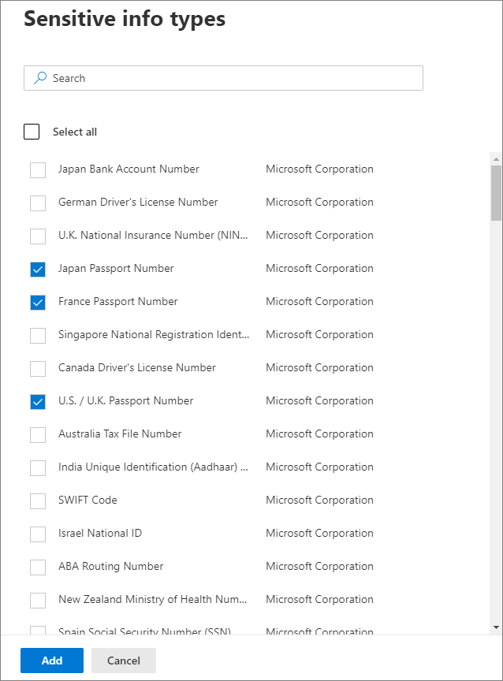

# Applicare automaticamente un'etichetta di riservatezza al contenuto

>*[Indicazioni per l'assegnazione di licenze di Microsoft 365 per sicurezza e conformità](https://aka.ms/ComplianceSD).*

Quando si crea un'etichetta di riservatezza, è possibile assegnarla automaticamente al contenuto quando soddisfa le condizioni specificate.

La possibilità di applicare automaticamente etichette di riservatezza al contenuto è importante perché:

- Non è necessario spiegare agli utenti quando usare le singole classificazioni.

- Non è necessario affidarsi solo agli utenti per la classificazione corretta di tutto il contenuto.

- Gli utenti non hanno più bisogno di conoscere i criteri e possono concentrarsi sul loro lavoro.

Esistono due metodi diversi per applicare automaticamente un'etichetta di riservatezza:

- **Etichettatura lato client quando gli utenti modificano documenti o compongono (e rispondono o inoltrano) messaggi di posta elettronica**: usare un'etichetta configurata per l'applicazione automatica di etichette per le app di Office (Word, Excel, PowerPoint e Outlook). 
    
    Questo metodo supporta la raccomandazione di un'etichetta agli utenti, nonché l'applicazione automatica di un'etichetta. In entrambi i casi, comunque, l'utente decide se accettarla o rifiutarla, per garantire la corretta etichettatura del contenuto. Questa etichettatura lato client ha un ritardo minimo per i documenti perché l'etichetta può essere applicata anche prima di salvare il documento. Tuttavia, non tutte le app client supportano l'etichettatura automatica. Questa funzionalità è supportata dal client di etichettatura unificata di Azure Information Protection e da [alcune versioni di Office](sensitivity-labels-office-apps.md#support-for-sensitivity-label-capabilities-in-apps). 
    
    Per le istruzioni di configurazione, vedere [Come configurare l'applicazione automatica di etichette per le app di Office](#how-to-configure-auto-labeling-for-office-apps) in questa pagina.

- **Etichettatura lato servizio quando il contenuto è già salvato (in SharePoint Online o OneDrive for Business) o inviato tramite posta elettronica (elaborato da Exchange Online)**: usare un criterio di applicazione automatica di etichette, attualmente in anteprima. 
    
    > [!NOTE]
    > Vedere l'[annuncio dell'anteprima pubblica della classificazione automatica con etichette di riservatezza nei servizi Microsoft 365](https://techcommunity.microsoft.com/t5/security-privacy-and-compliance/announcing-public-preview-of-auto-classification-with/ba-p/1279961).
    
    Questo metodo è denominato classificazione automatica con etichette di riservatezza. Potrebbe essere indicato anche come applicazione automatica di etichette per i dati inattivi (documenti in SharePoint e OneDrive) e per i dati in transito (messaggi di posta elettronica inviati o ricevuti da Exchange). Per Exchange, non include i messaggi di posta elettronica inattivi (cassette postali). 
    
    Dato che questa etichettatura viene applicata dai servizi e non dalle applicazioni, non è necessario preoccuparsi delle app e delle versioni usate dagli utenti. Di conseguenza, questa funzionalità è immediatamente disponibile nell'intera organizzazione ed è adatta per l'applicazione di etichette su vasta scala. I criteri di applicazione automatica di etichette non supportano l'applicazione di etichette consigliate perché l'utente non interagisce con il processo di etichettatura. L'amministratore esegue invece i criteri in modalità di simulazione per garantire la corretta etichettatura del contenuto prima dell'applicazione effettiva dell'etichetta.
    
    Per istruzioni sulla configurazione, vedere [Come configurare i criteri di applicazione automatica di etichette per SharePoint, OneDrive e Exchange](#how-to-configure-auto-labeling-policies-for-sharepoint-onedrive-and-exchange) in questa pagina.
    
    Caratteristiche specifiche dell'etichettatura automatica per SharePoint e OneDrive:
    - Massimo 25.000 file etichettati automaticamente (Word, PowerPoint o Excel) nel tenant al giorno
    - Massimo di 10 raccolte siti in tutti i criteri
    - Massimo di 10 criteri nel tenant

    Caratteristiche specifiche dell'etichettatura automatica per Exchange:
    - A differenza dell'etichettatura manuale o dell'etichettatura automatica per le app di Office, negli allegati di Office vengono ricercate anche le condizioni specificate nei criteri di applicazione automatica di etichette. Quando viene rilevata una corrispondenza, viene applicata un'etichetta al messaggio ma non all'allegato.
    - Se sono presenti regole per il flusso di posta di Exchange o criteri di prevenzione della perdita dei dati che applicano la crittografia IRM: quando il contenuto viene identificato da queste regole o criteri e da un criterio di applicazione automatica di etichette, l'etichetta viene applicata. Se quell'etichetta applica la crittografia, le impostazioni IRM delle regole per il flusso di posta di Exchange o dei criteri di prevenzione della perdita dei dati vengono ignorate. Se invece quella etichetta non applica la crittografia, in aggiunta all'etichetta vengono applicate le impostazioni IRM delle regole per il flusso di posta di Exchange o dei criteri di prevenzione della perdita dei dati.
    - I messaggi di posta elettronica con crittografia IRM senza etichetta verranno sostituiti da un'etichetta con qualsiasi impostazione di crittografia se esiste una corrispondenza usando l'etichettatura automatica.
    - La posta in arrivo viene etichettata quando esiste una corrispondenza con le condizioni di etichettatura automatica. Tuttavia, se l'etichetta è configurata per la crittografia, la crittografia non viene applicata.
    

## Confronto tra l'applicazione automatica di etichette per le app di Office e i criteri di applicazione automatica di etichette

Nella tabella seguente sono riportate le differenze di comportamento tra i due metodi complementari di etichettatura automatica:

|Funzionalità o comportamento|Impostazione di etichettatura: Applicazione di etichette automatica per le app di Office |Criterio: Etichettatura automatica|
|:-----|:-----|:-----|:-----|
|Dipendenza dall'app|[Sì](sensitivity-labels-office-apps.md#support-for-sensitivity-label-capabilities-in-apps) |No |
|Limitazione in base alla posizione|No |Sì |
|Condizioni: Classificatori sottoponibili a training|Sì (anteprima limitata) |No |
|Condizioni: Opzioni di condivisione e opzioni aggiuntive per la posta elettronica|No |Sì |
|Consigli, suggerimento criteri e criteri ignorati dagli utenti|Sì |No |
|Modalità di simulazione|No |Sì |
|Verifica delle condizioni negli allegati di Exchange|No | Sì|
|Applicazione di contrassegni visivi |Sì |Sì (solo posta elettronica) |
|Override della crittografia IRM applicata senza etichetta|Sì, se l'utente dispone del diritto minimo di utilizzo per l'esportazione |Sì (solo posta elettronica) |
|Etichettatura della posta in arrivo|No |Sì (crittografia non applicata) |

> [!NOTE]
> Quando il contenuto è stato etichettato manualmente, quell'etichetta non verrà mai sostituita dall'etichettatura automatica. I criteri di applicazione automatica di etichette, però, possono sostituire un'[etichetta con priorità inferiore](sensitivity-labels.md#label-priority-order-matters) che è stata applicata con l'applicazione automatica di etichette per le app di Office.

## Modalità di valutazione di più condizioni quando si applicano a più etichette

Le etichette sono ordinate per la valutazione in base alla posizione specificata nei criteri: la prima etichetta ha la posizione più bassa (meno riservata) mentre l'ultima etichetta ha la posizione più alta (più riservata). Per altre informazioni sulla priorità, vedere [Priorità dell’etichetta (l’ordine è importante)](sensitivity-labels.md#label-priority-order-matters).

## Non configurare un'etichetta padre in modo che venga applicata automaticamente o consigliata

Tenere presente che non è possibile applicare al contenuto un'etichetta padre (un'etichetta con sottoetichette). Verificare che non sia stata configurata un'etichetta padre per essere applicata automaticamente o consigliata nelle app di Office e non selezionare un'etichetta padre per un criterio di applicazione automatica di etichette, altrimenti l'etichetta padre non verrà applicata al contenuto.

Per usare l'etichettatura automatica con le sottoetichette, assicurarsi di pubblicare sia l'etichetta padre che la sottoetichetta.

Per ulteriori informazioni sulle etichette padre e sulle sottoetichette, vedere [Sottoetichette (raggruppamento etichette)](sensitivity-labels.md#sublabels-grouping-labels).

## Come configurare l'applicazione automatica di etichette per le app di Office

L'assegnazione automatica di etichette nelle app Office per Windows è supportata dal client di etichettatura unificata di Azure Information Protection. Per l'etichettatura predefinita nelle app Office, questa funzionalità è disponibile [in versione di anteprima per alcune app](sensitivity-labels-office-apps.md#support-for-sensitivity-label-capabilities-in-apps).

Le impostazioni di assegnazione automatica di etichette per le app Office sono disponibili quando si [crea o modifica un'etichetta di riservatezza](create-sensitivity-labels.md):

È possibile scegliere di applicare automaticamente le etichette di riservatezza ai contenuti che includono specifici tipi di informazioni sensibili. Scegliere da un elenco di tipi di informazioni sensibili o classificatori:

> [!NOTE]
> Attualmente, l'opzione per **Classificatori** è in anteprima limitata ed è necessario inviare un modulo a Microsoft per abilitare questa funzionalità per il tenant. Per ulteriori informazioni, vedere il post di blog [Annuncio dell'assegnazione automatica di etichette nelle app Office tramite i classificatori predefiniti - Anteprima limitata](https://techcommunity.microsoft.com/t5/security-privacy-and-compliance/announcing-automatic-labeling-in-office-apps-using-built-in/ba-p/1192889).

Quando questa etichetta di riservatezza viene applicata automaticamente, l'utente riceve una notifica nella propria app Office. Ad esempio:

### Configurazione dei tipi di informazioni sensibili per un'etichetta

Quando si seleziona l'opzione **Tipi di informazioni sensibili**, viene visualizzato lo stesso elenco di tipi di informazioni sensibili mostrato durante la creazione di un criterio di prevenzione della perdita dei dati (DLP). Ad esempio, è possibile applicare automaticamente un'etichetta Estremamente riservato a qualsiasi contenuto che include informazioni personali (PII) dei clienti, ad esempio numeri di carte di credito o codici fiscali:

Dopo aver selezionato i tipi di informazioni sensibili, è possibile definire la condizione modificando il numero di istanze o l'accuratezza della corrispondenza. Per altre informazioni su queste opzioni, vedere [Ottimizzazione delle regole affinché siano più facili o difficili da soddisfare](data-loss-prevention-policies.md#tuning-rules-to-make-them-easier-or-harder-to-match).

Inoltre, è possibile scegliere se una condizione deve rilevare tutti i tipi di informazioni riservate o solo uno. Per rendere le condizioni più flessibili o complesse, è possibile aggiungere gruppi e usare operatori logici tra i gruppi. Per altre informazioni, vedere [Raggruppamento e operatori logici](data-loss-prevention-policies.md#grouping-and-logical-operators).

### Configurazione di classificatori per un'etichetta

Selezionando l'opzione **Classificatori**, scegliere uno o più classificatori predefiniti:

Per ulteriori informazioni su questi classificatori, vedere [Introduzione ai classificatori sottoponibili a training (anteprima)](classifier-getting-started-with.md).

Durante il periodo di anteprima, le app seguenti supportano i classificatori per le etichette di riservatezza:

- App desktop per Windows di Microsoft365 Apps for enterprise, da [Office Insider](https://office.com/insider):
    - Word
    - Excel
    - PowerPoint

- Office per le app Web, se le [etichette di riservatezza sono abilitate per i file di Office in SharePoint e OneDrive (anteprima pubblica)](sensitivity-labels-sharepoint-onedrive-files.md):
    - Word
    - Excel
    - PowerPoint
    - Outlook

### Consigliare all'utente di applicare un'etichetta di riservatezza

Se si preferisce, è possibile consigliare agli utenti di applicare l'etichetta. Con questa opzione, gli utenti possono accettare la classificazione e le eventuali protezioni associate o ignorare il suggerimento se l'etichetta non è adatta al relativo contenuto.

Ecco un esempio di un avviso del client di etichettatura unificata di Azure Information Protection quando si configura una condizione per applicare un'etichetta come azione consigliata, con un suggerimento per i criteri personalizzati. È possibile scegliere quale testo visualizzare nel suggerimento per i criteri.

### Quando vengono applicate le etichette automatiche o consigliate

L'implementazione dell'etichettatura automatica e consigliata nelle app di Office varia a seconda se si utilizza l'etichettatura non integrata in Office o il client di etichettatura unificata di Azure Information Protection. Tuttavia, in entrambi i casi:

- Non è possibile usare l'assegnazione automatica di etichette per le e-mail e i documenti in precedenza etichettati manualmente o associati automaticamente a un grado maggiore di riservatezza. È possibile applicare una singola etichetta di riservatezza a un documento o una e-mail (oltre a una singola etichetta di conservazione).

- Non è possibile usare l'assegnazione di etichette consigliate per i documenti o i messaggi di posta elettronica etichettati in precedenza con un grado maggiore di riservatezza. Quando il contenuto è già stato etichettato con un grado maggiore di riservatezza, l'utente non visualizzerà l'avviso con il consiglio e il suggerimento per i criteri.

Caratteristiche specifiche dell'etichettatura predefinita:

- Non tutte le app di Office supportano l'etichettatura automatica (e consigliata). Per altre informazioni, vedere [Supporto per le funzionalità di riservatezza nelle app](sensitivity-labels-office-apps.md#support-for-sensitivity-label-capabilities-in-apps).

- Per le etichette consigliate nelle versioni desktop di Word, il contenuto sensibile che ha generato il suggerimento viene contrassegnato in modo che gli utenti possano rivedere e rimuovere tale contenuto anziché applicare l'etichetta di riservatezza consigliata.

- Per informazioni su come vengono applicate tali etichette nelle app di Office, screenshot di esempio e dettagli su come vengono rilevate le informazioni sensibili, vedere [Applicare automaticamente o consigliare l'applicazione di etichette di riservatezza ai file e ai messaggi di posta elettronica in Office](https://support.office.com/en-us/article/automatically-apply-or-recommend-sensitivity-labels-to-your-files-and-emails-in-office-622e0d9c-f38c-470a-bcdb-9e90b24d71a1).

Caratteristiche specifiche del client di etichettatura unificata di Azure Information Protection:

-  L'assegnazione automatica e consigliata delle etichette si applica a Word, Excel e PowerPoint al salvataggio dei documenti e in Outlook all'invio di messaggi di posta elettronica.

- Affinché Outlook sia in grado di supportare l'etichettatura consigliata, è prima necessario configurare un'[impostazione dei criteri avanzata](https://docs.microsoft.com/azure/information-protection/rms-client/clientv2-admin-guide-customizations#enable-recommended-classification-in-outlook).

- Le informazioni sensibili possono essere rilevate nel corpo del testo nei documenti e nei messaggi di posta elettronica e nelle intestazioni a piè di pagina, ma non nella riga dell'oggetto o negli allegati di posta elettronica.

## Come configurare i criteri di applicazione automatica di etichette per SharePoint, OneDrive e Exchange
> [!NOTE]
> I criteri di applicazione automatica di etichette vengono implementati gradualmente nei tenant in anteprima pubblica e sono soggetti a modifica.

### Prerequisiti per i criteri di applicazione automatica di etichette

- Per la modalità di simulazione, è necessario attivare il controllo per Microsoft 365. Se è necessario attivare il controllo o per verificare se è già attivato, vedere [Abilitare o disabilitare la ricerca nei log di controllo](turn-audit-log-search-on-or-off.md).

- Per assegnare un'etichetta automatica ai file in SharePoint e OneDrive:
    - Sono state [abilitate le etichette di riservatezza per i file di Office in SharePoint e OneDrive (anteprima pubblica)](sensitivity-labels-sharepoint-onedrive-files.md)
    - Nel momento in cui vengono eseguiti i criteri di applicazione automatica di etichette, il file non deve essere aperto da un altro processo o utente.

- Se si prevede di usare [tipi di informazioni sensibili personalizzati](custom-sensitive-info-types.md) anziché quelli predefiniti: 
    - I tipi di informazioni sensibili personalizzati vengono valutati in base a contenuti creati dopo il salvataggio di tali tipi. 
    - Per testare nuovi tipi di informazioni sensibili personalizzati, crearli prima di creare i criteri di applicazione automatica di etichette e quindi creare nuovi documenti con i dati di esempio per il test.

- Una o più etichette di riservatezza [create e pubblicate](create-sensitivity-labels.md) (per almeno un utente) che è possibile selezionare per i criteri di applicazione automatica di etichette. Per queste etichette:
    - Non è rilevante se l'opzione di etichettatura automatica nelle app di Office sia attivata o disattivata perché, come spiegato nell'introduzione, quella impostazione delle etichette integra i criteri di applicazione automatica di etichette. 
    - Se le etichette che si vogliono usare per l'applicazione automatica di etichette sono configurate per l'uso di contrassegni visivi (intestazioni, piè di pagina e filigrane), tenere presente che non questi non vengono applicati ai documenti.
    - Se le etichette applicano la crittografia, devono essere configurate per **Assegnare le autorizzazioni ora**.

### Informazioni sulla modalità di simulazione

La modalità di simulazione è specifica dei criteri di applicazione automatica di etichette ed è integrata nel flusso di lavoro. Non è possibile applicare automaticamente etichette ai documenti e ai messaggi di posta elettronica prima che il criterio abbia eseguito almeno una simulazione.

Flusso di lavoro per un criterio di applicazione automatica di etichette:

1. Creare e configurare un criterio di applicazione automatica di etichette

2. Eseguire il criterio in modalità di simulazione e attendere almeno 24 ore

3. Rivedere i risultati e, se necessario, perfezionare il criterio, eseguirlo nuovamente in modalità di simulazione e attendere almeno 24 ore.

4. Ripetere il passaggio 3 in base alle esigenze.

5. Distribuire in produzione

La distribuzione simulata viene eseguita come il parametro WhatIf per PowerShell. Vengono riportati i risultati come se il criterio di applicazione automatica di etichette avesse applicato l'etichetta selezionata, usando le regole definite. È possibile perfezionare le regole, se necessario, ed eseguire di nuovo la simulazione. Tuttavia, dato che l'etichettatura automatica per Exchange si applica ai messaggi di posta elettronica inviati e ricevuti e non ai messaggi archiviati nelle cassette postali, i risultati relativi alla posta in una simulazione non saranno coerenti, a meno che non si riesca a inviare e ricevere gli stessi identici messaggi.

La modalità di simulazione consente anche di aumentare gradualmente l'ambito del criterio di applicazione automatica di etichette prima della distribuzione. Ad esempio, è possibile iniziare con una singola posizione, come un sito di SharePoint site, con una singola raccolta documenti. Quindi, con le modifiche iterative, estendere l'ambito a più siti e quindi a un'altra posizione, ad esempio OneDrive.

Infine, è possibile usare la modalità di simulazione per ottenere un'approssimazione del tempo necessario per eseguire il criterio di applicazione automatica di etichette, per agevolare la pianificazione e la programmazione della sua esecuzione senza la modalità di simulazione.

### Creazione di un criterio di applicazione automatica di etichette

1. Nel [Centro conformità Microsoft 365](https://compliance.microsoft.com/) passare alle etichette di riservatezza:
    
    - **Soluzioni** > **Information Protection)**
    
    Se questa opzione non è immediatamente visibile, selezionare prima **Mostra tutto**.

2. Selezionare la scheda** Etichettatura automatica (anteprima)**:
    
    
    
    Questa nuova scheda è ancora in fase di distribuzione nei tenant. Se viene visualizzata, riprovare tra qualche giorno.

3. Selezionare **+ Crea criterio**.

4. Per la pagina **Scegliere le informazioni a cui applicare questa etichetta**: selezionare uno dei modelli, ad esempio **Finanziari** o **Privacy**. È possibile perfezionare la ricerca usando l'elenco a discesa **Mostra le opzioni per**. In alternativa, selezionare **Criterio personalizzato** se i modelli non soddisfano i propri requisiti. Selezionare **Avanti**.

5. Per la pagina **Assegnare un nome al criterio di applicazione automatica delle etichette**: specificare un nome univoco e, facoltativamente, una descrizione per l'etichetta applicata automaticamente, le posizioni e le condizioni che identificano il contenuto da etichettare.

6. Per la pagina **Scegliere le posizioni in cui si desidera applicare l'etichetta**: selezionare e specificare le posizioni per Exchange, siti di SharePoint e OneDrive. Quindi, scegliere **Avanti**.

7. Per la pagina **Definire le impostazioni dei criteri**: mantenere l'impostazione predefinita di **Trova contenuti che includono** per definire le regole che identificano il contenuto da etichettare in tutte le posizioni selezionate. Se sono necessarie regole diverse per ogni posizione, selezionare **Impostazioni avanzate**. Quindi, scegliere **Avanti**.
    
    Le regole usano condizioni che includono i tipi di informazioni sensibili e le opzioni di condivisione:
    - Per i tipi di informazioni sensibili, è possibile selezionare tipi predefiniti e personalizzati.
    - Per le opzioni di condivisione, è possibile scegliere **Solo con persone interne all'organizzazione** o **Con persone esterne all'organizzazione**.
    
    Se l'unica posizione è **Exchange** o se si seleziona **Impostazioni avanzate**, è possibile selezionare altre condizioni:
    - L'indirizzo IP del mittente è
    - Il dominio del destinatario è
    - Il destinatario è
    - L'estensione del file allegato è
    - L'allegato è protetto da password
    - La proprietà del documento è
    - Non è stato possibile analizzare il contenuto degli allegati di posta elettronica
    - L'analisi del contenuto degli allegati di posta elettronica non è stata completata

8. Per la pagina **Configurare le regole per definire quale contenuto etichettare**: selezionare **+ Crea regola** e quindi scegliere **Avanti**.

9. Nella pagina **Crea regola** assegnare un nome e una definizione alla regola, usando i tipi di informazioni sensibili o l'opzione di condivisione, quindi selezionare **Salva**.
    
    Le opzioni di configurazione per i tipi di informazioni sensibili sono identiche a quelle selezionate per l'applicazione automatica di etichette per le app di Office. Per altre informazioni, vedere [Configurazione dei tipi di informazioni sensibili per un'etichetta](#configuring-sensitive-info-types-for-a-label).

10. Tornare alla pagina **Configurare le regole per definire quale contenuto etichettare**: selezionare di nuovo **+ Crea regola** se è necessaria un'altra regola per identificare il contenuto da etichettare, quindi ripetere il passaggio precedente. Dopo avere definito tutte le regole necessarie e avere verificato che il relativo stato è attivato, scegliere **Avanti**.

11. Per la pagina **Scegliere un'etichetta da applicare automaticamente**: selezionare **+ Scegli un'etichetta**, selezionare un'etichetta nel riquadro **Choose a sensitivity label**, quindi scegliere **Avanti**.

12. Per la pagina **Scegliere una modalità per il criterio**: selezionare **Eseguire il test** se si vuole eseguire subito il criterio di applicazione automatica di etichette, in modalità di simulazione. Altrimenti, selezionare **Mantenerla disabilitata**. Selezionare **Avanti**. 

13. Per la pagina **Riepilogo**: esaminare la configurazione del criterio di applicazione automatica di etichette e apportare le modifiche necessarie, quindi completare la procedura guidata.
    
    Diversamente dall'applicazione automatica di etichette per le app di Office, non è disponibile un'opzione di pubblicazione separata. Come per le pubblicazione di etichette, tuttavia, la replica del criterio di applicazione automatica di etichette all'interno dell'organizzazione può richiedere fino a 24 ore.

A questo punto, nella scheda **Etichettatura automatica (anteprima)** della pagina **Protezione delle informazioni**, il criterio di applicazione automatica di etichette è visualizzato nella sezione **Test in corso**. Selezionare il criterio per visualizzare i dettagli della configurazione e dello stato, ad esempio ancora in fase di test o test completamento. Selezionare la scheda **Elementi corrispondenti** per vedere quali messaggi di posta elettronica o documenti corrispondono alle regole specificate.

È possibile modificare direttamente il criterio da questa interfaccia selezionando l'opzione **Modifica** nella parte superiore della pagina.

Quando si è pronti per eseguire il criterio senza simulazione, selezionare l'opzione **Abilita**.

Per visualizzare i risultati del criterio di applicazione automatica di etichette è possibile anche usare [Esplora contenuto](data-classification-content-explorer.md) quando si hanno le [autorizzazioni](data-classification-content-explorer.md#permissions) appropriate:
- **Visualizzatore elenco di Esplora contenuto** consente di vedere l'etichetta di un file ma non il contenuto del file.
- **Visualizzatore contenuto di Esplora contenuto** consente di vedere il contenuto del file.

> [!TIP]
> È anche possibile usare Esplora contenuto per identificare le posizioni in cui sono presenti documenti senza etichetta che contengono informazioni sensibili. Usando queste informazioni, è possibile aggiungere queste posizioni ai criteri di applicazione automatica di etichette e includere come regole i tipi di informazioni sensibili identificati.

