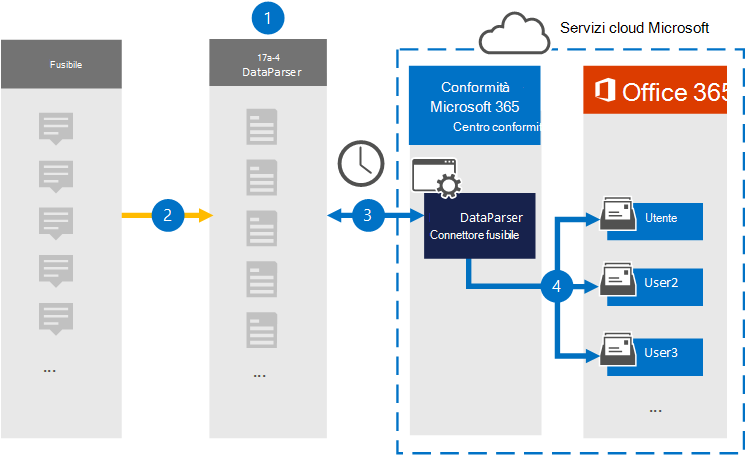

# Configurare un connettore per archiviare i dati fuzeSet up a connector to archive Fuze data

Utilizzare [Fuze DataParser](https://www.17a-4.com/fuze-dataparser/) da 17a-4 LLC per importare e archiviare i dati da Fuze alle cassette postali degli utenti nell'organizzazione Microsoft 365 locale.Use the [Fuze DataParser](https://www.17a-4.com/fuze-dataparser/) from 17a-4 LLC to import and archive data from Fuze to user mailboxes in your Microsoft 365 organization. DataParser include un connettore Fuze configurato per acquisire elementi da un'origine dati di terze parti e importare tali elementi in Microsoft 365.The DataParser includes a Fuze connector that's configured to capture items from a third-party data source and import those items to Microsoft 365. Il connettore Fuze DataParser converte i dati fuze in un formato di messaggio di posta elettronica e quindi importa tali elementi nelle cassette postali degli utenti in Microsoft 365.The Fuze DataParser connector converts Fuze data to an email message format and then imports those items to user mailboxes in Microsoft 365.

Dopo aver archiviato i dati di Fuze nelle cassette postali degli utenti, è possibile applicare funzionalità di conformità Microsoft 365 quali conservazione per controversia legale, eDiscovery, criteri di conservazione ed etichette di conservazione e conformità delle comunicazioni.After Fuze data is stored in user mailboxes, you can apply Microsoft 365 compliance features such as Litigation Hold, eDiscovery, retention policies and retention labels, and communication compliance. L'utilizzo di un connettore Fuze per importare e archiviare i dati in Microsoft 365 può aiutare l'organizzazione a rimanere conforme ai criteri governativi e normativi.Using a Fuze connector to import and archive data in Microsoft 365 can help your organization stay compliant with government and regulatory policies.

## Panoramica dell'archiviazione dei dati fuzeOverview of archiving Fuze data

Nella panoramica seguente viene illustrato il processo di utilizzo di un connettore dati per archiviare i dati di Fuze in Microsoft 365.The following overview explains the process of using a data connector to archive Fuze data in Microsoft 365.

1. L'organizzazione collabora con 17a-4 per configurare Fuze DataParser.Your organization works with 17a-4 to set up and configure the Fuze DataParser.

2. A intervalli regolari, gli elementi Fuze vengono raccolti da DataParser.On a regular basis, Fuze items are collected by the DataParser. DataParser converte anche il contenuto di un messaggio in un formato di messaggio di posta elettronica.The DataParser also converts the content of a message to an email message format.

3. Il connettore Fuze DataParser creato nel Centro conformità Microsoft 365 si connette a DataParser e trasferisce i messaggi in una posizione Archiviazione di Azure sicura nel cloud Microsoft.The Fuze DataParser connector that you create in the Microsoft 365 compliance center connects to DataParser and transfers the messages to a secure Azure Storage location in the Microsoft cloud.

4. Nelle cassette postali degli utenti viene creata una sottocartella nella cartella Posta in arrivo denominata **Fuze DataParser** e gli elementi Fuze vengono importati in tale cartella.A subfolder in the Inbox folder named **Fuze DataParser** is created in the user mailboxes, and the Fuze items are imported to that folder. Il connettore determina in quale cassetta postale importare gli elementi utilizzando il valore della *proprietà Email.*The connector determines which mailbox to import items to by using the value of the *Email* property. Ogni elemento Fuze contiene questa proprietà, che viene popolata con l'indirizzo di posta elettronica di ogni partecipante.Every Fuze item contains this property, which is populated with the email address of every participant.

## Prima di configurare un connettoreBefore you set up a connector

- Creare un account DataParser per i connettori Microsoft.Create a DataParser account for Microsoft connectors. A tale scopo, contattare [17a-4 LLC](https://www.17a-4.com/contact/).To do this, contact [17a-4 LLC](https://www.17a-4.com/contact/). È necessario accedere a questo account quando si crea il connettore nel passaggio 1.You need to sign into this account when you create the connector in Step 1.

- L'utente che crea il connettore Fuze DataParser nel passaggio 1 (e lo completa nel passaggio 3) deve essere assegnato al ruolo Esportazione importazione cassette postali in Exchange Online.The user who creates the Fuze DataParser connector in Step 1 (and completes it in Step 3) must be assigned to the Mailbox Import Export role in Exchange Online. Questo ruolo è necessario per aggiungere connettori nella pagina **Connettori** dati nell'Centro conformità Microsoft 365.This role is required to add connectors on the **Data connectors** page in the Microsoft 365 compliance center. Per impostazione predefinita, questo ruolo non viene assegnato a un gruppo di ruoli in Exchange Online.By default, this role is not assigned to a role group in Exchange Online. È possibile aggiungere il ruolo Esportazione importazione cassette postali al gruppo di ruoli Gestione organizzazione in Exchange Online.You can add the Mailbox Import Export role to the Organization Management role group in Exchange Online. In caso contrario, è possibile creare un gruppo di ruoli, assegnare il ruolo Importazione/Esportazione cassette postali e quindi aggiungere gli utenti appropriati come membri.Or you can create a role group, assign the Mailbox Import Export role, and then add the appropriate users as members. Per ulteriori informazioni, vedere le sezioni [Create role groups](/Exchange/permissions-exo/role-groups#create-role-groups) o Modify role [groups](/Exchange/permissions-exo/role-groups#modify-role-groups) nell'articolo "Manage role groups in Exchange Online".For more information, see the [Create role groups](/Exchange/permissions-exo/role-groups#create-role-groups) or [Modify role groups](/Exchange/permissions-exo/role-groups#modify-role-groups) sections in the article "Manage role groups in Exchange Online".

## Passaggio 1: Configurare un connettore Fuze DataParserStep 1: Set up a Fuze DataParser connector

Il primo passaggio consiste nell'accedere alla pagina Connettori dati nel Centro conformità Microsoft 365 e creare un connettore 17a-4 per i dati fuze.The first step is to access to the Data connectors page in the Microsoft 365 compliance center and create a 17a-4 connector for Fuze data.

1. Passare a <https://compliance.microsoft.com> e quindi fare clic su **Connettori dati**  >  **Fuze DataParser**.Go to <https://compliance.microsoft.com> and then click **Data connectors** > **Fuze DataParser**.

2. Nella pagina **Descrizione prodotto Fuze DataParser** fare clic su **Aggiungi connettore.**On the **Fuze DataParser** product description page, click **Add connector**.

3. Nella pagina **Condizioni di servizio** fare clic su **Accetta.**On the **Terms of service** page, click **Accept**.

4. Immettere un nome univoco che identifichi il connettore e quindi fare clic su **Avanti.**Enter a unique name that identifies the connector and then click **Next**.

5. Accedi al tuo account 17a-4 e completa i passaggi della connessione guidata Fuze DataParser.Sign in to your 17a-4 account and complete the steps in the Fuze DataParser connection wizard.

## Passaggio 2: Configurare il connettore Fuze DataParserStep 2: Configure the Fuze DataParser connector

Utilizzare il supporto 17a-4 per configurare il connettore Fuze DataParser.Work with 17a-4 Support to configure the Fuze DataParser connector.

## Passaggio 3: mappare gli utentiStep 3: Map users

Il connettore Fuze DataParser mappa automaticamente gli utenti ai propri Microsoft 365 di posta elettronica prima di importare i dati Microsoft 365.The Fuze DataParser connector will automatically map users to their Microsoft 365 email addresses before importing data to Microsoft 365.

## Passaggio 4: Monitorare il connettore Fuze DataParserStep 4: Monitor the Fuze DataParser connector

Dopo aver creato un connettore Fuze DataParser, è possibile visualizzare lo stato del connettore nella Centro conformità Microsoft 365.After you create a Fuze DataParser connector, you can view the connector status in the Microsoft 365 compliance center.

1. Vai a <https://compliance.microsoft.com> e fai clic su **Connettori dati** nel riquadro di spostamento sinistro.Go to <https://compliance.microsoft.com> and click **Data connectors** in the left nav.

2. Fare clic **sulla scheda** Connettori e quindi selezionare il connettore Fuze DataParser creato per visualizzare la pagina a comparsa, contenente le proprietà e le informazioni sul connettore.Click the **Connectors** tab and then select the Fuze DataParser connector that you created to display the flyout page, which contains the properties and information about the connector.

3. In **Stato connettore con origine** fare clic sul collegamento Scarica **registro** per aprire (o salvare) il registro di stato per il connettore.Under **Connector status with source**, click the **Download log** link to open (or save) the status log for the connector. Questo registro contiene i dati importati nel cloud Microsoft.This log contains data that has been imported to the Microsoft cloud.

## Problemi notiKnown issues

Al momento non è possibile importare allegati o elementi di dimensioni superiori a 10 MB.At this time, we don't support importing attachments or items that are larger than 10 MB. Il supporto per gli elementi più grandi sarà disponibile in un secondo momento.Support for larger items will be available at a later date.
