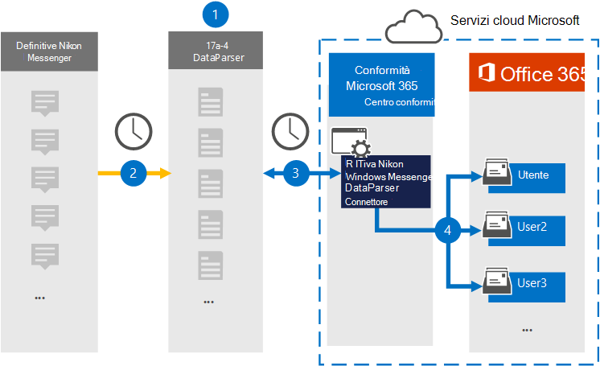

# Configurare un connettore per archiviare i dati refinitiv Eikon Messenger

Utilizzare [Refinitiv Eikon Messenger DataParser](https://www.17a-4.com/refinitiv-messenger-dataparser/) da 17a-4 LLC per importare e archiviare i dati da Refinitiv Eikon Messenger alle cassette postali degli utenti nell'organizzazione di Microsoft 365. DataParser include un connettore Refinitiv Eikon Messenger configurato per acquisire elementi da un'origine dati di terze parti e importare tali elementi in Microsoft 365. Il connettore Refinitiv Eikon Messenger DataParser converte i dati refinitiv Eikon Messenger in un formato di messaggio di posta elettronica e quindi importa tali elementi nelle cassette postali degli utenti in Microsoft 365.

Dopo aver archiviato i dati refinitiv Eikon Messenger nelle cassette postali degli utenti, è possibile applicare funzionalità di conformità Microsoft 365 quali conservazione per controversia legale, eDiscovery, criteri di conservazione ed etichette di conservazione e conformità delle comunicazioni. L'utilizzo di un connettore Refinitiv Eikon Messenger per importare e archiviare i dati in Microsoft 365 può aiutare l'organizzazione a rimanere conforme ai criteri governativi e normativi.

## Panoramica dell'archiviazione dei dati refinitiv Eikon Messenger

Nella panoramica seguente viene illustrato il processo di utilizzo di un connettore dati per archiviare i dati refinitiv Eikon Messenger in Microsoft 365.

1. L'organizzazione collabora con 17a-4 per configurare Refinitiv Eikon Messenger DataParser.

2. Regolarmente, gli elementi refinitiv Eikon Messenger vengono raccolti da DataParser. DataParser converte anche il contenuto di un messaggio in un formato di messaggio di posta elettronica.

3. Il connettore Refinitiv Eikon Messenger DataParser creato nel Centro conformità Microsoft 365 si connette a DataParser e trasferisce i messaggi in una posizione Archiviazione di Azure sicura nel cloud Microsoft.

4. Nelle cassette postali degli utenti viene creata una sottocartella nella cartella Posta in arrivo denominata **Refinitiv Eikon Messenger DataParser** e gli elementi Refinitiv Eikon Messenger vengono importati in tale cartella. Il connettore determina in quale cassetta postale importare gli elementi utilizzando il valore della *proprietà Email.* Ogni elemento Refinitiv Eikon Messenger contiene questa proprietà, che viene popolata con l'indirizzo di posta elettronica di ogni partecipante.

## Prima di configurare un connettore

- Creare un account DataParser per i connettori Microsoft. A tale scopo, contattare [17a-4 LLC](https://www.17a-4.com/contact/). È necessario accedere a questo account quando si crea il connettore nel passaggio 1.

- L'utente che crea il connettore Refinitiv Eikon Messenger DataParser nel passaggio 1 (e lo completa nel passaggio 3) deve essere assegnato al ruolo Esportazione importazione cassette postali in Exchange Online. Questo ruolo è necessario per aggiungere connettori nella pagina **Connettori** dati nell'Centro conformità Microsoft 365. Per impostazione predefinita, questo ruolo non viene assegnato a un gruppo di ruoli in Exchange Online. È possibile aggiungere il ruolo Esportazione importazione cassette postali al gruppo di ruoli Gestione organizzazione in Exchange Online. In caso contrario, è possibile creare un gruppo di ruoli, assegnare il ruolo Importazione/Esportazione cassette postali e quindi aggiungere gli utenti appropriati come membri. Per ulteriori informazioni, vedere le sezioni [Create role groups](/Exchange/permissions-exo/role-groups#create-role-groups) o Modify role [groups](/Exchange/permissions-exo/role-groups#modify-role-groups) nell'articolo "Manage role groups in Exchange Online".

## Passaggio 1: Configurare un connettore Refinitiv Eikon Messenger DataParser

Il primo passaggio consiste nell'accedere alla pagina Connettori dati nel Centro conformità Microsoft 365 e creare un connettore 17a-4 per i dati refinitiv Eikon Messenger.

1. Vai a <https://compliance.microsoft.com> e quindi fai clic su **Connettori dati**  >  **Refinitiv Eikon Messenger DataParser**.

2. Nella pagina **Refinitiv Eikon Messenger DataParser** product description fare clic **su Add connector**.

3. Nella pagina **Condizioni di servizio** fare clic su **Accetta.**

4. Immettere un nome univoco che identifichi il connettore e quindi fare clic su **Avanti.**

5. Accedi al tuo account 17a-4 e completa i passaggi della connessione guidata Refinitiv Eikon Messenger DataParser.

## Passaggio 2: Configurare il connettore Refinitiv Eikon Messenger DataParser

Utilizzare il supporto 17a-4 per configurare il connettore Refinitiv Eikon Messenger DataParser.

## Passaggio 3: mappare gli utenti

Il connettore Refinitiv Eikon Messenger DataParser mappa automaticamente gli utenti ai propri Microsoft 365 di posta elettronica prima di importare i dati in Microsoft 365.

## Passaggio 4: Monitorare il connettore Refinitiv Eikon Messenger DataParser

Dopo aver creato un connettore Refinitiv Eikon Messenger DataParser, è possibile visualizzare lo stato del connettore nel Centro conformità Microsoft 365.

1. Vai a <https://compliance.microsoft.com> e fai clic su **Connettori dati** nel riquadro di spostamento sinistro.

2. Fare **clic** sulla scheda Connettori e quindi selezionare il connettore Refinitiv Eikon Messenger DataParser creato per visualizzare la pagina a comparsa, contenente le proprietà e le informazioni sul connettore.

3. In **Stato connettore con origine** fare clic sul collegamento Scarica **registro** per aprire (o salvare) il registro di stato per il connettore. Questo registro contiene i dati importati nel cloud Microsoft.

## Problemi noti

Al momento non è possibile importare allegati o elementi di dimensioni superiori a 10 MB. Il supporto per gli elementi più grandi sarà disponibile in un secondo momento.
