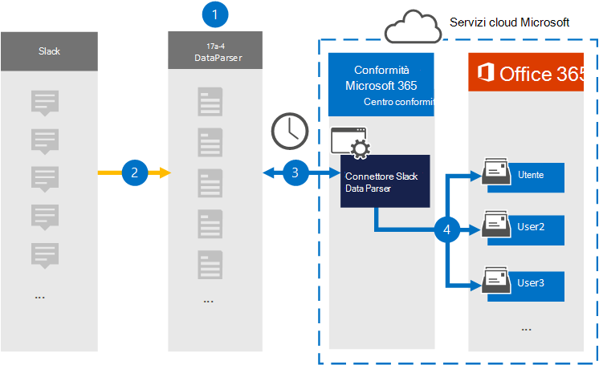

# Configurare un connettore per archiviare i dati di Slack

Utilizzare [DataParser da 17a-4 LLC](https://www.17a-4.com/slack-dataparser/) per importare e archiviare i dati dalla piattaforma Slack alle cassette postali degli utenti nell'Microsoft 365 organizzativa. DataParser include un connettore Slack configurato per acquisire elementi da un'origine dati di terze parti e importare tali elementi in Microsoft 365. Il connettore Slack DataParser converte i dati di Slack in un formato di messaggio di posta elettronica e quindi importa tali elementi nelle cassette postali degli utenti in Microsoft 365.

Dopo aver archiviato i dati di Slack nelle cassette postali degli utenti, è possibile applicare funzionalità di conformità Microsoft 365 quali conservazione per controversia legale, eDiscovery, criteri di conservazione ed etichette di conservazione e conformità delle comunicazioni. L'utilizzo di un connettore Slack per importare e archiviare i dati in Microsoft 365 può aiutare l'organizzazione a rimanere conforme ai criteri governativi e normativi.

## Panoramica dell'archiviazione dei dati di Slack

Nella panoramica seguente viene illustrato il processo di utilizzo di un connettore dati per archiviare i dati di Slack in Microsoft 365.

1. L'organizzazione collabora con 17a-4 per configurare Slack DataParser.

2. A intervalli regolari, gli elementi slack vengono raccolti da DataParser. DataParser converte anche il contenuto di un messaggio in un formato di messaggio di posta elettronica.

3. Il connettore Slack DataParser creato nel Centro conformità Microsoft 365 si connette a DataParser e trasferisce i messaggi in una posizione Archiviazione di Azure sicura nel cloud Microsoft.

4. Nelle cassette postali degli utenti viene creata una sottocartella nella cartella Posta in arrivo denominata **Slack DataParser** e gli elementi slack vengono importati in tale cartella. Il connettore determina in quale cassetta postale importare gli elementi utilizzando il valore della *proprietà Email.* Ogni elemento slack contiene questa proprietà, che viene popolata con l'indirizzo di posta elettronica di ogni partecipante.

## Prima di configurare un connettore

- Creare un account DataParser per i connettori Microsoft. A tale scopo, contattare [17a-4 LLC](https://www.17a-4.com/contact/). È necessario accedere a questo account quando si crea il connettore nel passaggio 1.

- L'utente che crea il connettore Slack DataParser nel passaggio 1 (e lo completa nel passaggio 3) deve essere assegnato al ruolo Esportazione importazione cassette postali in Exchange Online. Questo ruolo è necessario per aggiungere connettori nella pagina **Connettori** dati nell'Centro conformità Microsoft 365. Per impostazione predefinita, questo ruolo non viene assegnato a un gruppo di ruoli in Exchange Online. È possibile aggiungere il ruolo Esportazione importazione cassette postali al gruppo di ruoli Gestione organizzazione in Exchange Online. In caso contrario, è possibile creare un gruppo di ruoli, assegnare il ruolo Importazione/Esportazione cassette postali e quindi aggiungere gli utenti appropriati come membri. Per ulteriori informazioni, vedere le sezioni [Create role groups](/Exchange/permissions-exo/role-groups#create-role-groups) o Modify role [groups](/Exchange/permissions-exo/role-groups#modify-role-groups) nell'articolo "Manage role groups in Exchange Online".

## Passaggio 1: Configurare un connettore Slack DataParser

Il primo passaggio consiste nell'accedere alla pagina Connettori dati nell'Centro conformità Microsoft 365 e creare un connettore 17a-4 per i dati di Slack.

1. Passare a <https://compliance.microsoft.com> e quindi fare clic su **Connettori dati** Slack  >  **DataParser**.

2. Nella pagina **Descrizione prodotto Slack DataParser** fare clic su **Aggiungi connettore.**

3. Nella pagina **Condizioni di servizio** fare clic su **Accetta.**

4. Immettere un nome univoco che identifichi il connettore e quindi fare clic su **Avanti.**

5. Accedi al tuo account 17a-4 e completa i passaggi della connessione guidata Slack DataParser.

## Passaggio 2: Configurare il connettore Slack DataParser

Utilizzare il supporto 17a-4 per configurare il connettore Slack DataParser.

## Passaggio 3: mappare gli utenti

Il connettore Slack DataParser mappa automaticamente gli utenti ai propri Microsoft 365 di posta elettronica prima di importare i dati Microsoft 365.

## Passaggio 4: Monitorare il connettore Slack DataParser

Dopo aver creato un connettore Slack DataParser, è possibile visualizzare lo stato del connettore nella Centro conformità Microsoft 365.

1. Vai a <https://compliance.microsoft.com> e fai clic su **Connettori dati** nel riquadro di spostamento sinistro.

2. Fare clic **sulla scheda Connettori** e quindi selezionare il connettore Slack DataParser creato per visualizzare la pagina a comparsa, contenente le proprietà e le informazioni sul connettore.

3. In **Stato connettore con origine** fare clic sul collegamento Scarica **registro** per aprire (o salvare) il registro di stato per il connettore. Questo registro contiene i dati importati nel cloud Microsoft.

## Problemi noti

Al momento non è possibile importare allegati o elementi di dimensioni superiori a 10 MB. Il supporto per gli elementi più grandi sarà disponibile in un secondo momento.
