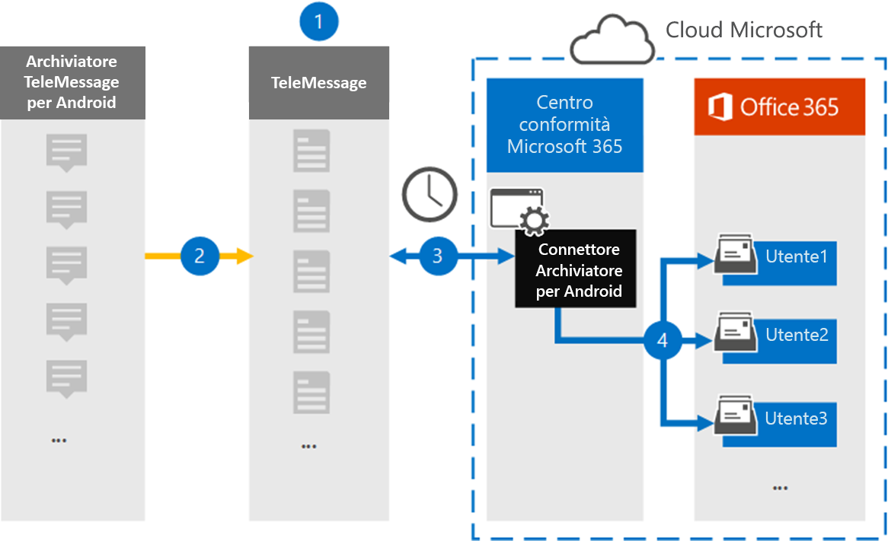

# Configurare un connettore per l'archiviazione dei dati per dispositivi mobili Android

Utilizzare un connettore TeleMessage nel centro conformità di Microsoft 365 per importare e archiviare SMS, MMS, chiamate vocali e registri di chiamata dai telefoni cellulari Android. Dopo aver configurato e configurato un connettore, si connette all'account del telemessaggio dell'organizzazione una volta al giorno e importa la comunicazione mobile dei dipendenti utilizzando l'archiviatore Android di telemessaggio per le cassette postali in Microsoft 365.

Dopo che i dati dei telefoni cellulari Android sono archiviati nelle cassette postali degli utenti, è possibile applicare le funzionalità di conformità di Microsoft 365, ad esempio i criteri di conservazione per controversia legale, ricerca contenuto e Microsoft 365, per i dati di archiviazione Android. Ad esempio, è possibile cercare la comunicazione mobile di Android Archiver utilizzando la ricerca contenuto o associare la cassetta postale contenente i dati del connettore di archiviazione Android con un custode in un caso avanzato di eDiscovery. L'utilizzo di un connettore di archiviazione Android per l'importazione e l'archiviazione dei dati in Microsoft 365 può aiutare l'organizzazione a rimanere conforme ai criteri governativi e normativi.

## Panoramica dell'archiviazione dei dati per dispositivi mobili Android

Nella panoramica seguente viene illustrato il processo di utilizzo di un connettore per l'archiviazione dei dati per dispositivi mobili Android in Microsoft 365.

1. L'organizzazione collabora con TeleMessage per configurare un connettore di archiviazione Android. Per ulteriori informazioni, vedere [Android Archiver](https://www.telemessage.com/office365-activation-for-android-archiver/).

2. Una volta ogni 24 ore, SMS, MMS, chiamate vocali e registri di chiamata provenienti dai telefoni cellulari Android dell'organizzazione vengono copiati nel sito di telemessaggio.

3. Il connettore di archiviazione Android creato nel centro conformità di Microsoft 365 si connette al sito di telemessaggio ogni giorno e trasferisce i dati Android dalle 24 ore precedenti in una posizione di memoria di Azure sicura nel cloud Microsoft. Il connettore converte i dati Android anche in un formato di messaggio di posta elettronica.

4. Il connettore importa gli elementi di comunicazione per dispositivi mobili sulla cassetta postale di un utente specifico. Verrà creata una nuova cartella denominata Android Archiver nella cassetta postale dell'utente specifico e gli elementi verranno importati. Il connettore esegue il mapping utilizzando il valore della proprietà dell' *indirizzo di posta elettronica dell'utente* . Ogni messaggio di posta elettronica contiene questa proprietà, che viene popolata con l'indirizzo di posta elettronica di ogni partecipante del messaggio di posta elettronica. Oltre a eseguire il mapping automatico degli utenti utilizzando il valore della proprietà dell' *indirizzo di posta elettronica dell'utente* , è anche possibile definire un mapping personalizzato caricando un file di mapping CSV. Questo file di mapping deve contenere il numero di cellulare dell'utente e l'indirizzo della cassetta postale di Microsoft 365 corrispondente per ogni utente. Se si Abilita il mapping automatico degli utenti e si fornisce un mapping personalizzato, per ogni elemento di posta elettronica il connettore osserverà per la prima volta il file di mapping personalizzato. Se non trova un utente valido di Microsoft 365 che corrisponde al numero di cellulare di un utente, il connettore utilizzerà la proprietà dell'indirizzo di posta elettronica dell'utente dell'elemento di posta elettronica. Se il connettore non trova un utente valido di Microsoft 365 nel file di mapping personalizzato o nella proprietà dell' *indirizzo di posta elettronica dell'utente* dell'elemento di posta elettronica, l'elemento non verrà importato.

## Prima di iniziare

Alcuni dei passaggi di implementazione necessari per archiviare i dati di comunicazione Android sono esterni a Microsoft 365 e devono essere completati prima di poter creare il connettore nel centro conformità.

- Ordinare il [servizio di archiviazione Android da TeleMessage](https://www.telemessage.com/mobile-archiver/order-mobile-archiver-for-o365) e ottenere un account di amministrazione valido per l'organizzazione. Sarà necessario accedere a questo account quando si crea il connettore.

- Registrare tutti gli utenti che richiedono il servizio di archiviazione Android nell'account TeleMessage. Quando si registrano gli utenti, assicurarsi di utilizzare lo stesso indirizzo di posta elettronica utilizzato per il proprio account Microsoft 365.

- Installare e attivare l'applicazione TeleMessage Android Archiver sui telefoni cellulari dei dipendenti.

- L'organizzazione deve autorizzare il servizio di importazione di Office 365 per accedere ai dati delle cassette postali nell'organizzazione. Sarà necessario fornire questo consenso quando si crea il connettore. Per acconsentire a questa richiesta, accedere a [Questa pagina](https://login.microsoftonline.com/common/oauth2/authorize?client_id=570d0bec-d001-4c4e-985e-3ab17fdc3073&response_type=code&redirect_uri=https://portal.azure.com/&nonce=1234&prompt=admin_consent), accedere con le credenziali di Microsoft 365 Global Admin e quindi accettare la richiesta. È necessario completare questo passaggio prima di poter creare correttamente un connettore di rete di&T.

- All'utente che crea un connettore di archiviazione Android deve essere assegnato il ruolo di importazione/esportazione delle cassette postali in Exchange Online. Questa operazione è necessaria per aggiungere connettori nella pagina **connettori dati** del centro conformità di Microsoft 365. Per impostazione predefinita, questo ruolo non è assegnato ad alcun gruppo di ruoli in Exchange Online. È possibile aggiungere il ruolo import export delle cassette postali al gruppo di ruoli Gestione organizzazione in Exchange Online. In alternativa, è possibile creare un gruppo di ruoli, assegnare il ruolo di esportazione delle cassette postali e quindi aggiungere gli utenti corretti come membri. Per ulteriori informazioni, vedere la sezione creare gruppi di [ruoli](https://docs.microsoft.com/Exchange/permissions-exo/role-groups#create-role-groups) o [modificare gruppi di ruoli](https://docs.microsoft.com/Exchange/permissions-exo/role-groups#modify-role-groups) nell'articolo "gestire i gruppi di ruoli in Exchange Online".

## Creare un connettore di archiviazione Android

L'ultimo passaggio consiste nel creare un connettore di archiviazione Android nel centro conformità di Microsoft 365. Il connettore utilizza le informazioni fornite per la connessione al sito di telemessaggio e trasferisce la comunicazione Android nelle caselle della cassetta postale dell'utente corrispondente in Microsoft 365.

1. Andare a [https://compliance.microsoft.com](https://compliance.microsoft.com) e fare clic su **Data Connectors**  >  **Android Archiver**.

2. Nella pagina Descrizione prodotto di **Android Archiver** fare clic su **Aggiungi connettore**.

3. Nella pagina **condizioni del servizio** fare clic su **Accetto**.

4. Nella pagina **accesso a telemessaggio** , in passaggio 3, immettere le informazioni necessarie nelle caselle seguenti e quindi fare clic su **Avanti**.

   - **Nome utente:** Nome utente del telemessaggio.

   - **Password:** La password del telemessaggio.

5. Dopo aver creato il connettore, chiudere la finestra popup e fare clic su **Avanti**.

6. Nella pagina **mapping utenti** abilitare il mapping automatico degli utenti e fare clic su **Avanti**. Nel caso in cui sia necessario un mapping personalizzato caricare un file CSV e fare clic su **Avanti**.

7. Fornire il consenso dell'amministratore e quindi fare clic su **Avanti**.

   Per fornire il consenso dell'amministratore, è necessario essere connessi con le credenziali di un amministratore globale di Office 365 e quindi accettare la richiesta di consenso. Se non è stato eseguito l'accesso come amministratore globale, è possibile accedere a [Questa pagina](https://login.microsoftonline.com/common/oauth2/authorize?client_id=570d0bec-d001-4c4e-985e-3ab17fdc3073&response_type=code&redirect_uri=https://portal.azure.com/&nonce=1234&prompt=admin_consent) ed eseguire l'accesso con le credenziali di amministratore globale per accettare la richiesta.

8. Esaminare le impostazioni e quindi fare clic su **fine** per creare il connettore.

9. Passare alla scheda Connettori della pagina **connettori dati** per visualizzare lo stato di avanzamento del processo di importazione per il nuovo connettore.

## Problemi noti

- Al momento, non è supportato l'importazione di allegati o elementi di dimensioni superiori a 10 MB. Il supporto per gli elementi di grandi dimensioni sarà disponibile in un secondo momento.
