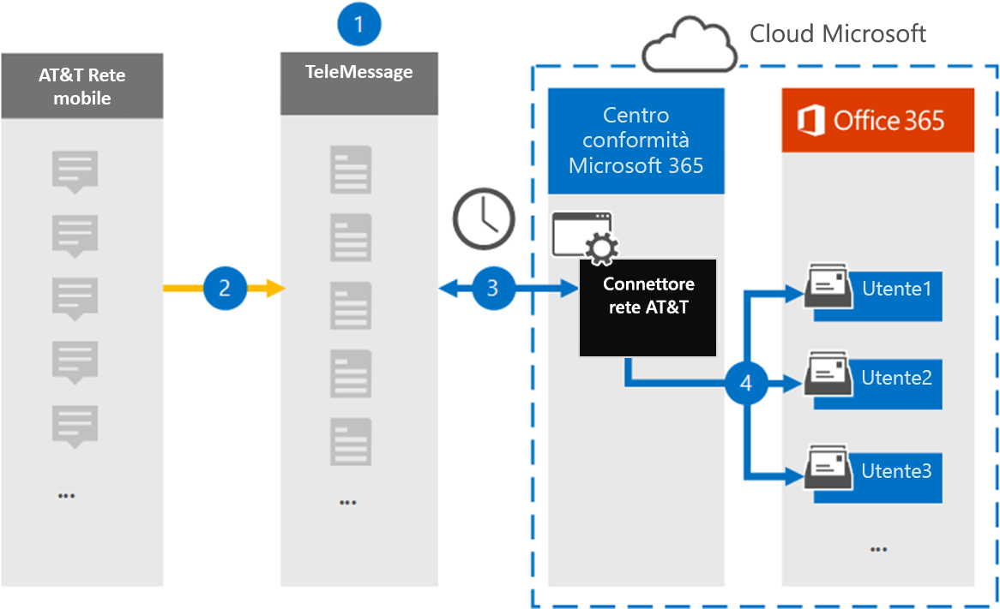

# Configurare un connettore per archiviare i dati AT&T SMS/MMSSet up a connector to archive AT&T SMS/MMS data

Utilizzare un connettore TeleMessage nel centro Microsoft 365 conformità per importare e archiviare i dati SMS MMS da AT&T Mobile Network.Use a TeleMessage connector in the Microsoft 365 compliance center to import and archive SMS and MMS data from AT&T Mobile Network. Dopo aver configurato e configurato un connettore, si connette alla rete AT&T dell'organizzazione una volta al giorno e importa i dati di SMS e MMS nelle cassette postali in Microsoft 365.After you set up and configure a connector, it connects to your organization's AT&T Network once every day, and imports SMS and MMS data to mailboxes in Microsoft 365.

Dopo l'archiviazione dei messaggi SMS e MMS nelle cassette postali degli utenti, è possibile applicare funzionalità di conformità di Microsoft 365, ad esempio conservazione per controversia legale, Ricerca contenuto e criteri di conservazione Microsoft 365 ai dati di at&T Network.After SMS and MMS messages are stored in user mailboxes, you can apply Microsoft 365 compliance features such as Litigation Hold, Content Search, and Microsoft 365 retention policies to AT&T Network data. Ad esempio, è possibile cercare i dati di rete AT&T utilizzando Ricerca contenuto o associare la cassetta postale che contiene i dati del connettore di rete AT&T a un responsabile in un caso Advanced eDiscovery.For example, you can search AT&T Network data using Content Search or associate the mailbox that contains the AT&T Network connector data with a custodian in an Advanced eDiscovery case. L'utilizzo di un connettore di rete AT&T per importare e archiviare i dati in Microsoft 365 può aiutare l'organizzazione a rimanere conforme ai criteri governativi e normativi.Using a AT&T Network connector to import and archive data in Microsoft 365 can help your organization stay compliant with government and regulatory policies.

## Panoramica dell'archiviazione dei dati di&TOverview of archiving AT&T Network data

Nella panoramica seguente viene illustrato il processo di utilizzo di un connettore per archiviare i dati di at&T Network in Microsoft 365.The following overview explains the process of using a connector to archive AT&T Network data in Microsoft 365.

1. L'organizzazione collabora con TeleMessage per configurare un connettore at&T Network.Your organization works with TeleMessage to set up an AT&T Network connector. Per informazioni, vedere [AT&T Network Archiver](https://www.telemessage.com/office365-activation-for-atnt-network-archiver/).For information, see [AT&T Network Archiver](https://www.telemessage.com/office365-activation-for-atnt-network-archiver/).

2. In tempo reale, SMS messaggi MMS dalla rete AT&T dell'organizzazione vengono copiati nel sito TeleMessage.In real time, SMS and MMS messages from your organization's AT&T Network are copied to the TeleMessage site.

3. Il connettore di rete AT&T creato nel Centro conformità Microsoft 365 si connette ogni giorno al sito TeleMessage e trasferisce i messaggi SMS e MMS dalle 24 ore precedenti a una posizione Archiviazione di Azure sicura nel cloud Microsoft.The AT&T Network connector that you create in the Microsoft 365 compliance center connects to the TeleMessage site every day and transfers the SMS and MMS messages from the previous 24 hours to a secure Azure Storage location in the Microsoft cloud. Il connettore converte anche il contenuto dei messaggi SMS MMS in un formato di messaggio di posta elettronica.The connector also converts the content of SMS and MMS messages to an email message format.

4. Il connettore importa gli elementi di comunicazione mobile nella cassetta postale di utenti specifici.The connector imports the mobile communication items to the mailbox of specific users. Nella cassetta postale dell'utente viene creata una nuova cartella denominata **AT&T SMS/MMS Network Archiver** e gli elementi vengono importati in essa.A new folder named **AT&T SMS/MMS Network Archiver** is created in the user's mailbox and the items are imported to it. Il connettore esegue questo mapping utilizzando il valore della proprietà Indirizzo di posta elettronica *dell'utente.*The connector does this mapping by using the value of the *User's Email address* property. Ogni SMS e mms contiene questa proprietà, che viene popolata con l'indirizzo di posta elettronica di ogni partecipante del messaggio.Every SMS and MMS message contains this property, which is populated with the email address of every participant of the message.
 
   Oltre al mapping automatico degli utenti utilizzando il valore della proprietà Indirizzo di posta elettronica *dell'utente,* è anche possibile definire un mapping personalizzato caricando un file di mapping CSV.In addition to automatic user mapping using the value of the *User’s Email address* property, you can also define a custom mapping by uploading a CSV mapping file. Questo file di mapping contiene il numero di telefono cellulare e l Microsoft 365 indirizzo di posta elettronica corrispondente per gli utenti dell'organizzazione.This mapping file contains the mobile phone number and corresponding Microsoft 365 email address for users in your organization. Se si abilita sia il mapping automatico degli utenti che il mapping personalizzato, per ogni elemento di posta elettronica il connettore esamina innanzitutto il file di mapping personalizzato.If you enable both automatic user mapping and custom mapping, for every email item the connector first looks at the custom mapping file. Se non trova un utente Microsoft 365 valido che corrisponde a un numero di cellulare, il connettore utilizza i valori nella proprietà dell'indirizzo di posta elettronica dell'elemento che sta tentando di importare.If it doesn't find a valid Microsoft 365 user that corresponds to a mobile phone number, the connector uses the values in the email address property of the item it's trying to import. Se il connettore non trova un utente Microsoft 365 valido nel file di mapping personalizzato o nella proprietà dell'indirizzo di posta elettronica dell'elemento di posta elettronica, l'elemento non verrà importato.If the connector doesn't find a valid Microsoft 365 user in either the custom mapping file or in the email address property of the email item, the item won't be imported.

## Prima di iniziareBefore you begin

Alcuni dei passaggi di implementazione necessari per archiviare i dati di at&T Network sono esterni a Microsoft 365 e devono essere completati prima di poter creare il connettore nel Centro conformità.Some of the implementation steps required to archive AT&T Network data are external to Microsoft 365 and must be completed before you can create the connector in the compliance center.

- Ordinare [il servizio di archiviazione per dispositivi mobili da TeleMessage](https://www.telemessage.com/mobile-archiver/order-mobile-archiver-for-o365/) e ottenere un account di amministrazione valido per l'organizzazione.Order the [mobile archiver service from TeleMessage](https://www.telemessage.com/mobile-archiver/order-mobile-archiver-for-o365/) and get a valid administration account for your organization. Sarà necessario accedere a questo account quando si crea il connettore nel Centro conformità.You'll need to sign into this account when you create the connector in the compliance center.

- Ottieni il tuo account AT&T e i dettagli di contatto di fatturazione in modo da poter compilare i moduli di onboarding di TeleMessage e ordinare il servizio di archiviazione dei messaggi da AT&T.Obtain your AT&T account and billing contact details so you can fill-out the TeleMessage onboarding forms and order the message archiving service from AT&T.

- Registrare tutti gli utenti che richiedono l'archiviazione&T SMS/MMS Network nell'account TeleMessage.Register all users that require AT&T SMS/MMS Network archiving in the TeleMessage account. Quando si registrano gli utenti, assicurarsi di usare lo stesso indirizzo di posta elettronica utilizzato per l'account Microsoft 365 account.When registering users, be sure to use the same email address that's used for their Microsoft 365 account.

- I dipendenti devono disporre di telefoni cellulari di proprietà aziendale e responsabili dell'azienda nella rete mobile AT&T.Your employees must have corporate-owned and corporate-liable mobile phones on the AT&T mobile network. L'archiviazione dei messaggi Microsoft 365 non è disponibile per i dispositivi BYOD (Bring Your Own Devices) o di proprietà dei dipendenti.Archiving messages in Microsoft 365 isn't available for employee-owned or "Bring Your Own Devices (BYOD) devices.

- All'utente che crea un connettore di rete AT&T deve essere assegnato il ruolo Esportazione importazione cassette postali in Exchange Online.The user who creates a AT&T Network connector must be assigned the Mailbox Import Export role in Exchange Online. Questa operazione è necessaria per aggiungere connettori nella pagina **Connettori** dati nel Centro Microsoft 365 conformità.This is required to add connectors in the **Data connectors** page in the Microsoft 365 compliance center. Per impostazione predefinita, questo ruolo non è assegnato ad alcun gruppo di ruoli in Exchange Online.By default, this role isn't assigned to any role group in Exchange Online. È possibile aggiungere il ruolo Esportazione importazione cassette postali al gruppo di ruoli Gestione organizzazione in Exchange Online.You can add the Mailbox Import Export role to the Organization Management role group in Exchange Online. In caso contrario, è possibile creare un gruppo di ruoli, assegnare il ruolo Importazione/Esportazione cassette postali e quindi aggiungere gli utenti appropriati come membri.Or you can create a role group, assign the Mailbox Import Export role, and then add the appropriate users as members. Per ulteriori informazioni, vedere le sezioni [Create role groups](/Exchange/permissions-exo/role-groups#create-role-groups) o Modify role [groups](/Exchange/permissions-exo/role-groups#modify-role-groups) nell'articolo "Manage role groups in Exchange Online".For more information, see the [Create role groups](/Exchange/permissions-exo/role-groups#create-role-groups) or [Modify role groups](/Exchange/permissions-exo/role-groups#modify-role-groups) sections in the article "Manage role groups in Exchange Online".

## Creare un connettore di&ATCreate a AT&T Network connector

Dopo aver completato i prerequisiti descritti nella sezione precedente, è possibile creare un connettore di rete AT&T nel Centro Microsoft 365 conformità.After you've completed the prerequisites described in the previous section, you can create an AT&T Network connector in the Microsoft 365 compliance center. Il connettore utilizza le informazioni fornite per connettersi al sito TeleMessage e trasferire i messaggi SMS e MMS alle caselle delle cassette postali dell'utente corrispondenti in Microsoft 365.The connector uses the information you provide to connect to the TeleMessage site and transfer SMS and MMS messages to the corresponding user mailbox boxes in Microsoft 365.

1. Passare a [https://compliance.microsoft.com](https://compliance.microsoft.com/) e quindi fare clic su **Connettori dati** AT&rete  \  **T**.Go to [https://compliance.microsoft.com](https://compliance.microsoft.com/) and then click **Data connectors** \ **AT&T Network**.

2. Nella pagina **at&T Network product** description fare clic su Add **connector**On the **AT&T Network product** description page, click **Add connector**

3. Nella pagina **Condizioni di servizio** fare clic su **Accetta.**On the **Terms of service** page, click **Accept**.

4. Nella pagina **Accesso a TeleMessage,** in Passaggio 3, immettere le informazioni necessarie nelle caselle seguenti e quindi fare clic su **Avanti.**On the **Login to TeleMessage** page, under Step 3, enter the required information in the following boxes and then click **Next**.

   - **Nome utente:** Nome utente TeleMessage.**Username:** Your TeleMessage username.

   - **Password:** Password TeleMessage.**Password:** Your TeleMessage password.

5. Dopo aver creato il connettore, è possibile chiudere la finestra popup e passare alla pagina successiva.After the connector is created, you can close the pop-up window and go to the next page.

6. Nella pagina **Mapping utenti** abilitare il mapping automatico degli utenti.On the **User mapping** page, enable automatic user mapping. Per abilitare il mapping personalizzato, caricare un file CSV contenente le informazioni sul mapping degli utenti e quindi fare clic su **Avanti.**To enable custom mapping, upload a CSV file that contains the user mapping information, and then click **Next**.

7. Rivedere le impostazioni e quindi fare clic **su Fine** per creare il connettore.Review your settings, and then click **Finish** to create the connector.

8. Passare alla **scheda Connettori** nella pagina **Connettori** di dati nel Centro conformità per visualizzare l'avanzamento del processo di importazione per il nuovo connettore.Go to the **Connectors** tab on the **Data connectors** page in the compliance center to see the progress of the import process for the new connector.

## Problemi notiKnown issues

- Al momento non è possibile importare allegati o elementi di dimensioni superiori a 10 MB.At this time, we don't support importing attachments or items that are larger than 10 MB. Il supporto per gli elementi più grandi sarà disponibile in un secondo momento.Support for larger items will be available at a later date.
