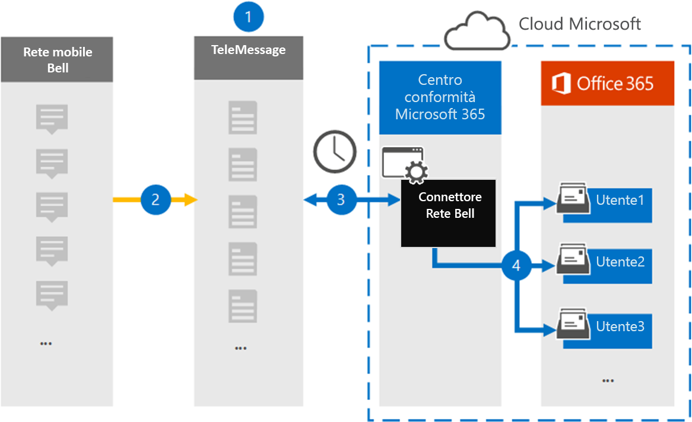

# Configurare un connettore per l'archiviazione dei dati di rete delle campane

Utilizzare un connettore di invio di messaggi nel centro conformità di Microsoft 365 per importare e archiviare i messaggi SMS (Short Messaging Service) e MMS (Multimedia Messaging Service) dalla rete dei campanelli. Dopo aver configurato e configurato un connettore, si connette alla rete dei campanelli dell'organizzazione una volta al giorno e Importa messaggi SMS e MMS alle cassette postali in Microsoft 365.

Dopo che i messaggi SMS e MMS sono archiviati nelle cassette postali degli utenti, è possibile applicare le funzionalità di conformità di Microsoft 365 come il blocco per controversia legale, la ricerca di contenuto e i criteri di conservazione di Microsoft 365 ai dati di rete Bell. Ad esempio, è possibile eseguire la ricerca per SMS/MMS di rete tramite ricerca contenuto o associare la cassetta postale contenente i dati del connettore di rete Bell con un custode in un caso di eDiscovery avanzato. L'utilizzo di un connettore di rete Bell per l'importazione e l'archiviazione dei dati in Microsoft 365 può aiutare l'organizzazione a rimanere conforme ai criteri governativi e normativi.

## Panoramica dei dati di rete delle campane di archiviazione

Nella panoramica seguente viene illustrato il processo di utilizzo di un connettore per archiviare i dati di rete delle campane in Microsoft 365.

1. L'organizzazione opera con telemessaggio e campanello per configurare un connettore di rete per le campane. Per ulteriori informazioni, vedere [Bell Network Archiver](https://www.telemessage.com/office365-activation-for-bell-network-archiver).

2. Una volta ogni 24 ore, i messaggi SMS e MMS provenienti dalla rete del campanello dell'organizzazione vengono copiati nel sito di telemessaggio.

3. Il connettore di rete del campanello creato nel centro conformità Microsoft 365 si connette al sito di telemessaggio ogni giorno e trasferisce i messaggi SMS e MMS dalle 24 ore precedenti a una posizione di archiviazione sicura di Azure nel cloud Microsoft. Il connettore converte anche il contenuto dei messaggi SMS e MMS in un formato di messaggio di posta elettronica.

4. Il connettore importa gli elementi di comunicazione per dispositivi mobili nella cassetta postale di utenti specifici. Una nuova cartella denominata **Bell SMS/MMS Network Archiver** viene creata in una cassetta postale di un utente specifico e gli elementi vengono importati. Il connettore esegue questo mapping utilizzando il valore della proprietà dell' *indirizzo di posta elettronica dell'utente* . Ogni messaggio SMS e MMS contiene questa proprietà, che viene popolata con l'indirizzo di posta elettronica di ogni partecipante del messaggio.

   Oltre a eseguire il mapping automatico degli utenti utilizzando il valore della proprietà dell' *indirizzo di posta elettronica dell'utente* , è anche possibile definire un mapping personalizzato caricando un file di mapping CSV. Questo file di mapping contiene il numero di cellulare e l'indirizzo di posta elettronica Microsoft 365 corrispondente per gli utenti dell'organizzazione. Se si abilitano sia il mapping degli utenti automatici che il mapping personalizzato, per ogni elemento di rete del campanello il connettore cerca innanzitutto il file di mapping personalizzato. Se non trova un utente valido di Microsoft 365 che corrisponde al numero di cellulare di un utente, il connettore utilizzerà i valori della proprietà dell'indirizzo di posta elettronica dell'elemento che sta tentando di importare. Se il connettore non trova un utente valido di Microsoft 365 nel file di mapping personalizzato o nella proprietà dell'indirizzo di posta elettronica dell'elemento di rete Bell, l'elemento non verrà importato.

## Informazioni preliminari

Alcuni dei passaggi di implementazione necessari per archiviare i dati di rete delle campane sono esterni a Microsoft 365 e devono essere completati prima di poter creare un connettore nel centro conformità.

- Ordinare il [servizio Archiver di rete di Bell da TeleMessage](https://www.telemessage.com/mobile-archiver/order-mobile-archiver-for-o365/) e ottenere un account di amministrazione valido per l'organizzazione. Sarà necessario accedere a questo account quando si crea il connettore nel centro conformità.

- Ottenere il vostro account di rete Bell e i dettagli dei contatti per la fatturazione in modo da poter compilare i moduli di onboarding del telemessaggio e ordinare il servizio di archiviazione dei messaggi da Bell.

- Registrare tutti gli utenti che richiedono l'archiviazione di rete di Bell SMS/MMS nell'account TeleMessage. Quando si registrano gli utenti, assicurarsi di utilizzare lo stesso indirizzo di posta elettronica utilizzato per il proprio account Microsoft 365.

- I dipendenti devono disporre di telefoni cellulari di proprietà aziendale e responsabili per le aziende sulla rete di telefonia mobile Bell. L'archiviazione dei messaggi in Microsoft 365 non è disponibile per i dispositivi di proprietà dei dipendenti o "Bring Your Own Devices (BYOD).

- All'utente che crea un connettore di rete Bell deve essere assegnato il ruolo di importazione/esportazione delle cassette postali in Exchange Online. Questa operazione è necessaria per aggiungere connettori nella pagina **connettori dati** del centro conformità di Microsoft 365. Per impostazione predefinita, questo ruolo non è assegnato ad alcun gruppo di ruoli in Exchange Online. È possibile aggiungere il ruolo import export delle cassette postali al gruppo di ruoli Gestione organizzazione in Exchange Online. In alternativa, è possibile creare un gruppo di ruoli, assegnare il ruolo di esportazione delle cassette postali e quindi aggiungere gli utenti corretti come membri. Per ulteriori informazioni, vedere la sezione creare gruppi di [ruoli](https://docs.microsoft.com/Exchange/permissions-exo/role-groups#create-role-groups) o [modificare gruppi di ruoli](https://docs.microsoft.com/Exchange/permissions-exo/role-groups#modify-role-groups) nell'articolo "gestire i gruppi di ruoli in Exchange Online".

## Creare un connettore di rete di Bell

L'ultimo passaggio consiste nel creare un connettore di rete di Bell nel centro conformità di Microsoft 365. Il connettore utilizza le informazioni fornite per la connessione al sito di telemessaggio e il trasferimento dei messaggi SMS/MMS nelle caselle della cassetta postale dell'utente corrispondente in Microsoft 365.

1. Andare a [https://compliance.microsoft.com](https://compliance.microsoft.com) e quindi fare clic su **connettori dati**  >  **Bell SMS/MMS Network Archiver**.

2. Nella pagina Descrizione prodotto di **rete di Bell** fare clic su **Aggiungi connettore**

3. Nella pagina **condizioni del servizio** fare clic su **Accetto**.

4. Nella pagina **accesso a telemessaggio** , in passaggio 3, immettere le informazioni necessarie nelle caselle seguenti e quindi fare clic su **Avanti**.

   - **Nome utente:** Nome utente del telemessaggio.

   - **Password:** La password del telemessaggio.

5. Dopo aver creato il connettore, è possibile chiudere la finestra popup e passare alla pagina successiva.

6. Nella pagina **mapping utenti** abilitare il mapping automatico degli utenti. Per abilitare il mapping personalizzato, caricare un file CSV che contiene le informazioni di mapping degli utenti e quindi fare clic su **Avanti**.

7. Esaminare le impostazioni e quindi fare clic su **fine** per creare il connettore.

8. Passare alla scheda **connettori** della pagina **connettori dati** del centro conformità per visualizzare lo stato di avanzamento del processo di importazione per il nuovo connettore.

## Problemi noti

- Al momento, non è supportato l'importazione di allegati o elementi di dimensioni superiori a 10 MB. Il supporto per gli elementi di grandi dimensioni sarà disponibile in un secondo momento.
